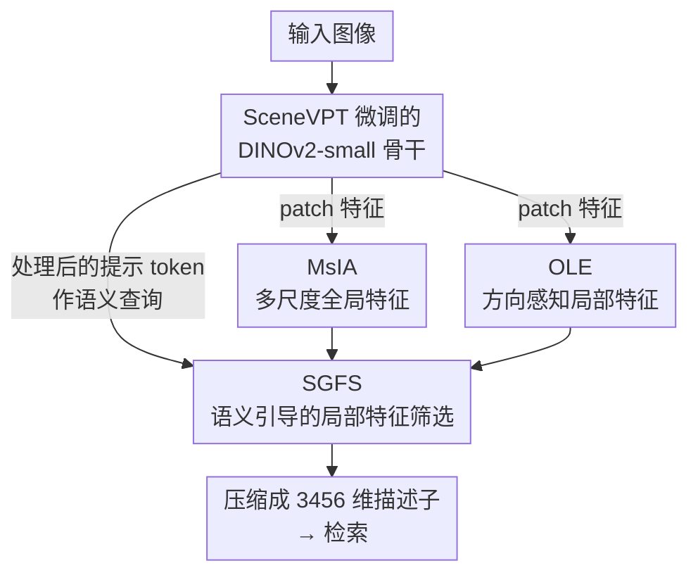

# EfficientVPR: Toward Efficient Visual Place Recognition via Scene-Aware Prompt Tuning and Adaptive Feature Enhancement

**会议**: CVPR 2026  
**论文**: [CVF Open Access](https://openaccess.thecvf.com/content/CVPR2026/html/Tang_EfficientVPR_Toward_Efficient_Visual_Place_Recognition_via_Scene-Aware_Prompt_Tuning_CVPR_2026_paper.html)  
**代码**: https://github.com/WiniTang/EfficientVPR  
**领域**: 3D视觉  
**关键词**: 视觉地点识别, 视觉提示微调, 参数高效微调, 局部特征增强, DINOv2  

## 一句话总结
用一套"场景自适应的视觉提示微调（SceneVPT）+ 实例相关的关键局部特征增强模块"在最轻的 DINOv2-small 上做单阶段视觉地点识别，描述子只有 3456 维，却把同规模方法全部超过，相比 DINOv2-large 的两阶段 SOTA 提速约 73× 而平均 R@1 只差 2.5% 以内。

## 研究背景与动机
**领域现状**：视觉地点识别（VPR）的任务是把一张查询图与预建数据库做特征匹配从而定位，是自动驾驶和机器人导航的底层能力。它必须同时兼顾三件事：对环境变化（视角、季节、光照、域漂移）鲁棒、内存占用小、推理实时。为了提鲁棒性，主流做法之一是**两阶段重排序**：先全局检索出候选，再用存下来的关键局部特征做几何一致性校验（如 RANSAC）。

**现有痛点**：重排序虽然准，但要额外存局部特征、检索时间显著变长，内存和时延都上去了。于是单阶段方法成了主流，它们通过重设计骨干、模型适配、更强的特征聚合来扛环境变化。但单阶段方法仍有三个硬伤：（i）它们偏向学"通用 VPR 特征"，却忽略了样本相关的判别性区域——而这恰恰是重排序所利用的信息（同一根街灯，在不同上下文里可能是关键线索，也可能是背景噪声）；（ii）现有方法在适配基础模型时，要么没把模型容量用满，要么破坏了预训练特征；（iii）输出维度往往很高，内存吃紧。

**核心矛盾**：要在**轻量骨干**（DINOv2-small）上拿到高判别力，就会撞上两个矛盾——压缩骨干容量后，模型更依赖全局主导模式、更难保住关键局部细节，在部分重叠的视角变化场景里会被"非重叠区域"带偏（图 4 那种：查询图里的树在正确参考图里根本不存在，模型却凭这些无关元素匹配到了视觉相似的错误地点）；同时，紧凑的特征空间在微调时极易灾难性遗忘，因为低秩微调子空间几乎和原生表示空间重叠。

**本文目标**：做一个**单阶段、轻量**的 VPR 框架，既能在小骨干上自适应不同样本/场景，又不靠重排序就能强化关键局部特征，还要输出低维描述子。

**核心 idea**：用**动态提示**代替静态提示或 adapter 来微调骨干（每个样本激活不同的提示），并用**骨干自带的语义先验**当查询信号去筛选、增强样本相关的关键局部特征，把"重排序才有的局部判别力"塞进单阶段编码里。

## 方法详解

### 整体框架
EfficientVPR 是一个单阶段流水线：输入图经过用 **SceneVPT** 微调过的 DINOv2-small 骨干，得到 patch 特征序列和处理后的提示 token；随后特征增强分两路——**MsIA** 抽多尺度全局特征、**OLE** 抽方向感知的局部结构特征；两路特征拼接后，**SGFS** 以骨干输出的样本相关提示为查询信号，通过交叉注意力筛选并增强任务/样本关键的局部区域，最后压成一个低维（3456 维）全局描述子用于检索。整套方法没有重排序阶段，所有判别力都凝在这一次前向里。

### 关键设计

**1. SceneVPT：让提示随样本动态变，而不是学一个"平均提示"**

针对"adapter 直接改 token、破坏预训练特征，而原始 VPT 的提示又是静态、场景无关的"这个痛点，作者在 VPT-deep 基础上加了一个**自适应提示选择机制**。直觉是：一个地点的视觉外观会剧烈且不可预测地变化，单一静态提示被迫去表示所有条件的"平均值"，对具体查询必然次优。SceneVPT 在逐层优化时，**保留对当前样本相关的提示、替换掉无关的**，而判断"是否相关"完全复用骨干已有的注意力、不引入额外参数：用 ViT 中能总结全局信息的 CLS token 对各提示的注意力权重来给提示重新加权。

具体地，第 $i$ 层第 $j$ 个提示的过滤权重为 $\alpha_{ij} = \text{sigmoid}(s'_j - \gamma)$，其中 $s'_j = s_j / \sum_{k=1}^{N_p} s_k$ 是归一化后的 CLS–提示注意力权重（$s_j$ 取自第 $i{-}1$ 层），$\gamma$ 是可学习阈值。每层送入微调的提示由两部分混合而成：上一层保留下来的样本相关提示 $Z^P_{i-1}$ 和新引入的可学习提示 $P_i$：

$$\hat P_{i-1} = \alpha_i \cdot Z^P_{i-1} + (1_{N_p} - \alpha_i) \cdot P_i, \quad i \ge 2$$

于是逐层的微调写成 $(Z^{CLS}_i, Z^P_i, Z_i) = L_i([Z^{CLS}_{i-1}, \hat P_{i-1}, Z_{i-1}])$。这样做有两层好处：一是真正做到**样本自适应**——不同输入在每层激活不同提示；二是**分级微调缓解灾难性遗忘**——动态调节新提示的插入程度，让模型既学到 VPR 任务，又最大程度保住 DINOv2-small 本就紧凑、易被覆盖的预训练知识。整套机制里需要手调的超参只有提示个数 $N_p$。

**2. MsIA（多尺度交互注意力）：补回轻骨干丢掉的多尺度全局上下文**

单阶段方法主抓全局结构，但小骨干的全局表达容易单一。MsIA 先把骨干输出的特征序列 $f_0$ 空间重建回特征图 $f$，再用标准多尺度结构在 $s \in \{1,2,4\}$ 三个尺度上下采样，得到的特征图展平拼接成多尺度序列 $f_{multi} \in \mathbb{R}^{N' \times C}$（$N' = \sum_{s} \frac{H}{s}\times\frac{W}{s}$）。然后以 $f_0$ 为 query、$f_{multi}$ 为 key/value 做多头注意力，**自适应地融合不同尺度的上下文**，让全局特征在不同感受野间动态加权，而不是简单池化平均。

**3. OLE（方向感知局部增强器）：用非对称卷积 + 正交融合保住斜视下的结构线索**

即使在斜视/大视角变化下，局部纹理和结构关系往往仍然保留，OLE 就是要强化这类容易被全局表示淹没的方向性局部特征。它同样把 $f_0$ 重建成特征图 $f$，然后用**双路非对称卷积**——水平核 $1\times 3$ 与垂直核 $3\times 1$——分别抽出水平/垂直方向的局部连续性，得到 $f_h$ 与 $f_v$。为避免两路方向信息被简单相加而冗余，作者做了一个**非线性正交融合**：先把 $f_v$ 经 GeM 池化 + MLP 压成通道标量 $f'_v$（垂直统计的非线性摘要），再算它与水平特征 $f_h$ 的空间相关 $S$，并做正交投影分解得到几何上互补的特征：

$$f'_h = f_h - \frac{S}{\|f'_v\|_2 + \varepsilon} \cdot f'_v$$

其中 $\varepsilon$ 用于数值稳定。最后把正交化后的 $f'_h$ 与 $f_v$ 经 $1\times 1$ 卷积融合、展平，作为方向增强的局部特征 $f_{OLE}$。正交分解的意义在于：**剥掉两个方向的冗余分量，留下真正互补的结构信息**，而不是让水平、垂直特征彼此重叠。

**4. SGFS（语义引导的特征筛选器）：用骨干自带的样本提示当"重排序的平替"**

这是把"重排序的局部判别力"塞进单阶段的关键一步。痛点是：单阶段编码整图时会被非重叠区域干扰（图 4 的树），而重排序要额外存局部特征、太贵。SGFS 改用**骨干最后一层处理过的提示** $Z^P_L$ 作语义查询信号——因为这些提示已经被样本特定地调制过，天然携带"这张图里什么是关键属性"的语义。它先用自注意力精炼提示语义（受 BoQ 启发）：

$$f'_g = Z^P_L + \text{Attention}(Z^P_L, Z^P_L, Z^P_L), \quad f'_g = \text{LayerNorm}(f'_g)$$

然后对 MsIA 与 OLE 拼接得到的局部特征 $f_l \in \mathbb{R}^{2N\times C}$，以 $f'_g$ 为 query 做交叉注意力，**按样本/任务相关性挑选并增强关键局部区域**：

$$f'_l = \text{Attention}(f'_g, f_l, f_l), \quad f_{out} = \text{LayerNorm}(f'_l)$$

最后再用一个线性投影把 $f_{out}$ 压缩到很低的维度（论文写从 $N_P$ 压到 8 ⚠️ 此处量纲表述以原文为准；最终全局描述子为 3456 维）。和靠几何校验的重排序相比，SGFS 不需要存局部特征、不需要 RANSAC，**用一次交叉注意力就实现了"样本自适应的关键区域强化"**，这正是它在域漂移严重的 AmsterTime 上涨点最猛的原因。

### 损失函数 / 训练策略
遵循 GSV-Cities 训练协议，在 GSV-Cities 上用 Multi-Similarity Loss（$\alpha{=}1,\beta{=}50,\lambda{=}0$）训练。采用分组优化：主参数初始学习率 $2\mathrm{e}{-}4$、骨干微调参数 $2\mathrm{e}{-}2$，每 5 epoch 衰减 $0.8\times$，最多 30 epoch，Adam 优化器。每个 batch 取 160 个地点、每地点随机采 4 张 $266\times266$ 图，测试图 resize 到 $322\times322$（比 NetVLAD/CosPlace 等用的 $480\times640$ 分辨率更低，却仍更好）。

## 实验关键数据

### 主实验
在 7 个基准（Pitts250k、MSLS-val、AmsterTime、Eynsham、SVOX 多天气/光照）上以 R@1/R@5 评测，仅用 DINOv2-S 骨干 + 3456 维（表中记 3k）描述子。

| 方法 | 骨干 | 维度(k) | Pitts250k R@1 | MSLS-val R@1 | AmsterTime R@1 | Eynsham R@1 | SVOX-Night R@1 |
|------|------|------|------|------|------|------|------|
| SALAD | DINOv2-S | 8 | 94.0 | 90.0 | 53.9 | 90.7 | 90.0 |
| BoQ（一阶段 SOTA） | DINOv2-S | 16 | 95.0 | 92.0 | 55.2 | 91.1 | 94.7 |
| SelaVPR（两阶段） | DINOv2-L | 500 | 95.7 | 90.8 | 55.6 | 90.6 | 90.3 |
| FoL（两阶段 SOTA） | DINOv2-S | 469 | 95.4 | 90.8 | 59.1 | 91.8 | 89.9 |
| **EfficientVPR** | DINOv2-S | **3** | **95.4** | **92.8** | **60.2** | **92.0** | 94.4 |

要点：用仅 BoQ 28%、SALAD 41% 的维度，平均 R@1 分别高 1.0% 和 2.4%；在域/场景变化剧烈的 AmsterTime 比 BoQ 高 5.0%、Eynsham 高 0.9%；对比更重的两阶段 FoL，平均 R@1 高 1.4% 而维度只有它的 0.6%，且 MSLS-val（大视角变化）高 2.0%、SVOX-night（极端光照）高 4.5%。

效率对比（Pitts250k 测时延，A800）：

| 方法 | 骨干 | 维度 | 总时延(ms) | 可训练参数(M) | 平均 R@1 |
|------|------|------|------|------|------|
| FoL | DINOv2-L | 5×10⁵ | 124.8 | 56.9 | 92.8 |
| BoQ | DINOv2-B | 12288 | 7.6 | 28.3 | 91.6 |
| SALAD | DINOv2-S | 8448 | 2.4 | 11.9 | 87.9 |
| BoQ | DINOv2-S | 12288 | 4.2 | 15.9 | 89.3 |
| **EfficientVPR** | DINOv2-S | 3456 | **3.1** | **7.7** | **90.3** |

EfficientVPR 以最少可训练参数（7.7M）拿到同规模最高平均 R@1，相比 DINOv2-large 的 FoL 提速约 73×、模型压缩约 10.4×，平均精度只差 2.5% 以内；描述子仅 BoQ 的 28.1%，内存占用比 SALAD 低 3×、比 BoQ 低 4.5×、比 FoL 低 165×。

### 消融实验

| 配置 | 含义 | Pitts250k R@1 | AmsterTime R@1 | SVOX-Over R@1 |
|------|------|------|------|------|
| MS-fc | 仅多尺度全局 + 线性头 | 94.2 | 47.1 | 96.1 |
| MS+OLE-fc | 加 OLE 局部 | 94.4 | 48.0 | 96.3 |
| MsIA+OLE-fc | MsIA + OLE，线性头 | 94.5 | 48.4 | 96.7 |
| **MsIA+OLE-SGFS** | 完整模型 | **95.0** | **55.2** | **97.9** |

微调策略消融（SGFS 此组替成线性层）：SceneVPT（0.15M）在三数据集为 94.5/48.4/96.7，全面优于 VPT-deep（0.15M，93.9/48.2/95.8）、Adapter（1.8M，94.1/47.7/96.4）、LoRA、Full-tuning（21.7M，36.8 在 AmsterTime 反而崩）和 Frozen（43.1）。

提示选择策略消融：Random 52.1 / Top-k 54.5 / 自适应加权 55.2（AmsterTime R@1），说明"软加权保留全部提示信息"优于"硬选 top-k"。

### 关键发现
- **SGFS 是涨点主力，且对域漂移尤其关键**：表 5 里从 `MsIA+OLE-fc` 换成 `MsIA+OLE-SGFS`，AmsterTime R@1 从 48.4 飙到 55.2（+6.8），而 Pitts250k 只升 0.5——印证它解决的正是"非重叠/域漂移场景下被无关区域带偏"的问题。
- **SGFS vs BoQ block**：把 SGFS 换成 BoQ block，AmsterTime 从 55.2 掉到 51.1（−4.1），证明"用样本相关提示当查询去筛局部特征"比通用聚合更强。
- **SceneVPT 在小骨干上抗遗忘**：Full-tuning 参数最多反而在 AmsterTime 崩到 36.8，而 SceneVPT 仅 0.15M 参数却到 48.4，说明动态分级提示确实保住了预训练知识。
- 输入分辨率越高越好（AmsterTime：224→266→322 对应 52.2→55.2→60.2），但作者主结果仍用相对低分辨率训练以保效率。

## 亮点与洞察
- **"复用骨干已有注意力做提示选择"很省**：SceneVPT 不引入额外模块，直接拿 CLS→提示的注意力权重重加权提示，相比 IAPT 那类"靠外接 adapter 生成实例提示"的方案，零额外参数却拿到样本自适应能力——这个"白嫖骨干注意力"的思路可迁移到其他 PEFT 场景。
- **把重排序的判别力前移到单阶段**：SGFS 用骨干输出的样本提示当查询去交叉注意力筛局部特征，等于在一次前向里近似了"存局部特征 + 几何校验"的效果，却不付重排序的存储/时延代价，这是全文最"啊哈"的设计。
- **OLE 的正交融合**：用 $f'_h = f_h - \frac{S}{\|f'_v\|_2+\varepsilon} f'_v$ 显式剥离水平/垂直方向的冗余分量，比直接相加更能逼出互补的结构线索，思路可借鉴到任何需要融合方向性特征的任务。

## 局限与展望
- 论文未公开报告对极端遮挡/夜间的失败案例占比，鲁棒性边界仍靠定性图（图 5）说明。
- ⚠️ SGFS 末尾"把 $f_{out}$ 从 $N_P$ 压到 8"的量纲与最终 3456 维描述子之间的换算原文表述较简，复现时需对照代码确认。
- 方法仍依赖 DINOv2 这类强预训练骨干，SceneVPT 的提示选择是否在非 ViT 骨干上同样有效未验证。
- 自适应提示选择只用了 CLS→提示的一阶注意力，是否能进一步用更高阶/跨层的样本统计是可延伸方向。

## 相关工作与启发
- **vs Adapter 类（CricaVPR / SelaVPR）**：它们逐层插 adapter 直接改 token，虽比全微调省，但破坏预训练特征、且增模型复杂度；本文用提示（外加 token、只经注意力调制）不动原 token，保住了泛化性。
- **vs 原始 VPT**：VPT-deep 的提示静态、场景无关；SceneVPT 加自适应选择让提示随样本动态保留/替换，AmsterTime 上由此显著领先。
- **vs 两阶段重排序（FoL / R2Former）**：它们靠存局部特征 + 几何校验提鲁棒，但时延/内存大；SGFS 用提示引导的交叉注意力在单阶段内近似该判别力，提速 73× 而精度仅差 2.5% 内。
- **vs BoQ / SALAD（单阶段聚合）**：本文以更小维度（3456 vs 12288/8448）和更少可训练参数（7.7M）超过它们，关键在 SGFS 的样本自适应筛选 + SceneVPT 的抗遗忘微调。

## 评分
- 新颖性: ⭐⭐⭐⭐ 自适应提示选择 + 提示引导局部筛选两个点都有针对性，虽是组合式创新但动机扎实。
- 实验充分度: ⭐⭐⭐⭐⭐ 7 基准 + 跨规模效率对比 + 4 组消融，把每个模块和提示策略都拆开验证了。
- 写作质量: ⭐⭐⭐⭐ 机制讲得清、动机紧扣痛点，个别公式量纲略简。
- 价值: ⭐⭐⭐⭐⭐ 在轻量骨干上把单阶段 VPR 的精度/效率/内存三者同时推到同规模 SOTA，工程落地价值高。

<!-- RELATED:START -->

## 相关论文

- [\[CVPR 2026\] AsymLoc: Towards Asymmetric Feature Matching for Efficient Visual Localization](asymloc_towards_asymmetric_feature_matching_for_efficient_visual_localization.md)
- [\[AAAI 2026\] VPN: Visual Prompt Navigation](../../AAAI2026/3d_vision/vpn_visual_prompt_navigation.md)
- [\[NeurIPS 2025\] On Geometry-Enhanced Parameter-Efficient Fine-Tuning for 3D Scene Segmentation](../../NeurIPS2025/3d_vision/on_geometry-enhanced_parameter-efficient_fine-tuning_for_3d_scene_segmentation.md)
- [\[CVPR 2026\] H²A²: Homogeneity-Aware and Heterogeneity-Aware Feature Perception for Unified Indoor 3D Object Detection](h2a2_homogeneity-aware_and_heterogeneity-aware_feature_perception_for_unified_in.md)
- [\[ECCV 2024\] Improving 2D Feature Representations by 3D-Aware Fine-Tuning](../../ECCV2024/3d_vision/improving_2d_feature_representations_by_3d-aware_fine-tuning.md)

<!-- RELATED:END -->
