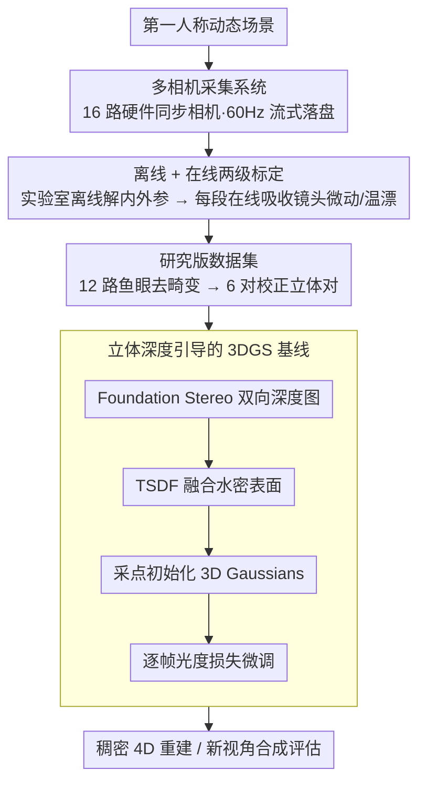

# Ego-1K: A Large-Scale Multiview Video Dataset for Egocentric Vision

**会议**: CVPR 2026  
**arXiv**: [2603.13741](https://arxiv.org/abs/2603.13741)  
**代码**: [数据集](https://huggingface.co/datasets/facebook/ego-1k)  
**领域**: 3D视觉  
**关键词**: 第一人称视觉, 多视角数据集, 动态场景重建, 新视角合成, 手物交互

## 一句话总结

提出 Ego-1K，一个包含 956 段短视频的大规模时间同步第一人称多视角视频数据集（12+4 相机、60Hz），填补了第一人称动态 3D 重建领域的数据空白，并展示立体深度引导可大幅提升 4D 新视角合成质量。

## 研究背景与动机

混合现实设备和第一人称世界建模需要从佩戴者视角进行逼真的 4D 重建。但现有数据集存在关键缺口：

- **NVS 数据集**（如 Neural 3D Video、DiVA360）：提供多视角但为外心视角（exocentric），缺乏第一人称视角
- **第一人称数据集**（如 Ego4D、EPIC-KITCHENS）：规模大但以单目/双目为主，关注活动识别而非 3D 重建
- **多视角第一人称数据集**（如 EgoExo4D、HOT3D）：仅 2-3 个第一人称相机，视角数量不足

核心需求：**同时满足大规模、高相机数、第一人称视角、精确同步**的动态场景数据集。该数据集特有的挑战包括近距离手部运动带来的大视差、快速图像运动和频繁遮挡。

## 方法详解

### 整体框架

Ego-1K 不是算法论文，而是一篇数据集 + 基准论文：它要回答的问题是「能不能从佩戴者视角稠密重建动态 4D 场景」，而要回答这个问题首先得有数据。整篇工作沿着「采集 → 标定 → 整理 → 评估」四步展开：先用一套自制的多相机头戴设备把 16 路视频精确同步采下来，再用离线 + 在线两级标定把相机几何对齐，然后去畸变整理成易用的立体对发布出去，最后配上立体一致性和 4D 新视角合成两套评估协议，并给出一个立体深度引导的 3DGS 基线，证明在这份数据上「先把几何初始化好」比堆时序模型更管用。

### 关键设计

**1. 多相机采集系统：用 16 路硬件同步相机把第一人称动态场景拍稠密**

现有头戴设备最多 2-3 个相机，远不足以支撑稠密 3D 重建，所以作者干脆定制了一套头戴装置：以 Quest 3 头显（4 个前向相机）为基座，外挂 12 个外部鱼眼相机（8MP 全局快门、190° FOV、f2.8），全部 16 个相机经无线同步器硬件同步到 60Hz。12 个外部相机走 USB 3.1（双 8 端口适配器）连到背包电脑，以 8-bit raw Bayer 流式落盘；另配 2 个 iToF 传感器（30Hz 交替采集）和 800Hz 的 IMU，瞬时原始码率约 15 GB/s。选全局快门而非卷帘，正是为了让快速手部运动下各路图像逐行同步不撕裂——这是后面立体匹配能成立的前提。

**2. 离线 + 在线两级标定：让镜头微动和温漂不毁掉立体几何**

光是把相机拼起来还不够，近距离立体重建对几何精度极敏感。作者先在实验室用 5 块大型 Calibu 标定板做离线标定，一次性解出所有相机的内外参；但头戴设备在使用中镜头会有 0.1-0.2° 的旋转微动，温度变化又会让焦距漂移（折算成 1-3 像素的偏移），这些误差足以让深度估计崩坏。于是每段录像还要做在线标定：固定其余参数，只优化相机朝向和焦距来吸收这些漂移。效果很直接——在线标定让立体一致性的中位 MAD 评分再降 35%。

**3. 研究版数据集：把 12 路鱼眼整理成 6 对校正立体对方便直接用**

原始鱼眼数据畸变大、不好直接喂给立体/NVS 方法，作者把 12 个鱼眼相机两两去畸变成 6 对校正立体对（1280×1280、130° 水平 FOV），让使用者拿到的就是规整的 rectified 立体输入。研究版刻意剔除了 Quest 3 的 RGB 相机，因为它们是卷帘快门，分辨率与色彩配置都和外部相机不一致，混进来反而污染几何。代价是数据量不小：单段录像约 19 GB，完整研究版约 17.5 TB。

**4. 立体深度引导的 3DGS 基线：用立体基础模型的几何先验救活逐帧重建**

作者跑基线时发现一个关键现象：现成 NVS 方法在这份数据上普遍很差，但立体基础模型却能给出相当可靠的深度。既然瓶颈在几何初始化而非时序建模，那就把好几何喂给 3DGS。具体做法是先用 Foundation Stereo 双向（L→R 与 R→L）跑出每对的深度图，再用 TSDF 把所有立体深度融合成一张水密表面，从这张表面采点（带法线和颜色）来初始化 3D Gaussians；之后只需少量迭代微调，最小化光度损失

$$\mathcal{L}=(1-\lambda)\mathcal{L}_1 + \lambda\mathcal{L}_{\text{D-SSIM}},\quad \lambda=0.1$$

每帧独立优化、逐帧串起来就构成稠密 4D 重建。这条路绕开了端到端动态模型在大视差 + 自运动下的失效，把重活交给已经训得很好的立体先验。

### 损失函数 / 训练策略

- 评估不涉及模型训练，仅微调 3DGS
- 训练/测试划分：10 个训练视角 + 2 个测试视角（目标立体对 3-4）
- 实验子集：10% 数据集（96 段录像）

## 实验关键数据

### 主实验

4D NVS 重建评估（目标对 3-4 为测试视角，其余 10 个视角训练）：

| 方法 | PSNR ↑ | SSIM ↑ | LPIPS ↓ |
|------|--------|--------|---------|
| 3DGS（逐帧） | 21.22 | 0.709 | 0.260 |
| K-Planes | 16.46 | 0.597 | 0.443 |
| Spacetime Gaussians | 24.76 | 0.780 | 0.270 |
| **3DGS + 立体引导** | **29.12** | **0.830** | **0.115** |

立体引导比原始 3DGS 提升 7.9 dB PSNR，比 Spacetime Gaussians 提升 4.4 dB。

### 消融实验

立体方法一致性评估（将 5 对视差图 warp 到目标对计算一致性）：

| 立体方法 | MAD ↓ (mm) | MAD<1mm ↑ | SD ↓ (mm) |
|----------|-----------|-----------|----------|
| **Foundation Stereo** | **1.6** | **74.0%** | 42.5 |
| Selective-Stereo | 8.0 | 0.0% | 46.2 |
| BiDAStereo | 2.2 | 3.1% | **8.3** |
| StereoAnywhere | 1.7 | 29.5% | 10.4 |

Foundation Stereo 整体一致性最佳（MAD 最低），BiDAStereo 极端离群值最少（SD 最低）。

### 关键发现

- 现有 NVS 方法（3DGS、K-Planes）在第一人称动态场景中严重不足，K-Planes 仅 16.46 dB
- 动态模型（K-Planes、Spacetime Gaussians）是为物体中心或固定位姿多视角视频设计的，无法有效处理自运动 + 近距离手部运动 + 大视差的组合
- 对于近距离动态物体（手），性能差距更大；对于远处物体（旁观者），差距较小
- 在线标定对立体估计精度至关重要，使 MAD 降低 35%

## 亮点与洞察

- 填补了一个明确的数据空白：领域内首个同时满足大规模 + 高相机数 + 第一人称 + 精确同步的动态场景数据集
- 提出的立体一致性评估协议（无需 GT 深度）非常实用，可迁移到其他多视角系统
- 核心发现有启发性：逐帧初始化比端到端动态模型更有效，关键瓶颈在于几何初始化而非时序建模
- 数据集设计细节值得学习：在线标定、全局快门选择、鱼眼去畸变参数选择等工程决策都有充分理由

## 局限与展望

- Quest 3 的 4 个相机未纳入研究版数据集（卷帘快门差异），利用率可提升
- iToF 数据因运动伪影和相位歧义未使用，未来可结合多模态融合
- 当前基线是逐帧 3DGS，缺乏时序一致性建模；可探索时空正则化或场景流先验
- 数据集聚焦手物交互，场景多样性可进一步扩展（如户外、多人协作）
- 原始数据集 88 TB，存储和带宽门槛较高
- 缺乏语义标注（手部关键点、物体类别等），限制了下游任务评测

## 相关工作与启发

- **Ego4D / EgoExo4D**：大规模第一人称数据集，但相机少、关注活动识别
- **Neural 3D Video / DiVA360**：多视角 NVS 数据集，但为外心视角
- **Foundation Stereo**：表现最佳的立体基础模型，作为几何先验效果显著
- **3DGS**：新视角合成骨干，+ 立体初始化大幅提升
- 启发：随着智能眼镜普及，第一人称多视角重建是重要方向；几何先验比纯学习方法更可靠

## 评分

- 新颖性: ⭐⭐⭐ 数据集贡献为主，方法侧立体引导思路较直觉但验证充分
- 实验充分度: ⭐⭐⭐⭐ 立体评估 + NVS 评估 + 多基线对比，评估协议设计严谨
- 写作质量: ⭐⭐⭐⭐ 数据集描述详尽，表格对比全面，工程细节充分
- 价值: ⭐⭐⭐⭐ 填补了明确数据空白，将推动第一人称 3D/4D 重建研究

<!-- RELATED:START -->

## 相关论文

- [\[CVPR 2026\] SpatialVID: A Large-Scale Video Dataset with Spatial Annotations](spatialvid_a_large-scale_video_dataset_with_spatial_annotations.md)
- [\[CVPR 2026\] SceneScribe-1M: A Large-Scale Video Dataset with Comprehensive Geometric and Semantic Annotations](scenescribe-1m_a_large-scale_video_dataset_with_comprehensive_geometric_and_sema.md)
- [\[CVPR 2026\] OLATverse: A Large-scale Real-world Object Dataset with Precise Lighting Control](olatverse_a_large-scale_real-world_object_dataset_with_precise_lighting_control.md)
- [\[CVPR 2026\] 3DReflecNet: A Large-Scale Dataset for 3D Reconstruction of Reflective, Transparent, and Low-Texture Objects](3dreflecnet_a_large-scale_dataset_for_3d_reconstruction_of_reflective_transparen.md)
- [\[CVPR 2026\] Scaling4D: Pushing the Frontier of Video Novel View Synthesis through Large-Scale Monocular Videos](scaling4d_pushing_the_frontier_of_video_novel_view_synthesis_through_large-scale.md)

<!-- RELATED:END -->
