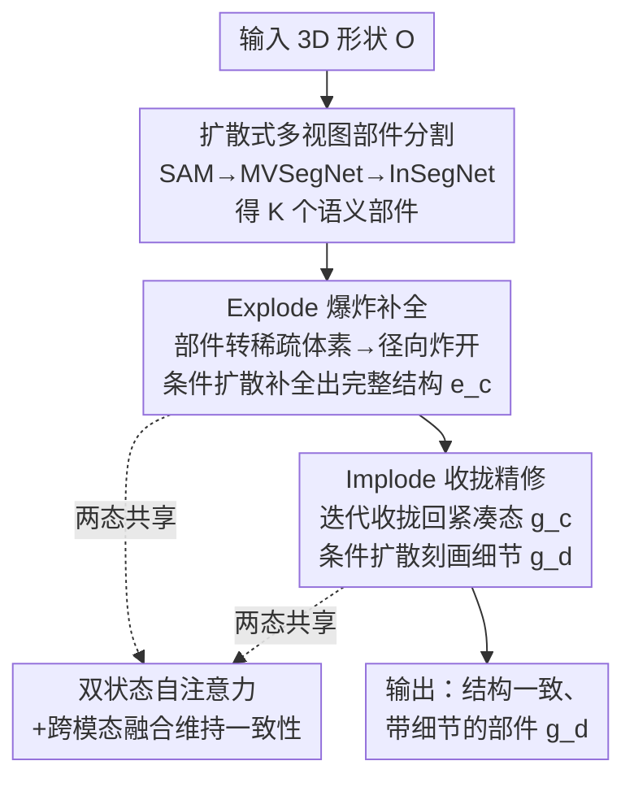

# EI-Part: Explode for Completion and Implode for Refinement

**会议**: CVPR 2026  
**论文**: [CVF Open Access](https://openaccess.thecvf.com/content/CVPR2026/html/Sun_EI-PartExplode_for_Completion_and_Implode_for_Refinement_CVPR_2026_paper.html)  
**代码**: 无开源（项目页 https://cvhadessun.github.io/EI-Part/）  
**领域**: 3D视觉  
**关键词**: 部件级3D生成, 爆炸-收拢策略, 稀疏体素, 结构化扩散, 结构一致性  

## 一句话总结
EI-Part 提出"先爆炸后收拢"（Explode-Implode）的部件级 3D 生成框架：把分割出的不完整部件**炸开**到分散状态以腾出空间补全结构，再**收拢**回紧凑状态把全部分辨率留给细节精修，并在两个状态都用自注意力维持部件间结构一致，最终在 Voxel IoU / CD / F-Score 上全面超过 HoloPart、X-Part、OmniPart 等 SOTA。

## 研究背景与动机
**领域现状**：开放世界 3D 生成（CLAY、TripoSG、HunYuan3D、TRELLIS 等）已能从图像/文本直接生成高保真整体几何，但大多输出的是**单体（monolithic）网格**——没有部件级分解，下游的编辑、绑定、动画都难以进行。于是"部件级生成"成为一条关键支线：要把一个 3D 形状拆成**结构连贯、几何合理、细节逼真、且生成高效**的若干部件。

**现有痛点**：作者把已有部件生成方法的失败按四条标准归类——

- **结构一致性差**：HoloPart 把每个部件当成独立 latent 集合、各自独立生成，忽略了部件之间的关系，补全像"单纯补洞"，拼起来不协调。
- **几何不合理**：OmniPart 用体素自适应分配分辨率，但在**合并态**下分配体素会造成部件间体素重叠（补全时产生歧义），且只能在包围盒内的 active voxel 里补全，无法向盒外扩张。
- **细节不准**：BANG 把所有部件塞进单一 latent 集合、PartPacker 用双 latent 集合，单部件表达容量被压缩，几何细节不足。
- **效率低**：PartCrafter / X-Part 用跨注意力提升一致性，但依赖**定长**部件 token——大部件表达力不够、小部件浪费容量，资源分配低效。

**核心矛盾**：部件补全（要"占地方"才能长出合理结构）和细节精修（要"高分辨率"才能刻画表面）对**空间分辨率**的需求是冲突的；在**同一个合并/固定布局**里同时满足两者，要么补全受限（盒内、重叠），要么细节被稀释。

**本文目标**：在同一框架里既给补全足够的空间扩展、又给精修足够的分辨率，同时保持部件间一致性与效率。

**切入角度**：既然两个阶段对"空间"的诉求不同，那就**让部件的空间布局随阶段切换**——补全时把部件炸开占满空间、精修时再收拢回来。

**核心 idea**：用 **Explode（爆炸）做补全、Implode（收拢）做精修**的两态稀疏体素扩散——不同阶段复用同一套体素，但通过改变部件的空间排布，把分辨率"全用在刀刃上"。

## 方法详解

### 整体框架
输入一个 3D 形状 $O$，输出是一组**独立、结构一致、几何合理且带精细细节**的部件 $g_d$。整条管线分三段串行：① **扩散式部件分割**先把 $O$ 切成 $K$ 个语义部件 $\{p^k_s\}$；② **爆炸补全**把这些不完整部件转成稀疏体素并径向炸开，在分散态下做条件扩散补全，得到完整但粗糙的部件结构 $e_c$；③ **收拢精修**再把补全后的体素收拢回紧凑态 $g_c$，做第二次条件扩散，刻画细粒度几何，输出 $g_d$。两次扩散都在结构化 latent 空间进行，并都用自注意力让各部件互相"看见"彼此以保持一致。

### 关键设计

**1. 扩散式多视图部件分割：用 2D 纹理化思路得到边界清晰的 3D 部件**

直接做 3D 分割（如 PartField、P3-SAM）受限于 3D 分辨率，边界往往糊；纯 2D 投影到 3D 又会在遮挡/不可见区域出错。作者借鉴 3D 纹理化的两阶段套路：先从六个正交视角渲染**法线图** $\{n_i\}_{i=1}^6$ 和**规范坐标图（CCM）** $\{c_i\}_{i=1}^6$，用 SAM 得到正面分割 $s_1$，把它们一起喂给多视图分割扩散模型 **MVSegNet** 生成六视角一致的分割；再把多视图分割反投影到 3D，交给**修补模型 InSegNet** 学一个**连续 3D 语义场**，对每个表面点 $x$ 查询语义颜色 $\hat S(x)=\text{InSegNet}(x, f_{2D}, f_{3D})$，用 L1 监督 $L_{seg}=\frac{1}{n}\sum_i |\hat S(x_i)-S(x_i)|$。这样既继承了 2D 基础模型的泛化与清晰边界，又靠语义场补齐遮挡区域，密采样后得到 $K$ 个全局一致、无缝的部件 $\{p^k_s\}$，为后续补全提供干净输入。

**2. Explode for Completion：把部件炸开，腾出空间做无歧义补全**

部件分割只给出**不完整**的形状，必须补全成可用的完整结构。OmniPart 的教训是：在合并态分配体素会让部件互相重叠、且只能在包围盒内补全。作者反其道而行——先把 $\{p^k_s\}$ 转成显式稀疏体素 $\{v^k_s\}$（大部件占多体素、小部件占少体素，天然按尺寸自适应分配、比定长 token 高效），再借鉴 BANG 的爆炸思路做**爆炸向量优化**：对每个部件算轴对齐包围盒，优化一个平移向量把体素从收敛态径向往外推到分散态 $e_s=\text{Explode}(\{v^k_s\})$，并**记录每个部件的平移方向 $\{u_k\}$ 和距离 $\{d_k\}$**（供后续收拢复位）。炸开后部件之间不再有体素重叠歧义、且补全可以越出原包围盒，从而获得更大的可用分辨率。补全本身建模成条件结构化扩散 $p_\theta(e_c \mid e_s, n_1)$：以正面法线图 $n_1$ 和爆炸体素 $e_s$ 为条件，用 rectified-flow + DiT，按 Conditional Flow Matching 训练

$$\mathcal{L}_{CFM}(\theta)=\mathbb{E}_{x_0,t,\epsilon}\,\lVert v_\theta(x,t)-(\epsilon-x_0)\rVert_2^2 .$$

条件特征上，法线图经 DINOv2 得 2D token $D_n$，不完整部件经 SS-VAE 编码得体素条件特征 $E_s$，最终生成完整部件的结构化 latent $E_c$ 并解码出粗糙完整体素 $e_c$。

**3. Implode for Refinement：再把部件收拢，把分辨率全留给细节**

补全阶段刻意"占地方"换结构合理性，代价是细节被稀释。于是作者把补全好的爆炸态体素**收拢**回紧凑态，让有限分辨率重新聚焦到表面细节。收拢不是简单按爆炸距离原路退回（$m'_k = m_k - d_k\cdot u_k$），而是**迭代逼近中心**：先按到中心的距离对所有部件排序，再以步长 $\alpha$ 沿反方向逐步移动

$$m^{j+1}_k = m^j_k - \alpha\cdot u_k,$$

一旦部件间发生碰撞就停止——这样能在不穿插的前提下把部件尽量挤紧，得到紧凑完整体素 $g_c$。精修同样是条件扩散 $p_\theta(g_d \mid g_c, e_c, n_1)$，把收拢体素 $g_c$、爆炸完整体素 $e_c$ 和法线 token $D_n$ 一起作为条件，仍用 CFM 损失训练。关键差异是这一阶段换用**更强的 Sparc3D VAE**（稀疏可变形 Marching Cubes 表征）来提取条件特征并解码目标几何 $g_d$，从而产出带精细几何细节的最终部件。

**4. 两态共享的自注意力 + 跨模态融合：让部件"互相看见"以保持结构一致**

无论补全还是精修，独立处理每个部件都会丢失部件间关系（HoloPart 的痛点）。作者在**爆炸态和收拢态都插入自注意力**，让各部件 latent 互相感知、再与法线条件做跨模态融合。补全阶段为

$$F_E = \text{CrossAttn}\big(D_n,\ \text{SelfAttn}(\text{Concat}(E_s, Z_t))\big),$$

精修阶段为

$$F_I = \text{CrossAttn}\big(D_n,\ \text{SelfAttn}(\text{Concat}(G_c, E_s\text{/}E_c, Z_t))\big),$$

其中 $Z_t$ 是第 $t$ 步的 latent 噪声。先用自注意力在拼接后的多部件 token 上做内部信息感知（结构一致性来源），再用交叉注意力把法线图的几何先验注入（保真度来源）。这一融合机制是贯穿补全与精修两个阶段的"粘合剂"，也是 EI-Part 同时拿到结构一致 + 高保真的关键。⚠️ 式 (5) 中拼接项原文记作 $\text{Concat}(G_c, E_c, Z_t)$，此处条件含义以原文为准。

### 损失函数 / 训练策略
- **分割**：MVSegNet 与 InSegNet 用 Adam、学习率 $3\times10^{-4}$，32 GPU 训练 4 天；InSegNet 用 L1 语义场损失 $L_{seg}$。
- **爆炸补全模型**：Adam、学习率 $1\times10^{-4}$、梯度裁剪 max-norm 1.0，64 GPU 训练 2 周；训练时以 0.3 概率注入零条件提升鲁棒性。
- **收拢精修模型**：在 Sparc3D checkpoint 上微调，Adam、学习率 $1\times10^{-4}$，64 GPU 训练 6 天。
- 两次扩散都用 rectified-flow 下的 Conditional Flow Matching（式 3）。

## 实验关键数据

数据来自 Objaverse / Objaverse-XL / ABO / 3D-FUTURE / HSSD，按"部件数≤20"过滤、按连通性切分子网格并按面数/面积/加权包围盒合并小块构造最终 GLB。评测用 PartVerse 基准，采样 100k 点计算 CD / IoU / F-Score（半径 0.1/0.05/0.01，Voxel 指标用 3D 体素）。

### 主实验
部件生成定量对比（↑越大越好，CD↓越小越好；BANG 为闭源商业产品无法定量对比）：

| 方法 | Voxel IoU↑ | CD↓ | Voxel F@0.01↑ | F@0.1↑ | F@0.05↑ | F@0.01↑ |
|------|-----------|------|---------------|--------|---------|---------|
| PartPacker | 0.2586 | 0.1273 | 0.3768 | 0.8199 | 0.6428 | 0.2435 |
| PartCrafter | 0.0742 | 0.3474 | 0.1316 | 0.4429 | 0.2801 | 0.0749 |
| HoloPart | 0.6106 | 0.0431 | 0.7374 | 0.9557 | 0.9402 | 0.6400 |
| X-Part | 0.7478 | 0.0599 | 0.8413 | 0.9256 | 0.9087 | 0.7923 |
| OmniPart | 0.2861 | 0.1431 | 0.4007 | 0.7911 | 0.6516 | 0.2644 |
| **EI-Part（本文）** | **0.7981** | **0.0194** | **0.8452** | **0.9910** | **0.9742** | **0.8129** |

本文在**全部 6 项指标**上都最优。最显著的是 CD 降到 0.0194（次优 HoloPart 0.0431，约降一半多），最严格的 F-Score@0.01 达 0.8129（次优 X-Part 0.7923），说明在保结构一致的同时细节精度也领先。值得注意的是 X-Part 的 Voxel IoU（0.7478）已较接近，但其 CD（0.0599）明显更差，印证"定长 token"在精度上的短板。

### 消融实验
⚠️ 论文正文的两组消融以定性图（Fig.5/Fig.6）呈现，对应定量数值置于补充材料，下表为定性结论：

| 配置 | 现象 | 说明 |
|------|------|------|
| 完整 EI-Part | 结构合理 + 细节精细 | 爆炸补全 + 收拢精修都在 |
| w/o Explode（无爆炸） | 部件几何不合理 | 缺爆炸态的空间扩展，补全受限、出现 implausible 结构 |
| w/o Implode（无收拢，只爆炸补全） | 缺乏细粒度细节 | 没有把分辨率收回来精修，表面糊 |
| 分割：用 PartField / P3-SAM 替换 | 分割更不准、边界模糊 | 本文 MVSegNet+InSegNet 分割更准、更有意义 |

### 关键发现
- **Explode 和 Implode 各司其职、缺一不可**：去掉爆炸 → 几何不合理（补全没空间）；去掉收拢 → 没细节（分辨率没聚焦）。两态切换正是把"补全要空间 / 精修要分辨率"的矛盾拆解到不同阶段。
- **分割质量是上游瓶颈**：Fig.4 让所有 baseline 共用本文分割结果后，EI-Part 仍在几何合理性与保真度上更好，说明增益不只来自分割，生成框架本身也在贡献；而 Fig.6 又表明本文分割优于 PartField/P3-SAM，是端到端质量的前提。
- **稀疏体素 + 自适应分配**比定长 token 更省、更准：大小部件按需占体素，避免 X-Part 那种"大件不够用、小件浪费"的失衡。

## 亮点与洞察
- **"按阶段切换空间布局"是很聪明的资源调度视角**：把分辨率当成稀缺资源，补全期炸开占满、精修期收拢聚焦——同一套体素在不同阶段服务不同目标，比一次性固定布局更灵活。这个"两态复用"思路可迁移到任何"粗结构 vs 精细节诉求冲突"的生成任务。
- **爆炸向量可逆**：记录 $\{u_k\},\{d_k\}$ 让收拢有据可依，且收拢用"迭代到碰撞为止"而非原路返回，能把部件挤得更紧、给细节腾更多分辨率——一个很实用的小设计。
- **自注意力贯穿两态**统一解决了一致性问题：不像 HoloPart 各部件独立、也不像 X-Part 受限定长 token，自注意力作用在变长拼接 token 上，兼顾一致性与尺寸灵活性。
- **复用纹理化范式做分割**：把"渲六视图 → 多视图扩散 → 反投影 → 学连续场"这套纹理化流程迁移到部件分割，拿到清晰边界，是跨任务方法迁移的好例子。

## 局限与展望
- **多阶段、重训练成本高**：分割 + 补全 + 精修三套模型分别在 32/64/64 GPU 上训练 4/14/6 天，复现门槛极高，且无开源代码。
- **依赖上游分割**：整条管线建立在分割正确之上，部件数被硬阈值限制在 ≤20，复杂物体（部件极多/极碎）可能受限。
- **无物理约束**：作者也承认未来要把物理原理融入生成，以应对需要高物理精度的复杂场景；当前部件补全/收拢主要是几何驱动。
- ⚠️ 关键消融（Explode/Implode）只有定性图、定量值在补充材料，正文无法直接量化各组件贡献大小。

## 相关工作与启发
- **vs HoloPart**：HoloPart 各部件独立生成、忽略部件关系导致结构不一致；EI-Part 用两态共享自注意力让部件互相感知，补全不再像"补洞"。
- **vs X-Part / PartCrafter**：它们用跨/部件注意力提升一致性，但依赖**定长 token**、对不同尺寸部件分配低效；EI-Part 用稀疏体素自适应分配 + 变长 token，资源利用更高效，CD/F-Score 明显更好。
- **vs OmniPart**：同样用体素，但 OmniPart 在合并态分配体素 → 部件重叠歧义、只能盒内补全；EI-Part 先爆炸消除重叠、并突破包围盒扩展补全空间。
- **vs BANG / PartPacker**：它们把部件压进单/双 latent 集合，单部件容量不足、细节差；EI-Part 给每部件独立体素表达并两阶段精修，保真度更高。

## 评分
- 新颖性: ⭐⭐⭐⭐⭐ "Explode-Implode 两态切换分辨率"的资源调度视角新颖且自洽，直击补全与精修的空间冲突。
- 实验充分度: ⭐⭐⭐⭐ 主表 6 指标全面领先且有共享分割的公平对比，但核心消融只给定性图、定量值藏补充材料。
- 写作质量: ⭐⭐⭐⭐⭐ 痛点按四条标准逐一对位 baseline，方法动机与机制讲得清晰。
- 价值: ⭐⭐⭐⭐ 部件级生成对编辑/动画很关键、效果 SOTA，但训练成本极高且未开源，落地门槛偏高。

<!-- RELATED:START -->

## 相关论文

- [\[CVPR 2026\] Part$^{2}$GS: Part-aware Modeling of Articulated Objects using 3D Gaussian Splatting](part2gs_part-aware_modeling_of_articulated_objects_using_3d_gaussian_splatting.md)
- [\[CVPR 2026\] GeoSAM2: Unleashing the Power of SAM2 for 3D Part Segmentation](geosam2_unleashing_the_power_of_sam2_for_3d_part_segmentation.md)
- [\[CVPR 2026\] VIAFormer: Voxel-Image Alignment Transformer for High-Fidelity Voxel Refinement](viaformer_voxel-image_alignment_transformer_for_high-fidelity_voxel_refinement.md)
- [\[CVPR 2026\] REVIVE 3D: Refinement via Encoded Voluminous Inflated prior for Volume Enhancement](revive_3d_refinement_via_encoded_voluminous_inflated_prior_for_volume_enhancemen.md)
- [\[CVPR 2026\] PartDiffuser: Part-wise 3D Mesh Generation via Discrete Diffusion](partdiffuser_part-wise_3d_mesh_generation_via_discrete_diffusion.md)

<!-- RELATED:END -->
