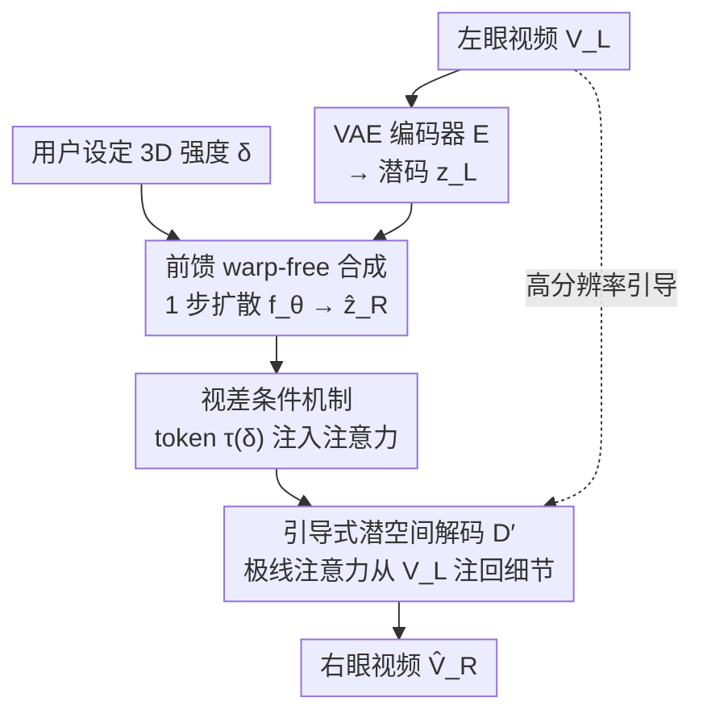

# Elastic3D: Controllable Stereo Video Conversion with Guided Latent Decoding

**会议**: CVPR 2026  
**论文**: [CVF Open Access](https://openaccess.thecvf.com/content/CVPR2026/html/Metzger_Elastic3D_Controllable_Stereo_Video_Conversion_with_Guided_Latent_Decoding_CVPR_2026_paper.html)  
**代码**: 项目页 https://elastic3d.github.io （代码未明确开源）  
**领域**: 3D视觉 / 视频生成 / 扩散模型  
**关键词**: 单目转立体, 立体视频转换, 引导式潜空间解码, 视差可控, 极线注意力  

## 一句话总结
Elastic3D 用一个 1 步条件潜扩散模型，把单目视频**直接**合成出右眼视频（不估深度、不做 warp），靠一个标量"视差因子"让用户连续调节 3D 强度，再用一个带极线注意力的"引导式 VAE 解码器"从左视图把高频细节注回右视图、消除双目竞争伪影，在三个真实立体视频数据集上全面超过 warp-based 和 warp-free 基线。

## 研究背景与动机
**领域现状**：VR/AR 内容暴涨但绝大多数视频是单目的，于是"单目转立体（mono-to-stereo）"成了刚需。主流范式是 **warp-and-refine**（深度-再-投影）：先用单目深度估计器算出场景深度，再按深度把左视图重投影到右眼视角，最后对空洞做修补。

**现有痛点**：这条管线有三处脆弱。其一，整套质量**被中间那个单目深度估计器卡死**——深度估计在细长结构、非朗伯表面上经常翻车，几何正确性的上限就是深度模型的上限；其二，warp 必然在**去遮挡区**（右视图新露出来、左视图看不到的地方）产生空洞和伪影；其三，这些方法多在 VAE 压缩潜空间里跑（LDM），而**通用解码器是个信息瓶颈**，没法从源视图重建出细节，导致左右眼看到的内容对不上——产生让人眩晕的 **双目竞争（binocular rivalry）** 伪影。

**核心矛盾**：最近的 Eye2Eye 绕过了深度估计，直接从单目输入生成第二视角，但它把两个关键能力丢了——**它没有任何控制 3D 强度的机制**（训练时绑死一个固定隐式基线），而 warp-based 方法天生能通过缩放深度图来调 3D 效果；而且它靠两阶段像素空间多步扩散精修，**慢到不可用**。于是"warp-free 的简洁 + warp-based 的可控 + 不掉细节"三者无法兼得。

**本文目标**：在一个 warp-free、前馈的模型里同时拿到（a）可连续调节的 3D 强度、（b）不丢高频细节/无双目竞争、（c）快。

**切入角度**：作者先在 §3 把"什么是好的立体模型"拆成 5 条性质（几何正确、3D 效果可控、立体保真/细节保留、合理去遮挡、时间稳定），然后发现前人方法各缺一两条；既然 warp 的好处只是"能调 3D"和"能从源视图取像素"，那就分别用**标量视差条件**和**引导式解码器**这两个轻量机制，在直接生成的框架里把这两点补回来。

**核心 idea**：用"标量视差条件 + 极线引导解码"替代"深度估计 + 几何 warp"，在 1 步潜扩散里直接合成可控、清晰的右眼视频。

## 方法详解

### 整体框架
输入是左眼视频 $V_L \in \mathbb{R}^{N\times H\times W\times 3}$，输出是同场景、水平平移视角的右眼视频 $\hat V_R$。整条管线建立在 Stable Video Diffusion 之上，但把多步去噪改成 **1 步前馈**，分三个环节：(1) 冻结的 VAE 编码器 $E$ 把 $V_L$ 压成潜码 $z_L$；(2) 合成网络 $f_\theta$ 在 1 步内**直接**生成右视图潜码 $\hat z_R$，同时吃进一个表示 3D 强度的视差条件 token $\tau(\delta)$；(3) **引导式解码器** $D'$ 用 $\hat z_R$ 和原始高分辨率左视频 $V_L$ 一起把右视图解出来，沿极线把左视图的高频细节注回去。整体可写成

$$\hat V_R = D'\big(f_\theta(0,\, z_L,\, \tau(\delta)),\, V_L\big),\qquad z_L = E(V_L)$$

其中 $0$ 是替代噪声输入的零向量（1 步、无需迭代采样）。注意 $V_L$ 在解码端被"二次使用"——这是绕过潜瓶颈的关键。

### 关键设计

**1. 前馈 warp-free 合成：把"深度+warp"换成一步直接生成**

针对"被单目深度估计器卡死、去遮挡产生空洞"这个根因，本文干脆不估深度、不做 warp。基于 Stable Video Diffusion，借助 1 步去噪（把潜去噪器当成一个前馈网络用），$f_\theta$ 直接由左视频潜码 $z_L$ 合成**整段**右视频潜码 $\hat z_R = f_\theta(0, z_L, \tau(\delta))$，而不是像 warp-based 方法那样去精修一个已经 warp 好的视频。这样做有两个连带好处：一是没有了中间深度模型，几何正确性不再被它上限锁死，模型**隐式学到了一个面向生成任务的深度估计器**（实验里它的视差误差反而最低）；二是 1 步前馈让训练可以直接加**图像空间损失**（L1/SSIM/LPIPS 反传过冻结 VAE 解码器），相比纯潜空间损失能进一步提质量。代价是相比"只做修补"的 warp 方法，直接合成不同立体设置下的右视图本身更难，所以才需要后面两个机制兜底。

**2. 视差条件机制：一个标量旋钮连续控制 3D 强度**

warp-free 方法最缺的就是"调 3D 效果"，因为它没有可缩放的深度图。本文引入一个标量视差代理 $\delta\in\mathbb{R}$ 来直接控制输入视图与生成右视图之间的像素视差量，把它投影成 token 嵌入 $\tau(\delta)$ 注入到模型的空间注意力层。训练时 $\delta$ 取**第一帧左→右真值视差图的中位数**：

$$\delta = P_{50}\big(D^{0}_{L\to R}\big)$$

选中位数是因为它对离群点不敏感、又能直观刻画整段视频的总体立体强度（作者也试过均值/最大值，同样可行）。这个设计的妙处在于它**只依赖"左右视差"这个量、完全不需要相机标定参数**——于是可以在未标定的"野外"已矫正视频对 $(V_L, V_R)$ 上训练。为了让模型泛化到训练集没见过的基线范围，作者还做**视差数据增广**：对每个样本，把真值视差图随机缩放因子 $s$、用简单前向 warp 生成一张新的"伪右视图 GT"、并用缩放后的 $\tau(s\cdot\delta)$ 当条件；真实样本用完整复合损失，合成样本只用 mask 掉无效像素的 L1。推理时用户直接以像素为单位拨动 $\delta$ 即可（如图 3，δ 越大立体感越强）。

**3. 引导式潜空间解码：用极线注意力从左视图注回高频细节**

这是消除双目竞争的核心。VAE 的信息瓶颈（SVD 压缩比高达 1:48）是双目竞争的主因——标准 SVD 解码器**连 GT 潜码都解不好**，会丢失甚至幻觉出微观细节。本文把解码重新表述成一个**引导式潜空间上采样**任务：解码器 $D'$ 同时吃合成潜码 $\hat z_R$ 和原始左视频 $V_L$。一个从 VAE 编码器初始化的提取网络 $G$ 把 $V_L$ 处理成逐帧的多尺度引导特征金字塔 $\{g_1,\dots,g_N\}$，当作一个"信息蓄水池"。在解码器的每个上采样块 $i$，每个特征向量 $h_i(p)$（query）**只对引导图 $g_i$ 中对应极线上的 key/value 做交叉注意力**；由于是已矫正立体，极线退化成同一水平行，注意力变成一维行内对应。细化后的特征以**残差**方式注回：

$$h'_i(p) = h_i(p) + A_{\text{epipolar}}\big(h_i(p),\, g_i\big)$$

极线约束不仅几何上合理，还把全交叉注意力复杂度从 $O(H^2W^2)$ 降到 $O(HW^2)$——在 512×512 的最高层特征图上，16-bit 注意力矩阵显存需求从不可行的 128 GB 降到 256 MB。工程上 $D'$ 用标准解码器 $D$ 的权重初始化、$G$ 用编码器 $E$ 的权重初始化、注意力的输出投影**零初始化**（训练初期先退化成原解码器再慢慢学）。解码器**单独训练**、与几何合成核 $f_\theta$ 解耦，因此是即插即用的——直接换到第三方框架（如 M2SVid）上无需重训也能涨点。

### 损失函数 / 训练策略
- **合成网络 $f_\theta$**：1 步扩散的复合损失，等权重组合 L2 潜空间损失 + 像素空间 L1 + SSIM + LPIPS（后三者反传过冻结 VAE 解码器）；真实对用完整复合损失，增广合成对用 mask 后的 L1。
- **引导解码器 $D'$**：作为独立模块训练，目标是从 $z_R=E(V_R)$ 在 $V_L$ 引导下重建真值右视图 $V_R$，损失为 L1 + LPIPS。
- **训练数据**：Stereo4D（互联网视频，固定 63mm 基线）+ Ego4D（第一人称、大视差），512×512、N=16；用 FoundationStereo 估视差以计算 $\delta$。

## 实验关键数据

### 主实验
在 Apple Vision Pro（AVP，基线接近训练分布、但内容 OOD）上与 SOTA 对比：

| 方法 | PSNR↑ | SSIM↑ | LPIPS↓ | EMatch↓ | P-PSNR↑ | Disp.err↓ | Temp.err↓ |
|------|-------|-------|--------|---------|---------|-----------|-----------|
| SVG | 19.3 | 0.690 | 0.410 | 56.3 | 20.2 | 3.71 | 8.49 |
| StereoCrafter | 22.5 | 0.826 | 0.323 | 51.8 | 22.6 | 2.30 | 1.71 |
| M2SVid | 24.4 | 0.821 | 0.221 | 41.5 | 27.3 | 2.30 | 1.35 |
| Eye2Eye | 20.6 | 0.733 | 0.392 | 39.2 | 23.9 | 3.82 | 2.18 |
| **Elastic3D** | **25.9** | **0.894** | **0.196** | **30.9** | **28.4** | **1.74** | 1.31 |

在 Stereo4D 测试集上 Elastic3D 同样全类别第一，PSNR 26.1，比第二名 M2SVid 高 +1.5 dB；在 OOD 的 iPhone 数据（基线仅 19.2mm，标定+内容都 OOD）上拿到最佳 SSIM/LPIPS、PSNR 第二。

### 消融实验

| 配置 | 关键指标 | 说明 |
|------|---------|------|
| Elastic3D w/o 视差条件 (iPhone) | PSNR 18.7 / SSIM 0.703 | 预测固定≈63mm 基线，与 19.3mm 严重错位 |
| **+ 视差条件 (iPhone)** | **PSNR 22.5 / SSIM 0.890** | **+3.8 dB**，可生成任意 3D 强度 |
| Warp-based (DepthCrafter, AVP) | PSNR 24.5 / Disp.err 2.33 | 几何被单目深度模型上限锁死 |
| **Elastic3D 直接生成 (AVP)** | **PSNR 25.9 / Disp.err 1.74** | **+1.4 dB**，视差误差更低 |
| Elastic3D w/o 引导解码 $D'$ | EMatch 41.9 / LPIPS 0.212 | 双目竞争严重、细节糊 |
| **Elastic3D (含 $D'$)** | **EMatch 27.8 / LPIPS 0.176** | Matchability 误差 **−44%**，LPIPS −16%，PSNR +0.9 dB |
| M2SVid + $D'$（即插即用） | EMatch 39.6→24.8 / LPIPS −15% | 不重训直接换解码器也涨点 |

引导解码器单独评测（解码 GT 右视图潜码，Stereo4D）：相比 Stable Diffusion 解码器 PSNR 30.2→**34.3**（+4.1 dB）、LPIPS 0.106→**0.068**（−35%）。

### 关键发现
- **视差条件在 OOD 基线上收益最大**：训练基线≈63mm，到 19.3mm 的 iPhone 数据时，无条件模型因输出锁死在 63mm 视差而严重空间错位（PSNR 仅 18.7），加条件后 +3.8 dB——可控性不是锦上添花，而是跨设备落地的刚需。同时条件**不影响**几何精度（Disp.err 只评相对深度排序）。
- **引导解码器对"双目竞争"打击最直接**：去掉它 EMatch 从 27.8 飙到 41.9，加回来直接 −44%，且这个模块**可即插即用**地移植到别的框架（M2SVid 上 EMatch −34%、LPIPS −15%），说明"细节保留"和"几何合成"确实可解耦。
- **直接生成隐式学了更好的深度**：warp-based 的几何被现成单目深度模型上限卡死，Elastic3D 直接生成反而 Disp.err 最低（AVP 上 1.74 vs warp 2.33），印证"为生成任务端到端学几何"优于"先估深度再投影"。

## 亮点与洞察
- **把 warp 的两个优点拆成两个轻量机制补回**：warp 好在"能调 3D"和"能从源视图取像素"，本文分别用标量视差 token 和极线引导解码精准复刻这两点，而把 warp 的空洞/伪影/深度依赖全甩掉——这种"只保留优点、抛弃实现方式"的拆解很值得借鉴。
- **极线注意力是几何先验当工程加速器**：把交叉注意力限制在极线（已矫正后退化成水平一维行）既符合立体几何、又把复杂度从 $O(H^2W^2)$ 砍到 $O(HW^2)$，128 GB→256 MB，是"对的物理约束顺便省显存"的范例。
- **解码器与合成核解耦 → 即插即用**：把"低层纹理重建"从"几何合成"里拆出来单独训练，使引导解码器成了可移植组件，能直接给别人的方法续命，复用价值很高。
- **用中位视差当条件去掉标定依赖**：$\delta=P_{50}$ 这个看似朴素的选择，让模型能在海量未标定野外立体视频上训练，是数据可扩展性的关键一步。

## 局限与展望
- **直接生成在大幅偏离训练基线时仍吃力**：iPhone（19.2mm）上 PSNR 只排第二（落后 M2SVid），作者也承认对"只做修补"的 warp 方法而言，直接为不同立体设置合成右视图本就更难。
- ⚠️ **依赖真值/伪真值视差来定 $\delta$**：训练用 FoundationStereo 估视差、评测时给方法"中位视差"作为全局 3D 信息——真实部署中用户只能手动给 $\delta$，自动从单目内容推一个"合适"的 $\delta$ 仍是开放问题。
- **时间稳定性非最强项**：Temp.err 在多个表里只是接近最好而非全胜（如 AVP 上 1.31 vs StereoCrafter/M2SVid 的 1.71/1.35 互有高低），长视频时序抖动仍有空间。
- 作者把"为整条立体转换管线建标准化黑盒评测协议（4 维度指标）"也当作贡献，这套协议本身对后续工作比方法更有长期价值。

## 相关工作与启发
- **vs warp-based（M2SVid / StereoCrafter / SVG）**：它们走"深度-再-warp-再-修补"，几何被单目深度模型上限锁死、去遮挡有伪影、VAE 压缩导致双目竞争；本文直接潜空间合成 + 引导解码，Disp.err 和 EMatch 全面更低。
- **vs Eye2Eye**：同样 warp-free 直接生成，但 Eye2Eye 绑死固定隐式基线、**不能调 3D**，且两阶段像素空间多步扩散慢；本文加了标量视差条件（可控）和 1 步前馈（快），AVP 上 PSNR 25.9 vs 20.6。
- **vs 引导超分/Texture Bridge/极线 Transformer**：再注入源信息是引导超分、pansharpening、多视图生成的常用手段；本文的区别是**把轻量极线注意力直接塞进 VAE 解码器**，形成绕过瓶颈的结构化跳连，沿几何合理的极线"查找"细节。

## 评分
- 新颖性: ⭐⭐⭐⭐ 把"标量视差条件 + 极线引导解码"组合进 1 步潜扩散，思路清爽且每个机制都对应一个明确痛点。
- 实验充分度: ⭐⭐⭐⭐⭐ 三数据集 + 5 个 SOTA + 4 维度自建协议 + 逐组件消融，且引导解码器单独+即插即用都验证了。
- 写作质量: ⭐⭐⭐⭐⭐ 先立"好立体模型 5 性质"再逐条对照动机，逻辑链非常顺。
- 价值: ⭐⭐⭐⭐ 立体视频转换落地性强，引导解码器可即插即用迁移到其他框架，评测协议也有沉淀价值。

<!-- RELATED:START -->

## 相关论文

- [\[CVPR 2025\] Mono2Stereo: A Benchmark and Empirical Study for Stereo Conversion](../../CVPR2025/3d_vision/mono2stereo_a_benchmark_and_empirical_study_for_stereo_conversion.md)
- [\[CVPR 2026\] Geometry-Guided 3D Visual Token Pruning for Video-Language Models](geometry-guided_3d_visual_token_pruning_for_video-language_models.md)
- [\[CVPR 2026\] Lite Any Stereo: Efficient Zero-Shot Stereo Matching](lite_any_stereo_efficient_zero-shot_stereo_matching.md)
- [\[CVPR 2026\] PIP-Stereo: Progressive Iterations Pruner for Iterative Optimization based Stereo Matching](pip-stereo_progressive_iterations_pruner_for_iterative_optimization_based_stereo.md)
- [\[CVPR 2026\] More Natural, More Real: Object-aware Gaussian Splatting for 3D Visual Decoding from Human Brain](more_natural_more_real_object-aware_gaussian_splatting_for_3d_visual_decoding_fr.md)

<!-- RELATED:END -->
