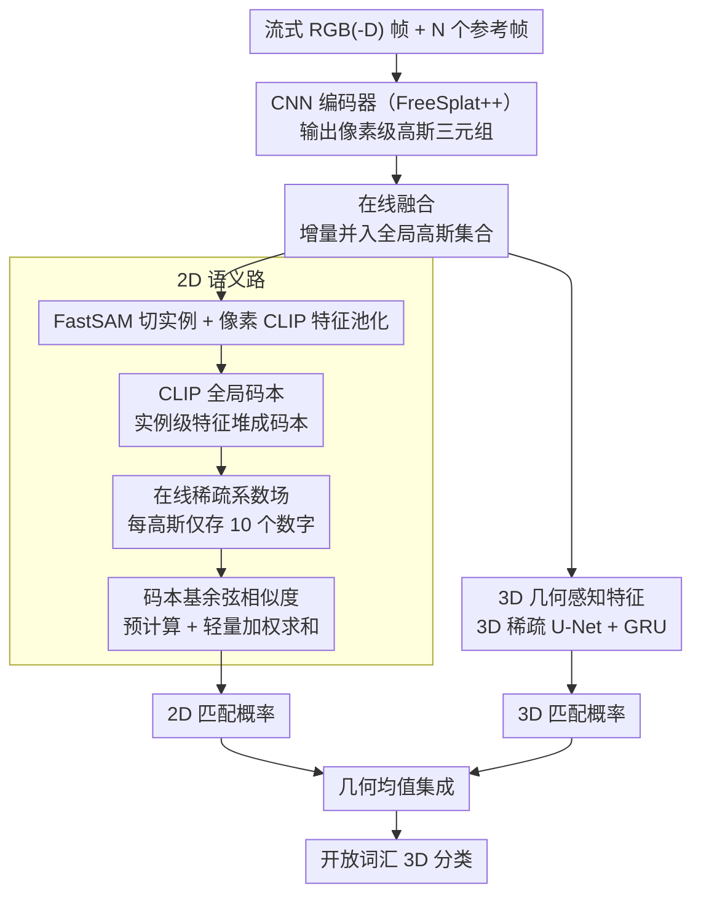

<!-- 由 src/gen_stubs.py 自动生成 -->
# EmbodiedSplat: Online Feed-Forward Semantic 3DGS for Open-Vocabulary 3D Scene Understanding

**会议**: CVPR 2026  
**arXiv**: [2603.04254](https://arxiv.org/abs/2603.04254)  
**代码**: 有（项目主页 EmbodiedSplat.io）  
**领域**: 3D视觉  
**关键词**: 3D高斯泼溅, 开放词汇场景理解, 在线重建, 前馈式3DGS, 语义嵌入

## 一句话总结

提出 EmbodiedSplat，首个在线前馈式语义 3DGS 框架，通过稀疏系数场+CLIP全局码本实现内存高效的逐高斯语义表示，结合3D几何感知特征，在300+帧流式输入下以5-6 FPS实现全场景开放词汇3D理解。

## 研究背景与动机

### 1. 领域现状

具身智能（embodied AI）任务如机器人操作和导航要求agent在探索过程中实时理解3D场景。3D高斯泼溅（3DGS）因其显式结构和实时渲染能力，已成为3D场景表示的主流方案。近年来大量工作将CLIP等2D基础模型的语义知识蒸馏到3DGS中，实现开放词汇的3D场景理解。

### 2. 现有痛点

现有语义3DGS方法存在两大根本局限：

- **逐场景优化**：LangSplat、LEGaussians、OpenGaussian、Dr. Splat等方法均需对每个场景单独优化数小时（2-6小时），无法泛化到新场景
- **离线设定**：需要预先收集完整图像集，无法处理流式输入，不适用于在线探索场景
- 少数在线方法（Online-LangSplat）虽支持流式输入，但仍依赖重度的逐场景SLAM优化，速度仅1.12 FPS
- 前馈式方法（LSM、SIU3R）可泛化但仅支持2-3视角输入，无法重建完整场景

### 3. 核心矛盾

具身场景对3D感知模型有五个同时满足的需求：**在线**、**实时**、**高泛化性**、**全场景理解**、**开放词汇理解**，而现有方法至多满足其中2-3个。特别是将完整CLIP特征绑定到每个高斯（常>100万个）会导致巨大的内存开销，现有压缩方法（自编码器、PQ量化）又需预训练且损失信息。

### 4. 本文目标

设计一个在线前馈式语义3DGS框架，能从300+帧流式图像中以近实时速度重建全场景的开放词汇语义3D高斯场，同时保持内存高效和CLIP的完整语义能力。

### 5. 切入角度

不走"3D渲染到2D"的传统蒸馏路线，而是采用"2D到3D"直接提升：将像素级CLIP特征直接反投影到3D空间，用**稀疏系数场+全局码本**替代逐高斯的密集CLIP向量存储，再用3D U-Net注入几何先验做互补。

### 6. 核心 idea

场景中独立语义实体远少于高斯数量，因此可用实例级CLIP特征构建全局码本，每个高斯只需存储少量码本索引和稀疏权重即可重建完整语义。

## 方法详解

### 整体框架

EmbodiedSplat 要解决的是一个"既要又要"的难题：在 agent 流式探索房间时，一边把 300+ 帧 RGB(-D) 图像增量重建成完整场景的 3D 高斯，一边给每个高斯挂上能被任意文本查询的开放词汇语义——而且要近实时、不爆显存。它建立在预训练的前馈式 3DGS 模型 FreeSplat++ 之上，把后者的离线推理改造成逐帧在线的流水线。

每来一帧，系统先连同 N 个参考帧送进 CNN 编码器，吐出一批像素级高斯三元组（位置、置信度、潜变量），再用在线融合策略把这批新高斯并入已有的全局高斯集合。真正的新东西是给每个高斯绑两套互补的 CLIP 特征：一套是**2D 语义特征**，靠"全局码本 + 稀疏系数场"压缩存储，保住 CLIP 原汁原味的开放词汇能力；另一套是**3D 几何感知特征**，靠 3D 稀疏 U-Net 把点云的空间结构编进去。推理时这两套特征各自算出文本匹配概率，再取几何均值得到最终分类——语义和几何谁也别一家独大。

### 关键设计

**1. CLIP 全局码本：用一组语义基函数顶替每个高斯的密集向量**

最直接的痛点是内存。一个房间动辄几百万个高斯，若每个都挂一条 512/768 维的 CLIP 向量，光语义就要 2 GB 以上。但观察到一个事实：场景里真正独立的语义实体（桌、椅、墙……）远少于高斯数量。于是把"每高斯一向量"换成"全场景一套码本"——每帧用 FastSAM 切出实例，对实例内的像素级 CLIP 特征做平均池化得到一条实例级特征，按时间步不断拼进全局码本。码本条目数 $K$ 远小于高斯数 $M$（实验里 $K\approx8.7\text{K}$ 对 $M\approx3.2\text{M}$）。关键是这套码本直接用原始 CLIP 特征堆出来，不像逐场景方法那样要预训练一个压缩码本，因此零信息损失、也不挑场景。

**2. 在线稀疏系数场：每个高斯只记 10 个数字**

有了码本，高斯就不必再存稠密向量，只需记"我由哪几个码本条目、按什么权重组合而成"。每个高斯维护一对长度为 $L$ 的索引缓存与权重缓存（取 $L=6$，即 $L-1=5$ 个有效条目），语义特征用稀疏线性组合重建：

$$\mathbf{s}_g^T(i) = \sum_{j=1}^{L-1} \Omega_g^T(i,j) \cdot \mathbf{C}^T(\mathbf{I}_g^T(i,j))$$

其中 $\mathbf{I}_g^T$ 是索引、$\Omega_g^T$ 是权重、$\mathbf{C}^T$ 是 $T$ 时刻的码本。难点在于"在线"——融合新帧时不能重算全局。论文的更新策略（Algorithm 1）是把本地高斯的码本索引追加到该高斯的全局缓存末尾，权重按置信度加权刷新，每步再只保留权重最大的 $L-1$ 个条目。这个 top-k 截断一举两得：低置信度的噪声索引被自然挤掉，缓存大小又被钉死在固定值。最终每个高斯只需 $2(L-1)=10$ 个数字，语义内存从 2295 MB 压到 148 MB，且天然支持增量更新。

**3. 3D 几何感知特征：补上 2D 特征缺的空间先验**

2D CLIP 特征语义丰富，但它生于 2D 图像，对"这块东西在 3D 里长什么形状、和邻居怎么连"几乎一无所知。论文额外搭一条几何通路：把高斯潜变量与投影回来的 CLIP 特征相加，送进 3D 稀疏 U-Net 加一个基于记忆的适配器，输出 64 维的紧凑 3D 特征；融合时再用一个 GRU 聚合时序信息。这条通路编码的是点云的几何结构，正好和 2D 通路互补——消融（Tab.3）显示两者组合在所有指标上都比单用任一方更好。

**4. 码本基余弦相似度：把百万级匹配压成一次预计算加轻量求和**

推理时要拿一句文本去和每个高斯比对，逐高斯算余弦相似度是 $O(MD)$，百万高斯一次要 14.35 ms。但既然高斯语义是码本的稀疏线性组合，内积就能拆开：先把文本和全部 $K$ 个码本条目的相似度预计算一遍（$O(KD)$），再对每个高斯只做 $L-1$ 次加权求和即可还原它的相似度，总复杂度降到 $O(KD+M(L-1))$。实测从 14.35 ms 掉到 1.18 ms，约 14 倍加速，且结果与逐高斯计算严格等价。

### 一个完整示例

跟一个高斯走一遍，看它的语义是怎么逐帧攒出来的。假设第 5 帧时 FastSAM 把画面里的椅子切成一个实例，池化出一条椅子 CLIP 特征，拼进码本成为第 8700 号条目；落在椅面上的某个新高斯，融合时把"索引 8700、权重 0.9"追加进自己的缓存。到第 30 帧，同一把椅子从另一视角又被看到，这次匹配到码本里语义相近的另几个条目，权重按置信度刷新后，该高斯缓存里挤进 5 条最强的索引（比如 8700→0.6、9302→0.2、……），更早那条低置信度的"误把椅子边缘当墙"的索引被 top-5 截断挤出。查询时输入文本 "a chair"：系统先把它和全部 8.7K 个码本条目算一遍相似度，再对这个高斯做 5 次加权求和，得到 2D 匹配分；同时 3D 通路给出基于几何的匹配分；两者几何均值后，这个高斯被稳稳判为 "chair"。整条链路里它始终只存着 10 个数字。

### 损失函数 / 训练策略

- **损失函数**：仅使用2D-3D余弦相似度损失 $\mathcal{L}_{cos} = 1 - \cos(\mathbf{s}_g^T, \mathcal{D}^{sem}(\hat{\mathbf{g}}_g^T))$，不需要标签监督
- **训练策略**：两阶段训练——(1) 预热阶段：单视角感知模型训练100K迭代，无记忆适配器；(2) 微调阶段：流式多帧输入（随机采样8-10连续帧），带记忆适配器训练300K迭代
- FreeSplat++ 参数冻结，仅优化3D U-Net和记忆适配器
- 推理时2D和3D特征通过几何均值集成：$\mathbf{P} = \max(\mathbf{P}^{2D}, \mathbf{P}^{3D})^\tau \cdot \min(\mathbf{P}^{2D}, \mathbf{P}^{3D})^{1-\tau}$

## 实验关键数据

### 主实验

**表1：3D语义分割性能对比**（ScanNet / ScanNet200 / ScanNet++）

| 方法 | 类型 | ScanNet-10 mIoU | ScanNet-19 mIoU | ScanNet200-70 mIoU | ScanNet++ mIoU | 重建时间 | 设定 |
|------|------|---------|---------|----------|---------|----------|------|
| LangSplat | 2D | 6.52 | 1.34 | 0.72 | 2.21 | ~6hr | 逐场景/离线 |
| Online-LangSplat | 2D | 7.13 | 3.45 | 2.45 | 4.51 | 5.4min | 逐场景/在线 |
| OpenGaussian | 3D | 29.50 | 22.52 | 15.15 | 25.65 | ~2.5hr | 逐场景/离线 |
| Dr. Splat | 3D | 39.21 | 28.38 | 19.29 | 39.85 | ~2hr | 逐场景/离线 |
| Occam's LGS | 3D | 42.14 | 30.49 | 20.32 | 34.08 | ~2hr | 逐场景/离线 |
| **EmbodiedSplat (RGB)** | 3D | **49.81** | **46.22** | **31.16** | 41.93 | **8min** | 泛化/在线 |
| **EmbodiedSplat-fast** | 3D | 47.86 | 41.03 | 30.46 | 45.53 | **1min10s** | 泛化/在线 |
| EmbodiedSplat (RGB-D) | 3D | 57.41 | 52.12 | 34.75 | 44.03 | 8min | 泛化/在线 |

**表2：跨域3D语义分割**

| 方法 | ScanNet++ → ScanNet (19类) mIoU | ScanNet → ScanNet++ (20类) mIoU | ScanNet → Replica (48类) mIoU |
|------|---------|---------|---------|
| Dr. Splat | 28.38 | 39.85 | 14.47 |
| Occam's LGS | 30.49 | 34.08 | 16.19 |
| EmbodiedSplat (RGB) | **45.32** | 30.65 | 9.88 |
| EmbodiedSplat (RGB-D) | **50.80** | **44.14** | 11.42 |

### 消融实验

**2D-3D特征互补效果**（Tab.3）：

- 仅2D特征：ScanNet-19 mIoU 45.09
- 仅3D特征：ScanNet-19 mIoU 45.39
- 2D+3D组合：ScanNet-19 mIoU **46.22**（+1.13提升）

**码本余弦相似度加速**（Tab.4）：

- 逐高斯计算：14.35ms
- 码本加速方案：1.18ms（**14倍加速**）

**内存效率对比**（Tab.5）：

- Occam's LGS（原始512维）：2295 MB，无信息损失
- Dr. Splat（PQ量化）：173 MB，有信息损失，需预训练
- LangSplat（自编码器压缩到3维）：30 MB，有严重信息损失
- **EmbodiedSplat**（稀疏系数场）：**148 MB，无信息损失，无需预训练**

**缓存大小L的影响**（Tab.6）：L=2→44.38, L=4→45.01, L=6→45.09, L=11→45.08，L=6为最佳平衡点。

### 关键发现

1. 2D方法（LangSplat等）在直接3D查询评估中表现极差，因为渲染过程中线性插值严重削弱了CLIP语义到每个高斯的迁移
2. 前馈式设计使重建时间从小时级降至分钟级（8min vs 2-6hr），fast版本更低至1min10s（5.18 FPS）
3. 跨域实验暴露了深度估计的关键作用：ScanNet→ScanNet++因天花板等难估区域掉11.28 mIoU，用深度传感器后恢复（44.14 vs 44.03）
4. 真实→合成（ScanNet→Replica）存在巨大域差距，前馈式方法不敌逐场景优化方法

## 亮点与洞察

1. **稀疏系数场设计精妙**：每高斯仅需10个数字（5索引+5权重）替代512维CLIP向量，内存节省15倍，且数学上等价于原始特征的稀疏重建——无需预训练，无信息损失
2. **码本加速的优雅推导**：利用稀疏线性组合+内积线性性质，将per-Gaussian搜索转化为per-Codebook预计算+轻量加权求和，14倍加速几乎免费
3. **2D-3D互补思路值得借鉴**：2D特征富语义、3D特征有几何先验，通过余弦相似度损失做蒸馏+几何均值做集成，简洁有效
4. **在线融合算法设计周全**：置信度加权更新+top-k剪枝，既保证了语义精度又固定了缓存大小，适合流式场景

## 局限与展望

1. **跨域泛化不足**：真实→合成场景（ScanNet→Replica）性能大幅下降，说明前馈式模型对域差距敏感
2. **深度估计是瓶颈**：RGB模式下跨数据集深度估计差异导致显著性能退化（ScanNet→ScanNet++ 掉11 mIoU），实际部署可能依赖深度传感器
3. **码本持续增长**：全局码本按时间步不断拼接，长序列探索（远超300帧）可能需要码本压缩或去重策略
4. **仅验证室内场景**：实验局限于ScanNet系列和Replica等室内数据集，室外大规模场景的效果未知
5. **fast版本精度损失**：去除3D U-Net后虽达5-6 FPS，但在部分指标上有2-4 mIoU下降

## 相关工作与启发

- **FreeSplat++**：前馈3DGS的base模型，其在线融合（GRU+置信度加权）设计可泛化到其他3DGS增强任务
- **Dr. Splat / Occam's LGS**：直接特征提升（feature lifting）路线的代表，与本文的2D→3D反投影思路一致，但受限于逐场景优化
- **OpenScene / PLA**：点云+基础模型蒸馏路线，本文的3D U-Net模块借鉴了此类方法的3D骨干设计
- 对后续研究的启发方向：码本+稀疏系数可扩展到其他高维特征（如DINOv2、SAM特征）的高效存储

## 评分

- 新颖性: ⭐⭐⭐⭐ 稀疏系数场+全局码本的语义压缩方案精妙，但整体框架偏整合式创新
- 实验充分度: ⭐⭐⭐⭐⭐ 三大数据集+跨域+内存/速度/消融分析全面
- 写作质量: ⭐⭐⭐⭐ 动机推导清晰，在线更新算法描述规范
- 价值: ⭐⭐⭐⭐ 在线前馈语义3DGS的实用定位清晰，对具身智能场景理解有直接推动

<!-- RELATED:START -->

## 相关论文

- [\[CVPR 2026\] OnlinePG: Online Open-Vocabulary Panoptic Mapping with 3D Gaussian Splatting](onlinepg_online_open-vocabulary_panoptic_mapping_with_3d_gaussian_splatting.md)
- [\[CVPR 2026\] LightSplat: Fast and Memory-Efficient Open-Vocabulary 3D Scene Understanding in Five Seconds](lightsplat_fast_and_memory-efficient_open-vocabulary_3d_scene_understanding_in_f.md)
- [\[CVPR 2026\] ExtrinSplat: Decoupling Geometry and Semantics for Open-Vocabulary Understanding in 3D Gaussian Splatting](extrinsplat_decoupling_geometry_and_semantics_for_open-vocabulary_understanding_.md)
- [\[CVPR 2026\] JOPP-3D: Joint Open Vocabulary Semantic Segmentation on Point Clouds and Panoramas](jopp3d_joint_open_vocabulary_semantic_segmentation.md)
- [\[CVPR 2026\] Off The Grid: Detection of Primitives for Feed-Forward 3D Gaussian Splatting](off_the_grid_detection_of_primitives_for_feed-forward_3d_gaussian_splatting.md)

<!-- RELATED:END -->
