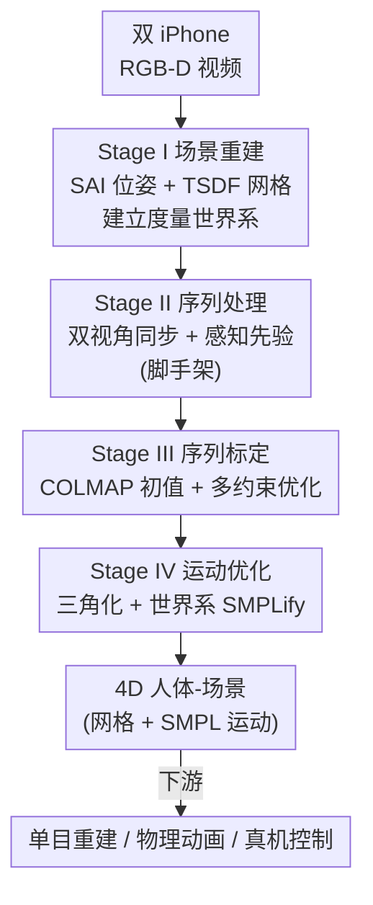

# EmbodMocap: In-the-Wild 4D Human-Scene Reconstruction for Embodied Agents

**会议**: CVPR 2026  
**论文**: [CVF Open Access](https://openaccess.thecvf.com/content/CVPR2026/html/Wang_EmbodMocap_In-the-Wild_4D_Human-Scene_Reconstruction_for_Embodied_Agents_CVPR_2026_paper.html)  
**代码**: 无（论文提供 project page）  
**领域**: 3D视觉  
**关键词**: 4D人体场景重建, 动作捕捉, 双视角标定, 具身智能, 人形机器人  

## 一句话总结
EmbodMocap 用两台手持 iPhone 的 RGB-D 视频，把场景、相机轨迹、人体运动联合标定到同一个度量世界坐标系里，实现"野外"低成本的 4D 人体-场景捕捉，捕到的数据可同时喂给单目人体场景重建、物理角色动画、真机人形机器人控制三类具身任务。

## 研究背景与动机
**领域现状**：具身智能（embodied AI）的训练需要既有人体运动、又有周围 3D 场景几何的"场景感知"数据，才能学到真实的人-场景交互。现有高质量数据集（PROX、RICH、EgoBody、SLOPER4D、Nymeria 等）几乎都依赖多视角相机阵列、可穿戴动捕服或 LiDAR 扫描仪。

**现有痛点**：这些方案要么贵（Nymeria 设备成本 6 万美元以上、RICH 2 万美元以上）、要么只能在受控的摄影棚里用，无法在多样的室内外环境大规模采集；而且穿戴设备会改变 RGB 图像里人的外观，IMU/电磁方案还需要大量手动对齐才能把运动和场景同步。直接从网络视频抓取又因遮挡和深度歧义拿不到精确的度量尺度运动与场景几何。

**核心矛盾**：高质量场景感知数据的"精度"和"可扩展/低成本"之间存在尖锐 trade-off——精度靠重型设备保证，但重型设备天然不可在野外规模化。单目方法可扩展，但单视角在相机朝向方向（深度方向）上有不可消除的尺度/位置歧义，遇到关节自遮挡更糟。

**本文目标**：只用消费级设备，在任意环境拿到"度量精确 + 场景一致"的 4D 人体与场景，并验证这批数据真的对下游具身任务有用。

**切入角度**：作者注意到单视角深度歧义本质上是个"几何欠定"问题，而第二个移动视角能给出跨视角的稠密像素对应，从而把每个视角在朝向方向上的歧义钉死。于是用两台移动 iPhone 而非一台。

**核心 idea**：用两台移动 iPhone 的双路 RGB-D 联合标定与联合优化，把人和场景重建进同一个度量、重力对齐的世界坐标系——用第二个视角换掉对摄影棚和穿戴设备的依赖。

## 方法详解

### 整体框架
系统输入是若干段手持 iPhone 的 RGB-D 视频（带 IMU），输出是同一个度量世界系下的静态场景网格 + 逐帧 SMPL 人体运动。整条管线分四个**串行**阶段，逐步把场景、两台相机的轨迹、人体运动统一进一个 Z 轴朝上、有真实尺度的世界系：

- **Stage I 场景重建**：先用单台 iPhone 扫一遍静态场景，借 SpectacularAI（SAI）的 VIO 拿到带度量尺度的相机位姿，再用 PromptDA 精修 LiDAR 深度、反投影做 TSDF 融合得到稠密场景网格 $M_g$，并用 COLMAP 在这些关键帧上建一个稀疏结构数据库，作为后续配准的"世界锚点"。
- **Stage II 序列处理**：两台 iPhone 同步拍演员在该场景里运动的双视角 RGB-D，每个视角各自用 SAI 估逐帧相机位姿，再用一套现成感知模型（YOLO 检测、ViTPose 2D 关键点、SAM2 分割、PromptDA 深度、VIMO 相机系 SMPL）抽出逐帧人体先验；用激光笔做帧级同步。这一阶段是"喂料"，不含本文核心创新。
- **Stage III 序列标定**：此时有三套坐标系（场景 + 两台相机），用 COLMAP 配准给出粗的刚性变换初值，再用多约束优化把两条相机轨迹精对齐到场景世界系。
- **Stage IV 运动优化**：相机和场景固定，三角化双视角 2D 关键点得到世界系 3D 关键点，再做世界系 SMPLify 精修人体姿态与平移。

### 关键设计

**1. 双视角度量世界系：用第二台 iPhone 消除单视角深度歧义**

痛点直接指向单目重建的死穴：COLMAP 能估出相机大致位置，但在相机朝向（深度）方向上有歧义，一台 iPhone 重建出的人体轨迹在深度方向误差可达 30cm 以上。本文的做法是先用 Stage I 锁死世界尺度——单 iPhone 扫场景时 SAI 给出度量尺度的相机位姿 $(K_s, R_{s,n}, T_{s,n})$，PromptDA 精修后的深度（室内截断 3.5m、室外 5m）反投影 + TSDF 融合出度量网格 $M_g$，并抽 SIFT 跑 COLMAP 建稀疏库作为后续配准基准。有了这个固定的度量世界系，再引入第二个移动视角：两个视角看同一个人，跨视角的稠密像素对应天然约束了两台相机间的刚性变换，于是每个视角在自己朝向方向上的歧义被另一个视角"侧面看穿"。最终对场景的标定精度约 5cm（图里人手触桌面验证），而单视角超过 30cm。这就是整篇论文能在野外拿到度量精度的根。

**2. 序列标定：COLMAP 粗对齐打底 + 多约束联合优化精修**

光有初值不够，标定是个对初值敏感的非凸问题。作者分两步走。先求粗的刚性变换初值：把每个视角去掉人体区域后的纯背景 SIFT 特征 $F_v$ 配准到 Stage I 的稀疏 COLMAP 模型，拿到世界系下的 COLMAP 位姿 $(\hat{R}_{v,t}, \hat{T}_{v,t})$；再用 Procrustes（SVD 闭式解）求一个把 SAI 轨迹对齐到 COLMAP 轨迹的偏移变换：

$$\min_{s^{\mathrm{off}}, R^{\mathrm{off}}, T^{\mathrm{off}}} \sum_{t=1}^{N} \big\lVert \hat{T}_{v,t} - (s^{\mathrm{off}} R^{\mathrm{off}} T_{v,t} + T^{\mathrm{off}}) \big\rVert_2^2$$

其中 $R^{\mathrm{off}}$ 被约束为只绕 z 轴旋转，保证重力对齐。然后以这个初值出发，联合优化每个视角的全局偏移 $R_v^{\mathrm{off}}$（仅 yaw）和 $T_v^{\mathrm{off}}$，最小化一个复合损失：

$$\mathcal{L}_{\mathrm{calib}} = \lambda_{\mathrm{track}}\mathcal{L}_{\mathrm{track}} + \sum_v \lambda_{\mathrm{ch}}\, d_{\mathrm{Chamfer}} + \sum_v \lambda_{\mathrm{ba}}\,\mathcal{L}_{\mathrm{ba},v}$$

三项分工明确：$\mathcal{L}_{\mathrm{track}}$ 是跨视角一致性——用 VGGT 在人体掩码区域跟踪像素，把两视角同一表面点反投影到世界系得 $Q^{(i)}_{1,t}, Q^{(i)}_{2,t}$，要求二者重合，权重 $\tilde{w}^{(i)}_t = \min(w^{(i)}_{1,t}, w^{(i)}_{2,t})$ 取两视角跟踪置信度的较小值，过滤不可靠点；$d_{\mathrm{Chamfer}}$ 把每个视角去人后局部点云对齐到全局网格 $M_g$ 采出的 $P_g$，保证两视角都"贴"在同一个场景上；$\mathcal{L}_{\mathrm{ba},v}$ 是 bundle adjustment，保证持久匹配点的重投影一致。用 Adam + 梯度裁剪求解。这三项的组合让"两视角一致 + 与场景一致 + 重投影一致"同时满足，是把深度歧义真正解掉的地方。

**3. 运动优化：三角化 + 世界系 SMPLify 拿到时序一致人体**

标定完相机和场景都固定，只剩人体参数要精修。先把双视角 2D 关键点三角化成世界系 3D 关键点——对每个关节最小化跨视角加权重投影误差，$P_v = K_v[R_{v,t}\,|\,T_{v,t}]$ 是投影矩阵，用 SVD 取最小奇异值对应的右奇异向量得到 $Y_{t,j}$：

$$\min_{Y_{t,j}} \sum_{v=1}^{V} c_{v,t,j} \big\lVert y_{v,t,j} - P_v Y_{t,j} \big\rVert_2^2$$

这些三角化出来的 3D 关键点是跨视角可靠的几何约束。然后做世界系 SMPLify：从 Stage II 的初始 shape $\beta_0$ 和 body pose 出发，联合优化形状 $\beta \in \mathbb{R}^{10}$、逐帧姿态 $\theta_t \in \mathbb{R}^{72}$ 和根平移 $\gamma_t \in \mathbb{R}^3$，目标是 $\mathcal{L}_{\mathrm{SMPLify}} = \mathcal{L}_{3\mathrm{D}} + \mathcal{L}_{\mathrm{smooth}} + \mathcal{L}_{\mathrm{prior}} + \mathcal{L}_{\mathrm{reproj}}$（3D 关键点对齐 + 平滑 + 先验 + 重投影）。采用两阶段优化：第一阶段只拟合 body shape 和平移，第二阶段再放开全部参数，以兼顾平滑和与原始双视角的对齐。这一步把"相机已经准了"转化成"人体也准且时序连贯"。

### 损失函数 / 训练策略
标定阶段 $\mathcal{L}_{\mathrm{calib}}$ 由 track loss、Chamfer、BA 三项加权（Adam + 梯度裁剪，yaw-only 用单个 z 轴角参数化保重力对齐）；运动优化阶段 $\mathcal{L}_{\mathrm{SMPLify}}$ 四项 + 两阶段拟合。下游任务各有自己的训练目标：物理角色动画用 goal-conditioned RL（PPO），奖励 $r_t = r^{\mathrm{style}}_t + r^{\mathrm{task}}_t$，最大化折扣回报 $J(\pi) = \mathbb{E}_{p(\tau|\pi)}\big[\sum_{t=0}^{T-1} \gamma^t r_t\big]$；真机控制用 sim-to-real RL + 域随机化（BeyondMimic）。

## 实验关键数据

### 主实验
在动捕棚里用 Vicon 采集真值（5 段、9420 帧），把双视角优化（本文）对比单目模型 GVHMR 和单视角版本（V1/V2），分块长 100/500/1000 评估世界系误差（mm）：

| 方法 | chunk=100 WA-MPJPE↓ | chunk=500 WA-MPJPE↓ | chunk=1000 WA-MPJPE↓ | RTE↓ |
|------|------|------|------|------|
| GVHMR（单目） | 123.44 | 333.34 | 593.79 | 1.85 |
| Single-View V1 | 218.22 | 489.11 | 768.31 | 2.71 |
| Single-View V2 | 211.83 | 357.22 | 762.80 | 3.65 |
| **Dual View（本文）** | **72.86** | **99.75** | **169.11** | **1.13** |

块越长，双视角优势越明显——chunk=1000 时 WA-MPJPE 只有单目的约 1/3.5，说明双视角对长序列的轨迹漂移抑制尤其强。

### 下游任务验证
单目人体场景重建（在 EMDB subset 2 上，π³ 做 SLAM、VIMO 做度量人体）：用本文数据 LoRA 微调后，π³ 和 VIMO 的世界系精度都提升。

| 微调 π³ | 微调 VIMO | WA-MPJPE↓ | W-MPJPE↓ | RTE↓ |
|------|------|------|------|------|
| ✗ | ✗ | 83.56 | 229.04 | 1.78 |
| ✗ | ✓ | 82.89 | 222.93 | 1.73 |
| ✓ | ✓ | **82.21** | **220.65** | **1.71** |

物理角色动画（人-物交互技能，对比光学动捕 / 本文 / 单目数据；Success Rate↑、Contact Error↓、APD↑）：

| 技能 | 数据 | Rate(%)↑ | Error(cm)↓ | APD↑ |
|------|------|------|------|------|
| Sit | 光学动捕 | 98.0 | 5.5 | 16.07 |
| Sit | 本文 Full | **99.9** | **4.7** | 15.90 |
| Lie | 本文 Full | **89.4** | 18.8 | 8.57 |
| Lie | 单目 | 81.2 | 21.0 | 8.14 |
| Support（高难） | 本文 Full | **66.0** | 4.9 | 21.08 |
| Support（高难） | 单目 | 20.6 | 6.4 | 20.94 |

### 关键发现
- **块越长双视角越赢**：单目和单视角在长序列上误差爆炸（W-MPJPE 飙到 ~600/760mm），双视角靠跨视角刚性约束把深度漂移压住，这是质变而非微调。
- **数据量越大下游越好**：物理技能上 1X→2X→Full 的成功率、接触误差、多样性 APD 普遍随数据量提升；本文数据单条质量略逊光学动捕，但靠"轨迹多样性"在 Sit 等任务反而超过光学动捕。
- **难任务才见真章**：Support（需双手承重、双脚并拢）这种高难技能上，本文 Full 成功率 66.0% vs 单目仅 20.6%——单目估计的运动在高精度接触任务上几乎不可用，凸显度量精度的价值。
- **场景感知动作跟踪可仿真**：四个 3D 场景上训练的 scene-aware tracking 策略成功率 87–97%，证明数据是"仿真就绪"的。

## 亮点与洞察
- **激光笔同步是个又土又有效的 trick**：两台手持 iPhone 没有硬件触发，作者用激光点消失的帧索引做帧级对齐，再据此切齐所有图像/深度/参数——零成本解决多设备同步，值得借鉴到任何手持多机采集。
- **"先锁世界尺度再加第二视角"的顺序很关键**：Stage I 用单 iPhone 的 VIO + LiDAR 把度量尺度钉死，后续所有对齐都在这个固定锚点上做，避免了多视角联合优化里尺度漂移的常见坑。
- **去人背景配准 + 人体区域跟踪的分工**：标定时用"去人背景 SIFT"配场景（稳），优化时用"人体掩码内 VGGT 跟踪"约束双视角（准），把静态场景对齐和动态人体对齐解耦，互不干扰。
- **一套数据通吃三类具身任务**：同一批 RGB-D + 相机 + SMPL 既能微调前馈重建模型、又能训物理交互技能、还能 sim-to-real 上真机，说明度量一致的 4D 数据是具身研究的"通用燃料"。

## 局限与展望
- **深度传感器有效量程限制**：iPhone LiDAR 室内截断 3.5m、室外 5m，超出范围的大场景几何拿不到，限制了适用空间尺度。
- **依赖一长串现成模型**：YOLO/ViTPose/SAM2/PromptDA/VIMO/SAI/COLMAP/VGGT 任一失效都会传导到最终结果，野外极端光照/快速运动下的鲁棒性论文没充分压测。
- **本文数据单条质量仍逊于光学动捕**（Lie 的接触误差 18.8 vs 17.5cm），靠数据量和多样性补；对要求单条极高精度的场景仍非首选。
- **需要演员配合在已建好的场景里表演**：仍是"先扫场景再拍人"的两步流程，不是真正一次性的随手捕捉；⚠️ 真机控制部分只给了定性 demo，缺定量评估。

## 相关工作与启发
- **vs 多视角/穿戴式动捕数据集（RICH、Nymeria、SLOPER4D）**: 他们靠重型设备换精度（成本 2 万–6 万美元、限摄影棚），本文用两台 iPhone（约 1 千美元）换可扩展性，且不穿戴设备保留 RGB 自然外观；代价是单条精度略低。
- **vs 单目联合重建（Human3R、JOSH、HSFM）**: 他们走前馈/单目联合估人体与场景，受深度歧义困扰；本文加第二个移动视角从几何上解掉歧义，并反过来把数据用来微调这些单目模型。
- **vs 视频驱动人形控制（VideoMimic、ASAP、HDMI）**: 他们用 TRAM/GVHMR 从野外视频估运动再 retarget，但单目精度差导致复杂技能学不好；本文提供高精度度量运动 + 场景，把高难接触技能（如 Support）的成功率从 ~20% 拉到 66%。

## 评分
- 新颖性: ⭐⭐⭐⭐ "用两台移动 iPhone 双视角联合标定"是务实而巧妙的系统级创新，单点算法多为现成模块组合
- 实验充分度: ⭐⭐⭐⭐ 有 Vicon 真值直接对比 + 三类下游任务多表验证，但真机控制只给定性 demo
- 写作质量: ⭐⭐⭐⭐ 四阶段管线讲得清晰、公式完整，部分符号（OCR 后）需对照原文核对
- 价值: ⭐⭐⭐⭐⭐ 把场景感知 4D 数据采集成本从万元级降到千元级、且可野外规模化，对具身智能数据瓶颈是实打实的推动

<!-- RELATED:START -->

## 相关论文

- [\[CVPR 2026\] Scene Grounding In the Wild](scene_grounding_in_the_wild.md)
- [\[CVPR 2026\] SAGE: Scalable Agentic 3D Scene Generation for Embodied AI](sage_scalable_agentic_3d_scene_generation_for_embodied_ai.md)
- [\[CVPR 2026\] CARI4D: Category Agnostic 4D Reconstruction of Human-Object Interaction](cari4d_category_agnostic_4d_reconstruction_of_human_object_interaction.md)
- [\[CVPR 2026\] 4D Primitive-Mâché: Glueing Primitives for Persistent 4D Scene Reconstruction](4d_primitive-mache_glueing_primitives_for_persistent_4d_scene_reconstruction.md)
- [\[CVPR 2026\] Illumination-Consistent Human-Scene Reconstruction from Monocular Video](illumination-consistent_human-scene_reconstruction_from_monocular_video.md)

<!-- RELATED:END -->
