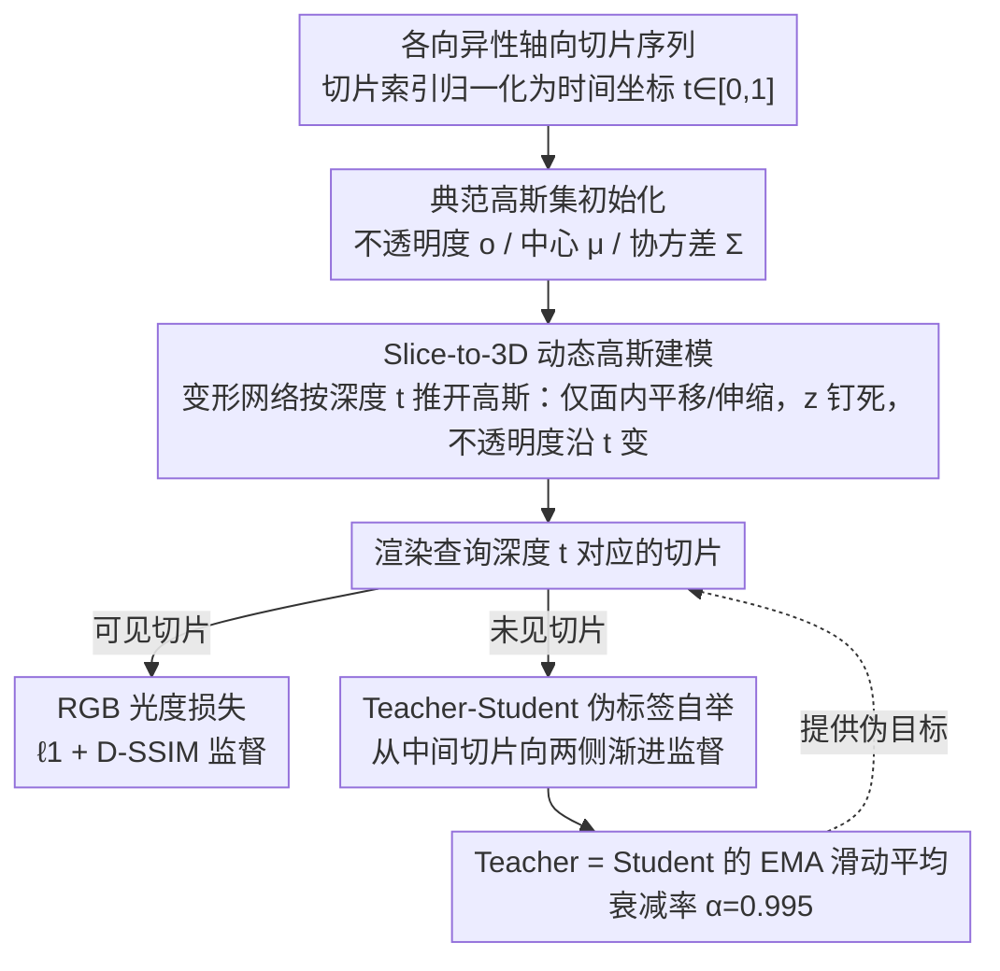

# EMGauss: Continuous Slice-to-3D Reconstruction via Dynamic Gaussian Modeling in Volume Electron Microscopy

**会议**: CVPR 2026  
**arXiv**: [2512.06684](https://arxiv.org/abs/2512.06684)  
**代码**: 无  
**领域**: 3D视觉  
**关键词**: 3D高斯溅射, 体电子显微镜, 各向异性重建, 动态场景建模, 自监督学习

## 一句话总结

将体电子显微镜(vEM)的各向异性切片重建问题重新建模为基于可变形2D高斯溅射的动态3D场景渲染任务，通过Teacher-Student伪标签机制在数据稀疏条件下实现高保真连续切片合成。

## 研究背景与动机

体电子显微镜(vEM)能够实现生物结构的纳米级3D成像，但由于分辨率、视场和采集时间之间的"不可能三角"权衡，直接获取各向同性数据代价高昂。实际采集的数据通常呈现各向异性特征——轴向(z)分辨率远低于面内(xy)分辨率。

现有深度学习方法试图通过以下两种范式恢复各向同性：

**视频帧插值**：沿z轴对xy切片进行帧插值

**图像超分辨率**：对xz/yz正交视图进行超分辨率增强

这两种方法都隐含地假设组织结构在x/y/z三个维度上近似各向同性，但实际生物样本中形态学各向异性普遍存在（如神经纤维、树突棘等），导致这些方法在处理方向性强的结构时产生误差。

**核心动机**：需要一种不依赖各向同性假设、直接在连续3D空间中进行推理的重建框架。

## 方法详解

### 整体框架

EMGauss 想解决的是：vEM 采集到的体数据轴向(z)分辨率远低于面内(xy)，要从稀疏的轴向切片恢复出任意深度都连续、各向同性的 3D 结构。它的核心做法是换一个看问题的角度——不把切片序列当成一摞要插值的离散图像，而是把它看成同一团 2D 高斯点云沿 z 轴"随时间演化"的过程：切片索引被归一化成 $t \in [0,1]$ 当作时间坐标，相邻切片之间组织形态的细微变化，就交给一个变形网络去学。

具体地，EMGauss 以 Deformable 3D Gaussians 为底座，每个高斯基元由不透明度 $o$、中心 $\mu$、协方差 $\Sigma$（分解为缩放 $S$ 与旋转 $R$）参数化。从观测帧初始化出一组典范高斯 $\mathcal{G}_c$ 后，整条流程就是：给定查询深度 $t$ → 变形网络预测该深度下每个高斯的偏移 → 渲染出对应切片。训练时用观测到的切片做光度监督，推理时只要喂入中间的 $t$ 值，就能渲染出从未实际采集过的连续切片。

### 关键设计

**1. Slice-to-3D 动态高斯建模：用受约束的变形把"插值"换成"连续几何推理"**

帧插值和超分之所以会在方向性强的结构上出错，根源是它们隐含假设了各向同性。EMGauss 干脆不做这个假设，而是让一个变形网络 $\Phi_\theta$ 把典范高斯随深度 $t$ 连续地推开：

$$\Delta\mu_i,\ \Delta S_i,\ \Delta o_i = \Phi_\theta(\mu_i, t)$$

关键不在于"能变形"，而在于"只允许哪些维度变形"。EMGauss 给变形上了一套贴合 vEM 物理的约束：位置只准面内平移（$\Delta\mu_i=(\Delta x_i,\Delta y_i,0)$）、缩放只准面内伸缩（$\Delta S_i=(\Delta s_x,\Delta s_y,0)$），而 z 坐标和 z 向缩放被钉死为全局常数 $z_0,\ s_{z,0}$，旋转可学但不随 $t$ 变（$\Delta R_i=0$）。唯一被放开沿 z 自由变化的是不透明度 $\Delta o_i$——因为一个结构在体内沿深度方向往往是逐渐出现又逐渐消失的。这样一来，模型既能在面内灵活贴合形态、逐切片调外观，又不会让高斯在 z 上乱跑破坏轴向对齐，于是把"离散切片插值"真正变成了"在连续 3D 场上做几何推理"。

**2. Teacher-Student 伪标签自举：在只有 10%–20% 轴向切片时也能撑起未观测区域**

vEM 实际能用来监督的轴向切片往往只有一成到两成，未观测深度上没有任何真值，模型容易在这些空档处崩掉。EMGauss 的对策是自举式自监督：维护一个 Teacher，它是 Student 的 EMA 滑动平均（衰减率 $\alpha=0.995$），在未见切片上给出相对稳定的伪目标，Student 则被训练去匹配这些伪标签。两点设计让它不至于"自欺欺人"：一是伪监督要等训练迭代过了阈值、Student 在真实切片上先收敛后才启动，避免一开始就拿噪声当老师；二是伪标签覆盖的位置从中间切片向两侧渐进扩展，而不是一上来就监督所有空档。伪监督迭代与真实数据监督迭代交替进行，让两种信号互相牵制、稳定收敛。

### 损失函数 / 训练策略

训练分三阶段推进，循序解锁变形能力。预热阶段（2k 迭代）冻结变形 MLP、只优化典范高斯集 $\mathcal{G}_c$，先建立一个稳定的辐射基线；联合训练阶段（1k 迭代）放开变形 MLP 与 $\mathcal{G}_c$ 一起训练来捕获轴向转换，这一段刻意短，因为拉太长容易过拟合；最后的 Teacher-Student 阶段（15k 迭代）才激活 EMA Teacher 提供伪监督，专门补强未见切片。监督信号上，可见切片用 RGB 光度损失（$\ell_1$ + D-SSIM 正则），伪监督损失的权重则在 3k–10k 迭代之间从 0.1 线性升到 1.0，让伪标签的影响随 Teacher 变可靠而逐步加重。

## 实验关键数据

### 主实验

**数据集**：EPFL（小鼠脑，5nm各向同性）、FIB-25（果蝇脑，8nm各向同性）、FANC（果蝇神经索，真实各向异性×10）

**Table 2: 合成各向异性数据集上的xy切片重建结果**

| 方法 | EPFL PSNR | EPFL SSIM | EPFL FSIM | FIB-25 PSNR | FIB-25 SSIM | FIB-25 FSIM |
|------|-----------|-----------|-----------|-------------|-------------|-------------|
| CycleGAN-IR | 22.05 | 0.491 | 0.856 | 22.39 | 0.554 | 0.856 |
| EMDiffuse† | 23.34 | 0.519 | 0.899 | 24.10 | 0.514 | 0.878 |
| IsoVEM | 23.91 | 0.597 | 0.856 | 21.51 | 0.546 | 0.846 |
| **EMGauss** | **26.59** | **0.698** | **0.943** | **27.37** | **0.728** | **0.920** |

†EMDiffuse需要额外数据训练

**Table 3: EPFL数据集上的下游分割结果（SAM2, IoU）**

| 方法 | CycleGAN-IR | EMDiffuse | EMGauss |
|------|-------------|-----------|---------|
| IoU | 0.9099 | 0.9555 | **0.9687** |

### 消融实验

**Table 4: 关键组件消融（两个各向同性数据集平均）**

| 配置 | PSNR | SSIM | FSIM |
|------|------|------|------|
| 去除Teacher-Student | 25.19 | 0.627 | 0.904 |
| 去除预热阶段 | 25.76 | 0.653 | 0.908 |
| 去除联合训练 | 24.35 | 0.577 | 0.851 |
| 去除动态不透明度 $\Delta o$ | 25.44 | 0.630 | 0.894 |
| 添加动态旋转 $\Delta R$ | 25.07 | 0.640 | 0.906 |
| **完整模型** | **26.98** | **0.713** | **0.932** |

### 关键发现

1. EMGauss在PSNR上比最佳baseline高出 **~3dB**（EPFL和FIB-25）
2. 在xz/yz切片重建中，即使EMGauss仅用xy训练，效果仍优于用xz/yz训练的baseline
3. 在真实各向异性FANC数据集（×10各向异性）上，EMGauss是唯一支持**任意时间步连续生成**的方法
4. 三阶段训练中，联合训练阶段的去除影响最大（PSNR下降2.6）
5. 动态不透明度比动态旋转更重要——静态不透明度无法建模结构的出现/消失，而动态旋转会引起时间抖动

## 亮点与洞察

1. **问题转化的巧妙性**：将切片重建转化为动态场景渲染，从根本上避免了各向同性假设
2. **完全自包含**：仅使用目标体积的各向异性切片进行优化，无需外部数据集或大规模预训练
3. **连续生成能力**：可在任意深度合成插值切片，这是基于离散帧插值方法无法实现的
4. **高斯属性的精细控制**：对哪些属性随时间变化、哪些固定做了仔细设计，体现了对问题本质的深入理解

## 局限与展望

1. 在噪声较大的输入切片中，高斯基元数量可能显著增长，导致内存消耗过大
2. 可以在重建流水线前加入轻量去噪模块来稳定优化
3. 未来可探索自适应高斯剪枝或与图像空间正则化器的联合学习
4. 当前实验仅在电子显微镜领域验证，跨模态泛化能力有待证明

## 相关工作与启发

- **与3DGS的关系**：巧妙地将3DGS从多视图3D重建迁移到切片-体重建，将z轴重新解释为时间维度
- **与Deformable 3DGS的区别**：原始方法用于动态3D场景的多视图重建，本文用于从2D切片进行3D连续重建
- **与扩散/GAN方法的本质区别**：不依赖跨域映射（xy→xz/yz），直接建模连续3D几何
- **启发**：该范式可推广到其他平面扫描成像领域（如CT、MRI等）

## 评分

- 新颖性: ⭐⭐⭐⭐⭐ — 问题转化思路独到，3DGS在医学成像中的创新应用
- 实验充分度: ⭐⭐⭐⭐ — 多数据集多指标验证，含下游任务和消融，但跨模态实验缺乏
- 写作质量: ⭐⭐⭐⭐ — 结构清晰，动机阐述充分
- 价值: ⭐⭐⭐⭐ — 提供了通用的slice-to-3D重建框架，超越vEM领域

<!-- RELATED:START -->

## 相关论文

- [\[CVPR 2026\] Neural Field-Based 3D Surface Reconstruction of Microstructures from Multi-Detector Signals in Scanning Electron Microscopy](neural_field-based_3d_surface_reconstruction_of_microstructures_from_multi-detec.md)
- [\[CVPR 2026\] InstantHDR: Single-forward Gaussian Splatting for High Dynamic Range 3D Reconstruction](instanthdr_singleforward_gaussian_splatting_for_hi.md)
- [\[CVPR 2026\] Learning Explicit Continuous Motion Representation for Dynamic Gaussian Splatting from Monocular Videos](learning_explicit_continuous_motion_representation_for_dynamic_gaussian_splattin.md)
- [\[CVPR 2026\] D-Prism: Differentiable Primitives for Structured Dynamic Modeling](d-prism_differentiable_primitives_for_structured_dynamic_modeling.md)
- [\[CVPR 2026\] RetimeGS: Continuous-Time Reconstruction of 4D Gaussian Splatting](retimegs_continuous-time_reconstruction_of_4d_gaussian_splatting.md)

<!-- RELATED:END -->
