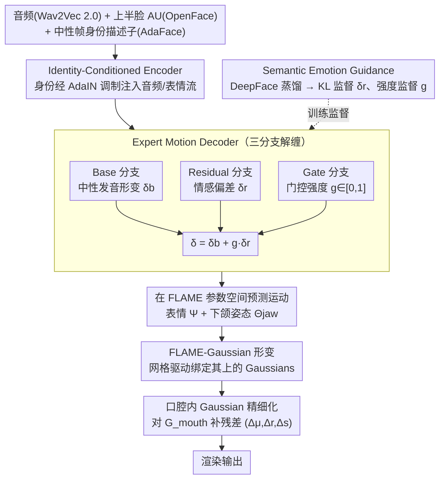

# EmoTaG: Emotion-Aware Talking Head Synthesis on Gaussian Splatting with Few-Shot Personalization

**会议**: CVPR 2026  
**arXiv**: [2603.21332](https://arxiv.org/abs/2603.21332)  
**代码**: 有（Project page）  
**领域**: 3D Vision / Talking Head Synthesis  
**关键词**: 3D Gaussian Splatting, Talking Head, Emotion-Aware, Few-Shot, FLAME

## 一句话总结

提出 EmoTaG，一个基于 FLAME-Gaussian 结构先验和门控残差运动网络（GRMN）的情感感知 3D 说话人头合成框架，仅需 5 秒视频即可实现 few-shot 个性化适配，同时兼顾情感表达、唇音同步和几何稳定性。

## 研究背景与动机

音频驱动的 3D 说话人头合成近年来随 NeRF 和 3D Gaussian Splatting（3DGS）的发展取得了显著进展。现有的 Pretrain-and-Adapt（PAA）范式能用几秒视频适配新身份，但存在两个核心问题：

**缺乏显式情感建模**：现有 few-shot 方法（如 InsTaG、FIAG）主要面向中性语音，无法有效捕捉情感驱动的面部运动。作者通过可视化实验（Fig. 2）证明情感音频的口型运动复杂度远高于中性音频（标准差分别为 7.88 vs 3.11）。

**几何不稳定性**：直接在 3DGS 上进行无约束形变会导致剧烈表情下的几何失真，尤其在情感表达场景下表现突出。

核心问题：**few-shot 3D 说话人头合成能否超越中性语音，支持情感感知的表情动画？**

## 方法详解

### 整体框架

EmoTaG 想解决的是：仅靠几秒视频，就让一个 3D 说话人头不光对得上口型，还能跟着语音里的情感做出夸张但不崩坏的表情。它把这件事拆成两层（Fig. 3）。底层是一个 **FLAME-Gaussian 模型**——把 3D Gaussians 绑在 FLAME 人脸网格上，运动不再直接推 Gaussians，而是去驱动 FLAME，几何稳定性由网格的拓扑结构兜底。上层是 **门控残差运动网络（GRMN）**：先用 Identity-Conditioned Encoder 把音频、表情、身份三股信息融成条件，再用 Expert Motion Decoder 预测每帧的面部运动参数，最后回灌给 FLAME 去形变、渲染。

训练走 Pretrain-and-Adapt 两步：预训练阶段从多身份语料里学通用的"音频→运动"先验；适配阶段把 GRMN 主体冻住，只微调少量 AdaIN 参数就能换上新身份。

### 关键设计

**1. 在 FLAME 参数空间里预测运动：用显式几何先验兜住情感表情下的崩坏**

直接在 3DGS 上做无约束形变，遇到大幅度情感表情（瞪眼、咧嘴）就容易几何失真。EmoTaG 把预测目标换掉——网络不再输出 Gaussians 的位移，而是预测 FLAME 的表情参数 $\Psi$ 和下颌姿态 $\Theta_{jaw}$，再由 FLAME 网格的形变去带动绑定在其上的 Gaussians。这样所有运动都被约束在 FLAME 这个带面部拓扑结构的低维参数空间里，相当于给形变上了一层"解剖学合理性"的护栏，剧烈表情也不会把脸撕裂。

**2. Identity-Conditioned Encoder：把身份注进音频流，让适配只动几个参数**

要 few-shot 换身份，关键是把"怎么发音/怎么动"和"这是谁"解开。编码器先用 Wav2Vec 2.0 取语音嵌入，过 1D CNN + Transformer 补上时序和韵律；同时用 OpenFace 抽 AU 参数补充上半脸（眉、眼）的表情信息，用 AdaFace 从中性帧里取身份描述子 $s$。身份不是简单拼接进去，而是通过 **AdaIN 调制**注入音频流和表情流——身份只决定特征的均值/方差缩放。好处直接体现在适配：换新人时主网络全冻，只需微调这组 AdaIN 仿射参数，又快又不破坏已学到的通用运动先验。

**3. Expert Motion Decoder：用 Base/Residual/Gate 三分支把中性发音和情感波动解缠**

情感运动的难点在于强度逐帧变化、还得叠在正常发音之上。解码器拆成三路各管一摊：Base 分支学与身份无关的中性"音频→口型"映射，给出基础形变 $\delta_b$；Residual 分支经一个 EMO Encoder-Decoder 专门捕捉情感带来的偏差 $\delta_r$；Gate 分支预测一个标量门 $g\in[0,1]$ 来决定这一帧该掺多少情感。最终运动是

$$\delta = \delta_b + g \cdot \delta_r$$

这个门控是关键——它让无情感的帧 $g\to 0$ 退回纯中性发音（保持稳定不抖），情感高峰帧 $g\to 1$ 才放开残差，既防止全程过度夸张，又能跟着情绪起伏自适应调节强度。

**4. Semantic Emotion Guidance：用 DeepFace 蒸馏，绕开粗糙的人工情感标注**

残差和门控分支没有现成的细粒度监督，手动标情感标签又粗又主观。EmoTaG 改从预训练的 DeepFace 情感识别器里蒸馏：对每帧取它输出的七类情感分布 $p_{emo}$ 去监督残差分支（KL 对齐），同时取情感强度标量 $e = 1 - p(\text{neutral})$ 去监督门控分支（回归对齐）。这样监督信号是连续、逐帧、分布级的，比离散标签精细得多，也省掉了人工标注。

**5. 口腔内 Gaussian 精细化：补 FLAME 建不出的牙齿和舌头**

FLAME 网格本身不刻画口腔内部，但说话时牙齿、舌头的露出很影响真实感。EmoTaG 借唇部 landmarks 圈出口腔区域的 Gaussians 子集 $G_{mouth}$，单独让网络对它们预测残差偏移 $(\Delta\mu, \Delta r, \Delta s)$（位置、旋转、缩放），把这部分细粒度动作直接补在 Gaussian 层面，弥补结构先验覆盖不到的地方。

### 损失函数 / 训练策略

总损失由四部分组成：L = L_Render + L_KL + L_Score + L_Geo

| 损失 | 公式/描述 | 作用 |
|------|-----------|------|
| L_Render | L1 + λ·(1-SSIM) | 像素和感知结构保真度 |
| L_KL | KL(p_emo ‖ Softmax(z_e)) | 残差分支对齐教师情感分布 |
| L_Score | \|g_pred - e\| | 门控分支回归情感强度标量 |
| L_Geo | L_D(D, D_GT) + L_N(N, N_GT) | 深度/法线几何约束（仅适配阶段） |

- 预训练：250K iterations，lr=5e-3
- 适配：20K iterations，lr=5e-4，仅微调 AdaIN 参数
- 推理：音频编码 ~25ms，GRMN ~6ms/帧，3DGS 渲染 ~7ms/帧

## 实验关键数据

### 主实验（自重建 + 5s 训练数据）

| 方法 | PSNR↑ | LPIPS↓ | LMD↓ | AUE↓ | Sync-C↑ | 训练时间 | FPS |
|------|-------|--------|------|------|---------|---------|-----|
| ER-NeRF | 28.21 | 0.038 | 3.549 | 1.314/0.466 | 3.142 | 2h | 33.2 |
| TalkingGaussian | 28.43 | 0.034 | 3.582 | 1.167/0.401 | 3.631 | 27min | 118.4 |
| InsTaG | 28.92 | 0.029 | 3.145 | 0.921/0.407 | 5.329 | 13min | 82.5 |
| MimicTalk | 25.26 | 0.071 | 3.478 | 0.964/0.781 | 6.341 | 17min | 8.6 |
| **EmoTaG** | **30.02** | **0.019** | **2.221** | **0.685/0.210** | 6.212 | **11min** | 76.4 |

### 消融实验（情感测试集）

| 变体 | PSNR↑ | LPIPS↓ | LMD↓ | Sync-C↑ |
|------|-------|--------|------|---------|
| Full Model | 29.95 | 0.022 | 2.456 | 6.147 |
| w/o Score Distill | 29.52 | 0.026 | 2.731 | 5.874 |
| w/o KL Distill | 29.36 | 0.031 | 2.985 | 5.712 |
| w/o SEG | 29.01 | 0.034 | 3.067 | 5.541 |
| w/o Gate Branch | 28.77 | 0.036 | 3.358 | 5.004 |
| w/o Residual Branch | 28.52 | 0.038 | 3.572 | 4.896 |
| w/o AdaIN | 28.38 | 0.040 | 4.021 | 4.621 |

### 关键发现

1. **AdaIN 身份调制最关键**：去掉后 LMD 从 2.456 飙升到 4.021，说明多身份学习中的身份解缠极其重要
2. **情感强度泛化能力强**：在 Level-2 上适配，在 Level-1/Level-3 上测试均表现最优，且高强度场景优势更大
3. **跨身份/跨语言 OOD 泛化**：EmoTaG 在跨身份（Sync-E: 9.133）和跨语言（Sync-E: 9.662）场景下均领先
4. **用户研究**：情感表达（4.50）、唇音同步（4.70）、视觉真实感（4.60）三项均最高

## 亮点与洞察

- **结构化表示 + 情感解缠**的思路非常优雅：在 FLAME 参数空间做运动预测（保证几何稳定），同时用 Base/Residual/Gate 三分支解缠中性发音和情感变化
- **知识蒸馏代替手动标注**：用 DeepFace 提供分布级 + 标量级的双重情感监督，避免了离散标签的粗糙性
- **极简适配策略**：冻结主网络仅微调 AdaIN 参数，兼顾效率和个性化效果
- 将口腔内区域独立出来做精细化拟合，弥补了 FLAME 对口腔内部建模的不足

## 局限与展望

1. 依赖外部的 pose & expression frames 作为推理时的辅助输入，无法纯音频驱动
2. 情感蒸馏依赖 DeepFace 这一特定模型，其识别准确度直接影响训练质量
3. 训练数据仅 70 个身份，跨种族/极端表情的泛化性有待验证
4. 未探索多情感混合或情感过渡的平滑控制

## 相关工作与启发

- **InsTaG**（CVPR 2025）开创了 few-shot PAA 范式，但缺乏情感建模
- **EMOTE / EmoVOCA** 使用手动情感标注的 FLAME 训练，受限于标签粗糙
- **EmoTalk3D** 实现了 3DGS 上的情感合成，但依赖 person-specific 优化
- 启发：门控残差机制可推广到其他需要"基础+变化"解缠的生成任务

## 评分

- **新颖性**: ⭐⭐⭐⭐ — FLAME 结构先验 + 门控残差情感解缠 + 教师蒸馏的组合设计很精巧
- **实验充分度**: ⭐⭐⭐⭐⭐ — 中性/情感/跨强度/跨身份/跨语言五种评估场景，完整消融，用户研究
- **写作质量**: ⭐⭐⭐⭐ — 结构清晰，动机-方法-实验逻辑连贯，可视化丰富
- **价值**: ⭐⭐⭐⭐ — 填补了 few-shot 3D talking head 在情感维度的空白，框架有较好的工程落地潜力

<!-- RELATED:START -->

## 相关论文

- [\[ICLR 2026\] FastGHA: Generalized Few-Shot 3D Gaussian Head Avatars with Real-Time Animation](../../ICLR2026/3d_vision/fastgha_generalized_few-shot_3d_gaussian_head_avatars_with_real-time_animation.md)
- [\[ECCV 2024\] TalkingGaussian: Structure-Persistent 3D Talking Head Synthesis via Gaussian Splatting](../../ECCV2024/3d_vision/talkinggaussian_structure-persistent_3d_talking_head_synthesis_via_gaussian_spla.md)
- [\[ICCV 2025\] Self-Ensembling Gaussian Splatting for Few-Shot Novel View Synthesis](../../ICCV2025/3d_vision/self-ensembling_gaussian_splatting_for_few-shot_novel_view_synthesis.md)
- [\[CVPR 2026\] SCOPE: Scene-Contextualized Incremental Few-Shot 3D Segmentation](scope_scene-contextualized_incremental_few-shot_3d_segmentation.md)
- [\[CVPR 2026\] Cross-Instance Gaussian Splatting Registration via Geometry-Aware Feature-Guided Alignment](cross-instance_gaussian_splatting_registration_via_geometry-aware_feature-guided.md)

<!-- RELATED:END -->
