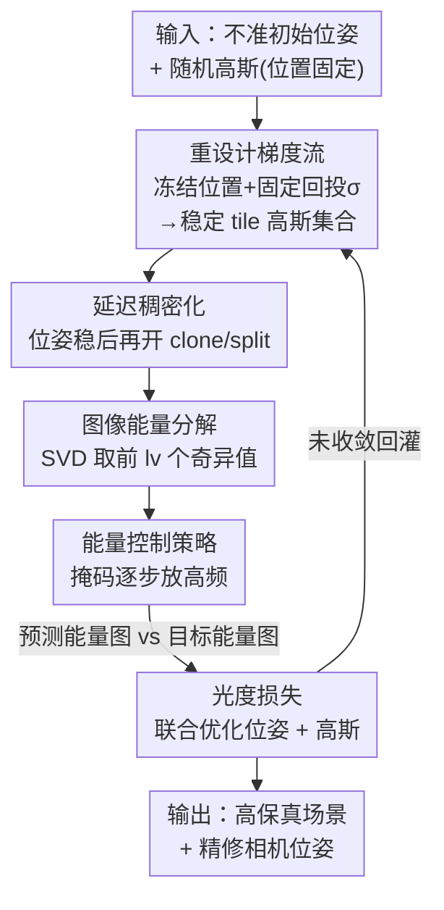

# Energy-GS: Image Energy-guided Pose Alignment Gaussian Splatting with redesigned pose gradient flow

**会议**: CVPR 2026  
**论文**: [CVF Open Access](https://openaccess.thecvf.com/content/CVPR2026/html/Gao_Energy-GS_Image_Energy-guided_Pose_Alignment_Gaussian_Splatting_with_redesigned_pose_CVPR_2026_paper.html)  
**代码**: https://github.com/SkylerGao/ENGS  
**领域**: 3D视觉  
**关键词**: 3D高斯泼溅, 相机位姿联合优化, 位姿梯度稳定, 图像能量分解, coarse-to-fine对齐  

## 一句话总结
Energy-GS 只用 RGB 图像，同时优化 3D 高斯泼溅场景和不准的相机位姿——通过"冻结高斯位置"让位姿梯度稳定下来，再用图像奇异值能量分解模拟出 NeRF 那种从粗到细的对齐过程，在合成与真实数据集上把位姿精度做到 SOTA、渲染质量与 BARF/3R-GS 持平。

## 研究背景与动机

**领域现状**：NeRF 和 3DGS 都依赖准确的相机位姿，但真实场景里位姿往往拿不到准的。一条主流思路是把不准的初始位姿当成可学习参数，和场景表示一起联合优化（joint optimization）。这条路在 NeRF 系列（BARF、SC-NeRF、NoPe-NeRF）里被探得很透，效果也好。

**现有痛点**：同样的思路搬到 3DGS 上却不灵。已有的 3DGS 联合优化方法几乎都得额外加先验或约束才能跑起来——ISplat/NopoSplat 要靠 dense stereo 模型给全局初始化，CF-GS/PCR-GS 要靠序列帧之间的连续性，3R-GS/GS-CPR 要靠深度线索和特征匹配。一旦只给 RGB、不给这些外援，3DGS 联合优化基本不收敛。

**核心矛盾**：作者把"只用 RGB 时 3DGS 为什么不行"归结到两个根因。其一，3DGS 是基于离散高斯点的点云渲染，训练中高斯会被 densify（克隆/分裂）、prune、位置也在动，导致**参与某个像素位姿梯度计算的高斯集合一直在变**，梯度不连续抖动；而 NeRF 用一个全局 MLP，可学习参数数量恒定，梯度自然平稳。其二，NeRF 靠位置编码的频率控制天然能做 coarse-to-fine 对齐（BARF 就是这么干的），而 3DGS 的光栅化没有空间采样这个旋钮，没法控制"先学低频再学高频"，于是直接在全分辨率 RGB 上做光度对齐很容易掉进糟糕的局部最优。

**本文目标**：在**不引入任何额外先验/约束、只用 RGB** 的前提下联合优化 3DGS 场景与相机位姿，对应解决两个子问题——(1) 让位姿梯度稳定；(2) 给 3DGS 造出一个 coarse-to-fine 的对齐机制。

**核心 idea**：用"冻结高斯位置 + 固定回投标准差"换来稳定的位姿梯度，再用图像 SVD 能量分解（先喂低能量分量、逐步加进高频细节）代替 NeRF 的频率退火，从而在纯 RGB 下也能做渐进对齐。

## 方法详解

### 整体框架

Energy-GS 从一组**不准的初始相机位姿**和一团**随机初始化、位置固定不可学**的高斯点出发。整条流水线相对原始 3DGS 只动了两处，但都打在要害上：

1. **稳住位姿梯度**：把高斯位置从可学习参数里拿掉（不做 split/clone 引起的位置漂移），同时把回投到 ground-truth 时用的标准差固定下来，这样每个渲染 tile 对应的高斯集合在迭代间保持一致，传给位姿的梯度就不再随机抖动。位姿被参数化成可学习变量，和场景一起优化。
2. **造出 coarse-to-fine 对齐**：对每张监督用的 ground-truth 图像做 SVD 能量分解，训练早期只暴露低能量（低频）分量，随训练进度用一个可控掩码逐步把更高能量的细节放进来，逼着 3DGS 先对齐大结构、再抠细节，避开局部最优。

最后用预测能量图与目标能量图之间的**光度损失**同时监督位姿精修和场景重建。整体 pipeline 如下：

### 关键设计

**1. 重设计位姿梯度流：冻结高斯位置 + 固定回投标准差，把"参与梯度的高斯集合"钉死**

这一步针对的痛点是位姿梯度的抖动。原始 3DGS 里，对某个渲染 tile $B$，真正参与渲染的高斯集合由 3σ 准则决定 $\text{Set}^{gs}_B = \{g_i \in P \mid r(g_i) < 3\sigma\}$，其中 $r(g)$ 是高斯投影到像平面的半径、$\sigma$ 是投影标准差。问题在于：训练中高斯位置会动、$\sigma$ 也在变，于是这个集合的成员数和身份一直在换——把可学习参数记为 $\omega^v_{gs}=\{g_1,\dots,g_n\}$，位姿梯度 $G^{pose}_{gs}(v)=F(\omega^v_{gs})$ 的输入在不同迭代 $k_1,k_2$ 下 $\omega^v_{gs}(k_1)\neq\omega^v_{gs}(k_2)$，梯度自然不连续。反观 NeRF，$\omega^v_{nf}$ 是 MLP 的固定参数，集合恒定，所以梯度稳。

Energy-GS 的做法是双管齐下：一是位姿对齐阶段**不把高斯位置当可学习参数、也不做 split/clone**；二是把回投到 ground-truth 信号时的标准差**固定为 tile 长度 $t$**（但渲染时仍允许 $\sigma$ 可学），即
$$\text{OurSet}^{gs}_B = \{g'_i = g_i,\ r(g'_i) \leftarrow t \mid g_i \in P\}.$$
这样每个 tile 对应的高斯集合在迭代间被钉死，还**强制一部分高斯同时参与重叠信号区域的渲染**。作者用一个 1D 信号对齐玩具任务来佐证：把联合优化抽象成 $s(x)=H(x+T;g)$（$H$ 是高斯参数化的可学信号，$T$ 是待估平移），实验发现**让两段信号共享的高斯被冻结**对可靠对齐至关重要——densify 和可学习位置反而会让高斯各自为政、破坏对齐。

**2. 延迟稠密化：等位姿稳了再放开 clone/split**

稠密化本身就会改变某个视角里参与渲染的高斯数量，所以在位姿优化早期绝不能开——否则刚钉死的集合又乱了。Energy-GS 把稠密化的开启时机 $s$ 绑定到能量进度上：
$$s = \min\{\text{step} \in \{1,\dots,N\} \mid l_v(\text{step}) > L\},$$
其中 $l_v(x)$ 是第 $x$ 步监督图像的能量级、$L$ 是预设能量阈值（合成集 $L{=}20$，Mip-NeRF360 $L{=}50$）。直观理解就是"等能量爬到一定高度、位姿已经稳了"才重新激活 clone/split。一个细节：虽然此阶段禁了位置更新，但仍照常**反传位置梯度**，因为 clone/split 要靠位置梯度来判断哪些高斯该被加密——梯度照算，只是不拿来更新位置。

**3. 图像能量分解：用 SVD 奇异值给 3DGS 造一个"频率旋钮"**

NeRF 靠位置编码频率退火做 coarse-to-fine，3DGS 的光栅化没有这个旋钮。作者用 SVD 替代：对多视角图像 $I = U\Sigma V^T$，$\Sigma=\text{diag}(\sigma_1,\dots,\sigma_r)$。整图总能量定义为 $E=\sum_{i=1}^{n}\sigma_i^2$（$\sigma_1\geq\dots\geq\sigma_n>0$），其中 $n$ 是最高能量级。给定能量级 $l_v$，对应的能量图取前 $l_v$ 个奇异分量：
$$I_E = U_{l_v}\Sigma_{l_v}V^T_{l_v} = \sum_{i=0}^{l_v} u_i\sigma_i v_i^T.$$
低能量分量对应图像的大尺度结构（亮度、纹理分布），高能量分量才是高频细节。于是"只保留前 $l_v$ 个奇异值"就等价于"只让模型看到低频版本的监督图像"，天然给了一个从粗到细的渐进监督。

**4. 图像能量控制策略：用平滑掩码逐步把高频放进来**

光有分解还不够，得有一个随训练进度平滑爬升的控制器。Energy-GS 给各能量分量套一个掩码 $\omega(\alpha)$，随优化进度 $\alpha\in[0,T]$（$T<1$）逐步放开更高能量级，把加权后的分量重组成监督用的 ground-truth：
$$I_E(\alpha) = (\omega(\alpha)\cdot U_{l_v})\cdot(\omega(\alpha)\cdot\Sigma_{l_v})\cdot(\omega(\alpha)\cdot V^T_{l_v}),$$
权重取对数形式 $\omega(\alpha) = \log_{10}((\alpha - \tfrac{l_v}{n})\cdot 255)/255$。一个关键经验修正：$l_v=1$ 这一层包含了图像最基础的亮度/纹理信息，如果对它也做渐进暴露，初期会引起位姿剧烈抖动、阻碍收敛——所以 $l_v=1$ 的奇异值与左右奇异向量**全程完整保留**，式 (9) 的渐进策略只作用于 $l_v>1$ 的能量。从 1D 实验看，能量分解后低能量分量近乎线性、在任意位置都"对得上"，本会让高斯自由漂移；但因为设计 1 已经把高斯位置冻死，对齐只能靠裁剪信号的可学平移项完成，于是整个对齐过程变得平滑。

> ⚠️ **框架↔关键设计一致性**：上面 4 个设计正好对应框架图里"重设计梯度流 → 延迟稠密化 → 能量分解 → 能量控制"四个贡献节点；输入/输出/光度损失是脚手架节点，不单列设计。论文把方法拆成 Sec.3.3–3.6 四块，本文按贡献度合并叙述、顺序与图一致。

### 损失函数 / 训练策略

监督信号是预测能量图与目标能量图 $I_E(\alpha)$ 之间的**光度损失**（photometric loss），同时回传到相机位姿和高斯参数。训练配置：单卡 RTX 4090（24GB），PyTorch 2.6.0；合成集 50000 迭代、$L{=}20$，Mip-NeRF360 真实集 100000 迭代、$L{=}50$。所有对比方法都用各自官方开源实现的默认超参，不做改动。

## 实验关键数据

### 主实验

合成数据集渲染质量对比（节选场景，baseline 含 BARF、SC-NeRF、CF-GS、3R-GS、加了位姿梯度的原始 3DGS）：

| 场景 | 指标 | BARF | 3R-GS | 3DGS(+pose) | Ours |
|------|------|------|-------|-------------|------|
| chair | PSNR↑ | 28.35 | 17.17 | 15.53 | **29.81** |
| ficus | PSNR↑ | 25.57 | 17.34 | 16.07 | **26.90** |
| hotdog | PSNR↑ | 31.90 | 16.02 | 15.72 | **32.90** |
| lego | PSNR↑ | 26.92 | 12.48 | 10.76 | **30.35** |
| counter（真实） | PSNR↑ | 10.39 | 12.64 | 10.55 | **21.67** |
| garden（真实） | PSNR↑ | 11.54 | 25.23 | 13.64 | 22.16 |

位姿估计精度对比（旋转误差 / ATE，越低越好，节选）：

| 场景 | 指标 | BARF | 3R-GS | 3DGS(+pose) | Ours |
|------|------|------|-------|-------------|------|
| chair | Rotation(°)↓ | 1.525 | 85.756 | 13.692 | **1.177** |
| ficus | ATE(m)↓ | 0.043 | 1.101 | 0.185 | **0.014** |
| hotdog | Rotation(°)↓ | 0.653 | 105.194 | 5.875 | **0.054** |
| lego | ATE(m)↓ | 0.023 | 1.080 | 0.231 | **0.002** |
| counter | ATE(m)↓ | 0.054 | 1.092 | 0.234 | **0.015** |

合成集上渲染与 BARF 持平、位姿精度在所有方法里最好（弱纹理场景优势明显）；Mip-NeRF360 真实集上渲染与位姿都与 3R-GS 相当。注意纯 3DGS 加位姿梯度（无本文两个策略）在合成集 PSNR 普遍只有 10–16、旋转误差几十度，基本不收敛——印证了"只给 RGB 时原版 3DGS 联合优化会崩"。

### 消融实验

在合成 ship 场景上逐步加组件（量化见 Table 4）：

| 配置 | 梯度流 | 能量控制 | PSNR↑ | SSIM↑ | LPIPS↓ | Rotation(°)↓ | ATE(m)↓ |
|------|--------|----------|-------|-------|--------|--------------|---------|
| (a) | × | × | 8.08 | 0.615 | 0.518 | 8.572 | 0.179 |
| (b) | ✓ | × | 12.38 | 0.681 | 0.445 | 7.087 | 0.150 |
| (c) Full | ✓ | ✓ | **24.12** | **0.813** | **0.235** | **1.065** | **0.011** |

1D 信号对齐玩具任务（Table 1，验证设计动机）也显示：Original 配置 PSNR 仅 21、Redesigned 升到 25、而 Redesigned + Energy 飙到 54.8/63.2、ATE 降到 0.0001——和 3D 场景的结论完全一致。

### 关键发现
- **两个组件缺一不可，且能量控制是真正的"出力点"**：只重设计梯度流（b）相比裸加位姿（a）只把 PSNR 从 8.08 提到 12.38、位姿还会在小范围漂移、遇大旋转噪声易崩；加上能量控制（c）才一举把 PSNR 拉到 24.12、ATE 降两个数量级到 0.011。说明"稳梯度"是必要前提，但把对齐救出局部最优的是 coarse-to-fine 能量策略。
- **多壳层（multi-shell）失效模式被缓解**：即便位姿梯度稳定后，联合优化仍会出现 NeRF 里常见的"多壳层"伪影（场景被拟合成几层套壳），渐进对齐策略能显著抑制它。
- **弱纹理场景受益最大**：合成集（纹理稀疏）上本文位姿精度全面领先，正是因为稳定梯度 + 渐进暴露让优化不被高频噪声带偏。

## 亮点与洞察
- **把"频率退火"翻译成"奇异值能量退火"**：NeRF 靠位置编码频率做 coarse-to-fine，3DGS 没这个旋钮——作者直接在监督图像的 SVD 谱上做文章，先喂低能量分量、再逐步放高频，等价地造出了频率退火。这个"换一个域去找退火旋钮"的思路很巧，可迁移到任何缺乏显式频率控制的渲染器。
- **"冻结位置"反直觉但抓住了根因**：3DGS 的位姿梯度抖动来自高斯集合的动态变化，作者没去设计复杂的梯度平滑，而是干脆在位姿对齐阶段把位置冻死、固定回投 σ，用最朴素的"保持可学变量集合一致"原则解决了稳定性。
- **1D 玩具任务做机制验证**：把 3D 联合优化降维成 1D 信号平移对齐 $s(x)=H(x+T;g)$，既能可视化"哪些高斯被哪段信号用"，又能干净地隔离出"densify/可学位置有害"这一结论——这种降维验证手法很值得借鉴。
- **$l_v=1$ 全程保留的工程细节**：最低能量层含基础亮度纹理，对它也做渐进会让位姿初期剧震，作者把它整层保留、只对 $l_v>1$ 做退火，是典型的"理论框架 + 经验修正"。

## 局限与展望
- **只在 object-centric 合成集和 Mip-NeRF360 上验证**：没有大尺度街景/室外驾驶场景的结果，而作者明确把 SLAM、视觉定位、dense mapping 当作目标应用——跨域泛化还需验证。⚠️ 全文结果多次标注"完整结果见补充材料"，正文只给了节选场景。
- **真实集上只是"持平 3R-GS"**：合成集位姿精度 SOTA，但 Mip-NeRF360 上渲染和位姿都只是与 3R-GS 相当，没拉开差距，纯 RGB 在真实复杂场景下的上限可能受限。
- **能量阈值/权重靠手调**：$L$、$T$、$\omega(\alpha)$ 的对数形式都是经验设定，不同数据集要换（合成 $L{=}20$、真实 $L{=}50$），自适应能量调度是个自然的改进方向。
- **稠密化时机依赖能量级触发**：开启稠密化的 step 由能量级 $l_v(\text{step})>L$ 决定，如果能量爬升曲线在某些场景不规则，触发时机可能不稳。

## 相关工作与启发
- **vs BARF**：BARF 在 NeRF 上用位置编码频率退火做 coarse-to-fine；本文把同样的"从粗到细"思想搬到 3DGS，但因为光栅化没有频率旋钮，改用 SVD 图像能量退火来替代。两者哲学一致，落地机制完全不同。
- **vs 3R-GS / ISplat / CF-GS**：这些 3DGS 联合优化方法都要靠额外先验——dense stereo 全局初始化、深度线索、序列帧一致性。Energy-GS 的卖点正是**砍掉所有这些依赖、只用 RGB**，因此通用性更强（不需要标定深度/序列输入），代价是真实集上精度只到持平。
- **vs 原始 3DGS + 位姿梯度**：直接给 3DGS 加可学习位姿在纯 RGB 下几乎必崩（PSNR 8–16、旋转几十度），本文用"稳梯度 + 能量退火"两步把它救活，是对"为什么 3DGS 联合优化难"这一问题给出的机制级答案。

## 评分
- 新颖性: ⭐⭐⭐⭐⭐ 用 SVD 能量退火替代频率退火、冻结高斯位置稳梯度，两个 idea 都直击 3DGS 联合优化的根因，角度新颖。
- 实验充分度: ⭐⭐⭐⭐ 合成 + 真实双数据集、含 1D 机制验证和清晰消融，但正文多为节选场景、缺大尺度/SLAM 场景实测。
- 写作质量: ⭐⭐⭐⭐ 从根因分析到方法推导逻辑顺，图 3/4 的对比讲清了动机；部分公式（式 8/9）符号偏密、需对照原文。
- 价值: ⭐⭐⭐⭐ 纯 RGB、无额外先验的 3DGS 位姿联合优化对 SLAM/视觉定位有实用价值，代码开源。

<!-- RELATED:START -->

## 相关论文

- [\[CVPR 2026\] OrienPose: Orientation-Guided Novel View Synthesis for Single-Image Unseen Object Pose Estimation](orienpose_orientation-guided_novel_view_synthesis_for_single-image_unseen_object.md)
- [\[CVPR 2026\] Flow4DGS-SLAM: Optical Flow-Guided 4D Gaussian Splatting SLAM](flow4dgs-slam_optical_flow-guided_4d_gaussian_splatting_slam.md)
- [\[CVPR 2026\] E2EGS: Event-to-Edge Gaussian Splatting for Pose-Free 3D Reconstruction](e2egs_event-to-edge_gaussian_splatting_for_pose-free_3d_reconstruction.md)
- [\[CVPR 2026\] Rethinking Pose Refinement in 3D Gaussian Splatting under Pose Prior and Geometric Uncertainty](rethinking_pose_refinement_in_3d_gaussian_splatting_under_pose_prior_and_geometr.md)
- [\[CVPR 2026\] Faster-GS: Analyzing and Improving Gaussian Splatting Optimization](faster-gs_analyzing_and_improving_gaussian_splatting_optimization.md)

<!-- RELATED:END -->
