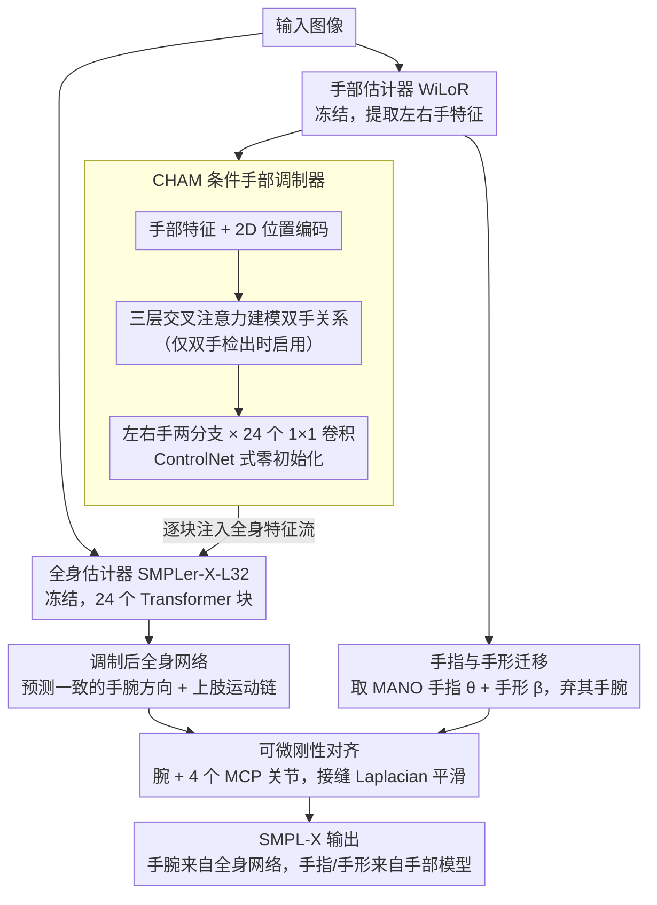

# Enhancing Hands in 3D Whole-Body Pose Estimation with Conditional Hands Modulator

**会议**: CVPR 2026  
**arXiv**: [2603.14726](https://arxiv.org/abs/2603.14726)  
**代码**: [有](https://mks0601.github.io/Hand4Whole-plus-plus)  
**领域**: 3D视觉  
**关键词**: 全身姿态估计, 手部姿态, SMPL-X, 特征调制, 模块化框架

## 一句话总结

提出Hand4Whole++模块化框架，通过轻量级CHAM模块将预训练手部估计器的特征注入冻结的全身姿态估计器中，实现手腕方向的精准预测，并通过可微刚性对齐从手部模型迁移精细手指关节和手部形状。

## 研究背景与动机

3D全身姿态估计面临一个根本性的**监督差距(supervision gap)**问题：

- **全身数据集**（如AGORA、ARCTIC）：提供全身标注但手部姿态多样性有限
- **手部数据集**（如InterHand2.6M）：提供精细的手指标注但缺少全身上下文

这导致：
1. 全身估计器（如SMPLer-X）虽然捕捉整体结构但手部精度不足
2. 手部估计器（如WiLoR、HaMeR）手指精度高但缺乏全局身体感知

**朴素组合**（直接拼接手部输出到身体上）会导致手腕方向与上肢运动链不一致，产生物理不合理的姿态

**核心挑战**：如何在保持全身一致性的同时获取精细的手部细节？

## 方法详解

### 整体框架

这篇论文要解决的，是全身姿态估计器与手部姿态估计器"各有所长却合不到一起"的矛盾：前者懂整体身体结构但手部糊，后者手指精细却完全不感知上肢运动链。Hand4Whole++的做法是不去重训任何一方，而是把两个**预训练且冻结**的专家——全身估计器SMPLer-X-L32 与手部估计器WiLoR——保留下来，只在中间插一个轻量、可训练的桥接模块CHAM（Conditional Hands Modulator）。

整条流水线是这样转的：一张图同时喂给两个估计器；WiLoR提取左右手的高质量特征，CHAM把这些手部特征"调制"进全身估计器的特征流，从而让全身网络预测出与上肢运动链一致的手腕方向；最后再用一个可微的迁移步骤，把WiLoR那套精细的手指关节和手部形状直接搬到全身网格上。最终输出的SMPL-X参数里，**手腕方向来自被调制后的全身网络，手指与手形则来自手部模型**。

### 关键设计

**1. CHAM：用冻结手部专家的特征去"调制"全身网络，而非粗暴拼接**

朴素组合（直接把手部输出的手腕方向复制到身体上）之所以崩，是因为手部估计器根本不知道肩、肘的位置，复制过来的手腕往往和上肢运动链打架。CHAM绕开这种硬拼：它从WiLoR的ViT backbone取左右手的最终层特征，加上2D位置编码以保留手在全身图像中的空间位置，再过一个三层交叉注意力Transformer编码器来建模双手关系——这个交叉注意力只在两只手都被检出时才启用，单手场景就跳过。调制本身由两个独立分支（左手、右手）完成，每个分支含24个 $1\times1$ 卷积层，正好对应SMPLer-X的24个Transformer块，逐块把手部信息注入全身特征流；所有卷积层都按ControlNet的思路**零初始化**，保证训练起点是中性的、不会一上来就扰乱预训练特征。为了让手部特征落到正确的位置，CHAM用逆仿射变换把它映射回全身特征图空间，非手区域零填充，左右两支再用逐元素最大值合并。值得注意的是，这种注入不只修正手腕——它顺着特征流把整个上肢运动链（肩、肘、腕）都带顺了，因此连全身姿态质量都跟着提升，而额外开销只有约10ms（总运行时间的~10%）。

**2. 手指关节与手部形状迁移：把MANO的精细手指可微地"贴"回全身网格**

CHAM负责手腕方向，但精细的手指弯曲和手形仍然是WiLoR更擅长。于是迁移步骤直接采用手部估计器输出的MANO手指姿态 $\theta_{rh}, \theta_{lh}$ 与手部形状 $\beta_{rh}, \beta_{lh}$，唯独丢弃它预测的手腕方向，改用CHAM调制后的全身手腕。把这套手参数对齐到全身网格的方式是一个基于腕关节加四个MCP关节的**刚性对齐**，并对接缝处做Laplacian平滑。关键在于这个对齐**完全可微**——梯度能一路回传到CHAM，让手腕方向的优化和手指迁移端到端地协同。之所以宁可用MANO的手形而非SMPL-X自带的手，是因为SMPL-X把身体、手、脸联合编码在一个共享潜在空间里，手形的表达力被摊薄了，而MANO的手部形状空间更专、更精细（点到点误差1.34mm vs SMPL-X的1.98mm）。

### 损失函数 / 训练策略

训练时冻结两个预训练估计器，仅优化CHAM：

- **姿态损失**：$\ell_1$ 距离（预测 vs GT 3D关节旋转）；手部数据集通过前向运动学转换为全局手腕方向
- **形状损失**：全身数据集用 $\ell_1$；手部数据集用 $\ell_2$ 正则化
- **2D/3D关键点损失**：$\ell_1$ 损失，参考系按数据集类型选择（骨盆/右腕/腕关节相对）
- **身体根姿态正则化**：手部数据集缺少全身标注时，正则化SMPL-X根姿态保持垂直躯干

训练数据：InterHand2.6M、ReInterHand、ARCTIC、AGORA。4个epoch，批大小32，单卡RTX A6000约20小时。

## 实验关键数据

### 主实验

**Table 1: 与基线方法在全身/手部数据集上的比较（MPVPE/MRRPE, mm）**

| 方法 | AGORA Full/Hands | ARCTIC Full/Hands | EHF Full/Hands | IH26M MPVPE/MRRPE | ReIH MPVPE/MRRPE |
|------|------------------|-------------------|----------------|---------------------|-------------------|
| 原始全身模型 | 85.61/52.31 | 56.06/31.48 | 63.26/46.21 | 38.64/119.56 | 58.86/101.82 |
| 微调全身模型 | 90.77/55.91 | 67.52/29.03 | 126.34/57.35 | 20.00/47.89 | 24.87/28.32 |
| 仅手部模型 | -/99.11 | -/46.79 | -/46.28 | 11.17/94817 | 8.09/3094 |
| **Hand4Whole++** | **76.84/49.71** | **45.95/25.03** | **61.24/33.43** | **9.40/32.30** | **7.98/16.37** |

**Table 4: 与SOTA全身方法的对比**

| 方法 | AGORA Full/Hands | ARCTIC Full/Hands | EHF Full/Hands |
|------|------------------|-------------------|----------------|
| Hand4Whole | 185.18/74.55 | 151.47/47.79 | 76.84/39.82 |
| OSX | 178.28/76.37 | 111.42/50.70 | 70.82/53.73 |
| SMPLer-X | 85.61/52.31 | 56.06/31.48 | 63.26/46.21 |
| **Hand4Whole++** | **76.84/49.71** | **45.95/25.03** | **61.24/33.43** |

### 消融实验

**Table 2: 全身+手部模型组合策略消融（AGORA, MPVPE）**

| 策略 | 全身误差 | 手部误差 |
|------|----------|----------|
| 原始全身模型 | 84.76 | 52.31 |
| 直接复制手腕方向 | 90.70 | 100.59 |
| **CHAM调制** | **76.88** | **50.56** |

**Table 3: 手指关节与形状迁移消融（MPVPE/MRRPE）**

| Finger | Shape | IH26M | ReIH | HIC |
|--------|-------|-------|------|-----|
| ✗ | ✗ | 14.69 | 18.13 | 21.68 |
| ✓ | ✗ | 12.26 | 15.24 | 19.61 |
| ✓ | ✓ | **9.40** | **7.98** | **17.72** |

### 关键发现

1. **微调全身模型适得其反**：在手部数据集上过拟合，EHF全身误差从63→126mm
2. **直接复制手腕方向灾难性**：手部误差从52→101mm，因为手部估计器不感知上肢运动链
3. **CHAM不仅改善手部，还改善全身**：全身误差从84.76→76.88mm，因为优化了整个上肢运动链
4. **形状迁移贡献显著**：MANO手部形状空间(点到点误差1.34mm)远优于SMPL-X(1.98mm)
5. 手部估计器MRRPE极大（WiLoR: 94817mm），说明独立预测的手完全没有全身一致性

## 亮点与洞察

1. **冻结+调制的设计哲学**：保留预训练模型能力，仅通过轻量模块桥接，避免灾难性遗忘
2. **ControlNet式思路迁移到姿态估计**：零初始化卷积确保稳定起步
3. **对"为什么不直接组合"的深入分析**：清晰展示了朴素组合的失败模式和原因
4. **交叉注意力仅在双手检测时启用**：灵活处理单手/双手场景

## 局限与展望

1. 手部数据集缺少全身标注，非手关节仅有弱监督，可能与图像不对齐
2. 依赖两个预训练模型导致运行时间增加（总计~0.1s/帧，其中WiLoR占50%）
3. 未在自我中心视角(egocentric)场景上正式验证（仅初步观察）
4. CHAM的交叉注意力设计假设最多两只手，多人交互场景未覆盖

## 相关工作与启发

- **与ControlNet的关系**：借鉴了控制预训练模型的轻量调制设计，但用于姿态估计而非生成
- **与FrankMocap/Hand4Whole的区别**：前者直接拼接手部输出，后者在关节层面融合特征，本文通过特征调制实现更深层的信息注入
- **与HMR-Adapter的区别**：HMR-Adapter从全身内部特征插值手部特征（质量差），本文注入外部手部模型的特征（信息量大）
- **启发**：类似的"专家调制"范式可推广到其他部位（如脚、面部表情）

## 评分

- 新颖性: ⭐⭐⭐⭐ — CHAM设计巧妙，但整体思路是ControlNet的自然延伸
- 实验充分度: ⭐⭐⭐⭐⭐ — 6个数据集验证，消融全面，含MANO vs SMPL-X形状表达力对比
- 写作质量: ⭐⭐⭐⭐⭐ — 动机清晰，对比分析到位，失败案例阐述充分
- 价值: ⭐⭐⭐⭐ — 实用性强，10fps实时，模块化设计易于集成

<!-- RELATED:START -->

## 相关论文

- [\[CVPR 2025\] Hearing Hands: Generating Sounds from Physical Interactions in 3D Scenes](../../CVPR2025/3d_vision/hearing_hands_generating_sounds_from_physical_interactions_in_3d_scenes.md)
- [\[ECCV 2024\] 3D Reconstruction of Objects in Hands without Real World 3D Supervision](../../ECCV2024/3d_vision/3d_reconstruction_of_objects_in_hands_without_real_world_3d.md)
- [\[ICCV 2025\] RapVerse: Coherent Vocals and Whole-Body Motion Generation from Text](../../ICCV2025/3d_vision/rapverse_coherent_vocals_and_whole-body_motion_generation_from_text.md)
- [\[ECCV 2024\] Multi-HMR: Multi-Person Whole-Body Human Mesh Recovery in a Single Shot](../../ECCV2024/3d_vision/multi-hmr_multi-person_whole-body_human_mesh_recovery_in_a_single_shot.md)
- [\[CVPR 2026\] PoseMaster: A Unified 3D Native Framework for Stylized Pose Generation](posemaster_a_unified_3d_native_framework_for_stylized_pose_generation.md)

<!-- RELATED:END -->
