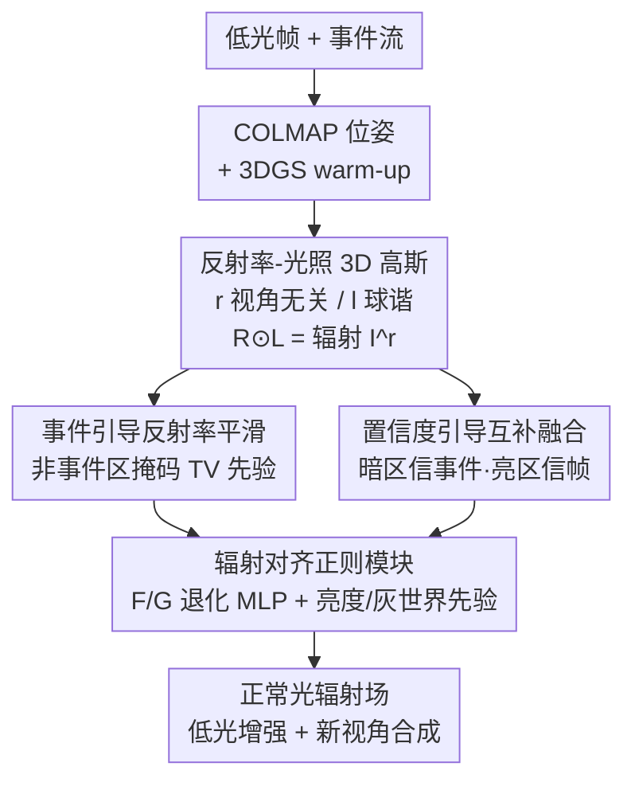

# eRetinexGS: Retinex Modeling for Low-Light Scene Enhancement via Event Streams and 3D Gaussian Splatting

**会议**: CVPR 2026  
**论文**: [CVF Open Access](https://openaccess.thecvf.com/content/CVPR2026/html/Yan_eRetinexGS_Retinex_Modeling_for_Low-Light_Scene_Enhancement_via_Event_Streams_CVPR_2026_paper.html)  
**代码**: 项目页 https://zju-bmi-lab.github.io/eRetinexGS-homepage/ （未见开源 code 仓库）  
**领域**: 3D视觉  
**关键词**: 低光增强, 事件相机, Retinex分解, 3D高斯泼溅, 新视角合成  

## 一句话总结
eRetinexGS 把"事件流 + 低光帧 + 多视角一致性"三者塞进同一个 3DGS 框架，让每个高斯显式存反射率和光照两个属性，再用事件信号引导 Retinex 分解、按置信度自适应融合两种模态，在极暗场景下重建出细节清晰、颜色准确的正常光辐射场，PSNR 比之前最好的事件+帧方法高出 5 dB 以上，还能 83 FPS 实时渲染。

## 研究背景与动机
**领域现状**：低光增强目前主要有两条路。一条是基于 Retinex 的本征分解（把图像拆成反射率 $R$ 和光照 $L$，$I=R\odot L$），有物理依据；另一条是引入额外线索，比如事件相机——它高动态范围、高时间分辨率，能在暗处提供帧拍不到的结构信息。近年又有人用 NeRF/3DGS 的多视角一致性来抑制噪声、做自监督增强。

**现有痛点**：三条路单独走都不够。纯 Retinex 在极暗下噪声压倒信号、分解变成病态问题；纯事件方法是数据驱动的，对训练数据偏置敏感、泛化差，而且常忽略颜色保真；纯帧的 3DGS 方法在缺乏可靠观测的极暗区直接失效（论文 Fig.1(b)）。而如果天真地把事件和低光帧一起丢进 3DGS，会因为没正确建模二者在低光下的关系，导致颜色失真和细节丢失（Fig.1(c)）。

**核心矛盾**：低光下事件和帧"都坏了"——事件有泄漏噪声、散粒噪声、运动拖尾，帧有低对比、重噪声、颜色偏移；更麻烦的是，两种模态的线索可能来自同一区域，到底该信谁、谁更可靠，没有现成答案。

**切入角度**：作者抓了两个具体观察。其一，短时间窗口内的事件切片能揭示结构——**没有事件触发的区域往往就是反射率平滑的区域**（因为低光下事件只由反射率突变、遮挡/运动边界或光照波动触发），这给反射率提供了一个免费的平滑先验。其二，事件和帧是对场景辐射的**两种不同量化**：事件在对数强度域，对暗区结构更可靠；帧在 sRGB 域，对中等/明亮区的光度更准。

**核心 idea**：在 3DGS 里让每个高斯显式携带反射率和光照属性，用"事件引导的反射率平滑 + 置信度引导的互补融合"把事件和低光帧绑到一个正常光辐射场上，再用两个 MLP 显式建模两种模态的退化过程来对齐——统一框架同时吃下物理先验、互补线索和多视角自监督约束。

## 方法详解

### 整体框架
给定单目低光序列 $\{I^l_t\}_{t=1}^T$ 和同步事件流 $\mathcal{E}$，目标是恢复正常光辐射场 $\{I^r_t\}$ 并支持高质量新视角合成。流程先用 COLMAP 从低光帧估相机位姿，然后**两阶段训练**：阶段 1（前 3000 次迭代）用 vanilla 3DGS 先 warm-up 一个粗糙 3D 场景；阶段 2（第 3000→30000 次迭代）换上事件引导的 Retinex 分解，得到一个渲染结果可被显式拆成反射率和光照的辐射场。

核心是让 3DGS 学一个被显式分解成反射率 $R$ 和光照 $L$ 的场景表示。每个高斯存两个属性——反射率 $r_k\in\mathbb{R}^3$ 和光照 $l_k\in\mathbb{R}$，前者视角无关（材质反照率，理应不随视角变），后者视角相关（用球谐参数化，因为光照取决于光源-法向夹角）。通过 alpha blending 渲染出 $R$、$L$ 两张图，再相乘得到线性空间辐射 $I^r=R\odot L$。在此基础上，事件引导的反射率平滑和置信度引导的互补融合负责改善分解和监督，两个退化 MLP（$\mathcal{F}$、$\mathcal{G}$）负责把退化的事件/帧对齐回辐射场。

### 关键设计

**1. 反射率-光照 3D 高斯：把 Retinex 分解嵌进 3DGS**

针对极暗下 2D Retinex 分解病态、纯 3DGS 又无法分离材质与光照的问题，作者改造高斯属性：标准 3DGS 每个高斯只输出颜色 $C$，这里改成每个高斯额外存反射率 $r_k$ 和光照 $l_k$，通过前后向排序的透射率 $\alpha_k$ 做 alpha 混合分别渲染出整图的 $R$ 和 $L$：$R=\sum_{k}r_k\alpha_k\prod_{u<k}(1-\alpha_u)$，$L$ 同理，最终辐射 $I^r=R\odot L$。关键的物理约束是"反射率视角无关、光照视角相关"：$r_k$ 当成常量，$l_k$ 用球谐建模。这一约束把解空间收紧，缓解了反照率-着色之间的泄漏（albedo–shading leakage），相比 LLNeRF 这类隐式分解收敛更快、训练更稳。由于方法自监督、没有正常光 $I^n$ 的直接监督，可视化时用 gamma 校正 $I^n=(I^r)^{1/\gamma}$（$\gamma=2.2$）。

**2. 事件引导的反射率平滑：用"没有事件"当平滑先验**

针对极暗区帧 SNR 崩塌、梯度估计失效导致反射率分解不稳的问题，作者把"非事件区即平滑区"这个观察落成一个掩码总变分（masked TV）先验，只在没有事件的地方惩罚反射率梯度：

$$\mathcal{L}_{\text{tv}}=\frac{1}{H\times W}\sum_{\mathbf{u}}\big(1-M_e(\mathbf{u})\big)\,\big\lVert\nabla R(\mathbf{u})\big\rVert_1$$

其中 $M_e(\mathbf{u})\in[0,1]$ 是事件导出的边缘图。逻辑很直接：事件只在对数强度变化超阈值时触发，低光下这种变化主要来自反射率突变或边界/光照波动，所以"没事件"基本等价于"局部反射率平滑"。在事件对齐的边缘处（$M_e$ 大）惩罚被抑制，从而保结构；其余地方鼓励平滑。由于低光事件常有延迟拖尾，构造 $M_e$ 前先做事件拖尾抑制（ETS）。单视角下事件稀疏时该先验不太可靠，但多视角的跨视图监督能缓解这个问题。

**3. 置信度引导的互补融合：暗处信事件、亮处信帧**

针对"两种模态线索可能来自同一区域、不知该信谁"的难题，作者不去显式估计 SNR（自监督下缺干净参考，难做），而是把**恢复出的辐射本身**当置信度代理：取 $I^r_t$ 的灰度版 $I^{rg}_t$ 当置信图，按它自适应加权事件损失与图像损失：

$$\mathcal{L}_{\text{data}}=\big(1-sg(I^{rg}_t)\big)\odot\mathcal{L}_{ev}+sg(I^{rg}_t)\odot\mathcal{L}_{img}$$

其中 $sg(\cdot)$ 是 stop-gradient。直觉是：恢复辐射越暗的像素（$I^{rg}$ 小），$1-sg(I^{rg})$ 越大，越偏向事件损失（暗区事件更可靠）；越亮的像素越偏向图像损失（亮区帧光度更准）。这正好对上"事件在对数域细粒度于暗区、帧在 sRGB 域精确于亮区"的互补量化特性。

**4. 辐射对齐正则模块：用两个 MLP 显式建模退化**

针对"低光下事件和帧各坏各的，硬加跨模态约束会把噪声传播进重建"的问题，作者不直接拿原始退化信号去监督辐射，而是学两个退化算子把辐射"打回"到各模态的退化空间再比对。图像侧用 $\mathcal{G}$-MLP 建模从辐射到低光图的退化 $\hat{I}^l=\mathcal{G}(I^r)$（吃下信号相关噪声、非线性 ISP 和逐通道颜色偏移）；事件侧用 $\mathcal{F}$-MLP 在传感器对数差分之前的线性辐照域对齐，$\hat{E}=\Delta\log(\mathcal{F}(I^r))$（用轻量逐通道增益对齐渲染亮度变化与事件相机感知到的变化）。两侧损失各自用 L1+D-SSIM。此外加两个先验稳定辐射：亮度损失 $\mathcal{L}_{\text{brightness}}$ 约束全局亮度逼近固定目标 $b_t$（合成数据 0.55、真实数据 0.4），灰世界损失 $\mathcal{L}_{\text{gray}}=\frac{\text{var}_c(I^r_t)}{\beta+\text{var}_c(R)}$（$\beta=0.5$）按通道方差比缓解颜色偏移，并对饱和区做动态加权防过校正。

### 损失函数 / 训练策略
总损失 $\mathcal{L}_{\text{total}}=\mathcal{L}_{data}+\lambda_2\mathcal{L}_{\text{brightness}}+\lambda_3\mathcal{L}_{\text{gray}}+\lambda_4\mathcal{L}_{\text{tv}}$，权重 $\lambda_1=0.8$（L1 与 D-SSIM 内部权重）、$\lambda_2=1.0$、$\lambda_3=0.1$、$\lambda_4=0.1$。事件对比阈值 $\Theta=0.2$。两阶段共 30000 次迭代，单张 RTX 3090 训练约 1 小时/场景。

## 实验关键数据

### 主实验
合成数据用 LLFF（8 个场景，3 室外 5 室内），按 gamma 校正合成低光图 $I^{l,c}=\beta\cdot(\alpha I^n)^\gamma$ 并用 v2e 仿真彩色事件；真实数据用 DAVIS346C 自采 6 个低光场景（曝光 5/10 ms，像素强度多在 50 以下）。指标 PSNR/SSIM/LPIPS，新视角按 1/8 留出视图评测。

| 方法 | 输入 | 增强 PSNR↑ | 增强 SSIM↑ | 增强 LPIPS↓ | NVS PSNR↑ |
|------|------|-----------|-----------|------------|-----------|
| RetinexFormer* | F | 16.15 | 0.3164 | 0.4217 | 16.08 |
| EvLowLight* | F+E | 18.18 | 0.4841 | 0.4350 | 18.02 |
| EvLight* | F+E | 15.15 | 0.2320 | 0.5220 | 14.27 |
| LLNeRF | F | 17.78 | 0.5263 | 0.3586 | 15.72 |
| LuSh-NeRF | F | 16.68 | 0.4837 | 0.3939 | 14.23 |
| IncEventGS | E | 12.04 | 0.2065 | 0.5232 | 11.74 |
| **eRetinexGS (Ours)** | F+E | **23.45** | **0.8312** | **0.0888** | **22.67** |

在增强和新视角合成两个任务、所有指标上都明显领先：增强 PSNR 比最好的事件+帧基线 EvLowLight（18.18）高 5.27 dB，LPIPS 从 0.43 量级压到 0.089。纯事件方法（IncEventGS、NeR-Net）在亮度和颜色上不准，纯帧方法在暗区丢细节，学习型融合方法（EvLowLight/EvLight）受数据偏置出伪影——三类都被显著超过。

### 消融实验
| 配置 | PSNR↑ | SSIM↑ | LPIPS↓ | 说明 |
|------|-------|-------|--------|------|
| Ours w/o E, $\mathcal{L}_{tv}$ | 17.21 | 0.5030 | 0.5027 | 去掉事件+平滑先验，掉 6.24 dB（最致命） |
| Ours w/o $I^l$ | 17.88 | 0.5404 | 0.5403 | 去掉低光帧，掉 5.57 dB |
| Ours w/o $\mathcal{L}_{tv}$ | 21.83 | 0.7282 | 0.2047 | 只去事件平滑先验，掉 1.62 dB |
| Ours w/o $\mathcal{L}_{brightness}$ | 19.52 | 0.7684 | 0.1843 | 去亮度损失，曝光退化掉 3.93 dB |
| Ours w/o $\mathcal{L}_{gray}$ | 22.73 | 0.8185 | 0.1916 | 去灰世界先验，颜色保真下降 |
| **Ours (Full)** | **23.45** | **0.8312** | **0.0888** | 完整模型 |

### 关键发现
- **事件这一支贡献最大**：去掉事件和平滑先验（w/o E, $\mathcal{L}_{tv}$）PSNR 直接从 23.45 跌到 17.21，是所有变体里掉得最狠的，印证暗区主要靠事件提供可靠结构。去掉低光帧也掉 5.57 dB，说明亮区光度仍离不开帧——两模态确实互补。
- **亮度损失对曝光至关重要**：去掉后掉近 4 dB，因为自监督没有正常光监督，全局亮度需要这个先验来锚定。
- **分解质量可视化**：相比 LLNeRF，本方法的反射率 $R$ 编码视角无关的色彩纹理、光照 $L$ 捕获视角相关的明暗，分离干净，没有 LLNeRF 那种亮度跳变和着色残留（光照泄漏进 $R$）。
- **实时性**：83 FPS 实时渲染（RTX 3090），优于 NeRF 类方法。

## 亮点与洞察
- **"没有事件"也是一种信息**：把事件的稀疏性反过来用——非事件区当作反射率平滑先验，等于免费拿到一张结构掩码去正则化病态的 Retinex 分解，这个视角很巧。
- **用恢复辐射当置信度代理**：自监督下没法显式估 SNR，作者直接拿正在优化的辐射灰度图当置信权重，配合 stop-gradient 实现"暗信事件、亮信帧"的自适应融合，省掉了噪声建模和干净参考的依赖，这个 trick 可迁移到其他缺参考的多模态融合任务。
- **退化建模而非直接监督**：不把退化信号当 GT，而是学 $\mathcal{F}/\mathcal{G}$ 两个 MLP 把干净辐射打回退化空间再比对，避免噪声反传，是处理"监督信号本身就脏"场景的通用思路。
- **物理约束当正则**：反射率视角无关、光照球谐视角相关，这条简单约束就把分解的解空间收紧、加速收敛——把领域物理知识塞进 3DGS 属性设计的范例。

## 局限与展望
- 作者承认的失败案例：COLMAP 位姿不准、事件稀疏导致软边界、镜面/非朗伯表面会拖累重建。
- ⚠️ 依赖 COLMAP 从低光帧估位姿——但极暗下特征匹配本身就难，这构成一个潜在的鸡生蛋问题，位姿误差会直接传到辐射场。
- 真实数据集是自采的 6 个场景，规模偏小；缺少公开的帧-事件低光场景基准，横向可比性受限。
- 球谐建模光照对强烈视角相关的高光/复杂间接光可能不足，这也呼应了非朗伯表面的失败案例。
- 改进方向：把位姿估计也纳入联合优化（事件辅助的位姿细化），以及更强的视角相关光照表示来处理镜面场景。

## 相关工作与启发
- **vs LLNeRF（纯帧自监督分解）**：LLNeRF 只用低光 RGB 做隐式分解，暗区缺结构线索导致分解不稳、光照泄漏进反射率；本文加事件引导平滑 + 显式高斯属性分解，分离更干净、跨视图更一致。
- **vs EvLowLight / EvLight（学习型帧+事件融合）**：它们靠数据驱动的映射、对偏置敏感且多为单帧、缺时序一致性；本文是自监督、多视角，靠几何/光度一致性抑噪，PSNR 高 5 dB 以上。
- **vs IncEventGS / NeR-Net（纯事件）**：纯事件方法常需预定义背景强度、亮度颜色不准；本文显式补回帧的光度信息并按置信度融合，颜色保真显著更好。
- **vs EvLight 的 SNR 引导融合**：EvLight 用显式 SNR 估计做融合但需噪声建模；本文用恢复辐射当置信代理，绕开了自监督下难以获得的干净参考。

## 评分
- 新颖性: ⭐⭐⭐⭐⭐ 首次把 Retinex 分解、事件流、多视角 3DGS 三者统一，且"非事件区当平滑先验""辐射当置信代理"两个观察都很有巧思
- 实验充分度: ⭐⭐⭐⭐ 合成+真实双数据、与 10 个 SOTA 对比、消融覆盖每个模块，但真实场景仅 6 个、无公开基准
- 写作质量: ⭐⭐⭐⭐ 动机推导清晰、图示到位（两条 cues 讲得很明白），公式偶有 OCR 噪声但逻辑完整
- 价值: ⭐⭐⭐⭐⭐ 极暗场景增强 + 实时新视角合成，对自动驾驶/监控/机器人有直接应用价值，退化建模思路可迁移

<!-- RELATED:START -->

## 相关论文

- [\[CVPR 2026\] $L^{2}DGS$: Low-Light Dynamic Gaussian Splatting](l2dgs_low-light_dynamic_gaussian_splatting.md)
- [\[CVPR 2026\] Geometric-Photometric Event-based 3D Gaussian Ray Tracing](geometric-photometric_event-based_3d_gaussian_ray_tracing.md)
- [\[CVPR 2026\] E2EGS: Event-to-Edge Gaussian Splatting for Pose-Free 3D Reconstruction](e2egs_event-to-edge_gaussian_splatting_for_pose-free_3d_reconstruction.md)
- [\[CVPR 2026\] Part$^{2}$GS: Part-aware Modeling of Articulated Objects using 3D Gaussian Splatting](part2gs_part-aware_modeling_of_articulated_objects_using_3d_gaussian_splatting.md)
- [\[CVPR 2026\] FastEventDGS: Deformable Gaussian Splatting for Fast Dynamic Scenes from a Single Event Camera](fasteventdgs_deformable_gaussian_splatting_for_fast_dynamic_scenes_from_a_single.md)

<!-- RELATED:END -->
