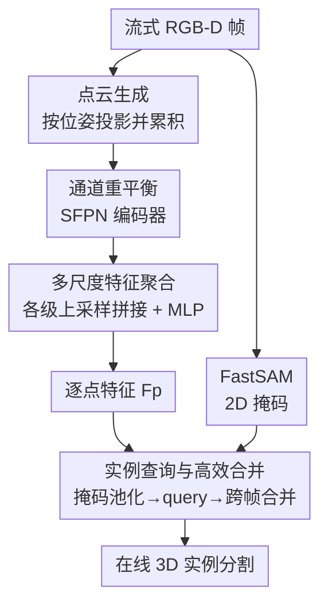

# ESAM++: Efficient Online 3D Perception on the Edge

**会议**: CVPR 2026  
**论文**: [CVF Open Access](https://openaccess.thecvf.com/content/CVPR2026/html/Liu_ESAM_Efficient_Online_3D_Perception_on_the_Edge_CVPR_2026_paper.html)  
**代码**: https://github.com/qinliuliuqin/esamplusplus  
**领域**: 3D视觉  
**关键词**: 在线3D感知, 3D实例分割, 稀疏特征金字塔, 边缘部署, 稀疏卷积  

## 一句话总结
ESAM++ 把在线 3D 感知 SOTA 方法 ESAM 里最慢的 3D 稀疏 UNet 主干换成一个轻量的「3D 稀疏特征金字塔网络（SFPN）」，靠多尺度特征聚合 + 通道重平衡，在 4 个室内分割基准上把 CPU 推理提速最高 3×、模型缩小 2×，同时保住甚至超过 ESAM 的精度，使无 GPU 的边缘设备（手机 CPU）也能跑实时在线 3D 实例分割。

## 研究背景与动机
**领域现状**：在线 3D 场景感知要从连续的 RGB-D 视频流里，逐帧增量地输出整个场景的 3D 实例分割。它是机器人导航/操作、AR/VR、自动驾驶的视觉底座。当前最强的做法是 EmbodiedSAM（ESAM）：用 SAM / FastSAM 在 2D 图上拿到分割掩码，再把这些 2D 掩码「抬升」成带几何感知的 3D query，从而高效地跨帧合并掩码，做到实时、细粒度、可泛化的在线 3D 实例分割。

**现有痛点**：ESAM 的精度很好，但它的点云特征提取仍然依赖一个计算很重的 3D 稀疏 UNet，这一块吃掉了 3D 部分推理时间的绝大部分，在算力受限、又看重隐私（数据不出端）的边缘设备上根本跑不动。作者对这个 UNet 做了逐层计算分析，定位出两个具体的低效来源：① **高分辨率的顶层**（与输入同分辨率的层）因为体素密集、卷积核大，贡献了绝大部分延迟；② **低分辨率的底层**因为通道数随下采样不断翻倍，贡献了绝大部分参数量（模型体积）。此外 UNet 的 decoder 虽然逐级上采样出了丰富的多尺度特征，但**只在最高分辨率那一层做预测**，中间层特征被白白浪费。

**核心矛盾**：UNet 的「单一最高分辨率出预测」范式，迫使它必须把昂贵的高分辨率层和大通道的深层都留着——延迟和体积下不来，而 decoder 已经算出来的多尺度信息又没被用上。效率和精度被绑死在了这个结构里。

**本文目标**：换掉这个瓶颈主干，在不掉精度的前提下同时砍掉延迟（顶层）和参数量（底层），并把 decoder 的多尺度特征真正利用起来。

**切入角度**：2D 视觉里早就成熟的特征金字塔网络（FPN）——多尺度预测——在在线 3D 感知里几乎没人用。作者把这个思路搬到稀疏 3D 点云上：既然 decoder 每一级都有特征，那就让每一级都参与最终预测，而不是只用顶层。

**核心 idea**：用一个 3D 稀疏特征金字塔（SFPN）替换 3D 稀疏 UNet——高分辨率层限制输出通道以省延迟、删掉通道过多的冗余中间层以省体积，再用「全 decoder 层级上采样拼接」的多尺度聚合来补回因为限通道而损失的精度。

## 方法详解

### 整体框架
ESAM++ 完整继承了 ESAM 的增量式在线 pipeline，**只替换点云特征提取主干**。一帧到来时：先把当前帧的深度图按相机位姿投影成点云并累积进场景；FastSAM 在 RGB 图上给出一批类别无关的 2D 掩码；新主干 **SFPN** 从点云里抽出逐点特征 $F_p \in \mathbb{R}^{N\times C}$（默认 $C=96$）；随后沿用 ESAM 的实例分割头——把 2D 掩码按空间支撑在 $F_p$ 上池化成超点、初始化成 3D 实例 query、经 transformer query decoder 迭代精修得到当前帧掩码 $M^{cur}_t$，最后与历史累计掩码 $M^{acc}_{t-1}$ 做一次高效合并，得到更新后的全场景实例分割。

整个方法是「点云 → 主干特征 → 实例 query → 跨帧合并」的多模块串行 pipeline，且 2D 掩码分支与点云分支在分割头处汇合，适合配图：

### 关键设计

**1. 通道重平衡：高分辨率层限通道、删掉参数臃肿的冗余中间层**

这一点直接针对 UNet 的两个瓶颈。SFPN 同样是 encoder-decoder：encoder 用稀疏 3D 卷积 + 残差块逐级下采样，跨 4 个空间分辨率，通道从 $C_1$ 涨到 $C_4$；decoder 用稀疏转置卷积（ConvTr）逐级上采样并用残差块精修，通道从 $C_4$ 收回 $C_8$。关键在于通道配置不再是「分辨率越低通道越大」的无脑翻倍：在**高分辨率层主动压低输出通道数**（延迟主要来自这里，限通道 = 直接砍延迟），同时**移除那些需要超大通道的冗余中间层**（参数量主要来自这里，删层 = 直接砍体积）。作者据此给出 Small / Base / Large 三档变体（见下表参数），用一个超参面板覆盖「速度优先」到「精度优先」的部署需求：Small 仅 14.1M 参数、CPU 单帧 211ms，Large 41.2M、326ms。光做限通道会掉精度，所以必须配合下面的多尺度聚合来补偿。

**2. 多尺度特征聚合：把 decoder 每一级都拉回原分辨率拼起来出预测**

UNet 只在最高分辨率层出预测，浪费了 decoder 算出来的中间尺度特征；限通道之后高分辨率特征更弱，更需要把多尺度信息补回来。SFPN 的做法是：把 decoder **每一个 stage** 的输出都用稀疏转置卷积（ConvTr）上采样回原始分辨率，然后**拼接（concatenate）**成一张统一的高分辨率特征图，再过一个 MLP 压成最终的逐点特征 $F_p \in \mathbb{R}^{N\times C}$（$C=96$）。这相当于让金字塔的每一级都参与最终预测——粗尺度提供大感受野/语义上下文、细尺度提供边界，而不是像 UNet 那样只靠顶层一锤定音。正是这一步让「限了通道的轻量 encoder」仍能保住精度，是 ESAM++ 既快又准的核心。

**3. 2D 掩码引导的实例查询与高效跨帧合并（沿用并适配 ESAM 分割头）**

有了 $F_p$ 后，分割头要把它和 FastSAM 的 $L$ 个 2D 掩码 $M^{2d}_t \in \mathbb{R}^{H\times W\times L}$ 拧到一起出 3D 实例。**Query lifting**：按每个 2D 掩码的空间支撑在 $F_p$ 上池化，得到 $L$ 个超点特征 $F_s \in \mathbb{R}^{L\times C}$，用它初始化一组 3D 实例 query $Q_0$，再经若干 transformer query decoder 层迭代精修，预测当前帧掩码 $M^{cur}_t \in \mathbb{R}^{N\times K}$。**Query merging**：因为 $M^{cur}_t$ 和历史累计掩码 $M^{acc}_{t-1}$ 里每个掩码都是**定长特征表示**，跨帧合并退化成两组掩码特征间算两两相似度——直接一次矩阵乘法搞定，这正是在线设置下能实时合并的关键。这块结构基本沿用 ESAM，但作者强调与以往「只把 2D 特征融到 3D」的方法不同，ESAM++ **同时用 2D 特征和 2D 掩码**来引导 3D 表示学习。

### 损失函数 / 训练策略
为公平对比，loss 和训练策略基本照搬 ESAM（细节在附录）。训练在单卡 NVIDIA A6000 上完成，推理则在 Intel Xeon Silver 4314 CPU（2.40GHz）上测量，全程 PyTorch 实现。类别无关分割在 ScanNet200 上训练，类别相关分割在 ScanNet 上训练。

## 实验关键数据

### 主实验
四个室内基准（ScanNet / ScanNet200 / SceneNN / 3RScan），主指标为 AP（IoU 0.5–0.95），辅以 AP50/AP25 与 CPU 单帧延迟。所有变体都用 FastSAM 做 VFM，延迟记为 $T_{VFM}$ + 主干时间。

类别无关 3D 实例分割（ScanNet200）：

| 方法 | 在线 | AP | AP50 | AP25 | 参数 | CPU 延迟 |
|------|------|----|----|----|------|---------|
| ESAM [ICLR'25] | ✓ | 42.2 | 63.7 | 79.6 | 44.6M | $T_{VFM}$+934ms |
| ESAM-E [ICLR'25] | ✓ | 43.4 | 65.4 | 80.9 | 44.6M | $T_{VFM}$+934ms |
| Ours-Small | ✓ | 30.3 | 55.8 | 68.9 | **14.1M** | $T_{VFM}$+**211ms** |
| Ours-Base | ✓ | 39.7 | 60.6 | 77.5 | 23.5M | $T_{VFM}$+252ms |
| **Ours-Large** | ✓ | **43.7** | **66.1** | **81.2** | 41.2M | $T_{VFM}$+**326ms** |

Ours-Large 在精度上反超 ESAM-E（43.7 vs 43.4 AP），主干延迟却从 934ms 降到 326ms（≈2.9× 提速），参数从 44.6M 降到 41.2M；Small 档以约 3× 提速、2× 缩小换来可接受的精度回落，正是边缘场景想要的档位。

类别相关 3D 实例分割（ScanNet / SceneNN）：

| 方法 | 在线 | ScanNet AP | AP50 | SceneNN AP | AP50 |
|------|------|-----------|------|-----------|------|
| TD3D-MA [CVPR'24] | ✓ | 39.0 | 60.5 | 26.0 | 42.8 |
| ESAM-E [ICLR'25] | ✓ | 41.6 | 60.1 | 27.5 | 48.7 |
| ESAM-E+FF [ICLR'25] | ✓ | 42.6 | 61.9 | 33.3 | 53.6 |
| **Ours-Large** | ✓ | **43.7** | **63.5** | **34.1** | **53.9** |

Ours-Large 在两个数据集上都拿到在线方法的 SOTA。

### 消融实验
SFPN 架构消融（ScanNet200，类别无关）：

| 配置 | AP | 参数 | 延迟 | 说明 |
|------|----|----|------|------|
| No upsampled fusion | 34.0 | 39.6M | 312ms | 去掉 decoder 上采样融合 |
| No pyramid | 33.8 | 39.6M | 298ms | 去掉分层多尺度特征提取 |
| No skip connection | 36.4 | 36.5M | 277ms | 去掉 encoder-decoder 跳连 |
| **Full** | **43.7** | 41.2M | 326ms | 完整 SFPN |

边缘设备实测（iPhone 15 / A16 Bionic，仅用 CPU，100 次平均）：

| 设备 | 芯片 | CPU 延迟 | 功耗 |
|------|------|---------|------|
| iPhone 15 | A16 Bionic | 190ms | 4.5W |

相机位姿噪声鲁棒性（ScanNet200）：

| 噪声比例 | AP | AP50 | AP25 |
|---------|----|----|----|
| 0% | 43.7 | 66.1 | 81.2 |
| 1% | 43.7 | 66.0 | 81.2 |
| 5% | 42.4 | 64.6 | 79.6 |
| 10% | 38.9 | 60.3 | 77.4 |

### 关键发现
- **多尺度聚合是精度命脉**：去掉上采样融合（34.0）或去掉金字塔（33.8），AP 直接从 43.7 暴跌约 10 个点，且延迟/参数几乎没省——证明这一步几乎不花成本却撑起了大部分精度，是「限通道还不掉点」的根因。
- **跳连同样关键**：去掉 encoder-decoder 跳连掉到 36.4 AP，说明细节信息回流不可少。
- **跨数据集泛化强**：直接拿 ScanNet200 训练的模型迁到 SceneNN / 3RScan（表 3），Ours-Large 仍超过离线零样本方法；尤其 3RScan 相机运动快、RGB 模糊、位姿不准，离线方法因依赖干净重建网格而崩，在线的 ESAM++ 反而更稳。
- **真·边缘可跑**：Small 档在 iPhone 15 上仅用 CPU 就跑到 190ms/帧、4.5W，作者特意只报 CPU（不动 Neural Engine）以给出保守下界。
- **位姿噪声鲁棒**：5% 位姿噪声下 AP 仅从 43.7 掉到 42.4，10% 才明显劣化（20% 会出现失败案例，见 Fig.5）——这给「未来只用 RGB + 实时重建（如 CUT3R）跑在线 3D 感知」留了口子。

## 亮点与洞察
- **把 2D 的 FPN 思想干净地搬到稀疏 3D**：核心洞察是 UNet 的 decoder 早就算出了多尺度特征却只用顶层，SFPN 让每一级都出力——一个几乎零额外成本的改动撬动了 10 个点的精度，非常划算。
- **逐层计算分析驱动设计，而非拍脑袋**：先量化定位「顶层吃延迟、底层吃参数」，再分别对症（顶层限通道、删冗余底层），这种「先 profiling 再改结构」的方法论很值得复用到任何想上边缘的重模型。
- **定长掩码表示让跨帧合并退化成矩阵乘法**：这是在线实时性的隐形功臣，可迁移到任何需要逐帧增量合并实例的流式任务。
- **只换主干、复用强分割头**：把创新集中在最痛的瓶颈上，其余照搬 SOTA，工程上风险小、收益直接。

## 局限与展望
- 作者明说**只优化了点云主干**，另一个瓶颈——冻结的 VFM（FastSAM）——没动，留作未来工作；VFM 的延迟 $T_{VFM}$ 仍叠加在总耗时上。
- 仍**依赖带位姿的 RGB-D 视频**（已知内外参）；位姿噪声超过 ~10% 会明显掉点、20% 直接失败，纯 RGB 场景需配合实时重建模型（CUT3R），但论文只是展望、未做端到端验证。⚠️ 此方向为作者设想，非本文已验证结果。
- Small 档为了速度牺牲了不少精度（ScanNet200 仅 30.3 AP），精度-速度的取舍需按部署目标人工选档。
- 评测集中在室内静态/慢动场景（ScanNet 系），户外、大尺度、强动态场景下的表现未知。

## 相关工作与启发
- **vs ESAM / ESAM-E**：同一套 2D-mask-lift-to-3D + 跨帧合并 pipeline，本文把它的 3D 稀疏 UNet 主干换成 SFPN，精度持平/反超而延迟降约 3×、体积降 2×——是「在 SOTA 上做效率手术」的范例。
- **vs 离线方法（SAMPro3D / Open3DIS / SAI3D / Oneformer3D）**：离线方法在干净重建点云上预测，单帧精度可能更高，但需要完整场景、对位姿/重建质量敏感（3RScan 上明显崩）；ESAM++ 逐帧因果处理、无需未来帧，部署更现实。
- **vs INS-Conv / TD3D-MA 等在线方法**：它们多走「2D 特征融到 3D」路线，本文强调**同时用 2D 特征和 2D 掩码**引导 3D 表示，且主干更轻。

## 评分
- 新颖性: ⭐⭐⭐⭐ 把成熟的 FPN 多尺度思想首次系统性引入稀疏 3D 在线感知主干，针对性强但属「迁移+对症优化」而非全新范式。
- 实验充分度: ⭐⭐⭐⭐⭐ 四基准 + 类别无关/相关两任务 + 跨数据集泛化 + 真机边缘实测 + 位姿噪声鲁棒 + 三组架构消融，相当扎实。
- 写作质量: ⭐⭐⭐⭐ 动机由逐层 profiling 推导，逻辑清晰；瓶颈→设计→验证一条线贯通。
- 价值: ⭐⭐⭐⭐⭐ 让无 GPU 边缘设备（手机 CPU）实时跑在线 3D 实例分割，落地价值直接。

<!-- RELATED:START -->

## 相关论文

- [\[CVPR 2026\] PE3R: Perception-Efficient 3D Reconstruction](pe3r_perception-efficient_3d_reconstruction.md)
- [\[CVPR 2026\] Foundry: Distilling 3D Foundation Models for the Edge](foundry_distilling_3d_foundation_models_for_the_edge.md)
- [\[CVPR 2026\] ConsisVLA-4D: Advancing Spatiotemporal Consistency in Efficient 3D-Perception and 4D-Reasoning for Robotic Manipulation](consisvla-4d_advancing_spatiotemporal_consistency_in_efficient_3d-perception_and.md)
- [\[CVPR 2026\] E2EGS: Event-to-Edge Gaussian Splatting for Pose-Free 3D Reconstruction](e2egs_event-to-edge_gaussian_splatting_for_pose-free_3d_reconstruction.md)
- [\[CVPR 2026\] Global-Aware Edge Prioritization for Pose Graph Initialization](global-aware_edge_prioritization_for_pose_graph_initialization.md)

<!-- RELATED:END -->
