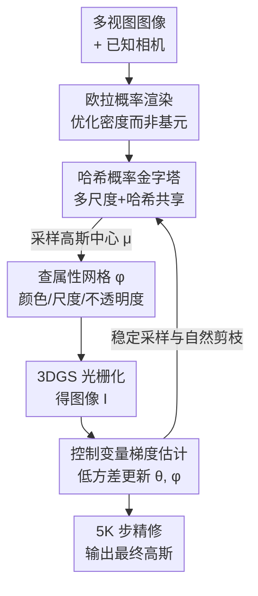

# Eulerian Gaussian Splatting using Hashed Probability Pyramids

**会议**: CVPR 2026  
**arXiv**: [2605.29136](https://arxiv.org/abs/2605.29136)  
**代码**: 无（论文未提供）  
**领域**: 3D视觉 / 辐射场 / 高斯泼溅  
**关键词**: 3D高斯泼溅、概率密度优化、欧拉视角、哈希概率金字塔、控制变量梯度估计

## 一句话总结
把 3DGS 里"靠手工启发式（ADC）增删高斯"换成"优化一个可学习的体素概率密度场、每步从中采样高斯来渲染"——用哈希概率金字塔让高分辨率密度可负担、用控制变量梯度估计把采样方差压下去，在 mip-NeRF 360 上随机初始化即达 SOTA 重建质量，同时保持 3DGS 级渲染速度。

## 研究背景与动机
**领域现状**：新视角合成目前两条主线。NeRF 用连续体密度 + 纯梯度下降优化，质量高但渲染慢（每像素要查百万次 MLP）；3DGS 用一批离散各向异性高斯做可微光栅化，渲染快且硬件友好，是当前实时方案的主流。

**现有痛点**：3DGS 的训练高度依赖一套叫"自适应密度控制（ADC）"的启发式——靠位置梯度幅值判断哪里要加高斯、再做分裂/克隆/剪枝。这些规则带着一堆 schedule 和阈值，脆弱且难调；更要命的是**局部没有梯度的高斯就动不了**，一个放错位置、周围又没信号的高斯无法自行迁移，必须靠额外的"擦除+重插"启发式才能纠正。后续工作（Taming-3DGS、Revising Densification 等）想把密度控制做得更有原则，但仍没摆脱阈值与调度。

**核心矛盾**：NeRF 的"连续场 + 纯梯度"稳定但慢，3DGS 的"离散基元 + 光栅化"快但要靠手工规则搬运基元。两者在"优化稳定性"和"运行效率"之间二选一，缺一个能同时占两头的表述。

**本文目标**：设计一种**渲染时是 3DGS、优化时像 NeRF** 的表述——既要 3DGS 的快速光栅化，又要 NeRF 那种"概率质量自动流向 loss 需要的地方"的灵活性，且全程无启发式。

**切入角度**：作者把 3DGS 的"拉格朗日视角"（显式搬运每个基元）换成**欧拉视角**——不直接动基元，而是优化一个支配"高斯该放在哪"的底层概率密度场 $p_\theta(\mu)$，每次迭代从中采样一批高斯去渲染。基元只是密度场的"样本"，哪里该长出结构由 loss 通过梯度自己说了算。

**核心 idea**：把高斯位置当作从可学习密度采样的随机变量，用梯度下降优化这个密度场（而非基元本身），从根上消灭增删基元的启发式。

## 方法详解

### 整体框架
方法叫 Eulerian Gaussian Splatting（EGS）。输入是一组带已知相机位姿的多视图图像，目标是优化出一个能匹配这些图像的场景表示。核心是一个**概率渲染模型**：图像 $I=\mathbb{E}_{\mathcal{G}\sim p(\mathcal{G})}[\text{Render}(\mathcal{G},\pi)]$，即渲染结果是"从分布 $p(\mathcal{G})$ 采样的若干高斯、经标准 3DGS 光栅化"的期望。作者假设各高斯独立，并把单个高斯的分布拆成"位置分布 $p_\theta(\mu)$"和"给定位置后其余属性的分布 $p_\phi(\phi|\mu)$"两部分——属性（颜色、不透明度、尺度、旋转）好优化，用确定性的 3D 哈希网格 $\phi$ 存；难优化的是位置分布 $p_\theta$，这才是本文要攻的核心。

每次训练迭代：① 从哈希概率金字塔 $p_\theta(\mu)$ 采样一批高斯中心 $\mu_i$；② 在属性哈希网格里查 $\phi(\mu_i)$ 得到颜色/尺度等；③ 用训练相机 $\pi_k$ 把这批高斯光栅化成图像 $I$；④ 与真值算 loss，梯度回传**同时更新密度参数 $\theta$ 和属性参数 $\phi$**。位置分布的梯度 $\nabla_\theta I$ 用专门设计的控制变量估计器算。训练收尾再做一次 5K 步的标准 3DGS 精修。

### 关键设计

**1. 欧拉概率渲染表述：把"搬基元"换成"优化密度场"**

直接动机是 3DGS 的 ADC 太脆、且局部无梯度的基元搬不动。作者不再把场景看成一堆要显式搬运的基元（拉格朗日视角），而是定义一个持久、可学习的体素概率密度 $p_\theta(\mu)$，把基元位置看成从它采样的样本，渲染图像写成期望 $I=\mathbb{E}_{\mathcal{G}\sim p(\mathcal{G})}[\text{Render}(\mathcal{G},\pi)]$（式 1）。优化的对象从"每个高斯的坐标"变成"密度场参数"，于是某处需要更多基元时，梯度会直接把概率质量推过去、不需要的地方质量自然消退——增、删、移全由梯度完成，不再有分裂/克隆/剪枝/重插这类手工规则。它的妙处在于把 NeRF 的"质量自由流动"和 3DGS 的"采样后快速光栅化"接到了一条可微管线上：优化时享受连续场的稳定与探索性，渲染时仍是离散高斯、保持实时

**2. 哈希概率金字塔：让高分辨率 3D 密度既可负担又能高效采样**

要把密度场做实，需要一个 3D 上 (i) 能高效采样、(ii) 高分辨率却不爆参数的分布。朴素的稠密网格参数量随体素立方增长（$4096^3$ 稠密网格要 275 GB），不可行。作者提出哈希概率金字塔：把分布写成 $L$ 层分段常数函数的乘积 $p_\theta(\mu)=\frac{1}{Z}\prod_{\ell=0}^{L-1}f^{(\ell)}_\theta(\mu)$（式 4），第 0 层归一化到积分为 1，其余每层的每个 $2\times2\times2$ 块各自归一化。这种"金字塔=层层乘积"的参数化是**完备的**——总自由度恰好 $N_{L-1}^3-1$，等价于一个 $N_{L-1}^3$ 分辨率的标准分布，不引入冗余。为压参数，对每层只分配至多 $B$ 个 $2\times2\times2$ 块、再用一个哈希函数 $T_\ell$（直接复用 Instant-NGP 的哈希）把它们随机平铺到该层所有 bin 上。

关键洞察是**3D 表面是稀疏的**：哈希碰撞大多发生在空白区域，把对应的粗层 bin 置零就能化解；而各层碰撞相互独立，所有层同时撞到一起的概率极低，所以共享几乎不损表达力。实验设置 $L=12$、最细层 $N_{11}=4096$、$B=2^{18}$，只用 8600 万参数就表达了 $4096^3$ 网格、占 0.33 GB，比稠密网格省 800 多倍。**采样**也很省：从最粗层采，再逐层按"上一层落入的 bin"条件细化（式 7），每步用逆变换采样；并通过把后续层的均匀噪声定义成 $u^{(\ell)}=\text{frac}(\mu^{(\ell-1)}N_{\ell-1})$（式 8）把整条采样链串成端到端可微，保证最终位置对所有金字塔参数可导

**3. 控制变量梯度估计：把采样带来的高方差压下去**

属性 $\phi$ 的梯度自动微分即可，但 $\theta$ 同时决定了求期望用的分布，$\nabla_\theta I$ 必须特殊处理。直接对可微采样过程自动微分（即 pathwise 估计器）虽无偏，但实测方差很高、训练慢且收敛差。作者从标准 score function 估计器 $\nabla_\theta I=\mathbb{E}[I\cdot\sum_i \nabla_\theta\log p_\theta(\mu_i)]$（式 12）出发，引入控制变量改成 $\nabla_\theta I=\mathbb{E}[\sum_i (I-I_{-i})\cdot\nabla_\theta\log p_\theta(\mu_i)]$（式 13），其中 $I_{-i}$ 是去掉第 $i$ 个高斯后渲染的图像。这相当于用"第 $i$ 个高斯对画面的个体贡献"给它的梯度加权，大幅降方差；同时因为 $I_{-i}$ 与 $\mu_i$ 统计独立、且 $\mathbb{E}[\nabla_\theta\log p_\theta]=0$，估计器仍无偏。

看上去 $I_{-i}$ 要为每个被剔除的高斯各渲染一张图、不可行；但作者证明 $I-I_{-i}=o_i\frac{\partial I}{\partial o_i}$（式 14，$o_i$ 是该高斯不透明度），这个量在对属性 $\phi$ 做自动微分时**顺手就能拿到**。于是低方差估计器的计算开销与普通自动微分相当，却换来稳定得多的训练——消融里这是影响最大的组件

**4. 稳定采样与自然剪枝：填补概率优化的几个坑**

概率化表述带来几个工程隐患，作者用三个小机制兜底。**防御性采样**：分布一旦在某区域错误地降到零概率就再也救不回来，于是对 20% 的样本加高斯噪声（标准差 $2\times10^{-3}$、前 2 万步线性退火到 0），帮模型早期多探索空间。**样本取整**：样本位置的随机抖动会改变高斯到相机的距离、给估计器引入方差，于是把每个样本"取整"到其最细层 bin 的中心（式 16），因有式 13 的估计器这不影响梯度。**重复样本剔除**：取整后同一 bin 内多个样本会完全重叠、经 alpha 合成的非线性放大方差，故只渲染唯一中心集合——这还附带一个红利：随着优化把概率质量往关键区域堆，重复样本变多、去重后实际渲染的高斯数自动下降，等于**天然的剪枝**。初始 $N=1.5\times10^7$ 个高斯会被模型自动收缩到合适数量（并设下界对齐 baseline 以保公平）

### 损失函数 / 训练策略
沿用 3DGS 的 $L_1$ + D-SSIM 重建损失（$\lambda_1=0.8$），并借鉴 3DGS-MCMC 对不透明度 $o_i$ 和尺度 $s_i$ 加 $L_1$ 正则，同时对 $\ell\ge1$ 阶球谐系数加权重 $0.2^\ell$ 的 $L_1$ 正则以鼓励优先用低阶球谐（式 15）。属性网格用 17 通道多分辨率哈希编码（不透明度 1 + 颜色 8 + 尺度旋转 8），并按 NeRF-Casting 的做法用收缩函数 Jacobian 的逆平方根缩放尺度，避免远处高斯过小浪费容量。无界场景用 $L_\infty$ 对称的收缩函数（式 9，$a=3/4$）映射到 $\mathbb{R}^3$。室外场景训 35K 步（30K 概率优化 + 5K 精修），室内 65K 步（60K + 5K），单张 H200 约 3.5–7.25 小时。

## 实验关键数据

### 主实验
在 mip-NeRF 360 全部场景 + Tanks&Temples 2 场景 + Deep Blending 2 场景上评测 PSNR/SSIM/LPIPS。重点对比同样随机初始化、同训练预算的 **3DGS-MCMC（Random）**；并列出依赖 COLMAP 点初始化的方法作参照。下表为 mip-NeRF 360 平均（Random 列）：

| 数据集(mip-NeRF360 平均) | 指标 | EGS(精修) | EGS(未精修) | MCMC-Random | Taming-Random |
|--------|------|------|------|------|------|
| 全部 | PSNR↑ | **28.35** | 28.10 | 28.26 | 26.24 |
| 全部 | SSIM↑ | 0.84 | 0.84 | 0.84 | 0.76 |
| 全部 | LPIPS↓ | 0.23 | 0.23 | 0.21 | 0.30 |
| 室外 | PSNR↑ | **25.49** | 25.28 | 25.36 | 22.62 |
| 室内 | PSNR↑ | 31.92 | 31.62 | 31.87 | 30.76 |

EGS（精修后）在随机初始化阵营拿下最高整体 PSNR（28.35），全面超过 MCMC-Random（28.26）和作为标准 3DGS 代理的 Taming-Random（26.24，室外尤其崩到 22.62）；与依赖 COLMAP 初始化的方法（如 COLMAP-MCMC 28.38）相比也大幅缩小差距、基本持平。T&T 与 DB 上同样可比或更优（如 DB Playroom 精修 30.49，最高）。

### 消融实验
在 mip-NeRF 360 的 6 个场景（3 室外 + 3 室内）上消融，报告精修前/后 PSNR/SSIM/LPIPS：

| 配置 | 精修前 PSNR | 精修后 PSNR | 说明 |
|------|---------|---------|------|
| F) 完整模型 | 29.29 / 0.88 / 0.20 | 29.52 / 0.88 / 0.19 | — |
| E) 去控制变量梯度(纯autodiff) | **22.35 / 0.62 / 0.51** | 23.69 / 0.64 / 0.47 | 掉最多，训练严重不稳 |
| A) 去不透明度正则 | 26.32 / 0.77 / 0.31 | 26.74 / 0.78 / 0.30 | 大不透明高斯遮挡下层信号、训练停滞 |
| C) 去样本取整 | 28.85 / 0.87 / 0.22 | 29.44 / 0.88 / 0.20 | 精修前明显掉、精修后差距收窄 |
| B) 去尺度正则 | 29.26 / 0.88 / 0.20 | 29.48 / 0.88 / 0.19 | 小幅增益 + 稳定性 |
| D) 去防御性采样 | 29.20 / 0.88 / 0.20 | 29.45 / 0.88 / 0.19 | 小幅增益 + 稳定性 |

### 关键发现
- **控制变量梯度估计是绝对核心**：去掉它（退回纯自动微分的 pathwise 估计）PSNR 从 29.29 暴跌到 22.35、LPIPS 从 0.20 恶化到 0.51，验证了"采样方差"才是概率化泼溅能否训得动的命门。
- **不透明度正则贡献第二大**：去掉后大块不透明高斯会遮住下方信号、训练停滞，PSNR 掉约 3 点。
- **样本取整的收益主要在精修前**：因为它降的是训练期方差；一旦高斯落成离散基元、精修能直接优化小偏差，差距就缩小——和方法设计的预期一致。
- **随机初始化也能逼近 COLMAP 初始化**：说明该采样式训练能纯从图像监督恢复高质量几何，免去 SfM 依赖，得到一条无启发式、端到端、跨场景泛化的训练流程。

## 亮点与洞察
- **"优化密度场而非基元"是真正的范式切换**：把 3DGS 多年缝补的 ADC 启发式从问题里彻底拿掉，改成让概率质量顺着 loss 流动，思想上等于把 NeRF 的灵活性嫁接到 3DGS 的快渲染上——这种"欧拉 vs 拉格朗日"的重新表述是最让人"啊哈"的地方。
- **哈希概率金字塔把"分段常数分布"从图形学的 1D/2D 推到 3D 且不爆内存**：用"层层乘积 + 块内归一化"保证完备无冗余，再用表面稀疏性容忍哈希碰撞，800 倍压缩思路可迁移到任何需要高分辨率 3D 概率/占据场的任务。
- **控制变量那一步的工程巧劲**：$I-I_{-i}=o_i\,\partial I/\partial o_i$ 把"为每个剔除高斯各渲一张图"这个看似不可行的估计器，变成自动微分顺手可得的量——低方差几乎零额外开销，是把理论估计器落地的关键 trick。
- **去重带来的"天然剪枝"**：概率质量集中→样本重复增多→去重后渲染基元自动变少，无需任何剪枝阈值就实现了基元数随训练自适应收缩。

## 局限与展望
- **作者承认**：相比标准 3DGS，本方法训练**更慢、更吃显存**，因为每步要大量采样 + 哈希网格查询（单场景 3.5–7.25 小时 / H200）。
- **离实时优化仍有距离**：未来需要更高效的采样与方差缩减策略，才能把概率化泼溅推向实用训练速度。
- **自己观察**：精修阶段（5K 步标准 3DGS 优化）仍是必要补丁——纯概率优化的结果要靠它再抹平离散化偏差，说明"完全无启发式"在收尾处还不彻底；且渲染速度的"3DGS 级"主要指**推理期**，训练期开销并未解决。
- **下界对齐的公平性**：为公平比较，作者把基元数下界设成 MCMC 报告的数量并在不足时重采样，这意味着"自然剪枝到多少"部分受人为下界约束，自动收缩的真实规模未完全自由呈现。

## 相关工作与启发
- **vs 3DGS / Taming-3DGS（ADC 路线）**：它们显式搬运基元、靠位置梯度幅值等规则做密度控制，阈值与调度脆弱；EGS 把增删移全交给密度场梯度，随机初始化下室外 PSNR 25.49 vs Taming 22.62，优势明显。
- **vs 3DGS-MCMC（概率/采样路线）**：MCMC 让高透明度基元做布朗运动随机探索、被不透明基元隐含的分布引导，本质仍是"扰动已有基元"；EGS **显式学习**一个概率分布，从根上免去密度控制，且同初始化同预算下整体 PSNR 略胜（28.35 vs 28.26）。
- **vs INPC（八叉树概率点云）**：INPC 也引入了放置基元的显式概率场，但基于八叉树、空间细化仍靠启发式的细分/剪枝规则；EGS 用哈希概率金字塔做连续多尺度细化，无人工细分决策。
- **vs Lagrangian Hashing**：后者把高分辨率哈希编码网格的上层换成点式表示来压缩神经场，概念上也桥接了欧拉网格与点基元，但**不学习归一化的空间概率分布**，容量由误差驱动重分配；EGS 的核心恰是这个可归一化、可采样的位置概率场。

## 评分
- 新颖性: ⭐⭐⭐⭐⭐ 把 3DGS 从"搬基元的启发式"整体重述为"优化概率密度场"，配套的哈希概率金字塔 + 控制变量估计都是新构件。
- 实验充分度: ⭐⭐⭐⭐ 三数据集 + 完整消融，控制变量/正则贡献量化清晰；但缺训练速度/显存的定量对比表，且未开源。
- 写作质量: ⭐⭐⭐⭐⭐ 动机—表述—难点—解法逐层递进，公式与直觉兼顾，欧拉/拉格朗日的类比讲得很透。
- 价值: ⭐⭐⭐⭐ 为辐射场优化提供了一条无启发式、可泛化的原则化路线，思想可迁移；但训练开销使其暂偏研究价值、离生产部署尚有距离。

<!-- RELATED:START -->

## 相关论文

- [\[CVPR 2026\] IDESplat: Iterative Depth Probability Estimation for Generalizable 3D Gaussian Splatting](idesplat_iterative_depth_probability_estimation_for_generalizable_3d_gaussian_sp.md)
- [\[CVPR 2026\] GeodesicNVS: Probability Density Geodesic Flow Matching for Novel View Synthesis](geodesicnvs_probability_density_geodesic_flow_matching_for_novel_view_synthesis.md)
- [\[CVPR 2026\] ODGS-SLAM: Omnidirectional Gaussian Splatting SLAM](odgs-slam_omnidirectional_gaussian_splatting_slam.md)
- [\[CVPR 2026\] Learning Differentiable Hierarchies in 3D Gaussian Splatting](learning_differentiable_hierarchies_in_3d_gaussian_splatting.md)
- [\[CVPR 2026\] Faster-GS: Analyzing and Improving Gaussian Splatting Optimization](faster-gs_analyzing_and_improving_gaussian_splatting_optimization.md)

<!-- RELATED:END -->
