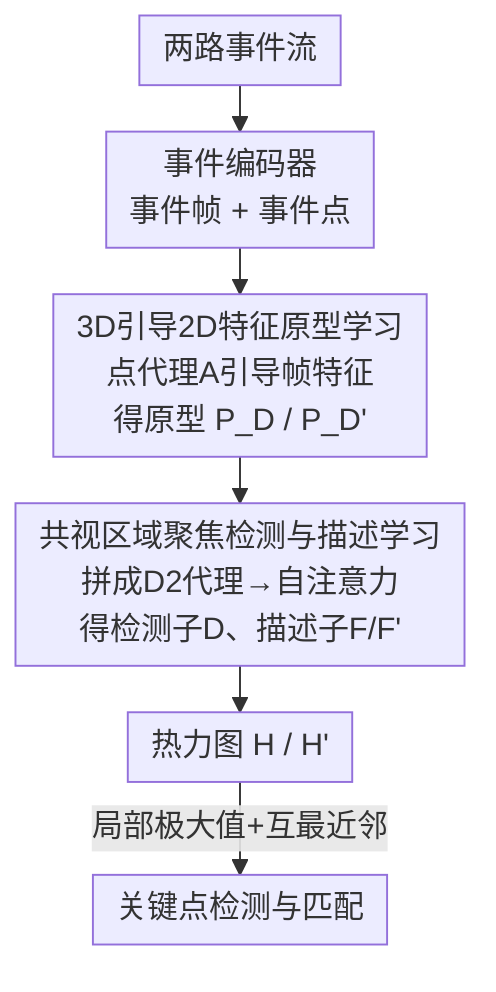

# EV-CGNet: Co-visible Focused 3D-guided 2D Event Keypoint Detection Network

**会议**: CVPR 2026  
**论文**: [CVF Open Access](https://openaccess.thecvf.com/content/CVPR2026/html/Gao_EV-CGNet_Co-visible_Focused_3D-guided_2D_Event_Keypoint_Detection_Network_CVPR_2026_paper.html)  
**代码**: 无  
**领域**: 3D视觉  
**关键词**: 事件相机, 关键点检测, 共视区域, 3D引导2D, 特征匹配  

## 一句话总结
EV-CGNet 用事件点的细粒度时空线索去引导事件帧特征原型学习（G2PL），再用跨帧自注意力把关键点检测约束在两帧共视区域上（CDDL），在 6 个事件相机基准上的重投影误差、位姿估计和 SLAM 轨迹误差全面超越 SuperEvent 等 SOTA。

## 研究背景与动机
**领域现状**：事件相机异步记录像素亮度变化，输出 $\{e_i = (x_i, y_i, t_i, p_i)\}$ 这样的事件流，在高速运动、极端光照下有大动态范围、低带宽、高时间分辨率的优势。事件关键点检测是其中的基础任务——检出可重复的关键点并跨帧匹配，下游接位姿估计、SLAM、三维重建。主流做法分两派：**点法**把事件流当作 $(X,Y,T)$ 空间的时空点云，套用 DBSCAN 之类的 3D 点云算法（如 eCDT）取簇心当关键点；**帧法**把窗口内事件压成类图像的事件帧，改造传统图像检测器（如 SD2Event、SuperEvent）联合学习检测子和描述子。

**现有痛点**：两派各有硬伤。点法完整保留了时空细粒度信息，但 $(X,Y,T)$ 时空域和标准点云的 $(X,Y,Z)$ 空间域存在本质 gap，3D 算法直接迁移效果有限。帧法兼容传统 2D 算法、精度更高，但把事件压成帧会丢大量事件，细粒度时空线索利用不足；即便近期方法在窗口内融合多张事件帧来多留事件，算力又限制了帧数，离散采样还会引入误差（比如某像素强度其实在下降，但采样到的事件恰好都是正极性，模型会误判成强度持续上升）。更关键的是，帧法的检测子是为**每一张事件帧独立训练和评估**的，得到的关键点是"固定"的、不会随匹配对端那一帧的内容自适应调整。

**核心矛盾**：(1) 缺乏跨帧交互导致无法利用**共视信息**——独立检测会在两帧并不共同可见的区域里也检出一堆关键点，匹配时这些点必然连出大量错误对应（图 1a 的红星）；(2) **事件充分利用与算法兼容性之间的权衡**——点法保信息但难兼容，帧法兼容但丢信息，没法兼得。

**切入角度**：作者注意到这两个 trade-off 其实可以分别破解。一方面，帧法精度高、点法时空信息全，二者互补——能不能让点法的细粒度时空线索去"指导"帧特征，而最终仍跑在兼容传统算法的 2D 帧上？另一方面，匹配是成对发生的，共视区域只有把两帧放在一起、用注意力建模帧间交互才能识别出来。

**核心 idea**：提出 **3D 引导 2D（3D-guided 2D）** 范式 + **共视区域聚焦** 检测策略：用事件点（伪 3D）的时空线索引导事件帧（2D）的特征原型学习，兼顾信息与兼容性；再用成对自注意力把检测子聚焦到共视区域，从源头压掉非匹配区域的无效关键点。

## 方法详解

### 整体框架
EV-CGNet 接收**两路事件流**（一对待匹配的事件流），先经事件编码器各自转成"事件帧 + 事件点"双表示，然后流过两个核心模块得到两张热力图 $H, H'$，关键点由热力图局部极大值滤波 + 阈值化取出、再用互最近邻匹配。

第一个模块 **G2PL（3D-Guided 2D Feature Prototype Learning）**：对每一路输入，先用 $1\times1$ 卷积分别抽事件点特征 $\mathbf{F_P} \in \mathbb{R}^{d\times M}$ 和事件帧特征 $\mathbf{F_E} \in \mathbb{R}^{d\times hw}$；用一组可学习的事件点原型 $\mathbf{P}$ 通过注意力从 $\mathbf{F_P}$ 里聚出携带细粒度时空线索的**事件点代理 $\mathbf{A}$**；再让 $\mathbf{A}$ 与帧特征 $\mathbf{F_E}$ 交互，产出 **3D 引导 2D 原型 $\mathbf{P_D}$**。两路分别得到 $\mathbf{P_D}$ 和 $\mathbf{P_D'}$。

第二个模块 **CDDL（Co-visible region-focused Detector and Descriptor Learning）**：把成对原型 $\mathbf{P_D}, \mathbf{P_D'}$ 拼成 **D2 代理 $\mathbf{A_D}$**，用自注意力建模帧内+帧间的长程依赖，得到**共视区域聚焦检测子 $\mathbf{D}$**；再把检测子融回原始帧特征得到**共视区域聚焦描述子 $\mathbf{F}, \mathbf{F'}$**，点积取分数图、平均后 reshape 成热力图 $\mathbf{H}, \mathbf{H'}$。最后对热力图对加余弦相似度约束做监督。整条链路在 RTX 3090 上处理一对 $240\times180$ 事件帧仅 6 ms。

### 关键设计

**1. 3D 引导 2D 特征原型学习（G2PL）：让伪 3D 点云的时空线索去喂帧特征，破解"信息 vs 兼容"权衡**

这一步直接针对帧法丢事件、点法难兼容的两难。做法是先用 $1\times1$ 卷积抽出事件点特征 $\mathbf{F_P}$ 和事件帧特征 $\mathbf{F_E}$，再设计 $N$ 个事件点原型 $\mathbf{P} \in \mathbb{R}^{d\times N}$ 去"采集"点云里的时空线索：query 来自原型、key/value 来自点特征，

$$\mathbf{Q}=\mathbf{W}^{\mathcal{Q}}\mathbf{P},\quad \mathbf{K}=\mathbf{W}^{\mathcal{K}}\mathbf{F_P},\quad \mathbf{V}=\mathbf{W}^{\mathcal{V}}\mathbf{F_P}$$

经多头注意力 $\mathbf{A}=\mathrm{Attention}(\mathbf{Q},\mathbf{K},\mathbf{V})=\mathbf{V}\cdot\mathrm{Softmax}(\mathbf{K}^\top\mathbf{Q})$ 得到事件点代理 $\mathbf{A}$，它把分散在大量事件点里的细粒度时空模式压进 $N$ 个 token。然后反过来让 $\mathbf{A}$ 当 query、帧特征 $\mathbf{F_E}$ 当 key/value，交互出 3D 引导 2D 原型 $\mathbf{P_D}=\mathrm{Attention}(\mathbf{W}^{\mathcal{Q}}\mathbf{A}, \mathbf{W}^{\mathcal{K}}\mathbf{F_E}, \mathbf{W}^{\mathcal{V}}\mathbf{F_E})$。

之所以有效：它没有把事件点直接塞进 3D 算法（避开了 $(X,Y,T)$ 与 $(X,Y,Z)$ 的域 gap），而是把点云只当作"线索来源"去增强最终仍跑在 2D 帧上的原型——既吃到了点法的时空细粒度，又保住了帧法对传统算法的兼容。消融里把它单独加进 baseline，HVGA ATIS Corner 上 25/50/100ms 的重投影误差直接从 5.36/10.17/16.20 砍到 0.51/0.58/0.73（模型 [A]→[B]），是掉点最猛的一项。

**2. 共视区域聚焦检测与描述学习（CDDL）：用成对自注意力把关键点锁进两帧共视区，杜绝非匹配区的错点**

这一步针对"独立检测→非匹配区乱检点→错匹配"的痛点。关键在于检测不再对单帧独立做，而是把两帧的 3D 引导 2D 原型 $\mathbf{P_D}, \mathbf{P_D'}$ 拼成 D2 代理 $\mathbf{A_D} \in \mathbb{R}^{d\times 2N}$，让它们走一遍自注意力

$$\mathbf{D}=\mathrm{Attention}(\mathbf{W}^{\mathcal{Q}}\mathbf{A_D}, \mathbf{W}^{\mathcal{K}}\mathbf{A_D}, \mathbf{W}^{\mathcal{V}}\mathbf{A_D})$$

由于 query/key/value 都来自拼接后的 $\mathbf{A_D}$，注意力会建模"帧内 + 帧间"的长程依赖——只有在两帧都有响应的模式才会被强化，于是更新后的检测子 $\mathbf{D}$ 天然编码了共视信息。再把检测子融回原始帧特征 $\mathbf{F}=\mathbf{F_E}+\mathbf{D}(\mathbf{D}^\top\mathbf{F_E})$ 得到自适应描述子，检测子与描述子点积出多张分数图 $\mathbf{S}_N \in \mathbb{R}^{2N\times hw}$，平均并 reshape 成热力图 $\mathbf{H}$。

为什么有效：以往方法的关键点是"固定"的，匹配对端换了也不变；而这里检测子是成对算出来的，会随另一帧内容自适应地把热力图能量压到共视区，从根上减少非匹配区域的关键点。消融里单独加 CDDL（模型 [A]→[C]）同样把误差从 5.36/10.17/16.20 压到 0.39/0.46/0.59，与 G2PL 贡献相当且互补。

**3. 同形变换自监督 + 三项损失：无需人工标注地训出可重复、聚共视的关键点**

匹配任务的监督信号难拿，作者沿用 SD2Event 的自监督思路：对每个时间窗，随机生成一个单应变换当作参考真值，把事件帧 $\mathbf{I_E}$ warp 成 $\mathbf{I_E'}$；事件点 $\mathbf{P_E}$ 的空间坐标做同样变换、时间维加高斯噪声得到 $\mathbf{P_E'}$。两组 $(\mathbf{I_E},\mathbf{P_E})$、$(\mathbf{I_E'},\mathbf{P_E'})$ 过模型出热力图对 $\mathbf{H},\mathbf{H'}$，用三项损失约束：

$$\mathcal{L}_{total}=\mathcal{L}_{cosim}+\alpha_1\mathcal{L}_{peaky}+\alpha_2\mathcal{L}_{div}$$

其中 $\mathcal{L}_{cosim}$ 要求变换前后热力图一致（保证可重复性）、$\mathcal{L}_{peaky}$ 让响应尖锐（保证定位精度），$\mathcal{L}_{div}$ 作用在事件点原型上促使它们多样化（避免 $N$ 个原型塌缩到同一模式）。文中取 $\alpha_1=0.6, \alpha_2=0.8$。这一设计让整套检测子/描述子在没有人工关键点标注的情况下从零训出，是 G2PL/CDDL 能 work 的训练前提。

### 损失函数 / 训练策略
特征维度 $d=128$，事件点原型数 $N=16$，跨注意力 8 头、$d_k=d$；时间窗 50 ms。Adam 优化、学习率 $10^{-4}$、weight decay $3\times10^{-4}$，从零随机初始化，单卡 RTX 3090 训练约 18 小时收敛。事件帧编码沿用 SD2Event：正极性事件写入 $(255, t_{iT}, 0)$、负极性写入 $(0, 255-t_{iT}, 255)$，其中 $t_{iT}=127\times(T+\Delta t-t)/\Delta t$；事件点忽略极性、坐标归一化为 $\mathbf{P_E}_j=(x_j/w,\, y_j/h,\, (t_j-T)/\Delta t)$。当不需要匹配（单纯抽点）时，把两路输入设为同一事件流即可。

## 实验关键数据

在 6 个事件相机基准（Event-Camera、N-Caltech101、HVGA ATIS Corner、EDS、VECtor、TUM-VIE）上评测，覆盖重投影误差、位姿估计 AUC、匹配 IoU、SLAM 轨迹误差 ATE 等指标，全面对比 SD2Event / STPNet / SuperEvent 等 SOTA。

### 主实验

Event-Camera 数据集，重投影误差（像素，越低越好）与检测子/描述子质量：

| 指标 | SD2Event | STPNet | SuperEvent | EV-CGNet | 提升 |
|--------|----------|--------|------------|----------|------|
| 重投影误差↓ | 1.64 | 1.43 | 1.22 | **0.91** | −0.31 px |
| 可重复性 Rep.↑ | 0.597 | 0.675 | 0.536 | **0.852** | +31.6% |
| 定位误差 MLE↓ | 1.413 | 1.215 | 1.012 | **0.636** | −0.384 px |
| NN mAP↑ | 0.697 | 0.728 | 0.745 | **0.907** | +16.2% |
| 匹配分 M.Score↑ | 0.396 | 0.407 | 0.427 | **0.793** | +36.6% |

下游位姿估计 / SLAM（节选，均显著领先 SuperEvent）：

| 任务·数据集 | 指标 | SuperEvent | EV-CGNet | 提升 |
|------|------|------------|----------|------|
| 位姿 Event-Camera | AUC@5° | 22.7 | **31.3** | +8.6 |
| 位姿 EDS | AUC@5° | 15.2 | **26.8** | +11.6 |
| 匹配 N-Caltech101 | IoU(%) | 0.95 | **0.98** | +3% |
| SLAM VECtor | 平均 ATE | — | — | −68% |
| SLAM TUM-VIE 回环 | ATE(cm) | ~4.7 | ~1.2 | −78% |

### 消融实验
HVGA ATIS Corner 上逐组件拆解（重投影误差，25/50/100ms）：

| 配置 | CDDL | G2PL | 25ms | 50ms | 100ms |
|------|:----:|:----:|------|------|-------|
| [A] baseline | ✗ | ✗ | 5.36 | 10.17 | 16.20 |
| [B] +G2PL | ✗ | ✓ | 0.51 | 0.58 | 0.73 |
| [C] +CDDL | ✓ | ✗ | 0.39 | 0.46 | 0.59 |
| [D] Full | ✓ | ✓ | **0.27** | **0.31** | **0.42** |

事件点原型数 $N$ 的影响（25/50/100ms 重投影误差）：

| $N$ | 25ms | 50ms | 100ms |
|-----|------|------|-------|
| 2 | 0.46 | 0.52 | 0.66 |
| 4 | 0.36 | 0.41 | 0.54 |
| 8 | 0.31 | 0.35 | 0.47 |
| **16** | **0.27** | **0.31** | **0.42** |
| 32 | 0.29 | 0.33 | 0.44 |

### 关键发现
- **两个模块各自贡献巨大且互补**：单加 G2PL（[A]→[B]）或单加 CDDL（[A]→[C]）都能把重投影误差从两位数压到 0.5 像素级，二者同时上（[D]）再进一步到 0.27–0.42，说明"用点云时空线索增强帧特征"和"把检测聚焦共视区"解决的是两个不同瓶颈。
- **原型数 $N=16$ 是甜点**：$N$ 从 2 增到 16 单调变好，超过 16（如 32）反而轻微回退——说明 16 个原型已足够覆盖该数据集的时空模式，再多只会引入冗余。
- **匹配导向设计同时拉高检测与描述质量**：可重复性 +31.6%、匹配分 +36.6%，说明把检测约束到共视区不仅减少错点，还让保留下来的点更可重复、描述子更可判别。
- **SLAM 增益最夸张**：VECtor 平均 ATE −68%、TUM-VIE 长回环 −78%，比单帧指标的提升幅度更大，因为更准的关键点匹配在前端跟踪和回环闭合两处都受益，误差累积被双重抑制。

## 亮点与洞察
- **"3D 引导 2D"是个聪明的折中**：不强行把事件点喂进 3D 算法（避开域 gap），只把它当"时空线索供应商"去增强 2D 帧原型，等于用注意力把点法的优点蒸馏进帧法的框架里——这种"用模态 A 的信息引导模态 B 的表示、但最终推理仍在 B 上"的思路可迁移到很多有"信息全但难用"vs"好用但丢信息"权衡的任务。
- **把"共视"做成成对自注意力**：关键点检测从单帧独立变成成对联合，检测子随对端帧自适应，这是错匹配大幅下降的根因；理念上和图像匹配里 SuperGlue/LightGlue 用注意力做跨图交互一脉相承，但这里前移到了**检测阶段**而非只在匹配阶段。
- **可重复性指标反而上升**值得玩味：通常"聚焦少数区域"会牺牲可重复性，但这里 Rep. 反升 31.6%，说明共视约束剔除的主要是低质量的非匹配点，留下的点本就更稳定。

## 局限与展望
- **依赖成对输入**：CDDL 的共视聚焦建立在"有一对待匹配帧"上，文中也提到不需匹配时要把两路输入设成同一流来退化成单帧检测——这种退化模式下共视机制失效，单帧关键点质量是否仍领先缺少专门对照。⚠️ 以原文为准。
- **共视先验的双刃剑**：在视角变化极大、共视区本就很小的极端场景，把检测过度压到共视区可能导致关键点过少；论文展示的多是匹配精度提升，但对"共视区极小"时召回是否下降未充分讨论。
- **自监督真值是随机单应**：训练用随机单应 warp 造伪真值，对平面/准平面场景合理，但事件相机常见的非平面、大视差场景下单应假设与真实几何有偏差，可能限制对复杂三维结构的泛化。
- **无开源代码**：论文未提供代码链接，复现门槛较高。

## 相关工作与启发
- **vs eCDT / 点法**：点法用 DBSCAN 等 3D 算法在 $(X,Y,T)$ 上取簇心，信息全但受域 gap 拖累。EV-CGNet 不直接在点云上检测，而是用点特征引导 2D 帧原型，保留时空线索的同时回到兼容 2D 算法的轨道。
- **vs SD2Event / 帧法**：SD2Event 把最新事件压成帧、为单帧独立优化检测子与描述子，丢事件且无跨帧交互。本文用 G2PL 补回时空细粒度、用 CDDL 引入帧间共视交互。
- **vs SuperEvent**：当前最强 baseline，仍是逐帧独立检测，在非匹配区检出大量关键点导致错匹配。EV-CGNet 在 6 个基准、多类指标上全面超越它（重投影 −0.31px、匹配分 +36.6%、SLAM ATE 最多 −78%），核心差异就是"成对共视聚焦"这一步。

## 评分
- 新颖性: ⭐⭐⭐⭐ "3D 引导 2D" + 共视聚焦检测两个角度都切中事件关键点检测的真实痛点，组合新颖。
- 实验充分度: ⭐⭐⭐⭐⭐ 6 个基准、检测/位姿/SLAM 多层级指标、组件与超参消融齐全，结论扎实。
- 写作质量: ⭐⭐⭐⭐ 动机推导清晰、模块职责分明，但部分注意力公式排版略乱、共视退化场景讨论偏少。
- 价值: ⭐⭐⭐⭐ 在事件相机 SLAM 下游带来大幅 ATE 下降，对高速/极端光照场景的定位很有实用价值。

<!-- RELATED:START -->

## 相关论文

- [\[CVPR 2026\] From Pairs to Sequences: Track-Aware Policy Gradients for Keypoint Detection](from_pairs_to_sequences_track-aware_policy_gradients_for_keypoint_detection.md)
- [\[CVPR 2026\] Depth Hypothesis Guided Iterative Refinement for Event-Image Monocular Depth Estimation](depth_hypothesis_guided_iterative_refinement_for_event-image_monocular_depth_est.md)
- [\[ECCV 2024\] VCD-Texture: Variance Alignment based 3D-2D Co-Denoising for Text-Guided Texturing](../../ECCV2024/3d_vision/vcd-texture_variance_alignment_based_3d-2d_co-denoising_for_text-guided_texturin.md)
- [\[CVPR 2026\] Geometric-Photometric Event-based 3D Gaussian Ray Tracing](geometric-photometric_event-based_3d_gaussian_ray_tracing.md)
- [\[CVPR 2026\] Unsupervised 3D Motion Estimation Using Event Camera](unsupervised_3d_motion_estimation_using_event_camera.md)

<!-- RELATED:END -->
