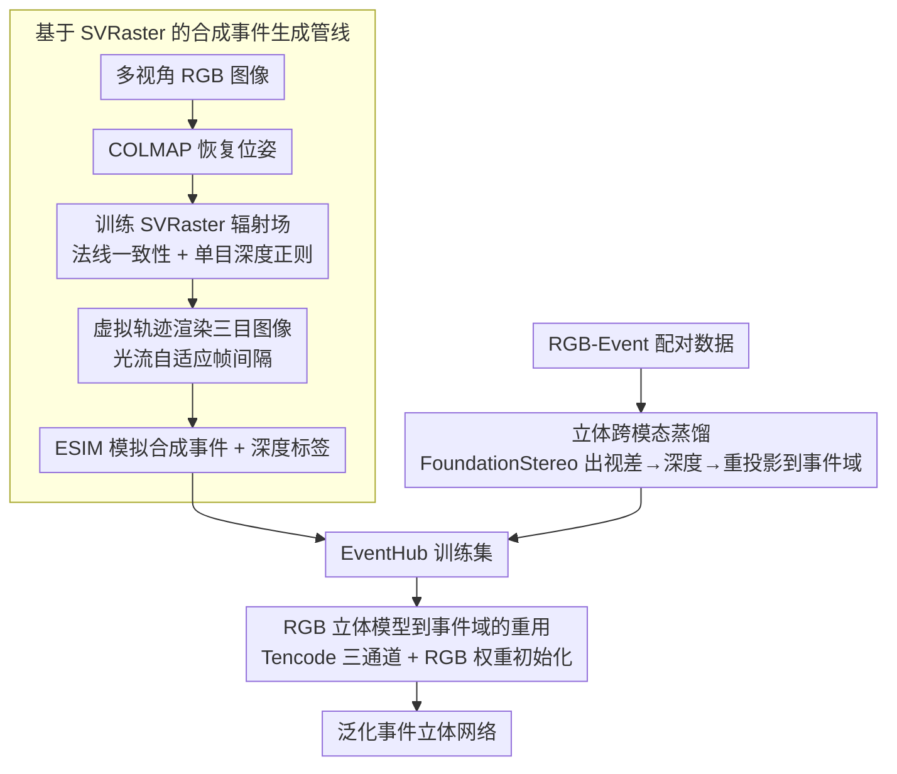

# EventHub: Data Factory for Generalizable Event-Based Stereo Networks without Active Sensors

**会议**: CVPR 2026  
**arXiv**: [2604.02331](https://arxiv.org/abs/2604.02331)  
**代码**: [https://bartn8.github.io/eventhub](https://bartn8.github.io/eventhub)  
**领域**: 3D视觉 / 立体匹配 / 事件相机  
**关键词**: 事件相机, 立体匹配, 数据工厂, 新视角合成, 跨模态蒸馏

## 一句话总结
本文提出 EventHub，一个无需 LiDAR 等主动传感器标注的事件相机立体匹配训练数据工厂，通过新视角合成生成代理事件+深度标签和跨模态蒸馏从 RGB 立体模型迁移知识，训练出的事件立体模型在跨域泛化上超越 LiDAR 监督模型（M3ED 和 MVSEC 上误差降低最高 50%）。

## 研究背景与动机

1. **领域现状**：深度学习驱动的立体匹配在 RGB 领域已取得巨大进展，出现了 FoundationStereo 等泛化能力极强的基础模型。事件相机因其微秒级时间分辨率、无运动模糊、高动态范围，在自动驾驶和机器人导航等场景有独特优势。

2. **现有痛点**：事件相机立体匹配的标注数据极度匮乏——DSEC、MVSEC、M3ED 等数据集规模远小于 RGB 领域，且 LiDAR 标注存在多种固有问题：稀疏性（需 7×7 膨胀才能使用）、动态场景积累误差、重投影误差、非朗伯表面失败。

3. **核心矛盾**：事件相机数据的获取和标注需要复杂的主动传感器设置（如 LiDAR），成本高昂且标注质量有限，而 RGB 图像数据丰富且有成熟的深度估计工具——如何利用廉价的 RGB 数据来训练事件相机模型？

4. **本文目标** (1) 如何从 RGB 图像生成事件相机训练数据？(2) 如何将 RGB 立体模型的知识迁移到事件域？(3) 如何让事件立体模型获得前所未有的泛化能力？

5. **切入角度**：RGB 图像廉价且丰富，RGB 立体基础模型已具备强大深度估计能力——将这些资源作为数据工厂的输入，自动生成事件立体匹配的训练数据。

6. **核心 idea**：结合新视角合成（生成代理事件和深度标签）与跨模态蒸馏（从 RGB 立体模型迁移知识），构建无需主动传感器的事件立体匹配数据工厂。

## 方法详解

### 整体框架
EventHub 通过两条互补路径生成训练数据：(i) **事件数据工厂（Event Data Factory）**——使用 SVRaster 从稀疏 RGB 图像序列通过新视角合成生成合成事件立体对和深度标签；(ii) **立体跨模态蒸馏（Stereo Cross-Modal Distillation）**——在已有 RGB-Event 配对数据的场景中，用 RGB 立体基础模型（如 FoundationStereo）生成代理深度标签，通过多视图几何对齐到事件域。两条路径的数据合并为 EventHub 训练集；训练时把事件编码成 Tencode 三通道、直接复用 RGB 立体模型的架构与权重来适配事件立体网络。

### 关键设计

**1. 基于 SVRaster 的合成事件生成管线：让一堆静态 RGB 照片自己"动"起来，凭空造出带深度标签的事件流**

事件相机靠亮度变化触发，可一组静态 RGB 照片本身是不动的，怎么逼出事件？管线先用 COLMAP 从多视角 RGB 图像恢复相机位姿和内参，再训练一个 SVRaster 辐射场把场景重建成可快速渲染的表示——选 SVRaster 正是看中它的渲染速度能跟得上事件相机微秒级的时间分辨率。为了让重建出来的深度图够干净（深度标签的质量直接决定下游训练效果），训练时叠了法线一致性 $\mathcal{L}_{N\text{-mean/med}}$ 和单目深度先验 $\mathcal{L}_{\text{DAv2}}$ 等正则项。

有了辐射场，再人为给它安排一段"虚拟运动"来制造亮度变化：物体中心的场景用沿单轴平移的局部轨迹 $\Gamma(\tau)$，室内大场景则用三次样条拟合的全局轨迹 $\Omega(\tau)$。沿轨迹渲染出三目图像对后，交给 ESIM 模拟器从连续帧之间的亮度差生成合成事件流。这里的关键细节是帧间隔不能拍脑袋固定：间隔太大、相邻帧位移太猛，ESIM 会产生事件模拟伪影；间隔太小又是纯浪费算力。于是用光流估计像素位移，按位移自适应地决定中间要插多少次渲染——

$$n = \max\big(\lceil\log_2(|\mathbf{F}|_{\max})\rceil,\ 0\big)$$

中间渲染次数取 $2^n$，位移大就多插帧、位移小就少插，既压住伪影又不浪费渲染。

**2. 立体跨模态蒸馏：相机已经配好对时，别再造事件，直接把 RGB 模型的深度搬过来**

合成管线适合从零造数据，但有些数据集（如 DSEC）里 RGB 相机和事件相机本就标定配对、采的是同一场景——这种情况下再去合成事件就多此一举，不如直接借 RGB 立体基础模型的能力。具体做法是让 FoundationStereo 这类 RGB 立体模型 $\Phi_c$ 处理 RGB 立体对得到视差图 $\mathbf{D}_c$，按 $\mathbf{Z}_c = (b_c \cdot f_c) / \mathbf{D}_c$ 转成深度，再利用已知的 RGB-事件相机相对位姿 $\mathbf{T}_{c \to e}$ 做一次"反投影到 3D—变换—重投影回事件像面"，把这份代理深度标签从 RGB 域对齐搬到事件域。相比合成路径，这条路省掉了渲染和事件模拟，直接把 RGB 基础模型从海量数据里学到的深度估计能力蒸馏给了事件侧。

**3. RGB 立体模型到事件域的重用：把事件编成"伪 RGB"三通道，连权重一起原样接管**

事件流是异步的极性脉冲，跟 RGB 模型期望的稠密三通道图像对不上，要用 RGB 预训练权重就得先解决输入格式。作者把事件编成 Tencode 表示——正极性、时间戳、负极性各占一个通道，凑成和 RGB 一样的 3 通道输入，于是事件模型 $\Phi_e$ 可以直接拿 RGB 立体模型的架构和权重初始化，而不是从头练。初始化之后只用很小的学习率（$5 \times 10^{-5}$）微调、并冻住 DAv2 先验，目的是稳稳继承 RGB 基础模型的强先验、避免微调把它冲掉。

### 损失函数 / 训练策略
- 对 NVS 生成的数据使用 NeRF-supervised loss（含三目光度一致性损失和置信度加权）
- 对蒸馏数据和非 EventHub 数据使用各模型原始损失
- SVRaster 训练：总损失 $\mathcal{L} = \mathcal{L}_{\text{MSE}} + \lambda_{\text{SSIM}}\mathcal{L}_{\text{SSIM}} + \mathcal{L}_{\text{reg}}$，正则化包含法线一致性、稀疏性、单目先验等项
- 自定义体素大小置信度 $\mathbf{C}_{\text{Vsize}}$ 改进深度标签质量估计

## 实验关键数据

### 主实验

**DSEC 域内结果 (E-FoundationStereo)**:

| 训练方式 | 1PE ↓ | MAE ↓ |
|----------|-------|-------|
| Photometric | 93.85 | 3.65 |
| EV-SceneFlow | 61.80 | 3.10 |
| MIX 3 (NVS+ScanNet++) | 20.99 | 0.89 |
| MIX 4 (NVS+ScanNet+++DSEC蒸馏) | 20.42 | 0.87 |
| LiDAR (GT) | 12.53 | 0.60 |

**M3ED 跨域泛化 (E-FoundationStereo)**:

| 训练方式 | Day MAE ↓ | Night MAE ↓ | Indoor MAE ↓ |
|----------|-----------|-------------|--------------|
| MIX 4 (Ours) | **0.98** | **1.54** | 2.45 |
| LiDAR (GT) | 2.89 | 1.99 | 2.87 |

### 消融实验

| 数据组合 | 组成 | E-FoundationStereo DSEC MAE ↓ | Avg Rank |
|----------|------|-------------------------------|----------|
| MIX 1 | NeRF-Stereo only | 1.39 | 5.00 |
| MIX 2 | NeRF-Stereo + DSEC | 1.04 | 4.00 |
| MIX 3 | NeRF-Stereo + ScanNet++ | 0.89 | 2.75 |
| MIX 4 | NeRF-Stereo + ScanNet++ + DSEC | 0.87 | 2.25 |

### 关键发现
- **EventHub 训练的模型在跨域泛化上全面超越 LiDAR 监督模型**：在 M3ED 和 MVSEC 数据集上，MIX 4 训练的模型 MAE 比 LiDAR 监督低 50% 以上，说明代理标签的多样性比 LiDAR 的精确性更重要
- **数据多样性是关键**：从 MIX 1 到 MIX 4，每增加一种数据来源，性能持续提升
- **双向知识迁移**：事件模型反过来可以提升 RGB 基础模型在夜间场景的性能，实现了 RGB→Event→RGB 的知识循环
- **EMatch 在跨域上严重退化**：LiDAR 训练的 EMatch 在 M3ED Day 上 MAE=12.22，而 MIX 4 仅 2.23

## 亮点与洞察
- **数据工厂范式**：将"获取昂贵标注数据"问题转化为"从廉价数据生成代理标注"，这一范式可以迁移到其他传感器模态的数据匮乏问题（如热红外、雷达）。
- **动态自适应帧间隔**：通过光流计算自动调整渲染帧间距，既避免了过大间隔导致的事件模拟伪影，又减少了过小间隔的冗余计算。这个设计既实用又巧妙。
- **代理标签 > LiDAR 标注的反直觉发现**：代理标签虽然精度不如 LiDAR，但其多样性（多场景、多分辨率、多基线）使训练出的模型泛化能力更强，这对整个立体匹配领域的数据策略有启示。

## 局限与展望
- **NVS 管线仅适用于静态场景**：动态物体无法通过当前虚拟轨迹方案生成事件数据
- **ESIM 事件模拟器与真实事件仍有差异**：合成事件缺少真实传感器的噪声特性和非理想阈值行为
- **计算成本**：每个场景需要独立训练 SVRaster，270 个 NeRF-Stereo 场景 × 3 轨迹 + 403 个 ScanNet++ 场景的渲染开销不小
- **改进方向**：引入动态场景 NVS（如 4D Gaussian Splatting）扩展数据工厂能力

## 相关工作与启发
- **vs NeRF-Stereo [Tosi 2023]**: NeRF-Stereo 首次用 NeRF 合成 RGB 立体训练数据，EventHub 将这一思路扩展到事件相机领域，增加了事件模拟器和虚拟轨迹设计
- **vs EMatch**: EMatch 是当前事件立体匹配 SOTA，但严重依赖域内 LiDAR 标注，泛化能力差；EventHub 训练的 E-FoundationStereo 在域外远超 EMatch
- **vs GS2E**: GS2E 同期用 3DGS 生成多视角事件数据，但仅用于 NVS 和去模糊，未探索立体匹配训练数据生成

## 评分
- 新颖性: ⭐⭐⭐⭐ 首次将 NVS 数据工厂+跨模态蒸馏用于事件立体匹配，组合创新
- 实验充分度: ⭐⭐⭐⭐⭐ 4种模型×4种数据组合×3个测试集，且包含域内/域外/夜间等全面评估
- 写作质量: ⭐⭐⭐⭐ 结构清晰，管线描述详细，图表丰富
- 价值: ⭐⭐⭐⭐⭐ 解决了事件相机领域的核心痛点——数据匮乏，且代理标签优于 LiDAR 的发现很有影响力

<!-- RELATED:START -->

## 相关论文

- [\[CVPR 2026\] Bi-CMPStereo: Bidirectional Cross-Modal Prompting for Event-Frame Asymmetric Stereo](bi_cmpstereo_bidirectional_cross_modal_prompting_for_event_frame_asymmetric_stereo.md)
- [\[CVPR 2026\] What Makes Good Synthetic Training Data for Zero-Shot Stereo Matching?](what_makes_good_synthetic_training_data_for_zero-shot_stereo_matching.md)
- [\[AAAI 2026\] Domain Generalized Stereo Matching with Uncertainty-guided Data Augmentation](../../AAAI2026/3d_vision/domain_generalized_stereo_matching_with_uncertainty-guided_data_augmentation.md)
- [\[CVPR 2026\] Lite Any Stereo: Efficient Zero-Shot Stereo Matching](lite_any_stereo_efficient_zero-shot_stereo_matching.md)
- [\[CVPR 2026\] PIP-Stereo: Progressive Iterations Pruner for Iterative Optimization based Stereo Matching](pip-stereo_progressive_iterations_pruner_for_iterative_optimization_based_stereo.md)

<!-- RELATED:END -->
