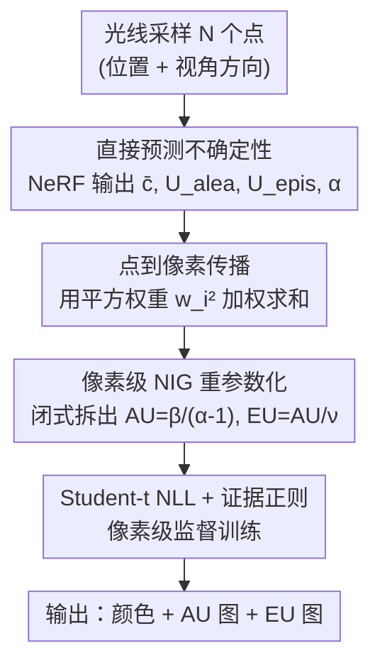

# Evidential Neural Radiance Fields

**会议**: CVPR 2026  
**论文**: [CVF Open Access](https://openaccess.thecvf.com/content/CVPR2026/html/Duan_Evidential_Neural_Radiance_Fields_CVPR_2026_paper.html)  
**代码**: https://github.com/KerryDRX/EvidentialNeRF  
**领域**: 3D视觉  
**关键词**: NeRF, 不确定性量化, 证据深度学习, 偶然不确定性, 认知不确定性  

## 一句话总结
本文把证据深度学习（EDL）适配到 NeRF 的体渲染管线，让模型在单次前向传播里直接预测并拆分出偶然不确定性（数据噪声）和认知不确定性（模型未知），既不牺牲渲染质量也不增加推理成本，在三个标准化基准上同时取得最好的重建保真度和有竞争力的不确定性质量。

## 研究背景与动机
**领域现状**：NeRF 在 3D 重建和新视角合成上效果惊艳，但它只输出一个确定性的像素颜色，没法告诉你"这个像素我有多不确定"。而在自动驾驶、医学影像、机器人这些安全攸关场景里，知道模型哪里没把握和知道结果本身一样重要。

**现有痛点**：预测不确定性其实有两个来源——偶然不确定性（aleatoric uncertainty, AU，来自数据本身的随机性，如光照变化、运动物体、高频边缘，是不可消除的噪声）和认知不确定性（epistemic uncertainty, EU，来自模型知识不足，如被遮挡区域、训练分布外的视角，可以靠加数据消除）。现有 NeRF 不确定性方法分三派，但都各有硬伤：① 闭式似然模型（NeRF-W、ActiveNeRF 用高斯分布建模颜色）计算高效，但只能捕捉 AU，对 EU 完全无能为力；② 贝叶斯方法（MC Dropout、S-NeRF、CF-NeRF）能估 EU，但推理时要多次采样，开销大；③ 集成方法（Deep Ensembles、DANE）效果好但要训练并存储多个模型，训练和推理成本都最高。

**核心矛盾**：没有一种方法能在**单次前向传播**里同时量化 AU 和 EU，而且很多方法是用牺牲重建精度换来的不确定性。问题根源在于：经典证据深度学习（EDL）让网络直接回归证据分布（如 NIG）的参数，但 NeRF 是层级化的体渲染结构——监督信号只在**像素级**（体渲染聚合之后）才有，而证据参数是绑在**点级**预测上的，没法直接从像素观测反传学习。这种结构错配让 EDL 无法天然搬到 NeRF 上。

**本文目标 / 核心 idea**：把 EDL 的"证据收集"思想改造成与体渲染兼容的形式。关键转念是：**不让模型回归 NIG 参数，而是让它直接预测 AU、EU 和一个形状分数**，再用一套点→像素的不确定性传播公式把它们聚合到有监督的像素级，最后反推出 NIG 分布闭式表达。这样一来，两种不确定性在一次前向里就拿到了。

## 方法详解

### 整体框架
方法可以理解成在原版 NeRF 概率建模上"再升一级"。论文用三个层级勾勒了演化（Figure 2）：**Level 1 vanilla NeRF** 每个点预测密度 $\rho_i$ 和颜色 $c_i$，体渲染后得到一个确定性像素颜色，无不确定性；**Level 2 normal NeRF**（即经典高斯方法）假设点颜色服从正态分布 $c_i \mid \mu_i,\sigma_i^2 \sim \mathcal{N}(\mu_i,\sigma_i^2)$，像素颜色也是正态，从而能给出 AU（方差），但 $\mu_i,\sigma_i^2$ 是固定点估计，捕捉不到 EU；**Level 3 evidential NeRF**（本文）再往上一层，把像素颜色的均值和方差本身当作随机变量，服从一个高阶的 normal-inverse-gamma（NIG）证据分布，于是 AU 和 EU 都能闭式拆出来。

整条管线是：沿相机光线采样 $N$ 个点 → 每个点过 NeRF MLP，除了密度和颜色外，**额外预测** $(U_i^\text{alea}, U_i^\text{epis}, \tilde\alpha_i)$ → 用体渲染权重的平方把点级不确定性传播到像素级 → 在像素级把这些量重参数化成 NIG 分布 $(\gamma,\nu,\alpha,\beta)$ → 像素颜色边缘服从 Student's t 分布，用负对数似然 + 证据正则在像素级训练。

### 关键设计

**1. 直接预测 AU/EU，而非回归证据参数**

这是本文与经典 EDL 最核心的分野，正是为了绕开"证据参数绑在点级、监督只在像素级"的结构错配。本文先把点颜色的条件均值和方差也当成随机变量 $(\mu_i,\sigma_i^2)\sim\pi_i$，于是点颜色的偶然、认知不确定性按方差分解定律写成 $U_i^\text{alea}\coloneq\mathbb{E}[\text{Var}[c_i\mid\mu_i,\sigma_i^2]]=\mathbb{E}[\sigma_i^2]$ 和 $U_i^\text{epis}\coloneq\text{Var}[\mathbb{E}[c_i\mid\mu_i,\sigma_i^2]]=\text{Var}[\mu_i]$。经典高斯方法相当于 $\pi_i$ 退化成 Dirac delta（均值方差固定），此时 $U_i^\text{epis}=\text{Var}[\mu_i]=0$，所以它天生就只有 AU。

具体实现上，模型在最后一层只加 3 个输出神经元，预测 $(\bar c_i, U_i^\text{alea}, U_i^\text{epis}, \tilde\alpha_i),\rho_i = f(\boldsymbol{x}_i,\boldsymbol{d})$，其中 $\bar c_i$ 是点的均值颜色（用 sigmoid 激活），$U_i^\text{alea},U_i^\text{epis}$ 是两种不确定性、$\tilde\alpha_i$ 是后面用来推像素形状参数的正形状分数（都用 softplus 激活保证为正）。**模型让网络直接吐出可解释的不确定性量，而不是先吐 NIG 参数再换算**，这样不确定性能顺着体渲染直接传播，省去了从证据参数反推的麻烦。

**2. 点到像素的不确定性传播（平方权重聚合）**

有了点级不确定性，还得把它们聚合到有监督的像素级，这一步是让 EDL 兼容体渲染的关键桥梁。设一条光线上所有点颜色的条件均值方差为 $\boldsymbol\theta\coloneq\{(\mu_i,\sigma_i^2)\}_{i=1}^N$，像素颜色 $c=\sum_i w_i c_i$（$w_i$ 是标准体渲染权重）。在点之间独立的假设下，论文推导出像素级各量都是点级量的加权和，且**权重恰好是颜色体渲染权重的平方**：

$$\bar c = \sum_{i=1}^N w_i \bar c_i,\quad U = \sum_{i=1}^N w_i^2 U_i,\quad U^\text{alea}=\sum_{i=1}^N w_i^2 U_i^\text{alea},\quad U^\text{epis}=\sum_{i=1}^N w_i^2 U_i^\text{epis}.$$

均值用一次方权重、不确定性（方差类量）用平方权重，这来自方差对线性组合的传播性质（$\text{Var}[\sum w_i c_i]=\sum w_i^2\text{Var}[c_i]$）。这个推导让点级的证据信息能无损地汇聚到像素级，从而在监督可用的地方学习。⚠️ 这里依赖"光线上相邻点统计独立"的简化假设，论文承认实际相邻点辐射是相关的，但这是让不确定性可解析聚合的常用近似。

**3. 像素级 NIG 重参数化与闭式不确定性**

为了在像素级闭式量化两种不确定性，本文把像素颜色的均值方差 $(\mu,\sigma^2)$ 建模为 NIG 分布 $\mu,\sigma^2\sim\text{NIG}(\gamma,\nu,\alpha,\beta)$，等价于 $\mu\mid\sigma^2\sim\mathcal{N}(\gamma,\sigma^2/\nu)$ 且 $\sigma^2\sim\Gamma^{-1}(\alpha,\beta)$。在这个层级采样视角下，像素颜色经过"先从 NIG 抽出 $(\mu,\sigma^2)$、再从 $\mathcal{N}(\mu,\sigma^2)$ 抽出 $c$"的层级过程生成，于是预测均值和两种不确定性都能用 NIG 参数闭式表达：

$$\bar c = \gamma,\qquad U^\text{alea}=\mathbb{E}[\sigma^2]=\frac{\beta}{\alpha-1},\qquad U^\text{epis}=\text{Var}[\mu]=\frac{\beta}{(\alpha-1)\nu}.$$

但因为模型直接预测的是不确定性而非 NIG 参数，所以反过来要把 NIG 参数从传播得到的量里重构出来：$\gamma=\bar c$、$\nu=U^\text{alea}/U^\text{epis}$、$\alpha=1+\sum_{i=1}^N\tilde w_i\tilde\alpha_i$、$\beta=U^\text{alea}(\alpha-1)$，其中 $\tilde w_i=w_i/\sum_j w_j$ 是归一化权重、决定每个点的形状分数对像素形状参数 $\alpha$ 的贡献。注意 $\nu=U^\text{alea}/U^\text{epis}$ 直接由两种不确定性的比值给出，$\alpha$ 由形状分数聚合而来——这把"直接预测"和"NIG 框架"两套表达连了起来。

**4. Student's t 似然 + 证据正则的像素级学习**

最后是怎么训练。把像素颜色边缘化掉 $(\mu,\sigma^2)$ 后，$c$ 服从 Student's t 分布 $c\sim t\!\left(\gamma,\frac{\beta(\nu+1)}{\alpha\nu},2\alpha\right)$，于是用极大似然、最小化真值颜色的负对数似然 $\mathcal{L}_\text{nll}=-\log p(c^\text{gt}\mid\gamma,\nu,\alpha,\beta)$ 来训练。但 $\nu,\beta$ 存在尺度上的歧义（只要 $\beta(\nu+1)/\nu$ 固定 t 分布尺度就相同），并且需要抑制给错误预测分配过多证据，因此加一个证据正则项 $\mathcal{L}_\text{reg}=|c^\text{gt}-\gamma|(2\nu+\alpha)$，其中 $|c^\text{gt}-\gamma|$ 是预测绝对误差、$2\nu+\alpha$ 是代表证据量的虚拟观测数——含义是"预测越离谱就越不该自信"。总损失 $\mathcal{L}=\mathcal{L}_\text{nll}+\lambda_\text{reg}\mathcal{L}_\text{reg}$。RGB 三通道则假设三通道均值不同但共享同一不确定性（因同像素不同通道方差高度相关），颜色头输出维度设为 3、不确定性参数广播到各通道。

## 实验关键数据

### 主实验
在三个数据集（Light Field、LLFF 稀疏三视图、RobustNeRF 带杂物）上对比六种不确定性方法，全部用 nerfacto 架构、相同数据划分和训练设置（标准化基准），三次独立运行取平均。重建质量看 PSNR/SSIM/LPIPS，不确定性质量看 NLL 和 AUSE（误差排序能力）。

| 数据集 | 方法 | PSNR↑ | SSIM↑ | LPIPS↓ | NLL↓ |
|--------|------|-------|-------|--------|------|
| LF | Normal（高斯） | 28.01 | 0.9165 | 0.0531 | 0.4425 |
| LF | Ensembles | 29.38 | 0.9308 | 0.0411 | 0.3245 |
| LF | **Evidential（本文）** | **29.97** | **0.9345** | **0.0359** | -2.4491 |
| LLFF | Ensembles | 17.92 | 0.5109 | 0.3932 | 11.17 |
| LLFF | **Evidential（本文）** | 17.88 | 0.5068 | **0.3751** | **0.6765** |
| RobustNeRF | Ensembles | 26.20 | 0.8562 | 0.1438 | 4.63 |
| RobustNeRF | **Evidential（本文）** | **26.23** | **0.8641** | **0.1112** | -1.27 |

本文在 9 个图像重建指标里有 7 个超过了昂贵的集成方法，且只需训练单个网络、单次前向。

### 效率对比

| 模式 | Baseline | Dropout | Normal | MoL | Ensembles | DANE | 本文 |
|------|---------|---------|--------|-----|-----------|------|------|
| 训练/分钟（每30k步）↓ | 11.84 | 88.54 | 12.22 | 12.71 | 59.22 | 59.22 | 13.57 |
| 推理/FPS↑ | 4.88 | 0.09 | 4.71 | 4.42 | 0.96 | 0.96 | 4.67 |

本文训练只比纯似然模型略慢、远快于集成（集成训 5 个模型），推理 4.67 FPS 仅比最快方法慢 0.04 FPS，而集成只有 0.96 FPS、Dropout 因要多次采样只有 0.09 FPS。

### 关键发现
- **随机均值方差带来巨大似然提升**：相比固定均值方差的经典高斯，本文在三数据集上把测试数据似然分别提升了 $1.8\times10^1$、$5.6\times10^{23}$、$1.3\times10^5$ 倍，原因正是固定假设只捕捉训练数据内的偶然变化、完全忽略了认知不确定性；LF 提升最小，因为它测试视角紧邻训练视角、分布偏移小。
- **AU 与 EU 随数据量反向变化**：训练样本从 10 增到 50 张，测试 AU 升高（更多杂乱观测引入更大数据变异）、测试 EU 下降（模型知识缺口被填补），符合两类不确定性的物理含义。
- **两种不确定性各有用武之地**：AU 高的区域对应反光、运动物体、高频边缘等数据噪声；EU 高的区域对应遮挡和训练分布外视角。基于 AU 可做"场景清洗"后处理（把 AU 超阈值的点密度调低，渐进去掉漂浮伪影）；基于 EU 可做主动学习的 next-best-view 选择，EU 选样的 PSNR 明显高于随机选样。
- **NLL 上 MoL 偶尔最好**：MoL（拉普拉斯混合）凭多模态假设在 NLL 上总体最优；AUSE 上集成方法最强，但本文常排第二、紧追集成，说明联合建模 AU+EU 能让不确定性与误差更相关。

## 亮点与洞察
- **"让模型直接预测不确定性而非证据参数"是这篇最巧的转念**：经典 EDL 回归 NIG 参数，搬到 NeRF 会卡在"点级参数无法被像素级监督直接学习"。本文反过来让网络吐 AU/EU/形状分数，再用闭式公式反推 NIG 参数，绕开了层级错配——这个"换个东西去预测"的思路可迁移到其它有体渲染/聚合结构的概率建模（如 Gaussian Splatting）。
- **不确定性传播只改了输出层和损失**：模型架构几乎不动，最后一层加 3 个神经元就行，工程改动极小却拿到了 AU+EU，性价比极高。
- **"AU 升 EU 降随数据增加"提供了一个干净的可解释验证**：把抽象的两类不确定性和直觉物理含义对上，是很有说服力的 sanity check，也为主动学习用 EU 选样提供了理论支撑。

## 局限与展望
- **作者承认的局限**：为了让不确定性可解析传播，本文假设体密度是确定性的，没有显式建模场景几何（密度）的不确定性。把公式扩展到捕捉几何不确定性能让建模更完整。
- **独立性假设**：点到像素传播依赖"光线上相邻点统计独立"，但实际相邻点辐射强相关，这个近似在高频或边界区域可能让不确定性估计有偏。
- **基准范围**：实验都在静态小场景（LF/LLFF/RobustNeRF）上，且统一用 nerfacto 架构，在大规模、动态或室外场景下的不确定性可靠性还需验证。⚠️ 与并行工作 ENeRF（点级用 NIG、像素级用 NIG 混合近似）的直接对比未在主表给出。

## 相关工作与启发
- **vs 经典高斯（Normal, NeRF-W/ActiveNeRF）**：高斯方法把均值方差当固定点估计，只能给 AU；本文把它们当随机变量、再上一层 NIG，从而同时给出 AU 和 EU，且重建质量反而更高。
- **vs 集成方法（Ensembles/DANE）**：集成靠训练多个模型测预测方差来估 EU，效果好但要训/存/推多个模型，最贵；本文单模型单前向就拿到两种不确定性，重建指标 7/9 还反超集成。
- **vs 贝叶斯（MC Dropout/S-NeRF/CF-NeRF）**：贝叶斯方法推理时要多次随机前向采样，开销大、速度慢（Dropout 仅 0.09 FPS）；本文是闭式单次前向。
- **vs 经典 EDL（regression EDL / ENeRF）**：标准 EDL 回归证据分布参数，不天然兼容 NeRF 的层级体渲染；本文改成直接预测不确定性 + 点到像素传播，让 EDL 与体渲染范式无缝结合。

## 评分
- 新颖性: ⭐⭐⭐⭐⭐ 把 EDL 适配到体渲染、用"直接预测不确定性"绕开层级监督错配，思路干净且有完整数学推导。
- 实验充分度: ⭐⭐⭐⭐ 三数据集标准化基准 + 效率 + 两个下游应用，但场景偏小、与并行 ENeRF 缺直接对比。
- 写作质量: ⭐⭐⭐⭐⭐ 用三层级演化讲清动机，公式推导和直觉解释都到位。
- 价值: ⭐⭐⭐⭐⭐ 单次前向闭式拆分 AU/EU，对安全攸关场景的可信 3D 重建很有实用价值。

<!-- RELATED:START -->

## 相关论文

- [\[CVPR 2026\] MU-GeNeRF: Multi-view Uncertainty-guided Generalizable Neural Radiance Fields for Distractor-aware Scene](mu-generf_multi-view_uncertainty-guided_generalizable_neural_radiance_fields_for.md)
- [\[CVPR 2025\] FFaceNeRF: Few-Shot Face Editing in Neural Radiance Fields](../../CVPR2025/3d_vision/ffacenerf_few-shot_face_editing_in_neural_radiance_fields.md)
- [\[CVPR 2026\] Turbo-GS: Accelerating 3D Gaussian Fitting for High-Resolution Radiance Fields](turbo-gs_accelerating_3d_gaussian_fitting_for_high-quality_radiance_fields.md)
- [\[ECCV 2024\] BeNeRF: Neural Radiance Fields from a Single Blurry Image and Event Stream](../../ECCV2024/3d_vision/benerf_neural_radiance_fields_from_a_single_blurry_image_and_event_stream.md)
- [\[CVPR 2026\] SGAD-SLAM: Splatting Gaussians at Adjusted Depth for Better Radiance Fields in RGBD SLAM](sgad-slam_splatting_gaussians_at_adjusted_depth_for_better_radiance_fields_in_rg.md)

<!-- RELATED:END -->
