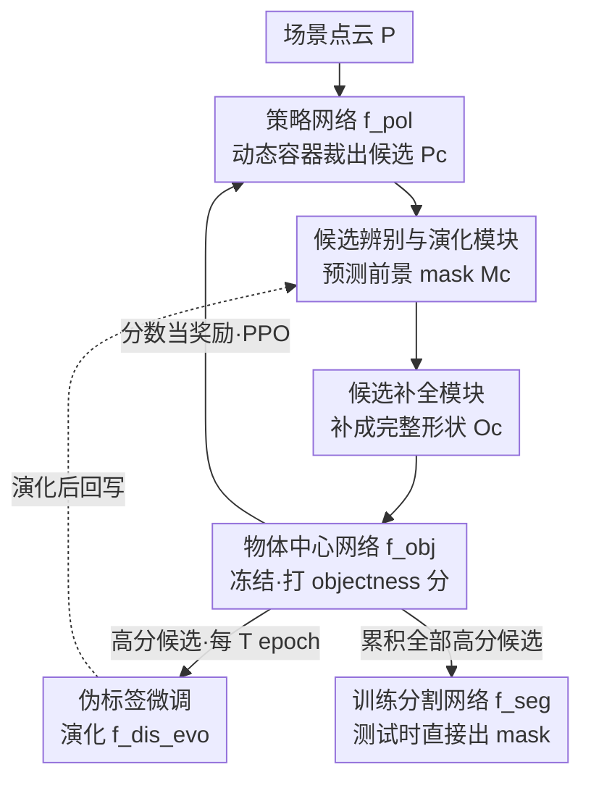

# EvObj: Learning Evolving Object-centric Representations for 3D Instance Segmentation without Scene Supervision

**会议**: CVPR 2026  
**arXiv**: [2605.13152](https://arxiv.org/abs/2605.13152)  
**代码**: https://github.com/vLAR-group/EvObj (有)  
**领域**: 3D视觉  
**关键词**: 无监督3D实例分割, 物体中心先验, 域间隙, 候选演化, 点云补全

## 一句话总结
针对无监督 3D 实例分割中"合成物体先验迁不到真实扫描"的痛点，EvObj 在 GrabS 的 RL 发现框架里串入两个模块——一个能随发现过程自我演化的候选辨别网络、一个把残缺候选补全的点云补全网络——把合成域学到的物体先验逐步适配到真实点云，在 ScanNet、S3DIS 和多类合成数据集上全面超过所有无监督基线，且在 ScanNet 隐藏测试集上逼近监督方法 3D-BoNet。

## 研究背景与动机

**领域现状**：3D 实例分割主流要么依赖大量人工标注（实例 mask / 框）做全监督，要么借 CLIP/SAM 等多模态基础模型把 2D 先验投到 3D。两条路都绕不开标注成本。为彻底去掉场景级标注，近年出现三类无监督路线：基于运动线索发现物体（只能搞会动的车辆类）、把自监督 2D 特征（DINO）升维到 3D（缺乏真正 objectness，分割碎片化）、以及用 3D 重建先验（EFEM、GrabS）。其中 GrabS 在发现复杂静态物体上效果最好。

**现有痛点**：GrabS 采用两阶段——先用自监督重建网络（VAE/Diffusion + SDF 解码）在 ShapeNet 上学一个"物体中心网络" $f_{obj}$ 当 objectness 打分器；再用 RL 训练策略网络 $f_{pol}$ 操控一个动态容器（如圆柱）从场景里裁出候选点集，喂给冻结的 $f_{obj}$ 打分，分高即给 RL 奖励。但它有一个**几何域间隙**：预训练用的合成物体（ShapeNet 椅子）和真实扫描物体（ScanNet 椅子）结构差异巨大。

**核心矛盾**：域间隙具体表现为两点——① **形态差异**：合成物体拓扑简单，缺乏真实物体的复杂结构；② **遮挡残缺**：真实扫描因自遮挡、互遮挡、传感器截断常只有部分几何。这导致策略网络裁出的点集（背景点 + 残缺物体部件的混合物）喂进 $f_{obj}$ 时打分严重失真，奖励错误，物体发现被误导。而 $f_{obj}$ 本身既没有忽略背景点的判别力、也没有跟踪形态变化的机制、更没有补全残缺的能力。

**本文目标**：在不改动 GrabS 预训练 $f_{obj}$ 和策略网络设计的前提下，弥合"策略网络裁出的脏候选"与"挑剔的物体中心网络"之间的间隙。

**核心 idea**：在 $f_{pol}$ 和 $f_{obj}$ 之间插两道关——先用一个**会随发现过程演化**的辨别网络把前景物体从噪声点集里抠出来并持续适配新形态，再用一个**补全网络**把残缺候选补成完整形状，让 $f_{obj}$ 能给出可靠分数。

## 方法详解

### 整体框架
EvObj 直接复用 GrabS 的物体中心网络 $f_{obj}$（冻结）和动态容器策略网络 $f_{pol}$，在两者之间插入两个本文新增模块。一次发现循环是这样转的：给定无标注场景点云 $\bm{P}\in\mathbb{R}^{N\times 3}$，策略网络 $f_{pol}$ 控制动态容器裁出一个子集 $\bm{P}_c\in\mathbb{R}^{K\times 3}$（背景与物体部件的混合）；子集先过**候选辨别与演化模块** $f_{dis\_evo}$ 预测前景 mask $\bm{M}_c$，再过**候选补全模块** $f_{comp}$ 把残缺候选补成完整形状 $\bm{O}_c$；$\bm{O}_c$ 喂进冻结的 $f_{obj}$ 拿 objectness 分数，分数当奖励用 PPO 优化 $f_{pol}$。高分候选被累积起来：一部分作为伪标签每 $T$ 个 epoch 回头微调（演化）$f_{dis\_evo}$，最终全部累积候选作为伪标签训练一个前馈分割网络 $f_{seg}$。测试时只用训练好的 $f_{seg}$ 直接预测物体 mask。

### 关键设计

**1. 候选辨别与演化模块：让前景抠图随发现过程自我适配**

策略网络裁出的 $\bm{P}_c$ 是背景点（地板、墙）和残缺物体部件的混合物，直接喂 $f_{obj}$ 必然打分失真。作者在 $f_{obj}$ 前插一个逐点二分类网络 $f_{dis\_evo}$（用 SparseConv 实现），把前景物体 mask 抠出来：$\bm{M}_c = f_{dis\_evo}(\bm{P}_c),\ \bm{M}_c\in\mathbb{R}^{K\times 1}$。但光抠图不够——合成域训出来的抠图器认不出真实物体的新形态。关键在于它分两阶段训练：**阶段①预训练**，在 ShapeNet 上给单物体随机加平面模拟墙/地，造出"带噪点云 → 前景标签"配对，让网络先具备从噪声里抠前景的基本能力（但只会简单合成形状）；**阶段②演化**，在用 RL 训练策略网络的过程中，把累积的高分前景 mask $\{\bm{M}_c^1\cdots\bm{M}_c^H\}$ 当**自监督伪标签**，每隔 $T$ 个 epoch 只用最新一批伪标签微调 $f_{dis\_evo}$，用完即弃。这一招让抠图器从静态盯着合成形状，变成持续吸收真实场景里冒出的新物体变体——发现越多、伪标签越好、抠图越准，形成正向自举。

**2. 候选补全模块：先补全残缺再打分，避免遮挡物体被误判**

即便抠出了干净的前景 $\bm{M}_c$，真实扫描里的物体常因遮挡只有部分几何。而 $f_{obj}$ 的先验是从完整合成物体学来的，残缺输入只会拿到很低的 objectness 分，再次误导策略网络。作者用一个补全网络 $f_{comp}$ 把抠出的残缺前景补成完整形状：$\bm{O}_c = f_{comp}(\bm{P}_c * \bm{M}_c),\ \bm{O}_c\in\mathbb{R}^{K\times 3}$。实现上直接采用现成的 AdaPoinTr 架构，在 ShapeNet 上从头预训练——输入是物体的部分点云（一个或几个深度视角拼起来），输出预测完整 3D 形状。补全后的 $\bm{O}_c$ 才喂进 $f_{obj}$ 打分，遮挡候选因此能拿到合理分数。消融显示这是多类遮挡场景下 AP@25 大涨的主因，且该模块对具体补全模型选择（AdaPoinTr / PoinTr / SnowflakeNet）不敏感。

### 损失函数 / 训练策略
整体框架按 Algorithm 1 联合训练：$f_{obj}$、$f_{dis\_evo}$、$f_{comp}$ 均先在 ShapeNet 上预训练；目标域训练阶段，$f_{pol}$ 用 PPO 以 objectness 分为奖励优化，$f_{dis\_evo}$ 每 $T$（主实验取 $T=100$）个 epoch 用最新累积高分 mask 自监督微调，最后用所有累积高分候选作为伪标签训练前馈分割网络 $f_{seg}$（这一步完全沿用 GrabS）。$f_{obj}$ 全程冻结复用 GrabS 权重。

## 实验关键数据

### 主实验

ScanNet 验证集（类无关分割 AP，单位 %）：

| 方法 | 监督 | AP | AP@50 | AP@25 |
|------|------|------|------|------|
| Mask3D | 监督 | 82.9 | 94.4 | 97.0 |
| UnScene3D | 无监督 | 37.2 | 62.4 | 79.2 |
| Part2Object | 无监督 | 34.4 | 56.8 | 73.9 |
| EFEM | 无监督 | 24.6 | 50.8 | 61.3 |
| GrabS-VAE | 无监督 | 46.7 | 71.5 | 82.9 |
| GrabS-Diffusion | 无监督 | 47.1 | 70.6 | 81.1 |
| **EvObj (VAE)** | 无监督 | **55.0** | **76.9** | **88.2** |
| **EvObj (Diffusion)** | 无监督 | 54.7 | 76.0 | 88.6 |

ScanNet 隐藏测试集上 EvObj-VAE 取 AP 34.0，已和监督方法 3D-BoNet（AP 34.5）几乎持平。跨数据集泛化到 S3DIS-Area5，EvObj-Diffusion 取 AP 60.6 / AP@50 82.8，远超 GrabS-VAE 的 46.4 / 66.2。多类合成数据集上 EvObj-VAE 取 AP 62.1 / AP@25 90.3，AP@25 相比 GrabS 的 ~82 大幅领先，印证补全模块对遮挡多类物体的价值。

### 消融实验（ScanNet 验证集，基于 full EvObj，AP %）

| 配置 | AP | AP@50 | AP@25 | 说明 |
|------|------|------|------|------|
| Full EvObj | 55.0 | 76.9 | 88.2 | 完整模型 |
| (1) 去掉辨别模块 | 45.0 | 72.0 | 86.2 | 退回 GrabS 式重建误差滤波，AP 掉 10.0 |
| (2) 去掉演化（$f_{dis\_evo}$ 冻结） | 52.2 | 75.6 | 87.7 | 不再适配真实域，AP 掉 2.8 |
| (3) 去掉预训练（从零训辨别） | 37.4 | 62.5 | 79.8 | 失去合成域起点，AP 暴跌 17.6 |
| (4) 去掉补全模块 | 33.8 | 44.3 | 49.2 | 残缺候选打分失真，AP@25 崩到 49.2 |
| $T=50$ / $T=100$ / $T=200$ | 52.6 / 55.0 / 53.4 | — | — | 演化频率，$T=100$ 最优 |

### 关键发现
- **补全模块去掉掉点最狠**：(4) 去补全后 AP 从 55.0 跌到 33.8、AP@25 从 88.2 崩到 49.2，说明真实扫描的遮挡残缺是 objectness 打分失真的首要来源。
- **辨别模块"预训练 + 演化"缺一不可**：完全去辨别 (1) 掉 10 个 AP；保留辨别但不演化 (2) 仅掉 2.8；而**去掉预训练从零学** (3) 反而暴跌到 37.4，说明合成预训练提供了不可或缺的起点，演化是在此之上的持续自举。
- **对超参与补全模型都鲁棒**：$T$ 在 50~200 间 AP 波动仅约 2.4；换 PoinTr / SnowflakeNet 当补全器 AP 仍稳在 53~55。
- **候选充分度随演化上升**：以 IoU>60% 判定合格候选，GrabS 在 500 epoch 仅 53.7%，EvObj 带 $f_{dis\_evo}$ 升到 61.3%，且全程领先，直接解释了为何能发现更多被基线漏掉的物体。

## 亮点与洞察
- **把"演化"引入无监督发现**：辨别网络不是训练完就定死，而是把 RL 发现出的高分候选当伪标签反哺自己、用完即弃，形成"发现→伪标签→更准辨别→发现更多"的自举闭环。这种"边发现边适配"的思路可迁移到任何带打分器的无监督发现任务。
- **用"补全"对症遮挡**：作者敏锐地把真实扫描打分失真拆成"背景噪声 + 形态差异 + 遮挡残缺"三因，分别用辨别和补全两道关解决，而非笼统地"缩小域间隙"，消融数字也清晰对应到每一因。
- **最小侵入式增强**：完全冻结复用 GrabS 的 $f_{obj}$ 和策略网络，只在中间插两个即插即用模块，工程上易复现、也证明了 GrabS 框架本身没问题、瓶颈就在域间隙这一处。
- **逼近监督的信号**：无监督方法在 ScanNet 隐藏测试集追平 3D-BoNet，说明几何重建先验路线在静态室内复杂物体上确实有竞争力。

## 局限与展望
- **类目仍受先验约束**：$f_{obj}$ 的物体先验来自 ShapeNet 选定类目，ScanNet 评测时只在椅子类上做、把所有输出 mask 当椅子；真实场景的开放类目发现仍受限于预训练物体库覆盖。
- **依赖补全质量**：补全网络也在 ShapeNet 上训，若真实物体形态远离训练分布，补全可能引入错误几何反而误导打分（论文未深究补全失败案例）。
- **多模块串联 + RL 成本**：策略网络 PPO + 周期性演化微调 + 补全推理叠加，训练流程比单阶段方法重，论文未给出训练开销对比。
- **演化伪标签的噪声**：高分候选并不保证是真物体（充分度上限仅 61.3%），伪标签噪声如何随演化累积、是否会漂移，值得更细的分析。

## 相关工作与启发
- **vs GrabS**：GrabS 是直接基线，也是 EvObj 的骨架。GrabS 用"重建先验 + RL 发现"两阶段，但合成域先验迁不到真实扫描；EvObj 在其策略网络与物体中心网络之间插入辨别+演化、补全两模块专治域间隙，ScanNet 验证集 AP 从 47.1 提到 55.0。
- **vs EFEM**：EFEM 同样从 ShapeNet 学先验、用 EM 优化分割，但没有 RL 发现也没有域适配机制，AP 仅 24.6，远落后于 EvObj。
- **vs UnScene3D / Part2Object**：这两者走"自监督 2D 特征（DINO/DINOv2）升维 + 聚类"路线，缺乏真正 objectness 导致分割碎片化（ScanNet AP 37.2 / 34.4）；EvObj 用 3D 重建先验 + 补全，分割更完整、AP 明显更高。
- **启发**：补全先于打分这一思路对所有"用完整物体先验给残缺观测打分"的任务（如机器人抓取、AR 物体识别）都适用；演化式伪标签自举则为无标注域适配提供了一个轻量范式。

## 评分
- 新颖性: ⭐⭐⭐⭐ 把"演化辨别 + 补全"两道关插进重建先验式发现框架，针对性地拆解并解决域间隙，思路清晰但建立在 GrabS 之上
- 实验充分度: ⭐⭐⭐⭐⭐ 覆盖 ScanNet 验证/隐藏测试、S3DIS 跨数据集、多类合成三套基准，模块/超参/补全模型消融齐全，还做了候选充分度随演化的过程分析
- 写作质量: ⭐⭐⭐⭐ 动机三因拆解清楚、消融对应明确；部分模块细节下放附录
- 价值: ⭐⭐⭐⭐ 无监督 3D 实例分割逼近监督方法，模块即插即用易复现，对域适配与残缺打分有可迁移启发

<!-- RELATED:START -->

## 相关论文

- [\[CVPR 2026\] 2D-LFM: Lifting Foundation Model without 3D Supervision](2d-lfm_lifting_foundation_model_without_3d_supervision.md)
- [\[CVPR 2025\] Sketchy Bounding-Box Supervision for 3D Instance Segmentation](../../CVPR2025/3d_vision/sketchy_bounding-box_supervision_for_3d_instance_segmentation.md)
- [\[CVPR 2026\] Towards Foundation Models for 3D Scene Understanding: Instance-Aware Self-Supervised Learning for Point Clouds](towards_foundation_models_for_3d_scene_understanding_instance-aware_self-supervi.md)
- [\[CVPR 2026\] Learning to Infer Parameterized Representations of Plants from 3D Scans](learning_to_infer_parameterized_representations_of_plants_from_3d_scans.md)
- [\[CVPR 2026\] BEA-GS: BEyond RAdiance Supervision in 3DGS for Precise Object Extraction](bea-gs_beyond_radiance_supervision_in_3dgs_for_precise_object_extraction.md)

<!-- RELATED:END -->
