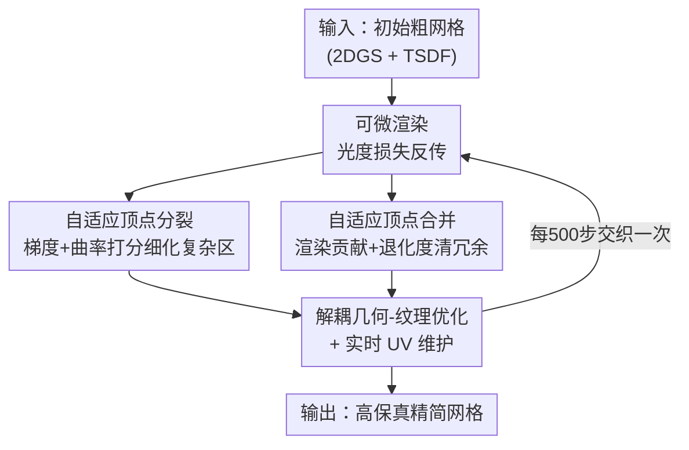

# ExMesh: EXplicit Mesh Reconstruction with Topology Adaptation

**会议**: CVPR 2026  
**arXiv**: [2606.07288](https://arxiv.org/abs/2606.07288)  
**代码**: 无（论文未公开）  
**领域**: 3D视觉  
**关键词**: 显式网格重建, 拓扑自适应, 顶点分裂/合并, 可微渲染, UV 解耦

## 一句话总结
ExMesh 把"离散拓扑操作（顶点分裂/合并）"直接塞进"连续可微优化"管线，从多视图图像端到端地优化一张显式三角网格——无需 Marching Cubes / TSDF 这类中间表示和后处理，并配套实时 UV 维护，在精度、效率、网格简洁度三者间取得很好的平衡（DTU 上 13 分钟、约 196K 面达到与 SOTA 相当的 Chamfer 距离）。

## 研究背景与动机
**领域现状**：从多视图图像重建表面网格主要有三条路。隐式方法（NeuS / Neuralangelo 等）用 MLP 学一个连续 SDF/密度场，但取网格时必须把场离散成高分辨率体素再跑 Marching Cubes；显式高斯方法（3DGS / 2DGS）训练渲染快，但高斯本质是无结构点云，要靠 TSDF fusion / Poisson 才能转成网格；网格驱动方法（Nvdiffrec / FlexiCubes / IMLS-Splatting）虽然引入可微光栅化让梯度直达网格属性，但优化目标仍是 SDF/点云/体素这类**中间载体**，而非网格本身。

**现有痛点**：上述路线都"绕了一圈"——隐式法慢且模糊锐边、丢细结构；高斯法后处理出来一堆离散碎片和噪声；中间载体法增加了框架复杂度、引入精度偏差。更麻烦的是纹理：若纹理直接存在顶点/面上，几何再简单只要纹理复杂就得堆海量面来表达细节，导致面数爆炸；用解耦 UV 贴图本是理想解，但在拓扑动态变化时**实时维护 UV 坐标**一直是没解决的难题。

**核心矛盾**：直接优化显式网格在几何层面有"自适应细化 vs 结构完整性"的两难——现有全局均匀细化对所有面四分裂，导致平坦区面冗余、复杂区细节不足；而顶点位移又容易产生退化面拖垮精度。在纹理层面则是"纹理解耦 vs 动态拓扑"的两难——Nvdiffrec 用坐标 MLP 纹理虽能解耦，但要冻结拓扑保持映射连续，还得训练后烘焙。

**本文目标**：抛开一切中间表示，直接优化网格的顶点位置 + 一张独立 UV 贴图，同时解决（1）拓扑如何自适应细化又不引入退化面；（2）拓扑演化时 UV 坐标如何实时保持一致。

**核心 idea**：把"连续梯度优化"和"离散拓扑更新"无缝交织——梯度优化顶点位置，周期性地按"梯度+曲率"分裂复杂区顶点、按"渲染贡献+退化度"合并冗余/退化面，并在每次拓扑变化时同步更新 UV，实现端到端 coarse-to-fine 的显式网格重建。

## 方法详解

### 整体框架
ExMesh 输入一张初始粗网格 $\mathcal{M}_{init}$（由 2DGS 训 7k 步 + TSDF 在 $256^3$ 提取得到），输出一张可直接光栅化渲染、可编辑的高保真精简网格。每次迭代用可微渲染器 nvdiffrast 渲染当前视角图像 $\hat{I}$，与真值 $I$ 算光度损失，梯度反传后驱动两条**设计上解耦**的优化回路：几何优化更新顶点 3D 位置 $\mathbf{V}$，纹理优化精修一张独立的 UV 贴图 $\mathbf{T}$。关键在于：连续的梯度优化被周期性插入**离散的顶点分裂与合并**操作（每 500 步一次），并在每次拓扑变化时同步维护 UV——由此实现从粗到细的动态网格细化与冗余清除。

### 关键设计

**1. 自适应顶点分裂：只在该细的地方加面，且不引入退化面**

针对"全局均匀四分裂"在平坦区浪费面、复杂区又不够细的痛点，ExMesh 借鉴网格生成里的顶点分裂思想，结合 3DGS 的密度控制策略，让面数按需增长。一个面值不值得细化由两条线索打分：**优化误差显著性**用顶点 EMA 梯度幅值 $\mathcal{G}_v$ 衡量——它对每个顶点收到的位置梯度范数做指数滑动平均 $\mathcal{G}_v^{(t)}=(1-\beta_g)\mathcal{G}_v^{(t-1)}+\beta_g\lVert\nabla_{\mathbf{V}}^{(t)}\rVert$，$\mathcal{G}_v$ 高说明该区域还需大幅几何调整；**几何复杂度**用曲率 $\mathcal{K}_f$ 衡量，定义为面法向 $\mathbf{n}_f$ 与所有相邻面法向夹角的平均 $\mathcal{K}_f=\frac{1}{N_{adj}}\sum_{\mathcal{F}_{adj}}\arccos(\mathbf{n}_f\cdot\mathbf{n}_{adj})$。把面级梯度 $\mathcal{G}_f$（三顶点 $\mathcal{G}_v$ 均值）与曲率加权得分 $S_f=\alpha\mathcal{G}_f+\beta\mathcal{K}_f$ 作为采样概率，且候选只取面积前 50% 的面（避免在已经很细的区域无效分裂）。

具体操作上，对选中面取"边长/顶点度" $S_e=l_e/d_e$ 最高的边作分裂边（兼顾几何与拓扑因素），把对面两顶点 $v_c,v_d$ 投影到该边、取投影点中点作新顶点 $v_s$ 以贴合局部曲面，随后删 2 个旧面、加 4 个新面。为了**避免退化面**，两条约束很关键：相邻面已被本轮改过则跳过（防并发冲突）；新顶点在边上的相对位置 $\alpha=\lVert v_s-v_a\rVert/\lVert v_b-v_a\rVert$ 必须落在中央区间 $[0.25,0.75]$，否则会切出又细又长的针状面。这套"打分采样 + 中点投影 + 区间约束"让细节恰好加在高曲率/大梯度区，而非全局铺张。

**2. 自适应顶点合并：把优化中产生的冗余面和退化面收拾干净**

作为分裂的反操作，合并类似网格简化里的经典"边塌缩（edge collapse）"，目的是恢复干净拓扑。一个面要不要合并从两个角度判断：**渲染可见性**用渲染贡献计数 $\mathcal{C}_{render}(\mathcal{F})$ 记录该面光栅化后对输出有多少次贡献，若 $\mathcal{C}_{render}=0$ 说明它从没被渲染过（变成内部面或被完全遮挡），属冗余；**几何形态**用退化度 $\mathcal{D}_f=\frac{\text{Area}(\mathcal{F})}{l_{\max}^2(\mathcal{F})}$ 衡量（面积除以最长边平方），$\mathcal{D}_f$ 小于阈值 $\tau_{degen}$ 即判为退化面（针状/瘦长）。只有面积后 50% 且满足任一条件的面进合并集 $\mathcal{M}_{merge}$，把操作限制在局部细节上。

操作时按面是否在边界选塌缩边：边界面塌缩其边界边以保边界完整，内部面塌缩 $S_e$ 最小的边以高效简化；再比较两端点顶点度，把度低的 $v_m$ 并入 $v_i$。并入后删除 $v_m$，同时含 $v_i,v_m$ 的面会退化成一条边直接删掉，只含 $v_m$ 的相邻面则把 $v_m$ 替换成 $v_i$ 重新链接以保持局部流形结构。同样用"已改过的面跳过"避免并发拓扑错误。分裂负责"加细节"、合并负责"去冗余"，二者交替才让面数受控（最终约 196K，远少于 GeoSVR 的 1.12M）。

**3. 解耦几何-纹理优化 + 实时 UV 维护：在拓扑动态变化下守住纹理连续**

针对"纹理存在几何载体上导致面数爆炸"和"解耦 UV 在拓扑变化时难维护"这对老大难，ExMesh 把几何与纹理彻底解耦：几何由顶点位置 $\mathbf{V}$ 表示，纹理存在一张**固定分辨率**的独立 UV 贴图 $\mathbf{T}$ 上，靠 UV 坐标 $\mathbf{u}$ 连接两者。渲染时 $\mathbf{V}$ 决定投影、插值出的 $\mathbf{u}$ 去采样 $\mathbf{T}$ 取颜色，图像损失梯度独立反传到几何与纹理。这样 $\mathbf{T}$ 的分辨率与面数无关——简洁网格也能表达高频纹理，从根上避免面数膨胀。

真正的难点是 UV 必须随拓扑变化实时维护。当分裂新增顶点 $v_s$：若在边界边上，$u_s$ 取 $u_a,u_b$ 中点；若在非边界边上，$v_s$ 被两个面共享而它们可能位于不同 UV 岛，于是分别在两个面的 UV 空间插值出两个候选 $u_s^{(1)}=(1-\mu)u_a+\mu u_b$ 与 $u_s^{(2)}=(1-\mu)u_a'+\mu u_b'$，若 $\lVert u_s^{(1)}-u_s^{(2)}\rVert<\tau_{uv}$ 则取均值，否则把两个 UV 坐标独立存下来以保留正确的**纹理接缝（seam）**；合并删除 $v_m$ 时则清理任何不再被引用的 UV 坐标。正是这套"每次拓扑变更就地更新 UV"的机制，让 ExMesh 同时拿到"动态拓扑"和"纹理解耦"——而 Nvdiffrec 只能二选一（解耦但要冻结拓扑 + 训练后烘焙）

### 损失函数 / 训练策略
总损失为加权组合 $\mathcal{L}=\lambda_{rgb}\mathcal{L}_{rgb}+\lambda_{d}\mathcal{L}_{d}+\lambda_{m}\mathcal{L}_{m}+\lambda_{s}\mathcal{L}_{s}+\lambda_{b}\mathcal{L}_{b}$：$\mathcal{L}_{rgb}$ 是光度损失，沿用 3DGS 的 $(1-\lambda_{dssim})\mathcal{L}_{L1}+\lambda_{dssim}\mathcal{L}_{D\text{-}SSIM}$ 组合；$\mathcal{L}_{d}$ 是 Pearson 深度损失，深度参考来自 Depth Anything 3；$\mathcal{L}_{m}$ 是轮廓损失（预测掩码与 GT 掩码的二元交叉熵）；$\mathcal{L}_{s}$ 是 Laplacian 平滑保几何光滑；$\mathcal{L}_{b}$ 是 FlexiCubes 的 bi-vertex 偏移正则。训练分阶段：1k 步 warm-up 做初始几何/纹理拟合；1k–7k 阶段每 500 步做一次分裂+合并并同步更新 UV、每 2000 步重建一次 UV 贴图；最后 1k 步冻结拓扑做最终精修。全程单张 RTX 3090。

## 实验关键数据

### 主实验
DTU 数据集（15 个真实物体）用 Chamfer 距离评几何质量。ExMesh 在精度与 SOTA 相当的同时，训练时间和面数都有显著优势（时间含初始化）。

| 数据集 | 指标 | ExMesh | GeoSVR(最佳精度) | PGSR | 2DGS |
|--------|------|--------|------------------|------|------|
| DTU | 平均 CD↓ | 0.58 | 0.47 | 0.52 | 0.76 |
| DTU | 训练时间↓ | 13min | 49min | 30min | 11min |
| DTU | 面数↓ | 196K | 1.12M | 1.05M | 260K |

ExMesh 的精度（0.58）介于第一梯队（GeoSVR 0.47 / PGSR 0.52）与 2DGS（0.76）之间，但用 GeoSVR 约 1/6 的面数、1/4 的时间达到接近水平——它换来的是网格简洁度与效率。NeRF-synthetic（8 个物体、拓扑更复杂、含反射）上平均 CD 0.64、约 216K 面、13min，同样与 SOTA 相当。

渲染质量（NeRF-synthetic，新视角合成）上 ExMesh 在所有网格驱动方法里领先：

| 方法 | PSNR↑ | SSIM↑ | LPIPS↓ |
|------|-------|-------|--------|
| Nvdiffrec | 26.87 | 0.930 | 0.090 |
| FlexiCubes | 27.50 | 0.930 | 0.080 |
| IMLS-Splat | 28.38 | 0.950 | 0.060 |
| **ExMesh** | **29.32** | **0.958** | **0.051** |
| 2DGS（高斯类） | 33.07 | 0.968 | 0.031 |

ExMesh 在网格驱动法里 PSNR/SSIM/LPIPS 全面最优，但与高斯类（2DGS 33.07）仍有差距——作者归因于高斯用球谐（SH）能灵活建模视角相关外观，而显式网格弥合这一渲染差距仍是开放问题。

### 消融实验
在 NeRF-synthetic 上对比分裂/合并策略的五个变体：

| 配置 | CD↓ | PSNR↑ | 面数 | 说明 |
|------|-----|-------|------|------|
| Only Split | 0.74 | 28.77 | 239K | 只分裂：能加细节但面数明显膨胀 |
| Only Merge | 1.81 | 23.51 | 12K | 只合并：无法加面拟合细节，精度崩 |
| Random Split | 0.77 | 28.30 | 184K | 分裂位置随机：三角化混乱不规则 |
| Random Merge | 1.34 | 26.27 | 192K | 随机合并：错误塌缩边引入拓扑畸变 |
| **Ours (full)** | **0.64** | **29.32** | 196K | 分裂+合并协同，精度面数双优 |

### 关键发现
- **分裂与合并必须协同**：Only Merge 因不能加面，CD 暴涨到 1.81、PSNR 跌到 23.51；Only Split 虽精度尚可（0.74）但面数膨胀到 239K——只有二者交替才能在 196K 面下拿到最佳 CD 0.64。
- **分裂位置不能随机**：Random Split（CD 0.77）证明"投影中点 + 中央区间约束"的精心放置确实优于随机点，随机会破坏局部网格规整度。
- **对初始网格不强依赖**：用 1000 面随机色球面替代标准粗网格初始化，完整管线仍能形变+细分重建出目标物体，只是收敛更慢、最终精度略低——说明方法鲁棒性不靠精挑的初始网格。

## 亮点与洞察
- **离散拓扑操作 ↔ 连续可微优化的无缝交织**：这是全文最核心的"啊哈"——以往要么纯连续（优化中间载体）要么纯离散（remeshing），ExMesh 把顶点分裂/合并当成周期性插入连续优化的离散步骤，且每步都配套约束（中央区间、并发跳过）保结构完整，是首个直接做显式网格优化 + 实时自适应细化的框架。
- **打分驱动的"按需加面/按需删面"**：分裂用"EMA 梯度 + 曲率"双线索打分，合并用"渲染贡献为 0 + 退化度"双判据，两者都把操作限制在面积前/后 50%——这种"用优化信号本身决定哪里该细、哪里该简"的思路可迁移到任何可微网格/点云细化任务。
- **拓扑变化下的 UV 接缝处理**：非边界顶点分裂时按"两候选 UV 是否接近"自动决定合并坐标还是独立存接缝，这是把"动态拓扑"和"纹理解耦"两个互斥需求同时满足的关键工程巧思，思路可借鉴到任何需要随几何编辑维护纹理映射的场景。

## 局限与展望
- **渲染质量逊于高斯类**：作者坦承显式网格缺少球谐这类视角相关外观建模，PSNR 29.32 明显低于 2DGS 的 33.07，弥合差距是 ongoing challenge。
- **依赖较好的初始粗网格**：虽然消融显示球面初始化也能收敛，但代价是更慢、精度略降；标准管线仍需先训 2DGS + TSDF 提取，相当于背了一个高斯重建的前置成本。
- **几何精度未登顶**：DTU 平均 CD 0.58 落后于 GeoSVR 0.47 / PGSR 0.52，ExMesh 的卖点是"精度-效率-简洁度的平衡"而非纯精度最优，对追求极致几何精度的场景未必首选。
- **未开源 + 关键阈值靠经验**：$\tau_{degen}$、$\tau_{uv}$、$\alpha/\beta$ 权重等超参均放在补充材料，可复现性与超参敏感性有待验证。

## 相关工作与启发
- **vs Nvdiffrec / FlexiCubes**：它们优化连续 SDF 载体（DMTet / FlexiCubes 后端）再取网格，纹理用坐标 MLP 但要冻结拓扑 + 训练后烘焙；ExMesh 直接优化网格本身、实时维护 UV，同时拿到动态拓扑与纹理解耦，且面数（196K vs 它们虽更少但精度差很多）和精度更均衡。
- **vs IMLS-Splatting / GeoSVR**：它们以点云/体素为优化载体，纹理耦合在载体上导致面数膨胀（GeoSVR 1.12M）且有浮面碎片；ExMesh 网格更简洁干净（无明显伪影），效率高得多（13min vs 49min）。
- **vs 2DGS / GOF 等高斯类**：高斯渲染质量更高但本质是无结构点云，要靠 TSDF/Poisson 后处理转网格、产生大量离散碎片；ExMesh 端到端直出可编辑流形网格，省去后处理，代价是渲染质量略逊。

## 评分
- 新颖性: ⭐⭐⭐⭐⭐ 首个把离散拓扑操作无缝嵌入连续可微优化、并实时维护 UV 的显式网格重建框架
- 实验充分度: ⭐⭐⭐⭐ DTU + NeRF-synthetic 双数据集、几何/渲染/消融齐全，但未开源且超参细节藏在补充
- 写作质量: ⭐⭐⭐⭐ 动机的"双层两难"梳理清晰，方法分裂/合并/UV 三块讲得到位
- 价值: ⭐⭐⭐⭐ 为显式网格重建提供"边优化边改拓扑"的新范式，工程巧思可迁移，但精度未登顶

<!-- RELATED:START -->

## 相关论文

- [\[CVPR 2026\] TagSplat: Topology-Aware Gaussian Splatting for Dynamic Mesh Modeling and Tracking](tagsplat_topology-aware_gaussian_splatting_for_dynamic_mesh_modeling_and_trackin.md)
- [\[ICLR 2026\] Topology-Preserved Auto-regressive Mesh Generation in the Manner of Weaving Silk](../../ICLR2026/3d_vision/topology-preserved_auto-regressive_mesh_generation_in_the_manner_of_weaving_silk.md)
- [\[CVPR 2026\] ReWeaver: Towards Simulation-Ready and Topology-Accurate Garment Reconstruction](reweaver_towards_simulation-ready_and_topology-accurate_garment_reconstruction.md)
- [\[CVPR 2026\] TopoMA: Topology-Guided Multi-Agent Dense RGB 3D Reconstruction via Distributed Inference](topoma_topology-guided_multi-agent_dense_rgb_3d_reconstruction_via_distributed_i.md)
- [\[CVPR 2026\] Learning Explicit Continuous Motion Representation for Dynamic Gaussian Splatting from Monocular Videos](learning_explicit_continuous_motion_representation_for_dynamic_gaussian_splattin.md)

<!-- RELATED:END -->
