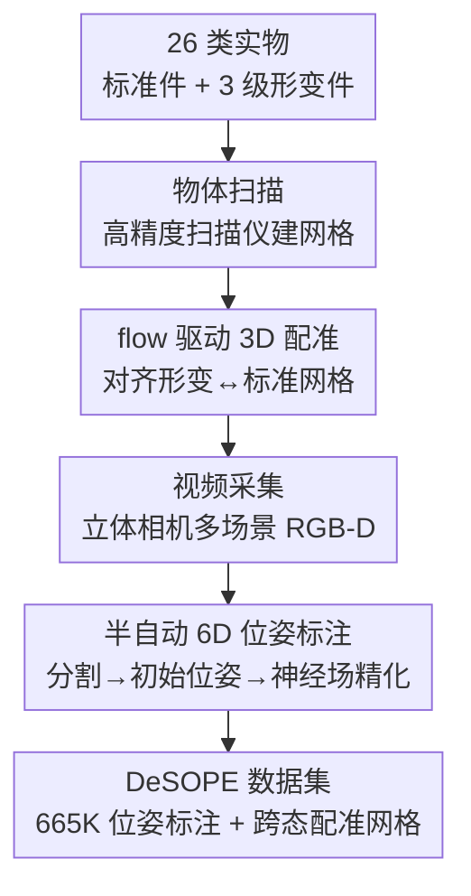

# Exploring 6D Object Pose Estimation with Deformation

**会议**: CVPR 2026  
**arXiv**: [2604.06720](https://arxiv.org/abs/2604.06720)  
**代码**: https://desope-6d.github.io/ (项目主页)  
**领域**: 3D视觉 / 6D位姿估计 / 数据集  
**关键词**: 6DoF位姿, 形变物体, 数据集, RGB-D, 网格配准

## 一句话总结
针对现有 6D 位姿估计普遍假设物体"刚性、与标准 CAD 完全一致"这一在现实中常常失效的前提，本文构建了首个显式刻画形变的数据集 **DeSOPE**——对 26 类日用品各扫描 1 个标准件 + 3 个递增形变件（轻/中/重），用 flow 驱动配准把形变网格对齐到标准网格，并通过半自动管线在 133K RGB-D 帧上产出 665K 条位姿标注；实验证明形变越严重，主流方法掉点越狠，揭示"刚性假设"是当前位姿管线一个被严重低估的短板。

## 研究背景与动机
**领域现状**：6D 物体位姿估计是机器人抓取、混合现实、具身智能的核心能力。无论是实例级方法（LINEMOD、YCB-V、T-LESS 等，每个实例配一份自己的 CAD/扫描模型）还是类别级方法（REAL275、HouseCat6D 等，一个类别共享一份标准网格），它们的评测和训练几乎都建立在"图像里的物体和参考网格完美吻合"之上。

**现有痛点**：现实里被当作"刚性"的纸箱、塑料瓶、易拉罐，经过碰撞、磨损、运输挤压后会被压扁、凹陷、弯折。实例级数据集只收录完好物体，把网格差异解释成"不同的刚性实例"；类别级数据集虽然容忍类内差异，但没有逐实例的精确网格，无法刻画同一物体形变前后的几何变化。结果就是：没有任何基准能回答"物体偏离标准形状后，位姿方法还能不能用"。

**核心矛盾**：所有方法都默认"输入图像 = 标准网格的某个视角投影"，而真实物体的不可预测形变直接破坏了这个前提；偏偏没有数据能量化这个破坏有多严重。

**本文目标**：(1) 造出一份同时含标准件与多级形变件、且形变网格与标准网格精确配准的数据集；(2) 给出大规模可信的 6D 位姿标注；(3) 系统量化主流方法在形变下的退化程度。

**切入角度**：聚焦"名义刚性、实际常形变"的日用品（包装、容器），而不是天生就该形变的衣物/软体——因为前者恰恰是现有方法默认能处理、实则失效的盲区。

**核心 idea**：用"一个标准件 + 三个递增形变件 + 精确跨态配准"的采集范式，把"形变"从噪声变成可测量、可标注、可评测的一等公民。

## 方法详解
本文是数据集论文，"方法"即一套四阶段的数据生产与标注管线：先用高精度扫描仪拿到每个物体的标准网格和多级形变网格，再用 flow 驱动配准把形变网格对齐到标准网格，然后用立体相机在多场景采集 RGB-D 视频，最后用半自动管线（分割→初始位姿→隐式神经场精化→人工核验）产出高质量 6D 标注。整条管线既要保证形变网格之间的几何对应可信，又要在大规模视频上把位姿标到 BOP 评测可用的精度。

### 整体框架
输入是 26 类日用品实物，输出是带精确跨态配准的 3D 网格库 + 133K 帧 RGB-D + 665K 条位姿标注。中间分四步串行流转：物体扫描产出网格 → 模型配准建立标准↔形变对应 → 视频采集得到 RGB-D 序列 → 位姿标注把网格"贴"回每一帧。其中"模型配准"和"位姿标注"是本文真正的技术贡献，其余两步是标准采集脚手架。

### 关键设计

**1. 标准件 + 三级递增形变的采集范式：把"形变程度"做成可控变量**

要研究"形变如何影响位姿估计"，前提是形变本身可量化、可分级。本文为 26 个类别各准备 4 个实例：1 个标准（未形变）参考件，外加轻、中、重三级递增形变件，共 104 个物体，覆盖拉伸、弯折、压缩、扭转等真实形变类型。每个物体用 Go!SCAN SPARK 扫描仪建网格（约 10 分钟/件）。形变程度用一个可计算的量来定义——对齐形变网格与标准网格后，对应顶点的平均逐点 3D 距离（单位 cm），从而把"轻/中/重"从主观描述变成 Deformed 1/2/3 的连续刻度。正因为有了标准件作锚点，后续才能让所有方法都"以为"输入是标准网格、却用真实形变网格算误差，干净地隔离出形变这一个因素的影响

**2. flow 驱动的跨态 3D 网格配准：让形变网格与标准网格逐顶点对得上**

形变件和标准件是两个独立扫描的网格，没有天然的顶点对应，直接 ICP 在大形变下容易陷入局部最优。本文先做一次粗糙的手工对齐拿到初值，再用一个 flow 引导的匹配策略精化：把两个网格从前后左右上下六个正交视角渲染（施加相同的旋转平移以保证一致），对同视角的渲染图对用 SCFlow 预测稠密 2D 对应（SCFlow 在约 90K 网格、900 万渲染图对上预训练，推理时只取它的 2D 对应、丢弃其位姿输出）。再借助渲染时天然记录的 2D–3D 映射，把 2D 对应抬升为标准↔形变网格之间的 3D–3D 对应。最后两步求解变换：先用 RANSAC（3 cm 阈值）剔除外点并估初始变换，再用 Umeyama 算法在内点集上求最优相似变换（含旋转、平移、尺度）。这样得到的配准既不依赖好的初值，又能稳健处理大形变——配准误差从手工对齐的整体 0.78/1.14/1.40 cm（Deformed 1/2/3）降到精化后的 0.54/0.72/0.93 cm

**3. 半自动 6D 位姿标注：用基础模型初始化 + 实例约束的隐式神经场精化**

133K 帧、每帧约 5 个实例、共 665K 标注，纯手工不可能。本文设计了一条半自动管线。先用 SAM2 给每帧每个实例分割出 2D mask；位姿初始化上，作者特意不用传统 SLAM 的匀速运动模型（在快速运动和遮挡下脆弱），改用 FoundationPose 做无需重训的初始位姿估计，并对每个实例的多次候选做一致性投票——只保留两两误差低于阈值 $\tau$（旋转 $5^\circ$、平移 $5\,\text{cm}$）的位姿再取平均，剔除离群。随后基于 Co-SLAM 联合优化相机位姿 $\xi_t$ 与隐式场景表示 $f_\theta$（世界坐标→颜色与 TSDF），关键改动有两点：其一，把光线采样限制在实例 mask 区域内，只对物体几何处采样、屏蔽背景干扰；其二，新增一个实例 mask 对齐损失，对落在背景的光线（$\max_i M_i(u,v)=0$）施加深度残差惩罚、对实例像素不罚：

$$\mathcal{L}_{\text{mask}}=\frac{1}{|\mathcal{R}_t|}\sum_{(o_t,r_{t,u,v})\in\mathcal{R}_t}\big(1-\max_i M_i(u,v)\big)\cdot\big\|\hat{d}_{t,u,v}-d_{t,u,v}\big\|_2^2$$

总损失把颜色、深度、SDF、自由空间和 mask 五项加权（$\lambda_{\text{rgb}}=5,\ \lambda_d=0.1,\ \lambda_{\text{sdf}}=1000,\ \lambda_{\text{fs}}=10,\ \lambda_{\text{mask}}=2$），并做全局 bundle adjustment 联合优化所有关键帧位姿。最后人工核验。FoundationPose 的强初值 + mask 约束的精化，使标注既能规避匀速假设导致的局部最优，又把优化信号牢牢锁在目标实例上

### 损失函数 / 训练策略
标注精化阶段交替优化：固定位姿、对场景参数 $\theta$ 优化 $k=10$ 次，再用累积梯度更新位姿，循环往复。注意这是"标注生产"的优化，不是训练一个待发布的位姿模型——DeSOPE 是评测基准，被评测的方法（SCFlow2、FoundationPose、GenPose）各自沿用原设定，其中 GenPose 把 4 个网格当作单一类别在本数据上重训。

## 实验关键数据

### 3D 模型配准精度
配准误差（cm，RANSAC 3 cm 阈值后统计），"Init." 为手工对齐、"+Refine" 为精化后，整体行：

| 形变级别 | Init. | +Refine | 误差降幅 |
|---------|-------|---------|---------|
| Deformed 1（轻） | 0.782 | 0.538 | -31% |
| Deformed 2（中） | 1.138 | 0.719 | -37% |
| Deformed 3（重） | 1.400 | 0.933 | -33% |

flow 驱动精化在三个形变级别上都把配准误差压低约三分之一，验证多视角匹配能有效捕捉顶点级形变。

### 主流方法在形变下的退化
在 DeSOPE 上评测三个 RGB-D 方法的 Average Recall（AR，VSD/MSSD/MSPD 三项 BOP 指标均值），所有方法推理时都用标准网格、但用真实网格算指标：

| 网格状态 | SCFlow2 | FoundationPose | GenPose |
|---------|---------|----------------|---------|
| Canonical（标准） | 0.82 | 0.78 | 0.67 |
| Deformed 1（轻） | 0.67 | 0.58 | 0.56 |
| Deformed 2（中） | 0.43 | 0.38 | 0.36 |
| Deformed 3（重） | 0.23 | 0.24 | 0.31 |

无论哪种方法，从标准件到重度形变件 AR 都断崖式下跌：SCFlow2 从 0.82 跌到 0.23（-0.59），FoundationPose 从 0.78 跌到 0.24，GenPose 从 0.67 跌到 0.31。

### 人为操作与遮挡的影响
带人手操作（拿取、握持、晃动、故意制造手部遮挡）的子集上，三方法在各形变级别一致更低（如 SCFlow2 标准件 0.82→0.77、重度 0.23→0.20）。作者归因于：(1) 手部遮挡减少可见表面、削弱几何线索；(2) 快速手部运动带来运动模糊、劣化 RGB-D 观测。遮挡比例越高、形变越重，退化越明显。

### 关键发现
- **形变是退化主因**：三个方法在标准件上 AR 均较高（0.67–0.82），重度形变后全部跌至 0.23–0.31，证明"刚性假设"在真实形变下严重失效。
- **依赖精确几何匹配的方法更脆**：SCFlow2、FoundationPose 靠精细几何对应，人手操作下退化更剧烈；GenPose 因在本数据上重训且具类别级泛化能力，退化相对平缓——在重度形变下 GenPose（0.31）反而略胜两个无需重训的方法。
- **配准精化必要**：手工对齐误差在重度形变下达 1.40 cm，flow 精化后降到 0.93 cm，说明跨态配准不能只靠人工初值。

## 亮点与洞察
- **把"形变"从噪声变成可控变量**：用"标准件 + 三级递增形变件 + 精确跨态配准"的范式，让所有方法都在同一标准网格假设下被评测、却用真实网格算误差，干净隔离出形变这一个因素——这是数据集设计上最巧妙的一步，可迁移到任何"假设输入与模板吻合"的任务（如类别级重建、模板匹配跟踪）。
- **基础模型当标注引擎**：用 FoundationPose 替代匀速运动模型做初始位姿、再加一致性投票，是当下"用大模型给数据集打标"的典型范式，对快速运动/遮挡场景的标注鲁棒性明显更好。
- **mask 约束的隐式场精化**：把光线采样和损失都锁进实例 mask，是一个简单但有效的 trick——能把多物体杂乱场景里的优化信号干净地约束到目标几何上，可复用到任意"逐实例位姿/重建"的优化标注里。
- **最让人"啊哈"的点**：一个看似工程化的"数据集"贡献，却揭示了整个领域一个被默认正确、实则普遍违背的前提——"图像里的物体就是标准网格"。

## 局限与展望
- **作者承认的局限**：DeSOPE 只提供评测基准，未给出 deformation-aware 的位姿方法本身；论文期望后续工作在形变感知表示、时序建模、鲁棒位姿上发力。
- **形变类型与规模**：仅覆盖 26 类日用品的拉伸/弯折/压缩/扭转，且每类只有 1 个标准 + 3 个形变实例，形变多样性受限；是否能泛化到更柔性或更复杂的形变（如多处局部凹陷叠加）未验证。
- **评测方法偏少**：只评了 3 个 RGB-D 方法，缺少纯 RGB 方法和最新类别级方法的横向比较；不同方法的"标准件 AR"本身就有 0.67–0.82 的差距，跨方法直接比退化幅度需谨慎。
- **标注仍含半自动环节**：依赖 SAM2 + FoundationPose 的质量，最终靠人工核验兜底，标注精度的天花板受这两个基础模型的能力限制。
- **改进思路**：可以基于 DeSOPE 训练显式建模形变场（如把形变参数作为位姿之外的额外自由度联合估计），或引入时序约束利用视频连续性提升形变下的鲁棒性。

## 相关工作与启发
- **vs 实例级数据集（LINEMOD / YCB-V / HOPE）**：它们一个实例配一份刚性 CAD、假设永不形变，即便有遮挡和手交互也假设物体完美匹配参考模型；DeSOPE 提供同一实例的多级形变网格并精确对齐到标准件，第一次让"形变下评测"成为可能。
- **vs 类别级数据集（REAL275 / HouseCat6D）**：它们用一份标准网格代表整个类别（一对多），容忍类内差异但没有逐实例精确网格，无法刻画"同一物体形变前后"的几何变化；DeSOPE 用逐实例扫描 + 跨态配准补上了这块。
- **vs 可形变/非刚性研究（衣物、软体、关节人体）**：那些领域里形变是预期且核心的研究对象；本文反其道而行，专攻"名义刚性、实际常形变"的包装与容器——恰是现有方法默认能处理、实则失效的盲区。
- **方法工具上**：配准复用 SCFlow 的稠密 2D 对应 + RANSAC + Umeyama；标注复用 SAM2、FoundationPose、Co-SLAM，是"组合现成基础模型搭标注流水线"的代表性实践。

## 评分
- 新颖性: ⭐⭐⭐⭐⭐ 首个显式刻画形变的 6D 位姿数据集，揭示并量化了"刚性假设"这一被低估的领域短板
- 实验充分度: ⭐⭐⭐⭐ 配准精度 + 三方法 × 四形变级别 + 遮挡/人手操作分析较完整，但被评方法偏少、缺纯 RGB 方法
- 写作质量: ⭐⭐⭐⭐ 动机清晰、管线交代完整，图表对应明确
- 价值: ⭐⭐⭐⭐⭐ 为 deformation-aware 位姿估计立了第一个基准，对机器人/MR/具身的真实落地价值高

<!-- RELATED:START -->

## 相关论文

- [\[CVPR 2026\] AlignPose: Generalizable 6D Pose Estimation via Multi-view Feature-metric Alignment](alignpose_generalizable_6d_pose_estimation_via_multi-view_feature-metric_alignme.md)
- [\[CVPR 2026\] SE(3)-Equivariance with Geometric and Topological Guidance for Category-Level Object Pose Estimation](se3-equivariance_with_geometric_and_topological_guidance_for_category-level_obje.md)
- [\[CVPR 2026\] ConceptPose: Training-Free Zero-Shot Object Pose Estimation using Concept Vectors](conceptpose_training-free_zero-shot_object_pose_estimation_using_concept_vectors.md)
- [\[CVPR 2026\] Breaking the 3D Dataset Bottleneck: Fast Scalable Generation of Aligned 3D Assets from Scratch for Category 6D Pose Estimation and Robotic Grasping](breaking_the_3d_dataset_bottleneck_fast_scalable_generation_of_aligned_3d_assets.md)
- [\[CVPR 2026\] DICArt: Advancing Category-level Articulated Object Pose Estimation in Discrete State-Spaces](dicart_advancing_category-level_articulated_object_pose_estimation_in_discrete_s.md)

<!-- RELATED:END -->
