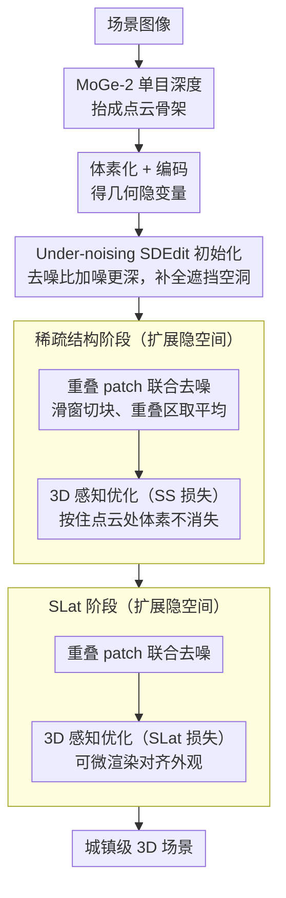

# Extend3D: Town-Scale 3D Generation

**会议**: CVPR 2026  
**arXiv**: [2603.29387](https://arxiv.org/abs/2603.29387)  
**代码**: 无（有 project page）  
**领域**: 3D视觉  
**关键词**: 3D场景生成, 大规模场景, 训练无关, 扩展隐空间, 体素生成

## 一句话总结

本文提出 Extend3D，一个无需训练的 3D 场景生成流水线，通过扩展预训练物体级 3D 生成模型（Trellis）的体素隐空间并引入重叠 patch 联合去噪、under-noising SDEdit 初始化和 3D 感知优化，从单张图像生成城镇级大规模 3D 场景，在人类偏好和定量评估中均超越现有方法。

## 研究背景与动机

1. **领域现状**：3D 生成模型（如 Trellis、Hunyuan3D）已能生成高质量 3D 物体，但局限于物体级数据训练，使用固定大小的隐空间表示 3D 数据。
2. **现有痛点**：
    - 固定隐空间大小限制了输出细节，场景越大越模糊（类似低分辨率图像）；
    - 3D 场景数据集稀缺，数据驱动的场景生成方法只能生成有限类别；
    - 外绘式（outpainting）方法（如 SynCity、3DTown）逐块生成导致块间不一致、接缝可见。
3. **核心矛盾**：物体级模型的隐空间不足以表示大规模场景的细节，但缺乏场景级训练数据使得直接训练场景模型不可行。
4. **本文目标**：如何利用预训练的物体级 3D 生成模型实现高保真的大规模 3D 场景生成？
5. **切入角度**：借鉴 2D 高分辨率图像生成中的 MultiDiffusion 思路，在 x/y 方向扩展 3D 隐空间，使用重叠 patch 联合生成，但针对 3D 特有的问题（地面消失、物体旋转错误等）加入结构先验和优化。
6. **核心 idea**：将物体级 3D 模型的隐空间在水平方向扩展，通过重叠 patch 联合去噪+点云先验初始化+3D 感知损失优化，实现城镇级 3D 场景生成。

## 方法详解

### 整体框架

Extend3D 要解决的是一个"巧妇难为无米之炊"的问题：手里只有在物体级数据上训练好的 3D 生成模型（Trellis），其隐空间被固定成物体的大小，硬要它吐出一整座城镇，结果就像把小图强行放大——越大越糊。本文的做法是不再重训模型，而是把它的隐空间在水平方向"撑大"，再想办法让原模型在这块更大的画布上协同作画。

整条流水线沿用 Trellis 的两阶段结构——先生成稀疏结构（哪里有体素），再生成结构化隐变量 SLat（每个体素长什么样），两阶段都跑在扩展后的隐空间上。给定一张场景图像，先用单目深度估计器 MoGe-2 把它抬成点云作为几何骨架；这副骨架经体素化、编码后给扩展隐空间做初始化；随后在重叠 patch 的联合去噪中逐步成形，每一步还用点云和原图的先验把去噪轨迹拉回"场景该有的样子"，最终输出城镇级 3D 场景。

### 关键设计

**1. 重叠 patch 联合去噪：让撑大的隐空间里多个 patch 同时生成、彼此纠错**

隐空间一旦从物体级的 $N\times N\times N$ 撑成 $\mathbf{Z}_t \in \mathbb{R}^{aN \times bN \times N}$（$a,b$ 是水平扩展因子），原模型根本没见过这么大的输入。直觉是像 SynCity 那样逐块顺序往外画，但接力式生成会让后画的块对不上先画的块，接缝清晰可见。本文借 2D 的 MultiDiffusion 思路改成"同时画"：用滑动窗口把扩展隐空间切成一堆互相重叠的 patch，每个 patch 用原模型独立算出自己的 vector field，再把所有 patch 的结果拼回大画布，重叠区域取平均：

$$\bm{v}(\mathbf{Z}_t, \mathcal{I}, t) = \sum_{i,j} \phi_{i,j}^{-1}(\bm{v}_{i,j}) \oslash \sum_{i,j} \mathbf{1}_{\mathbb{W}_{i,j}}$$

其中 $\phi_{i,j}$ 是第 $(i,j)$ 个窗口的裁切映射，图像条件也按同样的窗口裁切对齐。重叠是关键——相邻 patch 共享一片区域，去噪时就被迫互相妥协、彼此修正，而不是各画各的；同时位于画布中心的物体仍落在某个 patch 内，照样吃得到物体级模型的细节优势。窗口越密（用 division factor $d$ 控制步长）局部纠错越细：消融里 $d=2$ 时局部结构会扭曲，加到 $d=4$ 畸变就被抚平。

**2. Under-noising SDEdit 初始化：用深度点云搭骨架，顺便把遮挡处补全**

光有重叠去噪还不够，从纯噪声起步生成的大场景结构会乱飘。自然的想法是用 MoGe-2 点云体素化、编码成隐变量 $\mathbf{Z}_0^{(g)}$ 做 SDEdit 初始化，但标准 SDEdit 在这里有个两难：加噪/去噪到同一时刻 $t_{\text{start}}=t_{\text{noise}}$，$t_{\text{start}}$ 取小了模型不敢动、单目点云里被遮挡的空洞补不上，取大了又会把已有的可靠结构一起冲掉。本文的破局点叫 under-noising——故意让 $t_{\text{start}} > t_{\text{noise}}$，即"去噪的程度比加噪的程度更深"。多出来的那段去噪让模型把点云里缺失、遮挡的区域当成额外噪声主动填补，而真实存在的结构因为加噪较浅得以保留。整个初始化还迭代进行，$O_n = \text{SDEdit}(O_{n-1})$ 一轮轮把场景补得更完整。这招的内核和超分里"注入高频噪声逼模型补细节"是相通的：用噪声预算的不对称，把"保结构"和"补空洞"这对矛盾解开。

**3. 3D 感知优化：每个去噪步都用先验把物体级模型往"场景"上拽**

物体级模型有个改不掉的习惯：它眼里万物皆物体，去噪时会让子场景往物体的形态收敛——地面被当成"不该存在的背景"逐渐消失，建筑被当成可摆弄的物体随机旋转。为此本文不改模型权重，而是在每个去噪步用 Adam 直接优化当前的 vector field $\hat{\bm{v}}_t$，让它服从两条先验。稀疏结构阶段约束点云所在位置的体素不许消失：

$$\mathcal{L}_{\text{SS}} = -\frac{1}{|\mathbb{P}|}\sum_{\bm{p}\in\mathbb{P}} \log \sigma\big((\mathcal{D}(\mathbf{Z}_t^{\text{SS}} - t\cdot\hat{\bm{v}}_t))_{\bm{p}}\big)$$

它把预测的干净隐变量解码后，在点云覆盖的体素 $\mathbb{P}$ 上拉高占据概率，等于按住地面和已知结构不让它们被去噪流冲走。SLat 阶段则换成外观约束：

$$\mathcal{L}_{\text{SLat}} = \text{LPIPS}(\hat{\mathcal{I}}, \mathcal{I}) - \text{SSIM}(\hat{\mathcal{I}}, \mathcal{I})$$

通过可微渲染把当前 3D 结果渲到输入视角，与原图比对，倒逼纹理和外观对齐。两条损失合起来既矫正了物体级模型的系统性偏差（地面、朝向），又顺带把重叠 patch 之间残留的接缝抹平。

### 损失函数 / 训练策略

全程无需训练，上述组件全部只在推理时介入。两条优化损失都用 Adam 在每个去噪步优化 vector field $\hat{\bm{v}}_t$，而非更新模型权重。稀疏结构阶段额外采用 dilated sampling 扩大感受野，保证撑大后的隐空间全局一致。

## 实验关键数据

### 主实验（定量，100张输入图像）

| 方法 | LPIPS↓ | SSIM↑ | PSNR↑ | CD↓ | F-score↑ |
|------|--------|-------|-------|-----|----------|
| Trellis | 0.650 | 0.239 | 10.0 | 0.0315 | 0.442 |
| Hunyuan3D | 0.683 | 0.255 | 10.4 | 0.0192 | 0.567 |
| EvoScene | 0.482 | 0.310 | 13.2 | 0.0188 | 0.498 |
| **Ours w/o SLat optim** | **0.400** | **0.333** | **13.8** | **0.0078** | **0.708** |
| **Ours (full)** | **0.240** | **0.611** | **20.4** | **0.0086** | **0.694** |

### 消融实验（a=b=2）

| 配置 | LPIPS↓ | SSIM↑ | PSNR↑ | CD↓ | F-score↑ |
|------|--------|-------|-------|-----|----------|
| Patch-wise flow only | 0.606 | 0.209 | 9.63 | 0.0348 | 0.261 |
| + 初始化 | 0.425 | 0.312 | 13.0 | 0.0083 | 0.693 |
| + SS优化 | 0.400 | 0.333 | 13.8 | 0.0078 | 0.708 |
| + SLat优化 (full) | 0.240 | 0.611 | 20.4 | 0.0086 | 0.694 |

### 关键发现

- 人类偏好评估中，Extend3D 在几何、保真度、外观、完整性四个维度上全面胜出（vs Trellis 50-67%、vs Hunyuan3D 73-76%、vs EvoScene 87%）
- 初始化是必需的：无初始化（$t_{\text{start}}=1$）时结构完全崩溃
- Under-noising 相比标准 SDEdit 能自然地填补遮挡区域而不破坏已有结构
- Division factor $d$ 越大结果越好（$d=8$ 最优），但计算开销也更大
- SLat 优化极大提升纹理质量（LPIPS 从 0.400 降到 0.240，PSNR 从 13.8 提升到 20.4）

## 亮点与洞察

- **Under-noising 概念**：巧妙地发现 $t_{\text{start}} > t_{\text{noise}}$ 时模型会将3D结构的不完整性视为噪声进行补全。这是一个简单但深刻的观察，可推广到其他需要"编辑+补全"的生成任务
- **场景级生成无需场景级数据**：完全复用物体级模型的知识，仅通过扩展隐空间+先验引导即可生成城镇级场景，避免了3D场景数据稀缺的瓶颈
- **重叠 patch 联合去噪 vs 顺序外绘**：同时生成所有 patch 使得相邻区域可互相修正，比 SynCity 的顺序方式更一致

## 局限与展望

- 扩展因子 $a,b$ 和 division factor $d$ 的选择需要手动调参，计算开销随之增大
- 依赖单目深度估计器的质量，MoGe-2 估计不准会传播误差
- 生成场景的物理合理性（如重力、遮挡关系）未被显式建模
- 对长走廊等极细长场景的效果未验证（当前主要展示方形/矩形场景）
- SLat 优化略微增加了 CD（0.0078→0.0086），可能对某些几何结构引入轻微偏差

## 相关工作与启发

- **vs SynCity**: 顺序外绘方式导致块间不一致和可见接缝，Extend3D 通过同时生成避免此问题
- **vs 3DTown/EvoScene**: 也使用点云初始化但依赖 RePaint 逐 patch 补全，无法处理物体级模型的系统性偏差（如地面消失）
- **vs MultiDiffusion**: 2D 高分辨率生成的思路扩展到 3D，但 3D 特有问题（物体中心性、空间对齐）需要额外的先验和优化

## 评分

- 新颖性: ⭐⭐⭐⭐ under-noising 和 3D 感知优化是有价值的贡献
- 实验充分度: ⭐⭐⭐⭐ 人类偏好+定量+消融全面，但数据集偏小
- 写作质量: ⭐⭐⭐⭐ 方法论述清晰，图示直观
- 价值: ⭐⭐⭐⭐⭐ 训练无需场景数据即可生成城镇级3D场景，实用价值高

<!-- RELATED:START -->

## 相关论文

- [\[CVPR 2026\] WonderZoom: Multi-Scale 3D World Generation](wonderzoom_multi-scale_3d_world_generation.md)
- [\[CVPR 2026\] PointNSP: Autoregressive 3D Point Cloud Generation with Next-Scale Level-of-Detail Prediction](pointnsp_autoregressive_3d_point_cloud_generation_with_next-scale_level-of-detai.md)
- [\[CVPR 2026\] OLATverse: A Large-scale Real-world Object Dataset with Precise Lighting Control](olatverse_a_large-scale_real-world_object_dataset_with_precise_lighting_control.md)
- [\[CVPR 2026\] VGG-T3: Offline Feed-Forward 3D Reconstruction at Scale](vgg-t3_offline_feed-forward_3d_reconstruction_at_scale.md)
- [\[CVPR 2026\] AMB3R: Accurate Feed-forward Metric-scale 3D Reconstruction with Backend](amb3r_accurate_feed-forward_metric-scale_3d_reconstruction_with_backend.md)

<!-- RELATED:END -->
