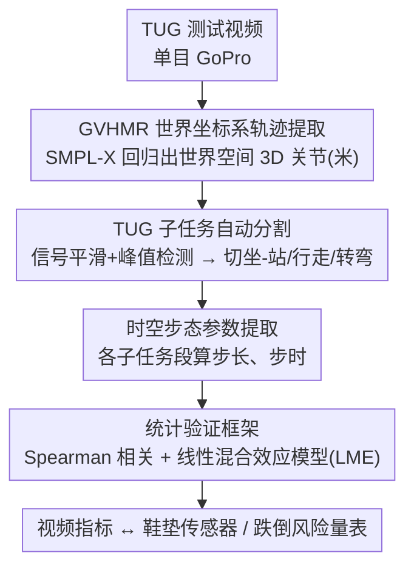

# Fall Risk and Gait Analysis using World-Spaced 3D Human Mesh Recovery

**会议**: CVPR 2026  
**arXiv**: [2604.11961](https://arxiv.org/abs/2604.11961)  
**代码**: 无  
**领域**: 3D视觉  
**关键词**: 步态分析, 跌倒风险, 人体网格恢复, 老年人, 单目视频

## 一句话总结

提出基于 GVHMR（世界坐标系 3D 人体网格恢复）的步态分析管线，从单目视频中提取老年人定时起立行走测试的时空步态参数，验证了视频衍生指标与可穿戴传感器的相关性及与跌倒风险的关联。

## 研究背景与动机

**领域现状**：步态评估是老年人跌倒风险和整体健康的关键临床指标，但标准临床实践主要局限于秒表测量的步态速度。

**现有痛点**：全面的步态评估受限于技术和专业培训的有限获取。惯性传感器、光学标记系统和多相机无标记运动捕捉需要专用基础设施，限制了其在受控临床/研究环境之外的部署。

**核心矛盾**：跌倒风险的生物力学相关因素已明确，但现有测量方法无法在非控制的社区环境中规模化部署。已有的 2D 关键点方法无法恢复深度信息或分离相机视角与人体姿态。

**本文目标**：利用世界坐标系 HMR 从单目相机视频中提取绝对度量单位的时空步态参数，在社区环境中进行可及的步态分析。

**切入角度**：GVHMR 能在重力感知的世界坐标系中重建参与者的真实轨迹，提取绝对度量单位的步态参数。

**核心 idea**：用 GVHMR 替代 2D 骨架方法，实现从单目视频到世界空间步态参数的端到端提取。

## 方法详解

### 整体框架

这篇论文想解决的是：怎么用一台普通相机，在没有传感器和动捕设备的社区环境里，量化出老年人步态里那些和跌倒风险相关的参数。整套管线从一段 GoPro 拍下的定时起立行走测试（TUG）视频出发：先用 GVHMR 把视频里的人在重力对齐的世界坐标系中重建成带绝对尺度的 3D 轨迹和 SMPL-X 参数；再对这条轨迹做信号处理和峰值检测，把 TUG 自动切成坐-站、行走、转弯几个子任务；从切好的段落里读出步长、步时这些时空步态参数；最后用相关性分析和线性混合效应模型，把这些视频指标和鞋垫传感器、跌倒风险量表对上号。整条链路的关键在第一步——只有先拿到世界坐标系的真实轨迹，后面"绝对度量单位的步长"才有意义。

### 关键设计

**1. GVHMR 世界坐标系轨迹提取：把人从相机坐标里"拽"回真实世界**

之前的 2D 关键点方法有个绕不过去的坎：它分不清画面里人在动还是相机在动，于是步长这种需要绝对空间尺度的参数根本提不出来。GVHMR 换了条路，它同时预测局部身体姿态、体型参数，以及人在重力对齐世界坐标系中的朝向和平移，相当于把相机的晃动和人体的真实移动解耦开。有了这套参数，就能从 SMPL-X 运动学模型回归出世界空间里每一帧的 3D 关节位置 $\{J^t \in \mathbb{R}^{24 \times 3}\}_{t=0}^{T}$，单位是真实的米——这正是后续算步长、步速的基础。

**2. TUG 子任务自动分割：让信号自己说出"现在是坐站、还是转弯"**

TUG 测试里坐-站转换、行走、转弯各自和跌倒风险有不同的临床关联，所以不能把整段当成一个数。但人工逐帧标注子任务边界不现实，论文改用轨迹信号的运动学特征自动切。检测坐-站转换时，它把几路速度信号加权成一个复合信号 $\text{STS} = 1.0 \cdot \dot{y}_{hip} + 0.7 \cdot \dot{z}_{shoulder} + 0.5 \cdot \dot{\theta}_{trunk}$——髋部竖直速度、肩部前向速度、躯干角速度三者一起涨，正对应人从坐到站那一下；检测转弯时则盯住髋线信号 $x_{R,hip} - x_{L,hip}$ 的速度极值，因为身体绕轴转的瞬间左右髋的相对横向位置变化最剧烈。这样一段视频就被自动拆成了带语义的几段，每段再单独量化。

**3. 统计验证框架：证明视频指标既可信、又和跌倒风险挂得上钩**

视频提出来的数字要先回答两个问题：准不准、有没有临床意义。准不准，论文用 Spearman 相关把视频步时和鞋垫传感器的步时直接对比；有没有意义，则用线性混合效应模型（LME）去看 STEADI 分数、跌倒恐惧这些风险因子能否预测步态参数。这里用 LME 而不是普通回归是有讲究的：每个参与者做了三次 TUG，三次观测之间并不独立，LME 把参与者设成随机效应，正好控制住这种参与者内的变异，避免把同一个人的重复测量当成独立样本而高估显著性。

### 损失函数 / 训练策略

本文是应用论文，直接使用预训练的 GVHMR，不涉及模型训练。信号侧用高斯平滑（$\sigma=3$，19 点对称滤波器）降噪后再做峰值检测。

## 实验关键数据

### 主实验

| 指标 | 固定效应 | 估计值 (95%CI) | p值 |
|------|---------|---------------|-----|
| STS 时长 | STEADI 分数 | 1.23 (0.45, 2.01) | **0.002** |
| 步长 | STEADI 分数 | -1.36 (-2.03, -0.68) | **<0.001** |
| 步长变异性 | STEADI 分数 | -19.62 (-30.44, -8.80) | **<0.001** |
| 步长 | FES-I 分数 | -1.04 (-1.65, -0.43) | **0.001** |

### 消融实验

| 验证分析 | 结果 | 说明 |
|---------|------|------|
| 步时相关性 | ρ=0.673, p<0.001 | 视频与鞋垫传感器中等相关 |
| 步长 ICC | 0.81 | 高参与者间一致性 |
| 步长模型 R² | 0.85 | 强模型拟合 |
| STS 模型 R² | 较低 | 高参与者内变异 |

### 关键发现

- STEADI 分数显著预测坐-站时长和步长参数，但不预测转弯时长
- 步长及其变异性是比坐-站时长更稳定、与跌倒风险关联更强的指标（ICC=0.81 vs 低 ICC）
- 视频衍生步时系统性低估鞋垫测量值，但趋势一致

## 亮点与洞察

- 将 GVHMR 应用于临床步态分析是一个有实用价值的贡献：仅需一台 GoPro 和一张椅子即可在社区中心部署
- 步长变异性作为跌倒风险的代理指标具有强临床意义，与现有文献一致

## 局限与展望

- 视频步时系统性偏低，可能与采样率差异（30fps vs 60fps）有关
- 转弯分割精度受个体转弯策略差异影响
- 样本量有限（52人），且全部为老年人
- 可评估 GVHMR 衍生指标在前瞻性跌倒预测中的效能

## 相关工作与启发

- **vs 2D 骨架方法**: 2D 方法无法恢复深度或分离相机运动，GVHMR 在世界坐标系中重建绝对轨迹
- **vs 多相机系统**: 本文仅需单目相机，大幅降低部署门槛

## 评分

- 新颖性: ⭐⭐⭐ GVHMR 是已有方法，本文主要是应用创新
- 实验充分度: ⭐⭐⭐⭐ 有传感器对比验证和统计模型
- 写作质量: ⭐⭐⭐⭐ 方法和统计描述清晰
- 价值: ⭐⭐⭐⭐ 对社区健康评估有实际应用价值

<!-- RELATED:START -->

## 相关论文

- [\[CVPR 2026\] OnlineHMR: Video-based Online World-Grounded Human Mesh Recovery](onlinehmr_video-based_online_world-grounded_human_mesh_recovery.md)
- [\[CVPR 2026\] Anny-Fit: All-Age Human Mesh Recovery](anny-fit_all-age_human_mesh_recovery.md)
- [\[CVPR 2026\] ResiHMR: Residual-Limb Aware Single-Image 3D Human Mesh Recovery for Individuals with Limb Loss](resihmr_residual-limb_aware_single-image_3d_human_mesh_recovery_for_individuals_.md)
- [\[CVPR 2025\] PromptHMR: Promptable Human Mesh Recovery](../../CVPR2025/3d_vision/prompthmr_promptable_human_mesh_recovery.md)
- [\[ECCV 2024\] Global-to-Pixel Regression for Human Mesh Recovery](../../ECCV2024/3d_vision/global-to-pixel_regression_for_human_mesh_recovery.md)

<!-- RELATED:END -->
