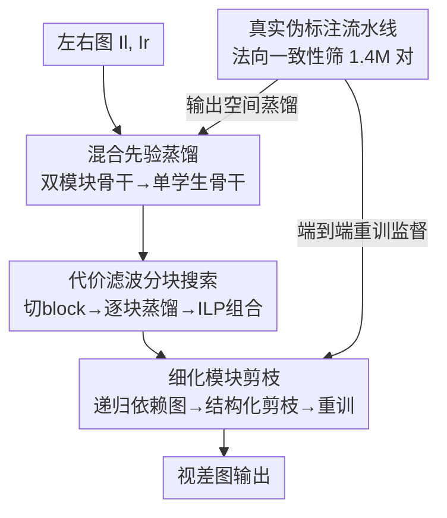

# Fast-FoundationStereo: Real-Time Zero-Shot Stereo Matching

**会议**: CVPR 2026  
**论文**: [CVF Open Access](https://openaccess.thecvf.com/content/CVPR2026/html/Wen_Fast-FoundationStereo_Real-Time_Zero-Shot_Stereo_Matching_CVPR_2026_paper.html)  
**代码**: https://nvlabs.github.io/Fast-FoundationStereo/ （项目页）  
**领域**: 3D视觉  
**关键词**: 立体匹配, 零样本泛化, 知识蒸馏, 神经架构搜索, 结构化剪枝  

## 一句话总结
把强零样本但很慢的 FoundationStereo 用「分而治之」的三招（特征蒸馏 + 代价滤波分块搜索 + 细化模块剪枝）逐一压缩，再配一条自动伪标注流水线喂 1.4M 真实立体图，首次让立体基础模型在实时帧率下保持接近原版的零样本精度，比 FoundationStereo 快 10 倍以上。

## 研究背景与动机
**领域现状**：立体匹配（双目估视差/深度）这几年分裂成两条路。一条是「基础模型路线」（FoundationStereo、MonSter、StereoAnywhere 等），靠 DepthAnythingV2、DINO 这类强单目先验 + Disparity Transformer 做长程自注意力，零样本泛化非常强、不用在目标域微调；另一条是「效率路线」（LightStereo、RT-IGEV、BANet 等），用轻量骨干 + 2D 卷积 + 局部迭代细化跑到实时帧率。

**现有痛点**：两条路各有致命短板。基础模型那条计算量巨大——FoundationStereo 在 3090 上单帧要 ~496ms，根本进不了任何受延迟约束的系统（机器人、AR）。效率那条虽然快（~30ms），但泛化能力差，几乎都要针对每个目标域重新微调；而真实场景里拿到稠密、高质量的 GT 深度极其困难，所以它们没法当作 in-the-wild 的「开箱即用」方案。

**核心矛盾**：零样本鲁棒性与实时速度之间存在尖锐 trade-off。强泛化来自重型架构（ViT 单目先验 + 4D 代价体自注意力），而这些恰恰是速度瓶颈；想快就得砍掉这些容量，砍了又丢泛化。

**本文目标**：在不从头设计、不牺牲鲁棒性的前提下，把一个现成的强基础模型（FoundationStereo）系统性地加速到实时。

**切入角度**：作者注意到 FoundationStereo 由三个性质迥异的阶段组成——特征提取、代价滤波、视差细化。与其用一套通用压缩手段硬砍，不如针对每个阶段的独特结构「对症下药」：特征骨干适合蒸馏、代价滤波适合架构搜索、循环细化模块适合结构化剪枝。

**核心 idea**：「分而治之」地加速基础立体模型——三阶段各用最契合的压缩术（蒸馏 / NAS / 剪枝），再用自动伪标注的 1.4M 真实数据补充输出空间蒸馏，从一个教师模型派生出一族速度-精度可调的实时学生。

## 方法详解

### 整体框架
方法以 FoundationStereo 为教师，它的推理链是「特征提取 → 代价滤波 → 视差细化」三段。作者对这三段分别施加一种压缩手段，把重型教师拆解、压缩、再组装成一族轻量学生，最后用真实伪标注数据端到端重训。具体地：① 特征骨干（DepthAnythingV2 + side-tuning CNN 的混合双模块）被蒸馏进**单个**学生骨干，保留单目 + 立体先验；② 代价滤波网络被切成若干局部 block，每个 block 单独蒸馏出大量候选，再用组合优化在延迟预算下挑最优组合；③ 循环细化模块（ConvGRU）按其递归依赖图做结构化剪枝再重训。三个候选模块可以自由组装成不同速度档位的最终模型。整条流水线之外，还有一条伪标注流水线产出 1.4M 真实立体对，作为输出空间的额外监督。

### 关键设计

**1. 混合单目+立体先验蒸馏：把双模块骨干压成单个学生**

痛点直指特征提取：FoundationStereo 用 DepthAnythingV2（提供大规模互联网学到的单目先验）+ side-tuning CNN（把单目特征适配成双目）的**混合双模块**抽多级金字塔特征 $f^{(i)}_l, f^{(i)}_r \in \mathbb{R}^{C_i \times \frac{H}{i} \times \frac{W}{i}}$（$i \in \{4,8,16,32\}$），强但慢，是首要瓶颈。作者用知识蒸馏把这个双模块直接换成**单个**学生骨干：冻结教师的 DepthAnythingV2 + side-tuning CNN 预测多级特征金字塔 $\bar{f}^{(i)}$，学生用 MSE loss 去匹配（通道不齐时加一层线性投影）。

之所以选蒸馏而非剪枝，是因为蒸馏「与架构无关」，可以直接复用 ImageNet 上成熟的骨干族；而剪枝必须保留那个受 ViT 计算量约束的双模块，且精度一旦下降很难在互联网级数据上恢复。一个细节：虽然特征提取只吃单张图，训练时仍把左右两张都放进同一 batch 以保留统计相似性。通过训练多种容量的学生骨干，就能派生出不同速度-精度档位的模型族。蒸馏后的特征能复现教师的高频边缘和相对深度，并明显提升对半透明表面的鲁棒性。

**2. 代价滤波分块搜索：用逐块蒸馏 + ILP 把组合爆炸降成线性**

代价滤波是第二个瓶颈。代价体 $V_C \in \mathbb{R}^{C \times \frac{D}{4} \times \frac{H}{4} \times \frac{W}{4}}$ 由 group-wise correlation 和 concatenation volume 拼成，教师用「3D hourglass（含 Axial-Planar Conv，沿视差维放大核而不爆显存）+ Disparity Transformer（对 4D 代价体做多头自注意力补长程上下文）」双分支处理。这里直接剪枝几乎无效——$V_C$ 通道本就很小（多在 100 以下），剪了换不来加速反而掉点严重；直接蒸馏又得手工设计滤波模块的替代结构，而这块的设计空间远不如骨干成熟。

于是作者上 NAS，但用一套「分块」策略避开组合爆炸。① **分块构造**：把滤波模块拆成算子块序列 $\Phi_t(V_C) = B_N \circ \cdots \circ B_2 \circ B_1(V_C)$，在 3D hourglass 里按通道（即空间维变化处）切块，每块从 5 类层（3D conv / 3D deconv / APC / 残差 3D conv / 特征引导体激励）里组合，约束是每块运行时间 $t^s_B < t^t_B$ 且输入输出通道与原块一致；整个 Disparity Transformer 视作单个块。② **逐块蒸馏与评估**：候选组合总数 $C = C_1 C_2 \cdots C_N$（当 $N=8, C_i=200$ 时约 $200^8 \approx 10^{18}$），标准进化式 NAS 不可行。作者把每块 $B_i$ 当独立网络单独训练，让它在教师上一块输出 $f_{i-1}$ 上模仿教师对应块：$\|B_i(f_{i-1}) - \bar{B}_i(f_{i-1})\|_2^2$（最后预测初始视差的块用 smooth L1 对 GT 监督）；训练好的候选块 $B^c_i$ 被替换回教师对应层、端到端推理验证集，测出引入它带来的相对误差变化 $\Delta m^c_i$ 和运行时变化 $\Delta t^c_i$。这把训练复杂度从 $O(n^N)$ 降到 $O(n)$，且每块小、可并行。③ **组合搜索**：在延迟预算下求最优块组合，形式化为整数线性规划

$$\min_{\mathcal{E}} \sum_{i=1}^{N} (\Delta \mathbf{m}_i)^\top \mathbf{e}_i, \quad \text{s.t.} \quad \sum_{i=1}^{N} (\Delta \mathbf{t}_i)^\top \mathbf{e}_i \leq \Delta \tau$$

其中 $\mathbf{e}_i$ 是块 $B_i$ 上候选的 one-hot 选择向量，$\Delta\tau$ 是相对教师的运行时预算。用 ILP 在不同 $\tau$ 下求解，就得到一族速度-精度可调的滤波学生。

**3. 细化模块结构化剪枝：按递归依赖图剪 ConvGRU 冗余**

第三个瓶颈是视差细化。给定初始视差 $d_0$ 和上下文网络初始化的隐状态，ConvGRU 在每次迭代消费 $d_{k-1}, h_{k-1}$ 输出 $d_k, h_k$，形成递归依赖；实验显示这里冗余很大，适合用能吃 TensorRT 加速的结构化剪枝。难点在于循环结构的依赖关系——某层剪通道会改变喂给相邻层的特征维。除常规相邻层依赖外，作者针对立体细化模块补了三条剪枝约束：① ConvGRU 内预测视差图和凸上采样 mask 的最后层输出通道固定；② 消费 $h_{k-1}$ 的层输入通道与输出 $h_k$ 的层输出通道相互依赖、需联合剪枝；③ 消费索引体特征的 motion encoder 输入通道固定。

剪谁则用一阶 Taylor 展开估重要性：把输入端到端喂教师做多次细化迭代、累积细化模块的梯度，全局排序后剪掉最不重要的 $\alpha$ 比例参数。剪完冻结其余部分、只重训细化模块恢复精度，损失为

$$\mathcal{L} = \sum_{k=1}^{K} \gamma^{K-k} \| d_k - \bar{d} \|_1 + \lambda \sum_{i=1}^{L} \| x_i - \bar{x}_i \|_2^2$$

第一项是对迭代视差的监督（$\gamma=0.9$ 让越晚的迭代权重越大），第二项是逐层特征蒸馏（学生 $x_i$ 对教师 $\bar{x}_i$，$\lambda=0.1$）；初始视差监督被排除，因为它不受细化模块影响。

**4. 真实数据自动伪标注：法向一致性筛出 1.4M 立体对**

合成数据多样性和真实感都不如真实图，但真实立体图的 GT 度量深度极难获取。作者设计一条自动流水线，在 Stereo4D 的纠正立体对上：教师模型对左图出视差图，同时把左图喂单目深度估计器出深度图，两者都经 3D 反投影 + Sobel 算子（用同一组相机参数）转成法向图；逐像素算两张法向图的余弦相似度并阈值化得到一致性 mask，一致性不足的样本丢弃。天空区域因深度无穷且在合成数据中欠表示，用开放词表分割检出后排除在相似度计算外、最终视差置零。视频按 stride 10 时序抽样，得到 1.4M 立体对。关键洞察：在法向空间而非深度/视差空间做一致性检查，对 in-the-wild 图像里极端多变的深度范围和噪声预测更鲁棒。这批伪标注最终进入学生的端到端训练，构成对前面特征蒸馏的**输出空间蒸馏**补充。

## 实验关键数据

### 主实验
在 4 个公开数据集（Middlebury / ETH3D / KITTI 2012 / KITTI 2015）上做零样本泛化对比，运行时在同一块 3090 上以 Middlebury-Q 分辨率测量。下表节选关键列（数值越低越好）：

| 方法 | 类别 | Midd.-H BP-2 | ETH3D BP-1 | KITTI15 D1 | Runtime(ms) |
|------|------|------|------|------|------|
| FoundationStereo（教师） | 非实时 | 1.10 | 0.50 | 2.80 | 496 |
| MonSter | 非实时 | 4.24 | 0.99 | 3.41 | 336 |
| Zero-RAFT-Stereo | 非实时 | 4.68 | 2.14 | 4.48 | 164 |
| RT-IGEV（同数据训练） | 实时 | 7.82 | 5.05 | 4.00 | 45 |
| LightStereo-L（同数据训练） | 实时 | 12.55 | 16.34 | 4.51 | 30 |
| **Ours** | **实时** | **2.20** | **1.22** | **3.25** | **49 (21)** |

本文在实时组里全面大幅领先，且在每一列都是全表第二（仅次于慢 10 倍的教师）；49ms 是原生运行时，TensorRT 下降到 21ms。相比 FoundationStereo 快 10 倍以上而误差仅小幅增加，甚至优于借多个基础模型合成数据的 Zero-RAFT-Stereo 这类重型模型。

非朗伯（透明/高光）表面鲁棒性在 Booster-Q 上单列评测：

| 方法 | BP-2 | EPE(px) | 实时 |
|------|------|---------|------|
| FoundationStereo | 5.18 | 1.13 | ✗ |
| StereoAnywhere | 9.01 | 1.21 | ✗ |
| RT-IGEV†（同数据） | 18.19 | 4.20 | ✓ |
| **Ours** | **6.61** | **1.54** | ✓ |

本文是唯一在该最难场景下逼近重型模型、又保持实时的方法。

### 消融实验
| 配置 | Midd.-H BP-2 | ETH3D BP-1 | KITTI15 D1 | 说明 |
|------|------|------|------|------|
| 无蒸馏（仅 ImageNet 预训练骨干） | 2.87 | 2.11 | 4.32 | 特征骨干基线 |
| Cosine 相似度蒸馏 | 2.29 | 1.19 | 3.31 | 换蒸馏损失 |
| **MSE 蒸馏（本文）** | **2.20** | **1.22** | **3.25** | 完整骨干蒸馏 |
| 无伪标注 | 2.53 | 1.31 | 3.48 | 去掉真实数据 |
| **+伪标注（本文）** | **2.20** | **1.22** | **3.25** | 加 1.4M 真实对 |

### 关键发现
- **骨干蒸馏**普遍提升零样本泛化，尤其救回了无蒸馏时被透明玻璃门击穿的传统匹配；MSE 略优于 Cosine。
- **分块搜索**优于同延迟下随机组装：随 $\Delta\tau$ 放宽能稳定搜到更好候选，且延迟越紧、随机组装越容易崩，印证紧预算下结构设计的重要性——说明 Eq.(1) 这个「累积局部块扰动」的代理目标确实有效。
- **剪枝**揭示细化模块冗余巨大：激进剪枝虽掉点，但用 Eq.(2) 重训能基本恢复。
- **伪标注**对所有方法一致涨点，对原本只在 SceneFlow 上训过的方法（LightStereo、RT-IGEV）提升尤其大（如 LightStereo-L 在 ETH3D BP-1 从 45.46→21.12）。

## 亮点与洞察
- **「对症下药」的加速哲学**很优雅：不把基础模型当黑盒统一压缩，而是认清特征提取/代价滤波/细化三段的不同结构，分别配蒸馏/NAS/剪枝——这个「先解剖再分治」的思路可迁移到任何多阶段重型基础模型的加速。
- **分块蒸馏把 NAS 从 $O(n^N)$ 降到 $O(n)$** 是最实用的工程贡献：让每块单独模仿教师对应块、用 ILP 在延迟预算下做组合，既绕开 $10^{18}$ 级搜索空间，又能一次搜出一整族速度档位。
- **法向空间做伪标注一致性检查**比直接比深度/视差更聪明：对 in-the-wild 极端深度范围和噪声更鲁棒，还专门处理了天空这种无穷深度的退化区，这套数据清洗 trick 对任何需要真实立体监督的工作都有借鉴价值。
- 整套方法本质是「一个教师 → 一族可调学生」，部署时按硬件预算自由组装三段候选再端到端微调，灵活性远超从头设计的实时模型。

## 局限与展望
- **精度仍有差距**：虽逼近教师，但在每个数据集上都只是「第二好」，相比 FoundationStereo 有稳定的小幅误差上升；对精度极致敏感的场景（高精 3D 重建）未必能直接替代教师。
- **强依赖教师**：整个方法建立在 FoundationStereo 之上，蒸馏/搜索/剪枝都以它为参照，教师本身的失败模式（如某些极端非朗伯场景）会被继承。
- **伪标注流水线本身也重**：它依赖教师模型 + 单目深度 + 开放词表分割 + 法向一致性多步，构建 1.4M 数据成本不低；⚠️ 论文未量化这条流水线的算力开销。
- 作者指出**量化**是正交的进一步加速方向，有望部署到更受限的边缘设备；这条路本文未做。

## 相关工作与启发
- **vs FoundationStereo（教师）**：教师追求极致零样本精度、不计算力（496ms）；本文不改其能力上限，而是把它的三段瓶颈逐一压缩，用 ~10% 的算力换到 ~95% 的精度，把「能不能实时用」从否变成是。
- **vs 效率路线（LightStereo / RT-IGEV / BANet）**：它们从头轻量设计、靠 SceneFlow 训练 + 目标域微调，泛化弱；本文继承基础模型的丰富先验，零样本下大幅反超它们，即便给它们喂同样的伪标注数据也追不上。
- **vs VFM 加速（SlimSAM / Fast-VGGT 等）**：SAM/VGGT 的加速已有大量蒸馏/量化/剪枝/token merging 工作，但立体匹配方向几乎空白；本文填补了「加速立体基础模型」这一空缺，并贡献了立体特有的细化模块递归剪枝约束与代价滤波分块搜索。

## 评分
- 新颖性: ⭐⭐⭐⭐⭐ 首次实现实时帧率下的强零样本立体匹配，分块 NAS + 递归依赖剪枝 + 法向伪标注都是切题的新设计。
- 实验充分度: ⭐⭐⭐⭐⭐ 5 个数据集主对比 + 非朗伯专项 + 蒸馏/搜索/剪枝/伪标注逐项消融 + 运行时分解，覆盖全面。
- 写作质量: ⭐⭐⭐⭐ 「分而治之」主线清晰、图文对应好；个别公式（ILP/剪枝损失）在 CVF 文本里符号略乱，需对照原图理解。
- 价值: ⭐⭐⭐⭐⭐ 直击机器人/AR 等延迟受限场景的真实痛点，且方法范式可迁移到其他重型基础模型加速。

<!-- RELATED:START -->

## 相关论文

- [\[CVPR 2026\] Lite Any Stereo: Efficient Zero-Shot Stereo Matching](lite_any_stereo_efficient_zero-shot_stereo_matching.md)
- [\[CVPR 2026\] What Makes Good Synthetic Training Data for Zero-Shot Stereo Matching?](what_makes_good_synthetic_training_data_for_zero-shot_stereo_matching.md)
- [\[AAAI 2026\] Generalized Geometry Encoding Volume for Real-time Stereo Matching](../../AAAI2026/3d_vision/generalized_geometry_encoding_volume_for_real-time_stereo_matching.md)
- [\[CVPR 2026\] PromptStereo: Zero-Shot Stereo Matching via Structure and Motion Prompts](promptstereo_zero-shot_stereo_matching_via_structure_and_motion_prompts.md)
- [\[CVPR 2025\] FoundationStereo: Zero-Shot Stereo Matching](../../CVPR2025/3d_vision/foundationstereo_zero-shot_stereo_matching.md)

<!-- RELATED:END -->
