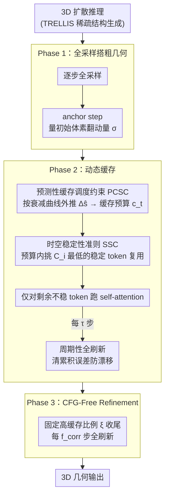

# Fast3Dcache: Training-free 3D Geometry Synthesis Acceleration

**会议**: CVPR 2026  
**arXiv**: [2511.22533](https://arxiv.org/abs/2511.22533)  
**代码**: [https://fast3dcache-agi.github.io](https://fast3dcache-agi.github.io)  
**领域**: 3D视觉  
**关键词**: 3D几何生成加速, 缓存机制, 体素稳定性, 无需训练, 扩散模型

## 一句话总结

本文提出 Fast3Dcache，一个面向 3D 扩散模型的无需训练的几何感知缓存框架，通过预测性缓存调度约束（PCSC）根据体素稳定化模式动态分配缓存预算，以及时空稳定性准则（SSC）基于速度和加速度选择稳定 token 进行复用，实现最高 27.12% 的吞吐提升和 54.83% 的 FLOPs 降低，几何质量仅损失约 2%。

## 研究背景与动机

1. **领域现状**：基于缓存的加速方法在 2D 图像和视频扩散模型中已取得成功，通过复用前序时间步的中间计算减少冗余推理。代表性方法包括各种 feature caching 技术。
2. **现有痛点**：
    - 直接将 2D 缓存策略迁移到 3D 扩散模型会严重破坏几何一致性；
    - 2D/视频中纹理小误差视觉上可忽略，但 3D 中体素/点预测的数值误差直接影响拓扑和空间完整性，产生表面孔洞、几何畸变或非流形网格；
    - 现有 3D 加速方法（如 Hash3D）不适用于扩散框架。
3. **核心矛盾**：2D 缓存利用感知冗余，但 3D 需要严格的几何正确性，小误差累积可导致拓扑灾难。
4. **本文目标**：如何在 3D 扩散推理中安全地缓存和复用计算，在加速的同时保持几何保真度？
5. **切入角度**：分析 TRELLIS 框架中稀疏结构生成阶段的体素占据场演化，发现三阶段稳定化模式（不稳定→对数线性衰减→微调），据此设计自适应缓存策略。
6. **核心 idea**：利用 3D 生成中体素状态变化的可预测衰减模式，动态确定"缓存多少 token"（PCSC）和"缓存哪些 token"（SSC），实现几何感知的加速。

## 方法详解

### 整体框架

Fast3Dcache 要解决的是：3D 扩散推理太慢，但 2D 那套"复用前几步特征"的缓存一搬过来就把几何搞坏。它的做法是先观察 3D 生成自己的节奏——稀疏结构生成阶段的体素占据场会经历"先剧烈翻动、再对数线性衰减、最后几乎不动"三段稳定化过程——再顺着这个节奏决定每一步"缓存多少"和"缓存谁"。

整篇推理被切成三段对应这个节奏。第一段（Phase 1）老老实实全采样，把粗几何搭起来，并在结尾的 anchor step 量一次"现在每步还在翻动多少体素"，作为后面预测的基准。第二段（Phase 2）进入动态缓存：PCSC 根据衰减趋势算出这一步的缓存预算，SSC 在这个预算内挑出最稳的 token 直接复用、只对剩下不稳的 token 跑 self-attention，每隔 $\tau$ 步做一次全刷新把累积误差清掉。第三段（Phase 3，CFG-Free Refinement）几何已基本收敛，直接上固定的高缓存比例 $\xi$ 收尾。

### 关键设计

**1. 预测性缓存调度约束 PCSC：用体素翻动的衰减曲线决定每步缓存多少 token**

2D 缓存普遍用一个固定比例（比如全程缓存 25%），但 3D 几何生成各阶段的稳定性天差地别——早期一刀切多缓存会把还没成形的粗结构压坏，后期少缓存又白白浪费收敛带来的红利。PCSC 把"缓存多少"和体素的实际变化量绑定起来。每一步的体素占据变化量定义为相邻两步占据场的逐格异或之和

$$\Delta s_t = \sum_{i,j,k} \big(\mathcal{O}_{t+1}(i,j,k) \oplus \mathcal{O}_t(i,j,k)\big)$$

它在去噪过程中正好呈三阶段：Phase 1 高波动、Phase 2 对数线性衰减、Phase 3 急剧稳定。于是在 Phase 1 结束的 anchor step（位置 $\lceil T \cdot \rho_a \rceil$）量一次初始变化量 $\sigma$，之后不再逐步实测，而是用一个固定斜率 $\mu$ 把后续的变化量外推出来

$$\Delta\hat{s}_t = \sigma \cdot e^{\mu \cdot (t - \lceil T \cdot \rho_a \rceil)}$$

预测的变化量越小，说明几何越稳、能缓存的越多，于是缓存预算 $c_t = D^3 - \frac{\Delta\hat{s}_t}{\gamma_{\text{up}}}$ 随时间自然增长（$D^3$ 是体素 token 总数）。这种"早期少缓存保护粗结构、后期多缓存吃收敛红利"的自适应分配，比固定比例稳得多：固定比例的 CD 高达 0.0956，PCSC 只有 0.0697。

**2. 时空稳定性准则 SSC：在预算之内挑出真正稳的 token，而不是随便选**

PCSC 只回答了"这一步缓存几个"，但缓存错对象同样会坏几何——把一个正在大幅更新的 token 当成稳定的复用，误差会直接进网格。SSC 给每个 token 算一个可缓存性分数，分数越低越稳、越适合缓存：

$$C_i(t) = \omega \cdot \text{norm}(A_i(t)) + (1-\omega) \cdot \text{norm}(V_i(t))$$

这里速度 $V_i(t) = \|v_i(t)\|_2$ 度量特征本身更新得多猛，加速度 $A_i(t) = \|v_i(t) - v_i(t-1)\|_2$ 度量速度稳不稳定（也就是即时缓存误差 ICE）。两个量缺一不可：只看速度会漏掉"速度大但方向稳"的 token（其实复用误差很小），只看加速度会放过"加速度小但速度大"的 token（它正在持续大幅更新）。把两者按 $\omega=0.7$ 加权后挑出分数最低的一批缓存、剩下的不稳子集才跑 self-attention，消融里这种联合判据明显压过任一单指标。

**3. 三阶段流水线与周期性全刷新：把 PCSC 和 SSC 串成不漂移的端到端流程**

缓存复用本质是用旧算新，误差会一步步累积，3D 里累积到一定程度就是表面孔洞和非流形网格。三阶段流水线的作用是让前两个设计各司其职、又有兜底：Phase 1 全采样并校准 PCSC，Phase 2 跑 PCSC+SSC 动态缓存、每 $\tau$ 步插一次全刷新把累积误差归零，Phase 3 几何已稳就用固定高比例 $\xi$ 缓存、每 $f_{\text{corr}}$ 步全刷新。其中"每 $\tau$ 步全刷新"这一步并非可有可无——把它完全禁用后 CD 劣化到 0.0724、F-Score 跌到 51.8157，正是它在拦住误差漂移。

### 一个完整示例

> 以下数字为示意，用来看清缓存预算如何随步数变化。

设总步数 $T=50$、anchor 比例 $\rho_a$ 把前 10 步划给 Phase 1。前 10 步全采样，到第 10 步（anchor step）量到体素还在翻动 $\sigma$ 个、记下来。进入 Phase 2 后不再实测，直接按 $\Delta\hat{s}_t = \sigma \cdot e^{-0.07\,(t-10)}$ 外推：第 15 步预测翻动量衰减到约 $\sigma \cdot e^{-0.35}\approx0.70\sigma$，第 30 步衰减到约 $0.25\sigma$。翻动越少、预算 $c_t = D^3 - \Delta\hat{s}_t/\gamma_{\text{up}}$ 越大，于是可缓存 token 数从第 15 步的"小半"一路涨到第 30 步的"绝大多数"。每一步 SSC 在当前预算内挑 $C_i$ 最低的那批 token 直接复用、只给剩下的不稳 token 跑注意力；每到第 13、16、19……步（每 $\tau=3$ 步）做一次全刷新，把这几步攒下的复用误差清空。最后十步进入 Phase 3，几何已收敛，直接固定高比例缓存收尾。整条链下来，越往后算得越省，而每隔几步的刷新保证几何不漂。

### 损失函数 / 训练策略

Fast3Dcache 完全无需训练，是纯推理时的加速方法。超参数包括：anchor 比例 $\rho_a$、衰减斜率 $\mu$（默认 -0.07）、刷新间隔 $\tau$、Phase 3 固定缓存比例 $\xi$、加速度权重 $\omega$（默认 0.7）。

## 实验关键数据

### 主实验（TRELLIS 框架 Toys4K 数据集）

| 方法 | 吞吐↑ | FLOPs(T)↓ | CD↓ | F-Score↑ |
|------|-------|-----------|-----|----------|
| TRELLIS vanilla | 0.5055 | 244.2 | 0.0686 | 54.8244 |
| RAS (25%) | 0.6337 (+25.36%) | 125.1 (-48.77%) | 0.0867 (+26.38%) | 40.2769 (-26.53%) |
| RAS (12.5%) | 0.6177 (+22.20%) | 125.8 (-48.48%) | 0.0846 (+23.32%) | 43.9622 (-19.81%) |
| **Fast3Dcache (τ=3)** | 0.5850 (+15.73%) | 142.4 (-41.69%) | **0.0697 (+1.60%)** | **54.0900 (-1.34%)** |
| **Fast3Dcache (τ=5)** | **0.6344 (+25.50%)** | **121.3 (-50.33%)** | 0.0712 (+3.79%) | 53.5003 (-2.42%) |
| **Fast3Dcache (τ=8)** | **0.6426 (+27.12%)** | **110.3 (-54.83%)** | 0.0703 (+2.48%) | 53.7528 (-1.95%) |

### 消融实验（SSC 组件）

| 配置 | CD↓ | F-Score↑ |
|------|-----|----------|
| 无 SSC (标准差筛选) | 0.0743 | 50.9974 |
| 仅速度 $V_i$ | 0.0836 | 44.9630 |
| 仅加速度 $A_i$ | 0.0709 | 53.5394 |
| 联合 $\omega=0.7$ | **0.0697** | **54.0900** |

### 关键发现

- RAS（2D 方法直接迁移到 3D）导致严重几何退化（F-Score 降 27%），验证了"3D 需要几何感知缓存"的核心论点
- $\tau=8$ 时吞吐提升 27.12%、FLOPs 降低 54.83%，CD 仅增 2.48%、F-Score 仅降 1.95%
- 与 TeaCache 结合可达 3.41× 加速，且几何质量优于 TeaCache单独使用（CD 0.0701 vs 0.0705），说明 Fast3Dcache 可与通用加速器互补
- 加速度 $A_i$ 比速度 $V_i$ 作为单独指标更有效（CD 0.0709 vs 0.0836），因为加速度直接度量缓存误差
- PCSC 的斜率 $\mu$ 在 ±10× 范围内都相对稳健（CD 0.0697-0.0707）

## 亮点与洞察

- **3D 几何的三阶段稳定化模式**：这一经验发现（不稳定→对数线性衰减→微调）不仅适用于 TRELLIS，可能是 3D 扩散生成的普遍规律。这为未来所有 3D 扩散加速工作提供了理论基础
- **"缓存预算 + token 选择"分离设计**：PCSC 负责宏观调度、SSC 负责微观选择，职责清晰。这种分层设计可推广到其他需要自适应计算分配的推理加速场景
- **速度+加速度的联合稳定性度量**：单看速度大小或变化率都不够，两者互补。这个洞察类似于物理中同时考虑速度和加速度来判断运动状态

## 局限与展望

- 仅加速了 TRELLIS 的稀疏结构生成阶段，SLat 生成阶段未优化，总体端到端加速可能有限
- 三阶段的边界（$\rho_a$）和参数（$\mu$, $\omega$, $\tau$, $\xi$, $f_{\text{corr}}$）虽不需要训练但需要调参，且可能因任务/数据集变化
- 缓存策略假设体素衰减率 $\mu$ 跨样本一致，对极端几何（如复杂精细结构）可能不成立
- 仅在 TRELLIS 和 DSO 框架验证，对隐式表示（如 Hunyuan3D 的 set-based latent）的适用性未知

## 相关工作与启发

- **vs RAS**: 直接迁移 2D DiT 的缓存方法到 3D，F-Score 暴降 27%。Fast3Dcache 通过几何感知设计将质量损失控制在 2%
- **vs TeaCache**: 通用加速器，与 Fast3Dcache 互补。结合后效果 1+1>2，说明模态感知和模态无关的加速可叠加
- **vs Hash3D**: 探索过 3D 加速但不适用于扩散框架。Fast3Dcache 专为扩散/Flow Matching 设计

## 评分

- 新颖性: ⭐⭐⭐⭐ 三阶段稳定化观察和 PCSC/SSC 设计有新意，但核心思路是缓存方法的 3D 适配
- 实验充分度: ⭐⭐⭐⭐ 消融全面（PCSC/SSC/τ），多框架验证（TRELLIS+DSO），有互补性实验
- 写作质量: ⭐⭐⭐⭐ 动机-观察-设计的逻辑链清晰，可视化图表出色
- 价值: ⭐⭐⭐⭐ 对 3D 生成的推理加速有实用价值，开源易用

<!-- RELATED:START -->

## 相关论文

- [\[CVPR 2025\] Hash3D: Training-free Acceleration for 3D Generation](../../CVPR2025/3d_vision/hash3d_training-free_acceleration_for_3d_generation.md)
- [\[CVPR 2026\] Beyond Geometry: Artistic Disparity Synthesis for Immersive 2D-to-3D](beyond_geometry_artistic_disparity_synthesis_for_immersive_2d-to-3d.md)
- [\[CVPR 2026\] FE2E: From Editor to Dense Geometry Estimator](from_editor_to_dense_geometry_estimator.md)
- [\[CVPR 2026\] PR-IQA: Partial-Reference Image Quality Assessment for Diffusion-Based Novel View Synthesis](pr-iqa_partial-reference_image_quality_assessment_for_diffusion-based_novel_view.md)
- [\[CVPR 2026\] E-RayZer: Self-supervised 3D Reconstruction as Spatial Visual Pre-training](e-rayzer_self-supervised_3d_reconstruction_as_spatial_visual_pre-training.md)

<!-- RELATED:END -->
