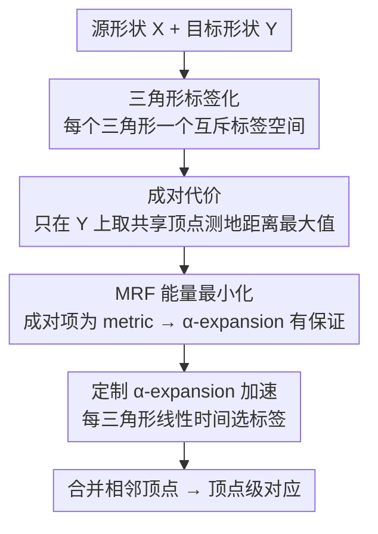

# Fast Markov Random Field Optimisation for Topologically Noisy 3D Shape Matching

**会议**: CVPR 2026  
**论文**: [CVF Open Access](https://openaccess.thecvf.com/content/CVPR2026/html/Roetzer_Fast_Markov_Random_Field_Optimisation_for_Topologically_Noisy_3D_Shape_CVPR_2026_paper.html)  
**代码**: https://github.com/paul0noah/sm-mrf  
**领域**: 3D视觉  
**关键词**: 非刚性形状匹配, 马尔可夫随机场, α-expansion, 拓扑噪声, 组合优化  

## 一句话总结
把非刚性 3D 形状匹配重新写成一个三角形多标签 MRF 问题，用一个只在目标形状上度量测地距离的成对代价（pseudometric）保证邻域平滑，再用一个为本文标签空间定制的 α-expansion 变体在线性时间内求解，从而在拓扑噪声（亏格变化）场景下同时做到准、稳、快。

## 研究背景与动机
**领域现状**：3D 形状匹配的目标是在两个曲面网格之间建立逐点对应。近年主流做法靠「邻域保持」拿高质量结果——要么用 functional maps 在低维函数空间近似点对应，要么用组合优化（最短路 SpiderMatch/GeCo、图匹配）显式约束相邻曲面元在匹配后仍相邻。这些方法依赖测地距离或 Laplace-Beltrami 特征函数这类**全局内蕴量**。

**现有痛点**：真实世界里物体会动，人体两只手一碰，形状的亏格 $g$ 就从 0 变成 1，可几何外观几乎没变——作者把这种「亏格变化」叫做**拓扑噪声（topological noise）**。拓扑噪声对全局量是毁灭性的：原本左右手上两点测地距离很远，手一碰就突然变近。于是依赖测地一致或 functional maps 的方法要么直接不可用（输入亏格不同就违反约束），要么精度大幅退化。Tab.1 里现有方法很难同时满足「邻域关系 + 抗拓扑噪声 + 高效 + 准确」四项。

**核心矛盾**：邻域保持（要高质量必须有）和抗拓扑噪声（要鲁棒必须有）天然冲突——前者建立在「两形状的内蕴度量可比」这一假设上，而拓扑噪声恰恰破坏了这个假设。再加上一般多标签 MRF 是 NP-hard 的，「既要表达邻域约束、又要能高效求解」是第三重矛盾。

**本文目标**：设计一个纯内蕴、可扩展、对亏格变化鲁棒的组合匹配框架，并且要能高效且带近似保证地求解。

**切入角度**：作者注意到 α-expansion 算法在成对代价是 metric 时有近似因子保证。如果能把形状匹配凑成一个「成对项是 metric」的多标签 MRF，就能借力这套成熟算法。关键观察是：邻域代价**只在目标形状一侧度量距离**就够了——不要求两形状距离相等（那才是对拓扑噪声敏感的根源），只要求源上相邻的三角形匹配到目标上彼此靠近的曲面元。

**核心 idea**：以三角形（而非顶点/边）为匹配单元，给每个三角形一个**互不相交**的标签空间，定义一个「只算目标形状测地距离、取两共享顶点距离最大值」的成对 pseudometric 代价，把匹配写成多标签 MRF，再用为该标签空间定制的 α-expansion 在线性时间求解。

## 方法详解

### 整体框架
给定源形状 $X$ 和经过非刚性形变的目标形状 $Y$，要找一个匹配 $\phi: V_X \to V_Y$。本文不直接在顶点上做文章，而是**以三角形为单位**：给源形状每个三角形 $f \in F_X$ 分配一个标签，标签编码「这个三角形的三个顶点分别匹配到目标形状上哪三个顶点（即一个曲面元）」。目标是让源上相邻的两个三角形，其**共享顶点**在目标上的匹配点测地距离尽量小——这样邻域结构就被保住了，而且因为只在目标侧度量距离，亏格变化不会直接污染代价。整条链路是：先建三角形邻域图，再为每个三角形造一个互斥标签空间，在相邻三角形对上定义成对代价，凑成 MRF 能量，最后用定制 α-expansion 求解并合并出顶点级对应。

### 关键设计

**1. 三角形标签化：用互斥标签空间把匹配编码成多标签问题**

痛点是：若以顶点或边为单位定义邻域代价，会出现「相邻元塌缩成同一个点（代价低）」或「强制两形状距离相等（对噪声敏感）」两种退化。本文改用三角形作匹配单元，并给每个三角形 $f=(x_1,x_2,x_3)$ 定义自己的标签空间

$$\mathcal{L}_f := \left\{ \left(\tbinom{x_1}{y_1},\tbinom{x_2}{y_2},\tbinom{x_3}{y_3}\right) \mid \forall y_1,y_2,y_3 \in V_Y \right\}.$$

每个标签是一个三元组，把源三角形的三个顶点分别映到目标的三个顶点（即把 $f$ 匹配到 $Y$ 上某个曲面元）。因为标签里**显式包含了源顶点** $x_1,x_2,x_3$，不同三角形的标签空间天然不相交：$\mathcal{L}_f \cap \mathcal{L}_{\bar f} = \emptyset\ (f \neq \bar f)$。这个互斥性是后面加速的前提。实际中作者把目标三元组限制成三类——同一个点、一条边（两顶点重合）、或彼此最多 $k$ 条边以内的三顶点——以适配两形状不同的离散化以及收缩/拉伸。全部三角形标签空间并起来记为 $\mathcal{L} = \mathcal{L}_1 \cup \cdots \cup \mathcal{L}_{|F_X|}$。用三角形而非顶点/边的好处是能表达「曲面元相邻」这种结构属性，且不引入几何不一致。

**2. 成对代价：只在目标形状上度量、取共享顶点测地距离的最大值**

这是全文最关键、也是抗拓扑噪声的核心。两个相邻三角形（在 $X$ 上共享恰好两个顶点）匹配过去后，应当在 $Y$ 上仍然彼此靠近。作者用投影 $\pi_{f\bar f}, \pi_{\bar f f}: \mathcal{L} \to V_Y$ 把标签解码成「两个共享顶点各自在 $Y$ 上的匹配点」，然后定义成对代价为

$$V_{f\bar f}(\ell_1,\ell_2) := \max\left\{ d_Y\!\big(\pi_{f\bar f}(\ell_1),\pi_{f\bar f}(\ell_2)\big),\ d_Y\!\big(\pi_{\bar f f}(\ell_1),\pi_{\bar f f}(\ell_2)\big)\right\},$$

其中 $d_Y$ 是**目标形状上**两顶点的测地距离。妙处在于：代价只读 $Y$ 侧距离、完全不要求 $X$ 与 $Y$ 的距离可比或相等——这正好绕开了拓扑噪声（它破坏的是源/目标距离的可比性）。当源上相邻三角形被匹配到目标上相邻曲面元时，代价为零；只有匹配「撕裂」邻域时才受罚。这与最接近的 KernelMatch 的区别在于：本文是**非对称**的（只在目标侧算距离），因此对亏格变化更不敏感。为进一步抗噪，作者还对成对项套一个保持 pseudometric 性质的凹函数 $\Phi(a)= a\ (a<10b);\ 10+0.0001a\ (\text{否则})$，其中 $b$ 为目标最小边长，相当于给大距离封顶，避免拓扑捷径带来的超大测地值主导优化。

**3. MRF 能量最小化：成对项是 metric，换来 α-expansion 的近似保证**

把上面拼起来，3D 形状匹配就成了一个多标签 MRF 能量最小化：

$$\min \sum_{f\in F_X} D_f(\ell_f) + \lambda \sum_{(f,\bar f)\in A_X} V_{f\bar f}(\ell_f,\ell_{\bar f}) \quad \text{s.t. } \forall f: \ell_f \in \mathcal{L}_f,$$

其中 $D_f$ 是一元项（用特征差衡量把标签 $\ell_f$ 给三角形 $f$ 的代价），$\lambda>0$ 权衡两项。一般多标签 MRF 是 NP-hard，但作者证明（Lemma 6）每个 $V_{f\bar f}$ 是标签集上的 **pseudometric**——因为测地距离是 metric、两个 pseudometric 取 max 还是 pseudometric。加上一个 Potts 项 $\tau$ 即可转成严格 metric，从而落入 α-expansion 适用的「metric MRF」类，得到近似因子 $C = 2 + 2\max V_{f\bar f}$ 的保证（解距全局最优不超过该因子）。实际中由于标签空间互斥、永远不会给相邻三角形同一标签，连 $\tau$ 都不必显式加。匹配不强制双射（多个源顶点可映到同一目标顶点），这也增加了对离散化差异的容忍。

**4. 定制 α-expansion 加速：利用标签互斥性把每步降到线性时间**

标准 α-expansion 每次扩张移动都要解一个 graph cut，开销大。本文标签空间的特殊结构是「每个标签只能分给唯一一个三角形」（互斥性），作者据此把每次迭代简化成：对每个三角形 $f$，按当前其它三角形的标签算出一元 + 成对代价，**直接为它挑当前最优标签**——这一步是线性时间的，完全不用解 graph cut。于是定制版比通用 α-expansion 更快更可扩展（Fig.5 显示在 2 万三角形量级仍明显快于通用 α-expansion），同时保留了近似保证。

### 损失函数 / 训练策略
本方法**不训练**，是纯优化框架。一元项 $D_f(\ell_f)=\sum_{i=1}^3 \Psi(f_{x_i}-f_{y_i})$，特征 $f_{x_i},f_{y_i}$ 取自 ULRSSM 的逐顶点特征，$\Psi$ 是 Barron 鲁棒损失（$\alpha=-1.0, c=0.1$）。超参：成对权 $\lambda=100$、标签采样邻域 $k=2$ 且要求匹配三角形保持法向朝向。最终从三角形标签合并相邻顶点映射、抽出顶点到顶点对应。定量评测前把形状清理并降采样到至多 1k 三角形。

## 实验关键数据

### 主实验
评测指标为测地误差（按 Princeton 协议用形状直径归一化）和度量匹配平滑度的 Dirichlet 能量。数据集分两类：干净集 FAUST / SMAL / DT4D，含拓扑噪声集 SCAPET / TOPKIDS / 作者自建的 TOPFAUST（用 Poisson 重建给 FAUST 注入亏格变化，95 对）。论文以「测地误差 vs 运行时间」的 Pareto 前沿呈现结果（Fig.6），核心结论如下表。

| 设置 | 数据集 | 本文表现 | 对比 |
|------|--------|----------|------|
| 干净数据 | FAUST / SMAL / DT4D | 始终落在「精度-时间」Pareto 前沿，对应平滑无伪影 | 邻域保持类方法（SpiderMatch/GeCo/SuPaMatch）精度相近但更慢；KernelMatch 最快但精度差 |
| 拓扑噪声 | SCAPET / TOPKIDS / TOPFAUST | **整体测地误差最低** | 所有方法在噪声下都退化（TOPFAUST 最明显），但本文退化最小 |
| 运行时 | FAUST 五种分辨率 | 定制 α-exp. 明显快于通用 α-expansion，可扩展性最好 | 仅 KernelMatch 比它快，但 KernelMatch 匹配质量不行 |

### 消融实验
原文未给传统「逐模块开关」消融表，而是用「能力对照表」（Tab.1）和成对代价的定性归因来支撑各设计的必要性。

| 配置 / 对照 | 关键观察 | 说明 |
|------------|----------|------|
| 含成对代价（Full） | 对应平滑、无伪影 | 平滑性「很可能归因于成对代价项」（原文 likely attributable） |
| 邻域保持类（SpiderMatch/GeCo/SuPaMatch） | 拓扑噪声下直接被排除评测 | 显式几何一致约束被拓扑噪声违反，不可用 |
| KernelMatch（最接近的对手） | 在拓扑场景有伪影、精度低于本文 | 它用热核近似、对称度量；本文非对称只算 $Y$ 侧距离更稳 |
| 定制 α-exp. vs 通用 α-exp. | 前者更快更可扩展 | 利用标签互斥性免 graph cut |

### 关键发现
- **成对代价是平滑性的主要来源**：去掉它（或换成对称的热核度量，如 KernelMatch）会出现伪影；只在目标侧度量距离是抗拓扑噪声的关键。
- **三角形 + 互斥标签空间一举两得**：既让邻域约束可表达，又让 α-expansion 能降到线性时间，二者来自同一个设计选择。
- **拓扑噪声下全员退化但本文退化最小**，TOPFAUST 最难；干净数据上本文在 Pareto 前沿，说明抗噪没有牺牲常规精度。
- ⚠️ Fig.7 最后一列展示了本文的一个失败案例，说明对极端拓扑捷径仍非万能。

## 亮点与洞察
- **「只在目标形状一侧度量距离」是四两拨千斤的设计**：拓扑噪声的本质是破坏源/目标内蕴量的可比性，那就干脆不比——只要求源上相邻者在目标上靠近。一句非对称化就避开了整类方法的死穴。
- **设计的双重红利**：互斥三角形标签空间既是建模选择（表达曲面元相邻），又直接解锁了「每步线性时间」的加速。好的结构设计往往同时改善表达力和可解性。
- **在深度学习时代为传统优化正名**：方法不训练、带近似因子保证，却在拓扑噪声上打过无监督深度法 ULRSSM。展示了 metric MRF + α-expansion 这套老工具在视觉计算里的持续价值。
- **可迁移 trick**：「把任务凑成成对项是 metric 的多标签 MRF，再借 α-expansion 的近似保证」这套路子，可迁移到其它需要邻域平滑、又怕全局量不可比的对应/标注问题（如带噪声的配准、分割）。

## 局限与展望
- **作者承认**：无法把 SM-MRF 求到全局最优，也无法判定某个解是否已是全局最优，只能给近似因子；α-expansion 还可更快（如 GPU 变体）。
- **依赖外部特征**：一元项的特征来自 ULRSSM，匹配质量受该特征上限制约；本质上仍需一个像样的初始特征。
- **失败案例存在**：Fig.7 显示对极端拓扑捷径仍可能匹配错。
- **评测规模偏小**：定量时把形状降采样到 ≤1k 三角形，更高分辨率下的精度/时间表现需进一步验证。
- **改进思路**：把近似因子 $C$ 随目标形状最大测地距离增长的问题，通过更强的封顶/凹函数或层次化标签空间缓解；或引入更鲁棒的内蕴特征替代 ULRSSM 特征以提升一元项质量。

## 相关工作与启发
- **vs KernelMatch [83]**：二者都想让距离保持对拓扑更鲁棒。KernelMatch 用热核（更局部、更少依赖等距）做**对称**相似度；本文用**非对称**成对代价（只算目标侧测地距离），对亏格变化更不敏感，质量更高（但 KernelMatch 更快）。
- **vs functional maps 系（含 ULRSSM/DiscrOpt）**：functional maps 依赖 Laplace-Beltrami 特征函数，拓扑改变后特征函数严重不一致而失效；本文是纯组合、纯内蕴的离散优化，不走谱方法这条路，且把 ULRSSM 特征仅当作一元项输入而非全部。
- **vs SpiderMatch/GeCo/SuPaMatch（最短路系）**：它们显式强制邻域几何一致，干净数据上质量高，但拓扑噪声直接违反其约束、在该场景被排除评测；本文用「软」的成对代价容忍亏格变化。
- **vs 经典 MRF 形状/体匹配 [11]**：本文受 [11] 启发把匹配写成带 metric 成对项的多标签 MRF，但创新在三角形互斥标签空间 + 非对称目标侧代价 + 定制线性时间 α-expansion。

## 评分
- 新颖性: ⭐⭐⭐⭐⭐ 「只在目标侧度量 + 三角形互斥标签空间 + 定制 α-expansion」是干净而有效的组合创新，直击拓扑噪声痛点。
- 实验充分度: ⭐⭐⭐⭐ 覆盖干净/拓扑两类共 6 个数据集且自建 TOPFAUST，但缺逐设计开关消融、评测分辨率偏低。
- 写作质量: ⭐⭐⭐⭐⭐ 定义、引理、近似保证层层铺陈，动机与设计对应清晰。
- 价值: ⭐⭐⭐⭐⭐ 在学习方法主导的当下，证明带保证的传统优化在拓扑噪声匹配上仍领先，代码开源，实用价值高。

<!-- RELATED:START -->

## 相关论文

- [\[CVPR 2026\] Fast-FoundationStereo: Real-Time Zero-Shot Stereo Matching](fast-foundationstereo_real-time_zero-shot_stereo_matching.md)
- [\[CVPR 2026\] Fast SceneScript: Fast and Accurate Language-Based 3D Scene Understanding via Multi-Token Prediction](fast_scenescript_fast_and_accurate_language-based_3d_scene_understanding_via_mul.md)
- [\[CVPR 2025\] PrEditor3D: Fast and Precise 3D Shape Editing](../../CVPR2025/3d_vision/preditor3d_fast_and_precise_3d_shape_editing.md)
- [\[CVPR 2026\] Neural Dynamic GI: Random-Access Neural Compression for Temporal Lightmaps in Dynamic Lighting Environments](neural_dynamic_gi_random-access_neural_compression_for_temporal_lightmaps_in_dyn.md)
- [\[CVPR 2026\] UniPixie: Unified and Probabilistic 3D Physics Learning via Flow Matching](unipixie_unified_and_probabilistic_3d_physics_learning_via_flow_matching.md)

<!-- RELATED:END -->
