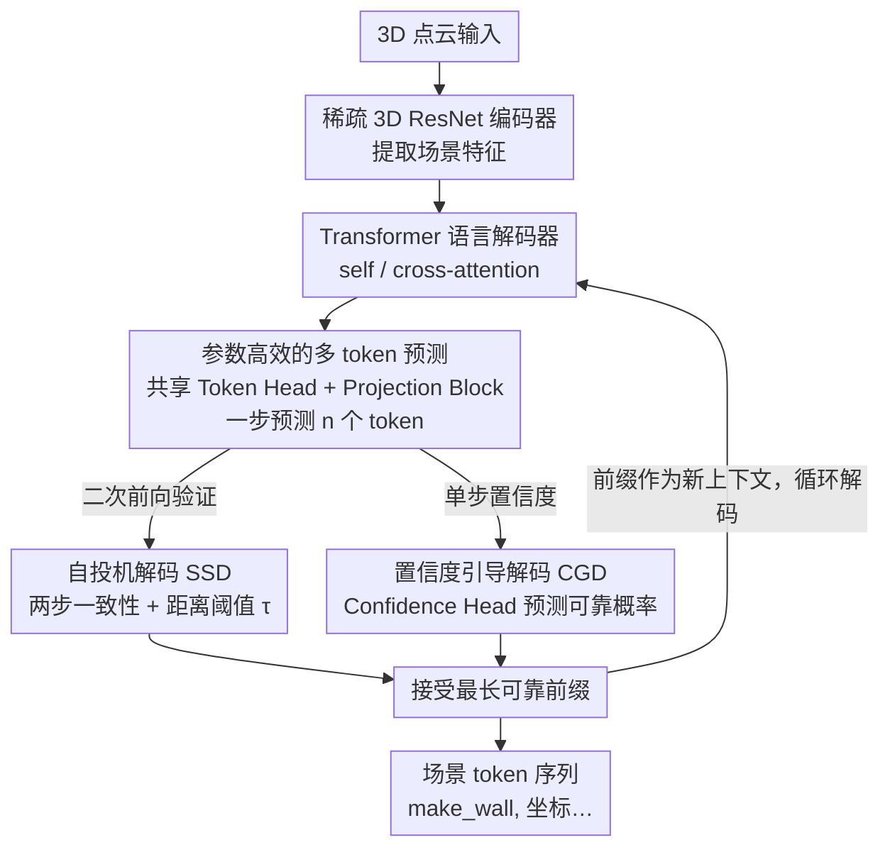

# Fast SceneScript: Fast and Accurate Language-Based 3D Scene Understanding via Multi-Token Prediction

**会议**: CVPR 2026  
**arXiv**: [2512.05597](https://arxiv.org/abs/2512.05597)  
**代码**: 无  
**领域**: 3D视觉  
**关键词**: 3D场景理解, 多token预测, 结构化语言模型, 推理加速, 自投机解码

## 一句话总结

本文提出 Fast SceneScript，通过将多 token 预测（MTP）引入结构化语言模型实现 3D 场景理解的推理加速，配合自投机解码（SSD）和置信度引导解码（CGD）过滤不可靠 token，以及参数高效的头共享机制，在布局估计和目标检测上分别实现 5.09× 和 5.14× 加速且不损失精度。

## 研究背景与动机

1. **领域现状**：SceneScript 等基于结构化语言模型的 3D 感知方法，通过将 3D 场景表示为 token 序列（如 `[make_wall, x1, y1, z1, x2, y2, z2, height, thickness]`），使单一模型架构能处理布局估计、3D 目标检测和粗粒度重建等多种任务。
2. **现有痛点**：
    - 自回归逐 token 预测（NTP）推理慢，序列越长延迟越高（如 Structured3D 上需 1176ms）；
    - 直接应用 MTP 虽减少推理步数但精度严重下降（8 头时 F1-Score 从 0.913 降到 0.840）；
    - MTP 额外引入 $(n-1)$ 个 token 头，参数量大幅增加（14M→23.67M）。
3. **核心矛盾**：MTP 加速与 token 预测精度之间的权衡，以及额外参数开销。
4. **本文目标**：如何在保持精度的前提下实现结构化语言模型的多倍推理加速，且参数增量最小？
5. **切入角度**：结构化语言（vs 自然语言）具有更强的确定性和弱耦合性，使 MTP 更可行；关键是设计可靠的 token 过滤策略来剔除不准确的预测。
6. **核心 idea**：用 MTP 预测多个 token 然后通过 SSD/CGD 过滤不可靠 token，只保留最长可靠前缀，实现"预测多、接受靠谱的"加速范式。

## 方法详解

### 整体框架

Fast SceneScript 要解决的是结构化语言模型做 3D 感知时「逐 token 解码太慢」的问题，但又不能像直接套 MTP 那样以掉精度为代价。它的整条流水线保持了 SceneScript 的骨架：输入 3D 点云先过稀疏 3D ResNet 编码成特征，再喂给一个带 self-attention / cross-attention 的 Transformer 语言解码器，由它逐步吐出描述场景的 token 序列（如 `[make_wall, x1, y1, z1, ...]`）。

不同之处在于解码这一步。原来每步只产出 1 个 token，现在解码器在同一步里**一次预测 $n$ 个未来 token**（外加 $n-1$ 个置信度），随后进入一个 token 过滤阶段——把这一批预测里不靠谱的剔掉，只接受从头数起最长的那段可靠前缀，再以它为新的上下文进入下一步。这样把「预测多、但只接受靠谱的」做成了加速的核心范式：理论步数从 $N$ 降到 $\lceil N/n \rceil$，而过滤保证了接受下来的 token 仍然准确。

### 关键设计

**1. 参数高效的多 token 预测：让 MTP 加速但不为额外 token head 付出线性参数代价**

要一步预测 $n$ 个 token，最直接的做法是给每个位置配一个独立的 token head，但这样参数随 $n$ 线性膨胀——MTP-8 直接把参数从 14M 推到 23.67M。Fast SceneScript 的做法是让所有 $n$ 个位置**共享同一个 Token Head**，区分性交给一个轻量的 Projection Block 来制造：它由 2 个 FFN block（每个含 2 层线性 + ReLU + LayerNorm）组成，把语言解码器给出的隐状态 $f_{k+1}$ 映射成 $n-1$ 个不同的隐状态 $f_{k+i}$，再统一过同一个 head 解码。这之所以成立，是因为语言模型的隐状态本就处在一个共享的语义空间里，不同位置的状态彼此有别但可以被同一个解码头读懂，类似 Transformer FFN 那样的结构已足够拉开区分度。结果是 $n=8$ 时参数只增加约 7.5%（15.05M），而朴素 MTP-8 要多 69%。

**2. 自投机解码（SSD）：用两步一致性把不可靠 token 过滤掉**

预测得多就难免有错，SSD 负责在不掉精度的前提下把错的挑出来。它分两步：第一步用 $n$ 个 MTP head 一口气给出候选 $\{t_{k+1}, \dots, t_{k+n}\}$；第二步把这批候选当成已确定的前序输入，只用最可靠的第一个 head 逐位重新预测出 $\{\tilde{t}_{k+2}, \dots, \tilde{t}_{k+n}\}$。两步逐位比对，从头取一致的最长前缀作为本步真正接受的输出。关键的一笔是：结构化语言里的数值 token（坐标、高度）允许小误差，所以一致性不是严格相等，而是带距离阈值

$$|t_{k+i} - \tilde{t}_{k+i}| \leq \tau$$

只要落在 $\tau$ 内就算通过。比起自然语言投机解码那种逐 token 精确匹配，这个距离度量更贴合几何 token 的性质，每步能因此多接受约 1 个 token。

**3. 置信度引导解码（CGD）：把验证折进同一步，省掉 SSD 的二次前向**

SSD 准确但要多跑一次前向验证，CGD 是它的单步替代方案。它给每个额外 head 配一个 Confidence Head，在同一步内直接预测「该 token 会与第一个 head 的结果一致」的概率 $c_{k+i}$，推理时只要 $c_{k+i} < \epsilon$ 就判为不可靠、就地丢弃，无需再跑第二遍。这个置信度在训练时用 BCE 监督：若 $|t_{k+i} - \tilde{t}_{k+i}| \leq \tau$ 则目标标签 $\hat{c}_{k+i}=1$，否则为 0。代价是要额外训练这组 Confidence Head，换来的是把「预测 + 验证」压进一步、解码更优雅。

### 一个完整示例

设 $n=8$，解码器在某一步要续写一条墙指令 `[make_wall, x1, y1, z1, x2, y2, z2, height]`。MTP head 一次给出 8 个候选 token。SSD 随后用第一个 head 复算：前 7 个 token 的复算值都落在距离阈值 $\tau$ 内（坐标差几厘米、类别完全一致），第 8 个 token（thickness）复算值偏出 $\tau$。于是这一步接受最长可靠前缀——前 7 个 token，第 8 个连同其后全部回退到下一步重算。整段序列就这样「预测 8、接受 7」地推进，这也正对应主实验里 $\alpha=7.45$（n=8）、$\alpha=8.97$（n=10）的平均每步接受数。

### 损失函数 / 训练策略

总损失是 MTP 主损失加上置信度损失：$\mathcal{L} = \mathcal{L}_{\text{MTP}} + \lambda_c \mathcal{L}_c$。其中 MTP 损失对越远的 token 给越低的权重（衰减因子 $\lambda_h$）：

$$\mathcal{L}_{\text{MTP}} = -\sum_k \sum_i \lambda_h^{i-1} \log p(t_{k+i}\mid t_{\leq k})$$

置信度损失同样按距离加权，用 BCE 监督每个额外 head 的可靠性预测：

$$\mathcal{L}_c = -\sum_{i,k} \lambda_h^{i-1} \big(\hat{c}_{k+i} \log c_{k+i} + (1-\hat{c}_{k+i}) \log(1-c_{k+i})\big)$$

## 实验关键数据

### 主实验（ASE 数据集布局估计）

| 方法 | n | 参数量 | 延迟 | α(接受token/步) | F1-Score (test) |
|------|---|--------|------|------|------|
| SceneScript | 1 | 14.00M | 382ms | 1 | 0.915 |
| SceneScript+MTP | 4 | 18.14M | 109ms | 4 | 0.889 |
| SceneScript+MTP | 8 | 23.67M | 62ms | 8 | 0.842 |
| SceneScript+MTP | 10 | 26.43M | 54ms | 10 | 0.814 |
| **Fast SceneScript (SSD)** | **8** | **15.05M** | **81ms** | **7.45** | **0.913** |
| **Fast SceneScript (CGD)** | **8** | **16.10M** | **92ms** | **6.30** | **0.913** |
| **Fast SceneScript (SSD)** | **10** | **15.05M** | **75ms** | **8.97** | **0.912** |

### 跨数据集对比（Structured3D 布局估计）

| 方法 | 延迟 | F1-Score |
|------|------|----------|
| RoomFormer | 54ms | 0.702 |
| SceneScript | 1176ms | 0.774 |
| Fast SceneScript (SSD, n=8) | 230ms | 0.791 |
| Fast SceneScript (CGD, n=8) | 269ms | 0.795 |

### 关键发现

- SSD 比 CGD 接受更多 token（7.45 vs 6.30），延迟更低，但 CGD 无需额外验证步
- 参数高效机制极大减少参数：n=8 时从 23.67M 降到 15.05M（-36%），仅比原始 SceneScript 增加 7.5%
- n=10 时 MTP 精度严重退化（F1 降到 0.814），但 Fast SceneScript 仍保持 0.912
- 数值 token 的距离阈值 $\tau$ 显著提升接受率：引入距离度量后 SSD 每步多接受约 1 个 token
- 在 SceneCAD 上同时验证了布局估计和目标检测，均实现 5× 加速且精度提升

## 亮点与洞察

- **结构化语言的确定性是 MTP 的天然优势**："make_wall" 后面必然是坐标序列，这种强结构约束使得多 token 预测比自然语言更可行。这一洞察可推广到所有结构化输出任务（如代码生成、SQL查询）
- **"预测多+过滤"范式**：不追求每个 token 都准确，而是大胆预测后过滤不可靠的。SSD 和 CGD 各有优劣，SSD 更快但需额外验证步，CGD 更优雅但需训练置信度头
- **参数共享策略**：利用语言模型隐空间的共享语义性质，用一个轻量 Projection Block 取代 $n-1$ 个独立 head，减少 43% 参数且不损精度

## 局限与展望

- SSD 需要额外一次前向传播进行验证，实际加速略低于理论上限
- CGD 的置信度阈值 $\epsilon$ 需要手动调参，对不同数据集可能需要不同值
- 当前仅在 3D 场景理解任务验证，未探索在 2D 感知（如目标检测）中的效果
- Token 过滤时只考虑最长可靠前缀，如果中间一个 token 不可靠则后续全部被丢弃，可能过于保守

## 相关工作与启发

- **vs SceneScript**: 直接的前身工作，Fast SceneScript 保持其架构和接口不变，仅加速推理
- **vs Medusa/DeepSeek-V3**: 自然语言 MTP 方法，本文首次将 MTP 应用于结构化感知语言模型，并发现需要距离度量而非精确匹配
- **vs RoomFormer**: 传统检测式方法延迟更低（54ms vs 230ms），但 F1 更低（0.702 vs 0.791），且不如语言模型方法灵活

## 评分

- 新颖性: ⭐⭐⭐⭐ 首次将 MTP 引入结构化感知语言模型，CGD 和参数共享设计有新意
- 实验充分度: ⭐⭐⭐⭐⭐ 三个数据集、两种任务、详细消融
- 写作质量: ⭐⭐⭐⭐ 方法论述清晰，表格设计直观
- 价值: ⭐⭐⭐⭐ 5× 推理加速对实时 3D 感知系统有重要工程价值

<!-- RELATED:START -->

## 相关论文

- [\[CVPR 2026\] LightSplat: Fast and Memory-Efficient Open-Vocabulary 3D Scene Understanding in Five Seconds](lightsplat_fast_and_memory-efficient_open-vocabulary_3d_scene_understanding_in_f.md)
- [\[CVPR 2026\] Masking Matters: Unlocking the Spatial Reasoning Capabilities of LLMs for 3D Scene-Language Understanding](masking_matters_unlocking_the_spatial_reasoning_capabilities_of_llms_for_3d_scen.md)
- [\[CVPR 2026\] Geometry-Guided 3D Visual Token Pruning for Video-Language Models](geometry-guided_3d_visual_token_pruning_for_video-language_models.md)
- [\[CVPR 2026\] RAP: Fast Feedforward Rendering-Free Attribute-Guided Primitive Importance Score Prediction for Efficient 3D Gaussian Splatting Processing](rap_fast_feedforward_rendering-free_attribute-guided_primitive_importance_score_.md)
- [\[CVPR 2026\] Lifting Unlabeled Internet-level Data for 3D Scene Understanding](lifting_unlabeled_internet-level_data_for_3d_scene_understanding.md)

<!-- RELATED:END -->
