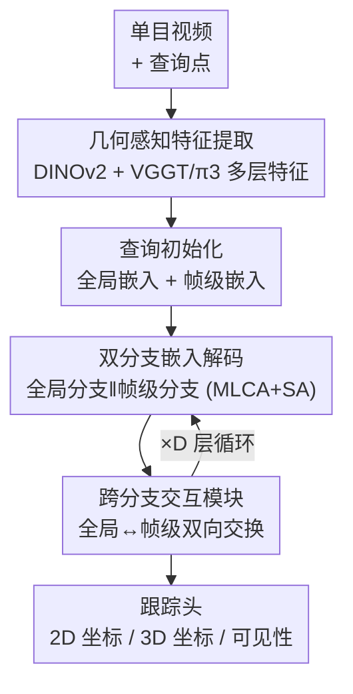

# Fast Spatial Tracking with Visual Geometry Transformer

**会议**: CVPR 2026  
**论文**: [CVF Open Access](https://openaccess.thecvf.com/content/CVPR2026/html/Huang_Fast_Spatial_Tracking_with_Visual_Geometry_Transformer_CVPR_2026_paper.html)  
**代码**: 未公开  
**领域**: 3D视觉  
**关键词**: 3D点跟踪, 视觉几何Transformer, 双分支解码, 单目视频, 实时跟踪

## 一句话总结
本文用一个前馈的视觉几何 Transformer 直接从单目视频预测任意查询点的 2D/3D 轨迹，靠"全局分支 + 帧级分支 + 双向交互"的双分支设计取代了传统 3D 跟踪对稠密深度估计和场景重建的依赖，做到 28 ms/帧的实时速度同时在 TAPVid-3D 上拿到 19.0 AJ / 28.9 ADP 的 SOTA。

## 研究背景与动机

**领域现状**：3D 点跟踪（spatial tracking）要在单目视频里恢复任意查询点的三维轨迹，比 2D 跟踪难在它必须同时对几何与相机运动做一致推理。当前 SOTA（SpatialTracker、TAPIP3D、SpatialTrackerV2）几乎都走"先估深度/位姿、再把图像特征 lift 到 3D、最后做迭代优化或点云对齐"的路线。

**现有痛点**：这条路线有两个硬伤。其一，跟踪精度被预训练深度模型的质量死死绑住——SpatialTracker 把深度从 UniDepthV2 换成 MegaSaM，跟踪精度相对提升 23.8%，意味着深度一旦出错下游无法纠正。其二，稠密深度估计本身极慢：前馈深度方法要毫秒级/帧，而 MegaSaM、ViPE 这类重建式优化要秒级/帧（150 帧序列上 MegaSaM 每帧深度 >1 秒），把"实时跟踪"直接堵死。此外这些方法还塞了大量跟踪专用归纳偏置（显式 cost volume、迭代 refine、专用 transformer），限制了向大规模真实数据的扩展。

**核心矛盾**：精度依赖深度质量 vs. 高质量深度极其昂贵——3D 跟踪被"必须先有深度"这个前提卡住，既慢又脆。

**本文目标**：去掉独立深度模型这一中间环节，让模型直接从单目视频前馈地输出 2D 与 3D 轨迹，且要快到能实时。

**切入角度**：作者注意到视觉几何 Transformer（VGGT、π3）在多视图重建里已经把 3D 几何信息和多视图对应关系隐式编码进了特征表示——既然这些特征本身就"懂几何"，那就不必再外挂深度模型，直接在它的特征空间上做跟踪即可。

**核心 idea**：用一个前馈视觉几何 Transformer 提取 geometry-grounded 特征，再用一组"全局 + 帧级"双分支查询嵌入直接回归轨迹，把"估深度 → lift → 优化"整条重管线压成一个轻量解码头。

## 方法详解

### 整体框架
方法要解决的是"不借助深度先验，直接从单目视频预测任意点的 2D/3D 轨迹"。整体分五块串起来：先用视觉几何 Transformer backbone 从视频里抽出带几何感知的 patch 特征；再用查询初始化机制把每个查询点变成一个全局轨迹嵌入和一组帧级轨迹嵌入；然后送进双分支嵌入解码器，全局分支管整段序列的轨迹连贯性、帧级分支管每帧的细粒度坐标，两条分支在每个解码阶段后通过交互模块双向交换信息；最后由跟踪头把帧级嵌入解码成 2D 坐标、3D 坐标和可见性。整条链路是纯前馈的，没有点云优化也没有相机位姿求解。

### 关键设计

**1. 几何感知特征提取：用视觉几何 Transformer 代替外挂深度模型**

针对"精度被深度质量绑架且深度太慢"这个痛点，作者干脆不估深度，转而让一个本身就编码了 3D 几何与多视图对应关系的 backbone 直接提供特征。给定 $T$ 帧视频 $\{I_t\}_{t=1}^{T}$，先用 DINOv2 把每帧 patch 化，再过一串交替的"全局自注意力 / 帧级自注意力"块（记作 $\mathrm{AA}$），让模型既能捕捉跨帧几何对应、又能保留帧内空间上下文，输出几何感知 patch 特征 $f_t = \mathrm{AA}\big(\mathrm{DINOv2}(I_t)\big)$。关键是它还从 backbone 的多个中间层 $\mathcal{L}$（实现里取第 4、11、17 层）抽多尺度特征 $f_t^l$，因为不同层编码的几何/语义粒度不同，后面跨注意力会按需加权融合。实现里 backbone 用预训练 π3，产出 1024 维特征。这一设计把"深度估计"这个独立、昂贵、不可纠错的前置步骤彻底从管线里拿掉，是全文实时性的根。

**2. 查询初始化机制：每个点维护"一个全局 + 一组帧级"双重表示**

跟踪要同时要全局连贯（轨迹不能跨帧飘）和帧级精细（每帧坐标要准），单一表示难以兼顾。作者给每个查询点 $q_i$ 同时维护一个全局轨迹嵌入 $g_i \in \mathbb{R}^C$ 和每帧各一个的帧级轨迹嵌入 $\{h_{i,t}\}_{t=1}^{T}$。全局嵌入编码"整段轨迹的整体表示"，初始化方式是在查询坐标处对各层 patch 特征做双线性采样、跨选定层拼接后过 FFN：$g_i = \mathrm{FFN}_{\text{init}}\big(\mathrm{Concat}\big(\mathrm{Sample}(f_t^l, q_i)\big)_{l\in\mathcal{L}}\big)$。帧级嵌入则直接由全局嵌入向所有帧传播得到，即初始时 $h_{i,t} = g_i$（对所有 $t$）。这套"全局负责长程一致、帧级负责局部细化"的分工，是后面双分支解码能各司其职的前提。

**3. 双分支嵌入解码器：全局分支与帧级分支并行、各自做多层跨注意力**

这是全文核心创新。两条分支结构相同、只在"注意力作用范围"上不同。全局分支让全局嵌入 $g_i$ 对**整段视频所有帧所有层**的特征做多层跨注意力（MLCA）再做跨轨迹自注意力（SA）：$g_i' = \mathrm{SA}\big(\{\mathrm{MLCA}(g_i, \{f_t^l\}_{\forall t,l})\}_{i=1}^{N}\big)$。帧级分支结构一样、但把注意力**限制在当前帧 $t$ 的特征** $\{f_t^l\}_{l\in\mathcal{L}}$ 上：$h_{i,t}' = \mathrm{SA}\big(\{\mathrm{MLCA}(h_{i,t}, \{f_t^l\}_{l\in\mathcal{L}})\}_{i=1}^{N}\big)$。MLCA 本身的巧思在于：它对每个 backbone 层特征**分别**做跨注意力，再用输入相关的权重 $w_i^l$ 加权融合——$\mathrm{MLCA}(g_i, \{f_t^l\}) := \sum_{l\in\mathcal{L}} w_i^l \cdot \mathrm{CA}(g_i, \{f_t^l\}_{t=1}^{T})$，权重 $w_i = \mathrm{Softmax}(\mathrm{FFN}(g_i))$ 由当前嵌入自己算出。这让每个查询点能按自己的几何需求动态决定"多看浅层细节还是深层语义"。相比 SpatialTracker 那套基于 cost volume 的迭代 refine，这里完全靠注意力直接更新嵌入，没有显式相关性特征，因而更轻更快（双分支解码器整段只占 2.2 ms/帧）。

**4. 跨分支交互模块：每个解码阶段后让全局与帧级双向互通**

双分支各管一摊，但长序列上帧级嵌入会逐渐漂移、丢失全局上下文。作者在每个解码阶段后插入一个交互模块做双向信息交换。全局→帧级方向，把全局上下文注入每帧嵌入：$h_{i,t}' = \mathrm{FFN}_{g2f}\big(\mathrm{Concat}(g_i, h_{i,t})\big)$；帧级→全局方向，让每个全局 token 通过跨注意力聚合所有帧的观测：$g_i' = \mathrm{CA}_{f2g}\big(g_i, \{h_{i,t}\}_{t=1}^{T}\big)$。这样全局的时序上下文被持续灌进每一帧、帧级的细节又反过来精修全局嵌入，从而在不引入任何跨帧相关性特征的情况下抑制特征漂移、增强时序一致性。这是双分支能真正协同（而非两条独立支路各跑各的）的关键缝合点。

### 损失函数 / 训练策略
跟踪头对每个帧级嵌入用三个独立 FFN 分别解码：2D 轨迹走分类式解码（沿图像两个维度各预测一个离散分布，再用 truncated soft-argmax 取连续坐标），3D 轨迹用 log-depth 表示直接回归相机系坐标 $x=\exp(\hat z)\cdot\hat x,\ y=\exp(\hat z)\cdot\hat y,\ z=\exp(\hat z)$，可见性用 sigmoid 输出概率。总损失为多任务加权 $L_{\text{total}} = \omega_{2D}L_{2D} + \omega_{3D}L_{3D} + \omega_{\text{vis}}L_{\text{vis}}$。其中 2D loss 是坐标 logits 的交叉熵 + 连续坐标的 Huber 回归；3D loss 先用序列内所有点的平均射线深度 $\bar d$ 归一化以减小跨数据集尺度差异，再在 log 空间用鲁棒回归 loss 比对，并把相对尺度 $1/\bar d$ clip 到 $[s_{\min}, s_{\max}]$ 以稳住训练；可见性是标准 BCE。训练用 AdamW，DINOv2 学习率 $1\times10^{-6}$、backbone 交替注意力层 $2\times10^{-5}$、双分支解码器与跟踪头 $2\times10^{-4}$，50,000 步、16×80GB GPU、约 3 天。

## 实验关键数据

### 主实验
在 TAPVid-3D（ADT / DriveTrack / PStudio 三个子集）上，按是否依赖深度/位姿把方法分成 Type I/II/III，本文属 Type II 但**不需要任何深度**：

| 方法 | 类型 | 深度依赖 | Average AJ ↑ | Average ADP ↑ | Average OA ↑ |
|------|------|---------|------|------|------|
| SpaTracker | II | UniDepthV2 | 10.0 | 16.8 | 83.0 |
| SpaTracker | II | MegaSaM | 13.0 | 20.8 | 84.5 |
| DELTA | II | MegaSaM | 17.8 | 26.3 | 86.4 |
| SpaTrackerV2 | II | MegaSaM | 18.7 | 27.9 | 90.5 |
| **本文** | **II** | **不需要** | **19.0** | **28.9** | 85.5 |
| TAPIP3D | III | MegaSaM | 18.8 | 27.4 | 86.4 |
| SpaTrackerV2 | III | Custom | 21.4 | 31.0 | 90.6 |

本文在 Type II 里拿到最高 AJ/ADP，超过同样用 MegaSaM 的 DELTA 和 SpaTrackerV2，甚至超过用了相机位姿的 Type III 方法 TAPIP3D，与最强的 Type III SpaTrackerV2 仅差约 2%。

推理速度对比（150 帧、50 个点、各自原生分辨率，Type II/III 用 MegaSaM 深度）：

| 方法 | MegaSaM 深度 | 跟踪器 | ADP |
|------|------|------|------|
| SpaTracker | 1.2 s | 48 ms | 20.8 |
| DELTA | 1.2 s | 37 ms | 26.3 |
| TAPIP3D | 1.2 s | 93 ms | 27.4 |
| SpaTrackerV2 | 1.2 s | 309 ms | 27.9 |
| **本文** | **不需要** | **28 ms** | **28.9** |

别人光是每帧深度就要 >1 秒，而本文整条端到端只要 28 ms/帧（其中 backbone 26.1 ms、双分支解码器仅 2.2 ms），且精度还更高。

### 消融实验
在 TAPVid-3D minival 上逐步加组件与数据（Frame=帧级分支, Global=全局分支, MLCA, FT=联合微调 backbone）：

| 配置 | 关键改动 | AJ ↑ | ADP ↑ | OA ↑ |
|------|---------|------|------|------|
| (a) | 仅帧级分支 + frozen backbone + 合成数据 | 8.9 | 14.5 | 80.8 |
| (b) | +MLCA | 9.0 | 15.0 | 81.2 |
| (c) | +全局分支 | 9.5 | 16.0 | 81.0 |
| (d) | 全局+帧级+MLCA | 9.8 | 16.3 | 81.5 |
| (e) | (d)+真实 3D 数据 | 13.0 | 21.9 | 76.8 |
| (f) | (e)+联合微调 backbone | 16.1 | 25.7 | 82.8 |
| (g) | (f)+伪标注 in-the-wild/AI 生成数据 | 17.9 | 27.5 | 85.5 |

### 关键发现
- 只用帧级分支 + 冻结 backbone 的极简基线 (a) 就有 8.9 AJ，说明视觉几何 backbone 本身已自带很强的对应与几何信息——这正是"不必外挂深度"假设的直接证据。
- 全局分支比 MLCA 贡献更显著（c 8.9→9.5 vs b 仅 9.0），双分支齐全的 (d) 优于任何单组件，验证序列级聚合的价值。
- 数据规模才是放大器：加真实 3D 数据 (e) 直接把 ADP 从 16.3 拉到 21.9，联合微调 backbone (f) 再到 25.7，加伪标注/AI 生成数据 (g) 到 27.5——说明该架构对异构大数据有很强吸收能力，也暗示还有上探空间。
- 2D 跟踪上（TAP-Vid），本文在 3D 跟踪器里 OA 最佳、AJ 第二，但与专用 2D SOTA 仍有差距，作者归因于 patch 特征分辨率较粗 + 无归纳偏置需要更大规模训练（TAPNext-B 训练时长是本文 6 倍）。

## 亮点与洞察
- **"几何 backbone 自带深度信息"这一观察被消融直接证实**：冻结 backbone 的极简基线就能打平 Type I，说明 VGGT/π3 的特征空间里几何对应是现成的，跟踪问题被重新定义为"在好特征上轻量解码"而非"先重建再跟踪"。
- **双分支 + 双向交互的分工很优雅**：全局管连贯、帧级管细节、交互模块缝合，全程不用 cost volume/相关性特征却能压住长序列漂移，这套"全局-局部协同"范式可迁移到视频分割、长程关键点跟踪等需要时序一致性的任务。
- **MLCA 的输入相关层加权很巧**：让每个查询点自己用 softmax 决定看哪些 backbone 层，相当于按点动态选择多尺度几何粒度，比固定融合更灵活。
- **去掉深度模型换来 40× 量级提速**：28 ms vs 别人 >1.2 s，工程价值极高，对 AR/机器人/自动驾驶这类实时场景是实打实的可用性突破。

## 局限与展望
- backbone 的全局注意力随序列长度二次增长，长序列吃力；作者建议接入 InfiniteVGGT、OVGGT 等流式框架缓解。
- 尺度不变表示导致**不输出 metric scale**（真实物理尺度），需要额外的 scale head 才能恢复绝对尺度。
- 不利用相机位姿，作者认为可选地引入位姿信息或许能进一步提精度。
- ⚠️ 自评：2D 跟踪与专用 SOTA 的差距既有分辨率原因也有训练量原因，论文未隔离两者各自贡献多少；OA 在主表里并非 Type II 最高（85.5 低于 SpaTrackerV2 的 90.5），说明可见性判别仍有短板。

## 相关工作与启发
- **vs SpatialTrackerV2**: 同样用视觉几何 Transformer，但 SpaTrackerV2 是"前端估深度位姿 + 后端在全局点云/相机位姿上优化"的多阶段重设计，需异构大数据与多阶段训练；本文用单一前馈双分支解码器直接出轨迹，避开显式点云与位姿优化，因而 309 ms→28 ms，代价是精度略低 ~2%。
- **vs DELTA / TAPIP3D**: DELTA、TAPIP3D 仍依赖 MegaSaM 深度（且 Type II 方法的 ADP 会随深度模型质量波动 4%~5.7%），本文完全去掉该依赖，精度反超且无额外深度开销。
- **vs TAPNext**: 二者都走"去归纳偏置、架构尽量通用"的路线，TAPNext 把跟踪当 next-token prediction，本文则用双分支几何 Transformer；共同短板都是需要更大规模训练数据才能补上无归纳偏置的劣势。

## 评分
- 新颖性: ⭐⭐⭐⭐ 把"3D 跟踪必须先估深度"的前提整个拆掉，用几何 backbone 特征 + 双分支解码直接出轨迹，思路干净且反直觉。
- 实验充分度: ⭐⭐⭐⭐ TAPVid-3D/TAP-Vid 主实验 + 速度对比 + 逐组件逐数据消融都到位，2D 差距也诚实归因。
- 写作质量: ⭐⭐⭐⭐ 框架与公式交代清晰，双分支/MLCA/交互模块讲得明白。
- 价值: ⭐⭐⭐⭐⭐ 40× 量级提速且精度 SOTA，对实时 3D 跟踪的落地价值极高。

<!-- RELATED:START -->

## 相关论文

- [\[CVPR 2026\] GGPT: Geometry-Grounded Point Transformer](ggpt_geometry_grounded_point_transformer.md)
- [\[CVPR 2026\] OmniVGGT: Omni-Modality Driven Visual Geometry Grounded Transformer](omnivggt_omni-modality_driven_visual_geometry_grounded_transformer.md)
- [\[CVPR 2026\] MVGGT: Multimodal Visual Geometry Grounded Transformer for Multiview 3D Referring Expression Segmentation](mvggt_multimodal_visual_geometry_grounded_transformer_for_multiview_3d_referring.md)
- [\[ICLR 2026\] Quantized Visual Geometry Grounded Transformer](../../ICLR2026/3d_vision/quantized_visual_geometry_grounded_transformer.md)
- [\[CVPR 2025\] VGGT: Visual Geometry Grounded Transformer](../../CVPR2025/3d_vision/vggt_visual_geometry_grounded_transformer.md)

<!-- RELATED:END -->
