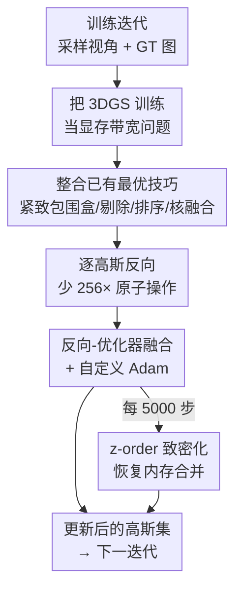

# Faster-GS: Analyzing and Improving Gaussian Splatting Optimization

**会议**: CVPR 2026  
**论文**: [CVF Open Access](https://openaccess.thecvf.com/content/CVPR2026/html/Hahlbohm_Faster-GS_Analyzing_and_Improving_Gaussian_Splatting_Optimization_CVPR_2026_paper.html)  
**代码**: https://github.com/nerficgproject/faster-gaussian-splatting  
**领域**: 3D视觉  
**关键词**: 3D高斯泼溅, 训练加速, GPU内存优化, 核融合, z-order致密化  

## 一句话总结
本文把散落在多篇 3DGS 后续工作里的训练提速技巧系统地梳理、对齐、整合到一个干净的基线里，再补上「内存合并友好的 z-order 致密化」和「反向传播-优化器融合 + 自定义 Adam」两项新优化，在不改变重建质量和高斯数量的前提下把 3DGS 训练加速最高 5×、显存降 30%，把单场景重建压到 2 分钟内。

## 研究背景与动机
**领域现状**：3D Gaussian Splatting（3DGS）已成为新视角合成的主流表示，围绕它的提速工作层出不穷——更紧的包围盒、更省的排序、逐高斯反向、核融合等，能在消费级显卡上几分钟内重建出高质量场景。

**现有痛点**：这些提速工作彼此「纠缠」。很多论文把「实现层的工程优化」和「算法/表示层的根本性改动」混在一起报告，或者用质量/高斯数量换速度，导致没人说得清「在不牺牲质量的前提下，把所有正向贡献叠加起来到底能跑多快」。同时，社区里像 gsplat 这样追求模块化的框架，反而不方便把针对原始 3DGS 管线的底层性能优化整合进来。

**核心矛盾**：训练提速这件事缺一个「干净、公平、可叠加」的统一基线。各家技术的真实增益被实现差异、超参差异、质量损失掩盖了，无法横向比较，也无法回答「上界在哪」。

**本文目标**：(1) 在严格保持 3DGS 原始质量与高斯数量不变的约束下，把已有有效技术整合进一个统一框架并逐项量化其增益；(2) 在整合后的强基线上，找出残余瓶颈并补上新的内存级优化。

**切入角度**：作者把 3DGS 训练彻底当成一个**显存带宽瓶颈（memory-bound）问题**来看——瓦片光栅化要为每个高斯加载十几个浮点参数，绝大部分时间花在等数据，而非算术。于是「减少内存访问、提升缓存局部性」成为提速主线，而这恰好和 GPU 体系结构里的内存合并（memory coalescence）、共享内存、核融合等通用手段对得上。

**核心 idea**：先「整合（consolidate）」——把前人最有效、且不损质量的技巧收编进一个重构后的干净 3DGS 实现；再「精炼（refine）」——用内存合并视角补上 z-order 致密化与反向-优化器融合，把残余的优化器开销也榨干。

## 方法详解

### 整体框架
Faster-GS 不是一个新的高斯表示，而是对**原始 3DGS 训练循环**（前向光栅化 → 反向传播求梯度 → Adam 更新参数 → 周期性致密化）逐环节做内存优化后的产物，刻意保持与原始 CUDA 可微光栅化管线兼容、即插即用。整篇方法分四层推进：先重构出一个数值更稳、显存更省的**基线实现**（比原版快约 15%）；再把前人的**已有最优技巧**对齐整合进来（紧致包围盒、瓦片剔除、两段排序、逐高斯反向、核融合）；接着在这个强基线上补两项**本文新优化**（z-order 致密化、反向-优化器融合 + 自定义 Adam）；最后把整套优化**平移到 4D 动态高斯**。作者刻意把剪枝、压缩、降精度、稠密初始化、前馈管线排除在外，因为它们会从根本上改变结果，破坏「同质同量」的公平比较前提。

下图是一次训练迭代里各设计的落位（虚线为每 5000 步触发的周期步骤）：

### 关键设计

**1. 把 3DGS 训练重构为「显存带宽问题」的干净基线**

提速的前提是先有一个不混入算法改动、数值又稳的测试床。作者重写了一版 3DGS 实现，核心是几处稳定性与显存改良：反向传播改用**前到后（front-to-back）alpha 混合**，从而省掉了原版后向里到处都要做的除零检查；对退化四元数（高斯协方差）做显式处理，稳定梯度；显式管理 $\mu_{2D}$ 梯度与可见性 mask 以降低显存开销。这版纯重构基线在不动任何算法的情况下就比 Kerbl 等人的原版快约 15%，并且为后续逐项叠加优化提供了「同质同量」的公平对照——这是全文一切横向比较的地基。它之所以重要，是因为前人工作恰恰常把这类工程改良和算法改动混报，导致增益归因混乱。

**2. 整合并对齐前人最有效、不损质量的提速技巧**

作者把散落各处的技巧收编进同一管线，每一项都对应一个具体的内存瓶颈。**包围盒收紧**：原版用边长 $3\sigma$ 的正方形框住 splat，低估了对应 $\tau_\alpha=1/255$ 截断（约 $3.33\sigma$）的真实范围；改用轴对齐矩形，半长由 $\sqrt{\Sigma_{2D_{1,1}}}$、$\sqrt{\Sigma_{2D_{2,2}}}$ 给出，并把不透明度算进去——令式 (3) 等于 $\tau_\alpha$ 反解，在根号内乘上 $-2\ln(\tau_\alpha/o)$，得到完全不透明度感知的紧致框，大幅减少每个瓦片 splat 列表里的假阳性。**瓦片剔除**：采用 Radl 等人按瓦片求高斯最大值的负载均衡判定，控制流更简单。**两段排序**：把原版「瓦片号高 32 位 + 深度低 32 位」的单次基数排序拆成「先定深度序、再分瓦片列表」两步（需稳定排序），降低显存与排序耗时。**逐高斯反向**：原版后向里 alpha 混合梯度最贵，因为一个 splat 贡献任意多像素、必须用原子累加；改成在反向时**按高斯并行**而非按像素并行，把原子操作量减少约等于一个瓦片的像素数（$16\times16=256$ 倍），代价是前向需每 32 个 splat 存一次混合状态，是唯一会**增加显存**的改动。**核融合**：把缩放/旋转/不透明度的激活函数、以及两组 SH 系数缓冲（视无关/视相关分开存以用不同学习率）直接传进光栅化核里融合，省掉 PyTorch 逐核加载/写回的开销，训练时连梯度计算也一并融合。

**3. 内存合并友好的 z-order 致密化（locality-preserving densification）**

把上面的内存成本压下去之后，作者发现**内存布局本身**成了新瓶颈。致密化时新高斯总是追加到参数缓冲末尾，使得 3D 空间里相邻的高斯在显存里却隔得很远；相邻线程要访问彼此分散的地址，造成**非合并内存访问（uncoalesced access）**、warp 发散和缓存失效。解法很轻：在致密化活跃期间，周期性地对当前全部高斯做 **z-order（Morton）重排** [69]，让 3D 近邻在参数缓冲里也相邻，恢复内存合并、减少缓存 miss。z-order 很便宜（每百万高斯约 4 ms），但频繁做收益递减，作者实测**每 5000 步**做一次在各场景上都好。一个关键洞察是：这招**只有配合逐高斯反向才有效**——若用原版按像素反向，海量原子操作会因为不同瓦片的线程写到同一缓存行（false sharing）引发严重原子争用，z-order 反而拖慢；逐高斯反向把原子操作压下去后，z-order 的合并收益才显现出来。

**4. 反向-优化器融合 + 自定义 Adam（榨干优化器开销）**

整合完上述优化后，作者剖析发现一个反直觉的事实：**优化器步骤（Adam 更新）占了总训练时间的 40%~60%**，因为原版用的是非融合 Adam。第一步是换成融合 Adam（PyTorch `fused=True` 或 apex 的 FusedAdam），作者进一步自研了一版**完全匹配 PyTorch 行为但去掉一切冗余开销**的 Adam：彻底融进 CUDA 核、用 fast-math 与 fused-multiply-add 减少指令数，比 PyTorch/apex 版都更快。第二步更激进：把**参数更新直接融进光栅化的反向传播核**——在求梯度时就顺手加载动量、算完所有参数更新，免去为参数单独开缓冲（对高斯数量大的场景显存收益明显）。为保证与标准 Adam 等价，对当前迭代梯度为零的高斯（如在视锥外）也得照常更新一次，这会略微削弱融合带来的提速；作者把 Mallick 等人「跳过不可见高斯更新」当成可选加速项——它和融合设计天然契合，但可能引入与原版不一致、甚至性能回退，所以默认不开。

### 损失函数 / 训练策略
完全沿用 3DGS 原始训练协议：30000 次迭代，每次从训练视角采一张图渲染、与 GT 比对，损失为 L1 + D-SSIM 组合，Adam 更新；为公平，所有方法统一超参（含官方近期把不透明度学习率从 0.05 降到 0.025 的改动）、统一采用 Taming-3DGS 提出的融合 SSIM 实现。4D 扩展则按 Yang 等人 [90] 的调度，每次迭代渲染并回传多张图（D-NeRF 上 batch=4）。

## 实验关键数据

### 主实验
在 Mip-NeRF360 / Tanks&Temples / Deep Blending 共 13 场景、RTX 4090 上，所有方法 PSNR/SSIM/LPIPS 与高斯数量基本一致（同质同量），差异只在训练时间与显存。

| 数据集 | 方法 | PSNR↑ | 训练时间↓ | 显存↓ | #高斯 |
|--------|------|-------|-----------|-------|-------|
| Mip-NeRF360 | 3DGS | 27.53 | 18m44s | 8.8GiB | 2.74M |
| Mip-NeRF360 | Taming-3DGS† | 27.53 | 10m49s | 8.9GiB | 2.73M |
| Mip-NeRF360 | **Ours** | 27.56 | **4m31s** | **6.1GiB** | 2.73M |
| Tanks&Temples | 3DGS | 23.77 | 11m26s | 4.7GiB | 1.57M |
| Tanks&Temples | **Ours** | 23.75 | **3m04s** | **3.4GiB** | 1.55M |
| Deep Blending | 3DGS | 29.81 | 19m43s | 8.1GiB | 2.47M |
| Deep Blending | **Ours** | 29.78 | **3m46s** | **6.0GiB** | 2.61M |

相对 3DGS 最高 5.2×（Deep Blending）、相对 Taming-3DGS 最高 2.4× 加速，显存降约 30%。仅基线重构版（Basis）就已显著领先原版。

### GPU 与跨代分析

| GPU | 3DGS | Ours (Full) | 加速 |
|-----|------|-------------|------|
| RTX 3090 | 23m46s | 6m03s | 3.9× |
| RTX 4090 | 17m46s | 4m10s | 4.3× |
| RTX 5090 | 13m05s | **2m43s（163s）** | 4.8× |

越新的 GPU 加速比越高，暗示该优化在未来硬件上潜力更大。

### 消融实验（Mip-NeRF360 户外/室内，逐项叠加，RTX 4090）

| 叠加的优化（自基线起累计） | 户外训练时间 | 显存变化 | 说明 |
|------|------|------|------|
| Basis | 17m07s | 6.39GiB | 重构基线 |
| + 核融合/分离SH/紧致框/剔除 | ~16m50s | 略降 | 单项约 1.02~1.09×，主要省显存 |
| + 逐高斯反向 | 14m14s (1.20×) | 7.69GiB (1.20×↑) | 提速大，但唯一升显存 |
| + 自定义融合 Adam | 12m50s (1.33×) | 6.40GiB | 优化器是大头，三种融合 Adam 里自研最快 |
| Full（含 z-order） | **5m31s (3.10×)** | 5.99GiB (0.94×) | z-order 配逐高斯反向才生效 |

| 优化器融合配置（Mip360 户外，5 场景均值） | PSNR↑ | 训练↓ | 显存↓ |
|------|------|------|------|
| Full | 24.72 | 5m31s | 6.0GiB |
| + 融合更新 | 24.73 | 5m04s | 5.6GiB |
| + 融合更新（跳过不可见） | 24.59 | 3m03s | 5.1GiB |
| + 融合更新（SH degree=0） | 24.38 | 2m24s | 3.2GiB |

4D 动态扩展（D-NeRF 合成集）：相对 Yang 等人 [90] 训练 2.8× 加速（18m09s→6m22s），PSNR 31.52→31.79、显存与高斯数更省，质量不降。

### 关键发现
- **优化器是隐藏大头**：剖析显示融合后的 Adam 仍占 40%~60% 训练时间（图 2），这是促成「反向-优化器融合」的直接动机，也指向二阶优化器是下一步方向。
- **逐高斯反向是单项最大贡献**，但也是唯一升显存的改动；负载均衡的瓦片剔除随高斯增多反而变慢（warp 发散下非合并访问比原子争用更致命）。
- **z-order 的收益强依赖反向方式**：配逐高斯反向时全场景提速；若用原版按像素反向，false sharing 引发的原子争用会让它在高斯少的场景反而拖慢。
- **跳过不可见更新 / 降 SH 阶**能进一步提速降显存，但都掉质量（PSNR 24.72→24.59→24.38），所以作者默认不开，把它们标为可选项。

## 亮点与洞察
- **「整合 + 公平基线」本身就是贡献**：严格锁定质量与高斯数量不变，把各家技巧逐项量化叠加，回答了「上界在哪」，给社区一个干净可复现的测试床——这种 systematization 价值常被低估。
- **从体系结构视角找瓶颈**：把 3DGS 训练定性为 memory-bound，用内存合并、共享内存、核融合等通用 GPU 手段逐个对症，z-order 致密化是其中最巧的一招——几乎零成本却能恢复缓存局部性。
- **优化之间存在耦合**：z-order 只有配逐高斯反向才有效、负载均衡剔除随高斯增多反而有害——说明 3DGS 提速不能孤立看单项，组合效应才是真相，这对后续工作选型很有指导意义。
- **可迁移性**：整套优化无缝平移到 4D 高斯（Yang 等人公式 5、6 的条件高斯 $\mu_{3D|t}$、$\Sigma_{3D|t}$ 只需在核里多算条件/边缘分布与梯度），说明这是管线级而非表示特定的优化。

## 局限与展望
- 作者自承残余瓶颈仍在参数更新，呼吁引入二阶优化器或更紧凑的视相关外观表示。
- 刻意排除了剪枝、压缩、降精度、稠密初始化、前馈管线——这些能进一步提速但会改变结果；好处是公平，代价是没探到「叠加这些后的真正上界」。
- 「跳过不可见高斯更新」「降 SH 阶」虽快但掉质量，且可能与原版不一致甚至回退，实用性受限；融合前向-后向、混合精度等留作未来工作，都涉及简洁性/鲁棒性/性能的取舍。
- 评测集中在标准 13 场景与 D-NeRF 合成集，超大规模场景下内存布局优化的边际收益还需更多验证。

## 相关工作与启发
- **vs 3DGS [35]**：本文不改表示与质量，纯做训练管线的内存级提速，4.1~5.2× 加速、30% 省显存，即插即用兼容原 CUDA 光栅化器；3DGS 是被全面对齐的基准。
- **vs Taming-3DGS [54]**：借用其逐高斯反向与分离 SH 缓冲，但用共享内存进一步降显存，并补上 z-order 致密化与反向-优化器融合，相对其再快最高 2.4×；对「跳过不可见更新」持更保守态度（默认不开）。
- **vs StopThePop / Radl 等 [63]、Speedy-Splat [24]**：采纳其紧致不透明度感知包围盒与瓦片剔除思路，但作者发现负载均衡在高斯多时因非合并访问反而有害，做了取舍；这些工作偏渲染/推理，本文证明部分技巧可迁移到训练。
- **vs Sch¨utz 等 [71]**：整合其两段排序以降显存与排序耗时。

## 评分
- 新颖性: ⭐⭐⭐⭐ 单项技巧多为整合，但 z-order 致密化、反向-优化器融合与「优化间耦合」的系统分析是真正的新贡献。
- 实验充分度: ⭐⭐⭐⭐⭐ 逐项消融、跨 GPU、4D 扩展、五次取均消除随机性，量化扎实。
- 写作质量: ⭐⭐⭐⭐⭐ 把碎片化领域梳理得清晰，瓶颈定位与取舍交代到位。
- 价值: ⭐⭐⭐⭐⭐ 提供公平可复现的强基线与测试床，2 分钟级 3DGS 重建对社区实用价值高。

<!-- RELATED:START -->

## 相关论文

- [\[CVPR 2026\] Intrinsic Geometry-Appearance Consistency Optimization for Sparse-View Gaussian Splatting](intrinsic_geometry-appearance_consistency_optimization_for_sparse-view_gaussian_.md)
- [\[CVPR 2026\] DirectFisheye-GS: Enabling Native Fisheye Input in Gaussian Splatting with Cross-View Joint Optimization](directfisheye-gs_enabling_native_fisheye_input_in_gaussian_splatting_with_cross-.md)
- [\[ICCV 2025\] 3DGS-LM: Faster Gaussian-Splatting Optimization with Levenberg-Marquardt](../../ICCV2025/3d_vision/3dgslm_faster_gaussiansplatting_optimization_with_levenbergm.md)
- [\[CVPR 2026\] Part$^{2}$GS: Part-aware Modeling of Articulated Objects using 3D Gaussian Splatting](part2gs_part-aware_modeling_of_articulated_objects_using_3d_gaussian_splatting.md)
- [\[CVPR 2026\] VAD-GS: Visibility-Aware Densification for 3D Gaussian Splatting in Dynamic Urban Scenes](vad-gs_visibility-aware_densification_for_3d_gaussian_splatting_in_dynamic_urban.md)

<!-- RELATED:END -->
