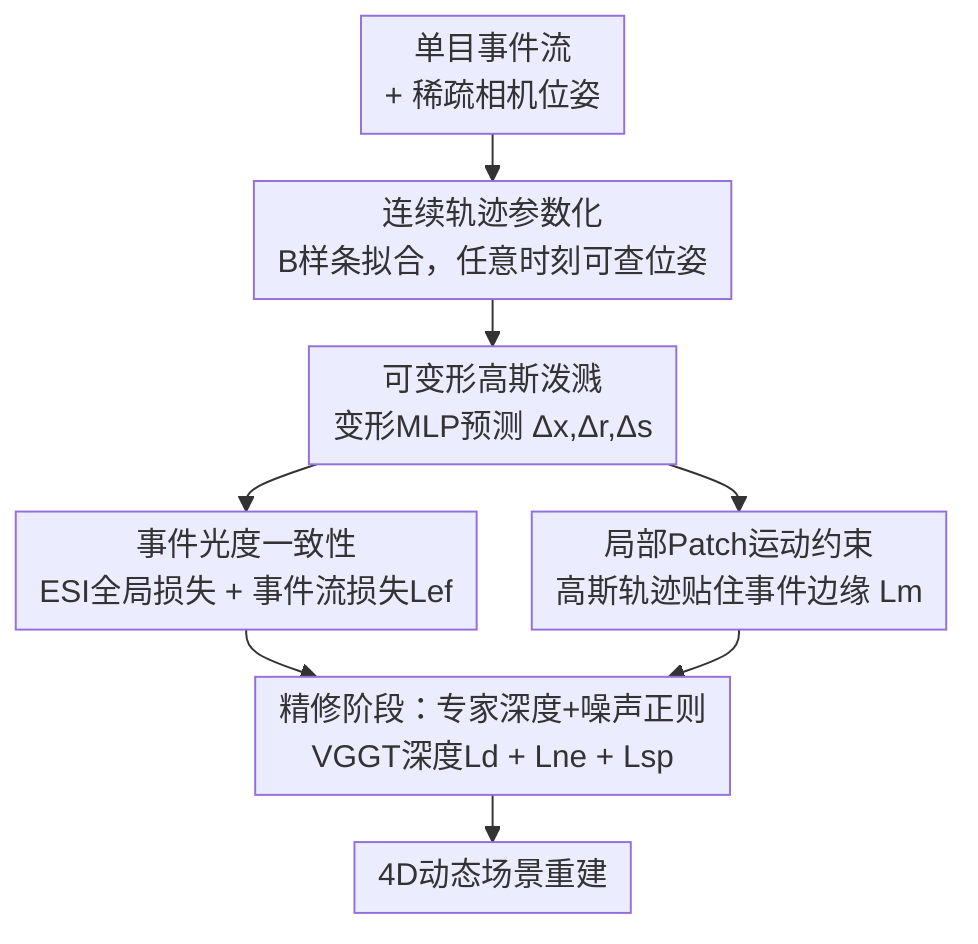

# FastEventDGS: Deformable Gaussian Splatting for Fast Dynamic Scenes from a Single Event Camera

**会议**: CVPR 2026  
**论文**: [CVF Open Access](https://openaccess.thecvf.com/content/CVPR2026/html/Dai_FastEventDGS_Deformable_Gaussian_Splatting_for_Fast_Dynamic_Scenes_from_a_CVPR_2026_paper.html)  
**代码**: https://github.com/daizijia/FastEventDGS  
**领域**: 3D视觉  
**关键词**: 可变形高斯泼溅, 事件相机, 动态场景重建, 4D 重建, 单目  

## 一句话总结
FastEventDGS 第一次只用**一台单目事件相机**就训练出动态场景的可变形高斯泼溅（Deformable 3DGS），靠连续轨迹参数化 + 双事件生成模型 + 局部 patch 运动损失 + 专家深度精修，在合成和真实快速运动数据集上把 PSNR 从 ~16 dB 拉到 22–24 dB。

## 研究背景与动机
**领域现状**：动态场景的新视角合成（NVS）目前主流是把静态 3DGS 扩展出时间维——学一个变形场（deformation field）或 4D primitive，由一个变形 MLP $\mathcal{D}(\mathbf{x},t)$ 在任意时刻预测每个高斯的位移/旋转/缩放 $(\Delta\mathbf{x},\Delta\mathbf{r},\Delta\mathbf{s})$。监督信号几乎全部来自 RGB / RGB-D 多视角图像。

**现有痛点**：RGB 相机有两个硬伤——快速运动下**运动模糊**、以及**时间分辨率低**，导致基于帧的方法只能建模中等速度的运动，快速动态物体会被放错位置或糊成一片。事件相机（neuromorphic sensor）以微秒级延迟异步检测亮度变化，天然适合高速场景，但它的输出**稀疏、有噪声、且只有相对亮度（没有绝对强度）**，从纯事件重建一个完整动态场景极难。

**核心矛盾**：现有事件 NVS 方法为了拿到全局上下文先验，几乎都得**配一个辅助传感器**——要么融合 RGB 帧，要么融合 Lidar。这带来繁琐的硬件搭建和多传感器标定负担，违背了事件相机"轻量"的初衷。

**本文目标**：回答一个基础问题——**能不能只用单目事件相机重建动态场景？** 拆成三个子问题：(1) 事件频率远高于位姿采样频率，如何在任意时刻拿到监督；(2) 纯事件缺绝对强度，怎么同时约束光度和几何；(3) 单目少视角极易过拟合，运动和深度怎么纠偏。

**切入角度**：事件本质上编码了"哪里在动、怎么动"，作者认为这恰好能当作运动场的显式监督，而不是只把事件当成"亮度差"来用。

**核心 idea**：把相机轨迹建成连续的 B 样条，让事件能在任意时间区间上监督可变形高斯；再用**两个事件生成模型**（长区间积分 + 线性流模型）分别提供光度和几何约束，外加一个把高斯轨迹钉在事件边缘上的局部运动损失抑制过拟合，最后用一个现成的前馈重建模型（VGGT）纠正深度。

## 方法详解

### 整体框架
输入是一段单目事件流和它对应的稀疏相机位姿；输出是一个带时间维的可变形高斯场，可在任意时刻渲染出动态场景的新视角图像（4D 重建）。整条管线围绕 Deformable 3DGS 的变形 MLP $\mathcal{D}$ 展开：先把稀疏位姿拟合成**连续轨迹**，这样事件流的任意时间窗都能当监督；然后用事件光度损失给全局一致性、事件流损失给局部细节和几何、局部 patch 运动损失给显式运动引导，三者一起优化高斯的形变 $(\Delta\mathbf{r},\Delta\mathbf{x},\Delta\mathbf{s})$；训练后期进入**精修阶段**，引入 VGGT 估计的深度做几何纠偏，再加两个正则项压噪声。

### 关键设计

**1. 连续轨迹参数化：让任意时刻的事件都能当监督**

事件相机的采样频率远高于位姿系统（动捕或 SfM）——位姿是稀疏点，事件是密集流。如果只在有位姿的离散时刻监督，绝大部分细粒度运动信息就浪费了。作者用三次 B 样条把稀疏位姿拟合成一条**连续时间轨迹**，于是可以在任意时间 $\tau$ 查询相机位姿。这一步是整个方法的地基：后面要用的事件流损失 $\mathcal{L}_{ef}$ 和运动损失 $\mathcal{L}_m$ 都需要在"两个训练位姿之间的任意小区间"上取事件做约束，没有连续轨迹就无从谈起。测试时也正是取两个训练视角之间的中间帧来评估时序插值质量。

**2. 事件光度一致性：长区间积分管全局、线性流模型管细节与几何**

纯事件没有绝对亮度，只能用对数空间的亮度变化来监督。作者组合了两个互补的事件生成模型。其一是 **Event Single Integral（ESI）损失**，提供全局监督：在 $t_k-\Delta t_k$ 和 $t_k$ 两个时刻各渲染一张图、在对数空间取差得到预测 $\Delta\hat I$，真值则由事件在该区间的积分 $\Delta I=\int_{t_k-\Delta t_k}^{t_k} C\cdot e(\tau)\,d\tau$ 给出，损失是 $\mathcal{L}_{esi}=\lVert\Delta I-\Delta\hat I\rVert_1\odot\mathbf{m}$（$\mathbf{m}$ 是只在触发了事件的像素上计算的二值掩码），再和 D-SSIM 加权组成全程使用的 $\mathcal{L}_e$。其二是**事件流损失** $\mathcal{L}_{ef}$，用线性事件生成模型在**短区间** $\Delta\tau$ 上约束亮度增量：

$$\Delta I(\mathbf{x})\approx-\nabla\mathcal{I}(\mathbf{x})\cdot\mathbf{v}(\mathbf{x})\,\Delta\tau$$

这里的像素速度 $\mathbf{v}(\mathbf{x})$ 来自光流 $\mathcal{F}^O=\mathcal{F}^C+\mathcal{F}^G$，由**相机流**（已知外参 + 渲染深度算出的纯相机运动）和**高斯流**（高斯形变在该视角下的 2D 投影）相加而成。$\mathcal{L}_{ef}$ 对预测与实测的亮度增量都做 $L_2$ 归一化后取 $L_1$ 差，从而消掉 $\Delta\tau$ 和对比度阈值 $C$ 的影响。两者一长一短、一全局一局部，让重建既有整体一致性又保细节，同时事件流损失因为含相机流/高斯流，顺带提供了几何与运动约束。

**3. 局部 patch 运动约束：把高斯轨迹钉在事件边缘上抑制过拟合**

单目少视角下最常见的失败是**过拟合到训练视角**：一些本应跟着物体走的高斯不再连贯运动，背景高斯则出现"抖动"。作者观察到事件边缘恰好沿着物体真实运动，于是提出让高斯的 2D 投影轨迹**不偏离邻近的事件边缘**。具体做法：把一段 $\Delta t$ 切成 $m$ 个等事件数的子序列；随机采样固定数量的高斯并用深度滤波剔除被遮挡的；把每个采样高斯的均值投影到像平面 $\hat g^i=\pi(K,T_t,(\mathbf{x}+\Delta\mathbf{x}))$，以投影点为中心取固定大小的方形 patch；对同一高斯中心连续 $m$ 个 patch 上的事件单次积分 $\Delta I_j^{g_i}$ 求相邻残差并跨所有采样高斯求和：

$$\mathcal{L}_m=\sum_i\sum_j\lVert\Delta I_j^{g_i}-\Delta I_{j+1}^{g_i}\rVert_1$$

对静态背景高斯，它惩罚过拟合带来的抖动；对动态物体高斯，它强制成组刚性地协同运动，从而把"运动到底怎么动"这个显式信号注入变形场——这是相比纯 MLP 变形场的关键增益。

**4. 精修阶段：专家深度纠偏 + 噪声正则**

优化几轮后强度图已经渲得不错，但单目少视角让一些高斯在平坦区域"漂浮"，造成深度不一致。作者直接拿现成的前馈场景重建模型 VGGT 当深度专家，用尺度不变对数损失（SiLog）约束渲染深度 $\hat d_i$ 与估计深度 $d_i$ 的相对一致性：$\mathcal{L}_d=\frac1n\sum_i\alpha_i^2-\frac1{n^2}(\sum_i\alpha_i)^2$，其中 $\alpha_i=\log d_i-\log\hat d_i$。此外针对无/少事件的纹理平坦区和真实数据里常见的"拖尾事件"噪声，加两个正则：**非事件区约束** $\mathcal{L}_{ne}=\mathrm{ReLU}(|\Delta\hat I|-C)\odot\neg\mathbf{m}$，要求没触发事件的区域亮度变化不该超过阈值 $C$；**事件空间损失** $\mathcal{L}_{sp}=\lVert\delta_x\mathcal{I}\rVert_1+\lVert\delta_y\mathcal{I}\rVert_1$，惩罚渲染图过大的空间梯度以压噪。这三项只在最终精修阶段加入，避免早期干扰主优化。

### 损失函数 / 训练策略
总损失为
$$\mathcal{L}=\mathcal{L}_e+\lambda_{ef}\mathcal{L}_{ef}+\lambda_m\mathcal{L}_m+\lambda_d\mathcal{L}_d+\lambda_{ne}\mathcal{L}_{ne}+\lambda_{sp}\mathcal{L}_{sp}$$
训练分三段课程：(1) **warm-up**（前 3,000 epoch）只用 $\mathcal{L}_e$，像 vanilla GS 一样先优化高斯的位置/旋转/缩放；(2) warm-up 后加入运动相关损失 $\mathcal{L}_{ef}$ 和 $\mathcal{L}_m$；(3) **精修阶段**（20,000 epoch 后）再引入 $\mathcal{L}_d,\mathcal{L}_{ne},\mathcal{L}_{sp}$，总共训 30,000 epoch。硬件为单张 RTX 4090。

## 实验关键数据

### 主实验
合成数据集 BlenderDynamicEvent（Blender + ESIM 仿真，4 个场景，~1000 fps，含彩色事件）上的定量对比（PSNR↑ / SSIM↑）：

| 场景 | 指标 | Event3GS | EvDNeRF | E2vidDGS | 本文 |
|------|------|----------|---------|----------|------|
| Butterfly | PSNR | 14.46 | 12.10 | 16.13 | **24.27** |
| Butterfly | SSIM | 0.6464 | 0.4635 | 0.7615 | **0.9020** |
| Duck | PSNR | 16.21 | 8.18 | 19.54 | **21.25** |
| Alarm | PSNR | 16.47 | – | 16.61 | **23.24** |
| Ball | PSNR | 15.46 | 16.64 | 18.74 | **22.89** |

本文在所有场景全面领先：Event3GS 没有运动场只能重建静态部分、动态区糊掉；EvDNeRF 在单目快速运动下直接重建失败；两阶段 E2vidDGS 在简单场景（Duck）尚可，但复杂结构下泛化不足、出现色偏和结构退化。真实数据集 Gen4Dynamic（Prophesee Gen4 事件相机 + FLIR 彩色相机 10 fps + 动捕位姿，945×649）因 RGB 相机时间分辨率低无法取可靠真值，只做定性对比——FrameDGS 靠绝对亮度在静态区细节更好，但 10 fps 仍漏掉高速信息、把动态物体放错位置（物体下落仅 0.25 秒），而本文凭事件的高时间分辨率重建出更准的动态物体和时序一致性。

### 消融实验
损失逐项叠加（合成集，PSNR↑ / SSIM↑ / LPIPS↓）：

| 配置 | PSNR | SSIM | LPIPS | 说明 |
|------|------|------|-------|------|
| $\mathcal{L}_e$ | 18.61 | 0.8478 | 0.2267 | 仅全局光度 |
| $+\mathcal{L}_{ef}$ | 19.35 | 0.8570 | 0.2231 | 加事件流损失 |
| $+\mathcal{L}_m$ | 20.52 | 0.8692 | 0.2160 | 加局部运动约束 |
| $+\mathcal{L}_d$ | 22.49 | 0.8911 | 0.1944 | 加专家深度，**涨幅最大** |
| All | 22.91 | 0.8921 | 0.1952 | 再加噪声正则 |

物体运动速度消融（Ball 场景，按倍率压缩仿真帧率）：

| 速度 | PSNR | SSIM | LPIPS |
|------|------|------|-------|
| 1× | 22.91 | 0.8921 | 0.1952 |
| 2× | 19.51 | 0.8456 | 0.2369 |
| 3× | 18.43 | 0.8361 | 0.2532 |
| 4× | 18.31 | 0.8308 | 0.2578 |

### 关键发现
- **深度约束贡献最大**：$\mathcal{L}_d$ 单项就把 PSNR 从 20.52 拉到 22.49（+1.97 dB），深度图肉眼可见地变清晰，说明单目漂浮高斯是主要几何瓶颈，专家深度纠偏最划算。
- $\mathcal{L}_{ef}$ 与 $\mathcal{L}_m$ 贡献几乎相当，各 ~0.7–1.2 dB；噪声正则 $\mathcal{L}_{ne}+\mathcal{L}_{sp}$ 增益最小但整体为正（PSNR 22.49→22.91，SSIM 微涨；⚠️ LPIPS 0.1944→0.1952 反而微升，原文未细究）。
- 运动越快 PSNR 越低，但 **SSIM 下降不明显**：作者解释是高速下可用于估计相对强度变化的信息变少，导致**色偏**而非结构崩坏——即颜色错了但形状还在。

## 亮点与洞察
- **"双事件生成模型"分工很巧**：长区间积分（ESI）抓全局、短区间线性流模型（含相机流+高斯流）抓细节兼几何，一个损失同时承担光度和运动监督，避免了再引入外部光流网络。
- **把事件当运动监督而非亮度差**：局部 patch 运动损失直接把高斯 2D 轨迹钉在事件边缘上，这个"事件边缘 ≈ 物体真实运动"的先验，是单目少视角下对抗过拟合的关键，可迁移到任何需要显式运动引导的动态 3DGS。
- **借现成前馈模型 VGGT 当深度专家**：不训练额外深度网络、即插即用纠正漂浮高斯，是用 foundation model 给少视角重建补几何先验的实用范式。

## 局限与展望
- 作者承认**依赖已知相机位姿**（动捕或 SfM 提供），实际部署不便；未来希望做到位姿无关，简化数据采集。
- 真实数据集**没有可靠真值**，只能定性评估，定量优势主要建立在合成数据上——事件仿真（ESIM）与真实事件的 domain gap 未充分量化。
- 速度消融到 4× PSNR 已掉到 18.31 dB，高速下色偏明显，说明纯事件缺绝对强度这一根本短板在极端速度下仍是天花板。
- ⚠️ 噪声正则项在 LPIPS 上略有反效果，正则强度与感知质量的权衡值得进一步分析。

## 相关工作与启发
- **vs 传感器融合事件 DGS（如 RGB+depth+event、STD-GS）**：它们靠辅助传感器或弱运动引导（事件/高斯空间直方图一致）拿全局先验，本文是首个**纯单目事件**训练动态 GS，硬件最简；代价是更依赖连续轨迹和专家深度来补信息。
- **vs 静态事件 3DGS（Event3DGS / EventSplat / IncEventGS）**：它们只重建静态场景，本文加时间维 + 显式运动约束做到 4D；消融里的 Event3GS baseline 正说明没有运动场就只能重建静态、动态区糊掉。
- **vs 2D 流先验监督的动态 3DGS**：本文沿用"用流引导变形场"的思路，但流来自事件生成模型自身（相机流+高斯流），而非外部光流估计器，更贴合事件数据。

## 评分
- 新颖性: ⭐⭐⭐⭐⭐ 首个单目纯事件可变形高斯泼溅，命题和方案都新。
- 实验充分度: ⭐⭐⭐⭐ 自建合成+真实双数据集、消融清晰，但真实集缺定量真值。
- 写作质量: ⭐⭐⭐⭐ 损失推导与三段式训练讲得清楚，公式排版偶有 OCR 噪声。
- 价值: ⭐⭐⭐⭐ 简化传感器搭建对 AR/VR 高速动态采集有实用意义，VGGT 深度纠偏可复用。

<!-- RELATED:START -->

## 相关论文

- [\[CVPR 2026\] 4C4D: 4 Camera 4D Gaussian Splatting](4c4d_4_camera_4d_gaussian_splatting.md)
- [\[CVPR 2026\] Unsupervised 3D Motion Estimation Using Event Camera](unsupervised_3d_motion_estimation_using_event_camera.md)
- [\[CVPR 2025\] IncEventGS: Pose-Free Gaussian Splatting from a Single Event Camera](../../CVPR2025/3d_vision/inceventgs_pose-free_gaussian_splatting_from_a_single_event_camera.md)
- [\[ICCV 2025\] Event-boosted Deformable 3D Gaussians for Dynamic Scene Reconstruction](../../ICCV2025/3d_vision/event-boosted_deformable_3d_gaussians_for_dynamic_scene_reconstruction.md)
- [\[CVPR 2026\] E2EGS: Event-to-Edge Gaussian Splatting for Pose-Free 3D Reconstruction](e2egs_event-to-edge_gaussian_splatting_for_pose-free_3d_reconstruction.md)

<!-- RELATED:END -->
