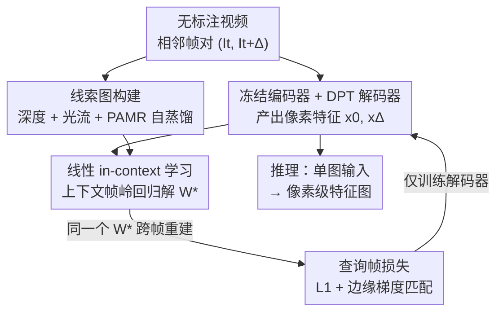

# Featurising Pixels from Dynamic 3D Scenes with Linear In-Context Learners

**会议**: CVPR 2026  
**arXiv**: [2604.26488](https://arxiv.org/abs/2604.26488)  
**代码**: https://lila-pixels.github.io (项目主页)  
**领域**: 3D视觉 / 自监督表示学习  
**关键词**: 像素级特征、视频自监督、线性 in-context 学习、深度与光流线索、时序一致性

## 一句话总结
LILA 用一个冻结 DINOv2 编码器 + DPT 解码器，从无标注视频里学逐像素特征——核心训练信号是"线性 in-context 学习"：在上下文帧上拟合一个把特征映射到深度/光流/自蒸馏线索的最优线性投影，**强制同一个投影也能在相邻查询帧上重建对应线索**，从而把几何、语义与时序一致性都压进像素级特征里，下游 VOS / 表面法向 / 语义分割三个任务全面超越 FlowFeat、LoftUp 等。

## 研究背景与动机
**领域现状**：大多数视觉任务（分割、深度、法向）都需要**逐像素**的特征，要求同时编码语义和几何。DINO 系列基础模型已经能编码不少这类属性，但它们是 encoder-only，输出的是 patch 级（如 14×14 下采样）的低分辨率特征网格。

**现有痛点**：要拿到像素级特征，最直接的做法是把输入按 patch size 放大再喂进编码器，但这样既不高效，又在训练/推理之间制造了分辨率错配。已有的特征上采样工作（FeatUp、LoftUp）多在图像上做，且 LoftUp 还得借 SAM 的 mask 监督；而视频自监督方法（V-JEPA、VideoMAE）偏 action 级语义，难以扩展到稠密像素预测。

**核心矛盾**：现成的深度网络、光流网络对野外视频泛化已经很好，是廉价又丰富的"几何 + 运动"监督来源——但它们的预测是**带噪声、不完美**的伪标签。如何在不被噪声带偏的前提下，从这些 noisy cue 里学出干净、时序稳定的像素特征，是关键难题。

**本文目标**：(i) 设计一种能从视频原生学逐像素特征的 encoder-decoder 训练范式；(ii) 让学到的表示在与训练线索**不同**的下游任务上都涨点。

**切入角度**：作者的观察是——一个真正编码了"跨帧不变结构"的特征，应该满足这样一条性质：在第 $t$ 帧上拟合出来的、把特征映射到线索图的**最优线性投影**，拿去作用到相邻第 $t+\Delta$ 帧的特征上，也应该能重建出该帧对应的线索图。这把"时序一致性"变成了一个可以直接优化的约束。

**核心 idea**：用"线性 in-context 学习（LILA）"代替逐帧蒸馏——以上下文帧解出的最优线性投影为桥梁，要求查询帧特征在同一投影下重建线索，借此把噪声里稳定的成分蒸出来、把帧间不稳的噪声压掉。

## 方法详解

### 整体框架
LILA 训练一个 encoder-decoder 网络从无标注视频产出逐像素特征图。骨干用预训练的 DINOv2 ViT（**冻结**），接一个 DPT 解码器，DPT 通过 skip connection 连到编码器四个中间 block，把 patch 级 token 上采样回像素级特征——**整个训练只更新解码器**。

每次迭代取一对相邻帧 $(I_t, I_{t+\Delta})$，$I_t$ 当**上下文帧**、$I_{t+\Delta}$ 当**查询帧**，$\Delta$ 用可变时间窗采样。对这对帧，先用现成网络估计深度图、前/后向光流，再把编码器低分辨率特征经 PAMR 精化，三者拼成线索图 $G_\text{context}$、$G_\text{query}$。网络对两帧各自产出像素特征 $x_0, x_\Delta$。训练时：在上下文帧上用岭回归解出把 $x_0$ 映射到 $G_\text{context}$ 的最优投影 $W^*$，再用**同一个** $W^*$ 作用到查询帧特征 $x_\Delta$ 上去重建 $G_\text{query}$，最小化重建误差。推理时丢掉深度/光流网络，只吃单张图、输出同分辨率特征图。

### 关键设计

**1. 线性 in-context 学习：把时序一致性写成"共享线性投影"约束**

直接拿深度/光流伪标签做逐帧蒸馏（ERM），网络会把每帧各自的噪声也一并吸收进去，学到的特征时序不稳。LILA 的做法是引入一个"跨帧桥梁"：给定上下文帧特征 $x_0$ 和其线索图 $G_\text{context}$，用闭式岭回归求最优投影
$$W^* = \arg\min_W \|x_0 W - G_\text{context}\| + \lambda\|W\|$$
注意这个回归的规模是特征维度 $d$（128/192/256）而非像素数 $N$，因此求解很廉价。随后**冻结这个 $W^*$**，要求它同样能把查询帧特征 $x_\Delta$ 映射到该帧线索 $G_\text{query}$，损失为 $\mathcal{L}_\text{L1} = \|x_\Delta W^* - G_\text{query}\|_1$。这之所以有效，是因为最优线性投影只能抓住"在整个时间窗内都不变"的视觉结构——只有把跨帧稳定的几何/语义编码进特征，同一个 $W^*$ 才能在两帧上都成立；帧特定、时序抖动的噪声成分会被这个 cross-frame 约束自然抑制掉。对光流还有个符号约定：若 $W$ 近似前向光流 $U_\uparrow$，则 $-W$ 应近似后向光流，所以构造 $G_\text{query}$ 时对后向光流取负号

**2. 三模态线索图 + PAMR 自蒸馏：让一个投影同时背几何、运动与语义**

只用单一线索（比如只用深度）信息太单薄，学不出语义丰富又几何精确的表示。LILA 把三种像素级线索沿特征维拼接成线索图：深度 $D$（编码场景几何）、前/后向光流 $U$（凸显动态物体）、以及经 PAMR 精化的编码器特征 $F$（保留 DINOv2 原有语义、相当于一次自蒸馏）。形式上 $G_\text{context} := \mathcal{C}_0\circ(F_t \| D_t \| U_\uparrow)$，$G_\text{query} := \mathcal{C}_\Delta\circ(F_{t+\Delta} \| D_{t+\Delta} \| -U_\downarrow)$，$\|$ 表示拼接，$\mathcal{C}$ 是对齐特征网格的裁剪。其中 PAMR（pixel-adaptive map refinement）是一种基于局部亲和核的 CRF 均场推断变体，用图像统计把低分辨率编码器特征精化到更贴合边界，且复用前向已算好的特征、几乎零额外开销。三模态的协同效应很关键：消融显示三者齐备比只留自蒸馏在 VOS-KNN 上高 5.3% $\mathcal{JF}$，说明监督线索的多样性直接撑起了下游精度

**3. 裁剪错位 + 边缘梯度匹配：用"不对齐"逼出真正的跨帧泛化，用边缘对齐语义**

虽然深度/光流是在整帧 $(I_t, I_{t+\Delta})$ 上估计的，但喂进网络的只是两帧各自**独立随机裁剪**的 crop $c_0=\mathcal{C}_0(I_t)$、$c_\Delta=\mathcal{C}_\Delta(I_{t+\Delta})$。这个有意的空间错位让"上下文解出的 $W^*$ 直接套到查询帧"成为一个真正非平凡的任务——消融里去掉 cropping 后 VOS 线性探针掉到 66.0（Full 是 68.6），说明这种不对齐迫使网络学到的是可迁移的结构而非记住固定对齐。另外，线索图的不连续处高度对应场景语义边界，于是加一个梯度匹配损失 $\mathcal{L}_{\nabla x} = \omega_x \|\nabla_x(x_\Delta W^*) - \nabla_x G_\text{query}\|_1$，其中权重 $\omega_x = 1 - \exp(-\nabla_x G_\text{query}/\sigma)$ 在强梯度（边界）处更大，引导特征在语义边界上更锐利。总损失 $\mathcal{L}_\text{LILA} = \mathcal{L}_\text{L1} + \gamma\mathcal{L}_\nabla$，全程取 $\gamma=1$ 且对其不敏感

### 损失函数 / 训练策略
- 优化器 AdamW，学习率 $10^{-4}$、权重衰减 $10^{-5}$；$\gamma=1$。
- 解码器输出维度随骨干变化：ViT-S14 / B14 / L14 分别为 128 / 192 / 256。
- 骨干默认从 DINOv2 初始化并冻结，只训练 DPT 解码器。
- 训练集：YouTube-VOS（小骨干）与 Kinetics-700（大骨干，约 650K clip，更大但更脏），均**不使用任何标注**。

## 实验关键数据

### 主实验
**视频物体分割（DAVIS-2017 val，线性探针 / 局部 k-NN 的 $\mathcal{JF}$）**：

| 骨干 / 方法 | 训练数据 | LP $\mathcal{JF}$ | k-NN $\mathcal{JF}$ |
|------|------|------|------|
| DINO2-S14（基线） | LVD | 57.5 | 65.1 |
| + FeatUp | +COCO-S | 60.5 | 65.5 |
| + LoftUp（用 SAM mask） | +SA1B | 63.0 | 66.0 |
| + FlowFeat | +YT-VOS | 65.8 | 67.6 |
| **+ LILA** | +YT-VOS | **68.6** | **73.9** |
| DINO2-B14 + FlowFeat | +YT-VOS | 65.7 | 69.0 |
| **DINO2-B14 + LILA** | +YT-VOS | **70.4** | **74.2** |
| **DINO2-L14 + LILA** | +Kinetics | **69.3** | **74.9** |

S14 上 LILA 比基线高近 10% $\mathcal{JF}$（LP），且在**没用 mask 监督**的情况下超过借了 SAM 的 LoftUp 4.3%；B14 上比 FlowFeat 高 4.7%（LP）/ 5.2%（k-NN）。

**表面法向（NYUv2）与语义分割（COCO-Stuff）**：

| 骨干 / 方法 | RMSE↓ | $\delta_1$↑ | COCO mIoU↑ | pAcc↑ |
|------|------|------|------|------|
| DINO2-S14 | 29.71 | 26.91 | 56.6 | 77.2 |
| + FlowFeat | 29.04 | 27.89 | 58.0 | 78.7 |
| **+ LILA** | **28.53** | **31.14** | **59.6** | **79.8** |
| DINO2-L14 | 24.70 | 39.89 | 58.7 | 78.1 |
| **+ LILA（Kinetics）** | **24.04** | **40.89** | **63.3** | **81.4** |

法向和分割上 LILA 对所有骨干、所有指标都稳定超过 FlowFeat；mIoU 提升随模型增大而增大（S14 +3.0%、L14 +4.1%）。ADE20K（S14：43.5→45.1 mIoU）与 CLIP 初始化的零样本分割上也一致涨点。

### 消融实验
**线索模态（Tab. 4，DAVIS LP/KNN $\mathcal{JF}$）**：

| 配置 | DAVIS LP/KNN | NYUv2 RMSE | COCO mIoU |
|------|------|------|------|
| 仅自蒸馏(SD) | 66.9 / 68.6 | 28.61 | 59.3 |
| SD + 深度 | 67.2 / 72.6 | 29.06 | 58.7 |
| SD + 光流 | 67.0 / 72.6 | 28.64 | 59.5 |
| 深度 + 光流 | 69.1 / 72.5 | 28.49 | 59.3 |
| **三者全开（Full）** | **68.6 / 73.9** | **28.53** | **59.6** |

**训练组件（Tab. 5，DINO2-S14）**：

| 配置 | DAVIS LP/KNN | 说明 |
|------|------|------|
| (A) ERM 蒸馏 | 63.2 / 61.1 | 用同样线索做逐帧直接预测，全面变差 |
| (B) ×PAMR | 67.3 / 71.9 | 去掉特征精化 |
| (C) ×cropping | 66.0 / 72.4 | 去掉随机裁剪错位 |
| (D) ×temporal sampling | 69.3 / 72.4 | 去掉可变时间窗 |
| (E) ×edge loss | 68.1 / 72.9 | 去掉边缘梯度损失 |
| **LILA（Full）** | **68.6 / 73.9** | 完整模型 |

### 关键发现
- **in-context 训练本身是涨点主因**：(A) ERM 蒸馏用的是和 LILA 完全相同的线索，却在 k-NN 上从 73.9 暴跌到 61.1。差距纯粹来自跨帧线性约束——它能压住伪标签里帧特定、时序不稳的噪声，而标准蒸馏会把噪声原样吸收。
- **去掉几何/运动线索代价最大**：只留自蒸馏时 VOS-KNN 掉 5.3% $\mathcal{JF}$，三模态有明显协同。
- **cropping 错位很关键**：去掉后 LP $\mathcal{JF}$ 从 68.6 掉到 66.0，错位迫使网络学可迁移结构。
- **能从更脏的大数据扩展**：L14 换到 Kinetics（比 YT-VOS 大但更脏）后法向、分割仍有可见提升。
- **跨域泛化反直觉**：在以动态/室外为主的视频上预训练，却在**静态室内**的 NYUv2 法向上把家具等细节刻画得更清晰。

## 亮点与洞察
- **把"时序一致"翻译成一个可闭式求解的线性约束**：不引入额外参数或对比队列，只靠"上下文帧解出的 $W^*$ 必须在查询帧也成立"，就把跨帧不变性变成监督信号——而且回归规模是 $d$ 不是 $N$，几乎零成本。这是全文最"啊哈"的点。
- **用 noisy 伪标签学却不被带偏**：cross-frame 公式天然是个降噪器（只保留两帧共有成分），这个视角可迁移到任何"现成网络伪标签 + 视频"的自监督场景。
- **训练吃视频、推理吃单图**：与 V-JEPA/VideoMAE 等训练推理都要时空输入的方法不同，LILA 推理时丢掉深度/光流网络只吃一张图，部署友好。
- **PAMR 自蒸馏顺带保住语义**：把编码器原有语义当成第三种线索拼进去，避免几何线索把 DINOv2 的语义"洗掉"，是个低成本的稳定项。

## 局限与展望
- **依赖现成深度/光流网络的质量**：线索由预训练网络给出，其系统性偏差（而非随机噪声）未必能被跨帧约束消除，论文也承认线索本身不完美。
- **只训解码器、编码器冻结**：表示上限受 DINOv2 骨干约束，LILA 主要在"上采样 + 时序对齐"层面发力，未触及编码器本身。
- **线性约束的表达力**：用线性投影桥接两帧，对高度非刚性、大位移或遮挡场景是否够用，文中未深入压力测试。
- **改进思路**：可探索把骨干一起微调、或把线性投影换成轻量非线性 in-context 模块；以及把三模态线索扩展到法向、分割伪标签等更多几何/语义线索。

## 相关工作与启发
- **vs FlowFeat**：同样借现成光流做像素级监督，但 FlowFeat 是 BYOL 式直接鼓励时序对应像素相似；LILA 用"共享线性投影跨帧重建"的 in-context 框架，且额外引入深度与自蒸馏，多任务全面超过 FlowFeat（VOS 上 +4~5% $\mathcal{JF}$）。
- **vs LoftUp / FeatUp**：它们是图像域的特征上采样，LoftUp 还要 SAM mask 监督；LILA 不用任何 mask、从视频原生学像素特征，且在 VOS 上反超 LoftUp。
- **vs V-JEPA / VideoMAE**：视频自监督但偏 action 级，稠密像素任务上弱；LILA 显式注入几何/运动线索并强制像素级时序一致，DAVIS 上大幅领先。
- **vs ERM 蒸馏（自身 baseline）**：相同线索下逐帧直接预测，证明涨点来自 in-context 形式而非线索本身。

## 评分
- 新颖性: ⭐⭐⭐⭐⭐ 用"共享线性投影跨帧重建"把时序一致性变成廉价闭式约束，是个简洁又少见的训练范式。
- 实验充分度: ⭐⭐⭐⭐⭐ 三任务、三骨干、两数据集、线索/组件双维度消融，证据链完整。
- 写作质量: ⭐⭐⭐⭐ 公式与动机讲得清楚，PAMR、裁剪等细节多在附录，正文略需脑补。
- 价值: ⭐⭐⭐⭐ 不用标注、推理吃单图、即插即用涨像素级表示，对下游稠密任务实用性强。

<!-- RELATED:START -->

## 相关论文

- [\[CVPR 2026\] I-Scene: 3D Instance Models are Implicit Generalizable Spatial Learners](i-scene_3d_instance_models_are_implicit_generalizable_spatial_learners.md)
- [\[CVPR 2026\] Dynamic-Static Decomposition for Novel View Synthesis of Dynamic Scenes with Spiking Neurons](dynamic-static_decomposition_for_novel_view_synthesis_of_dynamic_scenes_with_spi.md)
- [\[CVPR 2026\] Linear Fundamental Matrix Estimation from 7 or 5 Points](linear_fundamental_matrix_estimation_from_7_or_5_points.md)
- [\[CVPR 2026\] Context-Nav: Context-Driven Exploration and Viewpoint-Aware 3D Spatial Reasoning for Instance Navigation](context-nav_context-driven_exploration_and_viewpoint-aware_3d_spatial_reasoning_.md)
- [\[CVPR 2026\] GaussianFluent: Gaussian Simulation for Dynamic Scenes with Mixed Materials](gaussianfluent_gaussian_simulation_for_dynamic_scenes_with_mixed_materials.md)

<!-- RELATED:END -->
