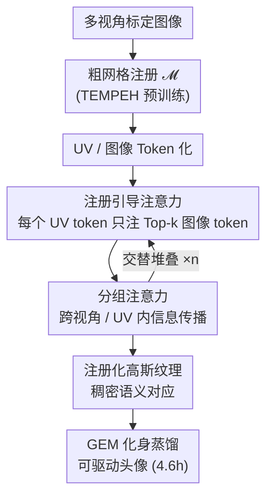

# Feed-forward Gaussian Registration for Head Avatar Creation and Editing

**会议**: CVPR 2026  
**论文**: [CVF Open Access](https://openaccess.thecvf.com/content/CVPR2026/html/Prinzler_Feed-forward_Gaussian_Registration_for_Head_Avatar_Creation_and_Editing_CVPR_2026_paper.html)  
**代码**: 有（项目主页发布代码与模型权重）  
**领域**: 3D视觉  
**关键词**: 高斯泼溅, 头部化身, 稠密语义对应, 前馈注册, 注册引导注意力  

## 一句话总结
MATCH 用一个 transformer 在 0.5 秒内从标定多视角图像直接前馈预测出"处于稠密语义对应下的高斯泼溅纹理"，绕开了传统头部化身流程里耗时数小时到一天的网格跟踪与逐主体优化，并把这种跨主体/跨表情的对应直接用于头像创建、插值、语义编辑和表情迁移。

## 研究背景与动机

**领域现状**：工作室级别的高保真头部化身，目前主流是两阶段流程——先做基于网格的头部跟踪（建立跨视角、跨帧的对应），再把高斯泼溅等表面基元附着到跟踪好的几何上、对着训练图像逐主体优化外观。

**现有痛点**：这套两阶段流程是计算瓶颈。建一个个性化化身往往要几小时甚至一天以上（GEM 单主体约 45.3 小时，其中网格跟踪 10.7 小时、可驱动高斯优化 27.7 小时），想扩展到大量主体在算力上不可承受；而且单帧网格跟踪本身就慢（VHAP 约 12 秒/帧）。

**核心矛盾**：高保真依赖"逐主体优化 + 显式跟踪"，但正是这两步带来了天量耗时。另一类推断式方法（从单/少张图直接回归化身）虽快，却普遍牺牲合成质量，或者预测出来的高斯是逐像素对齐、没有跨帧/跨主体的语义对应，无法直接做编辑与迁移。

**本文目标**：(1) 把"建立对应 + 出外观"压成一次前馈推理；(2) 让输出的高斯天生处于稠密语义对应（同一个高斯永远代表同一语义区域，如鼻尖），从而把对应这件昂贵的事变成下游应用的免费副产品。

**切入角度**：作者借鉴大重建模型（LRM）的 transformer 思路把图像和 UV 纹理 token 化，但发现"让每个 UV token 去注意所有图像 token"既贵又在未见主体上泛化差。于是关键观察是——既然已经有一个粗网格，就能知道每个 UV token（某块纹理）大致对应图像里的哪一块区域，注意力没必要全局展开。

**核心 idea**：用一张固定拓扑的 UV 高斯纹理来承载稠密语义对应，并用"注册引导注意力"让每个 UV token 只注意它对应头部区域的少数图像 token，把重建任务局部化、既省算力又提质量。

## 方法详解

### 整体框架
MATCH（Multi-view Avatars from Topologically Corresponding Heads）的输入是 $V$ 张已标定的多视角图像，输出是一张 UV 高斯泼溅纹理 $G_{\{c,\alpha,\phi,\sigma,\theta\}}\in\mathbb{R}^{H_{uv}\times W_{uv}\times C}$：每个纹素是一个 $C$ 维向量，编码一个高斯的 RGB 颜色 $c$、不透明度 $\alpha$、位置 $\phi$、各向异性尺度 $\sigma$ 和旋转四元数 $\theta$。整条管线是：先用预训练网络估出一张粗网格 $\mathcal{M}$，据此把图像与 UV 纹理 token 化，再送入一个由"注册引导注意力块"和"分组注意力块"交替堆叠的 transformer，最后把处理后的 UV token 反 token 化成高斯纹理（2DGS 渲染）。这张纹理因为用了固定 UV 拓扑，天生跨主体、跨表情语义对应；随后可被蒸馏成轻量、可单目视频驱动的 GEM 头像。

### 关键设计

**1. 注册化高斯纹理：用固定 UV 拓扑承载稠密语义对应**

传统逐像素对齐的高斯（如 Avat3r、FaceLift）虽然能重建外观，但每帧/每主体的高斯彼此没有语义对应，做不了表情迁移和部件编辑。MATCH 把头部表示成一张固定拓扑的 UV 高斯纹理：纹理上某个固定纹素始终代表同一语义区域，无论身份和表情如何变化。具体地，UV token 化时先对网格 $\mathcal{M}$ 的顶点位置做逐纹素重心插值得到稠密 3D 位置纹理，再把输入图像反投影到 $\mathcal{M}$ 得到 RGB 纹理，两者拼接后切成 $p_{uv}$ 大小的不重叠 patch、加可学习位置嵌入、线性投影成 UV token。正因为输出共享一套固定拓扑，"建立对应"不再是单独的优化步骤，而是表示本身自带的属性——这才使得后面 0 优化的跟踪、插值（图 7 按系数 $\gamma$ 线性插值即得平滑中间结果）、语义编辑（替换鼻子区域的高斯属性）、算术式表情迁移（目标表情帧与中性帧的高斯残差加到源身份上）成为可能。

**2. 注册引导注意力：让每个 UV token 只看它对应的头部区域**

这是本文核心创新，针对的痛点是"全局注意力又贵、又在未见主体上泛化差"。做法是给每一对（UV token，图像 token）算一个对应分数，只让 UV token 注意分数最高的 $k_{\mathcal{T},img}$ 个图像 token。对应分数怎么来：用粗网格 $\mathcal{M}$ 把 UV 坐标光栅化到各输入视图平面上，按某个 UV token 的坐标范围筛出它在图像里的感兴趣区域 $\mathrm{RoI}_{\mathcal{T},uv}$；设 $\mathcal{B}_{\mathcal{T},img}$ 为某图像 token 的包围盒、$\mathcal{B}_{encomp}$ 为同时包住 $\mathcal{B}_{\mathcal{T},img}$ 和 $\mathrm{RoI}_{\mathcal{T},uv}$ 的包围盒，分数定义为

$$S(\mathcal{T}_{uv},\mathcal{T}_{img}) = \frac{\mathrm{RoI}_{\mathcal{T},uv}\cap\mathcal{B}_{\mathcal{T},img}}{\mathcal{B}_{\mathcal{T},img}} + \lambda\cdot\frac{\mathrm{RoI}_{\mathcal{T},uv}}{\mathcal{B}_{encomp}},$$

其中运算都是在像素面积上做（$\lambda=0.1$）。第一项衡量该图像 token 框内落在 RoI 里的像素占比，第二项把"虽不重叠但在 RoI 附近"的图像 token 也纳入考量。这样做有三重好处：把重建局部化、显著改善对未见主体的泛化；注意力上下文长度与输入图像数量无关（始终是 $k$ 个），图像越多越省算力；而且实验里它是单项收益最大的组件。代价是注意力后图像 token 只被稀疏、可能重复地更新，作者通过对每个图像 token 的所有出现取平均来补齐更新。

**3. 分组注意力：把信息传到未观测区域并保持线性复杂度**

注册引导注意力只在"UV token ↔ 相关图像 token"之间局部交互，无法把信息传到没被任何视图观测到的头部区域。分组注意力块作为互补：它分别在 UV token 内部、以及每张输入图像各自的图像 token 内部做注意力，从而在 UV 空间里把信息扩散到未观测区域，并让图像空间的特征处理复杂度随输入图像数线性增长。两个块交替堆叠 $n$ 次，构成"注册引导 transformer"。反 token 化时把每个处理后的 UV token 线性投影回 $p_{uv}\times p_{uv}\times C$ 的纹理 patch 拼成完整高斯纹理；对颜色和位置沿用 Avat3r 的 skip 连接，把网络预测当作对 UV token 化阶段初值的偏移量。

**4. MATCH→GEM 蒸馏：把前馈预测变成可驱动的轻量头像，创建提速 10×**

实际应用需要可动画的化身。原始 GEM 要先做基于网格的头部跟踪、再训一个 CNN 头像，才能得到逐帧、处于对应下的高斯纹理序列，然后对每个属性（尺度、位置、不透明度、旋转）做 PCA 得到线性高斯本征模型 $G=\{\mu_i+B_ik_i\mid i\in\{\alpha,\phi,\sigma,\theta\}\}$，表情用低维系数 $k_i$ 表示。MATCH 预测的高斯纹理已经处于稠密对应，于是可以直接跳过 GEM 里最贵的网格跟踪与 CNN 训练：把预测高斯经逆向线性混合蒙皮变到规范空间，再走 PCA 分解、基精修、MLP 训练。相比 GEM 它还改了几处——建模动态颜色变化（口腔除外）、对所有属性做联合 PCA 分解、并优化 PCA 均值 $\mu^*$。最终把头像创建时间从 GEM 的 45.3 小时压到 4.6 小时（10× 加速），且自重演质量更高。

### 损失函数 / 训练策略
总损失为 $L_{total}=L_{photometric}+w_{geometry}\cdot L_{geometry}+w_{reg}\cdot L_{reg}$。其中光度损失 $L_{photometric}=w_{LPIPS}L_{LPIPS}+w_{L1}L_{L1}+w_{SSIM}L_{SSIM}$，并用预训练分割模型把躯干和上肩 mask 掉；$L_{geometry}$ 对预测高斯 3D 位置与网格注册的稠密目标位置取 L2；$L_{reg}$ 对尺度、不透明度的预测与预设目标值取 L2。训练分三阶段：先只在 Ava-256 上用 $L_{geometry}+L_{reg}$，再加入 $L_{photometric}$，最后联合 Ava-256 与 NeRSemble v2 训练（NeRSemble 无几何标注，故对其样本关闭 $L_{geometry}$）。模型预测 $64\times64$ 个 UV token、每个对应 $16\times16$ 纹理 patch，合成 $1024\times1024$ 纹理含约 100 万个高斯，可 570 fps 渲染；输入图像切 $8\times8$ patch。每个训练样本含 12 张 $640\times512$ 头部中心图像，在 4 张 H100 上训 86 万步、约 11.8 天。

## 实验关键数据

### 主实验：新视角合成（Ava-256 / NeRSemble）

| 数据集 | 方法 | LPIPS ↓ | CSIM ↑ | PSNR ↑ | SSIM ↑ |
|--------|------|---------|--------|--------|--------|
| Ava-256 | Avat3r | 0.274 | 0.626 | 22.722 | 0.745 |
| Ava-256 | FaceLift | 0.208 | 0.868 | 21.661 | 0.825 |
| Ava-256 | **MATCH (Ours)** | **0.163** | **0.928** | **23.680** | **0.848** |
| NeRSemble | FaceLift | 0.200 | 0.866 | 21.524 | 0.853 |
| NeRSemble | Ours (仅 Ava-256 训) | 0.182 | 0.892 | 23.182 | 0.861 |
| NeRSemble | **MATCH (Ours)** | **0.152** | **0.944** | **25.509** | **0.884** |

MATCH 在两个数据集、几乎所有指标上都优于全部基线（GPAvatar / FastAvatar / LAM / Avat3r / FaceLift）。值得注意：即便只在 Ava-256 上训练，在未见的 NeRSemble 上也能超过所有基线，证明跨数据集泛化；联合训练（即便 NeRSemble 没几何监督）效果最好，从而绕开了对 NeRSemble 做昂贵网格注册（作者估计 6500 万帧约需 21.6 万 GPU 小时）。

### 主实验：逐主体可驱动头像（创建时间 + 重演质量）

| 方法 | 创建时间 ↓ | 自重演 PSNR ↑ | 自重演 SSIM ↑ | 跨重演 CSIM ↑ |
|------|-----------|--------------|--------------|--------------|
| GaussianAvatars | 15.5h | 21.248 | 0.755 | 0.629 |
| RGBAvatar | 11.4h | 22.185 | 0.782 | 0.657 |
| GEM | 45.3h | 21.761 | 0.778 | 0.800 |
| **Ours (MATCH→GEM)** | **4.6h** | **24.122** | **0.809** | **0.813** |

相对质量最接近的 GEM 提速 10×，比最快的基线 RGBAvatar 还快 2.5×，同时自重演质量全面领先，跨重演与 GEM 持平或略好（合理，因为沿用了 GEM 的图像编码器）。

### 消融实验（Ava-256，统一训 30 万步）

| 配置 | LPIPS ↓ | CSIM ↑ | PSNR ↑ | 说明 |
|------|---------|--------|--------|------|
| Dense Attention | 0.221 | 0.849 | 20.364 | 换成全局密集注意力，最差 |
| w/o Sapiens | 0.202 | 0.907 | 22.104 | 去掉 Sapiens 特征，第二大掉点 |
| w/o Skipconn. | 0.192 | 0.913 | 23.075 | 去掉颜色/位置 skip 连接 |
| Orig. TEMPEH | 0.190 | 0.909 | 22.775 | 用原版全局 TEMPEH 初始化 |
| Full (Ours) | **0.187** | **0.918** | **23.032** | 完整模型 |

### 几何重建（Ava-256，毫米）

作为推断式头部跟踪器，MATCH 在整头平均 P2P/P2S 上优于 TEMPEH（如整头 P2P 6.69 vs 7.84）；仅在嘴和眼区与 TEMPEH 持平或略差——因为 GT 网格用平面近似口腔和眼睛，而 MATCH 为了照片级渲染会主动偏离这种粗近似。

### 关键发现
- **注册引导注意力是单项收益最大的组件**：换成 Dense Attention 后所有指标显著恶化（PSNR 23.0→20.4），且面部配饰细节、头发纹理明显变差——印证"局部化注意力既省算力又提质量"的核心论点。
- **预训练 Sapiens 特征是第二大贡献**：去掉后泛化与合成质量都下降。
- **少图也能用、小 $k$ 反而更好**：补充材料显示仅 4 张输入图像就能得到可信重建，且更小的 $k_{\mathcal{T},img}$ 反而提升性能——说明"只看最相关的少数 token"这一约束是有益的归纳偏置，而非妥协。
- **提分辨率提质量**：UV 纹理分辨率从 256 提到 512 再到完整设置，重建质量单调改善。

## 亮点与洞察
- **把"对应"从昂贵优化变成表示自带的副产品**：固定 UV 拓扑让稠密语义对应免费获得，下游编辑/迁移/插值无需任何额外网络，这是整篇文章最"啊哈"的杠杆点。
- **用几何先验直接裁剪注意力图**：既然有粗网格，就能把"该注意哪里"算成一个像素面积比的对应分数，把全局 $O(N^2)$ 注意力压成上下文长度恒定的 top-k——一个非常干净的"用结构知识换算力与泛化"的范例。
- **稀疏更新后取平均补齐**：注册引导注意力让图像 token 只被稀疏/重复更新，作者用"对所有出现取平均"这一极简 trick 补齐，是可复用的小技巧。
- **加速思路可迁移**：任何"先建对应、再逐主体优化"的可驱动资产（身体、手、动物头像）都可能套用"前馈预测处于对应下的属性纹理 → 直接蒸馏成线性模型"的范式。

## 局限性 / 可改进方向
- **依赖网格注册监督**：MATCH 训练依赖 Ava-256 的网格注册作监督，完全无注册训练仍是未来工作（作者设想用合成数据只训几何部分）。
- **算术式表情迁移会身份泄漏**：对差异较大的身份做直接表情迁移时可能出现外观泄漏（图 11a），作者认为学习式的表情迁移会更合适。
- **几何提取偶有自交**：把预测的高斯 3D 位置纹理转成网格时偶尔出现自相交表面。
- **化身受训练表情约束**：蒸馏出的逐主体头像被绑定在训练表情的插值上，且不跟踪眼球运动。
- ⚠️ 粗网格注册用的是预训练 TEMPEH 的"global stage（无头部定位）"的改编版，对其细节本笔记以原文为准。

## 相关工作与启发
- **vs LAM / FastAvatar**：两者也用 transformer 预测附着在模板网格固定 UV 位置上的高斯，但它们在"未摆姿的规范空间"里预测，而 MATCH 在"已摆姿的观测空间"里如实重建当前表情，保真度更高。
- **vs Avat3r / FaceLift**：它们预测逐像素对齐的高斯、没有任何跨帧对应；MATCH 的高斯天生处于稠密语义对应，因而能做编辑与迁移，且新视角合成指标全面更优。
- **vs GEM**：GEM 把高质量化身蒸馏成 PCA 线性模型但单主体要 45 小时；MATCH 用前馈预测替掉其最贵的网格跟踪与 CNN 训练，把同等质量化身的创建压到 4.6 小时。
- **vs TEMPEH**：TEMPEH 是单步推断式网格跟踪器；MATCH 不仅出几何还出外观，整头几何精度更高，相当于一个"带外观的推断式头部跟踪器"。

## 评分
- 新颖性: ⭐⭐⭐⭐⭐ 用几何先验把注意力局部化、并让稠密语义对应成为表示自带属性，是干净且有效的新机制。
- 实验充分度: ⭐⭐⭐⭐⭐ 覆盖新视角合成、几何重建、可驱动头像三类任务 + 跨数据集泛化 + 多组消融，证据充分。
- 写作质量: ⭐⭐⭐⭐ 方法与图示清晰，注册引导注意力的分数定义解释到位；部分实现细节需查补充材料。
- 价值: ⭐⭐⭐⭐⭐ 把头像创建从天级压到小时级、且对应免费可用于编辑迁移，对可扩展数字人有直接价值。

<!-- RELATED:START -->

## 相关论文

- [\[CVPR 2026\] Feed-Forward One-Shot Animatable Textured Mesh Avatar Reconstruction](feed-forward_one-shot_animatable_textured_mesh_avatar_reconstruction.md)
- [\[CVPR 2026\] Easy3E: Feed-Forward 3D Asset Editing via Rectified Voxel Flow](easy3e_feed-forward_3d_asset_editing_via_rectified_voxel_flow.md)
- [\[CVPR 2026\] MeshLAM: Feed-Forward One-Shot Animatable Textured Mesh Avatar Reconstruction](meshlam_feed-forward_one-shot_animatable_textured_mesh_avatar_reconstruction.md)
- [\[CVPR 2026\] FUSER: Feed-Forward Multiview 3D Registration Transformer and SE(3)$^N$ Diffusion Refinement](fuser_feed-forward_multiview_3d_registration_transformer_and_se3n_diffusion_refi.md)
- [\[CVPR 2026\] Z-Order Transformer for Feed-Forward Gaussian Splatting](z-order_transformer_for_feed-forward_gaussian_splatting.md)

<!-- RELATED:END -->
