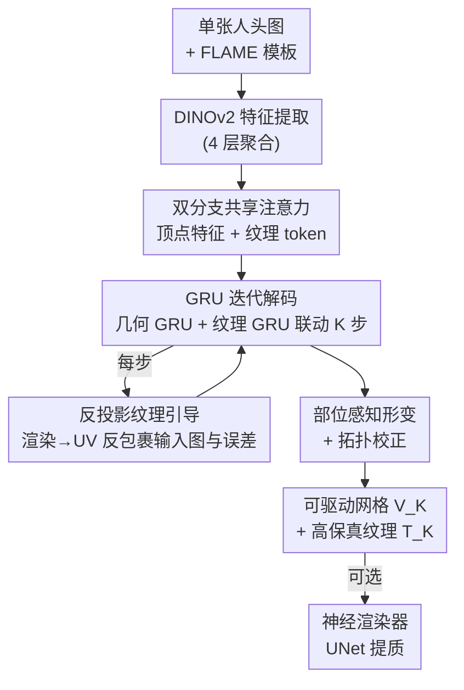

# Feed-Forward One-Shot Animatable Textured Mesh Avatar Reconstruction

**会议**: CVPR 2026  
**论文**: [CVF Open Access](https://openaccess.thecvf.com/content/CVPR2026/html/He_Feed-Forward_One-Shot_Animatable_Textured_Mesh_Avatar_Reconstruction_CVPR_2026_paper.html)  
**代码**: https://meshlam.github.io （项目主页）  
**领域**: 3D视觉  
**关键词**: 单图重建, 可驱动头像, 网格头像, FLAME, 前馈Transformer

## 一句话总结
MeshLAM 用一个前馈 Transformer 从单张图像一次性重建出带高保真纹理、可直接驱动的 3D 头部网格头像，靠"形状/纹理双分支 + GRU 迭代解码 + 输入图反投影引导纹理"三招，避免了测试时优化与网格塌陷，质量和速度都超过基于高斯的 LAM。

## 研究背景与动机
**领域现状**：从单张图像生成可驱动 3D 头像是 VR、游戏、数字人的核心需求。当前主流是两条路：2D 路线（GAN/扩散直接合成）和 3D 路线（3DMM 网格、NeRF、3D Gaussian Splatting）。最近 LAM 这类工作用前馈 Transformer 在 FLAME 先验上解码可驱动的高斯头像，省掉了逐人优化。

**现有痛点**：2D 方法没有显式 3D 结构，大姿态/大表情下会扭曲、掉 identity，也做不到自由视角；NeRF 方法多需多视角或单人视频监督，难以泛化到没见过的身份；基于高斯的前馈方法（LAM）则有两个硬伤——要表达发丝、纹身、文字这种细粒度外观，得堆海量高斯基元，训练推理开销暴涨；而且单次前馈里很难优化好这么多高斯，结果往往糊、缺高频细节。已有的 mesh-3DMM 重建又只覆盖脸部，恢复不了头发/头饰，纹理也不够细。

**核心矛盾**：表达力（细节纹理）和效率/稳定性（前馈一次成形、不塌陷）之间存在 trade-off。高斯把几何和外观混在一起，要细节就得加基元；而朴素地直接回归每顶点位移又会在大形变区域（长发、头饰）导致网格塌陷、拓扑崩坏。

**本文目标**：单图、前馈、一次成形地重建出**完整覆盖头发头饰、带高保真纹理、且天生可驱动**的网格头像。

**切入角度**：网格表示天然把重建解耦成"几何（顶点）+ 外观（纹理图）"两个域——几何只需稀疏顶点，外观用一张紧凑 UV 纹理图存高频信息，二者各管各的，效率和优化都更友好。但要让这个解耦稳定工作，得解决直接位移回归的不稳定性。

**核心 idea**：用形状/纹理双分支共享 Transformer 解耦建模，再用 GRU 迭代解码做 coarse-to-fine 形变与纹理细化，并把输入图反投影到当前网格的 UV 空间，给纹理（和几何）提供直接视觉证据，形成 2D 观测 ↔ 3D 几何的闭环。

## 方法详解

### 整体框架
输入单张人头图，输出一个可驱动的带纹理 3D 头部网格（顶点形变 + UV 纹理图），全程一次前馈、无测试时优化。流程是：DINOv2 抽多尺度图像特征 → 形状分支和纹理分支各自以 FLAME 模板为条件、通过共享 cross-attention 从图像特征里取信息 → 进入 K 步 GRU 迭代解码，每步同时更新几何（顶点位移）和纹理图，并穿插拓扑校正与"输入图反投影到 UV"的视觉引导 → 迭代收敛后得到最终网格 $V_K$ 和纹理图 $T_K$，可选再接一个神经渲染器提质。

### 关键设计

**1. 双形状-纹理分支：把几何和外观解耦，又共享同一套图像注意力**

针对"高斯把几何外观混在一起、要细节就堆基元"的痛点，本文用两条分支分工：形状分支以 FLAME 初始顶点 $V_0$ 加位置编码得到顶点特征 $F_V$，纹理分支以一张和 FLAME UV 对齐的可学习 token 网格 $T_0 \in \mathbb{R}^{H_t \times W_t \times C_t}$ 作为查询。两条分支共用同一叠 $L_A$ 层 cross-attention，都去注意同一份图像特征 $F_I$：

$$F_{V_i} = \mathcal{A}_i(F_{V_{i-1}}, F_I), \qquad F_{T_i} = \mathcal{A}_i(F_{T_{i-1}}, F_I)$$

这样几何只用稀疏顶点（最终约 8K）建模，外观用一张紧凑 UV 纹理图存高频细节（发丝、纹身、文字），二者解耦但因共享注意力而协同。和高斯方法相比，它不需要把外观细节压进几何里——纹理图天然适合存高频信息，所以 8K 顶点就能压过 LAM 用 80K 高斯还糊的结果。

**2. GRU 迭代解码：把"一次性回归"换成 coarse-to-fine，专治网格塌陷**

直接用一个解码器从 $F_V$ 回归顶点位移，在长发等大形变区域顶点会无约束地乱跑，误差传播导致网格扭曲甚至拓扑塌陷。本文改用循环的 GRU 更新算子，几何和纹理各一个 GRU，迭代 $T$ 步。几何 GRU 从全零位移场 $\Delta V_0$ 出发，逐步累加：

$$\Delta V_{t+1} = \text{GRU}_\text{geo}([\psi(\vartheta(V_t), F_{d_t2v}), F_V], h_t^\text{geo}), \qquad V_{t+1} = V_t + \Delta V_{t+1}$$

其中 $\vartheta$ 是位置编码、$\psi$ 是 MLP、$F_{d_t2v}$ 是投影到顶点空间的视觉预测误差、$h_t^\text{geo}$ 记录形变历史。纹理 GRU 同步细化纹理图。每步带着上一步隐状态做小步更新，等于把一次大跳变拆成多次受控小更新，从 FLAME 模板平滑地逐步逼近目标几何。消融显示去掉 GRU 直接单次回归会塌陷，且**两次迭代是性价比最优**（再多收益饱和）。

**3. 反投影纹理引导：把输入图反包裹到当前网格 UV，给纹理与几何直接视觉证据**

纯靠学到的先验合成纹理会糊，因为没有锚定到真实可观测外观。本文在每步迭代 $t$ 把当前网格 $M_t$ 按输入图表情驱动后光栅化，建立像素↔UV 对应，再把输入图反包裹（unwrap）进纹理空间：

$$U_t = \mathcal{U}(I_\text{input}, \mathcal{R}(M_t^\text{animated}))$$

$\mathcal{R}$ 是光栅化、$\mathcal{U}$ 是反包裹。纹理 GRU 把这张反包裹图 $U_t$、初始 DPT 解出的纹理潜特征 $F_a$、以及预测误差特征 $F_{d_t}$ 一起融合更新：

$$T_{t+1} = \text{GRU}_\text{tex}\big(\varphi([\varphi([T_t, U_t]), F_a, F_{d_t}]), h_t^\text{tex}\big)$$

其中误差特征由"输入图 / 渲染图 / 二者之差"三路拼接后卷积、再反包裹到 UV 得到：$F_{d_t} = \mathcal{U}(\varphi([I_\text{input}, I_\text{rendered}, I_\text{input}-I_\text{rendered}]))$。这就在 3D 几何和 2D 观测间形成闭环——几何越准、纹理投影越准、纹理引导又反过来帮几何形变收敛到光度一致解。可见区域直接抄输入图的真实外观，遮挡区域用学到的先验补全，因此既保真又能补全。

**4. 部位感知形变 + 拓扑校正：在"自由形变"和"可驱动/解剖正确"之间守底线**

长发头饰要大形变，但脸/眼必须保持可动画的解剖结构，二者不能用一把尺子。本文对位移 $\Delta V_t$ 做区域相关裁剪：头发允许大范围 $\delta_\text{hair}=0.08$，脖子 $\delta_\text{neck}=0.02$、脸部 $\delta_\text{face}=0.003$ 给中小范围，眼球眼睑顶点直接不动以保解剖正确。每步形变后再做拓扑校正：细分超长边三角形、翻转朝向不一致的面、删非法面；因为重网格化会改顶点连接，它还通过重心插值更新蒙皮权重 $W$ 与 blendshape $B$，并重算关节回归矩阵 $J = J(M + B_s(\beta))^{-1}$，保证拓扑变了骨骼驱动仍一致。这样既能做复杂非刚性形变，又不破坏网格完整性和驱动兼容性。

### 损失函数 / 训练策略
端到端训练，每步迭代用多项目标联合优化几何、纹理与语义：图像重建用像素 L2 + 感知损失 $\mathcal{L}_\text{img}$；轮廓用前景 mask 监督 $\mathcal{L}_\text{mask}$；几何用预训练法线网络给的伪 GT 监督渲染法线 $\mathcal{L}_\text{normal}$；语义部位用人脸解析做分割对齐 $\mathcal{L}_\text{part}$；再加 Laplacian 正则 $\mathcal{L}_\text{lap}$ 防顶点散乱/自交。单步加权和为 $\mathcal{L}_t = \lambda_i\mathcal{L}_\text{img} + \lambda_m\mathcal{L}_\text{mask} + \lambda_n\mathcal{L}_\text{normal} + \lambda_p\mathcal{L}_\text{part} + \lambda_l\mathcal{L}_\text{lap}$（权重 $1,1,1,0.5,2$），总损失对 $N$ 步做指数加权 $\mathcal{L}_\text{total} = \sum_{t=1}^{N}\gamma^{N-t}\mathcal{L}_t$（$N=2,\gamma=0.8$）。训练数据为 VFHQ（15,204 段视频、约 3M 帧），DINOv2 冻结，Transformer 仅 2 层 16 头、$C_t=1024$，100 epoch、Adam、cosine 退火。

## 实验关键数据

### 主实验
在 VFHQ 官方测试集上做 one-shot 头像重建与重演评估（首帧为源、后续帧给驱动信号）。指标 PSNR/SSIM/LPIPS/AKD/CSIM/FID 均在头部区域 mask 内计算。

| 3D 表示 | 方法 | PSNR↑ | SSIM↑ | LPIPS↓ | AKD↓ | CSIM↑ | FID↓ |
|---------|------|-------|-------|--------|------|-------|------|
| Mesh | ROME w/ UNet | 22.850 | 0.874 | 0.098 | 4.98 | 0.681 | 42.542 |
| Mesh | Ours w/o UNet | 23.180 | 0.859 | 0.073 | 3.58 | 0.935 | 23.688 |
| Mesh | **Ours w/ UNet** | **25.233** | **0.879** | **0.061** | 3.24 | **0.948** | 22.699 |
| Gaussian | LAM+FLAME | 25.082 | 0.879 | 0.077 | 2.07 | 0.879 | 24.270 |
| Gaussian | **LAM+Ours** | **25.889** | **0.893** | **0.050** | 2.02 | 0.898 | **22.576** |

关键看点：纯 mesh 设定下 Ours w/ UNet 全面压过另一 mesh 方法 ROME（PSNR 25.23 vs 22.85，CSIM 0.948 vs 0.681）；即便不接 UNet 也已很有竞争力且更高效；更有意思的是把本文重建的网格当几何先验喂给高斯方法（LAM+Ours），所有指标拿到全场最佳（PSNR 25.889、LPIPS 0.050），说明它的网格能当作下游表示的优质初始化。定性上仅 8K 顶点就能还原纹身/文字，而 LAM 用 80K 高斯仍糊。

### 消融实验
| 配置 | PSNR↑ | LPIPS↓ | FID↓ | 说明 |
|------|-------|--------|------|------|
| Ours-Full | 25.23 | 0.061 | 22.699 | 完整模型 |
| w/o Texture Map | 18.09 | 0.126 | 74.083 | 改用每顶点颜色，断崖式崩坏 |
| w/o GRU | 23.08 | 0.081 | 26.397 | 去迭代→单次回归，网格塌陷 |
| w/o Unwrapping | 22.98 | 0.089 | 29.428 | 去反投影引导，纹理变糊 |
| w/o P.A. Deform. | 22.72 | 0.096 | 32.405 | 去部位感知，脸部结构失真 |
| w/o UNet | 23.18 | 0.073 | 23.688 | 去可选神经渲染器 |
| GRU-1iter | 23.10 | 0.077 | 25.747 | 仅 1 步迭代 |
| GRU-2iter | 25.23 | 0.061 | 22.699 | 2 步（最优） |
| GRU-3iter | 25.38 | 0.063 | 23.431 | 3 步，PSNR 微升但 LPIPS/FID 反退 |

### 关键发现
- **纹理图表示是命门**：换成每顶点颜色后 PSNR 直接从 25.23 掉到 18.09、FID 飙到 74，证明高频外观（发丝/纹理）必须靠紧凑 UV 纹理图存，顶点色根本扛不住。
- **GRU 迭代是稳定性的来源**：去掉后单次回归直接网格塌陷；迭代步数上 2 步是甜点，3 步 PSNR 仅微升（25.38）但 LPIPS/FID 反而变差，再多就是浪费算力。
- **反投影 + 部位感知各司其职**：去反投影主要伤纹理清晰度（LPIPS 0.061→0.089），去部位感知主要伤几何/解剖合理性（PSNR 掉到 22.72），两者掉点维度不同、互补。
- **可当通用几何先验**：LAM+Ours 比 LAM+FLAME 全面更好，说明本文的价值不止于自身重建，还能给高斯等其他范式当更优初始化。

## 亮点与洞察
- **闭环反投影是点睛之笔**：每步把输入图按当前几何反包裹进 UV，让纹理合成始终锚定真实可观测像素、几何也被推向光度一致解——这套 2D↔3D 闭环可迁移到任何"前馈出几何 + 要贴真实纹理"的任务（如物体/全身重建）。
- **GRU 把大形变拆成小步更新**：用光流式 recurrent 更新算子做 coarse-to-fine 形变，是治"单次回归塌陷"的优雅解法，比加各种几何正则更直接。
- **稀疏 mesh + 紧凑纹理图打赢稠密高斯**：8K 顶点 vs 80K 高斯，把"几何/外观解耦"的效率优势用满，对算力敏感的部署场景很有启发。
- **重建网格可作下游先验**：LAM+Ours 拿全场最佳，说明一个好的 mesh 初始化能反哺高斯渲染，提示"mesh 打底 + 高斯提质"的混合范式。

## 局限性 / 可改进方向
- 几何先验绑死 FLAME 模板，对极端发型、夸张头饰或非人头（动物、卡通造型）的拓扑表达能力可能受限。⚠️ 论文未量化模板覆盖不到的失败情形。
- 反投影只在可见区域提供可靠纹理，**遮挡/背面区域**仍靠先验补全，文中也承认这部分依赖学到的 prior，侧面看真实度会弱于可见面。
- 评测主要在 VFHQ（访谈场景、正面为主），跨域只展示了 text-to-avatar / 风格迁移的定性结果，缺乏对大角度侧脸、低质输入的鲁棒性量化。
- 迭代步数固定为 2，对"难例需要更多步、易例可更少"的自适应迭代没探索，可考虑按收敛度动态决定步数。

## 相关工作与启发
- **vs LAM（前馈高斯头像）**：LAM 用 FLAME + 前馈 Transformer 解码可驱动高斯，但表达细节要堆海量高斯、单次前馈难优化导致糊。本文用 mesh 双分支解耦几何/外观，8K 顶点 + UV 纹理图就能存高频，效率与清晰度双赢；甚至能反过来给 LAM 当几何先验提质。
- **vs ROME（mesh-3DMM 重建）**：ROME 等 mesh 方法覆盖不到头发/头饰、纹理不够细。本文靠 GRU 迭代形变 + 反投影纹理引导，把网格扩到全头并贴上高保真纹理，PSNR/CSIM 大幅领先。
- **vs NeRF 类头像**：NeRF 方法多需多视角或单人视频、难泛化到新身份。本文单图前馈、秒级出可驱动网格，泛化与可用性更强，且天生拓扑完整、可直接 rig 驱动。

## 评分
- 新颖性: ⭐⭐⭐⭐⭐ mesh 双分支 + GRU 迭代 + 反投影闭环的组合，针对前馈头像重建的塌陷/糊两大痛点给出清晰解法。
- 实验充分度: ⭐⭐⭐⭐ 主实验 + 细致消融（含迭代步数、各模块）扎实，但评测集相对单一、跨域多为定性。
- 写作质量: ⭐⭐⭐⭐ 动机—机制—消融逻辑顺畅，公式排版有 OCR 噪声但原意清楚。
- 价值: ⭐⭐⭐⭐⭐ 单图秒级出可驱动高保真网格头像，且能当下游几何先验，落地价值高。

<!-- RELATED:START -->

## 相关论文

- [\[CVPR 2026\] MeshLAM: Feed-Forward One-Shot Animatable Textured Mesh Avatar Reconstruction](meshlam_feed-forward_one-shot_animatable_textured_mesh_avatar_reconstruction.md)
- [\[CVPR 2026\] FlexAvatar: Flexible Large Reconstruction Model for Animatable Gaussian Head Avatars with Detailed Deformation](flexavatar_flexible_large_reconstruction_model_for_animatable_gaussian_head_avat.md)
- [\[CVPR 2026\] Particulate: Feed-Forward 3D Object Articulation](particulate_feed-forward_3d_object_articulation.md)
- [\[CVPR 2026\] FUSER: Feed-Forward Multiview 3D Registration Transformer and SE(3)$^N$ Diffusion Refinement](fuser_feed-forward_multiview_3d_registration_transformer_and_se3n_diffusion_refi.md)
- [\[CVPR 2026\] Feed-forward Gaussian Registration for Head Avatar Creation and Editing](feed-forward_gaussian_registration_for_head_avatar_creation_and_editing.md)

<!-- RELATED:END -->
