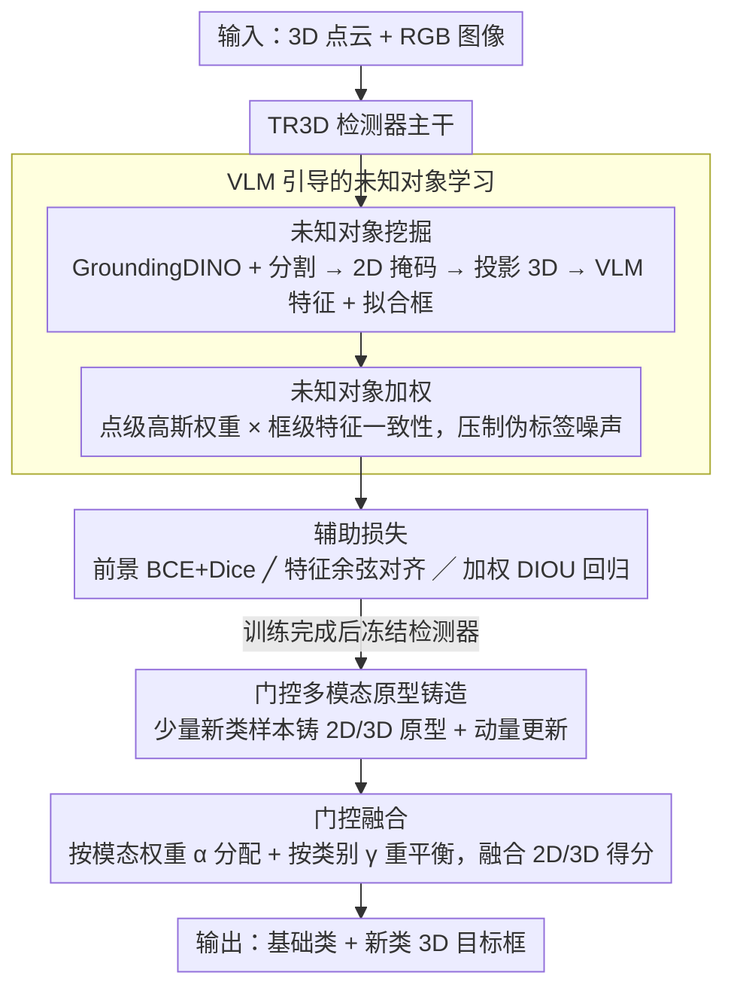

# Few-Shot Incremental 3D Object Detection in Dynamic Indoor Environments

**会议**: CVPR 2026  
**arXiv**: [2604.07997](https://arxiv.org/abs/2604.07997)  
**代码**: [https://github.com/zyrant/FI3Det](https://github.com/zyrant/FI3Det)  
**领域**: 3D视觉  
**关键词**: 少样本增量学习, 3D目标检测, 视觉语言模型, 多模态原型, 室内场景理解

## 一句话总结

提出 FI3Det，首个少样本增量 3D 目标检测框架：在基础训练阶段通过 VLM 引导的未知对象学习模块提前感知潜在新类别，在增量阶段通过门控多模态原型铸造模块融合 2D 语义和 3D 几何特征进行新类检测，在 ScanNet V2 和 SUN RGB-D 上的新类 mAP 平均提升 17.37%。

## 研究背景与动机

1. **领域现状**：3D 目标检测方法（如 VoteNet、TR3D、FCAF3D）在固定类别集上已取得很好性能，但都基于静态范式——假设所有类别标注在单次训练中可用。增量 3D 检测方法（SDCoT、AIC3DOD）能逐步识别新类，但仍需大量新类标注。
2. **现有痛点**：(a) 现有增量 3D 检测方法依赖丰富的新类标注，这在动态室内具身环境中不现实——新物体出现时很难立即获得大量标注；(b) 2D 领域已有少样本增量检测（ONCE、Sylph、IL-DETR），但 3D 领域完全空白；(c) 数据高效的 3D 检测方法（GFS-VL、MixSup）主要关注伪标签生成，忽略了特征级学习。
3. **核心矛盾**：在极少数新类样本条件下，如何既学会新类别又不遗忘已学类别？3D 室内场景中复杂的布局和多样的物体组合使得类间变化更大，加剧了这个矛盾。
4. **本文目标** (a) 定义并解决少样本增量 3D 目标检测新任务；(b) 在基础阶段建立对新类的早期感知能力；(c) 在增量阶段高效适应新类别同时保持旧类性能。
5. **切入角度**：作者观察到室内 3D 场景中新类物体往往已存在于训练场景中但没有标注（如 Fig. 2 所示，基础类旁常出现未标注的新类物体）。利用 VLM 的零样本识别能力可以在基础训练阶段就挖掘这些未知物体，建立对新类的早期认知。
6. **核心 idea**：基础阶段用 VLM 挖掘未标注的未知对象进行特征和框级学习，增量阶段用融合 2D 语义和 3D 几何的多模态原型实现少样本新类检测。

## 方法详解

### 整体框架

FI3Det 要解决的问题是：在动态室内环境里，只给极少数（如每类 5 个）新类样本，既要学会检测新物体、又不能忘掉已学过的基础类。它的核心观察是——新类物体其实早就出现在基础训练的场景里了，只是没被标注。于是整个方法被切成两个阶段：基础训练阶段提前"预习"这些未标注的新物体，增量阶段再用少量样本快速"认领"它们。

基础训练阶段在 TR3D 检测器之上挂一个 VLM 引导的未知对象学习模块：先用 VLM 把场景里没标注的物体挖出来当作辅助监督，再用一套加权机制压住这些伪标签里的噪声。增量阶段则把检测器主干完全冻住，只通过门控多模态原型铸造模块，用少量新类样本铸出 2D 语义 + 3D 几何两套原型，再自适应地融合出新类得分。整条管线的输入是 3D 点云场景加对应 RGB 图像，输出是对"基础类 + 新类"的 3D 目标框。

### 关键设计

**1. VLM 引导的未知对象学习：在基础阶段就让检测器"见过"未来的新类**

少样本增量最难的地方在于，新类样本太少，模型来不及学好特征。作者的破题点是：既然新类物体常常已经躺在训练场景里（只是没标注），那就趁基础训练把它们提前挖出来。具体分两步走。第一步是**未知对象挖掘**——用 GroundingDINO 生成 2D 框、再用类别无关的分割模型抠出 2D 掩码 $\mathbf{M}^{2D}$，把掩码投影回 3D 得到 $\mathbf{M}^{3D}$，对每个实例算出平均 VLM 特征 $\mathbf{f}_j^{2D}$ 和拟合的 3D 框 $\mathbf{b}_j^{3D}$；同时给检测器加一个 objectness head（学前景感知）和一个 feature head（把 3D 特征对齐到 VLM 的 2D 语义空间）。这样检测器在基础阶段就被迫去关注那些"还没名字"的物体，等增量阶段真给新类样本时，特征已经预热好了。

第二步是**未知对象加权**，专门对付 VLM 伪标签里的噪声。它从空间和语义两个角度过滤：点级加权用高斯函数让靠近框中心的点权重更高，

$$w_{e,j}^{point} = \exp\!\left(-\frac{\|\mathbf{p}_e - \mathbf{c}_j\|_2^2}{2\sigma^2}\right)$$

背后的直觉是分割掩码在物体边缘最容易错，越靠中心越可信；框级加权则衡量框内特征一致性，

$$w_j^{box} = \left\|\frac{1}{|\mathcal{B}_j|}\sum_{e\in\mathcal{B}_j}\text{norm}(\hat{\mathbf{f}}_e^{2D})\right\|_2$$

如果框内各点特征方向高度一致，归一化向量求和的模长就大、框就更可靠。两级权重一乘，把"几何上是边缘"和"语义上不纯"的脏框都压了下去。

**2. 门控多模态原型铸造：用少量样本铸原型，而不是重训检测器**

到了增量阶段，如果还去微调检测器，几个样本根本压不住灾难性遗忘。作者干脆把检测器冻死，改用"铸原型"的轻量方式：从对齐后的 2D 特征 $\hat{\mathbf{F}}^{2D}$ 和 3D 几何特征 $\mathbf{F}^{3D}$ 分别铸出模态特异的原型 $\mathbf{T}^{2D}$、$\mathbf{T}^{3D}$，并用动量更新 $\mathbf{T}_c^{3D} \leftarrow \mu \mathbf{T}_c^{3D} + (1-\mu)\bar{\mathbf{F}}_c^{3D}$（$\mu=0.999$）稳住只有几个样本时极不稳定的原型估计。分类时各模态先各算一套余弦相似度得分 $\mathbf{S}^{3D}$、$\mathbf{S}^{2D}$。

关键在于怎么融合这两套得分。直接相加会忽略两种模态各自的脾气——3D 几何擅长定位、2D 语义擅长辨认。作者改用两组可学习门控：一组 $[\alpha^{3D}, \alpha^{2D}] = \text{Softmax}(\text{MLP}([\mathbf{F}^{3D}; \hat{\mathbf{F}}^{2D}]))$ 按当前物体动态分配两个模态的权重，另一组 $\gamma = \sigma(\text{MLP}([\mathbf{F}^{3D}; \hat{\mathbf{F}}^{2D}]))$ 在类别维度上重新平衡，专门压住某些类别上的过度自信。最终得分是

$$\mathbf{S}^{fuse} = \gamma \odot (\alpha^{3D} \odot \mathbf{S}^{3D} + \alpha^{2D} \odot \mathbf{S}^{2D})$$

消融里 $\alpha$ 单用能把 Novel mAP 从 32.46 拉到 36.58，再叠 $\gamma$ 到 38.48，说明"按模态分权"是主力、"按类别重平衡"是补刀。

**3. 辅助损失：把"会找前景、会对语义、会定位"三件事一起教给检测器**

未知对象学习要真正起效，得让检测器在基础阶段同时具备三种能力，所以辅助监督拆成三路。前景监督 $\mathcal{L}_{obj}$ 用 BCE + Dice loss 训练 objectness head，喂的是加权后的连续前景分数而不是硬标签，因为伪标签本身不确定，硬标签会把噪声放大。特征监督 $\mathcal{L}_{feat}$ 用余弦相似度损失把检测器的 3D 特征拉向 VLM 的 2D 语义特征——这正是增量阶段两套原型能对齐的前提。回归监督 $\mathcal{L}_{reg}^{unk}$ 用加权 DIOU loss 学未知对象的几何框。三路损失都乘上前面那套点级 + 框级联合权重，所以越脏的伪框对训练的影响越小。三种能力缺一不可：缺前景感知就挖不出物体，缺语义对齐增量阶段原型匹配不上，缺定位则框不准。

### 一个完整示例

设想基础训练时遇到一个客厅场景，里面有标注好的 sofa、table（基础类），角落还摆着一把没标注的 chair（未来的新类）。挖掘阶段，GroundingDINO + 分割模型把这把 chair 框出来、抠出掩码并投到 3D，算出它的 VLM 特征和拟合框；加权阶段，因为掩码边缘那几个点离框中心远、高斯权重低，框内特征又相当一致、框级权重高，于是这把 chair 被当作一个"较可靠的未知对象"参与辅助损失——检测器虽然不知道它叫 chair，但已经学会了"这里有个独立物体，它的几何长这样、语义特征长那样"。

到了增量阶段，用户只给 5 张带 chair 标注的样本。系统不重训检测器，而是把这 5 个 chair 的 2D、3D 特征分别动量更新进原型 $\mathbf{T}^{2D}$、$\mathbf{T}^{3D}$。测试时再来一个新客厅，某个候选框同时和 chair 的两套原型算相似度：3D 几何得分中等、2D 语义得分很高，门控据此给 2D 分更大的 $\alpha$、再用 $\gamma$ 压一压它在 sofa 类上的虚高置信，最终把这个框正确判成 chair。整条链路里检测器参数始终没动，新类就被"认领"了进来。

### 损失函数 / 训练策略

基础训练总损失 $\mathcal{L} = \mathcal{L}_{det} + \mathcal{L}_{aux}$，其中辅助项 $\mathcal{L}_{aux} = \mathcal{L}_{aux-obj} + \mathcal{L}_{aux-feat} + \mathcal{L}_{aux-box}$ 即上面三路监督。增量阶段冻结检测器全部参数，只更新原型与门控函数，用 $\mathcal{L}_{inc}$ 在少量新类样本上训练。

## 实验关键数据

### 主实验

ScanNet V2 批量增量设置（1-way 5-shot）：

| 方法 | Base mAP | Novel mAP | All mAP |
|------|----------|-----------|---------|
| Imprinting | 71.47 | 0.23 | 67.72 |
| IL-DETR | 65.63 | 0.35 | 62.00 |
| SDCOT++ | 62.12 | 0.09 | 58.68 |
| AIC3DOD | 70.54 | 4.59 | 66.88 |
| VLM-vanilla | 71.81 | 14.09 | 68.60 |
| **FI3Det** | **72.84** | **38.48** | **70.94** |

SUN RGB-D 批量增量设置（1-way 5-shot）：

| 方法 | Base mAP | Novel mAP | All mAP |
|------|----------|-----------|---------|
| AIC3DOD | 58.83 | 0.02 | 52.95 |
| VLM-vanilla | 62.12 | 11.93 | 57.10 |
| **FI3Det** | **63.05** | **73.17** | **64.07** |

### 消融实验

| 配置 | Base | Novel | All | 说明 |
|------|------|-------|-----|------|
| VLM-vanilla (baseline) | 71.81 | 14.09 | 68.60 | 无本文模块 |
| + UOM | 72.73 | 25.43 | 70.10 | +未知对象挖掘，Novel +11.34 |
| + UOM + UOW | 72.83 | 32.46 | 70.61 | +加权，Novel +7.03 |
| + UOM + GPI | 72.73 | 28.94 | 70.30 | +门控原型 |
| + UOM + UOW + GPI (Full) | 72.84 | 38.48 | 70.94 | 完整模型，Novel最优 |

门控组件消融：

| 配置 | Novel mAP | 说明 |
|------|-----------|------|
| 无门控 | 32.46 | 直接求和 |
| 仅 $\alpha^*$ | 36.58 | +模态权重，+4.12 |
| 仅 $\gamma$ | 34.68 | +类别重平衡 |
| $\alpha^*$ + $\gamma$ | 38.48 | 最优组合 |

### 关键发现

- **UOM 贡献最大**：未知对象挖掘从 14.09% 提升到 25.43%（+80%），证明在基础阶段建立对新类的早期认知是关键。
- Base 类性能在所有变体中保持稳定（~72.8%），说明基于原型铸造的策略有效避免了灾难性遗忘。
- 在 SUN RGB-D 1-way 5-shot 设置下，FI3Det 的 Novel mAP（73.17%）甚至超过了 Base mAP（63.05%），显示出极强的新类适应能力。
- 超参数 $\sigma=0.5$、$\mu=0.999$ 是最优配置，$\mu$ 越大性能越好说明动量稳定化对少样本原型至关重要。

## 亮点与洞察

- **Base 阶段的未知对象学习**是一个非常巧妙的思路：新类物体往往已经出现在训练场景中但没标注，利用 VLM 挖掘这些"暗物质"让检测器提前具备新类感知能力。这个观察及其利用方式可以迁移到任何增量学习或开放世界检测任务中。
- **两级加权（点级+框级）**对噪声伪标签的处理很实用：高斯空间加权和特征一致性加权分别从空间和语义角度过滤噪声，这是一个可复用的 trick。
- **多模态门控融合**相比简单加权或拼接更灵活，$\gamma$ 门控可以抑制某些类别上某个模态的过度自信预测，有效提升鲁棒性。

## 局限与展望

- 当前 VLM（GroundingDINO）的检测能力限制了未知对象挖掘的质量，随着更强 VLM 出现，上限可能进一步提升。
- 实验限于室内场景（ScanNet V2、SUN RGB-D），室外自动驾驶等大尺度场景尚未验证。
- 增量阶段冻结检测器参数意味着检测器的特征表示不会针对新类进一步优化，可能在新类与基础类分布差异很大时受限。
- 原型铸造方法对每类只有一个原型，是否可以像 FedMEPD 那样使用多原型来捕获类内变化？

## 相关工作与启发

- **vs SDCoT++**: SDCoT++ 是增量 3D 检测的先驱但需要大量新类标注，在少样本设置下性能急剧下降（Novel mAP 0.09%）。FI3Det 通过原型铸造避免了大规模再训练。
- **vs AIC3DOD**: AIC3DOD 在全增量设置下表现不错，但在少样本下（Novel 4.59%）远不如 FI3Det（38.48%），因为缺乏 VLM 引导的预训练和多模态融合。
- **vs VLM-vanilla**: 直接使用 VLM 伪框但不做加权和多模态融合时 Novel 为 14.09%，FI3Det 的加权和门控融合将其提升到 38.48%，证明噪声处理和多模态融合的重要性。

## 评分

- 新颖性: ⭐⭐⭐⭐ 首次定义并解决少样本增量 3D 检测任务，VLM 引导的基础阶段未知对象学习思路新颖
- 实验充分度: ⭐⭐⭐⭐⭐ 两个数据集，批量和序列两种增量设置，多组消融，超参分析完整
- 写作质量: ⭐⭐⭐⭐ 问题定义清晰，方法描述详细，图示丰富
- 价值: ⭐⭐⭐⭐ 为具身智能中的动态环境感知开辟了新研究方向

<!-- RELATED:START -->

## 相关论文

- [\[CVPR 2026\] SCOPE: Scene-Contextualized Incremental Few-Shot 3D Segmentation](scope_scene-contextualized_incremental_few-shot_3d_segmentation.md)
- [\[CVPR 2026\] Zoo3D: Zero-Shot 3D Object Detection at Scene Level](zoo3d_zero-shot_3d_object_detection_at_scene_level.md)
- [\[CVPR 2026\] H²A²: Homogeneity-Aware and Heterogeneity-Aware Feature Perception for Unified Indoor 3D Object Detection](h2a2_homogeneity-aware_and_heterogeneity-aware_feature_perception_for_unified_in.md)
- [\[CVPR 2026\] AdaSFormer: Adaptive Serialized Transformers for Monocular Semantic Scene Completion from Indoor Environments](adasformer_adaptive_serialized_transformers_for_monocular_semantic_scene_complet.md)
- [\[CVPR 2026\] VGGT-Det: Mining VGGT Internal Priors for Sensor-Geometry-Free Multi-View Indoor 3D Object Detection](vggt-det_mining_vggt_internal_priors_for_sensor-geometry-free_multi-view_indoor_.md)

<!-- RELATED:END -->
