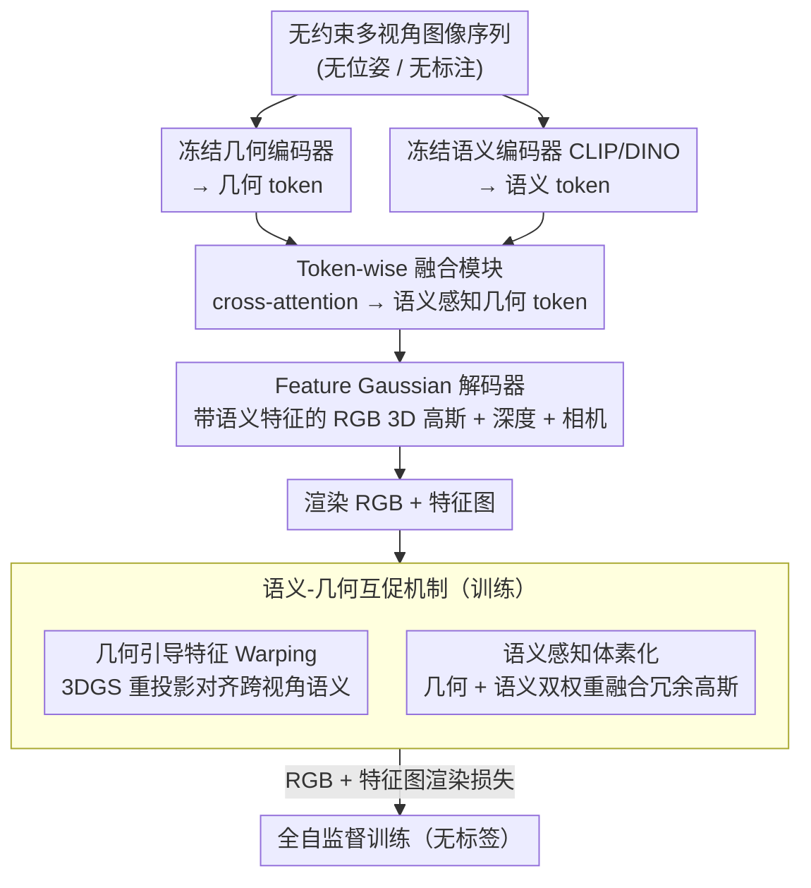

# FF3R: Feedforward Feature 3D Reconstruction from Unconstrained Views

**会议**: CVPR 2026  
**arXiv**: [2604.09862](https://arxiv.org/abs/2604.09862)  
**代码**: [https://chaoyizh.github.io/ff3r_project](https://chaoyizh.github.io/ff3r_project)  
**领域**: 3D视觉  
**关键词**: 3D重建, 语义理解, 前馈架构, 3D高斯, 无标注训练

## 一句话总结

FF3R是首个完全无标注的前馈框架，能从无约束多视角图像序列中同时进行几何重建和开放词汇语义理解，处理64+张图像的速度比优化方法快180倍。

## 研究背景与动机

**领域现状**：几何重建和语义理解是3D视觉的两大支柱，但将两者分割为独立框架导致冗余流水线和累积误差。

**现有痛点**：(1) 依赖语义标注的方法受限于固定类别数和标注成本；(2) 无标注方法面临全局语义不一致（2D基础模型缺乏多视角几何先验）和局部结构不一致（高斯融合跨越语义边界）两个核心挑战。

**核心矛盾**：几何基础模型通过光度损失自监督训练，语义基础模型需要标注或知识蒸馏——两种训练范式的差异使统一系统的构建非常困难。

**本文目标**：构建仅依赖RGB和特征图渲染监督的全自监督前馈框架。

**切入角度**：通过Token级融合注入语义上下文到几何token，通过语义-几何互促机制解决一致性问题。

**核心idea**：几何引导语义对齐（解决全局不一致）+语义感知体素化（解决局部不一致）。

## 方法详解

### 整体框架

FF3R 想做的事是：给一串没有位姿、没有标注的多视角图像，一次前馈就同时吐出几何（深度、相机、3D 高斯）和开放词汇语义，而且能吃下 64 张以上的长序列。整条流水线先用两个冻结的预训练编码器分别抽几何 token 和语义 token，再让它们在 token 层面交换信息，解码出 pixel-aligned 的特征，最后预测一组带语义特征的 RGB 3D 高斯连同深度和相机参数。关键在于训练时不碰任何标签——几何用光度损失自监督，语义则靠几何先验把特征跨视角对齐，两边互相借力，构成「语义-几何互促」的闭环。

### 关键设计

**1. Token-wise 融合模块：在表征层把语义灌进几何 token**

几何编码器只懂结构、语义编码器只懂类别，若各算各的再做后处理拼接，两种信息始终是两张皮，深层交互无从谈起。FF3R 在 token 层用 cross-attention 让几何 token 去查询语义 token，把语义上下文直接注入到几何表征里，输出一批「语义感知的几何 token」，后续所有 3D 解码（高斯、深度、相机）都建立在这批融合后的 token 之上。因为融合发生在表征早期而非结果晚期，几何与语义从一开始就共享同一套上下文，这也是后面互促机制能成立的前提。

**2. 几何引导特征 Warping 损失：用几何先验把跨视角语义拉齐**

CLIP/DINO 这类 2D 基础模型都是在单张图上训练的，没有多视角几何概念，于是同一个物体换个视角就可能给出不一致的特征——这就是「全局语义不一致」。FF3R 的对策是反过来用已经重建好的几何当裁判：既然 3D 高斯能重投影，那么观察同一个 3D 点的两个视角，其语义特征理应相同。具体做法是把当前视角的语义特征通过 3DGS warp 到另一个新视角再渲染出特征图，与该视角实际特征算损失，强制不同视角对同一表面给出一致语义。几何在这里不只是输出，还成了监督语义对齐的信号源。

**3. 语义感知体素化：融合冗余高斯时别跨过语义边界**

长序列里视角一稠密，高斯基元数量就爆炸，必须做体素化融合压缩。但传统融合只看几何置信度，会把空间上挨得近、语义却分属不同物体的高斯合并到一起，结果边界处语义糊成一片——这是「局部结构不一致」。FF3R 在融合权重里同时纳入几何置信度和语义一致性，只有几何相邻且语义相容的高斯才会被合并，从而在压缩冗余的同时守住类别边界。这一步保证了长序列下既不爆显存、又不丢语义结构。

### 损失函数 / 训练策略

完全无标注：只用 RGB 渲染损失（光度一致性）+ 特征图渲染损失（语义一致性）两项监督，不需要相机位姿、深度图或语义标签。语义对齐由设计 2 的几何引导 warping 提供，几何稳定性又反过来受益于设计 3 守住的语义边界，整个训练在一个自监督闭环里完成。

## 实验关键数据

### 主实验

| 任务/数据集 | 指标 | FF3R | 之前SOTA | 提升 |
|------------|------|------|----------|------|
| ScanNet NVS | PSNR/SSIM | SOTA | - | 显著 |
| ScanNet语义分割 | mIoU | SOTA | - | 显著 |
| DL3DV-10K深度估计 | 误差 | SOTA | - | 显著 |

### 消融实验

| 配置 | 关键指标 | 说明 |
|------|---------|------|
| 无Token融合 | 语义质量下降 | 几何-语义交互缺失 |
| 无几何引导Warping | 跨视角不一致 | 全局语义对齐失败 |
| 无语义感知体素化 | 局部边界模糊 | 跨类别高斯合并 |
| 完整FF3R | 最优 | 两个设计互补 |

### 关键发现

- FF3R能处理64+张图像，而之前SOTA方法仅能处理6张——可扩展性提升10倍以上
- 运行速度比优化方法快180倍，前馈架构的效率优势在长序列上更为显著
- 在野外场景中的泛化能力强，证明了无标注训练范式的可扩展性

## 亮点与洞察

- **完全无标注的训练范式**：仅依赖RGB和特征图渲染监督，真正实现了从任意野外图像中学习
- **可扩展到64+图像的前馈处理**：打破了之前方法的输入限制，为实际应用铺平道路
- **语义-几何互促的双向增益**：几何帮助语义对齐，语义帮助几何融合——两者的交互产生了超越单向传递的效果

## 局限与展望

- 依赖2D基础模型（CLIP/DINO）的特征质量
- 体素化可能引入量化误差
- 未在动态场景中验证

## 相关工作与启发

- **vs LSM**: LSM是首个无标注前馈方法但缺乏几何-语义深层交互，无法扩展到长序列
- **vs SceneSplat**: SceneSplat依赖大规模SAM2标注数据，FF3R完全无标注

## 评分

- 新颖性: ⭐⭐⭐⭐ 完全无标注+长序列前馈的首次实现
- 实验充分度: ⭐⭐⭐⭐ ScanNet和DL3DV上全面评估
- 写作质量: ⭐⭐⭐⭐ 问题分析清晰
- 价值: ⭐⭐⭐⭐⭐ 为统一3D理解开辟了可扩展路径

<!-- RELATED:START -->

## 相关论文

- [\[ICLR 2026\] UFO-4D: Unposed Feedforward 4D Reconstruction from Two Images](../../ICLR2026/3d_vision/ufo-4d_unposed_feedforward_4d_reconstruction_from_two_images.md)
- [\[CVPR 2025\] Pow3R: Empowering Unconstrained 3D Reconstruction with Camera and Scene Priors](../../CVPR2025/3d_vision/pow3r_empowering_unconstrained_3d_reconstruction_with_camera_and_scene_priors.md)
- [\[ICML 2025\] PhysicsNeRF: Physics-Guided 3D Reconstruction from Sparse Views](../../ICML2025/3d_vision/physicsnerf_physics-guided_3d_reconstruction_from_sparse_views.md)
- [\[ECCV 2024\] TrackNeRF: Bundle Adjusting NeRF from Sparse and Noisy Views via Feature Tracks](../../ECCV2024/3d_vision/tracknerf_bundle_adjusting_nerf_from_sparse_and_noisy_views_via_feature_tracks.md)
- [\[CVPR 2026\] Learning 3D Reconstruction with Priors in Test Time](tco_learning_3d_reconstruction_with_priors_in_test_time.md)

<!-- RELATED:END -->
