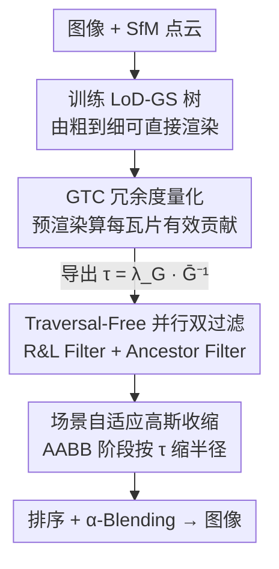

# FilterGS: Traversal-Free Parallel Filtering and Adaptive Shrinking for Large-Scale LoD 3D Gaussian Splatting

**会议**: CVPR 2026  
**论文**: [CVF Open Access](https://openaccess.thecvf.com/content/CVPR2026/html/Wang_FilterGS_Traversal-Free_Parallel_Filtering_and_Adaptive_Shrinking_for_Large-Scale_LoD_CVPR_2026_paper.html)  
**代码**: https://github.com/xenon-w/FilterGS  
**领域**: 3D视觉  
**关键词**: 3D高斯泼溅, Level-of-Detail, 大场景渲染加速, 并行过滤, 冗余键值对裁剪  

## 一句话总结
FilterGS 把大场景 LoD 3DGS 渲染里两个最拖速度的环节——逐层串行遍历选 Gaussian、以及海量无效的 Gaussian-tile 键值对——分别用「免遍历并行双过滤器」和「按场景拥挤度自适应收缩 Gaussian」干掉，在 6 个大场景上把渲染速度推到接近 300 FPS（比次优快一大截），同时重建质量与 SOTA 持平。

## 研究背景与动机
**领域现状**：3DGS 用一堆各向异性 3D 高斯基元显式表示场景，靠可微光栅化实现实时渲染。但大场景（公里级、几千万高斯）下基元数量爆炸，直接全量光栅化扛不住，于是主流走 Level-of-Detail（LoD）路线——把场景组织成由粗到细的高斯树，每帧只挑出满足视点相关精度的一小撮高斯来渲染（如 Octree-GS、FLoD、LoG、Hierarchical-GS）。

**现有痛点**：作者实测发现 LoD 方法虽然控制住了渲染的高斯数量，却被两件事拖垮。其一是**层级遍历昂贵**：从树根逐层往下做半径/子节点判据来挑高斯，时间随树深线性增长，某些场景里光这步就吃掉 60% 以上的渲染时间；neural-Gaussian 类方法还要去邻居节点取属性，更慢。其二是**冗余 Gaussian-tile 键值对**：LoD 的多层结构在光栅化前端生成海量高斯-瓦片配对，其中 70%+ 对最终图像几乎没贡献，虽然在 α-blending 时被跳过，但排序、预处理这些前置开销一分不少地照付。

**核心矛盾**：现有缓解手段都不对症。FlashGS 那种**固定阈值收缩**在大场景里裁不干净，残留大量冗余对；而 learning-based 的逐高斯收缩系数在 LoD 树上会引发层级切换伪影和过拟合——因为 LoD 树不同层节点尺寸差异巨大，按单个高斯学一个系数根本镇不住这种异质性。

**本文目标**：在不退化质量的前提下，同时砍掉「串行遍历开销」和「冗余键值对开销」这两个 LoD 渲染瓶颈。

**切入角度**：作者的两个关键观察是——(1) 逐层遍历本质上是被树深 $L$ 串行依赖绑死的，如果能用一个判据让所有层同时判定「该不该保留」，就能把 $O(L)$ 的层间同步开销压成常数；(2) 一个高斯到底冗不冗余，应该由它对图像的**有效像素贡献**说了算，而场景越拥挤、平均贡献越低，就越该激进收缩。

**核心 idea**：用「免遍历并行双过滤器」一步选出每条分支唯一该渲染的高斯，再用「随场景拥挤度反比自适应」的收缩阈值把冗余键值对主动裁掉。

## 方法详解

### 整体框架
FilterGS 接收大场景的多视图图像和 SfM 点云，分三段跑通。第一段**训练 LoD-GS 树**：按经典递归构造，父节点 $v$ 沿带朝向的偏移 $o_k\in\{\pm \tfrac{s_{x,v}}{2},\pm \tfrac{s_{y,v}}{2},\pm \tfrac{s_{z,v}}{2}\}$ 放子节点 $\mu_{u_k}=\mu_v+R(q_v)o_k$，子节点几何级数缩小 $s_{u_k}=\gamma s_v$（$0<\gamma<1$），朝向/颜色/不透明度直接继承父节点——这样每个节点都是完整可直接光栅化的标准高斯，由粗到细。第二段**预渲染算收缩阈值**：在所有训练视图上跑一遍标准 3DGS 管线，统计本文提出的 GTC 冗余度指标 $\bar G$，导出场景自适应收缩阈值 $\tau=f(\bar G)$。第三段**正式渲染**：预先算好的 $\tau$ 和树模型送进两个专用过滤器并行选出当帧高斯，这些高斯在形成 AABB 时按 $\tau$ 被自适应缩小，从而在最终排序与 α-blending 之前就大幅减少冗余键值对。

### 关键设计

**1. Traversal-Free 并行双过滤：用两步并行判定取代逐层串行遍历**

这是针对「层级遍历吃掉 60% 渲染时间」的痛点。原来 LoG/FLoD 之类从 level=0 开始逐层施加半径与子节点（R&C）规则，时间 $T_{serial}=\sum_{\ell=0}^{L-1}\big(T_{calcu.}(n_\ell)+T_{synch.}\big)$，被树深 $L$ 的串行依赖和层间核同步开销死死绑住。FilterGS 把判定拆成两个互补、可对所有层同时施加的过滤器，写进一个统一 CUDA kernel 并行跑。

- **R&L（Radius & Leaf）Filter**：对视锥内每个高斯算 2D 协方差 $\Sigma_{2D}$，取其特征值 $\sigma$ 得屏幕空间像素半径 $R_{2D}=3\sigma$，与阈值 $\tau_R$（设为 3）比较。$R_{2D}\le\tau_R$ 说明该节点对当前帧已足够精细，保留（$\tau_R$ 越小选的基元越细、细节越清晰）。但只按半径裁会把「整条都是大半径高斯」的分支误删出现空洞，所以**所有叶子节点豁免阈值、至少保留一次**，保证每条分支不会被裁空。
- **Ancestor Filter**：R&L 可能在同一分支上跨层保留多个节点（祖先内部节点和它的后代都满足半径阈值）。于是给每个节点 $N_{i,j}$ 预存祖先路径 $AP_{i,j}$（从直接父节点直到根的有序序号列表）；一旦某内部节点 $N_{i^*,j^*}$ 通过 R&L，所有以它为祖先的后代节点（含被暂存的叶子）都顺着各自 $AP$ 被剔除。这保证「凡是有合格粗节点的分支，最终只留一个最高层级的高斯节点」，去掉同分支多层冗余。

并行化后过滤时间变成 $T_{parallel}=T_{synch.}+T_{calcu.}(N)$，**只跟视锥内高斯总数 $N$ 有关、与树深 $L$ 解耦**，并最大化 GPU SIMD 并发——哪怕几千万高斯也只多加一个近似常数的边际开销。关键是它选出的高斯集合与逐层遍历**完全一致**（生成键值对数、PSNR、SSIM 全等），所以提速零质量损失。

**2. GTC 冗余度量：用「每个高斯的有效像素贡献」量化哪些键值对该裁**

这是为自适应收缩提供「该裁多狠」的依据。作者自下而上定义了一串可量化指标：

- **键值对贡献 KPC**：一个高斯-瓦片对 $g_k\to t_i$ 的贡献定义为它在该瓦片内所有像素上的加权不透明度之和 $K^{t_i}_{g_k}=\sum_{j=1}^{B_x\times B_y}\alpha_{ij}T_{ij}$，其中 $\alpha_{ij}$ 是 $g_k$ 在像素 $j$ 的不透明度、$T_{ij}$ 是其前的透射率。它可解读为「$g_k$ 在 $t_i$ 内实际影响的有效像素数」；**KPC < 0.01 即判为冗余对**。
- **瓦片级 GTC**：瓦片 $t_i$ 内所有影响它的高斯的平均 KPC，$G_i=\tfrac{1}{n_{gs}}\sum_{j=1}^{n_{gs}}K^{t_i}_{g_j}$。$G_i$ 低说明「高斯拥挤」——瓦片里塞了一堆个体贡献微乎其微的冗余高斯；而真正半透明区域（树叶、栅栏）虽然单个不透明度低但总 KPC 高，是必要的。GTC 因此能把**几何冗余**和**必要的低透明区域**区分开。
- **视图级 / 场景级**：对一视图所有瓦片取均值得 $\bar G_v=\tfrac{1}{n_{tile}}\sum_j G_j$（每瓦片等权，避免被极高密度瓦片主导），再对 $N$ 张图取均值得场景级 $\bar G$。

**3. 场景自适应高斯收缩：阈值与场景拥挤度成反比，越挤裁越狠**

针对「固定阈值在大场景裁不干净」的痛点。对 2D 高斯，把有效影响半径缩到不透明度衰减至阈值 $\tau$ 的位置即可：$r=\sqrt{2\sigma_{max}\ln(\alpha_0/\tau)}$。难点全在怎么定 $\tau$——FlashGS 的固定 $\tau=1/255$ 对拥挤场景太保守、留一堆冗余。本文让 $\tau$ 与场景级 GTC **成反比**：

$$\tau=\lambda_G\cdot\bar G^{-1}$$

$\lambda_G$ 是控制总体激进程度的缩放因子（实验设 0.2）。直觉是 $\bar G$ 代表「每个高斯的平均贡献预算」，$\bar G$ 越低说明视图越拥挤、就该用更大的 $\tau$ 更激进地裁。相比固定阈值，GTC 捕捉了高斯效用的空间差异，实现内容感知的收缩，在效率-质量权衡上明显更优。收缩在 AABB 形成阶段对选出的高斯施加，从而在排序与 α-blending 前减少键值对。

### 损失函数 / 训练策略
训练沿用标准 3DGS 的可微光栅化目标，无新增 loss。LoD 树按递归构造规则训练 100–300k 次迭代（依输入图像数而定），收缩因子 $\lambda_G=0.2$；A100(40G) 训练、RTX 4090 评测、1080p 渲染。

## 实验关键数据

### 主实验
在 MatrixCity（合成）、GauUScene、UrbanScene 三个公里级大场景数据集、6 个场景上对比 vanilla 3DGS 与四个 LoD 方法（H3DGS / FLoD / LoG / OctreeGS）。FilterGS 在**过滤时间 $t_f$ 和 FPS 上全面 SOTA**，质量与最优方法持平。

| 场景 | 指标 | FilterGS | OctreeGS | FLoD | LoG |
|------|------|----------|----------|------|-----|
| Block Small | FPS↑ | **372** | 125 | 245 | 77 |
| Block Small | $t_f$(ms)↓ | **1.14** | 5.13 | 3.04 | 10.46 |
| Block Small | PSNR↑ | 26.31 | 26.43 | 25.06 | 26.52 |
| Sci-Art | FPS↑ | **234** | 83 | 147 | 67 |
| Residence(Urban) | FPS↑ | **297** | 91 | 174 | 66 |
| Modern-Building | FPS↑ | **354** | 120 | 203 | 81 |
| Modern-Building | PSNR↑ | 27.04 | 26.56 | 26.02 | 27.35 |

FilterGS 的过滤时间 $t_f$ 普遍压到 ~1ms（次优方法的 1/3~1/10），FPS 相对次优普遍翻倍以上，PSNR 始终落在前三、与最优只差 0.1~0.3。

### 消融实验
渲染各阶段耗时分解（Residence[15]，ms），逐项验证两个模块：

| 收缩 | 并行过滤 | $T_{calcu.}$ | $T_{synch.}$ | $T_{sort}$ | $T_{alpha}$ | $T_{total}$ | FPS |
|------|---------|-------------|-------------|-----------|-------------|-------------|-----|
| ✗ | ✗ | 3.59 | 7.72 | 1.04 | 2.58 | 15.13 | 66 |
| ✓ | ✗ | 3.59 | 7.80 | 0.61 | 1.69 | 13.96 | 72 |
| ✗ | ✓ | 0.52 | 0.41 | 1.01 | 2.64 | 4.77 | 210 |
| ✓ | ✓ | **0.52** | **0.40** | **0.57** | **1.62** | **3.37** | **297** |

并行过滤把过滤时间（$T_{calcu.}+T_{synch.}$）砍掉 90%+、层间同步开销减少 95%，单独带来 FPS +218%（66→210）；自适应收缩通过减少键值对把排序与 α-blending 各降约 40%，叠加后再 +20% FPS。质量层面（Table 3）并行过滤选出的高斯与逐层遍历**生成键值对数、PSNR、SSIM 完全相同**，零退化。

### 关键发现
- **并行过滤是提速主力**：单开它就把 66→210 FPS，因为串行遍历的瓶颈在层间 GPU 同步 + 高斯少时算力闲置；即便树深 $L=5$，LoG 串行过滤也是本文的 3.6 倍耗时。进入过滤的高斯数（>1.5M）远超 4090 单批上限（≈0.26M），并行让每趟都满负荷。
- **收缩换取的质量代价极小**：vanilla 3DGS 和 FilterGS 框架里收缩都稳定带来 ~20% FPS 提升、仅 1% PSNR 下降；对 FilterGS 还能额外裁掉 75% 残留冗余对（3DGS 上 25%）。键值对 80%+ 高 KPC 被保留。
- **$\lambda_G$ 敏感性**：在 $[0.03, 0.2]$ 区间权衡良好，$\lambda_G=0.2$ 时 1% PSNR 换 20% 帧率。
- **失效场景**：$\lambda_G$ 过大时，低频区域（道路、沙地）的瓦片边界会逐渐可见——因为这些区域靠弱贡献高斯做瓦片间平滑过渡，被激进裁掉后出现边界；高频区域（建筑立面、树叶）几乎不受影响。
- **代价**：祖先路径索引带来约 20% 的内存额外开销（模型 1.61GB~6.33GB），作者认为换巨大的过滤提速值得。

## 亮点与洞察
- **把「逐层串行」重构成「全层并行」的视角很巧**：R&L 负责「该层够细就留」、Ancestor Filter 负责「有更粗祖先就删后代」，两个互补判据合起来等价于逐层遍历的选择结果，却把 $O(L)$ 依赖降成与树深无关的常数——而且证明了选出集合逐位相同（同键值对数/PSNR/SSIM），这是「零损失提速」最有说服力的论据。
- **GTC 把「冗余」量化成「有效像素贡献」**：KPC=∑αT 直接复用 α-blending 里的量，物理意义清晰，还能区分「几何冗余」与「必要低透明区」，避免误裁树叶栅栏这类视觉关键结构。
- **自适应阈值 $\tau\propto\bar G^{-1}$ 一行公式拿下内容感知收缩**：越拥挤裁越狠，比固定阈值/逐高斯学系数都更稳，且对 LoD 树的层间异质性免疫——这个「用全局统计量反向标定裁剪激进度」的思路可迁移到其他需要场景自适应剪枝的渲染/压缩任务。

## 局限与展望
- **内存开销**：祖先路径索引带来约 20% 内存上涨，超大场景下绝对值不小（最大 6.33GB），作者承认是为提速付的代价。
- **低频区域瓦片边界**：收缩过激（大 $\lambda_G$）会让道路/沙地等平滑区出现可见瓦片边界，是质量-效率权衡里被牺牲的部分；$\lambda_G$ 需按场景调，论文给的是经验区间而非自动选取。
- ⚠️ **依赖 LoD-GS 树这种「节点即完整高斯」的表示**：方法明确建立在「过滤出的高斯直接满足 vanilla 光栅化接口」之上，对 neural-Gaussian（需解码邻居属性）类 LoD 表示能否直接套用，论文未展开。
- 评测集中在公里级城市/航拍场景，室内或动态场景的泛化未验证。

## 相关工作与启发
- **vs LoG / FLoD（串行 LoD 遍历）**: 它们逐层施加 R&C 规则、时间随树深增长，层间同步占 40%+ 渲染时间；FilterGS 用并行双过滤把这步与树深解耦、同步开销降 95%，选择结果却完全一致——同样的高斯、3.6× 的速度。
- **vs FlashGS（固定阈值收缩）**: FlashGS 用固定 $\tau=1/255$，大场景拥挤区裁不干净；FilterGS 让阈值随场景 GTC 自适应，越挤越激进，额外多裁 75% 冗余对。
- **vs learning-based 收缩（逐高斯学系数）**: 那类方法在 LoD 树上因层间尺寸差异大而引发层级切换伪影和过拟合；FilterGS 用单一全局统计量 $\bar G$ 驱动收缩，避开了逐高斯学习的脆弱性。

## 评分
- 新颖性: ⭐⭐⭐⭐ 「全层并行双过滤」和「GTC 自适应收缩」两个机制都针对 LoD 3DGS 真实瓶颈、设计巧且可证明无损。
- 实验充分度: ⭐⭐⭐⭐ 3 数据集 6 场景全面对比 + 阶段级耗时分解 + 收缩策略/质量消融，$\lambda_G$ 扫描齐全。
- 写作质量: ⭐⭐⭐⭐ 瓶颈定位清晰、公式层层递进（KPC→GTC→$\tau$），图示对比串/并行直观。
- 价值: ⭐⭐⭐⭐ 把大场景 LoD 渲染推到接近 300 FPS 且质量持平，对实时大场景渲染应用有直接工程价值。

<!-- RELATED:START -->

## 相关论文

- [\[CVPR 2026\] AeroGS: Scale-Aware Gaussian Splatting for Pose-Free Dynamic UAV Scene Reconstruction](aerogs_scale-aware_gaussian_splatting_for_pose-free_dynamic_uav_scene_reconstruc.md)
- [\[CVPR 2026\] Learning Differentiable Hierarchies in 3D Gaussian Splatting](learning_differentiable_hierarchies_in_3d_gaussian_splatting.md)
- [\[CVPR 2026\] OLATverse: A Large-scale Real-world Object Dataset with Precise Lighting Control](olatverse_a_large-scale_real-world_object_dataset_with_precise_lighting_control.md)
- [\[CVPR 2026\] Confidence-Guided Multi-Scale Aggregation for Sparse-View High-Resolution 3D Gaussian Splatting](confidence-guided_multi-scale_aggregation_for_sparse-view_high-resolution_3d_gau.md)
- [\[CVPR 2026\] Parallel Rigidity Matters for Bundle Adjustment](parallel_rigidity_matters_for_bundle_adjustment.md)

<!-- RELATED:END -->
