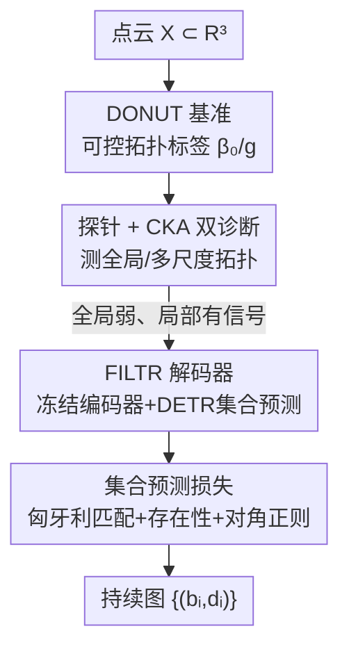

# FILTR: Extracting Topological Features from Pretrained 3D Models

**会议**: CVPR 2026  
**论文**: [CVF Open Access](https://openaccess.thecvf.com/content/CVPR2026/html/Martinez_FILTR_Extracting_Topological_Features_from_Pretrained_3D_Models_CVPR_2026_paper.html)  
**代码**: https://filtr-topology.github.io/  
**领域**: 3D视觉  
**关键词**: 拓扑数据分析, 持续图, 点云编码器, 集合预测, DETR  

## 一句话总结
本文先用一个带拓扑标签的合成数据集 DONUT 探测「预训练 3D 点云编码器到底懂多少拓扑」，发现它们对全局拓扑（连通分量、亏格）理解很弱、但对多尺度结构有一定隐式感知；随后提出 FILTR——首个把 DETR 改造成「从冻结编码器特征直接前馈预测持续图」的集合预测模型，让持续图的提取从经典算法变成可学习、可与其他网络拼接的一步前向。

## 研究背景与动机
**领域现状**：Point-BERT、Point-MAE、PointGPT、PCP-MAE 这类基于 Transformer 的 3D 点云编码器，靠掩码重建或语义对齐在大规模数据上自监督预训练，在几何和语义下游任务上表现强劲。与此并行，拓扑数据分析（TDA）里的持续图（persistence diagram）能给出形状多尺度结构的简洁刻画，在蛋白质、材料、地学等场景被证明极有信息量。

**现有痛点**：这两条线几乎不交叉。一方面，没人知道这些编码器学到的特征里**是否、以及在哪一层**编码了拓扑信息——它们的损失从没显式鼓励过拓扑。另一方面，要拿到持续图只能走经典算法（α-滤波、Vietoris-Rips），这些方法和端到端学习管线**解耦**，计算贵、也无法和下游网络联合优化。

**核心矛盾**：拓扑不变量（连通分量数 $\beta_0$、亏格 $g$）是**全局且形变不变**的量，从局部特征很难推；而现有编码器是先把点云切 patch、再做局部嵌入，天生偏局部。于是「编码器特征里有没有全局拓扑」本身就是个悬而未决、且难以度量的问题——既缺带拓扑标签的数据集，也缺把持续图（一个无序、变长的点集）和特征向量对齐的协议。

**本文目标**拆成两个子问题：(1) 量化预训练 3D 编码器特征里到底捕获了多少拓扑信息；(2) 在此分析基础上，做出一个直接从这些特征前馈估计持续图的估计器。

**切入角度**：与其把持续图当成下游输入（以往 TDA+ML 的主流做法是把图向量化后喂给模型），作者反过来把**持续图当成预测目标**——既能借此度量编码器捕获了多少拓扑，又能得到一个高效、可微、能和别的学习架构兼容的拓扑提取器。

**核心 idea**：先用「探针 + CKA」诊断编码器的拓扑能力，再把持续图预测**形式化成集合预测**，借 DETR 的 query + 交叉注意力 + 匈牙利匹配机制，从冻结编码器特征里前馈解出持续图。

## 方法详解

### 整体框架
全文是「先诊断、后构建」的两段式。第一段（诊断）回答「3D 编码器懂不懂拓扑」：为此造一个带可控拓扑标签的合成数据集 **DONUT**，再用两种互补手段去探测——**线性探针**测全局量（连通分量、亏格），**CKA 对齐**测特征和持续图向量化之间的多尺度相似度。结论是：全局拓扑信号很弱（探针准确率仅略高于从零训的 PointNet），但特征和持续图向量化有非平凡的对齐，说明有局部多尺度结构的隐式感知。第二段（构建）顺着「既然有局部信号，就让网络去挖」的思路提出 **FILTR**：冻结一个 3D 编码器当特征提取器，接一个由 DETR 改造的解码器，把持续图当作一组无序点 $\{(b_i,d_i)\}$ 用集合预测的方式解出来，并配一套「匈牙利匹配 + 存在性 + 对角正则」的损失把它训稳。

### 关键设计

**1. DONUT 基准：造一个拓扑标签可控、几何又足够花哨的合成数据集**

诊断的前提是有 ground-truth 拓扑标签，但现成数据集都不够用：ShapeNet/ModelNet 按语义类别组织、根本没拓扑标注；ABC、Thingi10K 虽带标注却大多只有单个连通分量、且很多网格非流形或断连，导致亏格这类不变量算出来都不可靠；并行工作 EuLearn 又只聚焦单连通分量的纽结结构。作者于是自建 DONUT（Dataset Of maNifold strUctures）：每个样本由 1–6 个连通分量（$\beta_0$）组成，每个分量是流形网格，整体亏格 $g$ 从 0 到 10，共 29,517 个物体，并刻意把两个标签的分布做均衡（见 Fig.3），避免训练/测试偏置。

构造时先定全数据集的目标标签以保证均衡，再用圆锥、环面、超二次曲面等参数化形状组合出满足标签的网格，最后对每个形状施加一系列**保拓扑的几何变换**制造多样性。这里有个关键陷阱：合成形状常常几何太简单，下游任务会被「最近邻检索」之类的捷径轻松解掉。作者特意往里塞尽量多的几何变化来扰乱基于检索的解法，使得「从点云推 $\beta_0$/$g$」这件事真正变难——因为这些标签是全局、连续形变不变的，只靠局部特征很难推断。

**2. 探针 + CKA 双诊断：用两个互补视角量化「编码器到底懂多少拓扑」**

单一指标说不清拓扑能力，作者用两种正交的探测。其一是**线性探针**：冻结编码器，对每个 Transformer block 的输出特征各接两个独立线性层，分别预测连通分量数和亏格，用交叉熵训练、做 5 折交叉验证报平均准确率（Point-BERT 额外探它的 CLS token）。逐层探针能看出拓扑信息**在哪一层最强**——结果是大多数编码器较深的 block 反而更好，但整体准确率都偏低。其二是 **CKA 对齐**（Centered Kernel Alignment），它是一种**无参**度量，衡量编码器特征与持续图向量化之间的相似度。持续图本身是无序点集、没法直接和特征向量比，所以先把 H1 持续图（取自 1024 点点云的 α-滤波）用多种方式向量化——解析式的（Betti 曲线、Landscapes、Silhouette、Top-128）和学习式的（ATOL）——再算 CKA。两者互补：探针测的是「全局不变量能不能线性读出」，CKA 测的是「多尺度结构有没有隐式留在特征里」。诊断结论也正是靠两者拼出来的：全局探针弱，但 CKA（尤其 Point-MAE）在各层都有稳定对齐，且不像探针那样在深层显著上升——作者推测是因为 patch 化后特征以局部信息为主，注意力混合后冒出部分全局结构、但局部信号被保留。

**3. FILTR 解码器：把持续图预测改造成 DETR 式的集合预测**

诊断发现编码器虽不直接编码全局拓扑、却保留了有用的局部几何结构，于是 FILTR 用一个非线性解码器去「挖」出持续图。形式上，把维度 $q$ 的持续图当成一组点对 $\{(b_i,d_i)\}_{i=1}^{M}$（实践中点云算出的图几乎不会有重复对，可当集合而非多重集）。这天然是个集合预测问题，DETR 正好是为此而生，于是作者把 DETR 从「2D 目标检测」整套迁移过来（对应关系见原文 Table 2）：输入从图像换成点云、目标从 bounding box 换成持续对、位置编码从 2D 正弦换成 3D patch 中心、且**编码器冻结不端到端训**。

具体地，冻结的 3D backbone 把点云编成 patch 特征 $F=\{f_i\}$，每个特征连同其 3D 位置编码投影到解码器维度。解码器拿 $N$ 个可学习 query（$N$ 大于最大图尺寸），通过交叉注意力和编码器特征交互，末端接两个 MLP 头：一个把每个 query 映成持续 logits $(\hat{p}_i^{(1)},\hat{p}_i^{(2)})$，另一个出存在 logit $\hat{l}_i$。持续对由 $\hat{b}_i=\sigma(\hat{p}_i^{(1)})$、$\hat{d}_i=\hat{b}_i+\mathrm{softplus}(\hat{p}_i^{(2)})$ 得到——这个 softplus 构造强制了 $d>b$ 的生灭顺序约束（死亡值必然不早于诞生值）；存在概率 $\sigma(\hat{l}_i)$ 则指示这个 query 是真拓扑特征还是「无对」空槽。相比那些把持久同调计算步骤硬编进网络结构的图方法，FILTR 不写死算法结构，纯靠数据驱动，且因为编码器冻结、整条管线很轻。

**4. 集合预测损失：匈牙利匹配 + 存在性 + 对角正则三件套**

最自然的训练目标是预测图和真值图之间的 2-Wasserstein 损失（让未匹配预测自动流向对角线），但作者实测在点云上不可靠——点云的持续图常常超过 $10^2$ 个对，规模太大时该损失训不稳。FILTR 改用 DETR 式集合预测目标，总损失为

$$L = \mu_{recon}L_{recon} + \mu_{exist}L_{exist} + \mu_{diag}L_{diag}.$$

匹配与重建：$N$ 个无序预测对先用匈牙利算法求与 $M$ 个真值对的最优指派 $\pi^*=\arg\min_\pi \sum_i L_{match}(\hat{y}_{\pi(i)},y_i)$，其中匹配代价 $L_{match}(\hat{y}_i,y_j)=\lambda_{reg}\|\hat{y}_i-y_j\|_2^2-\lambda_{exist}(1-\sigma(\hat{l}_i))$ 既看坐标距离、也看存在分数——若某预测对存在概率很低，就在匹配代价里多惩罚它。指派定下后，重建损失是匹配对上的 MSE：$L_{recon}=\frac{1}{M}\sum_i\|\hat{y}_{\pi^*(i)}-y_i\|_2^2$。

存在性损失用二元交叉熵监督 logits：匹配上的对目标标签为 1、未匹配预测为 0。对角正则则把所有未匹配预测推向对角线 $\Delta$：$L_{diag}=\frac{1}{N-M}\sum_{i=M+1}^{N}(\hat{d}_i-\hat{b}_i)^2$。它的作用很关键——推理时本来要靠对存在概率阈值化（通常 0.5）来决定保留哪些对，但阈值化不稳；把空槽预测压到对角线后，这些点对图距离的贡献几乎为零，于是阈值化变得基本可有可无，预测更稳健。

### 损失函数 / 训练策略
训练用 DONUT 的 23K 网格，每个采 1024 点、算 α-滤波下的 H1 持续图，保留持续度最高的 10% 点对去噪（在去噪和保信息间取折中），所有图按数据集尺度归一到 birth/death ∈ [0,1]。输入特征有两种变体：只用编码器最后一层（L），或把所有 block 特征求和（C）。

## 实验关键数据

### 主实验：编码器到底懂不懂拓扑（探针准确率）
在 DONUT 上探针冻结预训练编码器（报跨层最佳，下标为对应层），并和从零端到端训练的几何 backbone 对比。

| 模型 | 连通分量 Acc | 亏格 Acc | 说明 |
|------|------|------|------|
| PointGPT | 43.8 | 22.5 | 预训练编码器中最差 |
| Point-MAE | 50.0 | 23.1 | MAE 类 |
| PCP-MAE | 51.4 | 24.8 | 当前 SOTA 重建编码器 |
| Point-BERT (Patch) | 51.5 | 22.8 | — |
| **Point-BERT (CLS)** | **57.2** | **25.9** | 预训练里最佳 |
| PointNet（从零训） | 53.2 | 20.4 | 端到端基线 |
| PointNet++（从零训） | 75.7 | 51.0 | — |
| DGCNN（从零训） | 80.8 | 43.5 | — |
| **RepSurf（从零训）** | **83.3** | **57.7** | 端到端最佳，显式用面特征 |

关键读数：预训练编码器准确率普遍低，最好的 Point-BERT (CLS) 也只是略胜从零训的 PointNet，端到端的 RepSurf 则大幅领先——说明现有 3D 预训练策略并没有强编码全局拓扑信息。

### FILTR 持续图重建（W2 / dB / PIE，越低越好）
全部在 DONUT 训练，分别在 DONUT 留出集、ModelNet40、ABC 上评测（L=末层特征，C=各层求和）。

| 特征提取器 | DONUT W2(×10⁻²) | DONUT dB(×10⁻³) | DONUT PIE | ModelNet40 W2 | ABC W2 |
|------|------|------|------|------|------|
| Point-MAE (C) | **16.02** | 9.838 | 1.214 | 47.26 | 47.99 |
| Point-BERT (L) | 16.18 | 9.901 | 1.371 | 43.04 | 43.37 |
| PointGPT (C) | 17.59 | 10.08 | 1.289 | 48.89 | 40.47 |
| PointGPT (L) | 17.86 | 10.03 | 1.192 | 39.80 | 40.19 |
| DGCNN（端到端） | 16.62 | 10.15 | 1.213 | 43.27 | 45.21 |
| PointNet（端到端） | 24.85 | 10.61 | 1.442 | 51.32 | 57.44 |
| PointNet++（端到端） | 39.37 | 13.64 | 10.39 | 78.86 | 95.39 |

关键读数：FILTR 配冻结预训练编码器**达到或超过**端到端基线（PointNet++ 是异常退化案例，正文单独标出），而所需可训练参数少得多。值得玩味的是排名翻转——探针里偏弱的 PointGPT、Point-BERT 在分布外数据（ModelNet/ABC）上反而最强；Point-MAE、PCP-MAE 在 DONUT 上好、跨分布却退化更猛，说明它们的特征更绑定预训练数据统计。L 与 C 之间没有系统性优劣。

### 关键发现
- **探针弱但 FILTR 强，不矛盾**：编码器不线性暴露拓扑（探针差），但保留了有用的局部几何结构（CKA 有对齐），FILTR 靠非线性解码器把它挖出来——这是全文最核心的「啊哈」。
- **三个指标各看一面**：W2 反映整体质量、dB 只对最坏一个点敏感、PIE 由高持续度点主导。跨数据集时 ABC 的 dB 飙升说明只是少数严重错配，而 ModelNet40 的 PIE 涨得更多说明它在「最重要的高持续度特征」上犯错更多——FILTR 在分布漂移下能保住图的整体结构，但残余错误的性质强依赖目标数据集。
- **泛化来自冻结预训练**：用冻结大编码器让 FILTR 能迁移到未见分布，这是相对经典算法管线和端到端基线的实际优势。

## 亮点与洞察
- **把「度量编码器懂多少拓扑」做成可操作的诊断协议**：探针测全局不变量、CKA 测多尺度对齐，两者互补，第一次系统量化了 3D 编码器的拓扑能力，结论可证伪、也为后续工作立了基准。
- **视角反转——持续图从输入变成输出**：以往 TDA+ML 把持续图向量化后当下游输入，本文反过来把它当预测目标，既得到度量编码器拓扑的探针，又得到一个可微、可拼接的前馈拓扑提取器。
- **DETR 迁移得很干净**：bounding box↔持续对、no-object↔no-pair、box 约束↔$d>b$ 的 softplus 构造，对应关系一一落地；对角正则这个小设计让阈值化几乎可省，是很实用的稳健性 trick。
- **可迁移思路**：「冻结大模型当特征源 + 轻量集合预测头解出结构化无序输出」这套范式，可迁到任何「目标是变长无序集合」的任务（关键点集、事件检测、图边集预测等）。

## 局限与展望
- 作者承认：方法天生受限于**预训练编码器的可得性与质量**。在图学习这类「拓扑是核心但缺通用强编码器」的领域，结论暂时无法迁移。
- 全局拓扑探针准确率偏低，可能部分源于任务确实难（全局形变不变量本就难从局部特征推），也可能 DONUT 的合成分布与真实数据有差距——跨数据集泛化（W2 从 DONUT 到 ModelNet/ABC 明显变差）印证了这一点。⚠️ 论文只评了 H1 维持续图与 α-滤波（Vietoris-Rips 结果在附录），更高维拓扑特征上的表现未在正文展开。
- 展望：把分析扩到多模态基础模型——文本等模态可能以不同于 2D/3D 的方式编码结构/关系信息，或许能为大型预训练系统里的拓扑推理开辟新路径。

## 相关工作与启发
- **vs 经典 TDA 估计（α/Vietoris-Rips 滤波 + 持久同调）**：经典方法精确但计算贵、与端到端学习解耦；FILTR 用一次前馈近似持续图，效率高、可与其他学习架构兼容，代价是精度受编码器质量限制。
- **vs 持续图向量化方法（ATOL、Landscapes、Betti 曲线等）**：它们把持续图转成向量当**输入**喂下游；本文把持续图当**输出目标**，方向相反，顺带用这些向量化做 CKA 诊断。
- **vs 图上的持续图预测（如 Yan et al. [55]）**：那类方法把持久同调计算步骤作为强归纳偏置写进结构、常预测代理表示、并适配 2-Wasserstein 损失；FILTR 不硬编码算法结构，纯从点云编码器特征解，且因点云图规模大改用集合预测损失而非 2-Wasserstein。
- **vs DETR / 集合预测检测器**：DETR 系是从 backbone 到 decoder 端到端训练；FILTR 更轻——编码器冻结，只训解码器，把持续对当作待匹配的「检测目标」。

## 评分
- 新颖性: ⭐⭐⭐⭐⭐ 首次系统度量 3D 编码器的拓扑能力，并首创从冻结特征前馈预测持续图，视角与方法都新。
- 实验充分度: ⭐⭐⭐⭐ 探针/CKA/重建三套实验 + 三数据集 + 三指标交叉分析较完整，但全局拓扑维度（高维同调、更大点云）主要落在附录。
- 写作质量: ⭐⭐⭐⭐⭐ 「先诊断后构建」叙事清晰，DETR-FILTR 对照表与三指标错误模式分析很到位。
- 价值: ⭐⭐⭐⭐ 给「拓扑 × 预训练」搭了基准 DONUT 和可微提取器 FILTR，对 TDA 与 3D 表示学习交叉方向有奠基意义，受限于编码器可得性。

<!-- RELATED:START -->

## 相关论文

- [\[CVPR 2026\] TopoMesh: High-Fidelity Mesh Autoencoding via Topological Unification](topomesh_high-fidelity_mesh_autoencoding_via_topological_unification.md)
- [\[CVPR 2026\] SE(3)-Equivariance with Geometric and Topological Guidance for Category-Level Object Pose Estimation](se3-equivariance_with_geometric_and_topological_guidance_for_category-level_obje.md)
- [\[CVPR 2026\] SGSoft: Learning Fused Semantic-Geometric Features for 3D Shape Correspondence via Template-Guided Soft Signals](sgsoft_learning_fused_semantic-geometric_features_for_3d_shape_correspondence_vi.md)
- [\[CVPR 2026\] Foundry: Distilling 3D Foundation Models for the Edge](foundry_distilling_3d_foundation_models_for_the_edge.md)
- [\[AAAI 2026\] 3D-Free Meets 3D Priors: Novel View Synthesis from a Single Image with Pretrained Diffusion Guidance](../../AAAI2026/3d_vision/3d-free_meets_3d_priors_novel_view_synthesis_from_a_single_image_with_pretrained.md)

<!-- RELATED:END -->
