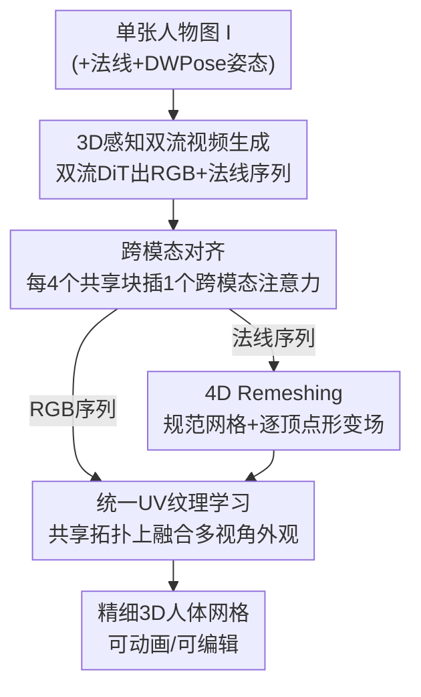

# FISHuman: Fine-grained Single-image 3D Human Reconstruction via Multi-view 4D Remeshing

**会议**: CVPR 2026  
**论文**: [CVF Open Access](https://openaccess.thecvf.com/content/CVPR2026/html/Liu_FISHuman_Fine-grained_Single-image_3D_Human_Reconstruction_via_Multi-view_4D_Remeshing_CVPR_2026_paper.html)  
**代码**: 无  
**领域**: 3D视觉  
**关键词**: 单图人体重建, 多视频扩散, 4D Remeshing, 顶点形变, 统一UV纹理  

## 一句话总结
FISHuman 用「3D 感知的双流视频扩散模型」把一张照片扩成多视角对齐的 RGB+法线序列，再用一个「4D Remeshing」模块把这些**不一致**的多视角帧的像素漂移转成可控的逐顶点形变，从而从单图重建出几何精细、纹理逼真、可直接绑骨动画的 3D 人体，在 2K2K / Sizer 上几何与外观指标全面超过 PSHuman、Human3Diffusion 等 SOTA。

## 研究背景与动机
**领域现状**：单图 3D 人体重建主流有两条路线。一条是 PIFu / ECON 这类基于像素对齐隐函数或显式人体先验（SMPL）的方法；另一条是近期借助 2D 多视角扩散模型生成若干辅助视角、再做 3D 重建的方法（PSHuman、SiTH 等）。

**现有痛点**：隐函数/SMPL 方法在输入视角看不到的区域（自遮挡、背面）会产生严重伪影；多视角扩散方法受限于显存和架构，只能生成**稀疏**视角，遮挡区覆盖不足，而且扩散生成的多视角图之间**缺乏显式 3D 约束**，彼此不一致，直接拿去重建会得到扭曲几何和模糊纹理。也有方法（Human3Diffusion 等）直接上 transformer/diffusion 的原生 3D 生成器强行保证跨视角一致，但分辨率受限、泛化差。

**核心矛盾**：生成的多视角帧之间天然「不一致」（颜色微扰、姿态抖动、空间错位），而朴素 3D 重建会强迫模型去**平均这些互相冲突的监督信号**，结果几何被抹平、纹理被糊掉。一致性和精细度在「2D 生成帧 → 3D 重建」这一步上对立。

**本文目标**：从单图产出**production-ready**（可提取网格、可绑骨动画、可编辑）的精细 3D 人体，要同时拿到高保真外观、精细几何和跨风格泛化。

**切入角度**：与其追求生成帧之间「绝对一致」（做不到），不如承认它们不一致，把**像素级漂移显式建模成动态顶点形变**，在一个全局共享的规范网格上为每个视角学一组偏移——这样冲突信号不再被平均，而是被解耦成「共享几何 + 视角相关细节」。

**核心 idea**：用「3D 感知双流视频扩散」生成稠密对齐的 RGB+法线序列做先验，再用「4D Remeshing」把多视角不一致转化为规范网格 + 逐视角形变场的联合优化，最后在共享拓扑上学一张统一 UV 纹理。

## 方法详解

### 整体框架
给定单张人物图 $I$，FISHuman 分两大阶段产出带纹理的 3D 网格。第一阶段是 **3D 感知双流视频生成**：把参考 RGB 图、其估计法线图、以及 DWPose 提取的 2D 姿态作为条件，喂给一个在合成 3D 人体多视角渲染上微调过的双流 DiT，生成任意张数、跨模态对齐的多视角 RGB 序列 $\mathcal{F}^{rgb}_{1:T}$ 与法线序列 $\mathcal{F}^{norm}_{1:T}$（视角变化等价于人体的刚性旋转）。第二阶段是 **动态 3D 人体雕刻（Dynamic 3D Human Carving）**，它本身又含两步：用 **4D Remeshing** 在不一致的法线序列上重建出拓扑一致的几何，再在共享拓扑上做 **统一 UV 纹理学习** 融合多视角外观。最终取正面视角对应的形变网格作为输出资产。

### 关键设计

**1. 3D 感知双流视频扩散：用一个视频生成器同时吐出对齐的 RGB 与法线**

要解决「多视角扩散只能出稀疏视角、且缺 3D 一致性」的痛点。作者基于 Wan2.1 图生视频模型微调出一个双流 DiT，把「绕人体旋转相机」当成视频时间轴，于是能生成**任意张数**的连贯多视角帧，天然比稀疏视角覆盖更密。它刻意**不**用常被采用的 SMPL-X 条件（因为单目 3D 姿态估计本身不准，会把错误传进来），而是依靠模型自身的 3D 先验来推断合理的新视角姿态。建模的目标分布为 $p(\mathcal{F}^{rgb}_{1:T}, \mathcal{F}^{norm}_{1:T} \mid \mathbf{c}^{rgb}_{ref}, \mathbf{c}^{norm}_{ref}, \mathbf{c}^{pose})$。结构上做双流：RGB 与法线各自有专属的首尾 transformer 块学各自的域调制，中间层共享以做跨模态融合；所有注意力的线性层注入 LoRA，让模型既能长出「多视角 3D 感知 + 双流分化」的新能力，又最大限度保留底模的生成与泛化力。参考图还可选地经预训练 repose 模型插值到规范 A-pose，减少自遮挡、便于后续动画。

**2. 跨模态对齐：每四个共享块换一个跨模态注意力，逼 RGB 和法线"长在一起"**

针对「双流并行生成会让 RGB 和法线结构错位、进而在重建里变成纹理-几何错贴（尤其轮廓和表面细节处）」的问题。作者把每 4 个共享 DiT 块中的 1 个替换成**跨模态注意力模块**：在该模块里，对 RGB token 和法线 token **拼接后**做标准自注意力，强迫两个域产生相关性；到了交叉注意力层再拆回各自的流，分别与各自的全局上下文交互。这样两条流之间被注入「强耦合监督」，body outline、衣纹这些细节在两个模态上保持对齐，从源头消除了「来自未对齐多视角引导的重建伪影」。

**3. 4D Remeshing：把多视角不一致显式拆成"规范网格 + 逐视角顶点形变"**

这是全文核心，针对「视频模型只有 2D 像素级监督、没有显式 3D 约束，朴素重建会平均掉冲突信号导致几何扭曲」。模块借鉴动态场景重建思路，把几何拆成两部分：① **规范网格（canonical mesh）**，编码跨所有视角/时间共享的几何结构；② **动态形变场（deformation field）**，捕捉视角相关的瞬时表面细节。

规范网格用连续显式 remeshing 优化：在法线图监督下通过可微渲染优化顶点位置，并配合边分裂/折叠/翻转等表面重网格化技术维护拓扑正确性，再用一个估计出的最优边长做自适应顶点密度控制，从而做到细尺度重建。视角相关形变由一个 MLP $\Psi_d$ 给出，输入是规范顶点坐标和视角嵌入，输出该视角下的顶点偏移：$\delta x_i = \Psi_d(\gamma(x_c), \gamma(i))$，其中 $\gamma(\cdot)$ 是位置编码，$i$ 是视角索引（0 为正面）。关键是 $x_c$ 在喂进 MLP **前先 detach**，保证形变模块只学「视角相关形变」而不干扰全局规范几何的优化——这正是「解耦」落到实处的地方。

联合优化时先用静态 remeshing 初始化规范网格，再迭代联合更新规范顶点位置与形变场。某视角 $v_i$ 下形变后的顶点为 $x^i_d = x_c + \delta x_i$，可微光栅化渲染出法线图 $\hat{\mathcal{N}}_i$ 与掩膜 $\hat{\mathcal{S}}_i$，监督项为
$$L_{rec} = \lVert \hat{\mathcal{N}}_i - \mathcal{F}^{norm}_i \rVert_1 + \lVert \hat{\mathcal{S}}_i - \mathcal{S}_i \rVert_1.$$
再加 Laplacian 平滑正则 $L_{lap}$ 和一个 ARAP（as-rigid-as-possible）损失：ARAP 在两个随机视角的形变顶点对之间，约束 $\lVert x_i - x_j \rVert$ 与 $\lVert x'_i - x'_j \rVert$ 尽量相等，逼形变网络学**近刚性**动态、防止单视角法线引导下的几何畸变。几何总目标为 $L_{geo} = L_{rec} + \lambda_{lap}L_{lap} + \lambda_{arap}L_{arap}$。这样规范网格学到「所有视角的最小几何交集」，形变网络补「当前视角的局部细节」，且因为各视角网格**共享拓扑**，可见与遮挡区都能推出合理几何。

**4. 统一 UV 纹理表示：利用共享拓扑把多视角 RGB 融成一张无冲突纹理**

RGB 帧同样有多视角不一致（空间错位 + 颜色微扰）。但既然各视角形变网格都是在规范网格上加偏移得到，它们**共享同一套拓扑**，于是可以学一张统一 UV 纹理图 $\mathcal{T}$ 来融合所有视角的可见外观。从随机噪声初始化 $\mathcal{T}$，对视角 $v_i$ 用其形变网格 $M_i$ 做可微渲染得到 $\hat{C}_i = R(M_i, \mathcal{T}, v_i)$，用像素损失对齐对应 RGB 帧：$L_{rgb} = w_i \lVert \hat{C}_i \cdot S_i - \mathcal{F}^{rgb}_i \cdot S_i \rVert_2$，其中视角权重 $w_i$ 给主视角（正/背面）更高权重。再叠一个 total-variation 损失 $L_{tv}$ 平滑纹理，纹理总损失 $L_{tex} = L_{rgb} + \lambda_{tv}L_{tv}$（默认 $\lambda_{tv}=0.5$）。因为纹理优化是踩在已对齐的几何形变上做的，它能借几何先验有效消掉 RGB 不一致带来的纹理伪影。

### 损失函数 / 训练策略
- **几何阶段**：$L_{geo} = L_{rec} + \lambda_{lap}L_{lap} + \lambda_{arap}L_{arap}$，$\{\lambda_{lap}, \lambda_{arap}\} = \{0.4, 0.03\}$。
- **纹理阶段**：$L_{tex} = L_{rgb} + \lambda_{tv}L_{tv}$，$\lambda_{tv}=0.5$。
- **渐进式两阶段训练（视频生成器）**：先只用模态专属注意力打牢各流分布与 3D 一致性，第二阶段再引入跨模态注意力做对齐；训练时以 30% 概率随机关闭跨模态注意力，防止两支信息过度融合反而降质。
- **优化流程**：先纯规范网格重建初始化 300 步，再引入动态形变场联合优化 200 步；之后用 Xatlas 做 UV 展开，统一纹理优化 500 步。视频推理/4D remeshing/纹理优化在单张 A6000 上分别约 5 分钟 / 2 分钟 / 10 秒。

## 实验关键数据

### 主实验
在 2K2K（100 个测试对象）与 Sizer（50 个）上做任意姿态重建对比，几何用 CD / P2S / NC，外观用 PSNR / SSIM / LPIPS。FISHuman 在**两个数据集的全部六项指标上**都超过所有 baseline（注：Human3Diffusion 的训练集含 2K2K 数据，仍被超过）。

| 数据集 | 指标 | 本文 | 之前最好(基线) | 提升 |
|--------|------|------|----------------|------|
| 2K2K | CD (cm) ↓ | **0.817** | 1.052 (Human3Diffusion) | 降 0.235 |
| 2K2K | P2S (cm) ↓ | **0.778** | 1.062 (PSHuman) | 降 0.284 |
| 2K2K | NC ↑ | **0.858** | 0.828 (PSHuman) | +0.030 |
| 2K2K | PSNR ↑ | **24.49** | 23.35 (Human3Diffusion) | +1.14 |
| 2K2K | LPIPS ↓ | **0.086** | 0.104 (Human3Diffusion) | 降 0.018 |
| Sizer | CD (cm) ↓ | **1.243** | 1.331 (Human3Diffusion) | 降 0.088 |
| Sizer | NC ↑ | **0.768** | 0.753 (PSHuman) | +0.015 |
| Sizer | PSNR ↑ | **20.38** | 19.61 (PSHuman) | +0.77 |

### 消融实验
在外观指标上验证两个核心模块（2K2K 设置）：

| 配置 | PSNR ↑ | SSIM ↑ | LPIPS ↓ | 说明 |
|------|--------|--------|---------|------|
| w/o CMA | 23.14 | 0.9064 | 0.1015 | 去掉跨模态对齐，RGB/法线错位 |
| w/o 4DR | 23.87 | 0.9142 | 0.0970 | 去掉 4D remeshing，退化为静态重建 |
| Full model | **24.49** | **0.9173** | **0.0858** | 完整模型 |

### 关键发现
- **跨模态对齐（CMA）贡献最大**：去掉后 PSNR 从 24.49 掉到 23.14（−1.35），LPIPS 从 0.086 升到 0.1015，是三项里掉得最多的；定性上 RGB 与法线轮廓/衣纹会错位，并传导成重建质量下降。
- **4D Remeshing（4DR）对几何稳健性关键**：只用静态 remeshing 的变体在夸张姿态下会出现严重表面裂缝、复杂拓扑重建失败、脸部细节粗糙；加上 4DR 后外观指标也涨（PSNR +0.62）。
- **渐进式训练（PT）不可省**：直接把双流适配和跨模态对齐混在一起训会两个模态都降质（未见区域噪声、法线缺细节）；两阶段训练才能同时拿到逼真新视角和高频表面细节（脸、发际线、项链几何）。
- **3D 感知微调（3DFT）**：没有它，底模生成帧会出现头发/衣物的「漂浮」动态和人体结构不一致。
- **挑战场景**：在人物-物体遮挡和罕见背面姿态上，PSHuman 会在胸部/腿部出现几何畸变，FISHuman 凭借稠密一致的视频引导仍能正确重建。

## 亮点与洞察
- **「承认不一致、再显式建模不一致」的思路很巧**：别的方法都在卷「怎么让多视角更一致」，本文反其道——把视频帧间的像素漂移当成 4D 形变去学，把冲突信号从「被平均」变成「被解耦」，这是它几何更锐利的根因。
- **detach 规范顶点这个小动作是解耦能落地的关键**：$x_c$ 进 MLP 前 detach，保证形变网络只学视角相关偏移、不反向污染全局几何，是个可复用的「双轨优化互不干扰」trick。
- **共享拓扑顺手解锁统一 UV**：因为形变只是规范网格上的偏移，所有视角网格天然同拓扑，于是纹理融合不需要额外做跨视角配准——几何阶段的设计自动为外观阶段铺好路。
- **刻意弃用 SMPL-X 反而更鲁棒**：作者判断单目 3D 姿态估计不准会引入错误，干脆只用 2D DWPose + 模型自带 3D 先验，规避了「错误先验污染」，对罕见姿态泛化更好——这个取舍值得在其他依赖 SMPL 的人体任务里借鉴。
- **用视频扩散当「稠密多视角生成器」**：把相机绕人体旋转等价成视频时间轴，从而生成任意张数视角，绕开了多视角扩散的稀疏性限制。

## 局限与展望
- 训练数据规模偏小：3D 感知视频生成器仅在 THuman2.1 过滤出的 **1559** 个高质量扫描上微调，对超出该分布的极端服饰/风格泛化上限存疑 ⚠️。
- 重度依赖第一阶段视频生成质量：若双流视频在严重自遮挡或极罕见姿态下出错，4D remeshing 也只能在错误引导上雕刻，误差会传导。
- 单例优化流程：每个 case 需要规范网格 300 步 + 联合 200 步 + 纹理 500 步的优化（共约 7 分钟+），不是前馈实时方法，规模化生成成本较高。
- ARAP 约束的是「近刚性」形变，对极度松散/飘动的布料（论文也提到 drifting cloth 是难点）能否完全刻画存疑 ⚠️。
- 论文未给代码链接，复现性待确认。

## 相关工作与启发
- **vs PSHuman**：PSHuman 用 SMPL-X 引导的稀疏多视角扩散，受限于稀疏视角 + 单目 SMPL 估计误差，在罕见姿态/遮挡下几何畸变；FISHuman 用稠密视频引导 + 弃 SMPL，几何与外观全面更优，挑战场景（人物-物体交互、背面）尤其明显。
- **vs Human3Diffusion**：后者走原生 3D 一致生成（3DGS），分辨率受限、网格扭曲，且 3DGS 非结构化、难导出可用于渲染引擎的显式资产；FISHuman 输出标准带纹理网格，即便 Human3Diffusion 训练集含 2K2K，本文仍在 2K2K 上反超。
- **vs SIFU / SiTH（隐函数路线）**：它们重建会在不可见区出现噪声面和不合理新视角；FISHuman 靠 3D 感知视频先验补全遮挡区。
- **vs StdGen / Hunyuan3D 2.0（通用 3D 生成）**：它们网格光滑高面但保不住参考图的人物身份；FISHuman 在外观真实度和几何锐度上更贴近真人。

## 评分
- 新颖性: ⭐⭐⭐⭐⭐ 「把多视角不一致显式建成 4D 顶点形变 + 共享拓扑统一 UV」是对单图人体重建一致性难题的新颖解法。
- 实验充分度: ⭐⭐⭐⭐ 两数据集六指标全面对比 + 模块消融（CMA/4DR/PT/3DFT）齐全，但消融表只给外观三项、缺几何指标的量化消融。
- 写作质量: ⭐⭐⭐⭐⭐ 动机推导清晰，pipeline 与公式交代完整，图文对照充分。
- 价值: ⭐⭐⭐⭐⭐ 产出可绑骨动画/可编辑的 production-ready 资产，对影视/游戏/VR 人体资产规模化有直接价值。

<!-- RELATED:START -->

## 相关论文

- [\[CVPR 2026\] Human Interaction-Aware 3D Reconstruction from a Single Image](human_interaction-aware_3d_reconstruction_from_a_single_image.md)
- [\[CVPR 2026\] Coherent Human-Scene Reconstruction from Multi-Person Multi-View Video in a Single Pass](coherent_humanscene_reconstruction_from_multiperso.md)
- [\[CVPR 2026\] 3D-Fixer: Coarse-to-Fine In-place Completion for 3D Scenes from a Single Image](3d-fixer_coarse-to-fine_in-place_completion_for_3d_scenes_from_a_single_image.md)
- [\[CVPR 2026\] iSplat: Iterative Learning for Fine-Grained Gaussian Splatting](isplat_iterative_learning_for_fine-grained_gaussian_splatting.md)
- [\[CVPR 2026\] Intrinsic Image Fusion for Multi-View 3D Material Reconstruction](intrinsic_image_fusion_for_multi-view_3d_material_reconstruction.md)

<!-- RELATED:END -->
