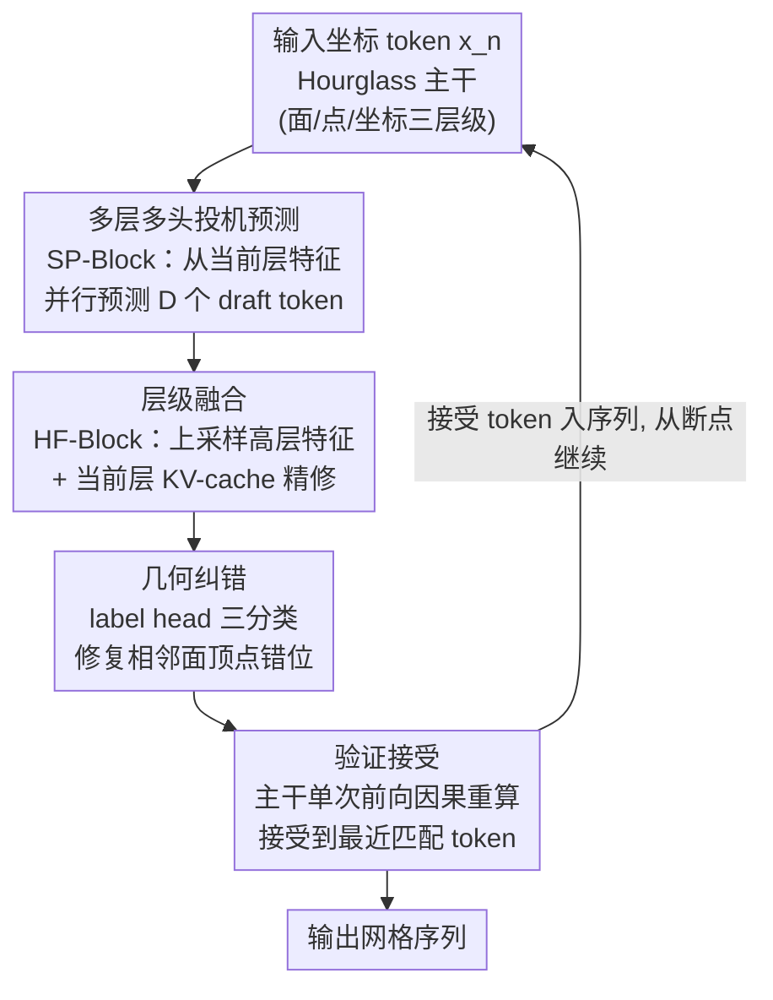

# FlashMesh: Faster and Better Autoregressive Mesh Synthesis via Structured Speculation

**会议**: CVPR 2026  
**论文**: [CVF Open Access](https://openaccess.thecvf.com/content/CVPR2026/html/Shen_FlashMesh_Faster_and_Better_Autoregressive_Mesh_Synthesis_via_Structured_Speculation_CVPR_2026_paper.html)  
**代码**: 未开源（论文未给出仓库链接）  
**领域**: 3D视觉  
**关键词**: 自回归网格生成, 投机解码, Hourglass Transformer, 并行解码, 几何一致性  

## 一句话总结
FlashMesh 把大模型里的"投机解码"搬到自回归网格生成上，针对 Hourglass Transformer 的层级结构设计了一套 predict–correct–verify 框架，让模型每步并行预测多个 token 并做几何纠错，在 Meshtron-2B 上实现约 2× 推理加速的同时把 Chamfer Distance 从 0.092 降到 0.089。

## 研究背景与动机

**领域现状**：高质量 3D 网格生成是 VR、游戏、数字内容创作的核心任务。相比体素、隐式场，网格用顶点和面显式表达表面，紧凑可编辑、利于渲染。近年主流做法是**自回归生成**——像 Meshtron、DeepMesh、BPT 这样把网格拆成「面 → 顶点 → 坐标」的 token 序列，一个 token 接一个 token 地预测，能精确捕捉拓扑和几何结构。

**现有痛点**：自回归的严格顺序解码带来一个根本瓶颈——每个 token 必须等前一个生成完才能预测下一个。一个网格动辄上万 token，逐 token 解码导致推理极慢，在交互式或大规模管线里几乎不可用。

**核心矛盾**：质量和速度之间的 trade-off。自回归保证了精度（每步都基于完整上文），但代价就是没法并行；而已有的网格加速方法（如 Iflame 的交错解码、XSpecMesh 的 LoRA draft 模型）虽然提了速，却往往牺牲几何保真度和结构一致性。

**切入角度**：作者注意到，大语言模型里的**投机解码**（speculative decoding）提供了一条思路——用一个轻量 draft 模型并行预测多个 token，再用主模型一次性验证。但直接照搬不行：文本是扁平序列，而网格是「面–顶点–坐标」的层级结构，彼此有强几何/拓扑依赖；而且网格模型用的是会先压缩再展开层级特征的 Hourglass Transformer，和文本里的扁平 decoder 架构本质不同。所以投机解码必须**重新设计**以贴合网格的层级特性。

**核心 idea**：层级化的网格 token 里藏着可预测的结构规律，只要投机过程尊重几何一致性和架构的特征层级，模型就能自信地一次性"赌"出多个未来 token。FlashMesh 用 **predict（投机预测）→ correct（几何纠错）→ verify（回主干验证）** 三阶段把这个想法落地。

## 方法详解

### 整体框架

FlashMesh 建立在 Meshtron 的 Hourglass Transformer 之上。这种解码器把网格 token 组织成三个层级——面（face）、点/顶点（point）、坐标（coordinate）：先把坐标级嵌入**压缩**成更高层的顶点、面嵌入以捕捉全局几何，再逐步**上采样**回低层细粒度以恢复局部细节。上采样过程中，每个跨层级的过渡节点称为 **split node**，负责把粗特征展开成更细的网格表示。

整套推理走 predict–correct–verify 三阶段循环：

- **Predict（投机预测）**：主干（原 Hourglass Transformer）正常预测下一个 token，称为 main token；同时两个轻量模块 SP-Block 和 HF-Block 协同并行地预测后面多个 draft token。给定位置 $n$ 的输入 token $x_n$，主干输出 $x_{n+1}$，三层 SP/HF-Block 同时产出 $x_{n+2:n+D+1}$（$D$ 为 draft token 数）。
- **Correct（几何纠错）**：并行生成的相邻面之间，本应共享的顶点可能错位。一个纠错算法靠顶点共享先验把这些不一致拉回来，且只改 draft token、不动 main token。
- **Verify（验证接受）**：主干在**一次前向**里对纠正后的 draft token 做因果掩码重算，接受与重算结果一致的 token 直到最近一个匹配点，丢弃其余，再从断点继续下一轮。

通过这三阶段协作，模型每步能并行吐出多个 token，同时保留自回归的保真优势。框架整体流向如下：

### 关键设计

**1. 多层多头投机预测（SP-Block）：在 split node 处一次性预测多个未来 token**

这针对的是自回归"逐 token 才能往前"的瓶颈。SP-Block（Speculative Prediction Block）由多个 Transformer 层构成。设主干前 $N-1$ 层处理到当前位置 $s$ 得到隐状态 $h_s = h_s^{(N-1)}$（主干随后还会过第 $N$ 层产出最终隐状态 $h_s^{(N)}$）；SP-Block 拿 $h_s$ 作为输入，通过 $D$ 个**参数独立**的 transformer block，第 $d$ 个解码头预测位置 $s+d$ 的 token 特征：

$$h_{s+d}^{(d)} = \text{Linear}\!\left(\text{CA}^{(d)}\!\left(\text{SA}^{(d)}(h_s),\, c\right)\right) + h_s$$

其中 $\text{SA}^{(d)}$、$\text{CA}^{(d)}$ 是第 $d$ 头的自注意力和（注入生成条件 $c$ 的）交叉注意力。"多头"指 $D$ 个独立头各赌一个未来位置，"多层"指这个投机在面/点/坐标三个层级都发生。关键在于它发生在 split node——上采样把粗特征展成细特征的天然分叉处，正好让一个高层特征并行催生多个低层 token。

**2. 层级融合块（HF-Block）：把投机出的高层特征接回局部上下文**

SP-Block 直接产出的 $h_{s+d}^{(d)}$ 还是高层表示，缺局部细节，单独用会不准。HF-Block（Hierarchical Fusion Block）先用 hourglass 风格的上采样算子把一个高层特征展开成一串低层特征：

$$\left(h_{s+3d}^{(3d)\prime},\, h_{s+3d+1}^{(3d+1)\prime},\, h_{s+3d+2}^{(3d+2)\prime}\right) = \text{Upsample}\!\left(h_{s+d}^{(d)}\right)$$

再让每个上采样特征 $h_{s+t}^{(t)\prime}$ 去和当前层的 KV-cache 交互：算出 query $Q_{s+t}^{(t)} = W_q^{(t)} h_{s+t}^{(t)\prime}$，复用主干在历史 token 上产出的共享键值 $K_{<s}=W_k X_{<s}^k$、$V_{<s}=W_v X_{<s}^v$，最后经注意力 + 输出投影 + 残差得到精修后的低层特征：

$$\tilde{h}_{s+t}^{(t)} = h_{s+t}^{(t)\prime} + \text{FFN}^{(t)}\!\left(\text{Attn}\!\left(Q_{s+t}^{(t)},\, K_{<s},\, V_{<s}\right)\right)$$

正是这步"高层结构线索 ⊕ 局部上下文"的融合让多 token 预测变准——消融里光加 SP-Block 提速很有限（TPS 95.5→109.7），补上 HF-Block 才跳到 176.5。不同层级用的块数不同：面级走 1 个 SP-Block + 2 个 HF-Block，点级 1 个 SP + 1 个 HF，坐标级只用 1 个 SP-Block。

**3. 结构感知纠错（Correction）：用顶点共享先验修复并行生成的面错位**

并行生成多个面时有个根本问题：生成某个面时，同批次其他面的精确坐标还不知道，于是本应共享公共顶点的相邻面会产生错位的点（如原文图 4 里，顶点 8 应和顶点 6 重合、顶点 9 应和顶点 3 重合，却被错开）。

FlashMesh 在每个点级特征后挂一个 **label head（一层线性层）**，把每个生成点分成三类：(1) **历史点**——和上一批已生成顶点重合；(2) **新点**——全新空间位置；(3) **批内点**——重复了本批次更早生成的新点。对每个批内点，先查同批是否有重叠顶点；若没有，就复制当前三角形外最近的新点以保证局部几何一致；最后把顶点按 z–y–x 轴重排以维持自回归所需的顺序。所有纠错只作用于 draft token，不碰 main token。label head 用标准交叉熵监督：

$$L_{label} = -\frac{1}{N_p}\sum_{t=1}^{N_p} \log p_t(y_t)$$

总训练目标是坐标预测损失 $L_{coord}$（main + draft token 的交叉熵）加上权重 $\gamma$ 的标签损失：$L_{total} = L_{coord} + \gamma L_{label}$，$\gamma=0.3$。这一步是 FlashMesh 区别于 XSpecMesh 等"只顾提速、牺牲几何"方法的关键——它显式利用网格连通性先验保结构。

**4. 验证机制（Verify）：让主干一次前向裁定 draft token 的去留**

draft token 可能不准，直接追加进序列会拖垮整体质量。FlashMesh 借用 LLM 投机解码的验证思路：设 $s$ 为最近被接受 token 的位置，上一轮主干预测了 main token $x_{s+1}$、SP/HF-Block 预测了 draft token $x_{s+2:s+D+1}$。纠错后把它们喂进下一轮前向，主干对 $x_{s+1:s+D+1}$ 做**因果掩码**重算得到 $x'_{s+2:s+D+2}$。因为 $x_{s+1}$ 本就是主干自己生成的，直接接受；再逐个比较 $x_{s+2:s+D+1}$ 与 $x'_{s+2:s+D+1}$ 找出**最近的匹配位置** $x_{s^*}$，接受到 $x_{s^*}$ 为止，然后从 $x_{s^*+1}$ 连同对应的 $D$ 个新 draft token 进入下一轮。这保证最终输出仍忠实于底层自回归模型——投机赌对的部分白赚加速，赌错的部分被主干兜底纠正，等价于"用并行性换速度、用验证保质量"。

### 损失函数 / 训练策略
总损失 $L_{total} = L_{coord} + \gamma L_{label}$，坐标损失为 main/draft token 预测分布与真值的平均交叉熵，标签损失监督点的三分类，$\gamma=0.3$（消融显示 $\gamma\in\{0.1,0.3,0.5\}$ 几乎无差别）。实现基于 Hourglass Transformer，层级配置 4–8–12，学习率 $8\times10^{-5}$；投机解码时面级每步预测 18 个 token、点级 15 个 token；在 16 张 H20 上训练。

## 实验关键数据

### 主实验

训练数据为 ShapeNetV2 + Toys4K + 内部授权数据约 10 万网格（过滤面数 >10000 的），评测取 500 个 ShapeNetV2（训练外）+ 500 个 gObjaverse。指标含 BBox-IoU、Chamfer Distance（CD）、Hausdorff Distance（HD）、Tokens per Second（TPS）和加速比，全部在 H20 GPU 上测。

| 方法 | 参数量(B) | CD ↓ | HD ↓ | BBox-IoU ↑ | TPS ↑ | 加速比 |
|------|-----------|------|------|------------|-------|--------|
| BPT | 0.7 | 0.128 | 0.280 | 0.894 | 29.1 | - |
| DeepMesh | 0.5 | 0.139 | 0.297 | 0.870 | 40.6 | - |
| Mesh-RFT | 1.1 | 0.114 | 0.254 | 0.912 | 95.5 | - |
| Meshtron (1B) | 1.1 | 0.121 | 0.269 | 0.901 | 98.6 | - |
| Meshtron (2B) | 2.3 | 0.092 | 0.206 | 0.942 | 67.3 | - |
| **Ours (Mesh-RFT)** | 1.6 | 0.114 | 0.252 | 0.913 | 179.2 | ×1.87 |
| **Ours (Meshtron 1B)** | 1.6 | 0.120 | 0.267 | 0.905 | 180.4 | ×1.83 |
| **Ours (Meshtron 2B)** | 3.4 | **0.089** | **0.198** | **0.949** | 136.6 | **×2.03** |

FlashMesh 是一个"挂载式"框架：套在 Meshtron 和 Mesh-RFT 上都能在提速近 2× 的同时**同时改善**质量（Ours Meshtron-2B 的 CD 0.089 优于原版 0.092）。BPT、DeepMesh 因为用了 token 压缩技术、与本框架不兼容，没做集成。

### 消融实验

逐步加组件（基线 Meshtron 1B），看投机解码与纠错各自的贡献：

| 配置 | CD ↓ | HD ↓ | BBox-IoU ↑ | TPS ↑ |
|------|------|------|------------|-------|
| A. Meshtron 1B | 0.121 | 0.269 | 0.901 | 95.5 |
| B. + SP-Block | 0.122 | 0.269 | 0.903 | 109.7 |
| C. + SP-Block + HF-Block | 0.120 | 0.268 | 0.904 | 176.5 |
| D. + SP + HF + Correction | 0.120 | 0.267 | 0.905 | 180.4 |

draft token 数量的权衡（n–m 表示面级 n 个、点级 m 个；Face/Point-Acc 为每次 draft 平均被验证接受的 token 数）：

| 配置 | Face-Acc | Point-Acc | CD ↓ | HD ↓ | TPS ↑ | 加速比 |
|------|----------|-----------|------|------|-------|--------|
| 原 Meshtron 1B | - | - | 0.121 | 0.269 | 98.6 | ×1.00 |
| 9–9 | 6.43/9 | 6.97/9 | 0.121 | 0.270 | 139.9 | ×1.52 |
| 27–27 | 8.24/27 | 8.39/27 | 0.127 | 0.278 | 114.4 | ×1.16 |
| 18–18 | 9.84/18 | 10.35/18 | 0.120 | 0.269 | 179.9 | ×1.82 |
| **18–15** | 9.80/18 | 10.04/15 | 0.120 | 0.267 | **180.4** | **×1.83** |

### 关键发现
- **HF-Block 是提速主力**：光加 SP-Block 只从 95.5 提到 109.7 TPS，补上 HF-Block 才跳到 176.5——高层结构线索接回局部上下文，多 token 预测才真的准。纠错模块主要保/提质量（CD/HD/IoU 微升），对速度增量有限（176.5→180.4）。
- **draft token 不是越多越好**：27–27 时虽然单次接受数最高，但越往后预测越不准，CD 反升到 0.127、TPS 反降到 114.4；面级 18、点级 15 取到最佳平衡。面级 draft 数须是 9 的倍数（1 个面 token 对应 9 个坐标 token），点级须是 3 的倍数。
- **模型越大收益越大**：FlashMesh 在 0.5B/1B/2B 上加速比分别为 ×1.47/×1.83/×2.03。0.5B 时质量反而略降（CD 0.137→0.140），作者归因于小模型表征/推理能力不足以支撑多 token 预测——与 LLM 投机解码里"draft 越强收益越大"的结论一致。
- $\gamma$（标签损失权重）在 0.1–0.5 间几乎不影响结果，鲁棒。

## 亮点与洞察
- **把 LLM 的投机解码"翻译"到层级几何结构上**：核心洞察是网格 token 有强结构/几何相关性，足以支撑自信的多 token 投机——而 Hourglass 的 split node 天然就是"一个高层特征展成多个低层 token"的并行分叉点，投机正好寄生在这里，设计上非常贴合架构。
- **predict-correct-verify 三段式可迁移**：把"并行赌 → 几何纠错 → 主干验证兜底"拆开，让加速（赌）和质量（验证+纠错）解耦，是它能"既快又好"而非"提速掉质量"的根本。这套范式对任何有结构先验的高维序列生成（点云、场景图、分子）都值得借鉴。
- **结构先验当资源而非负担**：相邻面共享顶点这个拓扑约束，别的并行方法当成"麻烦"忽略掉，FlashMesh 反过来用 label head 三分类 + 复制最近点把它变成纠错信号，这是质量不降反升的关键。
- **零额外质量代价的纯加速增益**：因为 verify 用主干兜底，理论上输出分布忠实于原自回归模型，所以加速几乎不以掉质量为代价——这点比牺牲保真度的同类网格加速法（XSpecMesh、Iflame）更干净。

## 局限与展望
- 作者承认：仍继承自回归模型的固有缺陷，对早期预测错误敏感（错误会沿序列传播）；未来想探索混合解码策略、更显式地融入几何先验提升鲁棒性。
- ⚠️ 加速比"up to 2×"是在 2B 上取得，1B 实为 ×1.83、0.5B 仅 ×1.47 且质量略降——小模型上收益和保真都打折，论文主图的 2× 宣传需结合模型规模看。
- 评测只覆盖 ShapeNetV2 + gObjaverse 各 500 个网格，且面数 >10000 的复杂网格被过滤掉；对超高面数、强非流形拓扑的网格表现未知。
- 纠错机制依赖"相邻面共享顶点"这一假设，对刻意不共享顶点的网格风格（如某些 CAD/硬表面分块）是否仍成立，论文未讨论。
- 关键细节（split node 定义、三层级具体投机流程、为何点级 draft 固定为 2）都放进了补充材料，正文不完整，复现门槛偏高；代码未开源进一步加大复现难度。

## 相关工作与启发
- **vs Meshtron**：Meshtron 提出 Hourglass Transformer 把生成分解为面/顶点/坐标层级流，是 FlashMesh 的直接基线和载体；FlashMesh 不改其生成质量根基，只在其上加投机解码+纠错把推理并行化，属于"挂载式提速"而非另起炉灶，所以质量能持平甚至微升。
- **vs XSpecMesh / Iflame**：同样想给网格生成提速。XSpecMesh 用 LoRA 微调的 draft 模型做投机、Iflame 用交错解码，但二者多以牺牲几何保真或结构一致为代价；FlashMesh 的 correct + verify 两阶段专门兜住几何一致性，做到"提速且不掉质量"。
- **vs LLM 投机解码（如经典 speculative decoding）**：思路同源——轻量模块并行 draft、主模型验证。区别在文本是扁平序列、直接比对 token 即可，而网格是层级结构 + Hourglass 架构，FlashMesh 必须重设 SP/HF-Block 贴合特征层级、并补一个文本里不存在的几何纠错环节。
- **vs BPT / TreeMeshGPT / EdgeRunner 等 token 压缩法**：它们靠压短序列提速，但压缩本身会损质量、且与 FlashMesh 框架不兼容（论文未集成）；FlashMesh 走的是"不压缩、靠并行验证"的正交路线，二者原则上可探索结合。

## 评分
- 新颖性: ⭐⭐⭐⭐ 首次把投机解码系统性适配到 Hourglass 层级网格架构，并补上几何纠错环节，思路清晰但底层范式承自 LLM 投机解码。
- 实验充分度: ⭐⭐⭐⭐ 4 个基线 + 3 种规模 + 多组消融，加速比/质量都有交代；但评测网格规模偏小、复杂网格被过滤，且关键细节藏在补充材料。
- 写作质量: ⭐⭐⭐⭐ predict-correct-verify 三段叙事清楚，公式完整；正文把 split node 等核心定义推给补充材料略影响自洽。
- 价值: ⭐⭐⭐⭐ 给自回归网格生成提供了一条"提速近 2× 且不掉质量"的即插即用路线，对交互式 3D 内容生成有实用意义。

<!-- RELATED:START -->

## 相关论文

- [\[CVPR 2026\] From Rays to Projections: Better Inputs for Feed-Forward View Synthesis](from_rays_to_projections_better_inputs_for_feed-forward_view_synthesis.md)
- [\[ICLR 2026\] Efficient-LVSM: Faster, Cheaper, and Better Large View Synthesis Model via Decoupled Co-Refinement Attention](../../ICLR2026/3d_vision/efficient-lvsm_faster_cheaper_and_better_large_view_synthesis_model_via_decouple.md)
- [\[CVPR 2026\] PixARMesh: Autoregressive Mesh-Native Single-View Scene Reconstruction](pixarmesh_autoregressive_mesh-native_single-view_scene_reconstruction.md)
- [\[CVPR 2026\] MeshWeaver: Sparse-Voxel-Guided Surface Weaving for Autoregressive Mesh Generation](meshweaver_sparse-voxel-guided_surface_weaving_for_autoregressive_mesh_generatio.md)
- [\[CVPR 2026\] Unified Primitive Proxies for Structured Shape Completion](unified_primitive_proxies_for_structured_shape_completion.md)

<!-- RELATED:END -->
