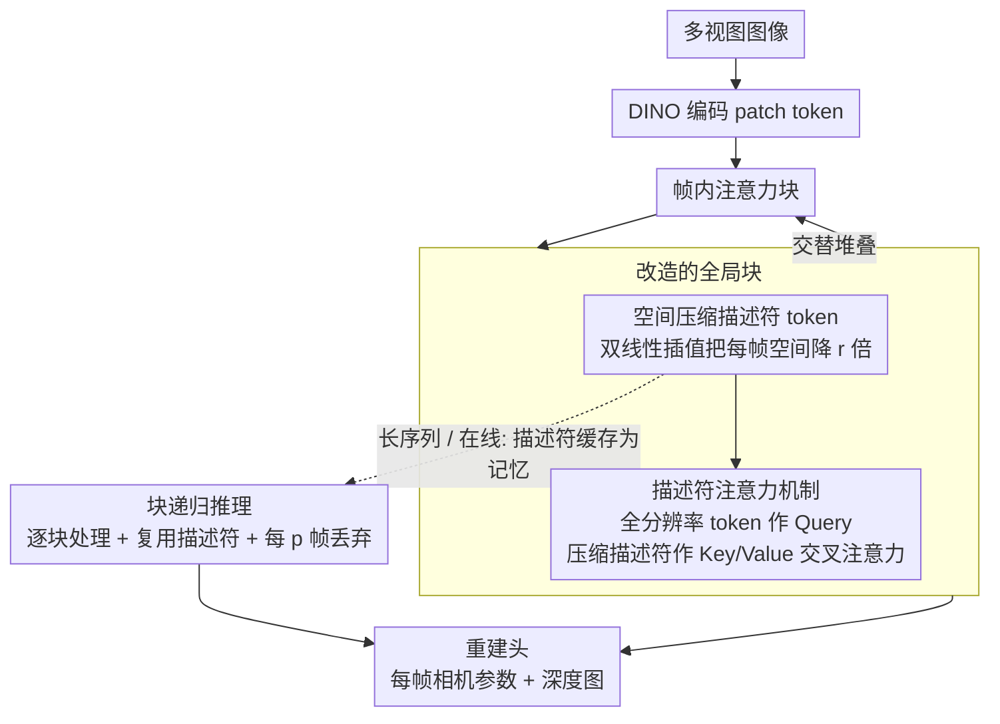

# FlashVGGT: Efficient and Scalable Visual Geometry Transformers with Compressed Descriptor Attention

**会议**: CVPR 2026  
**arXiv**: [2512.01540](https://arxiv.org/abs/2512.01540)  
**代码**: [项目页面](https://wzpscott.github.io/flashvggt_page/)  
**领域**:3D视觉
**关键词**: 三维重建, 高效Transformer, 描述符注意力, 在线推理, 多视图几何

## 一句话总结

通过将VGGT中的全局自注意力替换为基于描述符的交叉注意力，实现了1000张图像推理时间降至VGGT的9.3%，同时保持竞争性重建精度，并可扩展至3000+张图像序列。

## 研究背景与动机

VGGT是多视图3D重建的里程碑模型，通过交替的帧内和全局注意力块实现高保真重建。然而，全局注意力需要对所有图像token做自注意力，复杂度为O(S²N²)（S为图像数，N为每帧token数），当处理1000张图像时token总量超过100万，计算瓶颈严重。

作者通过两个关键观察提出解决方案：
1. 经典方法（如SfM）表明稀疏关键点即可推断精确的帧间关联，密集token间注意力可能不必要
2. VGGT的全局注意力图本身就极其稀疏——大多数注意力分数集中在零附近，大量计算花在了无关token对上

## 方法详解

### 整体框架

FlashVGGT 想在不改动 VGGT 整体结构的前提下，把它最贵的那一块——跨所有图像 token 的全局自注意力——换掉，从而把上千张图像的重建从「几分钟、几十 GB 显存」拉回可用区间。主干仍是 VGGT 那套：多视图图像先过 DINO 编码成 patch token，再交替穿过帧内注意力块和全局块，最后由重建头吐出每帧的相机参数和深度图。唯一的改动发生在全局块：原本让全部 $S\times N$ 个 token 互相做自注意力，现在改成先把每帧压成一小撮「描述符」，再让全分辨率 token 只去和这些描述符做交叉注意力。受经典 SfM 启发——稀疏关键点就足以推断帧间关联，而且 VGGT 自己的全局注意力图本就高度稀疏——这套替换在几乎不掉精度的情况下把二次复杂度压了下来。长序列与在线场景再叠一层块递归推理，把描述符当记忆缓存逐块复用。

### 关键设计

**1. 空间压缩描述符 token：用插值把每帧压成紧凑描述符，而不是丢掉细节**

全局注意力之所以贵，是因为参与计算的 token 太多；最直接的省法就是先给每帧「降采样」出一组代表性 token。FlashVGGT 通过双线性插值把每帧的空间分辨率从 $(H,W)$ 降到 $(H/r, W/r)$，$r=4$ 时 token 数压缩 16 倍。关键在于压缩方式的选择：DINO 的每个 token 对应一块 $14\times14$ 像素的 patch，池化或 Top-k 这类激进聚合会把局部空间结构抹平，而双线性插值在邻域内做加权平滑，能更完整地保留细粒度线索——消融里插值的 Acc 0.436 明显优于池化的 0.560 和 Top-k 的 0.569，印证了这一点。

**2. 描述符注意力机制：让全分辨率 token 去查描述符，把全局感受野留下、把二次复杂度去掉**

有了压缩描述符，全局块就不必再让所有 token 两两互算。FlashVGGT 把全分辨率 token 当作 Query，把这一小撮压缩描述符当作 Key/Value 做交叉注意力，每个 token 仍能通过描述符间接看到整个序列的全局上下文，但参与匹配的 Key 数量从 $K$ 降到 $K_d = K/r^2$，复杂度也随之从 $O(K^2)$ 降到 $O(K\cdot K_d)=O(K^2/r^2)$。换句话说，全局感受野没丢，只是把「看所有原始 token」换成了「看每帧的浓缩摘要」，这正是省下十倍算力的来源。

**3. 块递归推理（Chunk-Recursive Inference）：把描述符当记忆缓存，支撑无上限的在线重建**

离线一次性吃进上千张图仍会撑爆显存，在线流式场景更需要边来边重建。FlashVGGT 把长序列切成连续的块逐块处理，每处理完一块就把它的描述符 token 缓存下来，作为后续块的「记忆」继续参与交叉注意力。由于描述符本身已经压缩了 $r^2$ 倍，缓存开销只有 StreamVGGT（缓存全分辨率 token）的 $1/r^2$，内存因此降了二十倍以上。为了让记忆不随序列无限膨胀，它再加一条 dropping 策略——每 $p$ 帧只保留一个描述符——把记忆增长控制在线性偏低的水平，从而把可处理长度推到 3000+ 帧。

### 损失函数 / 训练策略

采用两阶段课程训练：第一阶段在 2–24 个随机打乱视角上训练（与 VGGT 对齐），第二阶段切到有序序列上微调并启用因果掩码，使块递归推理时的记忆复用与训练分布一致。训练数据取 VGGT 的子集（7 个数据集），覆盖合成/真实、室内/室外多种场景。

## 实验关键数据

### 主实验（长序列重建，1000张图像）

| 方法 | Abs Rel↓ | CD↓ | APE↓ | 推理时间(s) | 显存(GB) |
|------|----------|-----|------|------------|----------|
| VGGT | 0.048 | 1.521 | 6.519 | 372.8 | 68.4 |
| FastVGGT | 0.034 | 1.206 | 5.651 | 78.2 | 72.6 |
| FlashVGGT | 0.032 | 1.128 | 5.237 | 35.3 | 60.7 |

### 在线重建（500张图像）

| 方法 | Abs Rel↓ | APE↓ | 时间(s) | 显存(GB) |
|------|----------|------|---------|----------|
| StreamVGGT | 0.086 | 6.543 | 209.5 | 70.7 |
| CUT3R | 0.375 | 23.456 | 34.2 | 6.2 |
| FlashVGGT | 0.047 | 4.792 | 12.5 | 13.1 |

### 消融实验

| 压缩方法 | Abs Rel | Acc↓ | 说明 |
|----------|---------|------|------|
| 池化 | 0.019 | 0.560 | 丢失局部信息 |
| Top-k | 0.019 | 0.569 | 假设不稳定 |
| 双线性插值 | 0.014 | 0.436 | 保留空间细节最优 |

### 关键发现

- VGGT在1000张图像时性能明显下降（注意力稀释），而FlashVGGT保持稳定
- 辅助描述符token（首帧全token+关键帧+相机token）对几何一致性至关重要
- FlashVGGT的置信度图更校准，避免VGGT的过度自信问题

## 亮点与洞察

- 描述符注意力是一个原则性的设计，将经典CV中"关键点/描述符"的思想融入Transformer
- 在线推理的块递归方案简洁优雅，缓存量极小
- 在1000张图像序列上推理时间仅35秒（vs VGGT 373秒），提速10倍+
- 可扩展至3000+张图像，突破了VGGT的可扩展性瓶颈

## 局限与展望

- 压缩必然损失细粒度信息，在极度依赖局部细节的场景可能有性能损失
- 关键帧选择基于k-means聚类，可能不是最优策略
- 训练数据为VGGT子集，未使用全部数据
- 块递归推理的dropping策略（每p帧保留一个）是启发式的

## 相关工作与启发

- **vs VGGT**: 全局自注意力O(N²)→描述符交叉注意力O(N²/r²)，精度相当速度提升10倍
- **vs FastVGGT**: Token合并引入额外计算开销；FlashVGGT通过插值压缩更简洁高效
- **vs StreamVGGT**: 缓存全分辨率token导致巨大内存开销；FlashVGGT只缓存描述符，内存降低20倍+

## 评分

- 新颖性: ⭐⭐⭐⭐ 描述符注意力和块递归推理设计简洁且有效
- 实验充分度: ⭐⭐⭐⭐⭐ 多尺度序列、在线/离线、消融、可视化全面覆盖
- 写作质量: ⭐⭐⭐⭐ 结构清晰，实验表格详尽，可视化质量高
- 价值: ⭐⭐⭐⭐⭐ 解决了VGGT的核心可扩展性瓶颈，实际应用价值极高

<!-- RELATED:START -->

## 相关论文

- [\[CVPR 2026\] Flow3r: Factored Flow Prediction for Scalable Visual Geometry Learning](flow3r_factored_flow_prediction_for_scalable_visual_geometry_learning.md)
- [\[CVPR 2026\] Scaling View Synthesis Transformers (SVSM)](scaling_view_synthesis_transformers.md)
- [\[CVPR 2026\] LongStream: Long-Sequence Streaming Autoregressive Visual Geometry](longstream_long-sequence_streaming_autoregressive_visual_geometry.md)
- [\[CVPR 2026\] MotionScale: Reconstructing Appearance, Geometry, and Motion of Dynamic Scenes with Scalable 4D Gaussian Splatting](motionscale_reconstructing_appearance_geometry_and_motion_of_dynamic_scenes_with.md)
- [\[CVPR 2026\] SwiftTailor: Efficient 3D Garment Generation with Geometry Image Representation](swifttailor_efficient_3d_garment_generation_with_geometry_image_representation.md)

<!-- RELATED:END -->
