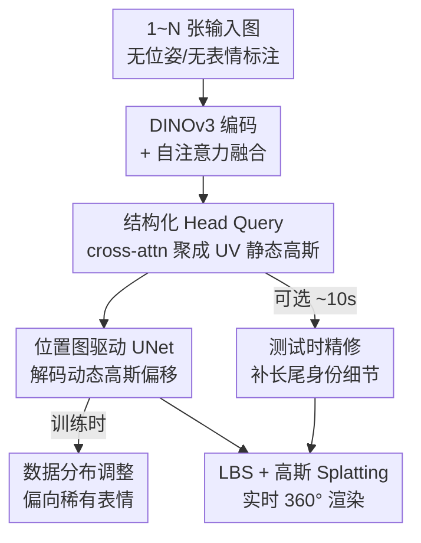

# FlexAvatar: Flexible Large Reconstruction Model for Animatable Gaussian Head Avatars with Detailed Deformation

**会议**: CVPR 2026  
**论文**: [CVF Open Access](https://openaccess.thecvf.com/content/CVPR2026/html/Peng_FlexAvatar_Flexible_Large_Reconstruction_Model_for_Animatable_Gaussian_Head_Avatars_CVPR_2026_paper.html)  
**代码**: 项目页 pengc02.github.io/flexavatar（暂未见开源仓库）  
**领域**: 3D视觉  
**关键词**: 高斯头像, 大重建模型, 可驱动头像, FLAME, 测试时精修

## 一句话总结
FlexAvatar 用一个 transformer 大重建模型 + 结构化 Head Query token，把任意数量、无相机位姿、无表情标注的单/稀疏输入图聚合成统一的 UV 空间高斯头像，再用一个 UV 位置图驱动的轻量 UNet 实时解码表情相关形变，配合数据分布调整和 10 秒测试时精修，做到了 SOTA 的 3D 一致性和动态细节真实度。

## 研究背景与动机
**领域现状**：自从 3D Gaussian Splatting（3DGS）让复杂场景实时渲染变得可行，可驱动 3D 头像重建迎来一波热潮。主流路线大致分三类：2D 驱动生成器（GAGAvatar、Portrait4D）、3D 先验系统（HeadGAP、One2Avatar），以及大重建/基础模型（LRM、LAM、Avat3r）。

**现有痛点**：这三类各有硬伤。2D 生成器画面好看但 3D 几何一致性差，侧脸就露馅，也复现不出细致的动态形变；3D 先验系统几何连贯，但受限于 3D 数据的身份多样性太少（通常只有低千量级），且常依赖耗时的 inversion 或针对个体的微调，难以快速部署；大重建模型靠数据和模型规模拿到了强泛化，但通常**只吃单图或固定数量输入**，输出又常常对不上驱动信号、抓不住细粒度动态形变，而且很多用 cross-attention 做表情变化，实时性很差。

**核心矛盾**：可扩展性（吃任意输入、跨身份泛化）、表情保真度（细到皱纹和牙齿）、实时性三者之间存在 trade-off——加 cross-attention 表情更准但跑不动，用轻量 MLP 跑得动但细节糊，多视图约束强但又要求已知相机参数和一致表情，既不 pose-free 也不 expression-free。

**本文目标**：做一个既 camera-pose-free、又 expression-free、还 input-count-free 的可驱动高斯头像框架，从 1 到 N 张随便拍的图就能重建出能实时驱动、细节真实的 360° 头像。

**切入角度**：作者押注 attention 的泛化能力——只要把"输入数量/相机位姿/表情各异的图像"统一投影进一个 canonical 表征，就能摆脱对显式相机和表情标签的依赖；而形变这件事，与其用昂贵的 cross-attention，不如把它压成 UV 空间上的 2D-to-2D 映射，用一个轻量 UNet 实时解。

**核心 idea**：用一组可学习的 **Structured Head Query token** 作 canonical 锚点聚合任意输入，得到 UV 空间静态高斯；再用 **FLAME UV 位置图 + UNet** 实时解码表情相关的动态高斯偏移，最后留一个 10 秒的测试时精修补长尾身份细节。

## 方法详解

### 整体框架
FlexAvatar 是一个前馈式（feed-forward）大重建模型：输入是 1~N 张表情/视角各异、**无相机位姿、无表情标注**的图，输出是一个 UV 空间上的可驱动高斯头像，给任意驱动表情就能实时渲出对应的 360° 结果。整条管线分两段——先用 attention transformer 把图聚成 canonical 的静态高斯和身份特征，再用 UNet 把驱动表情解码成动态高斯偏移；端到端训练时叠一个数据分布调整策略偏向稀有表情，推理后还可选一个 10 秒精修。

每张图先过一个冻结的视觉基础模型 DINOv3 编码器 $E(\cdot)$ 抽特征 $f_i = E(I_i),\ i\in\{1,\dots,N\}$，这些特征隐式编码了相机视角和表情变化，所以不需要显式输入相机或表情。下面这张图给出整条 pipeline 的走向：

### 关键设计

**1. 结构化 Head Query token + transformer 聚合：把"任意数量 / 任意位姿 / 任意表情"统一成 canonical 3D 表征**

这是 FlexAvatar"flexible"的来源，直接针对大重建模型"只吃单图或固定数量输入、且要求已知相机/表情"的痛点。它分两步。第一步是 **number-agnostic 融合**：把 N 张图的特征拼成一个变长 token 序列，过一层全局自注意力 $F_{\text{agg}} = \text{SelfAttn}(f_1,\dots,f_N),\ F_{\text{agg}}\in\mathbb{R}^{(N\times L)\times D}$。因为注意力天然定义在变长序列上，所以同一个网络既能融一张图也能融多张图，融合权重按视觉内容动态调整，这就让输入数量彻底无关。第二步是 **Head Query 锚点**：引入一组可学习的结构化 token $Q_H\in\mathbb{R}^{N_H\times D}$ 作为 canonical 锚点，用 cross-attention 把变长的融合特征对齐到固定维度：

$$F_Q = \text{CrossAttn}(Q_H, F_{\text{agg}}) = \text{softmax}\!\left(\frac{Q_H K_{\text{agg}}^\top}{\sqrt{D}}\right)V_{\text{agg}}$$

得到的 $F_Q$ 编码了 canonical、pose-free、expression-free 的头部特征。再把它 reshape 成 UV 特征图 $F_{\text{UV}}\in\mathbb{R}^{H\times W\times D}$（$N_H = H\cdot W$），UV 空间天然给了 2D 观测到 3D 高斯解码之间的对应关系，且这套对应纯靠视觉线索推断、不需要相机位姿或离散表情标签。最后用几个卷积头把 $F_{\text{UV}}$ 解成身份特征图 $F_{\text{id}}$ 和静态高斯属性图 $G_{\text{st}}=\{P,\alpha,S,C,R\}$（位置/不透明度/尺度/颜色/旋转）。

**2. UV 位置图驱动的 UNet 动态解码：用 2D-to-2D 映射替代昂贵 cross-attention，实时解出细粒度形变**

要让头像动起来且实时，作者拒绝了三条已有路线——纯 FLAME 驱动（如 LAM）抓不住细粒度形变，轻量 MLP 驱动（如 GAGAvatar）糊且有伪影，重 cross-attention（如 Avat3r）表达力够但太贵跑不动。FlexAvatar 的做法是把驱动信号也压进 UV 空间：给定 FLAME 表情系数，先把模板顶点按表情参数形变、再用重心插值采样进 UV 得到驱动位置图 $P_{\text{driving}}$，它直接编码了局部顶点位移；把它和身份特征图沿通道拼接 $\tilde{F}_{UV} = F_{\text{id}}\oplus P_{\text{driving}}$。这样"驱动"就变成了一个 UV 图到 UV 图的映射，UNet 正好胜任——它多尺度聚合局部和全局特征、保留空间邻域、又天然对齐位置图，解出动态偏移 $\Delta G_{\text{dyn}} = \text{UNet}(\tilde{F}_{UV})$。偏移只在预定义的动态区域（脸、嘴、眼，由 UV mask $M_{\text{dyn}}$ 指定）叠加到静态高斯上：

$$G_{\text{dyn}} = G_{\text{st}} + M_{\text{dyn}}\odot\Delta G_{\text{dyn}}$$

最后对高斯位置和旋转做 FLAME 的 LBS（线性混合蒙皮）再可微渲染 $I=\mathcal{R}(\text{LBS}(G_{\text{dyn}}),\Theta)$。相比 MLP 它能抓住皱纹、眼睑这类微动态，相比 cross-attention 它能跑到 ~45 fps（UNet+LBS+splat 单次约 22 ms），算是把表达力和实时性同时拿下。

**3. 数据分布调整：给稀有但关键的表情"加戏"，治训练集的长尾失衡**

这个设计针对一个很具体的训练病：标准训练里数据集被中性表情和过渡帧主导，而皱纹、龇牙这类**罕见但关键**的动态出现得太少，模型学不好。作者的做法是主动 rebalance——选 20 个有表现力的 anchor 表情，对每个 anchor 用 FLAME 系数的余弦相似度在所有 ID 上检索相似帧，再给每个 ID 补 6 个随机表情。论文用 PCA 把全集和 anchor 集各 10,000 个采样投影到 2D，显示 anchor 集的表情分布更均匀，尤其在翻白眼、张嘴、皱眉这些边缘表情上覆盖更密。最终每个 ID 用 30 视角 × 26 时间步训练，既让稀有表情收敛更快，又让动态渲染更真实。这是一个朴素但有效的"按需补样本"策略，本质上把"学到一个全面的动态先验"这件事变成了一个数据覆盖问题。

**4. 高效测试时精修：冻住 UNet 只优化重建主干，10 秒补长尾身份细节**

前馈主干虽然可扩展，但受限于高质量 3D 头部数据，对长尾外观（特定发型、衣物等高度个性化区域）力不从心。作者加了一个只用输入图的测试时精修：**冻结动态 UNet、只优化重建模型参数** $\theta_E$，用光度+感知损失把渲染对齐到输入图

$$\theta_E^\star \leftarrow \arg\min_{\theta_E}\ \mathcal{L}_{l1,ssim,lpips}\big(\mathcal{R}(\text{LBS}(G_{\theta_E}),\Theta),\ I_{gt}\big)$$

精修时把嘴部区域的梯度 detach 掉，避免复杂口腔阴影干扰。由于前馈结果已经相当真实，只要 20 次迭代（约 10 秒）就能显著提升个性化，且因为 UNet 没动，实时驱动能力完全不受影响。这一招把大重建模型的可扩展性/鲁棒性和高斯表示的高效性结合了起来：通用部分靠前馈，个性化部分靠极短的优化补。

### 损失函数 / 训练策略
监督用标准光度+感知损失：$\mathcal{L}_{l1}=\|I_{pred}-I_{gt}\|_1$、$\mathcal{L}_{ssim}=\text{SSIM}(I_{pred},I_{gt})$、$\mathcal{L}_{lpips}=\text{LPIPS}(I_{pred},I_{gt})$。为了保住嘴部细节（尤其牙齿），额外在 face-parsing mask $M_{mouth}$ 框出的嘴部区域上加一项 LPIPS：$\mathcal{L}_{m\text{-}lpips}=\text{LPIPS}(I_{pred}\odot M_{mouth},\ I_{gt}\odot M_{mouth})$。高斯初始化在 FLAME mesh 表面 $P_{init}$、初始尺度 $S_{init}$ 置 0 防止生成过大高斯，并对位置/尺度做 L2 正则 $\mathcal{L}_{xyz}=\|P_{pred}-P_{init}\|_2^2$、$\mathcal{L}_{scale}=\|S_{pred}-S_{init}\|_2^2$。总损失是加权和，权重 $\lambda_{l1}{=}1,\lambda_{ssim}{=}0.1,\lambda_{lpips}{=}0.2,\lambda_{mouth}{=}10,\lambda_{xyz}{=}0.01,\lambda_{scale}{=}1$。整个混合模型在 16 张 80G GPU 上端到端训约 4 天，Adam，学习率 $3\times10^{-5}$。

## 实验关键数据

### 主实验
训练用 NeRSemble（150 个 subject）+ 自采的 FaceCap（2000 个 subject）；NeRSemble 16 个 + FaceCap 16 个用于评测。和一图建头像的 SOTA（LAM、Portrait4D-v1/v2、GAGAvatar）在 NeRSemble 测试集上比，所有方法都用单图推理，自重演（self-reenactment）有 GT、跨身份重演（cross-reenactment）无 GT。

| 方法 | Self PSNR↑ | Self SSIM↑ | Self LPIPS↓ | Self CSIM↑ | Cross CSIM↑ | Cross AED↓ |
|------|-----------|-----------|------------|-----------|------------|-----------|
| LAM | 17.83 | 0.8031 | 0.2730 | 0.8213 | 0.8278 | 4.8838 |
| Portrait4D-v1 | 19.37 | 0.8121 | 0.2410 | 0.8390 | 0.8399 | 4.1993 |
| Portrait4D-v2 | 19.63 | 0.8184 | 0.2360 | 0.8385 | 0.8389 | 4.2359 |
| GAGAvatar | 19.17 | 0.8283 | 0.2567 | 0.8474 | 0.8479 | 4.0454 |
| **Ours（前馈）** | **21.15** | **0.8335** | **0.2193** | **0.8490** | **0.8501** | **3.6415** |
| **Ours（+精修）** | **22.63** | **0.8491** | **0.1833** | **0.8532** | **0.8549** | **3.5879** |

仅前馈就在每一项指标上超过所有对手（PSNR 比次好的 Portrait4D-v2 高约 1.5dB），叠 10 秒精修后 PSNR 再涨到 22.63、LPIPS 降到 0.1833，重建保真和感知质量进一步提升。

### 消融实验
在 FaceCap 上逐组件消融（前馈结果，未精修）：

| 配置 | PSNR↑ | LPIPS↓ | SSIM↑ | 说明 |
|------|-------|--------|-------|------|
| w/o Position Map | 22.51 | 0.1845 | 0.8772 | 用 id 特征+FLAME 系数逐像素拼接替代位置图，动态纹理明显退化、皱纹/牙齿丢失 |
| w/o Distri. Adj. | 22.74 | 0.1868 | 0.8745 | 全量直训，皱纹和牙齿动态退化 |
| w/o Mouth Loss | 23.10 | 0.1810 | 0.8890 | 去掉嘴部 LPIPS，牙齿锐度/完整度下降 |
| **Ours Full** | **23.32** | **0.1797** | **0.8895** | 完整模型 |

### 关键发现
- **位置图驱动是动态细节的命脉**：去掉位置图后 PSNR 掉到 22.51、LPIPS 升到 0.1845，输出变平滑、皱纹和牙齿这类局部动态直接丢失——说明把驱动信号做成空间对齐的 UV 位置图，比简单拼系数有效得多。
- **数据分布调整对稀有动态贡献显著**：w/o Distri. Adj. 的 LPIPS（0.1868）是几个消融里最差的，印证了"长尾表情靠采样 rebalance 救"这个判断；PCA 可视化也显示 anchor 集在边缘表情上覆盖更均匀。
- **强可扩展性**：随训练 ID 数增加，前馈 PSNR/LPIPS 持续改善、收敛更快，作者据此认为继续 scale 3D 数据还能涨。
- **输入越多越准**：加入侧视图后前馈输出能修正正面看不到的区域；但受 GPU 显存限制，输入上限为 4 张图。
- **效率**：4 张图前馈编码约 0.4s，每个驱动表情 UNet+LBS+splat 约 22ms（~45fps），精修仅 10s。

## 亮点与洞察
- **把"驱动"降维成 UV 空间的 2D-to-2D 映射**：这是全文最巧的一手。表情驱动通常被当成昂贵的 3D/cross-attention 问题，作者把它压成 UNet 在 UV 图上的解码，既保住了空间对齐和细粒度（皱纹/牙齿），又换来了实时性——这个"用 UV 表示统一静态重建和动态驱动"的思路可迁移到身体、手等其它 FLAME-like 参数化对象。
- **可学习的 Head Query 当 canonical 锚点**：用一组结构化 query token + cross-attention 把"输入数量/位姿/表情各异"三种 flexibility 一次性吸收进固定维度表征，是 LRM 范式里很干净的解法。
- **"前馈管通用 + 10 秒精修管长尾"的分工**：与其把所有个性化都压给一个更大的网络，不如让可扩展主干学通用先验、留一个极短优化补长尾，工程上很务实。
- **训练病的数据解**：用 anchor 表情 + FLAME 余弦相似度检索来 rebalance 长尾动态，是一个朴素但可复用的 trick——任何"动态/事件长尾"的生成任务都能借鉴这种按语义锚点补样本的做法。

## 局限与展望
- 作者承认：稀有特征（眼镜、帽子）因训练数据欠表达会出伪影；身体、衣物、极端复杂发型未建模，限制整体真实度；光照只有中等泛化，做全可重光照头像仍是未来方向。
- 可扩展性既是挑战也是机会：质量随 3D 数据增加持续提升，作者设想用"大规模 3D + 海量 2D"两阶段训练进一步突破。
- 自己看到的局限：⚠️ 输入受显存限制最多 4 张图，对需要密集多视图覆盖的极端角度可能仍不够；精修虽只 10 秒但仍是 per-identity 优化，严格意义上不是纯零样本；评测主要在 NeRSemble/FaceCap 这类受控采集数据上，in-the-wild 鲁棒性主要靠定性图展示，缺少大规模野外定量评估。

## 相关工作与启发
- **vs LAM / 大重建模型（LRM 系）**：它们靠纯 FLAME 驱动或固定输入数，对不上驱动信号、抓不住细粒度形变；FlexAvatar 用 Head Query 吃任意输入、用位置图 UNet 解细节，PSNR 从 17.83 提到 21.15（前馈）。
- **vs GAGAvatar / Portrait4D（2D 驱动生成器）**：它们画面好看但 3D 一致性差、侧脸有伪影；FlexAvatar 用显式 UV 高斯保证 360° 几何一致，侧视图明显更稳。
- **vs Avat3r（重 cross-attention 驱动）**：表达力够但太贵、做不到实时；FlexAvatar 把驱动压成 UV UNet 解码，~45fps 实时还保住了动态细节。

## 评分
- 新颖性: ⭐⭐⭐⭐ 首个 pose-/expression-/count-free 的高斯头像框架，"UV 位置图 + UNet 驱动"替代 cross-attention 的思路干净有效。
- 实验充分度: ⭐⭐⭐⭐ 主结果+消融齐全、含 PSNR/SSIM/LPIPS/CSIM/AED/AKD 多指标，但野外定量评估偏弱。
- 写作质量: ⭐⭐⭐⭐ 动机和方法链路清晰，公式和设计动机交代到位。
- 价值: ⭐⭐⭐⭐ 把可扩展大重建和实时高斯驱动结合，给可驱动头像创作提供了务实的工程方案。

<!-- RELATED:START -->

## 相关论文

- [\[CVPR 2026\] ProgressiveAvatars: Progressive Animatable 3D Gaussian Avatars](progressiveavatars_progressive_animatable_3d_gaussian_avatars.md)
- [\[CVPR 2026\] Motion-Aware Animatable Gaussian Avatars Deblurring](motion-aware_animatable_gaussian_avatars_deblurring.md)
- [\[CVPR 2026\] Feed-Forward One-Shot Animatable Textured Mesh Avatar Reconstruction](feed-forward_one-shot_animatable_textured_mesh_avatar_reconstruction.md)
- [\[CVPR 2026\] PhysHead: Simulation-Ready Gaussian Head Avatars](physhead_simulation-ready_gaussian_head_avatars.md)
- [\[CVPR 2026\] HyperGaussians: High-Dimensional Gaussian Splatting for High-Fidelity Animatable Face Avatars](hypergaussians_high-dimensional_gaussian_splatting_for_high-fidelity_animatable_.md)

<!-- RELATED:END -->
