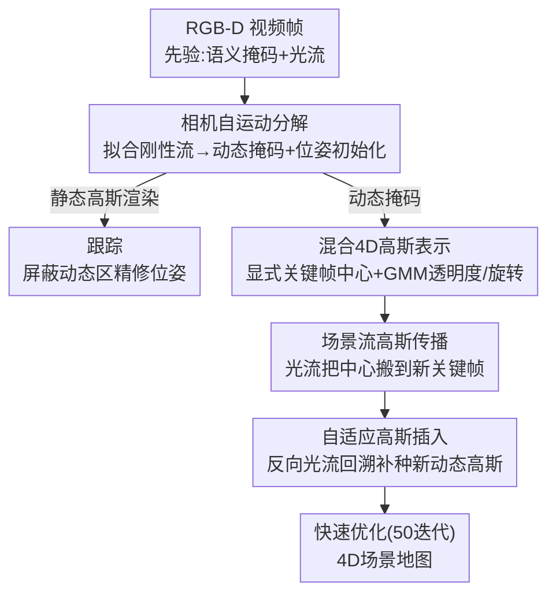

# Flow4DGS-SLAM: Optical Flow-Guided 4D Gaussian Splatting SLAM

**会议**: CVPR 2026  
**论文**: [CVF Open Access](https://openaccess.thecvf.com/content/CVPR2026/html/Wang_Flow4DGS-SLAM_Optical_Flow-Guided_4D_Gaussian_Splatting_SLAM_CVPR_2026_paper.html)  
**代码**: https://github.com/wangys16/Flow4DGS-SLAM  
**领域**: 3D视觉  
**关键词**: 动态SLAM, 4D高斯泼溅, 光流引导, 运动分解, 相机跟踪

## 一句话总结
针对动态场景下的 3DGS SLAM，本文用「相机自运动 + 光流」做类别无关的动态/静态分解，并用「显式关键帧高斯中心 + GMM 时变透明度/旋转」的混合 4D 高斯表示，配合场景流传播与自适应插入加速动态高斯训练，在跟踪精度、渲染质量和速度上同时超过 4DGS-SLAM（mapping 从 110 秒/步降到 6 秒/步）。

## 研究背景与动机
**领域现状**：把 3D Gaussian Splatting（3DGS）塞进 SLAM 已经能做到实时、照片级渲染和显式建图，但大多数 GS-SLAM（MonoGS、SplaTAM、WildGS-SLAM 等）默认世界是静态的，把运动物体当作 outlier 直接剔除，最终地图只剩静态背景。

**现有痛点**：要在 SLAM 里**既跟踪相机又重建动态物体**很难。把 3DGS 扩到时序的动态重建方法（MLP 形变场、参数化轨迹、显式时序偏移）大多依赖预先算好的多视角位姿和数小时离线训练，没法在线跑。最接近的前作 4DGS-SLAM 用 SC-GS 的稀疏控制点形变场在线重建动态元素，但有三个硬伤：① 形变 MLP 训练极慢（mapping 一步要 100 多秒，FPS 仅 0.04），② 它的动态分割依赖**按类别**的语义模型，遇到非「人」类的运动物体（气球等）就失效，③ 重建能力弱，处理「人离开又重新进入视野」这类复杂动态时需要手工指定动态起始时刻，否则崩。

**核心矛盾**：动态 SLAM 需要从**稀疏关键帧**里**高效**重建动态区域，但「重建质量/时序连贯」与「在线训练速度」存在 trade-off——隐式形变场连贯却慢，纯显式偏移快却时序不光滑、且无法处理新出现物体。

**本文目标**：(1) 做**类别无关**的动态分割，不依赖物体类别；(2) 给动态高斯一个又快又连贯的 4D 表示；(3) 在 SLAM 在线管线里同时拿到准确跟踪和高质量动态重建。

**切入角度**：作者注意到**光流天然编码了运动信息**——相机自运动诱导的「刚性流」可以用深度 + 相机内参解析地算出来（图像雅可比），凡是偏离刚性流的像素就是真正的动态像素。同样地，光流也能把上一帧的高斯中心**显式传播**到当前帧，省掉昂贵的形变 MLP。

**核心 idea**：用光流贯穿「跟踪」和「建图」两端——前端用相机自运动模型解出刚性流来做类别无关运动分解 + 相机位姿初始化；后端用光流把显式高斯中心传播/插入到新关键帧，再用 GMM 建模时变透明度和旋转，从而把动态 3DGS 的在线训练大幅提速。

## 方法详解

### 整体框架
系统输入是 RGB-D 视频流，在线交替做**相机跟踪**和**4D 场景建图**。每来一帧，先用现成模型抽出语义掩码（YOLOv9）和光流（RAFT）作为先验；送入**相机自运动分解**模块，拟合 6-DoF 相机运动解出刚性流，把偏离刚性流的像素标成动态、得到类别无关运动掩码 $M_{dy}$，同时输出一个光流引导的相机初始位姿。跟踪阶段只用静态高斯渲染、屏蔽动态掩码区域，对位姿做精修。建图阶段把动态高斯用**混合 4D 表示**维护：位置是关键帧上的显式中心（帧间线性插值），透明度和旋转用 **GMM** 在归一化时间上连续建模；进入新关键帧前先用**场景流高斯传播**把已有动态中心搬到新位置作初始化，再用**自适应高斯插入**为新出现的动态区域补种高斯，最后只跑 50 次迭代快速优化。

### 关键设计

**1. 相机自运动分解：用刚性流做类别无关的动态分割 + 位姿初始化**

针对 4DGS-SLAM「按类别分割、非人类物体失效」的痛点，本文不再依赖类别，而是从几何上判断什么在动。给定第 $t$ 帧，先用 RAFT 算光流 $F(u,v)$。对一个静态 3D 点 $x=(u,v,Z)^\top$（$Z$ 取自深度图），在小运动假设下它在图像上的运动场由相机 twist $\xi=[\rho^\top,\theta^\top]^\top\in\mathbb{R}^6$（平移+旋转）通过 $2\times6$ 图像雅可比 $J(x)$ 线性给出：$F(u,v)=J(x)\,\xi$。雅可比里平移项随 $1/Z$ 缩放、旋转项与深度无关。作者先假设语义掩码 $M_s=0$（YOLOv9 判为非动态）的像素大多是静态，把所有这些像素的方程堆起来用 IRLS（Cauchy 权重）解加权最小二乘 $\hat\xi=\arg\min_\xi\sum_i w_i\|F_i-J_i\xi\|^2$，得到刚性流 $\hat F=J\hat\xi$。然后看残差 $r(u,v)=\|F-\hat F\|_2$：动态像素会偏离刚性流、残差大，于是用稳健阈值 $M_{ca}=\mathbb{1}(r>\mathrm{median}(r)+k\cdot\mathrm{MAD}(r))$ 挑出类别无关动态掩码（MAD 是中位数绝对偏差，对 outlier 稳健），最终动态掩码 $M_{dy}=M_s\cup M_{ca}$。这一步同时白送一个相机初始化：用 $M_{dy}=0$ 的干净静态像素再解一次得到 $\hat\xi^*$，经 $\mathfrak{se}(3)$ 指数映射叠到上一帧位姿 $T^t_{cw}=T^{t-1}_{cw}\exp_{\mathfrak{se}(3)}(\hat\xi^*)$ 作粗初始化，再交给后续渲染对齐做精修——形成 coarse-to-fine。这样既摆脱了类别依赖，又因为有了光流给的初值，在复杂动态场景里显著抗漂移。

**2. 混合 4D 高斯表示：显式关键帧中心负责快、GMM 负责时序光滑**

针对「隐式形变场连贯但慢、纯显式快但不光滑」的矛盾，本文把动态高斯拆成两部分混合建模。每个动态高斯有一组静态属性 $\{s_i,\sigma_i,c_i\}$（尺度、静态透明度、颜色），再加两类动态属性。**位置**走显式路线：把时间离散成少数关键帧 $\{t_k\}$，每个高斯只在关键帧上学一个 3D 中心 $x_i^k$，任意时刻 $t$ 的位置由线性插值得到——显式中心可以直接被光流操作，训练时省掉 MLP 前向，这是提速的关键。**透明度和旋转**走参数化路线：用 GMM 在归一化时间 $\hat t\in[0,1]$ 上建模，每个高斯学 $K$ 个分量（权重 $w_{i,k}$、均值 $\mu_{i,k}$、尺度 $\tau_{i,k}$），时变透明度系数 $m_i(t)=1-\exp(-A_i\sum_k w_{i,k}\mathcal{N}(\hat t;\mu_{i,k},\tau_{i,k}^2))$（$A_i$ 为可学激活幅度），最终透明度 $\sigma_i(t)=\sigma_i\cdot m_i(t)$；旋转则用各分量的控制四元数 $q_{i,k}$ 以高斯激活为权重做归一化混合 $q_i(t)=\frac{\sum_k w_{i,k}\mathcal{N}(\cdot)q_{i,k}}{\|\sum_k w_{i,k}\mathcal{N}(\cdot)q_{i,k}\|}$，实验取 $K=3$。这样既保留显式建模的训练效率，又用 GMM 让透明度/旋转随时间平滑变化、能表达复杂动态（如人渐隐渐现），而且几乎不增加模型体积。

**3. 光流引导 4D 建图：场景流传播 + 自适应插入，把动态高斯训练提速**

显式中心的价值在这里兑现。**场景流高斯传播**解决「新关键帧从零优化太慢」：建图关键帧 $k$ 前，把上一帧动态中心 $x_i^{k-1}$ 用投影矩阵 $P_{k-1}$ 投到图像得 $u_i^{k-1}$，用光流 $F_{t_{k-1},t_k}$ 推到 $u_i^k=u_i^{k-1}+F(u_i^{k-1})$，再反投影得到 3D 形变粗估计 $\Delta x_i^k=R_k^\top(D_i^k K^{-1}\bar u_i^k - t_k)-x_i^{k-1}$。由于光流有噪、且要保持局部刚性，用 KNN 高斯加权平滑 $\Delta\hat x_i^k=\sum_{j\in\mathcal{N}(i)}w_{ij}^{knn}\Delta x_j^k$（权重按邻居距离的高斯核归一化），最终初始化 $x_i^k=x_i^{k-1}+\Delta\hat x_i^k$。这给出运动感知、空间一致的初值，让后续 4D 优化收敛快得多。**自适应高斯插入**解决「新物体/被遮挡后重现的区域没有高斯」：用反向光流 $F_{t_k,t_{k-1}}$ 把当前动态掩码 $M_{dy}^{t_k}$ 的像素 warp 回上一帧，凡是当前在动态掩码内、但回溯到上一帧不在动态掩码内的像素 $\mathcal{M}_{insert}^{t_k}=\{u_p^k\in M_{dy}^{t_k}\mid u_p^{k-1}\notin M_{dy}^{t_{k-1}}\}$ 就是新出现的动态区域，按密度因子 $1/D_{init}$ 随机采样并反投影补种新动态高斯。正是这一步让本文无需像 4DGS-SLAM 那样手工指定动态起始时刻，就能自适应处理「人离开又回来」的复杂动态。

### 损失函数 / 训练策略
跟踪损失在静态高斯渲染的颜色/深度与输入之间算带掩码的 L1：先得有效掩码 $\mathcal{M}_v=(\neg M_{dy})\cap M_o$（$M_o$ 是不透明度 $\ge\alpha$ 的区域），再 $\mathcal{L}_{track}=\frac{1}{|\mathcal{V}|}\sum_{u\in\mathcal{V}}\mathcal{M}_v(u)(\lambda_1 L_1(\hat C)+\lambda_2 L_1(\hat D))$。建图损失为 $\mathcal{L}_{map}=\lambda_1\mathcal{L}_c+\lambda_2\mathcal{L}_d+\lambda_f\mathcal{L}_f+\lambda_m\mathcal{L}_m+\lambda_{iso}\mathcal{L}_{iso}$，分别是颜色、深度、光流、二值掩码（约束渲染动态高斯的 alpha 图与运动掩码一致）和各向同性正则；flow loss 只在最后 25 次迭代加以提速。每个建图步只跑 **50 次迭代**（4DGS-SLAM 需 200 次），窗口大小 8，在线训练后再做 1500 次 color refinement。单卡 RTX A6000。

## 实验关键数据

### 主实验
在 TUM RGB-D 和 BONN 两个真实动态数据集上，跟踪用 ATE RMSE（cm），渲染用 PSNR/SSIM/LPIPS。

| 数据集 | 指标 | 本文 | 4DGS-SLAM | MonoGS |
|--------|------|------|-----------|--------|
| TUM 动态序列 | ATE RMSE↓ (Avg.) | **1.9** | 2.1 | 15.8 |
| TUM 动态序列 | PSNR↑ (Avg.) | **26.55** | 22.55 | 17.74 |
| TUM 动态序列 | LPIPS↓ (Avg.) | **0.177** | 0.229 | 0.382 |
| BONN 动态序列 | ATE RMSE↓ (Avg.) | **3.5** | 3.9 | 33.1 |
| BONN 动态序列 | PSNR↑ (Avg.) | **29.71** | 23.81 | 21.06 |
| BONN 动态序列 | LPIPS↓ (Avg.) | **0.193** | 0.240 | 0.342 |

跟踪上本文用远少于 4DGS-SLAM 的 mapping 迭代仍拿到更优 ATE；渲染上 PSNR 在两个数据集分别领先 4DGS-SLAM 约 4.0 dB 和 5.9 dB。SC-GS 在 BONN 的 ps_track/ps_track2 序列上直接重建失败（表中标「-」）。

### 运行时间分析

| 方法 | 动态分割 (ms) | 跟踪 (ms) | 建图 (ms) | FPS |
|------|---------------|-----------|-----------|-----|
| MonoGS | - | 476 | 557 | 1.93 |
| 4DGS-SLAM | 16 | 445 | 110562 | 0.04 |
| 本文 | 68 | 427 | **6285** | **0.50** |

4DGS-SLAM 每个建图步要训 100 次形变 MLP + 100 次联合优化，建图慢到 110 秒/步、FPS 仅 0.04；本文靠显式光流引导的高斯中心，把建图压到 6.3 秒/步，FPS 提升一个数量级到 0.50。本文动态分割稍慢（68 ms vs 16 ms），但它是类别无关分割且对精度不可或缺。

### 消融实验（fr3/walk_xyz 与 ballon2）

| 配置 | walk_xyz ATE↓ | walk_xyz PSNR↑ | ballon2 ATE↓ | ballon2 PSNR↑ |
|------|--------------|----------------|--------------|---------------|
| w/o 运动分解 | 2.7 | 24.40 | 7.4 | 27.59 |
| w/o 光流传播 | 2.6 | 23.91 | 4.2 | 26.86 |
| w/o 自适应插入 | 3.4 | 23.53 | 3.9 | 27.93 |
| w/o GMM | 2.7 | 24.04 | 3.7 | 27.91 |
| w/o KNN 平滑 | 2.5 | 24.47 | 3.5 | 28.14 |
| Full | **2.5** | **24.60** | **3.4** | **28.36** |

### 关键发现
- **相机自运动分解贡献最大**：去掉后 ballon2 的 ATE 从 3.4 暴涨到 7.4（含类别无关运动物体和快速运动），证明类别无关分割 + 光流位姿初始化对跟踪鲁棒性是决定性的。进一步拆解（图 4）显示：只加类别无关掩码就在 ballon2 上大幅改善，再加光流相机初始化能进一步降漂移。
- **光流传播 + 自适应插入主攻重建**：在快速运动（ballon2）和动态物体重现（walk_xyz）场景下对渲染质量贡献显著，去掉自适应插入 walk_xyz 的 ATE 从 2.5 升到 3.4、PSNR 掉到 23.53。
- **GMM 和 KNN 平滑是锦上添花**：GMM 提升复杂动态的表达力但增量较小，KNN 平滑增强传播高斯的局部刚性，两者各让 PSNR 提升约 0.2–0.6 dB。

## 亮点与洞察
- **把「相机几何」变成免费的动态分割器**：用图像雅可比 + 深度解析地预测相机诱导的刚性流，残差大的就是动态像素——这比训练一个语义/不确定性网络更轻、且天然类别无关，思路可迁移到任何带深度和光流的动态感知任务。
- **显式 vs 参数化的「分工混合」很巧**：位置用显式中心（为了能被光流直接操作、提速），透明度/旋转用 GMM（为了时序光滑、表达复杂动态），各取所长而非二选一，是处理「快」和「连贯」trade-off 的一个干净范式。
- **光流双向利用**：前向光流传播已有高斯、反向光流回溯发现新动态区域，同一个先验既负责「更新旧的」又负责「补种新的」，把「需要手工指定动态起始时刻」这个工程坑直接消掉。
- **一个数量级的提速来自架构而非工程**：mapping 从 110 秒降到 6 秒，靠的是去掉形变 MLP 改用显式光流传播初始化，启发是——在线 SLAM 里能用现成先验显式初始化的地方，就别让网络从零优化。

## 局限性 / 可改进方向
- **强依赖现成先验质量**：整套方法建立在 RAFT 光流和 YOLOv9 语义掩码之上，光流在大位移、低纹理、强遮挡处出错会直接污染运动分解和高斯传播；作者用了 KNN 平滑和按 inlier 比例 clamp 最大相机运动来缓解，但根上的先验噪声没有自校正机制。
- **小运动假设**：相机自运动分解基于「$t$ 到 $t-1$ 小运动」的线性化雅可比，相机剧烈运动或低帧率时该线性化可能失效。⚠️ 论文未给出该假设崩坏时的退化分析。
- **仍非实时**：FPS 0.50 虽比 4DGS-SLAM 快一个数量级，但离实时 SLAM（>10 FPS）还远，瓶颈转移到 6.3 秒/步的建图。
- **只在「人」为主的室内动态数据集验证**：TUM/BONN 的动态物体相对单一，类别无关的卖点在更复杂多物体街景下能否成立有待验证；且只比了无显式闭环的 GS-SLAM。

## 相关工作与启发
- **vs 4DGS-SLAM**：本文最直接的对标。4DGS-SLAM 用 SC-GS 稀疏控制点 + 形变 MLP 在线重建动态、按类别分割，建图 110 秒/步且需手工动态起始时刻；本文改用显式关键帧中心 + 光流传播替掉形变 MLP（提速到 6 秒/步）、用刚性流做类别无关分割、用自适应插入自动处理新物体，跟踪/渲染/速度三项全面更优。
- **vs SC-GS**：SC-GS 用稀疏控制点 + MLP 形变场保证空间刚性和时序连贯，但要数小时离线训练、依赖预算位姿，在线 SLAM 设定下 BONN 多个序列直接重建失败；本文的混合表示把「连贯」交给 GMM、把「效率」交给显式中心，适配稀疏关键帧在线重建。
- **vs WildGS-SLAM / 静态 GS-SLAM（MonoGS/SplaTAM）**：这类方法把动态当 outlier 剔除（WildGS 用 DINO 特征 + 不确定性 MLP），只产出静态背景地图；本文反过来把动态显式重建进 4D 地图，动态序列上 ATE 和 PSNR 大幅领先（MonoGS 在 BONN 平均 ATE 33.1 vs 本文 3.5）。
- **启发来源 GFlow**：显式用现成光流模型传播高斯中心的思路借鉴 GFlow，本文把它从离线视频重建迁移进在线 SLAM 管线并加上自适应插入和 KNN 刚性约束。

## 评分
- 新颖性: ⭐⭐⭐⭐ 「相机自运动刚性流做类别无关分割」+「显式中心/GMM 混合 4D 表示」组合得很巧，单点创新多为已有思路（GFlow 光流传播、SC-GS 形变）的迁移重组。
- 实验充分度: ⭐⭐⭐⭐ 两个真实数据集、跟踪+渲染+运行时三维度对比、5 项消融，但缺更复杂街景和闭环场景验证。
- 写作质量: ⭐⭐⭐⭐ 框架图清晰、公式完整、动机链条顺，部分先验依赖的失效边界交代不足。
- 价值: ⭐⭐⭐⭐ 把动态 GS-SLAM 的建图提速一个数量级且质量更高，对在线动态重建有实用推动。

<!-- RELATED:START -->

## 相关论文

- [\[CVPR 2026\] ODGS-SLAM: Omnidirectional Gaussian Splatting SLAM](odgs-slam_omnidirectional_gaussian_splatting_slam.md)
- [\[CVPR 2026\] AERGS-SLAM: Auto-Exposure-Robust Stereo 3D Gaussian Splatting SLAM](aergs-slam_auto-exposure-robust_stereo_3d_gaussian_splatting_slam.md)
- [\[CVPR 2026\] Optical Flow Matching: Reframing Optical Flow as Continuous Transport Dynamics](optical_flow_matching_reframing_optical_flow_as_continuous_transport_dynamics.md)
- [\[CVPR 2026\] Dynamic Visual SLAM using a General 3D Prior](dynamic_visual_slam_using_a_general_3d_prior.md)
- [\[CVPR 2026\] Unblur-SLAM: Dense Neural SLAM for Blurry Inputs](unblur-slam_dense_neural_slam_for_blurry_inputs.md)

<!-- RELATED:END -->
