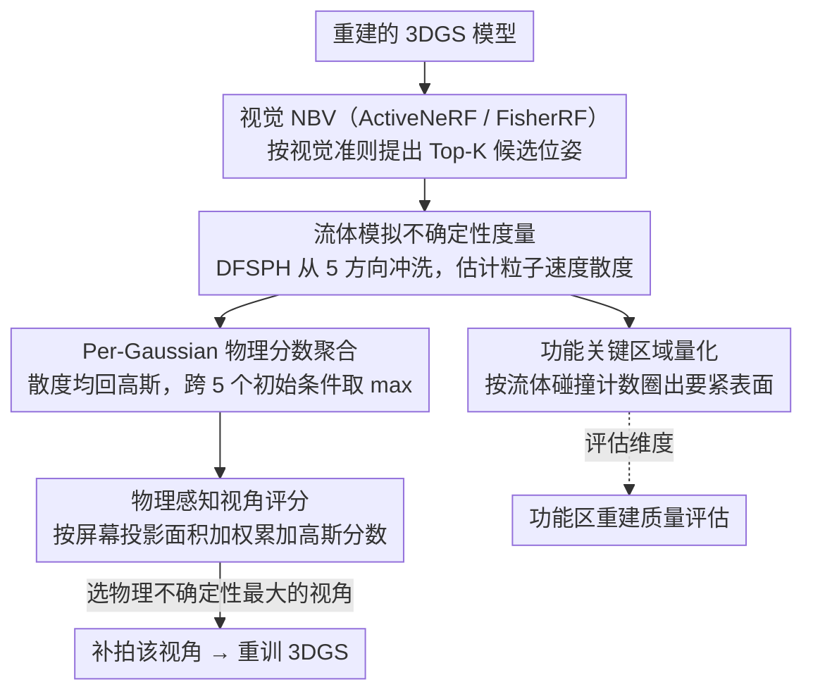

# FluidGaussian: Propagating Simulation-Based Uncertainty Toward Functionally-Intelligent 3D Reconstruction

**会议**: CVPR 2026  
**arXiv**: [2603.21356](https://arxiv.org/abs/2603.21356)  
**代码**: [GitHub](https://github.com/delta-lab-ai/FluidGaussian)  
**领域**: 3D Vision / 3D 重建  
**关键词**: 3D Gaussian Splatting, 物理感知重建, 流体模拟, 主动视角选择, 不确定性量化

## 一句话总结

提出 FluidGaussian，通过流体模拟传播的不确定性指标来指导 3D 重建中的主动视角选择，使重建结果不仅视觉逼真，还具备物理交互的合理性。

## 研究背景与动机

**领域现状**：当前 3D 重建方法（NeRF、3DGS）主要优化视觉保真度，使用光度损失来训练，取得了逼真的渲染效果。主动视角选择方法（如 ActiveNeRF、FisherRF）通过方差缩减或 Fisher 信息来选取最优视角。

**现有痛点**：这些方法仅关注外观，忽略了物理交互的合理性。重建的 3D 模型在视觉上可能完美，但在物理仿真中表现极差——例如在流体模拟中产生过大的速度场散度，意味着几何结构在物理上不可信。

**核心矛盾**：像素空间的视觉保真度（PSNR）与物理交互保真度之间存在鸿沟。一个 PSNR 很高的模型可能成为不合格的数字孪生体——在受力、流体耦合等场景下失效。

**本文目标**：如何让 3D 重建超越纯视觉线索，感知真实世界的物理交互和功能性？

**切入角度**：利用流体模拟作为"探针"来暴露重建几何的缺陷。流体与物体表面的耦合覆盖整个表面，提供密集的质量反馈信号。

**核心 idea**：定义一种基于流体模拟的不确定性度量，将其与现有视觉驱动的 NBV 策略耦合，选择同时提升视觉和物理保真度的最优视角。

## 方法详解

### 整体框架

FluidGaussian 想解决的问题是：现有主动视角选择（NBV）只盯着"哪里看不清"，从不问"哪里物理上不对"，于是它把一套流体模拟当作探针挂在已有 NBV 流程后面，专门挑出几何在物理上最站不住脚的视角去补拍。整体只有两步：先让现有视觉 NBV（ActiveNeRF / FisherRF）按它自己的准则提出 Top-K 候选相机位姿，再由 FluidGaussian 对每个候选位姿算一个物理不确定性分数，选物理质量最差、最需要被补拍的那个视角。这个分数的算法又分三层：用流体散度暴露几何缺陷 → 把粒子散度聚合到每个高斯 → 按可见性把高斯分数折算成相机分数。此外，同一套流体模拟还顺带产出一个功能关键区域指标——用流体碰撞频次圈出气动 / 水动等真正吃重的表面，作为比整体 PSNR 更对症的评估维度。整套流程不碰训练、不改架构，只是在选视角这一步插了一层重排序，所以是即插即用的。

### 关键设计

**1. 流体模拟不确定性度量：用流体散度暴露几何缺陷**

光度损失看不出几何在物理上对不对——表面有个细小的自交或间隙，渲染出来照样好看，但拿去做仿真就崩。FluidGaussian 的做法是用 DFSPH（Divergence-Free SPH）模拟器从 5 个方向（4 个水平 + 1 个顶部）"冲洗"重建出来的物体，然后看流体粒子的速度散度 $D_i = |(\nabla \cdot \mathbf{v})_i|$，散度通过 SPH 核加权求和估计：

$$(\nabla \cdot \mathbf{v})_i \approx \sum_{j \in \mathcal{N}_{h_r}(i)} V_j \cdot (\mathbf{v}_j - \mathbf{v}_i) \cdot \nabla W(\mathbf{x}_i - \mathbf{x}_j, h_k)$$

这个指标之所以有效，是因为 DFSPH 在理论上本就强制散度为零，正常情况下到处都该接近 0；唯独在流体撞到结构表面的界面处会冒出数值误差，而几何越不准、表面越粗糙，界面散度就越大。换句话说，散度天然就是一张"表面哪里有问题"的热力图，不需要额外的真值监督。

**2. Per-Gaussian 物理分数聚合：把粒子的散度搬回到高斯上**

散度是定义在流体粒子上的，但要指导视角选择得先知道是哪块几何（哪些高斯）出了问题。于是把每个高斯附近流体粒子的散度平均回来，得到该高斯在某次冲洗（初始条件 IC）下的分数 $D_g^{(IC)} = \frac{1}{|\mathcal{P}_g^{(IC)}|} \sum_{i \in \mathcal{P}_g^{(IC)}} D_i^{(IC)}$，再跨 5 个初始条件取最大值 $D_g = \max_{IC} D_g^{(IC)}$。从多方向冲洗是为了消掉单一冲洗方向带来的偏置——只从一边冲，背面的缺陷可能根本碰不到流体；而取 max 而非取平均，是想抓最差情况：只要任意一个方向暴露出这块几何有问题，就该把它标成高不确定性，不能被其他方向的"正常"稀释掉。

**3. 物理感知视角评分：把高斯的物理缺陷折算成相机分数**

有了每个高斯的物理分数，还要回答"该补拍哪个相机"。对候选相机 $\mathbf{T}$，把它能看到的高斯按可见性加权累加：

$$S(\mathbf{T}) = \sum_{g \in \mathcal{G}_\mathbf{T}} w_g(\mathbf{T}) D_g$$

权重 $w_g(\mathbf{T}) = \frac{\pi R_g(\mathbf{T})^2}{HW}$ 取自该高斯在屏幕空间的投影面积——投得越大、越占画面的高斯，对这个视角的贡献越重。最终选分数最高（即物理不确定性最大）的视角作为下一个采集目标，等于把有限的补拍预算优先砸向物理缺陷最严重、最值得修的区域，而不是均匀撒在已经够好的地方。

**4. 功能关键区域量化：用流体碰撞数圈出"真正要紧"的表面**

不是物体的每块表面都同等重要——车辆的气动前表面被气流直接冲刷，重建错了影响很大；而背风的角落即使不准也无所谓。FluidGaussian 用每个高斯被流体粒子碰撞的计数 $|\mathcal{P}_g|$ 来标记这些功能关键区域：碰撞越频繁，说明这块表面在真实物理交互里越吃重。这给了一个比"整体 PSNR"更对症的评估维度——可以单独看功能关键区域的重建质量，避免把仿真真正依赖的那几块表面的误差，淹没在大面积无关紧要区域的平均指标里。

### 损失函数 / 训练策略

- 基础训练仍用标准 3DGS 的光度损失（L1 + SSIM）
- FluidGaussian 不改变训练损失，仅改变视角选择策略——是纯即插即用的
- 从 2 个初始偏置视角开始，总预算 10 个视角

## 实验关键数据

### 主实验

| 数据集 | 方法 | PSNR↑ | SSIM↑ | LPIPS↓ |
|--------|------|-------|-------|--------|
| Blender | FisherRF | 23.42 | 0.876 | 0.107 |
| Blender | +FluidGaussian | **24.74** | **0.891** | **0.092** |
| DrivAerNet++ | ActiveNeRF | 17.38 | 0.908 | 0.160 |
| DrivAerNet++ | +FluidGaussian | **18.87** | **0.930** | **0.127** |
| MipNeRF360 | FisherRF | 15.32 | 0.471 | 0.456 |
| MipNeRF360 | +FluidGaussian | **15.55** | **0.472** | **0.452** |

视觉 PSNR 最高提升 +8.6%，速度场散度最高降低 -62.3%。

### 消融实验

| 配置 | 说明 |
|------|------|
| 5 个初始条件 vs 单一方向 | 多方向冲洗消除偏差，单一方向可能漏检某些区域缺陷 |
| 功能关键区域 PSNR | 在流体交互区域获得 +7.7% PSNR 提升 |
| 高/低雷诺数 | 高湍流下物理缺陷更明显，FluidGaussian 优势更大 |

### 关键发现

- 仅优化视觉保真度会系统性低估物理质量——视觉好看 ≠ 物理合理
- 流体模拟作为"探针"能在细粒度上暴露几何缺陷（间隙、自交、薄结构等）
- 提升物理保真度的同时也提升了视觉质量（说明两者并非矛盾）

## 亮点与洞察

- 首次将流体模拟引入 3D 重建的不确定性量化，开创"功能智能"重建范式
- 即插即用设计——不改架构、不改训练，仅改视角选择
- 指标设计具有通用性——可将散度替换为涡度等其他物理量
- 为数字孪生应用提供了"仿真就绪"重建的新方向

## 局限与展望

- 流体模拟计算开销较大，每次 NBV 评估需运行 5 次 SPH
- 目前仅考虑不可压缩流体，未扩展到可压缩或多相场景
- 视角预算固定为 10，未探讨自适应预算策略
- 仅支持刚体边界，未处理柔性物体

## 相关工作与启发

- 连接了 3D 重建（3DGS/NeRF）与物理仿真（SPH 流体力学）两个领域
- 为工程/科学领域的数字孪生提供了新思路——重建不仅要"看起来对"，还要"用起来对"
- 启发：其他物理交互（碰撞、形变）也可作为重建质量的评估信号

## 评分

- 新颖性: ⭐⭐⭐⭐⭐ 将流体模拟不确定性引入 3D 重建，开创性地定义"物理感知"重建
- 实验充分度: ⭐⭐⭐⭐ 三个数据集覆盖合成+真实+科学场景，但缺乏大规模数据验证
- 写作质量: ⭐⭐⭐⭐⭐ 动机清晰、思路连贯、物理推导完整
- 价值: ⭐⭐⭐⭐ 对数字孪生和仿真就绪资产有重要应用价值

<!-- RELATED:START -->

## 相关论文

- [\[ICML 2026\] Trust3R: Evidential Uncertainty for Feed-Forward 3D Reconstruction](../../ICML2026/3d_vision/trust_it_or_not_evidential_uncertainty_for_feed-forward_3d_reconstruction_with_t.md)
- [\[CVPR 2026\] Uncertainty-driven 3D Gaussian Splatting Active Mapping via Anisotropic Visibility Field](uncertainty-driven_3d_gaussian_splatting_active_mapping_via_anisotropic_visibili.md)
- [\[CVPR 2026\] GaussianFluent: Gaussian Simulation for Dynamic Scenes with Mixed Materials](gaussianfluent_gaussian_simulation_for_dynamic_scenes_with_mixed_materials.md)
- [\[CVPR 2026\] DiffusionHarmonizer: Bridging Neural Reconstruction and Photorealistic Simulation with Online Diffusion Enhancer](diffusionharmonizer_bridging_neural_reconstruction_and_photorealistic_simulation.md)
- [\[CVPR 2026\] ReWeaver: Towards Simulation-Ready and Topology-Accurate Garment Reconstruction](reweaver_towards_simulation-ready_and_topology-accurate_garment_reconstruction.md)

<!-- RELATED:END -->
