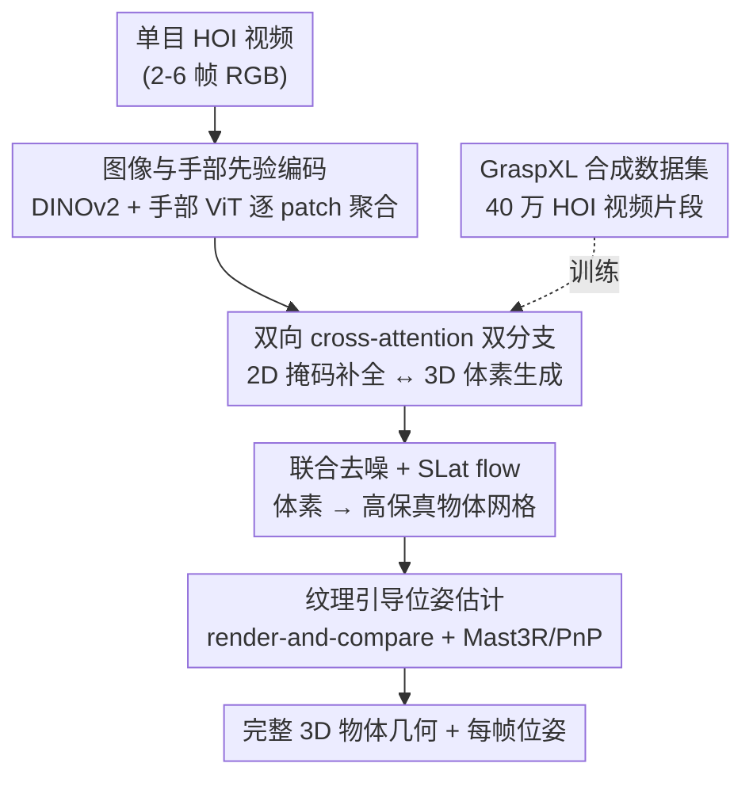

# ForeHOI: Feed-forward 3D Object Reconstruction from Daily Hand-Object Interaction Videos

**会议**: CVPR 2026  
**论文**: [CVF Open Access](https://openaccess.thecvf.com/content/CVPR2026/html/Chen_ForeHOI_Feed-forward_3D_Object_Reconstruction_from_Daily_Hand-Object_Interaction_Videos_CVPR_2026_paper.html)  
**代码**: https://github.com/Tao-11-chen/ForeHOI  
**领域**: 3D视觉  
**关键词**: 手物交互, 前馈重建, 3D形状补全, 扩散模型, 遮挡补全  

## 一句话总结
ForeHOI 用一个端到端前馈网络，直接从单目手物交互视频里重建被手严重遮挡的物体几何——靠扩散模型双分支同时预测"补全后的 2D 物体掩码"和"完整 3D 体素"并让两者双向交互，把过去要几小时优化的任务压到一分钟内，且精度反超优化类方法。

## 研究背景与动机
**领域现状**：日常单目视频里到处是手抓物体的画面，是具身智能的宝贵数据源。3D 手部重建这几年已经很成熟（MANO + 大数据驱动的回归模型），但视频里"被抓的那个物体"的重建一直被忽视。

**现有痛点**：手持物体重建难在两点——① 手的遮挡 + 物体自遮挡，导致任何一帧都看不全物体；② 相机、手、物体三者在单目视频里全在动，相对运动难估。现有路线各有硬伤：EasyHOI 把问题简化成单图输入，用 2D inpainting + 3D 生成模型补全，但丢掉了视频的多视角/时序信息；MagicHOI 把预训练新视角合成模型塞进辐射场优化，但管线复杂、各阶段的视角不一致误差会累积，而且优化辐射场动辄几小时；直接用 VGGT 做初始重建再补全的路子，在严重遮挡下 VGGT 初始结果就崩了，后续补全更救不回来。

**核心矛盾**：要在严重遮挡下重建，就必须同时补全 2D 观测和 3D 形状；但现有方法要么只补 2D（单图路线丢视频信息），要么把 2D 补全和 3D 重建拆成串行多阶段（误差累积 + 慢）。两件本该互相帮忙的事被割裂了。

**本文目标**：去掉所有预处理（SfM、单独的手/物掩码、辐射场优化），做一个吃视频片段、一分钟内吐物体几何的前馈模型。

**切入角度**：作者的核心观察是——2D 掩码补全和 3D 形状补全是高度耦合、互相强化的两件事。完整的 2D 物体轮廓能告诉 3D 分支"被手挡住的地方边界在哪"，而 3D 几何反过来约束 2D 掩码"补全成什么形状才自洽"。把它们放进同一个扩散框架里联合预测、双向交换信息，遮挡问题就能被有效化解。

**核心 idea**：用一个扩散 DiT 的双分支结构，让 2D 掩码补全分支和 3D 体素生成分支通过双向 cross-attention 互相喂特征，端到端联合去噪出完整物体几何；并为此造了首个 40 万样本规模的高保真合成手物交互数据集来喂饱它。

## 方法详解

### 整体框架
输入是一段视点有限的单目 RGB 手物交互视频（训练时随机取 2–6 帧），输出是完整的 3D 物体网格 + 每帧物体位姿。整条管线全程前馈：先把每帧图像编码成同时含图像语义和手部先验的特征；再用一个扩散 Transformer（DiT）双分支结构，让"2D 物体掩码补全"和"3D 体素生成"两条分支通过双向 cross-attention 联合去噪；体素生成后过一个结构化隐空间（SLat）flow 精修成高保真网格；最后用 render-and-compare + Mast3R 匹配反推每帧物体位姿。

### 关键设计

**1. 图像与手部先验编码：让模型确定地知道"手在哪、挡了哪"**

遮挡的根源是手，所以模型必须先搞清楚手的形状和位置。作者对每帧同时抽两套特征：用 DINOv2 抽图像 patch 特征，再用 SOTA 手部位姿估计模型的 ViT backbone 抽手部特征 $F_{hand}\in\mathbb{R}^{n\times1024}$；两者按 patch-to-patch 拼成 $F_{input}\in\mathbb{R}^{n\times2048}$，再用两层 MLP 投回 $\mathbb{R}^{n\times1024}$。关键之处在于这些特征是与每帧图像像素对齐的，因此天然带着局部相机空间下的隐式信息，绕开了多帧之间的尺度不一致问题。靠这套编码，推理时不再需要任何单独的手/物掩码输入，把输入要求压到最低——只要 RGB 视频。

**2. 双向 cross-attention 双分支：让 2D 掩码补全和 3D 形状补全互相喂特征**

这是全文的核心。作者早期实验发现直接回归完整几何极难，于是把问题拆成两件互补的事：逐帧补全完整物体掩码（2D）+ 生成完整物体体素（3D），两者在同一个 DiT 里联合训练。几何分支从一个 $64\times64\times64$ 的噪声隐变量出发逐步去噪成粗几何；不同于 ReconViaGen 直接用图像特征做条件，作者把几何分支每个 DiT block 的条件**换成来自掩码分支的特征**（从浅到深逐层对应），让掩码分支直接引导形状重建。反过来，几何分支的 3D 特征又被当作上下文信号、通过额外 cross-attention 喂回掩码分支。整个过程写作：

$$y_{j+1}=\sum_{k=1}^{N}\mathrm{CrossAttn}\big(Q(y_j),K(x_i^n),V(x_i^n)\big)\cdot w_n,\quad x_{i+1}=\mathrm{CrossAttn}\big(Q(x_i),K(y_j),V(y_j)\big)$$

其中 $y_j$ 是几何分支第 $j$ 个 block 的 3D 特征，$x_i$ 是掩码分支第 $i$ 个 block 后的图像特征，$N$ 是帧数，$w_n$ 是第 $n$ 帧的融合权重。一个值得注意的工程收益：多视角特征是用加权 cross-attention 融合而非拼接，所以输入序列变长时显存只是温和增长，不像那些拼接多图特征的方法（VGGT 类）那样吃不消长序列。为什么有效——完整 2D 掩码给了 3D 分支每个视角下"物体完整轮廓"的额外监督，3D 分支不必凭空 hallucinate 被遮区域；而 3D 几何又反过来约束掩码补全得自洽，两者互相精修把整体质量抬上去。

**3. 流匹配联合训练 + SLat 精修网格：同一时间步同步去噪 2D 与 3D**

两条分支用条件流匹配（CFM）端到端联合训练，每步对 2D 掩码和 3D 隐变量用**同一个随机 $t$** 同步监督：

$$\mathcal{L}_{CFM}(\theta)=\mathbb{E}_{t,x_0,\epsilon}\big\|v_\theta(x,t)-(\epsilon-x_0)\big\|_2^2,\qquad \mathcal{L}=\mathcal{L}^{2D}_{CFM}+\beta\,\mathcal{L}^{3D}_{CFM}$$

$v_\theta(x,t)$ 是网络预测的速度场，由从数据指向噪声的真值向量场 $(\epsilon-x_0)$ 监督，$\beta$ 平衡 2D 与 3D 两项。推理时给定 3D 噪声体或 2D 噪声图 $x_0\sim p_0$，用欧拉采样沿学到的向量场积分 $x(1)=x(0)+\int_0^1 v_\theta(x(t),t)\,dt$ 同步去噪出掩码和体素。体素拿到后再过一个在本文数据上微调的 masked multi-view SLat flow 精修成高保真表面、解码成网格（follow TRELLIS）。这里有个针对遮挡的关键改动：SLat 阶段把原本的"完整物体图像"输入换成"被遮挡的物体图像"，并且直接用 DINOv2 特征而非 VGGT 特征——因为物体严重遮挡时 VGGT 特征不可靠。

**4. 纹理引导的位姿估计：用重建出的带纹理模型反推每帧物体位姿**

现实中大量物体高度对称，只靠几何估位姿会有旋转歧义，所以作者改用基于纹理的 render-and-compare。先从球面均匀分布的视点渲 30 张参考图，和输入帧拼起来过 VGGT 拿粗相机位姿；因为渲染视点位姿已知，可解出把 VGGT 预测映射到物体空间的变换，得到每帧初始位姿。再用 Mast3R 在每个输入帧和它对应渲染图之间建 2D 对应（选 Mast3R 是因为它训练时数据增强充分、对本文不完美的生成纹理更鲁棒），配 PnP + RANSAC 迭代精修若干轮，把粗位姿磨到很准。

### 损失函数 / 训练策略
训练目标即上面的联合 CFM 损失 $\mathcal{L}=\mathcal{L}^{2D}_{CFM}+\beta\,\mathcal{L}^{3D}_{CFM}$，SLat 精修阶段沿用 TRELLIS 第二阶段的损失。架构直接复用 TRELLIS，两阶段 DiT 都用 LoRA 微调（rank 64、alpha 128、dropout 0，只插在每个注意力块的 qkv 投影和输出投影层）。训练时输入视点数随机取 2–6，图像 resize 到 $518\times518$（得 $47\times47$ patch），手部特征器吃 $224\times224$，用 CNN+MLP 融合两套特征；随机混合不同时间戳/视角的图像做增强。Adam，学习率 5e-4，8 张 NVIDIA L20 40G 上训 4 天，总 batch size 32。值得一提的是，模型**只在自建合成数据上训练、不在任何真实数据上微调**，却直接泛化到真实 benchmark，反衬出数据先验之强。

### 数据集构建
没有现成大规模 HOI 数据，作者基于 GraspXL（RL 抓取合成）造了首个大规模高保真合成数据集：给 MANO 手加参数化纹理模型并随机肤色，从 Objaverse 物体里按纹理质量和运动幅度筛选高质量抓取序列，用 Blender 渲成多视角视频，自动生成保证手物始终在视锥内的相机轨迹，并随机化光照强度和方向。最终得到 40 万样本，带手掩码、物掩码、手位姿、物位姿、深度图等完整标注。

## 实验关键数据

### 主实验
在 HO3D（14 个序列，长序列切成 30 帧片段）和更具挑战的 egocentric 数据集 HOT3D（6 个 5–15 帧短片段）上评测，指标用 Chamfer distance（CD，cm，越低越好）+ F-score@5mm/@10mm（%，越高越好）。

| 方法 | HO3D CD↓ | HO3D F@5↑ | HO3D F@10↑ | HOT3D CD↓ | HOT3D F@5↑ | HOT3D F@10↑ | 平均耗时(min) |
|------|---------|----------|-----------|----------|-----------|------------|------------|
| EasyHOI | 1.83 | 46.35 | 69.24 | 1.21 | 18.46 | 34.25 | 175 |
| HOLD | 1.36 | 66.42 | 82.43 | N/A | N/A | N/A | 330 |
| HORT | N/A | N/A | N/A | 2.32 | 16.52 | 20.43 | 0.8 |
| MagicHOI | 0.86 | 64.53 | 91.87 | N/A | N/A | N/A | 58 |
| **Ours** | **0.79** | **68.95** | **93.72** | **1.03** | **60.5** | **89.1** | **1.1** |

几何精度在两个数据集上全面领先，且耗时仅约 1 分钟——相比 MagicHOI（58 min）、HOLD（330 min）约 100× 加速。HOT3D 上优势尤其大（F@5 从次优的 18.46 飙到 60.5），因为该数据集是真·日常快速交互、遮挡剧烈且 SfM 常失败，而 HOLD/MagicHOI 依赖 SfM 位姿，SfM 一挂整条管线就崩。

位姿估计（HO3D）对比 HOLD 和 Dynhor：

| 方法 | RPE(cm)↓ | RPE(°)↓ | ATE(m)↓ |
|------|---------|--------|--------|
| HOLD | 5.87 | 6.24 | 0.27 |
| Dynhor | 4.25 | 5.25 | 0.24 |
| **Ours** | **1.42** | **2.64** | **0.13** |

本文用重建模型做模板匹配 + Mast3R 鲁棒匹配，位姿全面优于依赖 SfM 初值的 HOLD 和依赖随机文本生成模板的 Dynhor。

### 消融实验
消两个关键设计（手部特征、2D 掩码补全分支）+ 数据的重要性（HO3D）：

| 配置 | CD(cm)↓ | F@5(%)↑ | F@10(%)↑ | 说明 |
|------|--------|--------|---------|------|
| MV data | 1.23 | 25.54 | 68.54 | ReconViaGen backbone + 普通物体数据 + 随机遮挡 |
| our data | 0.91 | 53.64 | 80.63 | 换成本文 HOI 数据训练 |
| + hand feats | 0.88 | 54.53 | 85.43 | 再加手部特征输入 |
| + mask comp. | **0.79** | **68.95** | **93.72** | 再加 2D 掩码补全分支（完整模型） |

### 关键发现
- **数据是第一推手**：只换成本文 HOI 数据（不改架构），F@5 就从 25.54 跳到 53.64。作者解释普通物体数据集是 object-centric 对齐坐标系、且用无语义的随机遮挡，模型学不到"手抓物体"这种被旋转、被手按的真实场景——直接证明了通用多视角数据无法替代真实 HOI 数据。
- **2D 掩码补全分支贡献最大**：加上它后 F@5 从 54.53 再涨到 68.95（+14.4），F@10 涨到 93.72。补全的物体掩码相对规则、还隐含手物交互信息，反过来显著提升模型对严重遮挡的理解。
- **手部特征解决"指印凹陷"**：没有手部特征时，模型有时会在手接触区域把物体补成带明显指印凹陷的错误形状——手部特征直接告诉模型遮挡来自哪里。

## 亮点与洞察
- **把"补全 2D 掩码"当成 3D 重建的免费监督信号**：2D 掩码补全本身是个相对简单的任务，但它强迫网络理解手物交互边界，再通过双向 attention 反哺 3D，性价比极高——这是把一个易学的辅助任务设计成主任务杠杆的范例。
- **加权 cross-attention 融合多视角而非拼接**：用 $w_n$ 加权融合多帧特征，使长序列输入显存只温和增长，规避了 VGGT 类拼接方案的显存瓶颈，是可迁移到其他多视角前馈重建的实用 trick。
- **遮挡场景下主动弃用 VGGT 特征**：SLat 阶段把"完整图像 + VGGT 特征"换成"遮挡图像 + DINOv2 特征"，因为重度遮挡下 VGGT 不可靠——一个朴素但关键的工程判断，体现了对失败模式的清醒认识。
- **位姿估计绕开几何对称歧义**：不靠纯几何而用生成纹理 + Mast3R 匹配做 render-and-compare，对高对称物体更鲁棒。

## 局限与展望
- 模型**完全依赖合成数据训练**，虽然在真实 HO3D/HOT3D 上泛化良好，但合成 grasp（GraspXL）的抓取多样性和物体分布是否覆盖真实长尾，文中未充分讨论；⚠️ 真实世界中更复杂的双手交互、可变形物体未见评测。
- HOT3D 评测只精选了 6 个 5–15 帧短片段，且经过人工裁剪/去畸变预处理，评测规模偏小，统计稳健性存疑。
- 位姿估计依赖生成纹理质量，作者也承认生成纹理"不完美"才特意选了鲁棒的 Mast3R；纹理质量差时位姿精度可能受限。
- render-and-compare 要渲 30 张参考图 + 多轮 PnP 精修，虽然总耗时仍 ~1 分钟，但这部分相对几何重建是额外开销，对极端实时场景可能仍偏重。

## 相关工作与启发
- **vs EasyHOI**：EasyHOI 把问题简化成单图，串行用 2D inpainting + 3D 生成补全；本文用视频输入并把 2D/3D 补全联合进同一前馈框架，避免了串行管线的累积误差，且能利用多视角/时序信息。
- **vs MagicHOI**：MagicHOI 把新视角合成塞进辐射场优化，复杂、慢（58 min）、且 2D 多视角生成天然不一致导致背面形状怪异、表面粗糙；本文前馈 1 分钟出结果，靠原生 3D 扩散保证一致性。两者都依赖 SfM 而本文不依赖。
- **vs HOLD**：HOLD 是唯一无物体形状先验的方法，因此难以补全完整形状，且依赖 SfM 位姿；本文有强 3D 生成先验 + 不依赖 SfM。
- **vs ReconViaGen / TRELLIS**：本文复用 ReconViaGen 的重建先验和 TRELLIS 的架构/SLat，但把单分支条件生成扩展成双向双分支、并针对遮挡换掉 VGGT 特征——是把单图原生 3D 生成迁移到视频 HOI 遮挡场景的关键适配。

## 评分
- 新颖性: ⭐⭐⭐⭐⭐ 首个从单目 HOI 视频前馈重建物体几何的方法，2D/3D 双向联合补全的框架设计巧妙
- 实验充分度: ⭐⭐⭐⭐ 两数据集 + 位姿 + 完整消融充分，但 HOT3D 评测样本偏少、纯合成训练泛化边界讨论不足
- 写作质量: ⭐⭐⭐⭐ 动机和机制讲得清晰，公式与图配合到位
- 价值: ⭐⭐⭐⭐⭐ 100× 加速 + 反超优化类方法 + 开源 40 万规模数据集，对具身智能数据数字化很实用

<!-- RELATED:START -->

## 相关论文

- [\[CVPR 2026\] Glove2Hand: Synthesizing Natural Hand-Object Interaction from Multi-Modal Sensing Gloves](glove2hand_synthesizing_natural_hand-object_interaction_from_multi-modal_sensing.md)
- [\[CVPR 2026\] Particulate: Feed-Forward 3D Object Articulation](particulate_feed-forward_3d_object_articulation.md)
- [\[CVPR 2026\] CARI4D: Category Agnostic 4D Reconstruction of Human-Object Interaction](cari4d_category_agnostic_4d_reconstruction_of_human_object_interaction.md)
- [\[CVPR 2026\] Clay-to-Stone: Phase-wise 3D Gaussian Splatting for Monocular Articulated Hand-Object Manipulation Modeling](clay-to-stone_phase-wise_3d_gaussian_splatting_for_monocular_articulated_hand-ob.md)
- [\[CVPR 2026\] PanoVGGT: Feed-Forward 3D Reconstruction from Panoramic Imagery](panovggt_feed-forward_3d_reconstruction_from_panoramic_imagery.md)

<!-- RELATED:END -->
