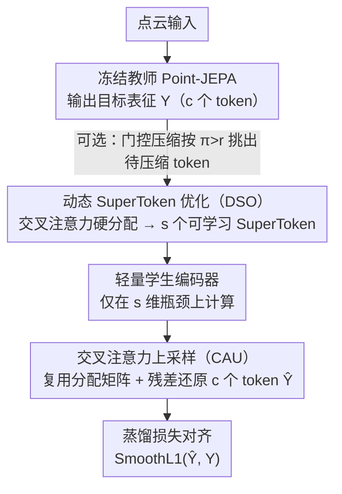

# Foundry: Distilling 3D Foundation Models for the Edge

**会议**: CVPR 2026  
**arXiv**: [2511.20721](https://arxiv.org/abs/2511.20721)  
**代码**: 无  
**领域**: 3D视觉 / 模型压缩  
**关键词**: 基础模型蒸馏, 3D点云, SuperToken, 表征空间压缩, 边缘部署

## 一句话总结

提出 Foundation Model Distillation（FMD）范式和 Foundry 框架，通过 compress-and-reconstruct 目标让学生模型学习一组可学习的 SuperToken 来压缩教师的潜空间基向量，生成的单一蒸馏模型在分类、分割、少样本等多任务上保持通用性，同时将 FLOPs 从 478G 降至最低 137G。

## 研究背景与动机

**领域现状**：自监督学习（SSL）预训练的基础模型已成为强大的通用特征提取器，在 3D 点云领域（如 Point-BERT、Point-JEPA）表现尤为突出，广泛应用于机器人、自动驾驶、AR/VR 等场景。这些模型通过在大规模无标注数据上预训练，获得了对各种下游任务的强泛化能力。

**现有痛点**：这些基础模型体量巨大（数亿参数+二次注意力复杂度），在边缘设备（如机器人、AR 头显）上无法运行。即使是现代 GPU，在处理 30 万点的中等规模点云时也可能 OOM。现有的知识蒸馏（KD）方法虽然可以创建高效的学生模型，但它们产出的是"专家模型"——擅长特定任务但失去了基础模型核心的下游无关通用性。

**核心矛盾**：标准知识蒸馏在特定任务的 logit 上训练学生，创建的学生只继承了教师在该任务上的行为，不具备跨任务迁移能力。这违背了基础模型的核心价值——通用表征能力。一个理想的蒸馏方法应该保留教师的整个表征空间，而非仅保留其在特定任务上的输出。

**本文目标**：设计一种新的蒸馏范式，将大型 SSL 基础模型压缩为紧凑、高效、忠实的代理模型，保留其通用表征能力。

**切入角度**：不直接模仿教师的特征嵌入（feature mimicry），而是通过信息瓶颈强制学生学习教师潜空间的紧凑基向量——先压缩成少量 SuperToken，再从中重建教师的完整 token 级表征。

**核心 idea**：用"压缩-重建"代替"模仿"，让学生学到的不是教师的某个输出，而是能高效表示教师整个潜空间的一组基向量。

## 方法详解

### 整体框架

Foundry 想解决的事很具体：把一个动辄数亿参数的 3D 自监督教师，压成能塞进边缘设备的学生，同时**不丢掉教师那套"什么任务都能接"的通用表征**。它的做法不是去模仿教师在某个任务上的输出，而是逼学生学会用一组很窄的 SuperToken 把教师的整个潜空间"装下"再"还原"出来。

一次前向分三步走。先让冻结的教师吃进点云，吐出目标表征 $\mathbf{Y} \in \mathbb{R}^{c \times d}$（$c$ 个 token）。接着 DSO 模块把这 $c$ 个 token 压成 $s \ll c$ 个可学习的 SuperToken，由轻量学生编码器处理，CAU 模块再从这几个 SuperToken 把完整的 token 级表征 $\hat{\mathbf{Y}} \in \mathbb{R}^{c \times d}$ 重建回来。最后只用一个目标对齐两者：$\mathcal{L}_{distillation} = \text{SmoothL1}(\hat{\mathbf{Y}}, \mathbf{Y})$。具象一点：教师给出 $c$ 个 token，DSO 把它们硬分配进 $s=16$ 个桶并各取均值得到 16 个 SuperToken，学生只在这 16 维的瓶颈上算，CAU 再把它"撑回" $c$ 个 token——瓶颈越窄，学生被迫学到的就越是教师潜空间的"主成分"。此外可选的门控压缩在压缩前给每个 token 预测一个融合概率，让同一个学生在部署时按需调精度/速度。

### 关键设计

**1. 动态 SuperToken 优化（DSO）：把 $c$ 个 token 压成一组可学习的潜空间基向量**

直接对教师特征做 L2 模仿，学生只会照抄表面，学不到表征空间的结构。DSO 换了个思路：维护一组随机初始化、可端到端学习的 SuperToken $\mathbf{S} \in \mathbb{R}^{s \times d}$，把它们当作潜空间的基向量。压缩时用交叉注意力（SuperToken 当 query，输入 token 当 key/value）算一个硬分配矩阵——token $j$ 归到与它最匹配的那个 SuperToken：$\text{CAM}_{j,i} = 1$ 当 $i = \arg\max_k \frac{\mathbf{q}_k \cdot \mathbf{k}_j}{\sqrt{d}}$；再把分到同一个 SuperToken 的所有 value 取均值来更新它：

$$\mathbf{S}_{updated} = \frac{\text{CAM}^T \mathbf{V}}{\text{sum}(\text{CAM}^T, \text{axis}=1)}$$

硬 $\arg\max$ 不可导，所以用 Gumbel-Softmax 让它可微。和静态 K-Means 聚类的关键差别就在"可学习"：K-Means 的簇心只反映几何分布，而 SuperToken 随蒸馏目标一起优化，最终落在真正信息密集的方向上（消融里这一点带来 13.6% 的差距）。另外语义分组特意安排在加位置编码之前，让压缩依据内容而非坐标。

**2. 交叉注意力上采样（CAU）：从几个 SuperToken 把完整 token 表征高保真还原回去**

压缩只是手段，蒸馏目标要求逐 token 对齐教师，所以必须把 $s$ 个 SuperToken 重新"撑"回 $c$ 个 token。CAU 不另起炉灶，而是复用 DSO 那张分配矩阵 CAM 当路由：每个原始 token 位置顺着 CAM 找回它对应的 SuperToken（已被学生编码器更新过），与原始输入 token 做残差相加，再过 MLP 映射到教师维度：

$$\hat{\mathbf{Y}} = \text{MLP}(\mathbf{T} + \text{CAM} \cdot \mathbf{S}_{encoder\_out})$$

这里的残差是关键——SuperToken 瓶颈天然会丢掉局部高频细节，把原始 token $\mathbf{T}$ 残差注回来，正好补回这部分信息，重建才能做到高保真；而复用 CAM 让上采样几乎不增加额外开销。

**3. 门控压缩（Gated Compression，可选）：让同一个模型在部署时按需调精度/速度**

不同场景对精度和延迟的取舍不一样，但重训一遍代价太高。门控机制加一个 2 层 MLP，对每个 token 预测一个融合概率 $\pi_i$：只有 $\pi_i > r$（用户设定阈值）的 token 才走 DSO 被压缩，其余 token 绕过压缩、和 SuperToken 一起直接进学生编码器。训练时加正则项 $\mathcal{L}_{gate} = -\lambda_{gate} \sum_i \pi_i$ 鼓励多压一些。部署时只要拨动阈值 $r$，就能在精度和计算量之间滑动，无需重新训练。

### 损失函数 / 训练策略

- 核心蒸馏损失：$\mathcal{L}_{distillation} = \text{SmoothL1}(\hat{\mathbf{Y}}, \mathbf{Y})$
- 门控版本：$\mathcal{L} = \mathcal{L}_{distillation} + \mathcal{L}_{gate}$
- 训练在 ShapeNet55 上进行 150 epochs，学生编码器初始化自教师权重，可选冻结与否
- 教师均为 ViT-S 架构的 Point-JEPA 模型

## 实验关键数据

### 主实验（通用模型 vs 专家模型）

| 方法 | ShapeNet55 分类 Acc | ShapeNetPart 分割 mIoU_C/mIoU_I |
|--------|------|------|
| 教师 (Point-JEPA) | 90.54 | 83.91/85.73 |
| Foundry (通用, 16 SuperToken) | 89.87 | 81.87/84.82 |
| 专家-分类 (KD蒸馏) | 75.09 | - |
| 专家-分割 (KD蒸馏) | - | 61.88/65.72 |

### SuperToken 机制消融

| 方法 | ShapeNet55 Acc |
|------|---------|
| Foundry (可学习 DSO+CAU) | 89.68 |
| KMeans-Student (静态聚类) | 76.08 |
| FPS-Student (预采样) | 87.56 |

### 关键发现

- **FMD 通用模型完胜专家蒸馏**：单一通用学生在两个任务上都保持高性能（89.87%/81.87%），而专家学生在其原生任务上反而崩溃（分类专家仅 75.09%、分割专家仅 61.88%），证明了 FMD 范式的优越性
- **可学习 SuperToken 远优于静态方法**：DSO 比 K-Means 高出 13.6%（89.68 vs 76.08），证明端到端学习基向量的必要性
- **极致压缩仍保持有效**：仅用 1 个 SuperToken 时，Foundry 在 10-shot 分类中仍达 91.8%，接近教师的 96.1%
- **边缘部署可行**：FLOPs 从 478G 降至 137-178G（$s$=1~16），延迟从 0.09s 降至 0.05-0.06s。在 6GB GPU 上处理 30 万点大场景，教师和 ToMe 均 OOM，Foundry 仅需 4.0GB
- 蒸馏损失与下游精度高度相关（明确的反相关），$s \leq 4$ 后收益递减，意味着仅需非常少的 SuperToken 即可充分跨越教师的潜空间

## 亮点与洞察

- **范式创新：从 task-specific KD 到 representation distillation**：这是本文最重要的贡献。传统 KD 创建的是任务专家，而 FMD 创建的是基础模型的微型代理。这种范式差异对所有需要在边缘部署基础模型的场景都有意义
- **compress-and-reconstruct 的信息瓶颈设计**：强制学生通过极窄的 SuperToken 瓶颈重建教师表征，比直接 L2 特征模仿更能捕捉潜空间的结构。这一思路可迁移到 2D 图像基础模型（如 DINOv2、SAM）的蒸馏
- **与现有 token 压缩方法兼容**：Foundry 的 FMD 框架可以与 ToMe、PiToMe、PatchMerger 组合使用并进一步提升性能

## 局限与展望

- 仅验证了单一教师（Point-JEPA ViT-S），对其他 3D 基础模型（如 Point-MAE、PointGPT）和更大规模架构（ViT-B/L）的泛化性未知
- 仅覆盖 3D 点云领域，向 2D 图像、视频基础模型的扩展是重要的未来方向
- 门控机制虽然提供了推理时的灵活性，但其性能对训练时 $\lambda_{gate}$ 的选择敏感
- DSO 的硬分配可能限制了表征质量——被错误分配的 token 无法修正（虽然 CAU 的残差连接部分弥补了这一点）
- 未在真实的边缘设备（如 Jetson、手机）上进行端到端性能评测

## 相关工作与启发

- **vs TinyCLIP/CLIP-KD**：这些方法蒸馏的是 CLIP 的跨模态对齐能力（一种特定能力），而 Foundry 蒸馏的是 SSL 模型的整个表征空间（通用能力），理念根本不同
- **vs ToMe/PiToMe**：ToMe 在推理时在线合并 token 来加速，而 Foundry 是离线蒸馏创建全新的学生模型。两者可以互补——实验显示用 FMD 框架蒸馏 ToMe 学生可以获得最佳效果
- **vs 3DLST**：3DLST 也使用可学习 supertoken，但目标是特定分割任务的推理加速，而非创建通用代理模型。Foundry 将其思路升级为蒸馏目标

## 评分

- 新颖性: ⭐⭐⭐⭐⭐ 提出了 FMD 新范式并清晰论证了与传统 KD 和直接特征模仿的本质区别
- 实验充分度: ⭐⭐⭐⭐⭐ 6+1 个数据集, 通用vs专家对比, 多种 SuperToken 数量, 门控变体, 计算量分析, 大场景测试
- 写作质量: ⭐⭐⭐⭐⭐ 问题定义精炼、实验层次清晰、与相关工作的区分到位
- 价值: ⭐⭐⭐⭐⭐ 对 3D 基础模型的边缘部署有直接推动作用，FMD 范式具有广泛迁移潜力

<!-- RELATED:START -->

## 相关论文

- [\[CVPR 2026\] ESAM++: Efficient Online 3D Perception on the Edge](esam_efficient_online_3d_perception_on_the_edge.md)
- [\[CVPR 2026\] Towards Foundation Models for 3D Scene Understanding: Instance-Aware Self-Supervised Learning for Point Clouds](towards_foundation_models_for_3d_scene_understanding_instance-aware_self-supervi.md)
- [\[CVPR 2026\] ArtHOI: Taming Foundation Models for Monocular 4D Reconstruction of Hand-Articulated-Object Interactions](arthoi_taming_foundation_models_for_monocular_4d_reconstruction_of_hand-articula.md)
- [\[CVPR 2026\] Distilling Unsigned Distance Function for Surface Reconstruction from 3D Gaussian Splatting](distilling_unsigned_distance_function_for_surface_reconstruction_from_3d_gaussia.md)
- [\[CVPR 2026\] E2EGS: Event-to-Edge Gaussian Splatting for Pose-Free 3D Reconstruction](e2egs_event-to-edge_gaussian_splatting_for_pose-free_3d_reconstruction.md)

<!-- RELATED:END -->
