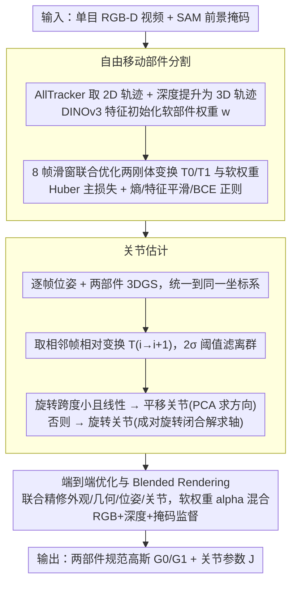

# FreeArtGS: Articulated Gaussian Splatting Under Free-Moving Scenario

**会议**: CVPR 2026  
**arXiv**: [2603.22102](https://arxiv.org/abs/2603.22102)  
**代码**: [https://freeartgs.github.io/](https://freeartgs.github.io/)  
**领域**: 3D视觉  
**关键词**: 铰接物体重建, 高斯溅射, 自由移动, 关节估计, 运动分割

## 一句话总结
FreeArtGS 提出在"自由移动场景"(物体姿态和关节状态同时任意变化)下从单目RGB-D视频重建铰接物体的方法，通过运动驱动的部件分割、鲁棒关节估计和端到端3DGS优化的三阶段流程，在自建FreeArt-21基准和现有数据集上远超所有基线。

## 研究背景与动机

1. **领域现状**：铰接物体重建是3D视觉的重要问题，对增强现实和机器人仿真有重要价值。现有方法主要分三个方向：(a) 基于基础模型的单图生成，泛化性差；(b) 从两个铰接状态的固定多视角相机重建，需要对齐两状态的轴；(c) 从单目视频重建，假设有固定不动的基底部件。
2. **现有痛点**：单图生成缺乏后优化难以泛化；多视角双状态方法轴对齐困难限制实用性；单目视频方法的"静态基底"假设在实际操作中常被违反(如使用剪刀、钳子时两个部件都在动)，且覆盖不完整。
3. **核心矛盾**：真实场景中铰接物体常被自由操纵——物体姿态和关节状态同时变化，没有固定基底参考。现有方法无法处理这种最自然的使用场景。
4. **本文目标** 在自由移动场景下，仅从单目RGB-D视频重建铰接物体的完整外观、几何和关节参数。
5. **切入角度**：将密集2D点跟踪先验与3DGS优化结合——用点跟踪提供运动线索驱动部件分割，用优化提供最终的高精度重建。
6. **核心 idea**：用点跟踪+特征先验做自由运动部件分割，用相对变换估计关节类型和轴向，再端到端优化3DGS同时精修外观、几何和关节。

## 方法详解

### 整体框架
FreeArtGS 要解决的是一个被以往方法回避的设定：当一个人随手拿起剪刀或钳子边操纵边录像时，物体的整体姿态和关节状态在同一段视频里同时变化，没有任何一个部件是固定不动的参考。输入只有一段单目 RGB-D 视频和 SAM 生成的前景掩码，最终要吐出两个部件各自的规范高斯 $\mathcal{G}_c^0, \mathcal{G}_c^1$ 以及把它们连接起来的关节参数 $\mathcal{J}$。

整条流水线按"先粗后精"分三步走：先靠运动差异把物体劈成两个刚性部件；再从两部件的相对运动里读出关节是旋转还是平移、轴在哪；最后把外观、几何、相机位姿和关节参数一起丢进可微渲染做端到端联合优化，把前两步留下的小误差磨平。这样安排的逻辑是——现成模型(点跟踪、特征、位姿)能给一个有噪声但大致靠谱的初始化，而优化负责把它收敛到高精度。

### 关键设计

**1. 自由移动部件分割：不靠"谁不动"，而靠"谁动得不一样"分部件**

以往单目方法默认有个静止的基底部件可以当锚点，但自由操纵时两个部件都在动，这个假设直接失效。FreeArtGS 换了个出发点：在足够短的时间窗里，每个刚性部件的运动可以近似为一个独立的刚体变换，于是分割问题就变成"判断每个点跟随哪一个刚体变换"。具体做法是用 AllTracker 拿到像素级 2D 轨迹、结合深度提升成 3D 轨迹，再用 DINOv3 特征为每个点初始化一个软部件权重 $w_{t,p} \in [0,1]$；然后在 8 帧的滑动窗口内同时优化两个刚体变换 $T^0, T^1$ 和这些软权重，主损失用 Huber 损失衡量每个点用哪个变换解释自己的相对运动误差更小。

点跟踪本身常常抖动，纯运动信号会把分割推向次优解，所以这里压了三项正则：熵损失把软权重往接近 0/1 的二值分配上推、特征空间邻居图上的平滑损失保证空间相邻且语义相似的点归属一致、和初始化权重的 BCE 损失防止优化跑偏离 DINOv3 给的语义先验太远。正是这层特征空间约束，让分割在轨迹噪声下仍然稳。

**2. 关节估计：用相邻帧的相对变换而非绝对变换，躲开点跟踪噪声**

分好部件后要回答关节是什么类型、轴在哪。先用现成位姿估计器为每帧标出每个部件到相机的变换 $E_i^k \in SE(3)$，分别重建两个部件的 3DGS 并细化位姿，再把两个部件统一到同一坐标系(以运动量最小的那个部件作参考)。得到部件间相对变换序列 $\{T_i\}$ 后，按运动特征分类——旋转跨度很小且呈强线性的判为平移关节，否则判为旋转关节；旋转关节从成对相对旋转求闭合解得到旋转轴，平移关节则用 PCA 求平移方向。

这一步真正的鲁棒性来自两个细节。其一，不直接用绝对变换 $T_i$，而是用相邻帧之间的成对相对变换 $T_{i \to (i+1)}$——绝对变换会把整段轨迹的累积噪声都背上，而相邻帧之间噪声小、约束更干净。其二，用 $2\sigma$ 阈值把离群的变换样本剔掉，避免个别坏帧污染轴的闭合解。

**3. 端到端优化与 Blended Rendering：用可微渲染把粗关节磨成精关节**

前两步给的是合理但偏粗的初始化，第三步把所有变量——外观、几何、相机位姿、关节参数——一起交给可微渲染来联合精修。关节按类型参数化：旋转关节为 $(u, o, \theta_i)$，平移关节为 $(u, d_i)$。关键招数是 Blended Rendering：对规范高斯施加刚体变换后，按部件软权重 $w \in [0,1]$ 做 alpha 混合再渲染，

$$\mathcal{G}_i = w(\mathcal{G}_c \circ I) \cup (1-w)(\mathcal{G}_c \circ \mathcal{J}_i)$$

这样部件归属不再是硬切，而是可以在优化过程中被细粒度地继续调整。监督来自 RGB(L1+SSIM)、深度(L1)和前景掩码(L1)，合成总损失

$$\mathcal{L}_{E2E} = \sum_i \left(\mathcal{L}_{rgb}^i + \lambda_{depth}\mathcal{L}_{depth}^i + \lambda_{mask}\mathcal{L}_{mask}^i\right)$$

可微渲染把外观和运动学紧紧耦合在一起，外观对得上的前提是关节也对得上，于是粗关节里的小偏差会被光度一致性这个约束逼回正确值。

### 损失函数 / 训练策略
部件分割阶段：$\mathcal{L} = 200\mathcal{L}_{main} + 10\mathcal{L}_{smooth} + 0.01\mathcal{L}_{ent} + 5\mathcal{L}_{init}$，每个帧对100次迭代。部件重建和端到端优化各30000次迭代，基于NeRFStudio实现。全流程约25分钟(100帧640×360视频，RTX 4090)。

## 实验关键数据

### 主实验 (FreeArt-21, 旋转关节)

| 方法 | Axis↓ (deg) | Position↓ (cm) | State↓ (deg) | CD-w↓ (cm) | CD-m↓ (cm) | PSNR↑ (dB) |
|------|-------------|----------------|--------------|------------|------------|------------|
| ArticulateAnything | 42.00 | 59.38 | - | - | - | - |
| Video2Articulation | 20.00 | 16.31 | 27.37 | 2.29 | 10.74 | - |
| **FreeArtGS** | **1.04** | **0.29** | **1.43** | **0.14** | **0.28** | **24.02** |

### 消融实验 (FreeArt-21, 旋转关节)

| 配置 | Axis↓ | Position↓ | State↓ | CD-w↓ | PSNR↑ |
|------|-------|-----------|--------|-------|-------|
| Full model | 1.04 | 0.29 | 1.43 | 0.14 | 24.02 |
| w/o Smooth Loss | 28.01 | 17.73 | 18.74 | 5.72 | 10.60 |
| w/o Init Loss | 9.35 | 19.58 | 14.64 | 0.75 | 13.07 |
| w/o Noise Resistance | 4.75 | 2.22 | 1.30 | 0.17 | 22.65 |
| w/o Blended Rendering | 1.72 | 1.88 | 1.88 | 0.12 | 22.23 |

### 关键发现
- FreeArtGS在关节轴精度上相比Video2Articulation提升约20倍(1.04° vs 20.00°)，位置精度提升56倍
- **Smooth Loss贡献最大**：移除后轴误差从1.04°暴增至28.01°，证明点跟踪不稳定性必须通过特征空间正则化缓解
- **Init Loss也很关键**：移除后位置误差从0.29cm增至19.58cm，DINOv3特征提供的语义先验对正确分区至关重要
- Noise Resistance(异常值过滤)对关节估计的鲁棒性有明显帮助
- Blended Rendering提升约2dB PSNR，同时保持关节精度
- 在Video2Articulation-S数据集(静态基底设定)上也超越所有方法，证明通用性
- 真实世界6个物体平均轴误差2.73°，几何CD 2.48cm

## 亮点与洞察
- **问题定义的价值**：首次提出并定义"自由移动场景"的铰接物体重建问题，这是最自然的使用场景，比现有假设(静态基底、多视角双状态)更实用
- **先验+优化的组合策略**：用现成模型(AllTracker, DINOv3, SAM)提供初始化先验，用优化提供最终精度。单独使用任一都不够——先验有噪声，纯优化难初始化
- **FreeArt-21基准的构建**：用VR系统遥操作PartNet-Mobility物体在Sapien中生成自由移动数据，覆盖7类21个物体(5旋转+2平移关节)，填补了领域空白
- **全流程25分钟**：100帧视频处理仅需25分钟(分割6min+关节估计1min+端到端优化18min)，实用性强

## 局限与展望
- 当前假设物体仅有两个刚性部件，无法处理多部件铰接结构(如机械臂)；可通过顺序捕获每个运动部件扩展
- 依赖多个现成模型(AllTracker、DINOv3、SAM、位姿估计器)，级联误差可能在复杂场景中放大；理想方案是开发统一前馈模型
- 需要RGB-D输入(深度信息)，纯RGB视频目前因连续视频深度预测精度不足无法支持
- 手持操作时手部遮挡虽有一定鲁棒性，但严重遮挡仍可能导致失败

## 相关工作与启发
- **vs Video2Articulation**: V2A依赖预训练前馈重建模型(Monst3R)预测动态，在自由移动场景下失败；FreeArtGS用优化方法从运动差异分割部件
- **vs ArticulateAnything**: AA使用VLM推理生成URDF，受幻觉影响在大多情况下预测错误的轴；FreeArtGS通过几何优化获得精确关节
- **vs RSRD**: RSRD假设每个部件运动模式独特，不适用于铰接物体(部件运动由关节约束关联)；在V2A-S上所有指标最差
- **vs 动态重建方法**: 前馈动态重建(如Monst3R)无法恢复自由移动场景的精确运动；FreeArtGS将前馈先验与优化结合

## 评分
- 新颖性: ⭐⭐⭐⭐ 自由移动设定是全新的问题定义，方法虽然是多个已有技术(3DGS、点跟踪、刚体拟合)的组合但组合方式非平凡
- 实验充分度: ⭐⭐⭐⭐⭐ 自建基准+现有数据集+真实物体三重验证，详尽消融，指标全面
- 写作质量: ⭐⭐⭐⭐ 问题定义清晰，方法条理分明，各模块设计动机交代充分
- 价值: ⭐⭐⭐⭐⭐ 新问题+新基准+强结果，对数字孪生和机器人学习有直接应用价值

<!-- RELATED:START -->

## 相关论文

- [\[CVPR 2026\] ART: Articulated Reconstruction Transformer](art_articulated_reconstruction_transformer.md)
- [\[CVPR 2026\] HeroGS: Hierarchical Guidance for Robust 3D Gaussian Splatting under Sparse Views](herogs_hierarchical_guidance_for_robust_3d_gaussian_splatting_under_sparse_views.md)
- [\[CVPR 2026\] Part$^{2}$GS: Part-aware Modeling of Articulated Objects using 3D Gaussian Splatting](part2gs_part-aware_modeling_of_articulated_objects_using_3d_gaussian_splatting.md)
- [\[CVPR 2026\] Sky2Ground: A Benchmark for Site Modeling under Varying Altitude](sky2ground_a_benchmark_for_site_modeling_under_varying_altitude.md)
- [\[CVPR 2026\] Paparazzo: Active Mapping of Moving 3D Objects](paparazzo_active_mapping_of_moving_3d_objects.md)

<!-- RELATED:END -->
