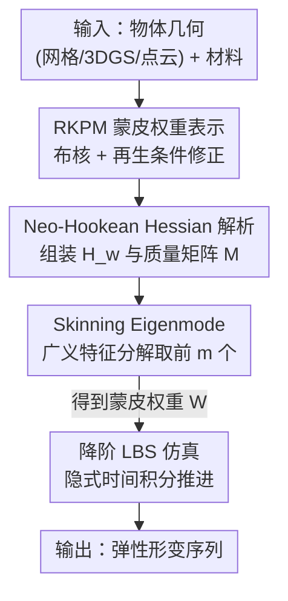

# FreeForm: Reduced-Order Deformable Simulation from Particle-Based Skinning Eigenmodes

**会议**: CVPR 2026  
**arXiv**: [2605.29318](https://arxiv.org/abs/2605.29318)  
**代码**: 无（论文未提供）  
**领域**: 3D视觉 / 物理仿真 / 弹性体动力学  
**关键词**: 降阶仿真, 无网格方法, RKPM, Skinning Eigenmode, 高斯泼溅仿真

## 一句话总结
用再生核粒子法（RKPM）来参数化弹性体的蒙皮权重，再通过对弹性能量 Hessian 求广义特征值问题直接解出最优 skinning eigenmode，从而做无网格、降阶的弹性体仿真——相比用神经场逐物体优化的 Simplicits 训练快约 40×、精度还更接近 FEM 金标准。

## 研究背景与动机
**领域现状**：可变形弹性体仿真在工程、视效、机器人里都很常用，主流是有限元法（FEM）。但 FEM 需要高质量体网格作为输入，而现代点云类表示（如 3D Gaussian Splatting，3DGS）很难甚至无法定义合法网格；且高分辨率 FEM 自由度（DoF）多、求解慢。

**现有痛点**：为了绕开网格，业界转向两条路。一是无网格的粒子法（MPM、SPH，被 PhysGaussian / PhysDreamer 用来仿真 3DGS），但它们对时空离散非常敏感，大形变下容易出现数值断裂、边界不精确。二是降阶仿真（reduced-order），用一小组 DoF + 复杂基函数表达运动，但传统降阶法几乎都绑死在网格上。唯一一个无网格降阶工作 Simplicits 用神经场来表示蒙皮权重——可它必须对**每个**物体单独优化一个神经场，慢；而且作者实测发现它精度也偏弱，可能源于弹性能量变分优化本身的困难。

**核心矛盾**：要"无网格 + 降阶 + 高精度 + 快"，神经场把蒙皮权重藏进了一个需要梯度优化的隐式表示里，既慢又难收敛到好解；粒子法虽快但不是降阶、且大形变不稳。无网格表示与"能直接解出最优基"这两件事此前没能兼得。

**本文目标**：找到一种无网格表示，既能在体上做积分、定义弹性能量，又能让"最优降阶基"被**直接、解析地**算出来，而不是靠迭代优化。

**切入角度**：作者注意到再生核粒子法（RKPM）这种无网格、粒子化的函数表示从没被用在这个场景。RKPM 是显式表示，意味着弹性能量的 Hessian 可以解析写出，从而把"找最优蒙皮基"变成一个标准特征分析问题。

**核心 idea**：用 RKPM 离散蒙皮权重场，把经典的 skinning eigenmode 思路搬到无网格域——对弹性能量 Hessian 做带质量矩阵约束的广义特征分解，前 $m$ 个特征向量就是最优蒙皮权重，一步线性代数取代神经场迭代优化。

## 方法详解

### 整体框架
方法分训练（构基）和仿真两阶段。训练阶段：给定任意能在体上采样积分的物体几何（网格 / 3DGS / 点云皆可）和材料参数，先布一组 RKPM 粒子核，组装弹性能量的权重空间 Hessian $\mathbf{H}_w$ 和 RKPM 质量矩阵 $\mathcal{M}$，再求广义特征值问题 $\mathbf{H}_w \mathbf{v} = \lambda \mathcal{M} \mathbf{v}$，取前 $m$ 个特征向量当蒙皮权重 $\mathbf{W}$。仿真阶段：固定 $\mathbf{W}$，用线性混合蒙皮（LBS）把 $m$ 个仿射变换 DoF 映成全体点的位移，按标准隐式时间积分最小化增量势能往前推。整条管线没有一处需要网格，也没有任何逐物体的神经网络训练。

### 关键设计

**1. 用 RKPM 表示蒙皮权重：让无网格基也"光滑且可复现线性场"**

痛点是无网格降阶需要一组高质量、光滑的基函数，但朴素的径向基函数（RBF）即使节点采样均匀，做出来的低阶模态也是不规则、不光滑的。作者改用 RKPM：任意向量场 $\mathbf{u}(\mathbf{X};\mathbf{c})=\sum_{k=1}^{K}\phi_k(\mathbf{X})\mathbf{c}_k$，其中再生核 $\phi_k(\mathbf{X})=\varphi_k(\mathbf{X})\mathbf{P}^T(\mathbf{p}_k)\mathbf{C}(\mathbf{X})$ 是在普通高斯 RBF $\varphi_k$ 之上乘了一个校正项。校正函数 $\mathbf{C}(\mathbf{X})$ 由"再生条件" $\sum_k \phi_k(\mathbf{X})\mathbf{P}(\mathbf{p}_k)=\mathbf{P}(\mathbf{X})$ 决定，本文取一次多项式基 $\mathbf{P}(\mathbf{X})=[1,x,y,z]^T$，代入后得到逐点线性方程 $\mathbf{M}(\mathbf{X})\mathbf{C}(\mathbf{X})=\mathbf{P}(\mathbf{X})$，可解析求逆。这个再生条件保证核能精确复现至多一次的多项式场，于是蒙皮基天然光滑、能逼近期望的线性场——论文 Fig.3 直观对比：同样的节点，RBF 和 partition-of-unity RBF 的首个非零 Laplacian 模态都是扭曲不光滑的，唯有 RKPM 接近理想线性场。这是后续能解出高质量 eigenmode 的地基

**2. Skinning Eigenmode：把"找最优蒙皮基"变成广义特征值问题，甩掉神经场优化**

这是替代 Simplicits 神经场的核心。作者不直接对位移 $\mathbf{u}$ 做全阶仿真（核太多会很贵），而是用 RKPM 离散蒙皮权重场 $\mathbf{W}^j(\mathbf{X})=\sum_k \phi_k(\mathbf{X})\mathbf{c}_k^j$，问题归结为给每个蒙皮函数定 nodal 值矩阵 $\mathbf{c}\in\mathbb{R}^{K\times m}$。把全阶弹性势能在静止位形附近二阶展开 $E_{\text{pot}}^{\text{full}}(\mathbf{d})\approx \tfrac12\mathbf{d}^T\mathbf{H}\mathbf{d}$，并按 Benchekroun 等人的做法用偏重平移的权重空间 Hessian $\mathbf{H}_w=\mathbf{H}_{xx}+\mathbf{H}_{yy}+\mathbf{H}_{zz}$。要找"最能表达形变又互相正交"的一组权重，就化成带质量矩阵约束的优化

$$\arg\min_{\mathbf{c}\in\mathbb{R}^{K\times m}}\ \operatorname{tr}(\mathbf{c}^T\mathbf{H}_w\mathbf{c}),\quad \text{s.t.}\ \ \mathbf{c}^T\mathcal{M}\mathbf{c}=\mathbf{I}$$

其中正交约束来自蒙皮权重的内积 $\langle\mathbf{W}^i,\mathbf{W}^j\rangle=\delta_{ij}$，离散后正是 RKPM 质量矩阵 $\mathcal{M}$。这个问题等价于广义特征值问题 $\mathbf{H}_w\mathbf{v}=\lambda\mathcal{M}\mathbf{v}$，直接取前 $m$ 个广义特征向量即为蒙皮权重。为什么有效：一是一步稠密线性代数求解，无需逐物体迭代优化，故而比神经场快约 40×；二是特征分解输出的权重**精确正交**（数值精度内），而 Simplicits 把正交当软惩罚，只能近似满足，正交性直接影响仿真时系统 Hessian 的数值条件，因此本文解既快又稳

**3. Neo-Hookean Hessian 的解析简化：暴露出"材料感知的 Laplace 特征模态"**

要解上面的特征问题，必须能廉价地组装 $\mathbf{H}_w$。作者针对最常用的 Neo-Hookean 能量 $\Psi(\mathbf{F})=\tfrac12[\bar\lambda(\det\mathbf{F}-\gamma)^2+\bar\mu\operatorname{tr}(\mathbf{F}^T\mathbf{F})-E_0]$ 推导出（Proposition 1）权重空间 Hessian 的 $(i,j)$ 元有极简形式

$$(\mathbf{H}_w)_{ij}=\int_\Omega (\lambda(\mathbf{X})+4\mu(\mathbf{X}))\,\nabla\phi_i(\mathbf{X})^T\nabla\phi_j(\mathbf{X})\,d\mathbf{X}$$

只需核梯度的内积加 Lamé 系数加权积分，易于解析评估（完整证明在附录）。更妙的是均匀材料下 $\lambda,\mu$ 为常数，Hessian 退化成 $(\lambda+4\mu)\mathbf{L}_{ij}$，其中 $\mathbf{L}$ 正是 RKPM 的弱形式 Laplace 矩阵——也就是说弹性 Hessian 与 Laplace 矩阵**共享特征模态**，而 Laplace 模态又是 Dirichlet 能量的极小化子，这把本文方法和经典模态分析接上了。非均匀材料时，$\lambda+4\mu$ 随空间变化，本文方法就自然成了"材料感知的 Laplace eigenmode"，能对不同硬度区域给出不同形变行为——这是 Simplicits 之外少有方法具备的 material-aware 能力

### 损失函数 / 训练策略
本文"训练"不是梯度下降，而是直接解广义特征值问题，因此没有传统意义的 loss。但消融里对比了三个训练维度：(1) 损失形式——Simplicits 用对随机采样变换 $\mathbf{z}\sim\mathcal{N}(\mathbf{0},\sigma\mathbf{I})$ 的期望弹性能 $\mathcal{L}_{\text{elastic}}$，本文用 Hessian 二次近似；(2) 积分点采样——Simplicits 每轮随机采点，本文固定用均匀网格采样；(3) 求解方式——梯度迭代 vs 广义特征分解。结论是 Hessian 近似 + 网格采样在 RKPM 下精度更好，且特征分解相比梯度优化把训练时间从上百秒压到约 4 秒。

## 实验关键数据

### 主实验
标准梁形变测试（5m×1m×1m 悬臂梁，杨氏模量 $5\times10^6$ Pa，泊松比 0.45），以四面体网格 FEM 为金标准，报告归一化点位 MSE。$m$ 为仿射变换数（DoF）：

| 测试 | $m$ | Simplicits | Ours | MPM | SPH |
|------|-----|-----------|------|-----|-----|
| Bend | 6 | 1.20e-02 | 7.80e-03 | 1.42e-03 | 6.57e-04 |
| Bend | 16 | 1.53e-03 | 4.10e-04 | — | — |
| Bend | 32 | 1.17e-04 | 2.93e-06 | — | — |
| Twist | 6 | 2.54e-03 | 1.56e-04 | 2.34e-05 | 1.33e-04 |
| Twist | 16 | 1.30e-04 | 3.46e-06 | — | — |
| Twist | 32 | 4.21e-05 | 6.64e-06 | — | — |

同等 DoF 下本文一致优于 Simplicits；$m$ 增大时精度稳步提升，DoF 足够时甚至能匹配或超过 MPM、SPH 这两个全阶方法。

Thingi10K（20 形状）+ Simready（19 形状）数据集，$m=32$，三种边界条件下的归一化 MSE / 最大误差，以及训练时间：

| 边界条件 | 指标 | Simplicits | Ours | 提升 |
|----------|------|-----------|------|------|
| Fix Side | MSE | 8.97e-03 | 6.87e-03 | 34.2% |
| Pull Farthest | MSE | 5.58e-02 | 3.75e-02 | 29.8% |
| Pull Boundary | MSE | 3.37e-02 | 3.11e-02 | 37.5% |
| 训练时间(s) | — | 121.44 ±10.15 | 3.19 ±2.48 | 97.4% |

精度全面更优，训练时间约 40× 提速（约 121s → 约 3s）。

### 消融实验
训练策略消融（标准梁，$m=16$/$32$，三个维度交叉对比）：

| 损失 | 采样 | Drop MSE | Twist MSE | 时间(s) | 说明 |
|------|------|---------|----------|---------|------|
| Simplicits | Random | 1.53e-3 | 1.30e-3 | 114.28 | 神经场 baseline |
| Random $\mathbf{z}$ | Random | 1.58e-2 | 2.50e-2 | 160.12 | RKPM + 随机能量损失 + 随机采样 |
| Random $\mathbf{z}$ | Grid | 1.24e-2 | 7.29e-3 | 412.38 | 换网格采样 |
| Hessian | Random | 4.86e-3 | 5.07e-4 | 103.66 | 换 Hessian 损失 |
| Hessian | Grid | 4.45e-4 | 3.49e-5 | 145.96 | 梯度优化版（与本文同公式） |
| Ours | Grid | 4.10e-4 | 3.46e-5 | 3.93 | 特征分解求解 |

测试期积分点采样消融（5k 点，网格 vs 随机）：

| 测试 | 采样 | Simplicits | Ours |
|------|------|-----------|------|
| Drop | Grid | 1.53e-3 | 4.10e-4 |
| Drop | Random | 3.69e-3 | 9.42e-4 |
| Twist | Grid | 1.30e-4 | 3.46e-6 |
| Twist | Random | 3.88e-4 | 1.14e-5 |

### 关键发现
- Hessian 损失 + 网格采样是精度关键：换成 Hessian 损失把 Twist MSE 从 2.50e-2 降到 5.07e-4，再加网格采样降到 3.49e-5，两个设计叠加贡献最大。
- "Hessian-Grid"梯度优化版与本文公式几乎一致，精度也相当（4.45e-4 vs 4.10e-4），但本文用特征分解把时间从约 146s 压到约 4s——证明提速来自求解方式而非精度妥协。
- 测试期换随机采样虽让两方法精度都退化，但本文在两种采样下仍稳定优于 Simplicits，说明对积分采样不更敏感。
- 定性上方法可直接仿真 3DGS 物体（13 个泼溅落容器、18 个高斯狗玩具过 plinko 机），并支持机器臂与 3DGS 物体交互。

## 亮点与洞察
- **把"训练降阶基"从优化问题降维成特征分解**：最漂亮的一刀是认识到 RKPM 这种显式表示让弹性能量 Hessian 可解析写出，于是逐物体神经场优化被一次广义特征值求解取代，40× 提速且精度更好——这是"换表示带来换求解范式"的典型样例。
- **Proposition 1 把 Neo-Hookean Hessian 化成核梯度内积**：$(\lambda+4\mu)\nabla\phi_i^T\nabla\phi_j$ 这种极简形式不仅好实现，还在均匀材料下退化成 Laplace 矩阵，把方法接回经典模态分析，非均匀时又升级为"材料感知 Laplace 模态"，理论与工程都漂亮。
- **正交性从软约束变硬保证**：特征分解输出天然满足 $\mathbf{c}^T\mathcal{M}\mathbf{c}=\mathbf{I}$，避免了 Simplicits 软惩罚带来的系统 Hessian 数值条件退化——这个细节是仿真稳定的隐形功臣。
- **可迁移思路**：凡"用神经场隐式表达某个需要满足正交/物理约束的基"的任务，都可以反问能否换成显式可微表示后直接解特征/线性系统，跳过迭代训练。

## 局限与展望
- **作者承认**：作为降阶模型，全局光滑基难以表达褶皱等高频细节；尖锐接触等强非线性效应也难处理（基是围绕静止态线性化得来的光滑基）；默认不建模断裂等拓扑变化。
- **RKPM 自身敏感性**：核半径、采样密度、粒子分布都会影响基质量，需要细心实现才能保证基的好坏——这把"无网格"的麻烦从体网格转移到了粒子超参上。
- **自己发现**：评测主要在能四面体化、流形无自交的"干净"形状上做（为获得 FEM 金标准被迫筛选），对真实噪声 3DGS / 残缺点云的鲁棒性只有定性展示，缺定量。材料参数在 Thingi10K 上靠人工按语义指派（有机体 $10^5$ Pa、其它 $10^8$ Pa），偏经验。
- **改进思路**：可叠加局部高频修正基补全褶皱；将线性化基扩展到围绕多个位形的多基切换以缓解大形变误差；探索自适应核半径/粒子布点减少手调。

## 相关工作与启发
- **vs Simplicits**：同为无网格降阶仿真，Simplicits 用神经场逐物体优化蒙皮权重，本文用 RKPM + 广义特征分解直接解出；区别在于"隐式迭代优化"换成"显式解析求解"，本文优势是约 40× 训练提速 + 更低 MSE + 精确正交，劣势是引入 RKPM 核超参且仍受降阶光滑性限制。
- **vs MPM / SPH**：粒子法是全阶无网格仿真，能处理多种本构但对时空离散敏感、大形变易数值断裂；本文是降阶法，DoF 数足够时精度可匹配甚至超过它们，且更稳定，但本质上仍是低频形变近似。
- **vs 经典 Skinning Eigenmode（Benchekroun 等）**：本文沿用其权重空间 Hessian 与特征分析思路，但原方法绑定网格，本文借 RKPM 把它搬到无网格域，并给出 Neo-Hookean Hessian 的解析表达。
- **vs Chang 等参数化 Laplace 特征场**：那类方法训练神经场预测 Laplace 特征函数，但仅适用于参数化、均匀（非材料感知）物体；本文无需参数模型且材料感知。

## 评分
- 新颖性: ⭐⭐⭐⭐⭐ 首次把 RKPM 用于无网格降阶弹性仿真，并以特征分解取代神经场优化，思路干净有洞察。
- 实验充分度: ⭐⭐⭐⭐ 标准梁 + 两个数据集 + 三组消融，定量扎实；但真实噪声 3DGS 仅定性展示。
- 写作质量: ⭐⭐⭐⭐⭐ 推导清晰、动机层层递进，Proposition 把核心简化讲透。
- 价值: ⭐⭐⭐⭐ 对 3DGS / 点云物理仿真很实用，40× 提速 + 更高精度有明确落地意义。

<!-- RELATED:START -->

## 相关论文

- [\[CVPR 2026\] Z-Order Transformer for Feed-Forward Gaussian Splatting](z-order_transformer_for_feed-forward_gaussian_splatting.md)
- [\[CVPR 2026\] Learning a Particle Dynamics Model with Real-world Videos](learning_a_particle_dynamics_model_with_real-world_videos.md)
- [\[CVPR 2026\] Order Matters: 3D Shape Generation from Sequential VR Sketches](order_matters_3d_shape_generation_from_sequential_vr_sketches.md)
- [\[CVPR 2026\] PhysHead: Simulation-Ready Gaussian Head Avatars](physhead_simulation-ready_gaussian_head_avatars.md)
- [\[CVPR 2026\] UTrice: Unifying Primitives in Differentiable Ray Tracing and Rasterization via Triangles for Particle-Based 3D Scenes](utrice_unifying_primitives_in_differentiable_ray_tracing_and_rasterization_via_t.md)

<!-- RELATED:END -->
