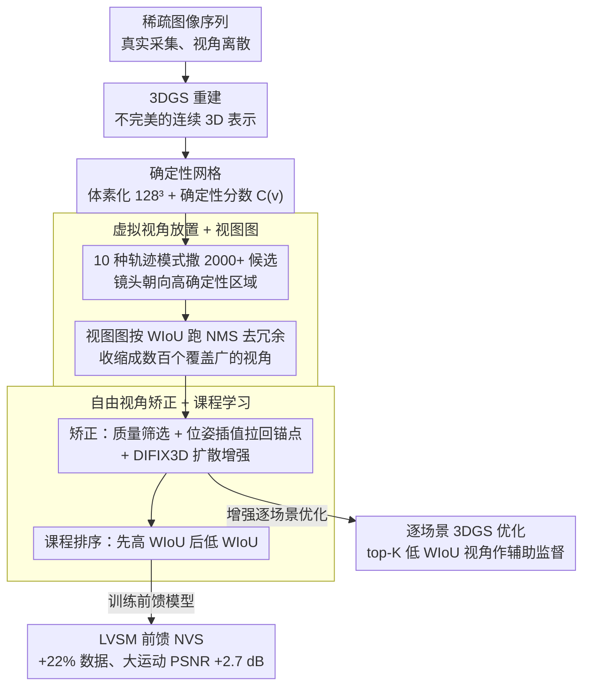

# FreeScale: Scaling 3D Scenes via Certainty-Aware Free-View Generation

**会议**: CVPR 2026  
**arXiv**: [2604.10512](https://arxiv.org/abs/2604.10512)  
**代码**: [https://mvp-ai-lab.github.io/FreeScale](https://mvp-ai-lab.github.io/FreeScale)  
**领域**: 3D视觉  
**关键词**: 新视角合成, 数据增强, 3D高斯溅射, 前馈重建, 确定性采样

## 一句话总结
FreeScale 通过从已有场景重建中以确定性引导的方式采样高质量自由视角图像，将有限的真实世界数据扩展为大规模训练数据，在前馈新视角合成模型上获得 2.7 dB PSNR 提升。

## 研究背景与动机

**领域现状**：新视角合成（NVS）正从逐场景优化（NeRF、3DGS）向可泛化的前馈模型（LVSM 等）发展，后者能从大规模数据中学习跨场景先验，在推理时高效完成 3D 重建。

**现有痛点**：前馈模型的瓶颈在于缺乏大规模、具有多样精确相机轨迹的训练数据。真实数据虽然逼真但采集稀疏昂贵，合成数据有域差距，扩散模型生成的数据无法提供精确相机位姿。

**核心矛盾**：真实场景捕获仅提供离散稀疏的视角覆盖，而重建后的连续 3D 表示虽然理论上可采样任意视角，但直接从不完美重建中采样会放大伪影。

**本文目标**：设计一个数据生成引擎，从已有真实场景重建中生成多样、高质量、带精确位姿的自由视角图像。

**切入角度**：不完美的重建场景可作为丰富的几何代理，关键在于识别哪些新视角既有信息量又不受重建误差污染。

**核心 idea**：用确定性感知的自由视角采样策略，从 3DGS 重建中识别高确定性区域，生成高质量训练数据来扩展前馈模型训练。

## 方法详解

### 整体框架
FreeScale 想解决的是前馈新视角合成模型「训练数据不够」的问题：真实采集的视角稀疏离散，而扩散生成的图像又给不出精确相机位姿。它的做法是把一次普通的 3DGS 重建当成「数据工厂」——先对一段稀疏图像序列做常规重建，但不把重建结果当最终产品，而是在这个不完美的 3D 表示上重新撒进大量虚拟相机去采样新视角。整条流水线的关键，是全程用一张「确定性网格」来判断哪些区域的几何足够可信：网格先告诉相机该往哪看、再帮着筛掉互相冗余的视角，最后对质量不达标的视角做位姿矫正和扩散增强，输出一批带精确位姿、又避开了重建伪影的自由视角图像，直接喂给前馈模型训练，或作为辅助目标增强逐场景优化。

### 关键设计

**1. 确定性网格：先量化「哪块几何能信」，再决定往哪采样**

直接从 3DGS 渲染新视角的麻烦在于，重建好的区域图像干净、重建差的区域全是伪影，但渲染器本身不告诉你哪是哪。FreeScale 的办法是把整个场景包围盒离散成 $128^3$ 的体素网格，给每个体素算一个确定性分数

$$\mathcal{C}(v_i) = \sum_j \frac{\alpha_j}{\text{Vol}_j + \epsilon}$$

也就是把落入该体素的所有高斯的不透明度 $\alpha_j$ 按各自体积 $\text{Vol}_j$ 归一后累加。直觉很直接：又小又不透明的高斯往往对应观测充分、几何收敛好的区域，分数就高；稀疏、半透明、体积大的高斯则是欠重建的飘渣，分数低。有了这张网格，后续所有「往哪看、留哪个、先学哪个」的决策都有了统一的几何依据，而不用每次去跑昂贵的图像级判断。

**2. 虚拟视角放置 + 视图图：海量撒点，再用几何 IoU 高效去冗余**

光有确定性还不够，得知道把相机放哪、放多少。FreeScale 设计了 10 种相机轨迹模式（轨道、螺旋、飞越等），以训练相机为锚点向外延伸，并让镜头朝向网格里的高确定性区域，一次性生成 2000+ 候选视角。但这么多视角彼此高度重叠，全留下来既冗余又拖慢训练。这里的巧思是用「视图图（View Graph）」做筛选：每个候选视角看到的高确定性体素集合可以看作它的「信息覆盖」，两个视角之间用加权 IoU（WIoU）衡量覆盖重叠度，再在图上跑 NMS 把高度重叠的视角抑制掉。和直接拿图像特征匹配去算视角相似度相比，WIoU 完全在确定性网格这个几何层面计算，省掉了渲染和特征提取，能在几千个候选里快速挑出一个覆盖广、冗余低的子集。

**3. 自由视角矫正 + 课程学习：救回低质量候选，并让训练从稳到难**

筛完仍会有一批视角质量不达标——位姿离锚点太远、或落进了确定性偏低的边缘。直接丢掉太浪费，FreeScale 选择「救」：把这些视角通过插值朝最近的锚点拉回一点来矫正位姿，再用 DIFIX3D 扩散模型把图像质量补上去，让原本要被弃用的视角重新可用。拿到这批增强后的视角去训练前馈模型时，并不是一股脑全喂进去，而是按课程学习排序：先用和已有训练相机 WIoU 高（视野接近、好学）的邻居视角让模型稳住，再逐步加入 WIoU 低、相机运动大的视角增加多样性。这样既避免一上来大相机运动把训练打崩，又能最终覆盖到更难的视角分布。

### 一个完整示例：一段稀疏序列怎么变成训练数据
以一段室内捕获序列为例走一遍：先用这几十张图做出一个常规但不完美的 3DGS 重建；接着把场景体素化成 $128^3$ 网格，沙发、桌面这些观测充分的区域确定性分数高，墙角和远处天花板因为飘渣多分数低。随后 10 种轨迹模式以训练相机为锚点撒出 2000+ 个候选视角，镜头都朝向高确定性区域；视图图按 WIoU 跑 NMS 后，这 2000+ 候选收缩成几百个覆盖广、互不冗余的视角。其中一部分位姿偏远的视角被插值拉回锚点、再经 DIFIX3D 增强补质量。最后这批带精确位姿的图像按课程顺序——先高 WIoU 后低 WIoU——分批喂给 LVSM 训练，仅相当于多了约 22% 的数据，就把大相机运动下的 PSNR 抬高了 2.7 dB。

### 损失函数 / 训练策略
当 FreeScale 用来增强逐场景 3DGS 优化（而非训练前馈模型）时，它会挑出与训练相机 WIoU 最低的 top-K 自由视角作为额外的监督目标，用 L1 + SSIM 的加权组合作为重建损失，借这些「最不重叠」的探索性视角去补足原始捕获没覆盖到的区域。

## 实验关键数据

### 主实验

| 数据集/设置 | 指标 | LVSM 基线 | LVSM + FreeScale | 提升 |
|-------------|------|-----------|-------------------|------|
| DL3DV (大运动) | PSNR | 18.75 | 21.45 | +2.7 dB |
| DL3DV (小运动) | PSNR | 22.20 | 24.20 | +2.0 dB |
| MipNeRF360 (大运动) | PSNR | 13.88 | 17.27 | +3.39 dB |

### 消融实验

| 配置 | 说明 |
|------|------|
| w/o 确定性引导 | 采样到低质量区域导致性能下降 |
| w/o 视图图筛选 | 冗余视角增多，训练效率和质量下降 |
| w/o 课程学习 | 大相机运动训练不稳定 |

### 关键发现
- 仅增加 22% 的生成数据就显著提升了稀疏视角重建的泛化能力
- 在逐场景 3DGS 优化中，利用非确定性区域的探索性视角也能带来一致提升
- 视图图比简单的帧距离采样更适合引导训练批次选择

## 亮点与洞察
- **确定性网格的巧妙复用**：一个简单的体素统计量同时用于视角筛选、视图图构建和探索性训练，设计非常统一优雅
- **数据引擎思路**：把 3D 重建当作数据工厂而非最终产品，这种思路可以推广到更多 3D 任务的数据增强

## 局限与展望
- 依赖初始 3DGS 重建质量，极稀疏输入下重建很差时效果有限
- 生成数据仍有合成-真实域差距，尤其在边缘区域
- 未来可结合更强的生成模型进一步提升自由视角的质量

## 相关工作与启发
- **vs Megasynth**: Megasynth 用无形态几何堆叠纹理，数据效率低；FreeScale 利用真实场景重建，保持了语义一致性
- **vs DIFIX3D**: DIFIX3D 是单场景后处理增强，FreeScale 是数据生成引擎，目标是扩展训练数据

## 评分
- 新颖性: ⭐⭐⭐⭐ 确定性引导的数据扩展思路新颖但整体是工程集成
- 实验充分度: ⭐⭐⭐⭐⭐ 前馈和逐场景两个应用场景都有充分验证
- 写作质量: ⭐⭐⭐⭐ 结构清晰，方法描述详细
- 价值: ⭐⭐⭐⭐ 解决了 3D 视觉的数据瓶颈问题，实用性强

<!-- RELATED:START -->

## 相关论文

- [\[CVPR 2026\] Scaling View Synthesis Transformers (SVSM)](scaling_view_synthesis_transformers.md)
- [\[CVPR 2026\] ManifoldNeuS: Manifold-aware View Optimizability for Pose-Free Neural Surface Reconstruction](manifoldneus_manifold-aware_view_optimizability_for_pose-free_neural_surface_rec.md)
- [\[CVPR 2026\] RF4D: Neural Radar Fields for Novel View Synthesis in Outdoor Dynamic Scenes](rf4dneural_radar_fields_for_novel_view_synthesis_in_outdoor_dynamic_scenes.md)
- [\[CVPR 2026\] PrITTI: Primitive-based Generation of Controllable and Editable 3D Semantic Urban Scenes](pritti_primitive-based_generation_of_controllable_and_editable_3d_semantic_urban.md)
- [\[CVPR 2026\] C-GenReg: Training-Free 3D Point Cloud Registration by Multi-View-Consistent Geometry-to-Image Generation with Probabilistic Modalities Fusion](c-genreg_training-free_3d_point_cloud_registration_by_multi-view-consistent_geom.md)

<!-- RELATED:END -->
