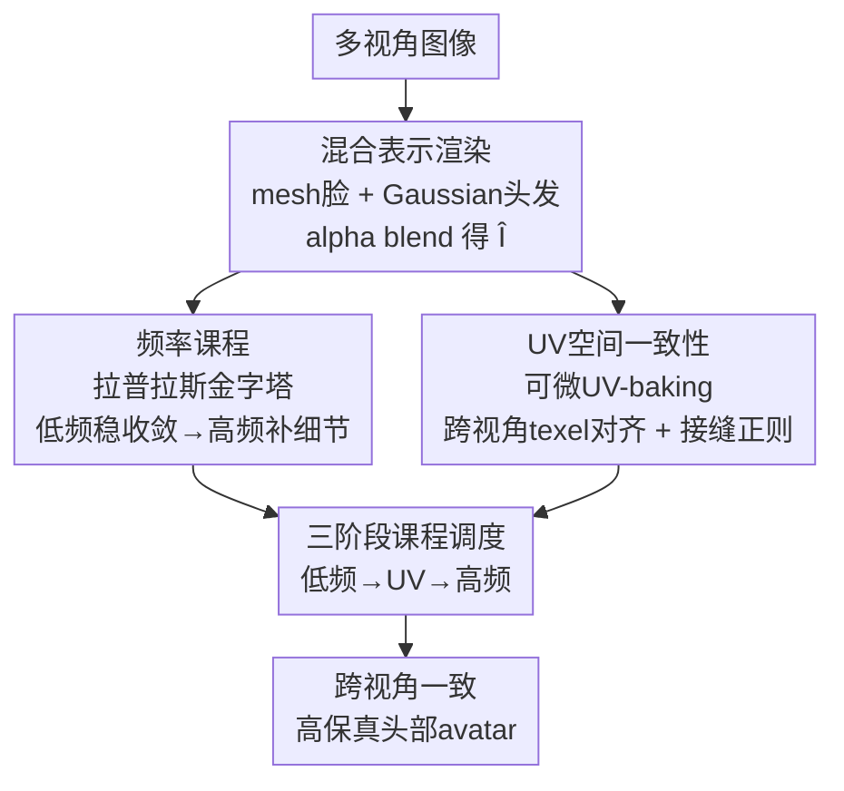

# Fresco: Frequency-Spatial Consistent Optimization for Fine-Grained Head Avatar Modeling

**会议**: CVPR 2026  
**论文**: [CVF Open Access](https://openaccess.thecvf.com/content/CVPR2026/html/Zhang_Fresco_Frequency-Spatial_Consistent_Optimization_for_Fine-Grained_Head_Avatar_Modeling_CVPR_2026_paper.html)  
**代码**: https://github.com/saralkun/Fresco  
**领域**: 3D视觉  
**关键词**: 头部Avatar, 频率课程学习, UV空间一致性, 拉普拉斯金字塔, 跨视角一致性  

## 一句话总结
Fresco 不改头部 avatar 的底层表示，而是在训练动态上做文章：用拉普拉斯金字塔做"先低频后高频"的频率课程，再加一个可微 UV-baking 把多视角渲染对齐到共享纹理图集，从而压住早期的伪高频伪影、消除跨视角漂移，在 NeRSemble 上把 novel-view 和 self-reenactment 的 PSNR/LPIPS 都刷到 SOTA。

## 研究背景与动机
**领域现状**：可驱动头部 avatar 现在主流走两条路——NeRF/隐式体表示（跨视角一致性好、但训练慢、局部表情难直接控）和 3D Gaussian / 显式点表示（渲染快、可驱动、细节高，但对点位/密度敏感）。近期的混合表示（mesh + Gaussian，如 MeGA、HERA）把 Gaussian 绑到 mesh 顶点上，兼顾语义可控和高保真渲染，成了当前比较受欢迎的折中方案。

**现有痛点**：这些方法几乎都靠**逐视角的光度监督**（per-view photometric loss）来训练。问题有两个：一是训练早期梯度不稳，模型在还没建立起一致的全局几何/颜色之前，就急着去拟合局部纹理，结果产生**伪高频伪影**（pseudo high-frequency artifacts）和早期过锐化（early over-sharpening）；二是每个相机各自过拟合自己看到的局部外观，缺乏跨视角的显式几何对应，导致皱纹、口腔、发丝这些区域在不同视角下**漂移/不一致**（cross-view drifting）。

**核心矛盾**：联合建模头部几何、表情和动态细节本身是高度欠约束（under-constrained）的，而逐视角光度监督既不给频率以约束、也不给跨视角以对应，于是"稳定收敛"和"细节保真"成了一对难以兼得的目标——加正则（GaussianAvatar/PointAvatar 的空间/法向正则）能压噪声，但代价是过度平滑和收敛变慢。

**切入角度**：作者注意到一个关键事实——**头部不同区域有不同的频谱特性**：脸部表面在低频正则下平滑演化最合适，而头发、边界这些区域才需要针对性的高频细化。已有的频域方法（BARF、FreNeRF、FreGS）用的是 Fourier 全局频率统计，对所有空间位置一视同仁，丢掉了空间局部性和几何对应。所以作者主张：频率约束应该放在**空间域**做（用局部的拉普拉斯滤波器），并且和**UV 空间的几何对应**一起优化。

**核心 idea**：不动表示、只调训练——用拉普拉斯金字塔做"低频先行、高频后补"的频率课程稳住优化，再用可微 UV-baking 把多视角对齐到共享纹理坐标系强制跨视角一致，两个域（图像频域 + UV 几何域）协同。

## 方法详解

### 整体框架
Fresco 是一个**优化框架**而非新表示：底层用的是 mesh + Gaussian 的混合头部表示（脸用参数化 mesh，头发/外围用各向异性 3D Gaussian），渲染时把 mesh 光栅化的脸和 Gaussian splatting 的头发做深度排序 alpha blending 合成出 $\hat{I}$。Fresco 的全部贡献在于"怎么监督这个渲染结果"：它把训练拆成三阶段、在两个域上施加约束。

整条 pipeline 的数据流是：多视角图像 → CNN 估 3DMM 参数 + MLP 细化 Gaussian 头发参数 $\{x, r, s, o, sh\}$ → mesh 与 Gaussian 渲染合成 $\hat{I}$ →（频率分支）拉普拉斯金字塔把图像拆成低频/高频带做渐进监督 +（UV 分支）可微 UV-baking 把多视角渲染烤到共享图集做跨视角 texel 对齐 → 三阶段课程调度统一这两个分支。

### 关键设计

**1. 频率课程：拉普拉斯金字塔把"先稳结构、后补细节"做成频谱调度**

针对早期伪高频伪影这个痛点，作者不在 Fourier 全局频域、而是在**图像空间域**用可微高斯/DoG 滤波做拉普拉斯金字塔分解，把监督按频带渐进展开。低频分支用高斯核 $G_\sigma$ 把渲染图和 GT 都平滑掉，只在低频上算 L1：$\hat{I}_{LF} = G_\sigma(\hat{I})$，$L_{LF} = \|\hat{I}_{LF} - I_{LF}\|_1$，其时间权重 $\lambda_{LF}(t)$ 随迭代**递减**，逼模型先抓住全局结构和色彩一致性、压住早期乱跳的高频。高频分支用 Difference-of-Gaussian 提带通响应 $H(\cdot) = G_{\sigma_1}(\cdot) - G_{\sigma_2}(\cdot)$（$\sigma_1 < \sigma_2$），并用边缘掩码 $M_{edge}=\mathrm{normalize}(\|\nabla I\|)$ 把监督集中到结构变化大的地方：$L^{edge}_{HF} = M_{edge}\cdot\|H(\hat{I}) - H(I)\|_1$；同时加一个梯度差损失 $L_{GDL}=\sum_{i,j}\big||\nabla\hat{I}_{i,j}| - |\nabla I_{i,j}|\big|_1$ 防过锐化，合成 $L_{HF}=\lambda_{h1}L^{edge}_{HF}+\lambda_{h2}L_{GDL}$，其权重 $\lambda_{HF}(t)$ 随训练**递增**。

两个分支不是孤立的，而是连续的频谱优化：总频率损失写成金字塔各频带的加权和

$$L_{freq}(t)=\sum_{i=1}^{N} w_i(t)\,\|\hat{I}_i - I_i\|_1,$$

各频带权重按平滑余弦退火激活：$w_i(t)=\frac{1}{2}\big(1-\cos(\pi\cdot\frac{t-T_i}{T-T_i})\big),\ t>T_i$，$T_i$ 是第 $i$ 频带的激活阈值迭代。这种空间局部的频率约束之所以比 FreGS 那类全局谱约束更适合头部，正是因为它尊重了"脸部低频、发丝边界高频"的空间频谱差异，且不用改底层表示。

**2. UV 空间跨视角一致性：可微 UV-baking 把逐视角监督换成 texel 级几何对应**

频率课程稳住了图像域，但视角相关着色和有限的多视角约束仍会留下跨视角不一致。作者引入可微 UV-baking 算子 $B(\cdot)$ 把每个视角的渲染图烤到 mesh 图集上得到 UV 纹理 $\hat{T}^v = B(\hat{I}^v; \Pi^v, M)$，于是监督从"逐像素"升级成"逐 texel 的跨视角对应"。只对**两视角都可见**的 texel 做对齐（visibility-constrained pairing）：

$$L_{UV}=\frac{1}{|\Omega_{vis}|}\sum_{(u,v)\in\Omega_{vis}} w(u,v)\,\big\|\hat{T}^a(u,v)-\mathrm{sg}(\hat{T}^b(u,v))\big\|_1,$$

其中 $\mathrm{sg}[\cdot]$ 是停止梯度算子，只对目标分支用，防止两视角互相追逐（bidirectional chasing）。置信权重 $w(u,v)=vis_a\,vis_b\cdot\frac{1}{2}[(n_a\cdot v_a)+(n_b\cdot v_b)]$ 既要求双视角可见、又偏向正对相机的 texel，从而压低自遮挡和掠射角区域的影响。训练初期这一项被降权、随图像域优化稳定后逐步加重，和频率课程互补：UV 项在参数域对齐几何，频率项在图像域调控谱演化。

**3. 接缝正则：把 UV 展开不可避免的图集边界缝合起来**

3D 表面展成 UV 时图集会被切成多个 chart，边界处天然有不连续，渲染时在头发、耳朵这类高曲率区域容易出现裂缝和颜色断层。作者加接缝正则 $L_{seam}=\lambda_{pair}L^{pair}_{seam}+\lambda_{tv}L^{tv}_{seam}$：配对项 $L^{pair}_{seam}=\frac{1}{N_p}\sum_i\|T(u_i)-T(v_i)\|_1$ 约束同一 3D 边界两侧 texel 的颜色一致，texel 配对 $\{(u_i,v_i)\}$ 是从 FLAME 拓扑里识别 chart 边界上的重复顶点预先算好的一一对应；全变分项 $L^{tv}_{seam}=\frac{1}{|\Omega_s|}\sum_{(u,v)\in\Omega_s}(|\nabla_u T|+|\nabla_v T|)$ 在从接缝掩码膨胀出的窄带 $\Omega_s$ 内平滑局部波动。UV 总目标 $L_{UV\text{-}total}=\lambda_{uv}(t)L_{UV}+L_{seam}$。值得注意：接缝项对 PSNR/SSIM 这种全局指标几乎没影响（去掉后指标只微动），它的价值是定性的边界连续性——这也说明像素级指标对局部接缝伪影不敏感。

### 损失函数 / 训练策略
三个组件**分阶段激活**而非同时上场，构成一条"先稳结构 → 再求一致 → 后补细节"的自平衡轨迹。设当前迭代 $t\in[0,T]$，总目标为

$$L_{total}(t)=\begin{cases}\alpha\,L^{low}_{freq}(t), & t<T_1,\\[2pt]\alpha\,L^{low}_{freq}(t)+\beta\,L_{UV}(t), & T_1\le t<T_2,\\[2pt]\alpha\,L^{high}_{freq}(t)+\beta\,L_{UV}(t)+L_{seam}, & t\ge T_2.\end{cases}$$

第一阶段（$t<T_1$）只压低频，稳几何、抑伪高频；中间阶段（$T_1\le t<T_2$）引入 UV 监督强制跨视角纹理对齐；最后阶段（$t\ge T_2$）开高频增强 + 接缝正则补细节、清边界。$\alpha,\beta$ 是权重因子，$T_1,T_2$ 是阶段边界。作者强调全程不改底层表示、训练开销保持低。

## 实验关键数据

### 主实验
数据集为 NeRSemble（16 路标定相机的多视角头部视频），按 GaussianAvatars/MeGA 的设置选 8 个被试，每人 11 个序列；分辨率下采样到 802×550；训练用 9/10 序列、15/16 相机，留一序列一相机做评测。对比 Gaussian Head Avatar、EMavatar、GaussianAvatars、MeGA，所有 baseline 用官方代码在同一设置下重训。

| 任务 | 指标 | Fresco | GaussianAvatars(次优) | MeGA |
|------|------|--------|------|------|
| Novel-View | PSNR↑ | **31.80** | 31.50 | 30.79 |
| Novel-View | SSIM↑ | **0.938** | 0.935 | 0.932 |
| Novel-View | LPIPS↓ | **0.058** | 0.060 | 0.066 |
| Self-Reenactment | PSNR↑ | **30.30** | 29.75 | 29.62 |
| Self-Reenactment | LPIPS↓ | **0.064** | 0.066 | 0.071 |

两个任务上 Fresco 都拿到最高 PSNR 和最低 LPIPS（self-reenactment 的 SSIM 0.929 略低于 GaussianAvatars 的 0.930，基本持平）。定性上 self-reenactment 的张嘴、眨眼、牙齿细节更忠实，novel-view 的脸部皱纹更锐、牙齿更清。

### 消融实验
在被试 #253 上逐项消融（指标整体偏高是因为单被试更易拟合）：

| 配置 | NV-PSNR↑ | NV-LPIPS↓ | SR-PSNR↑ | 说明 |
|------|------|------|------|------|
| Ours (Full) | 34.02 | 0.036 | 32.46 | 完整模型 |
| w/o $L_{HF}$ | 32.60 | 0.044 | 31.11 | 去高频，全指标明显掉、结果过平滑、皱纹发丝糊 |
| w/o $L_{UV}$ | 32.71 | 0.041 | 31.47 | 去UV一致，跨视角漂移、耳/发际线伪影 |
| w/o $L_{LF}$ | 33.48 | 0.039 | 32.07 | 去低频正则，早期不稳、轻微掉点 |
| w/o Seam | 33.86 | 0.038 | 32.29 | 去接缝，全局指标几乎不动 |

### 关键发现
- **高频分支和 UV 一致性贡献最大**：去掉 $L_{HF}$ 让 NV-PSNR 从 34.02 掉到 32.60（−1.42）、SR-PSNR 掉 1.35，是掉点最多的；去掉 $L_{UV}$ 掉幅紧随其后（NV −1.31、SR −0.99），且伴随耳/发际线的视角相关伪影。
- **接缝正则是"指标不敏感但视觉关键"的典型**：去掉后 PSNR/SSIM 只微动（34.02→33.86），但定性图里耳朵和头发边界会出现明显裂缝和颜色断层——印证了像素级全局指标对局部接缝伪影不敏感这一点。
- **低频正则主要管早期稳定性**：去掉 $L_{LF}$ 掉点最小（NV −0.54），说明它的作用偏向"防早期伪高频、保收敛"，而非直接拉高最终细节。

## 亮点与洞察
- **"不改表示、只调训练"的思路很省事且通用**：Fresco 把改进完全放在监督/课程层面，不碰 mesh+Gaussian 的底层结构，原则上能挂到其它逐视角光度监督的 avatar pipeline 上，迁移成本低。
- **空间域频率约束 vs 全局 Fourier 约束的对比很有说服力**：作者点出 FreGS 那类全局谱约束对所有空间位置一视同仁、丢了空间局部性，而头部恰恰是"脸低频、发丝边界高频"的强空间异质结构——用局部拉普拉斯滤波做频率课程是更贴合几何的选择，这个 motivation 具体且站得住。
- **UV-baking + stop-gradient 的对齐很巧**：把逐视角光度监督换成共享 UV 图集上的 texel 级对应，并用停止梯度防止两视角互相追逐、用法向×可见性加权排除掠射角/自遮挡 texel——这套设计把"跨视角一致"从隐式的光度一致升级成了显式的几何对应，是可复用的 trick。
- **课程退火（低频权递减、高频权按余弦递增）**把 coarse-to-fine 写成了平滑可调度的形式，避免了硬切换带来的训练抖动。

## 局限与展望
- **强依赖多视角标定数据**：方法在 NeRSemble 这种 16 路标定相机的受控棚拍上验证，UV 一致性和接缝配对都需要稳定的相机参数和 FLAME 拓扑；单目/野外场景能否迁移未验证。⚠️ cross-identity reenactment 结果作者放进了补充材料，正文未给定量，泛化到跨身份的强度难以直接判断。
- **超参数偏多且靠经验**：频带阈值 $T_i$、阶段边界 $T_1/T_2$、各损失权重 $\lambda_{h1},\lambda_{h2},\lambda_{pair},\lambda_{tv},\alpha,\beta$ 都是经验设定，论文称细节在补充材料里，正文未给敏感性分析，复现时调参成本可能不低。
- **只在 8 个被试上评测**：沿用前作设置选 8 人，规模偏小；消融只在单被试 #253 上做，结论的统计稳健性有保留空间。
- **改进思路**：可探索自适应频带划分（按区域频谱自动定 $T_i$）、把 UV 一致性扩展到时序（跨帧 texel 对齐）以增强动态稳定性。

## 相关工作与启发
- **vs FreGS / FreNeRF / BARF（频域优化）**：它们在 Fourier 全局频域或位置编码上做退火/谱约束，对所有空间位置统一处理；Fresco 改在**图像空间域**用拉普拉斯/DoG 局部滤波做频率课程，保住了位置敏感细节和几何对应，更贴合头部的空间频谱异质性。
- **vs GaussianAvatars / MeGA（mesh-Gaussian 表示）**：它们靠逐视角光度监督训练，易早期过锐化、跨视角漂移；Fresco 不改它们的混合表示，而是补上频率课程 + UV 空间一致性两层优化约束，在同一表示上把 PSNR/LPIPS 进一步刷高。
- **vs GaussianAvatar / PointAvatar（空间/法向正则）**：它们用空间/法向正则压噪声但常导致过度平滑、收敛变慢；Fresco 的"低频先行、高频后补 + 边缘感知 + GDL 抗过锐"则在抑噪和保细节之间取得了更好的平衡（消融显示去高频后明显变糊）。

## 评分
- 新颖性: ⭐⭐⭐⭐ 空间域频率课程 + UV-baking 跨视角对齐的组合切入点新颖，但单看每块都有前作渊源
- 实验充分度: ⭐⭐⭐ NeRSemble 上 SOTA 且消融清晰，但被试规模小、跨身份与超参敏感性放在补充材料
- 写作质量: ⭐⭐⭐⭐ 公式完整、动机具体、消融"指标 vs 视觉"区分讲得透
- 价值: ⭐⭐⭐⭐ 即插即用、不改表示的训练侧改进，对头部 avatar 社区实用性强

<!-- RELATED:START -->

## 相关论文

- [\[CVPR 2026\] iSplat: Iterative Learning for Fine-Grained Gaussian Splatting](isplat_iterative_learning_for_fine-grained_gaussian_splatting.md)
- [\[CVPR 2026\] GeoDiff4D: Geometry-Aware Diffusion for 4D Head Avatar Reconstruction](geodiff4d_geometry-aware_diffusion_for_4d_head_avatar_reconstruction.md)
- [\[CVPR 2026\] Feed-forward Gaussian Registration for Head Avatar Creation and Editing](feed-forward_gaussian_registration_for_head_avatar_creation_and_editing.md)
- [\[CVPR 2026\] UIKA: Fast Universal Head Avatar from Pose-Free Images](uika_fast_universal_head_avatar_from_pose-free_images.md)
- [\[CVPR 2026\] FISHuman: Fine-grained Single-image 3D Human Reconstruction via Multi-view 4D Remeshing](fishuman_fine-grained_single-image_3d_human_reconstruction_via_multi-view_4d_rem.md)

<!-- RELATED:END -->
