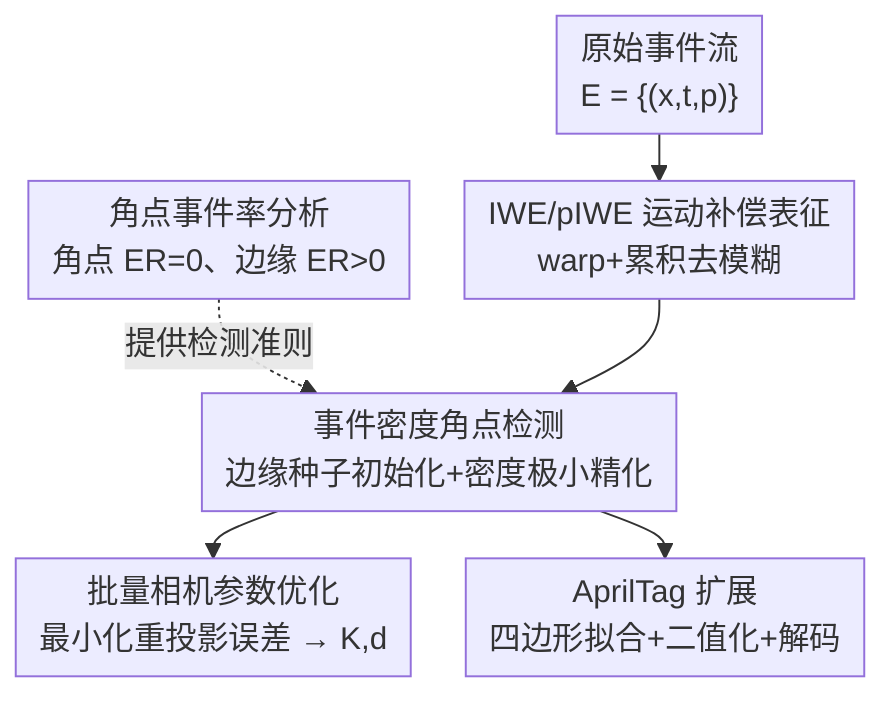

# From Corners to Fiducial Tags: Revisiting Checkerboard Calibration for Event Cameras

**会议**: CVPR 2026  
**论文**: [CVF Open Access](https://openaccess.thecvf.com/content/CVPR2026/html/Ryu_From_Corners_to_Fiducial_Tags_Revisiting_Checkerboard_Calibration_for_Event_CVPR_2026_paper.html)  
**代码**: [项目页](https://vision3dlab.github.io/corner2tag/)  
**领域**: 3D视觉  
**关键词**: 事件相机, 相机标定, 棋盘格角点, IWE, AprilTag  

## 一句话总结
本文提出首个**不依赖灰度图重建**、直接在事件域检测棋盘格角点的事件相机标定框架：先用数学分析证明"角点处几乎不产生事件"，再用边缘线索初始化角点、把角点朝事件密度最小处精化到亚像素，并把同一套检测扩展到 AprilTag，在自采与公开数据上都取得了稳定标定。

## 研究背景与动机
**领域现状**：帧式相机的标定早已成熟——拍棋盘格、用 Harris/Shi-Tomasi 检测角点、最小化重投影误差解相机内外参，棋盘格因角点几何定义明确、亚像素可定位而成为事实标准（OpenCV 默认靶标），并天然可扩展到 ARTag / AprilTag 这类带 ID 的基准标记。

**现有痛点**：事件相机（neuromorphic 传感器）抗运动模糊、耐弱光，但它**不保留图像结构**——每个像素异步记录相对亮度变化的二值事件，棋盘格无法直接套用。现有事件相机标定走了三条岔路，各有硬伤：(1) 用学习式 event-to-video 网络（E2VID）把事件重建成灰度图再做传统标定，但重建 artifact 会直接污染角点精度；(2) 用闪烁 LED / LCD 主动靶标直接吃事件流，精度高但需要专用硬件和流程；(3) 用圆点 / 圆环网格，运动不变性好，但圆形图案对镜头畸变天生敏感、定位精度差。

**核心矛盾**：棋盘格精度最高、可扩展性最强，但它有两个与事件成像机制冲突的死结——其一，事件是沿运动轨迹在不同时间戳异步触发的，直接堆叠到像平面会产生**时间错位、边缘糊成一团**；其二，棋盘格角点处局部强度对称，事件触发率**趋近于零**，恰恰是最该被精确定位的地方却没有信号。

**本文目标**：在不重建灰度图的前提下，直接从事件表征里把棋盘格角点检测出来，并扩展到 AprilTag。这要解决两个子问题：怎么把异步事件对齐成清晰边缘？角点没有事件时怎么反而利用"没有事件"这一特性去定位？

**切入角度**：作者的关键观察是把"角点没事件"从障碍变成**先验**——如果能从数学上证明角点处事件率严格为零、而边缘处事件率严格更高，那就可以"用边缘找方向、用零密度找角点"。

**核心 idea**：先用运动补偿表征（IWE）把模糊边缘锐化，再基于"边缘事件强、角点事件无"的解析结论，用边缘种子初始化角点、用梯度下降把角点推向事件密度局部极小，得到亚像素角点，全程不碰图像重建。

## 方法详解

### 整体框架
输入是一段原始事件流 $E=\{e_k\}$，每个事件 $e_k=(x_k,t_k,p_k)$ 含像素位置、时间戳、极性（$\pm1$）；输出是相机内参矩阵 $K$ 与畸变系数 $d$。整条管线分四块串起来：先把异步事件**运动补偿**成两种锐利表征 IWE / pIWE；再在 pIWE 上提取角点候选 patch、在 IWE 上做角点初始化与精化（这一步由 §3.2 的事件率分析指导）；然后把所有窗口的亚像素角点喂给批量优化解相机参数；最后同一套角点检测可直接复用到 AprilTag 识别。

### 关键设计

**1. 角点事件率的数学分析：把"角点没事件"从障碍变成检测准则**

这一步针对的痛点是：角点处几乎不触发事件，传统角点检测在事件数据上直接失效。作者没有回避，而是从理论上把它讲透。先借用帧式相机里棋盘格角点的理想强度模型——用两个被高斯平滑的中心化 sigmoid 相乘 $\tilde I(x)\approx S(n_1^\top x,\sigma)\,S(n_2^\top x,\sigma)$（$n_i$ 是两条边的法向），并把 sigmoid 写成 $\tanh(x/2\sigma)$；在角点邻域 $|x|\ll1$ 用泰勒展开取一阶得 $\tilde I(x)\approx\frac{1}{4\sigma^2}(n_1^\top x)(n_2^\top x)$，于是 $\nabla\tilde I(x)\approx Gx$，$G=\frac{1}{4\sigma^2}(n_1n_2^\top+n_2n_1^\top)$。

再接上事件生成率（Event Rate, ER）的定义：ER 是单位时间触发事件数，正比于对数强度梯度沿运动方向的投影，$R_e(x)\approx\frac1C|\nabla L(x)\cdot v|$。代入角点强度模型（角点附近 $\tilde I\approx0$，故 $\alpha/(I_0+\alpha\tilde I)\approx\alpha/I_0$ 视作常数），得到

$$R_e(x)\approx\gamma\,\big|(Gv)^\top x\big|,\qquad x=0\;\Rightarrow\;R_e(0)=0.$$

即**角点处 ER 严格为零**。而对棋盘格边缘，强度模型退化为 $\tilde I(x)\approx\frac{1}{2\sigma}(n^\top x)$，得 $R_e(x)\approx\kappa|n\cdot v|$，只要运动方向不与边缘平行就稳定触发事件。结论一句话：边缘事件强、角点事件无。这正是后续"用边缘初始化、用零密度精化"两步的理论靠山，让整个检测流程不是工程 trick 而是有据可循。

**2. IWE / pIWE 运动补偿表征：把异步糊边对齐成锐利静态图**

针对"异步事件直接堆叠会糊边"的痛点，作者采用 Image of Warped Events（IWE）。把事件流切成 $M$ 个连贯窗口分别处理，每个窗口假设线性平面运动，用运动向量 $v$ 把每个事件 warp 到参考时刻 $t_{ref}$：$x_k'=x_k+(t_{ref}-t_k)v$，再累积成 $H(x;v)=\sum_k p_k\,\delta(x-x_k')$。最优运动向量通过**最大化 IWE 方差**求得 $v^*=\arg\max_v \mathrm{Var}(H(x;v))$——方差越大表示事件对齐得越锐利、边缘越聚焦。

得到 $v^*$ 后构造两种表征：IWE 把所有事件极性置 1 累积，稳定刻画事件密度的"地形"不受极性抵消影响，用于角点定位；pIWE 保留每个事件的极性 $p_k$，因而能体现棋盘格黑白交替，用于 patch 提取和 AprilTag 二值化。和重建网络估计绝对亮度不同，IWE/pIWE 是运动补偿后保留事件密度的表征，因此前述 ER 的结论可以直接套在它们身上——这是后续用"密度极小"找角点能成立的前提。

**3. 基于事件密度的角点检测与亚像素精化：用边缘种子初始化、向密度极小精化**

这是把设计 1 的理论落地为算法的核心，分四步。**Patch 提取**：在 pIWE 上借鉴 Bok 等人的圆形边界思路，选出周边圆环同时含正负极性的像素（角点正位于黑白交界），聚类后用最小外接矩形框出候选 patch（IWE 与 pIWE 共享坐标，可对应取 patch）。

**角点初始化**：因为角点本身没事件，不能直接找角点，于是用边缘线索。IWE 中像素值即事件密度，把比 8 邻域都高的像素定义为种子 $S=\{x\mid H(x)>H(y),\forall y\in N_8(x)\}$，它们大概率落在边缘上。从每个种子朝其次大邻居逐步传播并合并成簇，记第 $s$ 步后非空簇数 $N(s)$；理想棋盘格 patch 恰好对应**四条边即四个簇**，故取 $s^*=\max\{s\mid N(s)=4\}$，$N(s)\ne4$ 的情形（单边响应或误检种子）直接被过滤。在 $s^*$ 步把四簇逆时针标号 $1\!\sim\!4$，对奇数标号簇拟合一条线 $l_{odd}$、偶数标号簇拟合 $l_{even}$，二者交点即初始角点 $c_0=l_{odd}\times l_{even}$；若两线近乎平行或交点落在 patch 外则判为无效 patch。这样即便角点附近几乎没有事件，也能稳定给出 $c_0$。

**角点精化**：依据设计 1 中"理想角点对应 IWE 极小值"的结论，对 $c_0$ 做梯度下降找局部极小。但棋盘格方块内部也可能给出近零响应导致误收敛，于是把优化**约束在两条拟合线 $l_{odd}$、$l_{even}$ 附近的窄带交集**内：

$$c^*=\arg\min_{c} H(c)\quad\text{s.t.}\;|c^\top l_{odd}|\le\epsilon,\;|c^\top l_{even}|\le\epsilon.$$

这样角点既被推向事件密度极小、又被锁在两条边的交汇区域，得到几何一致的亚像素角点 $c^*$。**相机优化**：把所有 $M$ 个窗口的精化 2D 角点集 $C^{2D}_i$ 与预定义 3D 角点 $C^{3D}$ 一起送入 OpenCV `calibrateCamera`，批量最小化重投影误差解 $K^*,d^*$（同时估各窗口外参 $T_i$）。

**4. 向 AprilTag 基准标记的扩展：复用角点检测做带 ID 的鲁棒识别**

棋盘格角点精度高但不带身份信息，而 AprilTag 在图案里编码唯一 ID，能在部分可见 / 遮挡时仍可靠识别。作者借助 pIWE 的极性对比，把同一套检测无缝扩展到 AprilTag，分三步。**四边形拟合**：对检测到的精化角点 $C^{2D}$ 枚举四点组合得候选四边形 $Q$，按顺时针排序后用三条几何约束筛选——内角范围、最小面积阈值、边长一致性，再用 NMS 去掉大量重叠的候选。**二值化**：把每个有效四边形 warp 到归一化方形坐标，对 warp 后的 pIWE 求梯度并沿运动向量投影得对比图 $g=\nabla H_p\cdot v$（强化极性对齐的结构边缘），三值阈值化为 $\{-1,0,+1\}$，划成 $N\times N$ 网格取格内均值，再用 Otsu 自适应阈值二值化。**解码**：把二值图案打包成整数码字，与 AprilTag 码本比对，通过在四个朝向上算 Hamming 距离取最小实现旋转不变，距离低于阈值即得唯一 ID 与朝向。由此即便只看到部分标记，也能正确索引可见子集。

## 实验关键数据

### 实验设置
用 DAVIS346 事件相机（346×260，同时输出事件与灰度帧）采集，移动相机让棋盘格各边都进入视野且运动近似线性，自采三种棋盘格 5×6(33mm)、6×8(35mm)、7×10(28mm)，并引入 Prophesee Gen3 / Samsung Gen3 公开数据（无棋盘格信息，仅做定性角点评测）。由于现有支持棋盘格的事件标定都依赖图像重建，主对比对象为 **E2Calib（E2VID 重建 + 标定）** 与 **DAVIS 灰度帧标定**（后者作为伪真值参考）。每种方法在所有模态都成功检出角点的 $B$ 张图上重复标定 50 次统计均值±标准差。

### 主实验：标定稳定性（Table 1，节选 RMSE，单位像素）
本文方法在三种棋盘格上的标定重投影 RMSE 全面优于 E2Calib，且各内参 / 畸变系数的标准差更小（更稳定），但仍略逊于以灰度帧为伪真值的 Frame-Based。

| 棋盘格 | 方法 | 标定 RMSE↓ |
|--------|------|-----------|
| 5×6 | E2Calib | 0.747 |
| 5×6 | **Ours** | **0.487** |
| 5×6 | Frame-Based（伪真值） | 0.199 |
| 6×8 | E2Calib | 0.647 |
| 6×8 | **Ours** | **0.516** |
| 6×8 | Frame-Based（伪真值） | 0.192 |
| 7×10 | E2Calib | 0.559 |
| 7×10 | **Ours** | **0.503** |
| 7×10 | Frame-Based（伪真值） | 0.153 |

### 角点定位精度（Table 2，Corner RMSE，相对帧式角点的欧氏距离，单位像素）
直接评测角点定位精度，本文在三种棋盘格上均不差于 E2Calib，小棋盘格上优势最明显。

| 棋盘格 | E2Calib | Ours |
|--------|---------|------|
| 5×6 | 1.3979 ± 0.8350 | **0.8504 ± 0.3203** |
| 6×8 | 1.0377 ± 0.4879 | **0.8356 ± 0.4776** |
| 7×10 | 0.7808 ± 0.2742 | **0.7791 ± 0.2742** |

### 关键发现
- **稳定性比精度更突出**：本文在所有内参/畸变系数上的标准差都更小，说明 50 次重复标定的可重复性高、对采样敏感度低——这正是"角点定位有理论支撑、不靠会抖动的重建图"带来的好处。
- **角点越密优势越收窄**：5×6 时本文 Corner RMSE 比 E2Calib 几乎砍半（1.40→0.85），到 7×10 时两者几乎持平（0.781 vs 0.779）。⚠️ 论文未深入解释，合理推测是角点更密时 E2Calib 的重建误差被更多约束平均掉，差距缩小。
- **传统检测器在事件数据上直接失效**：定性对比（Fig.4）显示 Harris / Shi-Tomasi 即便用上 IWE 也无法可靠定位角点，印证了"角点处 ER≈0"的分析。
- **AprilTag 抗遮挡**：能在部分出框时正确索引可见标记子集（定性结果）。

## 亮点与洞察
- **把"缺陷"变"特征"**：角点没事件本是最大障碍，作者用 ER 的一阶展开严格证明角点 ER=0、边缘 ER>0，于是"零密度"反而成了精化角点的判据——这种"先证明再设计"的思路很优雅，让每一步都有理论锚点。
- **IWE 方差最大化做去模糊**：用最大化对比度（方差）来求运动向量、对齐异步事件，是事件视觉里成熟但用得巧的 trick，复用到标定场景把"异步糊边"问题干净解决。
- **检测与扩展同源**：棋盘格角点检测与 AprilTag 检测共用同一套精化角点 + pIWE 极性，几乎零额外代价就把无 ID 的高精度标定升级成带 ID、抗遮挡的基准标记识别，迁移性强。
- 可迁移：种子传播找四簇→线拟合求交点的初始化套路，对任何"角点处信号弱但边缘强"的场景（如低对比成像、某些深度图角点）都可借鉴。

## 局限与展望
- **作者承认**：IWE 生成阶段假设主导全局运动、只估单一运动向量，在空间变化运动（如近景视差大、多物体）下会退化；未来需引入像素级等更一般运动模型。
- **自己发现**：评测只用了一台 DAVIS346 真值靠其自带灰度帧（Frame-Based 仅是伪真值非绝对真值），缺乏对高分辨率事件相机的验证；棋盘格优势随角点变密而收窄，在大密度靶标上相对重建法的增益有限。
- **采集受限**：要求运动近似线性、所有边都进视野，比帧式标定的随手拍更受约束；合成实验与计算耗时都放在 supplementary，正文难以判断实时性。
- 改进思路：把单运动向量换成分块/像素级运动场再做 warp，或将事件标定与 SLAM 里的连续时间运动模型结合，放宽"线性运动"假设。

## 相关工作与启发
- **vs E2Calib / 重建式方法**：他们先用 E2VID 把事件重建成灰度图再套传统 Harris 检测，本文直接在事件域 IWE 上检测，避开重建 artifact——结果是标定更稳（标准差更小）、角点 RMSE 更低，且不需要训练重建网络。
- **vs 闪烁 LED / LCD 主动靶标**：他们直接吃事件流、精度高，但要专用硬件和流程；本文用普通打印的棋盘格 / AprilTag，部署成本低得多。
- **vs 圆点 / 圆环网格事件标定**：圆形图案运动不变、事件触发稳定，但对镜头畸变天生敏感、圆柱/椭圆拟合定位难；本文回归棋盘格的几何良定义角点，畸变下定位更可靠，还顺带获得向 ID 标记扩展的能力。

## 评分
- 新颖性: ⭐⭐⭐⭐⭐ 首个不靠灰度重建、直接在事件域检测棋盘格角点的标定框架，且把"角点无事件"做成了理论判据。
- 实验充分度: ⭐⭐⭐⭐ 自采+公开数据、内外参与角点双指标、50 次重复统计，但真值是伪真值、合成与耗时实验都进了附录。
- 写作质量: ⭐⭐⭐⭐⭐ 从理论分析到 pipeline 逐步推导，动机—证明—设计闭环清晰。
- 价值: ⭐⭐⭐⭐ 让事件相机能复用成熟棋盘格/AprilTag 标定，降低部署门槛，对事件视觉工程落地有实用价值。

<!-- RELATED:START -->

## 相关论文

- [\[CVPR 2026\] 4D Reconstruction from Sparse Dynamic Cameras](4d_reconstruction_from_sparse_dynamic_cameras.md)
- [\[CVPR 2026\] Unsupervised 3D Motion Estimation Using Event Camera](unsupervised_3d_motion_estimation_using_event_camera.md)
- [\[CVPR 2026\] Geometric-Photometric Event-based 3D Gaussian Ray Tracing](geometric-photometric_event-based_3d_gaussian_ray_tracing.md)
- [\[CVPR 2026\] Revisiting Monocular SLAM with Spatio-Temporal Scene Modeling](revisiting_monocular_slam_with_spatio-temporal_scene_modeling.md)
- [\[CVPR 2026\] Revisiting 3D Reconstruction Kernels as Low-Pass Filters](revisiting_3d_reconstruction_kernels_as_low-pass_filters.md)

<!-- RELATED:END -->
