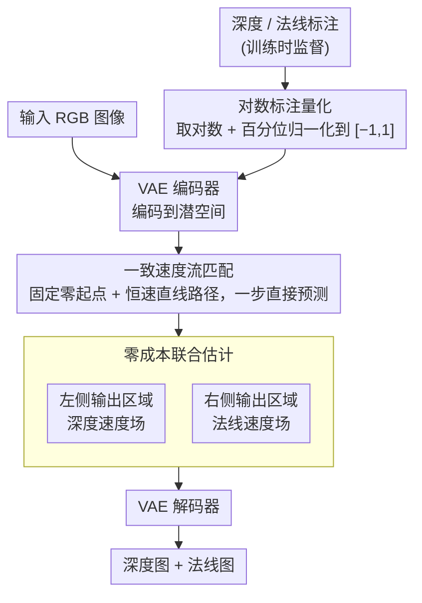

# FE2E: From Editor to Dense Geometry Estimator

**会议**: CVPR 2026  
**arXiv**: [2509.04338](https://arxiv.org/abs/2509.04338)  
**代码**: 无  
**领域**: 3D视觉  
**关键词**: 深度估计, 法线估计, 图像编辑模型, 扩散模型, DiT

## 一句话总结
本文系统分析了图像编辑模型与生成模型在稠密几何估计任务中的微调行为差异，发现编辑模型具有天然的结构先验优势，并基于此提出 FE2E 框架，首次将 DiT 架构的图像编辑模型适配为深度和法线联合估计器，在零样本场景下大幅超越现有 SOTA（ETH3D 上 AbsRel 降低 35%）。

## 研究背景与动机

1. **领域现状**：单目稠密几何估计（深度和法线）是 3D 视觉的核心任务。近年来，以 Marigold 为代表的方法借助 Stable Diffusion 的预训练生成先验，在有限数据下取得了令人印象深刻的零样本预测效果。另一类以 DepthAnything 系列为代表的方法则走数据驱动路线，使用大规模数据（62.6M图像）训练通用估计器。

2. **现有痛点**：生成模型（text-to-image）本身设计目标是从文本生成图像，其内部特征并不天然对齐几何结构。微调过程中需要从零开始"重塑"特征，学习过程不稳定且存在性能瓶颈。数据驱动方法虽然有效，但对大规模标注数据的依赖限制了其泛化性。

3. **核心矛盾**：稠密几何估计本质上是 image-to-image 任务，但现有方法却基于 T2I 生成模型做微调——这是任务范式与模型范式之间的不匹配。

4. **本文目标**（1）验证图像编辑模型是否比生成模型更适合做稠密几何估计；（2）解决编辑模型适配为确定性预测器时遇到的训练目标、数值精度和计算效率问题。

5. **切入角度**：作者从一个直觉出发——图像编辑模型天然理解输入图像结构，同时保持了生成模型的能力，理应比 T2I 模型更适合做 dense prediction。通过系统的特征演化分析和训练动态对比验证了这一假设。

6. **核心 idea**：用图像编辑模型替代生成模型作为稠密几何估计的基础模型，并通过一致速度流匹配、对数量化和零成本联合估计三个技术适配编辑器为估计器。

## 方法详解

### 整体框架
FE2E 基于 Step1X-Edit（一个基于 DiT 架构的 SOTA 图像编辑模型）。输入是 RGB 图像，输出是对应的深度图和法线图。整个流程为：VAE 编码器将输入图像和几何标注编码到潜空间，DiT 学习从固定起点到目标潜表示的恒速直线路径，最后 VAE 解码器将预测结果解码回像素空间。训练时深度/法线标注要先经对数标注量化压到 BF16 友好的数值区间再编码；推理时 DiT 的左右两半输出区域被分别用作深度和法线的预测，同时出两张图、无需额外计算开销。

### 关键设计

**1. 编辑模型 vs. 生成模型的系统分析：从机理上回答"为什么该用编辑器"**

整个范式的前提是"编辑模型比生成模型更适合做稠密估计"，但这不能只靠直觉，得有证据。作者把 Step1X-Edit（编辑器）和 FLUX（生成器）放在完全相同的设置下微调，再去看两件事：DiT 内部特征怎么演化，以及训练损失怎么收敛。可视化不同层（Block1 / 20 / 35）的特征图后差别非常明显——编辑模型的初始特征**一开始就对齐了图像的几何结构**，微调只是在"精炼"和"聚焦"它本来就有的能力；而生成模型的特征从一团混沌起步，需要从零"重塑"，训练曲线持续震荡，还卡在约 0.08 的损失瓶颈上下不去。

这个对比解释了后面所有实验里编辑模型一致领先的根源：它不是算法更好，而是**起点更对**。微调一个已经理解图像结构的模型，自然比从文本生成先验里硬掰出几何结构要省数据、收敛更稳。这也正是"From Editor to Estimator"这条线成立的理论依据。

**2. 一致速度流匹配（Consistent Velocity Flow Matching）：把"生成多样性"的流匹配改造成"唯一确定解"的预测目标**

直接拿编辑模型的流匹配目标来做估计会水土不服：原始流匹配让模型学习所有可能路径上的瞬时速度场，于是全局速度场是非线性的、积分路径是弯的，离散求解器一步步走下来会累积误差。但几何估计本质是确定性任务——给定一张图，深度和法线只有唯一的 GT，根本不需要生成模型那种多样性。基于这一点，FE2E 把路径"拉直"：第一步要求速度的方向和大小在整条路径上**保持恒定**，这样训练目标

$$\mathcal{L} = \mathbb{E}\left[\|\mathbf{v} - f_\theta(\mathbf{z}^x)\|^2\right]$$

就完全不再依赖时间步 $t$；第二步把随机高斯起点固定成零向量 $\mathbf{z}_0^y = \mathbf{0}$，彻底抹掉采样随机性。这样路径变成一条从固定起点到目标的恒速直线，推理时直接 $\mathbf{z}_1^y = f_\theta(\mathbf{z}^x)$ 一步到位，不用任何迭代求解。弯路被拉直后，离散化误差从根上消失了，推理速度也顺带大幅提升。

**3. 对数标注量化（Logarithmic Annotation Quantization）：让只有 BF16 权重的编辑模型也能做高精度深度**

现代编辑模型一律用 BF16 训练，这对 RGB 输出够用（约 1/256 精度），可一旦拿去编码深度标注就会暴露出严重的量化误差。问题在于深度的动态范围太大：在 Virtual KITTI（0–80m）里，把深度均匀量化到 $[-1, 1]$ 后，0.1m 这种近处的 AbsRel 误差能飙到 1.6；换成逆深度（disparity）则反过来，近处精度极高、远处完全失效——39m 和 78m 会被映射成同一个值。两端都不讨好。FE2E 的解法是先取对数压缩动态范围，

$$D_{log} = \ln(D_{GT} + 1\mathrm{e}{-6})$$

再配合百分位归一化（用第 2、98 百分位裁掉极值）

$$\mathbf{y}_D = \left\langle\left(\frac{D_{log} - D_{log,2}}{D_{log,98} - D_{log,2}} - 0.5\right) \times 2\right\rangle$$

把对数深度落到 $[-1, 1]$。对数刻度天然对近大远小的深度分布更友好，远近两端都能拿到均衡的低误差（AbsRel 约 0.013）。这样就不必像之前的方法那样强行升到 FP32——既省了成本，又避免了改精度带来的先验继承变差。

**4. 零成本联合估计（Zero-cost Joint Estimation）：把编辑模型被浪费的一半输出捡回来同时出深度和法线**

DiT 编辑模型的工作方式是把条件图像和目标图像沿序列维度拼接后一起送进网络，因此输出序列里有一半（对应条件那一侧）在原本的编辑任务里是直接丢弃的——白白算了却不用。FE2E 把这块被浪费的输出利用起来：让左侧输出区域去预测深度速度场、右侧输出区域去预测法线速度场，对应的监督目标也拆成两半 $\mathcal{L}_{fm} = \mathbb{E}(\|\mathbf{v}_D - p_l\|^2 + \|\mathbf{v}_N - p_r\|^2)$。这样一次前向就同时产出深度和法线两张图，既不增加参数也不增加计算量。除了白拿一个任务，深度和法线本身存在几何上的互补约束，联合预测还能在蝴蝶平面、远景建筑这类困难结构上带来可见的质量提升。

### 损失函数 / 训练策略
- 主损失为恒速流匹配损失，在潜空间计算
- 联合估计时，左侧输出区域监督深度，右侧监督法线：$\mathcal{L}_{fm} = \mathbb{E}(\|\mathbf{v}_D - p_l\|^2 + \|\mathbf{v}_N - p_r\|^2)$
- 额外使用辅助分散损失(dispersion loss)鼓励不同样本的特征在隐空间中分散
- 训练使用 LoRA（rank=64, α=32），冻结 DiT 以外的所有参数，AdamW 优化器，学习率 1e-4，训练 30 epoch
- 在单张 RTX 4090 上即可训练（启用梯度检查点），使用 H20 GPU 约 1.5 天完成

## 实验关键数据

### 主实验

| 数据集 | 指标(AbsRel↓) | FE2E | Lotus-D (之前SOTA) | DepthAnything V2 | 提升 |
|--------|------|------|----------|------|------|
| NYUv2 | AbsRel | **4.1** | 5.1 | 4.5 | 19.6% vs Lotus-D |
| KITTI | AbsRel | **6.6** | 8.1 | 7.4 | 18.5% |
| ETH3D | AbsRel | **3.8** | 6.1 | 13.1 | **37.7%** |
| ScanNet | AbsRel | **4.4** | 5.5 | - | 20.0% |
| DIODE | AbsRel | **22.8** | 22.8 | 26.5 | 持平 |

训练数据仅 71K 图像，远少于 DepthAnything V2 的 62.6M。

### 消融实验

| ID | 配置 | KITTI AbsRel | ETH3D AbsRel | 说明 |
|------|---------|------|------|------|
| 2 | DirectAdapt (Step1X-Edit) | 9.5 | 5.6 | 基线 |
| 3 | + Consistent Velocity | 8.8 | 5.0 | CV贡献 -7%/-10% |
| 4 | + Fixed Start | 8.6 | 4.8 | FS进一步提升 |
| 6 | + Logarithmic Quant | **6.8** | **3.9** | 对数量化贡献 -19%/-13% |
| 7 | FLUX+改进方法 | 7.1 | 4.5 | 编辑模型仍优于生成模型 |
| 8 | FE2E完整 (+联合估计) | **6.6** | **3.8** | 联合估计带来额外增益 |
| 9 | FLUX-Kontext+完整方法 | 6.7 | 3.6 | 验证可扩展到其他编辑模型 |

### 关键发现
- 对数量化是贡献最大的单项改进，在 KITTI 上单独贡献 19% 的误差降低
- 编辑模型 vs 生成模型的差距在所有设置下都很一致（ID2 vs ID1, ID6 vs ID7）
- 联合估计不仅零成本，还能在困难场景（蝴蝶平面结构、远景建筑）带来可视的质量提升
- 方法可扩展到 FLUX-Kontext 等其他编辑器（ID9），甚至表现更好

## 亮点与洞察
- **"From Editor to Estimator"范式的系统论证**：不只是换个模型，而是通过特征演化可视化和训练动态分析，从机理层面解释了为什么编辑模型更适合做稠密估计。这一发现可能启发更多 I2I 任务利用编辑模型先验
- **零成本联合估计的巧妙设计**：DiT 编辑模型的输入拼接机制导致 50% 的输出被丢弃，FE2E 利用这部分"废弃"输出做第二个任务的预测，零额外计算成本实现多任务学习
- **BF16 精度下的对数量化方案**：完美解决了"模型只有 BF16 权重但任务需要高数值精度"这一实际工程难题，方案通用性强

## 局限与展望
- 训练数据局限于合成数据（Hypersim + Virtual KITTI），未使用真实世界数据
- 法线估计性能提升相比深度估计没有那么显著
- 仅支持仿射不变的深度预测，未扩展到度量深度
- 对数量化方案虽然均衡，但在极近和极远距离上都不是最优的，可以考虑分段自适应量化

## 相关工作与启发
- **vs Marigold/Lotus**：它们基于 Stable Diffusion (T2I)，FE2E 基于 Step1X-Edit (编辑模型)，在相似数据量下 FE2E 大幅领先，证明了基础模型选择比算法改进更关键
- **vs DepthAnything V2**：后者使用 100 倍数据量，FE2E 仍在 ETH3D 等数据集上显著领先，说明编辑先验可以弥补数据量不足
- **vs Diffusion-E2E-FT**：E2E-FT 提出端到端微调去噪架构，FE2E 进一步推进到编辑模型+恒速流匹配，是这一路线的延续

## 评分
- 新颖性: ⭐⭐⭐⭐⭐ 首次系统论证并实现"编辑模型→估计器"的范式转换
- 实验充分度: ⭐⭐⭐⭐⭐ 5个深度基准+4个法线基准+详尽消融，证据链完整
- 写作质量: ⭐⭐⭐⭐ 图表可视化出色，分析有深度
- 价值: ⭐⭐⭐⭐⭐ 为稠密预测任务的基础模型选择提供了新范式和理论支撑

<!-- RELATED:START -->

## 相关论文

- [\[CVPR 2026\] Unblur-SLAM: Dense Neural SLAM for Blurry Inputs](unblur-slam_dense_neural_slam_for_blurry_inputs.md)
- [\[CVPR 2026\] Fast3Dcache: Training-free 3D Geometry Synthesis Acceleration](fast3dcache_training-free_3d_geometry_synthesis_acceleration.md)
- [\[AAAI 2026\] Free-Form Scene Editor: Enabling Multi-Round Object Manipulation like in a 3D Engine](../../AAAI2026/3d_vision/free-form_scene_editor_enabling_multi-round_object_manipulation_like_in_a_3d_eng.md)
- [\[CVPR 2026\] GGPT: Geometry-Grounded Point Transformer](ggpt_geometry_grounded_point_transformer.md)
- [\[CVPR 2025\] Dense-SfM: Structure from Motion with Dense Consistent Matching](../../CVPR2025/3d_vision/dense-sfm_structure_from_motion_with_dense_consistent_matching.md)

<!-- RELATED:END -->
