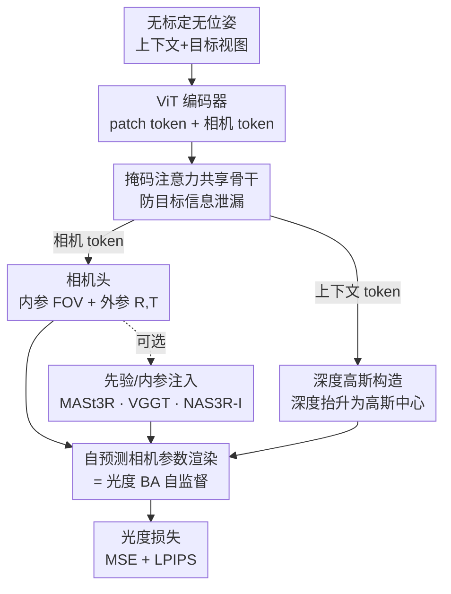

# From None to All: Self-Supervised 3D Reconstruction via Novel View Synthesis

**会议**: CVPR 2026  
**论文**: [CVF Open Access](https://openaccess.thecvf.com/content/CVPR2026/html/Huang_From_None_to_All_Self-Supervised_3D_Reconstruction_via_Novel_View_CVPR_2026_paper.html)  
**代码**: https://ranrhuang.github.io/nas3r/  
**领域**: 3D视觉  
**关键词**: 自监督3D重建, 新视角合成, 3D高斯, 相机位姿估计, 光度BA  

## 一句话总结
NAS3R 是一个**完全自监督**的前馈 3D 重建框架：训练时不用任何真值标注、也不用预训练先验，只靠"用自预测相机参数渲染目标视角再算光度损失"这一信号，就能从无标定、无位姿的多视图里同时学出 3D 高斯、相机内外参和深度，新视角合成质量逼近有监督方法，位姿/深度估计反超多个有监督基线。

## 研究背景与动机
**领域现状**：从 2D 图像同时恢复 3D 结构和相机参数是计算机视觉的终极目标之一。经典做法靠 Bundle Adjustment（BA）等迭代优化；近年的前馈模型（DUSt3R、MASt3R、VGGT）则用 transformer 端到端从大规模带标注 3D 数据直接回归，几乎抛弃了几何后处理。

**现有痛点**：这条数据驱动路线的命门是**真值 3D 数据太贵**——大规模高质量的深度/位姿标注采集成本极高，严重限制了可扩展性。为绕开标注，自监督新视角合成（NVS）方法用"自预测位姿渲染目标视角、强制光度一致"来学，但因为没有真值监督，3D 重建与相机估计之间的**"鸡生蛋"难题**（好重建需要准位姿，准位姿又依赖好重建的几何对应）被进一步放大，训练极易发散或收敛到退化解。

**核心矛盾**：现有自监督方法为了让训练稳下来，几乎都偷偷"作弊"：要么把重建+渲染全放进**隐空间**（如 RayZer）回避显式 3D 优化，但学不出可迁移的相机位姿、也支撑不了几何下游任务；要么基于显式 3D 高斯（3DGS），但**依赖有监督预训练先验**（NoPoSplat/SPFSplat 用 MASt3R 初始化或 DUSt3R 蒸馏伪标签）来保收敛；而且**几乎所有方法仍要求真值相机内参**来 well-condition 训练，这让它们无法扩展到无标定的 in-the-wild 数据。

**本文目标 / 核心 idea**：作者直接发问——一个深度网络能不能**完全**从 2D 图像、在**没有任何真值标注也没有任何预训练先验**的条件下，联合学出显式 3D 几何与相机位姿？NAS3R（"From None to All"）的答案是：把重建头和相机头塞进一个**受掩码注意力约束的共享 transformer**，再用一个**基于深度的高斯构造**把高斯中心牢牢钉在视线射线上、给联合优化一个 well-conditioned 的初始化，让可微 GS 渲染器充当一次"光度 BA"，从而真正从零（None）学到全部（All）3D 量。

## 方法详解

### 整体框架
NAS3R 是一个前馈网络：输入是一组无标定、无位姿的上下文视图 $I_C$（推理时只需这些）；训练时额外喂入目标视图 $I_T$。所有图像被切成 patch token，与一个可学习的相机 token 拼接后过共享 ViT 编码器，再经一个**带掩码注意力的解码器**做跨视图交互，最后由三个并行预测头分别吐出**相机内外参、深度、高斯参数**。深度图通过预测的相机参数被"抬升"成 3D 高斯中心，随后用预测的目标视角相机参数把高斯渲染成目标视图，与真实目标图算光度损失——整条管线端到端训练，没有任何 3D/位姿真值参与。

整体可以这样理解：transformer backbone 用注意力机制抽取跨视图特征对应（相当于隐式做特征匹配），而可微 GS 渲染器则执行一次**光度 Bundle Adjustment**——同一个高斯基元必须在多个视角下产生一致的像素观测，模型为了让渲染图贴近目标图，被迫把相机位姿、内参、深度、高斯参数一起优化对。

### 关键设计

**1. 掩码注意力共享骨干：让重建"看不到答案"，让位姿"看全局"**

自监督 NVS 的训练样本里，目标视图既是监督信号又被一起送进网络，若不加约束，重建高斯时若偷看了目标视图信息，光度损失就会"作弊式"地降低、学不到真几何（target information leakage）。NAS3R 把重建头和相机头放进**同一个 transformer 骨干**（共享编码器+解码器，并行头），靠一套**掩码注意力**精确管控跨视图信息流：上下文 token **只能注意上下文 token**，保证高斯重建完全独立于目标视图；而目标 token **可以同时注意上下文和目标 token**，从而利用全局场景线索把位姿估得更准。形式上对视图 $v$ 有 $G_v = \text{MaskedDecoder}(F_v, F_{1:K})$，其中上下文视图 $K=V_C$、目标视图 $K=V$。共享骨干的好处是相机预测和重建被迫学到一致的联合特征表示，而不是两个互相打架的独立模块。

**2. 基于深度的局部到全局高斯构造：给"鸡生蛋"优化一个 well-conditioned 起点**

高斯中心 $\mu \in \mathbb{R}^3$ 怎么定，是自监督能否收敛的关键。已有方法多用**canonical-space 范式**直接回归标准空间 3D 点作为高斯中心，但这些点是相机位姿、内参、深度三者隐式组合出来的、训练时没有显式约束，随机初始化时根本学不动，所以才不得不靠预训练先验初始化或 DUSt3R 蒸馏来"热身"。NAS3R 改用 **local-to-global 范式**：用一个 DPT 深度头从精修后的上下文 token 预测每像素深度，经 sigmoid 并在近/远平面间线性插值得到深度图 $D_v$，再用预测的相机参数 $P_v, K_v$ 把深度**抬升**到 3D 空间确定高斯中心。这个构造把高斯中心**紧紧约束在输入视线射线上**，是物理上有依据、well-conditioned 的，比 canonical-space 提供了更强的几何约束，因此能在**不靠任何先验**的情况下稳定收敛——这正是 NAS3R 敢称 "From None" 的技术底气。

**3. 自预测相机参数渲染 = 光度 BA 的自监督闭环**

NAS3R 完全没有位姿/内参真值，监督信号只能来自图像本身。它的做法是：相机头预测出每个视角的内参（用 FOV 参数化，x/y 同 FOV、主点居中）和相对于首帧的外参 $P_v=[R_v|T_v]$，然后用这些**自预测**的目标视角相机参数把重建好的高斯渲染成 $\hat I_T$，与真实目标图算损失：

$$\mathcal{L}_{render} = \frac{1}{V_T}\sum \lVert I - \hat I\rVert^2 + \gamma\,\text{LPIPS}(I, \hat I)$$

关键在于这套渲染由**支持对相机位姿和内参求梯度的 CUDA 版可微 3DGS 渲染器**实现，因此整条 loss 反传时会同时优化位姿、内参、深度、高斯参数——等价于强迫"同一高斯基元在多视角下产生一致像素观测"，这正是一次端到端、可学习的**光度 Bundle Adjustment**。模型由此真正"只靠视图一致性"学几何。为了让这个高度非凸的优化别一开始就崩，相机头被**初始化为输出单位位姿、焦距等于输入图像尺寸**，配合设计 2 的 well-conditioned 高斯构造，共同保证稳定收敛。

**4. 与 SOTA 架构兼容、按需注入先验/内参：从 None 到 All 的可选档位**

NAS3R 的自监督范式不是"另起炉灶"，而是能**无缝套到现有 SOTA 3D 模型**上：对 VGGT，给其解码器加掩码注意力、再补一个高斯参数头，其余原样保留；对 3R 系（MASt3R 多视图扩展），额外接深度头、高斯参数头和相机头（相机头是 3 层 MLP，旋转用 6D 表示、平移用 4 维齐次坐标）。当有预训练权重时，可直接用 MASt3R/VGGT 初始化（NAS3R(MASt3R)/NAS3R(VGGT)）换取更高精度；当相机内参可从传感器元数据拿到时，把内参经线性层嵌入、与相机 token 和编码器 token 拼接喂进解码器（记作 NAS3R-I），用以缓解尺度歧义、进一步稳住优化。这一设计让同一框架覆盖了"零先验/有先验/有内参"全谱——也就是论文标题里的 "to All"，给把有监督大模型扩展到大规模无标注数据提供了一条实用路径。

### 损失函数 / 训练策略
- 唯一训练目标就是上式光度一致性损失 $\mathcal{L}_{render}$（MSE + $\gamma\cdot$LPIPS），端到端优化，无任何 3D/位姿监督。
- 上下文帧间隔在训练中**逐步增大**（由易到难的课程），相机头初始化为单位位姿+焦距等于图像尺寸；单张 A100 训练，VGGT 变体用 224×224、MASt3R 变体用 256×256 分辨率，默认 backbone 为 VGGT、默认 2 视图输入，假设同场景各视图共享同一内参。

## 实验关键数据

### 主实验
**无先验两视图新视角合成**（训练于 RE10K，跨域 zero-shot 测试；自监督方法中最优加粗，⭐表示随机初始化变体）：

| 数据集 | 指标 | NAS3R | SPFSplat⁎(自监督SOTA) | SelfSplat | MVSplat(有监督) |
|--------|------|-------|------------|-----------|------------------|
| RE10K | PSNR↑ | **23.130** | 21.306 | 19.152 | 24.012 |
| RE10K | LPIPS↓ | **0.193** | 0.248 | 0.328 | 0.175 |
| ACID | PSNR↑ | **25.030** | 23.354 | 22.204 | 25.525 |
| DTU | PSNR↑ | **15.229** | 14.042 | 13.249 | 14.542 |
| DTU | LPIPS↓ | **0.317** | 0.426 | 0.441 | 0.324 |

在完全不用真值位姿/内参的前提下，NAS3R 全面碾压其它自监督方法，且在多数场景**逼近甚至反超**有监督的 pixelSplat/MVSplat（如 DTU 上 PSNR 反超）。

**两视图相对位姿估计**（AUC %，RE10K 训练后 zero-shot）：

| 方法 | RE10K Overall@10° | RE10K Overall@20° | DL3DV Overall@10° |
|------|-------------------|-------------------|-------------------|
| SP+SG（有监督特征匹配） | 40.6 | 56.9 | 37.2 |
| SelfSplat | 18.4 | 31.8 | 6.1 |
| SPFSplat⁎ | 23.9 | 39.8 | 7.1 |
| **NAS3R** | **51.0** | **64.9** | **20.5** |

位姿提升尤为夸张：在最难的 DL3DV 上把自监督基线的个位数 AUC 拉到 20+，甚至在 RE10K 上**反超有监督训练的 SuperPoint+SuperGlue**，说明它在自监督设置下建立了很强的特征对应能力。

### 消融实验

**深度估计**（BlendedMVS，验证"基于深度的高斯构造"价值）：

| 方法 | rel↓ | τ↑ |
|------|------|------|
| MVSplat（有监督，带 cost volume） | 0.405 | 54.0 |
| NoPoSplat（有监督） | 0.508 | 34.1 |
| SPFSplat⁎ | 0.255 | 60.3 |
| **NAS3R** | **0.206** | **71.4** |

无任何 3D 归纳偏置的标准 transformer，纯靠图像级监督学出的深度反超带 cost volume 的有监督 MVSplat。

**数据规模与输入视图数缩放**：

| 配置 | NVS PSNR↑ | Pose@20°↑ | Depth rel↓ |
|------|-----------|-----------|------------|
| RE10K | 15.146 | 34.1 | 0.206 |
| RE10K+DL3DV | 16.316 | 41.6 | 0.145 |
| 2 视图 | 23.130 | 64.9 | — |
| 10 视图 | 27.093 | 75.5 | — |

数据越多、视图越多，NVS/位姿/深度三项稳定齐涨，印证"无需标注 → 天然可扩展到大规模无标注数据"的卖点。

**自监督预训练助力下游微调**（BlendedMVS）：

| 设置 | Depth rel↓ | Pose@20°↑ |
|------|-----------|-----------|
| (1) 仅自监督(NAS3R) | 0.145 | 66.8 |
| (2) 从零有监督训练 | 0.177 | 39.4 |
| (3) 从(1)权重有监督微调 | **0.119** | **71.3** |

### 关键发现
- **深度构造（设计 2）是收敛能否"脱离先验"的胜负手**：正是把高斯中心钉在视线射线上的 well-conditioned 初始化，让 NAS3R 在随机初始化、零先验下也能稳定收敛——而 canonical-space 方法在同样条件下需要预训练先验热身。
- **位姿提升幅度 > NVS 提升幅度**：相对像素级渲染，自预测位姿的几何收益更显著，甚至追平/反超有监督 SfM 方法，说明光度 BA 闭环真正学到了可迁移的几何对应。
- **注入先验/内参单调增益**：NAS3R(VGGT/MASt3R) 在有先验设置下 NVS/位姿均超过用于初始化的 VGGT/MASt3R 本身；再给真值内参（NAS3R-I）进一步缓解尺度歧义、稳定优化，验证了"从 None 到 All"全谱档位都有效。
- **自监督权重是强初始化**：从 NAS3R 自监督权重再做有监督微调，深度/位姿都明显优于从零有监督训练，自监督预训练价值得到证实。

## 亮点与洞察
- **"NVS = 3D 空间里的广义掩码建模"这一视角很漂亮**：把"从已观测上下文重建未观测目标视图"类比成 masked modeling，光度一致性自然成了自监督信号，为整套设计提供了清晰的概念支点。
- **掩码注意力的双向不对称设计（设计 1）是防泄漏的点睛之笔**：上下文只看上下文、目标可看全局，一招同时解决了"重建别偷看答案"和"位姿要看全局"两个相反需求，是可迁移到其它"训练时输入含监督信号"任务的通用 trick。
- **把可微 GS 渲染器显式解读为"可学习的光度 BA"**，把经典几何优化和深度学习前馈范式接上了榫卯，这个洞察对理解"为什么自监督能学出几何"很有启发。
- **"零先验也能从无标定 in-the-wild 数据学 3D"**真正打开了用海量无标注视频/图像扩展 3D 大模型的口子，是本文最让人"啊哈"的地方。

## 局限与展望
- 作者承认：因缺乏真值监督，加上 3DGS 本身在恢复**精确表面几何**上的固有局限，要拿到高质量深度重建，仍需用真值深度做额外微调。
- 框架尚未在真正大规模、更多样的数据上训练，作者把"扩到更大更杂数据以进一步提升泛化"列为未来工作。
- ⚠️（自己观察）实验主要在两视图 NVS 基准与有限的几个数据集上验证，2-10 视图缩放虽呈正趋势，但更长序列/大基线、动态场景下"自预测位姿+光度 BA"是否仍稳定收敛，论文未充分压力测试。
- ⚠️ 内参参数化假设 x/y 同 FOV、主点居中，对强畸变或非中心主点的真实相机可能引入系统偏差。

## 相关工作与启发
- **vs NoPoSplat / SPFSplat（自监督但依赖先验）**: 它们虽 pose-free，但要靠 MASt3R 初始化或 DUSt3R 点云蒸馏热身、且仍需真值内参；NAS3R 用基于深度的 well-conditioned 高斯构造替掉先验依赖、并把内参也一起预测，做到真正的"零先验、零标注、无标定"。
- **vs SelfSplat（不用有监督先验）**: SelfSplat 仍依赖自监督 CroCoV2 初始化、且训练需真值内参；NAS3R 连这两样都不要，位姿/深度指标全面反超。
- **vs RayZer（隐空间自监督）**: RayZer 在隐空间渲染回避显式 3D 优化、渲染逼真但学不出可迁移位姿、也支撑不了几何下游任务；NAS3R 走显式 3DGS 路线，重建出真几何、位姿可迁移、可作下游强初始化。
- **vs DUSt3R / MASt3R / VGGT（有监督前馈）**: 它们靠大规模真值 3D 数据端到端回归，扩展性受限于标注成本；NAS3R 不仅自监督，还能把这些模型当 backbone 套上自己的范式，给"把有监督大模型扩展到无标注数据"提供现成通道。

## 评分
- 新颖性: ⭐⭐⭐⭐⭐ 首个完全零先验、零标注、无标定的自监督联合 3D 重建+相机估计框架，"From None to All" 范式干净有力。
- 实验充分度: ⭐⭐⭐⭐⭐ NVS/位姿/深度三任务 + 多数据集跨域 + 数据/视图缩放 + 下游微调，覆盖全面、对比基线扎实。
- 写作质量: ⭐⭐⭐⭐ 动机递进清晰、对"鸡生蛋"难题与先验依赖的剖析到位；个别公式与图注排版稍密。
- 价值: ⭐⭐⭐⭐⭐ 真正打开用海量无标注数据扩展 3D 大模型的路径，对自监督 3D 重建社区影响潜力大。

<!-- RELATED:START -->

## 相关论文

- [\[CVPR 2026\] WildRayZer: Self-supervised Large View Synthesis in Dynamic Environments](wildrayzer_self-supervised_large_view_synthesis_in_dynamic_environments.md)
- [\[CVPR 2026\] SmokeSVD: Smoke Reconstruction from A Single View via Progressive Novel View Synthesis and Refinement with Diffusion Models](smokesvd_smoke_reconstruction_from_a_single_view_via_progressive_novel_view_synt.md)
- [\[ICCV 2025\] RayZer: A Self-supervised Large View Synthesis Model](../../ICCV2025/3d_vision/rayzer_a_self-supervised_large_view_synthesis_model.md)
- [\[CVPR 2026\] GeodesicNVS: Probability Density Geodesic Flow Matching for Novel View Synthesis](geodesicnvs_probability_density_geodesic_flow_matching_for_novel_view_synthesis.md)
- [\[CVPR 2026\] RF4D: Neural Radar Fields for Novel View Synthesis in Outdoor Dynamic Scenes](rf4dneural_radar_fields_for_novel_view_synthesis_in_outdoor_dynamic_scenes.md)

<!-- RELATED:END -->
